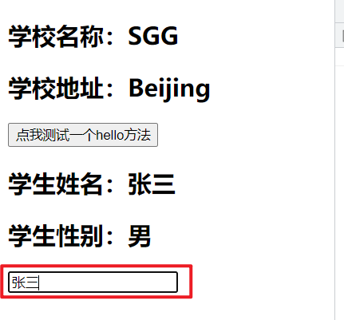
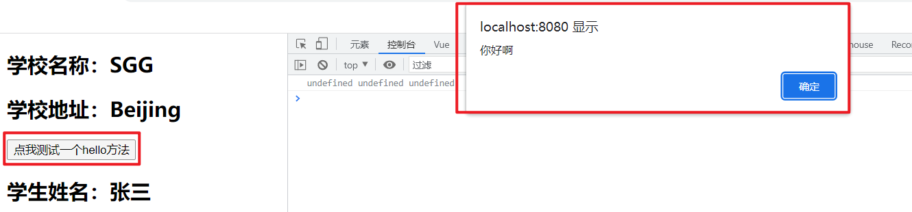

# 插件

------

## 1. 插件

Vue中自定义的插件，插件就是包含install方法的一个对象，install的第一个参数是Vue()，第二个以后的参数是插件使用者传递的数据，插件对象中的install方法会被vue自动调用。

使用插件能够增强vue的功能

## 2. 插件的定义

> 在src文件夹下创建plugins.js文件，用于自定义插件
> 

plugins.js

```js
export default {
	// 使用插件时，vue会自动将Vue()[vue实例对象的构造函数]传入
	// x,y,z 为其他自己传入的参数
	install(Vue,x,y,z){
		console.log(x,y,z)
		//全局过滤器
		Vue.filter('mySlice',function(value){
			return value.slice(0,4)
		})

		//定义全局指令
		Vue.directive('fbind',{
			//指令与元素成功绑定时（一上来）
			bind(element,binding){
				element.value = binding.value
			},
			//指令所在元素被插入页面时
			inserted(element,binding){
				element.focus()
			},
			//指令所在的模板被重新解析时
			update(element,binding){
				element.value = binding.value
			}
		})

		//定义混入
		Vue.mixin({
			data() {
				return {
					x:100,
					y:200
				}
			},
		})

		//给Vue原型上添加一个方法（vm和vc就都能用了）
		Vue.prototype.hello = ()=>{alert('你好啊')}
	}
}
```

## 3. 插件的使用

使用插件时，先导入对应的插件，使用`Vue.use()`方法使用对应的插件。

main.js

```js
//引入Vue
import Vue from 'vue'
//引入App组件，它是所有组件的父组件
import App from './App.vue'
// 导入插件
import plugins from './plugins.js'

//关闭vue的生产提示
Vue.config.productionTip = false

// 使用插件
Vue.use(plugins)

//创建Vue实例对象---vm
new Vue({
  // 将App组件放入容器中
  render: h => h(App),
// 指定vue控制的容器
}).$mount('#app')
```

App.vue

```html
<template>
  <div>
    <School></School>
    <Student></Student>
  </div>
</template>

<script>
// 导入子组件
import School from './components/School.vue'
import Student from './components/Student.vue'

export default {
  name: 'App',
  components: {
    School,
    Student
  }
}
</script>

<style>
</style>
```

School.vue

```html
<template>
	<div>
		<!-- 能够使用插件里的全局过滤器 -->
		<h2>学校名称：{{name | mySlice}}</h2>
		<h2>学校地址：{{address}}</h2>
		<button @click="test">点我测试一个hello方法</button>
	</div>
</template>

<script>
	export default {
		name:'School',
		data() {
			return {
				name:'SGG',
				address:'Beijing',
			}
		},
		methods: {
			test(){
				this.hello()
			}
		},
	}
</script>
```

Student.vue

```html
<template>
	<div>
		<h2>学生姓名：{{name}}</h2>
		<h2>学生性别：{{sex}}</h2>
        <!-- 能够使用插件里的全局自定义指令 -->
		<input type="text" v-fbind:value="name">
	</div>
</template>

<script>
	export default {
		name:'Student',
		data() {
			return {
				name:'张三',
				sex:'男'
			}
		},
	}
</script>
```

> 
> 

