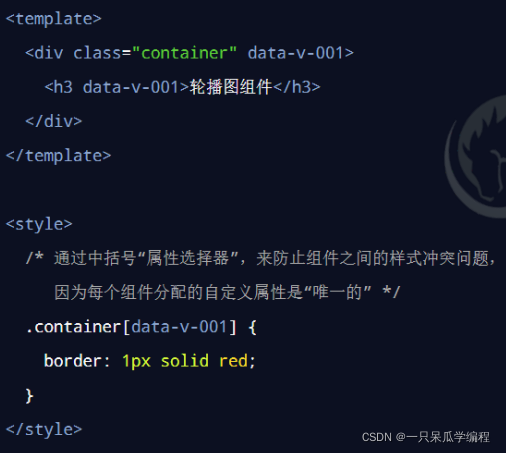
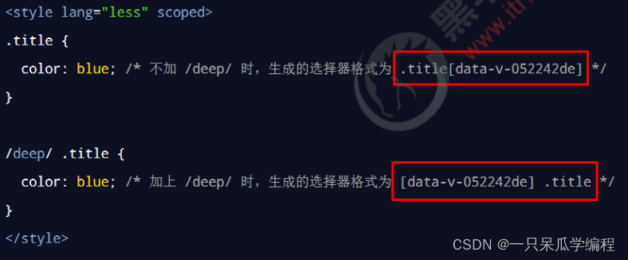

# scoped 组件间的样式冲突

------

## 1. 组件之间的样式冲突问题

默认情况下，写在 .vue 组件中的样式会全局生效，因此很容易造成多个组件之间的样式冲突问题。

导致组件之间样式冲突的根本原因是：

> ① 单页面应用程序中，所有组件的 DOM 结构，都是基于唯一的 index.html 页面进行呈现的
> ② 每个组件中的样式，都会影响整个 index.html 页面中的 DOM 元素

### 1.1 如何解决组件样式冲突的问题

为每个组件分配唯一的自定义属性，在编写组件样式时，通过属性选择器来控制样式的作用域，示例代码如下：


### 1.2 style 节点的 scoped 属性

为了提高开发效率和开发体验，vue 为 style 节点提供了 scoped 属性，从而防止组件之间的样式冲突问题：

```html
<template>
  <div>
    <h3 class="title">这是 List.vue 组件</h3>

    <p>这是 List.vue 中的 p 标签</p>
    <p>这是 List.vue 中的 p 标签</p>
  </div>
</template>

<script>
export default {
  name: 'MyList',
}
</script>

<style lang="less" scoped>
</style>
<template>
  <div>
    <h1>这是 App.vue 组件</h1>

    <p>App 中的 p 标签</p>
    <p>App 中的 p 标签</p>

    <hr />

    <my-list></my-list>
  </div>
</template>

<script>
import MyList from './List.vue'

export default {
  name: 'MyApp',
  components: {
    MyList,
  },
}
</script>

<style lang="less" scoped>
p {
  color: red;
}
</style>
```

## 2. /deep/ 样式穿透

如果给当前组件的 style 节点添加了 scoped 属性，则当前组件的样式对其子组件是不生效的。

如果想让某些样式对子组件生效，可以使用 /deep/ 深度选择器。

**注意：**
/deep/ 是 vue2.x 中实现样式穿透的方案。在 vue3.x 中推荐使用 :deep() 替代 /deep/。



```html
<template>
  <div>
    <h3 class="title">这是 List.vue 组件</h3>
    <p>这是 List.vue 中的 p 标签</p>
    <p>这是 List.vue 中的 p 标签</p>
  </div>
</template>

<script>
export default {
  name: 'MyList',
}
</script>

<style lang="less" scoped>
</style>
<template>
  <div>
    <h1>这是 App.vue 组件</h1>

    <p>App 中的 p 标签</p>
    <p>App 中的 p 标签</p>

    <hr />

    <my-list></my-list>
  </div>
</template>

<script>
import MyList from './List.vue'

export default {
  name: 'MyApp',
  components: {
    MyList,
  },
}
</script>

<style lang="less" scoped>
p {
  color: red;
}

// /deep/ .title {
//   color: blue;
// }

:deep(.title) {
  color: blue;
}
</style>
```

## 3. 让 style 中支持 less 语法

如果希望使用 less 语法编写组件的 style 样式，可以按照如下两个步骤进行配置：

> ① 运行 `npm install less -D` 命令安装依赖包，从而提供 less 语法的编译支持
>
> ② 在 `<style>`标签上添加 lang=“less” 属性，即可使用 less 语法编写组件的样式

```html
<style lang="less" scoped>
  h1 {
    color: aquamarine;
    span {
      color: aqua;
    }
  }
</style>
```

