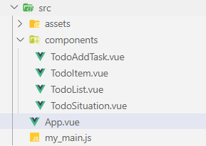
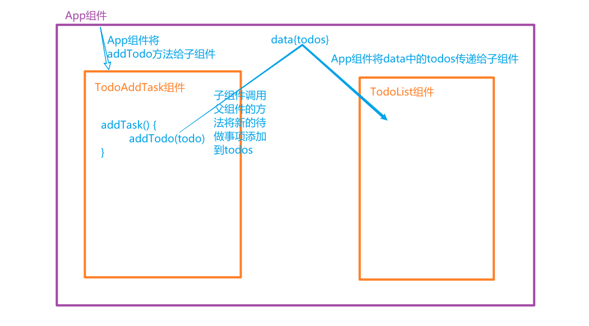
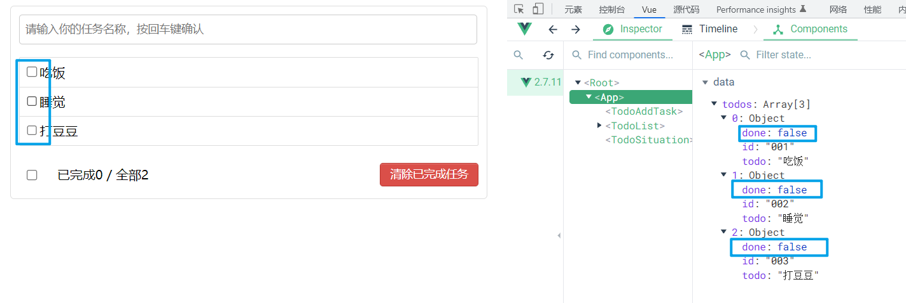
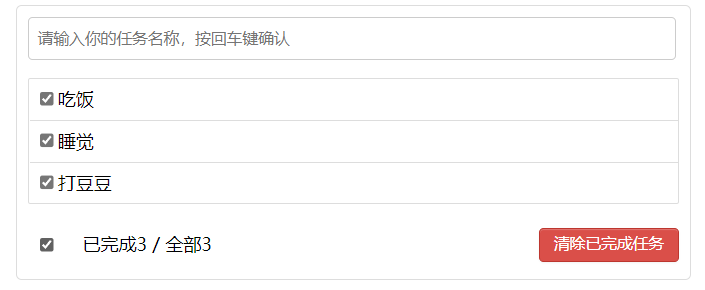
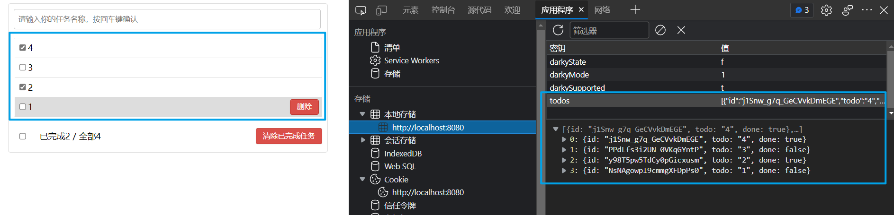
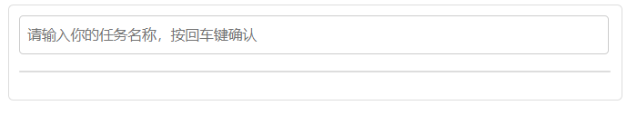
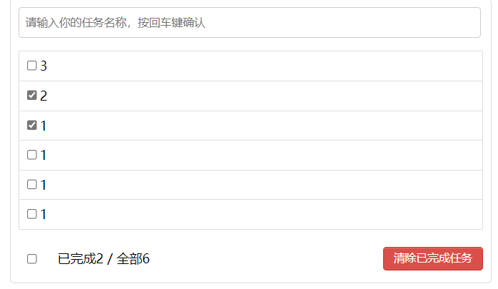
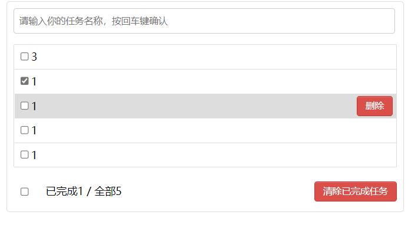
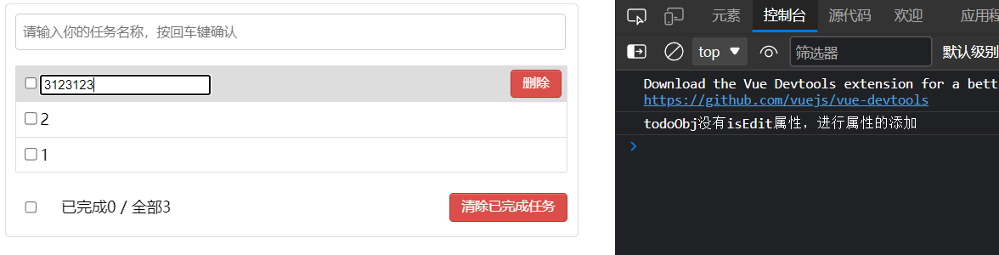

# TodoList 案例

------

## 1. 组件化编码流程（通用）

1. 实现静态组件：抽取组件，使用组件实现静态页面效果
2. 展示动态数据：
   - 数据的类型、名称是什么？
   - 数据保存在哪个组件？
3. 交互——从绑定事件监听开始

## 2. 页面组件的划分




## 3. 静态页面代码

```vue
<!doctype html>
<html lang="en">
<head>
  <meta charset="utf-8">
  <title>React App</title>

  <link rel="stylesheet" href="index.css">
</head>
<body>
<div id="root">
  <div class="todo-container">
    <div class="todo-wrap">
      <div class="todo-header">
        <input type="text" placeholder="请输入你的任务名称，按回车键确认"/>
      </div>
      <ul class="todo-main">
        <li>
          <label>
            <input type="checkbox"/>
            <span>xxxxx</span>
          </label>
          <button class="btn btn-danger" style="display:none">删除</button>
        </li>
        <li>
          <label>
            <input type="checkbox"/>
            <span>yyyy</span>
          </label>
          <button class="btn btn-danger" style="display:none">删除</button>
        </li>
      </ul>
      <div class="todo-footer">
        <label>
          <input type="checkbox"/>
        </label>
        <span>
          <span>已完成0</span> / 全部2
        </span>
        <button class="btn btn-danger">清除已完成任务</button>
      </div>
    </div>
  </div>
</div>

</body>
</html>
/*base*/
body {
  background: #fff;
}

.btn {
  display: inline-block;
  padding: 4px 12px;
  margin-bottom: 0;
  font-size: 14px;
  line-height: 20px;
  text-align: center;
  vertical-align: middle;
  cursor: pointer;
  box-shadow: inset 0 1px 0 rgba(255, 255, 255, 0.2), 0 1px 2px rgba(0, 0, 0, 0.05);
  border-radius: 4px;
}

.btn-danger {
  color: #fff;
  background-color: #da4f49;
  border: 1px solid #bd362f;
}

.btn-danger:hover {
  color: #fff;
  background-color: #bd362f;
}

.btn:focus {
  outline: none;
}

.todo-container {
  width: 600px;
  margin: 0 auto;
}
.todo-container .todo-wrap {
  padding: 10px;
  border: 1px solid #ddd;
  border-radius: 5px;
}

/*header*/
.todo-header input {
  width: 560px;
  height: 28px;
  font-size: 14px;
  border: 1px solid #ccc;
  border-radius: 4px;
  padding: 4px 7px;
}

.todo-header input:focus {
  outline: none;
  border-color: rgba(82, 168, 236, 0.8);
  box-shadow: inset 0 1px 1px rgba(0, 0, 0, 0.075), 0 0 8px rgba(82, 168, 236, 0.6);
}

/*main*/
.todo-main {
  margin-left: 0px;
  border: 1px solid #ddd;
  border-radius: 2px;
  padding: 0px;
}

.todo-empty {
  height: 40px;
  line-height: 40px;
  border: 1px solid #ddd;
  border-radius: 2px;
  padding-left: 5px;
  margin-top: 10px;
}
/*item*/
li {
  list-style: none;
  height: 36px;
  line-height: 36px;
  padding: 0 5px;
  border-bottom: 1px solid #ddd;
}

li label {
  float: left;
  cursor: pointer;
}

li label li input {
  vertical-align: middle;
  margin-right: 6px;
  position: relative;
  top: -1px;
}

li button {
  float: right;
  display: none;
  margin-top: 3px;
}

li:before {
  content: initial;
}

li:last-child {
  border-bottom: none;
}

/*footer*/
.todo-footer {
  height: 40px;
  line-height: 40px;
  padding-left: 6px;
  margin-top: 5px;
}

.todo-footer label {
  display: inline-block;
  margin-right: 20px;
  cursor: pointer;
}

.todo-footer label input {
  position: relative;
  top: -1px;
  vertical-align: middle;
  margin-right: 5px;
}

.todo-footer button {
  float: right;
  margin-top: 5px;
}
```

## 4. 静态页面组件化拆分

App.vue

```html
<template>
  <div class="todo-container">
    <div class="todo-wrap">
      <TodoAddTask></TodoAddTask>
      <TodoList></TodoList>
      <TodoSituation></TodoSituation>
    </div>
  </div>
</template>

<script>
// 导入子组件
import TodoAddTask from './components/TodoAddTask.vue'
import TodoList from './components/TodoList.vue'
import TodoSituation from './components/TodoSituation.vue'

export default {
  name: 'App',
  components: { TodoAddTask, TodoList, TodoSituation }
}
</script>

<style>
/*base*/
body {
  background: #fff;
}

.btn {
  display: inline-block;
  padding: 4px 12px;
  margin-bottom: 0;
  font-size: 14px;
  line-height: 20px;
  text-align: center;
  vertical-align: middle;
  cursor: pointer;
  box-shadow: inset 0 1px 0 rgba(255, 255, 255, 0.2), 0 1px 2px rgba(0, 0, 0, 0.05);
  border-radius: 4px;
}

.btn-danger {
  color: #fff;
  background-color: #da4f49;
  border: 1px solid #bd362f;
}

.btn-danger:hover {
  color: #fff;
  background-color: #bd362f;
}

.btn:focus {
  outline: none;
}

.todo-container {
  width: 600px;
  margin: 0 auto;
}
.todo-container .todo-wrap {
  padding: 10px;
  border: 1px solid #ddd;
  border-radius: 5px;
}
</style>
```

TodoAddTask.vue

```html
<template>
  <div class="todo-header">
    <input type="text" placeholder="请输入你的任务名称，按回车键确认" />
  </div>
</template>

<script>
export default {
  name: 'TodoAddTask'
}
</script>

<style scoped>
/*header*/
.todo-header input {
  width: 560px;
  height: 28px;
  font-size: 14px;
  border: 1px solid #ccc;
  border-radius: 4px;
  padding: 4px 7px;
}

.todo-header input:focus {
  outline: none;
  border-color: rgba(82, 168, 236, 0.8);
  box-shadow: inset 0 1px 1px rgba(0, 0, 0, 0.075), 0 0 8px rgba(82, 168, 236, 0.6);
}
</style>
```

TodoList.vue

```html
<template>
  <ul class="todo-main">
    <TodoItem></TodoItem>    
    <TodoItem></TodoItem>    
    <TodoItem></TodoItem>    
  </ul>
</template>

<script>
// 导入子组件
import TodoItem from './TodoItem.vue'

export default {
  name: 'TodoList',
  components: {TodoItem}
}
</script>

<style scoped>
/*main*/
.todo-main {
  margin-left: 0px;
  border: 1px solid #ddd;
  border-radius: 2px;
  padding: 0px;
}

.todo-empty {
  height: 40px;
  line-height: 40px;
  border: 1px solid #ddd;
  border-radius: 2px;
  padding-left: 5px;
  margin-top: 10px;
}
</style>
```

TodoItem.vue

```html
<template>
  <li>
    <label>
      <input type="checkbox" />
      <span>xxxxx</span>
    </label>
    <button class="btn btn-danger" style="display:none">删除</button>
  </li>
</template>

<script>
export default {
  name: 'TodoItem'
}
</script>

<style scoped>
/*item*/
li {
  list-style: none;
  height: 36px;
  line-height: 36px;
  padding: 0 5px;
  border-bottom: 1px solid #ddd;
}

li label {
  float: left;
  cursor: pointer;
}

li label li input {
  vertical-align: middle;
  margin-right: 6px;
  position: relative;
  top: -1px;
}

li button {
  float: right;
  display: none;
  margin-top: 3px;
}

li:before {
  content: initial;
}

li:last-child {
  border-bottom: none;
}
</style>
```

TodoSituation.vue

```html
<template>
  <div class="todo-footer">
    <label>
      <input type="checkbox" />
    </label>
    <span>
      <span>已完成0</span> / 全部2
    </span>
    <button class="btn btn-danger">清除已完成任务</button>
  </div>
</template>

<script>
export default {
  name: 'TodoSituation'
}
</script>

<style scoped>
/*footer*/
.todo-footer {
  height: 40px;
  line-height: 40px;
  padding-left: 6px;
  margin-top: 5px;
}

.todo-footer label {
  display: inline-block;
  margin-right: 20px;
  cursor: pointer;
}

.todo-footer label input {
  position: relative;
  top: -1px;
  vertical-align: middle;
  margin-right: 5px;
}

.todo-footer button {
  float: right;
  margin-top: 5px;
}
</style>
```

> 

## 5. 初始化数据列表

TodoList.vue

```html
<template>
  <ul class="todo-main">
    <TodoItem 
      v-for="todo in todos" 
      :key="todo.id" 
      :todoObj="todo"
    ></TodoItem>    
  </ul>
</template>

<script>
// 导入子组件
import TodoItem from './TodoItem.vue'

export default {
  name: 'TodoList',
  components: {TodoItem},
  data() {
    return {
      todos: [
        {id: '001', todo: '吃饭', done: true},
        {id: '002', todo: '睡觉', done: false},
        {id: '003', todo: '打豆豆', done: true}
      ]
    }
  },
}
</script>

<style scoped>
/*main*/
.todo-main {
  margin-left: 0px;
  border: 1px solid #ddd;
  border-radius: 2px;
  padding: 0px;
}

.todo-empty {
  height: 40px;
  line-height: 40px;
  border: 1px solid #ddd;
  border-radius: 2px;
  padding-left: 5px;
  margin-top: 10px;
}
</style>
```

TodoItem.vue

```html
<template>
  <li>
    <label>
      <!-- 使用v-bind绑定checked属性，true则有这个属性，false无这个属性 -->
      <input type="checkbox" :checked="todoObj.done"/>
      <span>{{todoObj.todo}}</span>
    </label>
    <button class="btn btn-danger" style="display:none">删除</button>
  </li>
</template>

<script>
export default {
  name: 'TodoItem',
  props: ['todoObj']
}
</script>

<style scoped>
/*item*/
li {
  list-style: none;
  height: 36px;
  line-height: 36px;
  padding: 0 5px;
  border-bottom: 1px solid #ddd;
}

li label {
  float: left;
  cursor: pointer;
}

li label li input {
  vertical-align: middle;
  margin-right: 6px;
  position: relative;
  top: -1px;
}

li button {
  float: right;
  display: none;
  margin-top: 3px;
}

li:before {
  content: initial;
}

li:last-child {
  border-bottom: none;
}
</style>
```

> 

## 6. 添加列表数据

> 随机生成id，使用`nanoid`，安装`nanoid`，`npm i nanoid`
> 导入`nanoid`，`import {nanoid} from nanoid`
> 使用`nanoid`，`nanoid()`会返回一个唯一的字符串

> 修改列表数据的存放位置为App.vue，便于数据的添加。

> 当前数据的传递方式
> 添加数据：
> App组件将添加待做事项的方法传递给TodoAddTask组件，TodoAddTask组件调用父组件传递过来的方法添加待做事项，由于方法真正存在的位置为App组件，相当于TodoAddTask组件只是拥有方法的使用权。
> 

App.vue

```html
<template>
  <div class="todo-container">
    <div class="todo-wrap">
      <!-- 将添加待做事项的方法传入子组件中 -->
      <TodoAddTask :addTodo="addTodo"></TodoAddTask>
      <TodoList :todos="todos"></TodoList>
      <TodoSituation></TodoSituation>
    </div>
  </div>
</template>

<script>
// 导入子组件
import TodoAddTask from './components/TodoAddTask.vue'
import TodoList from './components/TodoList.vue'
import TodoSituation from './components/TodoSituation.vue'

export default {
  name: 'App',
  components: { TodoAddTask, TodoList, TodoSituation },
  data() {
    return {
      todos: [
        {id: '001', todo: '吃饭', done: true},
        {id: '002', todo: '睡觉', done: false},
        {id: '003', todo: '打豆豆', done: true}
      ]
    }
  },
  methods: {
    // 将新的待做事项添加到列表中
    addTodo(todo) {
      this.todos.unshift(todo)
    }
  },
}
</script>
```

TodoList.vue

```html
<template>
  <ul class="todo-main">
    <!-- 将每个待做事项传入TodoItem -->
    <TodoItem 
      v-for="todo in todos" 
      :key="todo.id" 
      :todoObj="todo"
    ></TodoItem>    
  </ul>
</template>

<script>
// 导入子组件
import TodoItem from './TodoItem.vue'

export default {
  name: 'TodoList',
  components: {TodoItem},
  props: ['todos']
}
</script>
```

TodoAddTask.vue

```html
<template>
  <div class="todo-header">
    <input 
      type="text" 
      placeholder="请输入你的任务名称，按回车键确认"
      v-model="task"
      @keydown.enter="addTask"
    />
  </div>
</template>

<script>
// 导入nanoid 
import {nanoid} from 'nanoid'

export default {
  name: 'TodoAddTask',
  props: ['addTodo'],
  data() {
    return {
      task: ''
    }
  },
  methods: {
    addTask() {
      // 没有输入不进行添加
      if (!this.task) return
      // console.log(this.task)
      // 新的待做事项
      const todo = {
        id: nanoid(),
        todo: this.task,
        done: false
      }
      // 添加待做事项
      this.addTodo(todo)
      // 输入框清空
      this.task = ''
    }
  }
}
</script>
```

> 

## 7. 勾选

> 由于数据在App组件中，所以修改数据中完成状态的方法也写在App组件中，然后将方法传递给子组件调用，子组件调用方法修改勾选状态。

App.vue

```html
<template>
  <div class="todo-container">
    <div class="todo-wrap">
      <!-- 将添加待做事项的方法传入子组件中 -->
      <TodoAddTask :addTodo="addTodo"></TodoAddTask>
      <!-- 将数据和方法传入子组件 -->
      <TodoList 
        :todos="todos"
        :changeDone="changeDone"
      ></TodoList>
      <TodoSituation></TodoSituation>
    </div>
  </div>
</template>

<script>
// 导入子组件
import TodoAddTask from './components/TodoAddTask.vue'
import TodoList from './components/TodoList.vue'
import TodoSituation from './components/TodoSituation.vue'

export default {
  name: 'App',
  components: { TodoAddTask, TodoList, TodoSituation },
  data() {
    return {
      todos: [
        {id: '001', todo: '吃饭', done: true},
        {id: '002', todo: '睡觉', done: false},
        {id: '003', todo: '打豆豆', done: true}
      ]
    }
  },
  methods: {
    // 将新的待做事项添加到列表中
    addTodo(todo) {
      this.todos.unshift(todo)
    },
    // 修改待做事项的勾选状态
    changeDone(id) {
      this.todos.forEach((todo)=>{
        if (todo.id === id) todo.done = !todo.done
      })
    }
  },
}
</script>
```

TodoList.vue

```html
<template>
  <ul class="todo-main">
    <!-- 将每个待做事项传入TodoItem -->
    <!-- 将方法传递给子组件 -->
    <TodoItem 
      v-for="todo in todos" 
      :key="todo.id" 
      :todoObj="todo"
      :changeDone="changeDone"
    ></TodoItem>    
  </ul>
</template>

<script>
// 导入子组件
import TodoItem from './TodoItem.vue'

export default {
  name: 'TodoList',
  components: {TodoItem},
  props: ['todos', 'changeDone']
}
</script>
```

TodoItem.vue

```html
<template>
  <li>
    <label>
      <!-- 使用v-bind绑定checked属性，true则有这个属性，false无这个属性 -->
      <input type="checkbox" :checked="todoObj.done" @click="changeChecked"/>
      <span>{{todoObj.todo}}</span>
    </label>
    <button class="btn btn-danger" style="display:none">删除</button>
  </li>
</template>

<script>
export default {
  name: 'TodoItem',
  props: ['todoObj', 'changeDone'],
  methods: {
    // 修改勾选状态
    changeChecked() {
      this.changeDone(this.todoObj.id)
    }
  },
}
</script>

<style scoped>
/*item*/
li {
  list-style: none;
  height: 36px;
  line-height: 36px;
  padding: 0 5px;
  border-bottom: 1px solid #ddd;
}

li label {
  float: left;
  cursor: pointer;
}

li label li input {
  vertical-align: middle;
  margin-right: 6px;
  position: relative;
  top: -1px;
}

li button {
  float: right;
  display: none;
  margin-top: 3px;
}

li:before {
  content: initial;
}

li:last-child {
  border-bottom: none;
}
</style>
```

> 

## 8. 删除

鼠标悬浮，对应的item项背景颜色改变，删除按钮显示。

TodoItem.vue

```css
li:hover {
  background-color: #ddd;
}

li:hover button {
  display: inline-block;
}
    <button class="btn btn-danger" @click="handlerDelete">删除</button>
```

App.vue

```html
<template>
  <div class="todo-container">
    <div class="todo-wrap">
      <!-- 将添加待做事项的方法传入子组件中 -->
      <TodoAddTask :addTodo="addTodo"></TodoAddTask>
      <!-- 将数据和方法传入子组件 -->
      <TodoList 
        :todos="todos"
        :changeDone="changeDone"
        :deleteTodo="deleteTodo"
      ></TodoList>
      <TodoSituation></TodoSituation>
    </div>
  </div>
</template>

<script>
// 导入子组件
import TodoAddTask from './components/TodoAddTask.vue'
import TodoList from './components/TodoList.vue'
import TodoSituation from './components/TodoSituation.vue'

export default {
  name: 'App',
  components: { TodoAddTask, TodoList, TodoSituation },
  data() {
    return {
      todos: [
        {id: '001', todo: '吃饭', done: true},
        {id: '002', todo: '睡觉', done: false},
        {id: '003', todo: '打豆豆', done: true}
      ]
    }
  },
  methods: {
    // 将新的待做事项添加到列表中
    addTodo(todo) {
      this.todos.unshift(todo)
    },
    // 修改待做事项的勾选状态
    changeDone(id) {
      this.todos.forEach((todo)=>{
        if (todo.id === id) todo.done = !todo.done
      })
    },
    // 删除todo
    deleteTodo(id) {
      this.todos = this.todos.filter((todo)=>{
        return todo.id !== id
      })
    }
  },
}
</script>
```

TodoList.vue

```html
<template>
  <ul class="todo-main">
    <!-- 将每个待做事项传入TodoItem -->
    <!-- 将方法传递给子组件 -->
    <TodoItem 
      v-for="todo in todos" 
      :key="todo.id" 
      :todoObj="todo"
      :changeDone="changeDone"
      :deleteTodo="deleteTodo"
    ></TodoItem>    
  </ul>
</template>

<script>
// 导入子组件
import TodoItem from './TodoItem.vue'

export default {
  name: 'TodoList',
  components: {TodoItem},
  props: ['todos', 'changeDone', 'deleteTodo']
}
</script>
```

TodoItem.vue

```html
<template>
  <li>
    <label>
      <!-- 使用v-bind绑定checked属性，true则有这个属性，false无这个属性 -->
      <input type="checkbox" :checked="todoObj.done" @click="changeChecked"/>
      <span>{{todoObj.todo}}</span>
    </label>
    <button class="btn btn-danger" @click="handlerDelete">删除</button>
  </li>
</template>

<script>
export default {
  name: 'TodoItem',
  props: ['todoObj', 'changeDone', 'deleteTodo'],
  methods: {
    // 修改勾选状态
    changeChecked() {
      this.changeDone(this.todoObj.id)
    },
    // 删除
    handlerDelete() {
      // 弹出框点击确定执行if中的代码
      // 点击取消不执行
      if (confirm('确定删除吗？')) {
        this.deleteTodo(this.todoObj.id)
      }
    }
  },
}
</script>
```

> 
> 

## 9. 底部待做事项状态统计

App.vue

```html
<template>
  <div class="todo-container">
    <div class="todo-wrap">
      <!-- 将添加待做事项的方法传入子组件中 -->
      <TodoAddTask :addTodo="addTodo"></TodoAddTask>
      <!-- 将数据和方法传入子组件 -->
      <TodoList 
        :todos="todos"
        :changeDone="changeDone"
        :deleteTodo="deleteTodo"
      ></TodoList>
      <TodoSituation :todos="todos"></TodoSituation>
    </div>
  </div>
</template>
```

TodoSituation.vue

```html
<template>
  <div class="todo-footer">
    <label>
      <input type="checkbox" />
    </label>
    <span>
      <span>已完成{{doneTotal}}</span> / 全部{{todos.length}}
    </span>
    <button class="btn btn-danger">清除已完成任务</button>
  </div>
</template>

<script>
export default {
  name: 'TodoSituation',
  props: ['todos'],
  computed: {
    doneTotal() {
      // 对todos进行遍历统计
      // pre为上一次的返回值
      // todo为当前的遍历项
      return this.todos.reduce((pre, todo) => {
        return pre + (todo.done ? 1 : 0)
      }, 0)
    }
  }
}
</script>
```

> 

## 10. 全选 & 清除已完成

App.vue

```html
<template>
  <div class="todo-container">
    <div class="todo-wrap">
      <!-- 将添加待做事项的方法传入子组件中 -->
      <TodoAddTask :addTodo="addTodo"></TodoAddTask>
      <!-- 将数据和方法传入子组件 -->
      <TodoList 
        :todos="todos"
        :changeDone="changeDone"
        :deleteTodo="deleteTodo"
      ></TodoList>
      <TodoSituation 
        :todos="todos"
        :checkAll="checkAll"
        :deleteDone="deleteDone"
      ></TodoSituation>
    </div>
  </div>
</template>

<script>
// 导入子组件
import TodoAddTask from './components/TodoAddTask.vue'
import TodoList from './components/TodoList.vue'
import TodoSituation from './components/TodoSituation.vue'

export default {
  name: 'App',
  components: { TodoAddTask, TodoList, TodoSituation },
  data() {
    return {
      todos: [
        {id: '001', todo: '吃饭', done: true},
        {id: '002', todo: '睡觉', done: false},
        {id: '003', todo: '打豆豆', done: true}
      ]
    }
  },
  methods: {
    // 将新的待做事项添加到列表中
    addTodo(todo) {
      this.todos.unshift(todo)
    },
    // 修改待做事项的勾选状态
    changeDone(id) {
      this.todos.forEach((todo)=>{
        if (todo.id === id) todo.done = !todo.done
      })
    },
    // 删除todo
    deleteTodo(id) {
      this.todos = this.todos.filter((todo)=>{
        return todo.id !== id
      })
    },
    // 全选 全不选
    checkAll(done) {
      this.todos.forEach((todo)=>{
        todo.done = done
      })
    },
    // 清除已完成
    deleteDone() {
      this.todos = this.todos.filter(todo => !todo.done)
    }
  },
}
</script>
```

TodoSituation.vue

```html
<template>
  <div class="todo-footer" v-show="total">
    <label>
      <input type="checkbox" v-model="isAll"/>
    </label>
    <span>
      <span>已完成{{doneTotal}}</span> / 全部{{total}}
    </span>
    <button class="btn btn-danger" @click="clearDone">清除已完成任务</button>
  </div>
</template>

<script>
export default {
  name: 'TodoSituation',
  props: ['todos', 'checkAll', 'deleteDone'],
  computed: {
    // 计算总的待做事项数
    total() {
      return this.todos.length
    },
    // 计算打钩的待做事项数
    doneTotal() {
      return this.todos.reduce((pre, todo) => {
        return pre + (todo.done ? 1 : 0)
      }, 0)
    },
    // 是否全部勾选
    isAll: {
      get() {
        return this.total === this.doneTotal && this.total >0
      },
      set(value) {
        this.checkAll(value)
      }
    }
  },
  methods: {
    // 清除已完成
    clearDone() {
      this.deleteDone()
    }
  },
}
</script>
```

> 
> 
> 

## 11. 总结

1. 组件化编码流程：
   - (1).拆分静态组件：组件要按照功能点拆分，命名不要与html元素冲突。
   - (2).实现动态组件：考虑好数据的存放位置，数据是一个组件在用，还是一些组件在用：
     - 1).一个组件在用：放在组件自身即可。
     - 2). 一些组件在用：放在他们共同的父组件上（`状态提升`）。
   - (3).实现交互：从绑定事件开始。
2. props适用于：
   - (1).父组件 ==> 子组件 通信
   - (2).子组件 ==> 父组件 通信（要求父先给子一个函数）
3. 使用v-model时要切记：v-model绑定的值不能是props传过来的值，因为props是不可以修改的！
4. props传过来的若是对象类型的值，修改对象中的属性时Vue不会报错，但不推荐这样做。

## 12.浏览器本地存储

localStorage.html

```html
<!DOCTYPE html>
<html>
	<head>
		<meta charset="UTF-8" />
		<title>localStorage</title>
	</head>
	<body>
		<h2>localStorage</h2>
		<button onclick="saveData()">点我保存一个数据</button>
		<button onclick="readData()">点我读取一个数据</button>
		<button onclick="deleteData()">点我删除一个数据</button>
		<button onclick="deleteAllData()">点我清空一个数据</button>

		<script type="text/javascript" >
			let p = {name:'张三',age:18}

			function saveData(){
				localStorage.setItem('msg','hello!!!')
				localStorage.setItem('msg2',666)
				localStorage.setItem('person',JSON.stringify(p))
			}
			function readData(){
				console.log(localStorage.getItem('msg'))
				console.log(localStorage.getItem('msg2'))

				const result = localStorage.getItem('person')
				console.log(JSON.parse(result))

				// console.log(localStorage.getItem('msg3'))
			}
			function deleteData(){
				localStorage.removeItem('msg2')
			}
			function deleteAllData(){
				localStorage.clear()
			}
		</script>
	</body>
</html>
```

sessionStorage.html

```html
<!DOCTYPE html>
<html>
	<head>
		<meta charset="UTF-8" />
		<title>sessionStorage</title>
	</head>
	<body>
		<h2>sessionStorage</h2>
		<button onclick="saveData()">点我保存一个数据</button>
		<button onclick="readData()">点我读取一个数据</button>
		<button onclick="deleteData()">点我删除一个数据</button>
		<button onclick="deleteAllData()">点我清空一个数据</button>

		<script type="text/javascript" >
			let p = {name:'张三',age:18}

			function saveData(){
				sessionStorage.setItem('msg','hello!!!')
				sessionStorage.setItem('msg2',666)
				sessionStorage.setItem('person',JSON.stringify(p))
			}
			function readData(){
				console.log(sessionStorage.getItem('msg'))
				console.log(sessionStorage.getItem('msg2'))

				const result = sessionStorage.getItem('person')
				console.log(JSON.parse(result))

				// console.log(sessionStorage.getItem('msg3'))
			}
			function deleteData(){
				sessionStorage.removeItem('msg2')
			}
			function deleteAllData(){
				sessionStorage.clear()
			}
		</script>
	</body>
</html>
```

## 13. 实现本地存储

App.vue

```html
<template>
  <div class="todo-container">
    <div class="todo-wrap">
      <!-- 将添加待做事项的方法传入子组件中 -->
      <TodoAddTask :addTodo="addTodo"></TodoAddTask>
      <!-- 将数据和方法传入子组件 -->
      <TodoList :todos="todos" :changeDone="changeDone" :deleteTodo="deleteTodo"></TodoList>
      <TodoSituation :todos="todos" :checkAll="checkAll" :deleteDone="deleteDone"></TodoSituation>
    </div>
  </div>
</template>

<script>
// 导入子组件
import TodoAddTask from './components/TodoAddTask.vue'
import TodoList from './components/TodoList.vue'
import TodoSituation from './components/TodoSituation.vue'

export default {
  name: 'App',
  components: { TodoAddTask, TodoList, TodoSituation },
  data() {
    return {
      // todos的值从本地存储中进行获取
      // 如果本地存储不存在todos会返回null，此时todos的值为空数组
      // 当读取本地存储返回null，null为假，会返回 []
      // 由于存储的为json字符串，需要进行类型转换
      todos: JSON.parse(localStorage.getItem('todos')) || []
    }
  },
  methods: {
    // 将新的待做事项添加到列表中
    addTodo(todo) {
      this.todos.unshift(todo)
    },
    // 修改待做事项的勾选状态
    changeDone(id) {
      this.todos.forEach(todo => {
        if (todo.id === id) todo.done = !todo.done
      })
    },
    // 删除todo
    deleteTodo(id) {
      this.todos = this.todos.filter(todo => {
        return todo.id !== id
      })
    },
    // 全选 全不选
    checkAll(done) {
      this.todos.forEach(todo => {
        todo.done = done
      })
    },
    // 清除已完成
    deleteDone() {
      this.todos = this.todos.filter(todo => !todo.done)
    }
  },
  watch: {
    // 使用监视属性监视todos的改变
    // 只要todos发生了改变，就将新的todos进行本地存储
    todos: {
      // 由于默认只会监视一层，监视数组内对象中是否完成的变化需要进行深度监视
      deep: true,
      handler(newVal) {
        // 由于todos是数组对象类型数据，进行本地存储需要转换为json
        localStorage.setItem('todos', JSON.stringify(newVal))
      }
    }
  }
}
</script>
```

> 

## 14. 自定义事件实现子组件向父组件传递数据

App.vue

```html
<template>
  <div class="todo-container">
    <div class="todo-wrap">
      <!-- 为子组件TodoAddTask绑定自定义事件addTodo，事件的回调函数为addTodo() -->
      <TodoAddTask @addTodo="addTodo"></TodoAddTask>
      <!-- 将数据和方法传入子组件 -->
      <TodoList :todos="todos" :changeDone="changeDone" :deleteTodo="deleteTodo"></TodoList>
      <!-- 为子组件 TodoSituation 绑定自定义事件checkAll deleteDone -->
      <TodoSituation :todos="todos" @checkAll="checkAll" @deleteDone="deleteDone"></TodoSituation>
    </div>
  </div>
</template>

<script>
// 导入子组件
import TodoAddTask from './components/TodoAddTask.vue'
import TodoList from './components/TodoList.vue'
import TodoSituation from './components/TodoSituation.vue'

export default {
  name: 'App',
  components: { TodoAddTask, TodoList, TodoSituation },
  data() {
    return {
      // todos的值从本地存储中进行获取
      // 如果本地存储不存在todos会返回null，此时todos的值为空数组
      // 当读取本地存储返回null，null为假，会返回 []
      // 由于存储的为json字符串，需要进行类型转换
      todos: JSON.parse(localStorage.getItem('todos')) || []
    }
  },
  methods: {
    // 将新的待做事项添加到列表中
    addTodo(todo) {
      this.todos.unshift(todo)
    },
    // 修改待做事项的勾选状态
    changeDone(id) {
      this.todos.forEach(todo => {
        if (todo.id === id) todo.done = !todo.done
      })
    },
    // 删除todo
    deleteTodo(id) {
      this.todos = this.todos.filter(todo => {
        return todo.id !== id
      })
    },
    // 全选 全不选
    checkAll(done) {
      this.todos.forEach(todo => {
        todo.done = done
      })
    },
    // 清除已完成
    deleteDone() {
      this.todos = this.todos.filter(todo => !todo.done)
    }
  },
  watch: {
    // 使用监视属性监视todos的改变
    // 只要todos发生了改变，就将新的todos进行本地存储
    todos: {
      // 由于默认只会监视一层，监视数组内对象中是否完成的变化需要进行深度监视
      deep: true,
      handler(newVal) {
        // 由于todos是数组对象类型数据，进行本地存储需要转换为json
        localStorage.setItem('todos', JSON.stringify(newVal))
      }
    }
  }
}
</script>
```

TodoAddTask.vue

```html
<template>
  <div class="todo-header">
    <input 
      type="text" 
      placeholder="请输入你的任务名称，按回车键确认"
      v-model="task"
      @keydown.enter="addTask"
    />
  </div>
</template>

<script>
// 导入nanoid 
import {nanoid} from 'nanoid'

export default {
  name: 'TodoAddTask',
  // 使用自定义事件，不用再接收父组件传递的函数
  // props: ['addTodo'],
  data() {
    return {
      task: ''
    }
  },
  methods: {
    addTask() {
      // 没有输入不进行添加
      if (!this.task) return
      // 新的待做事项
      const todo = {
        id: nanoid(),
        todo: this.task,
        done: false
      }
      // 触发自定义事件 添加待做事项
      // this.addTodo(todo)
      this.$emit('addTodo', todo)
      // 输入框清空
      this.task = ''
    }
  }
}
</script>
```

TodoSituation.vue

```html
<template>
  <div class="todo-footer" v-show="total">
    <label>
      <input type="checkbox" v-model="isAll"/>
    </label>
    <span>
      <span>已完成{{doneTotal}}</span> / 全部{{total}}
    </span>
    <button class="btn btn-danger" @click="clearDone">清除已完成任务</button>
  </div>
</template>

<script>
export default {
  name: 'TodoSituation',
  // props: ['todos', 'checkAll', 'deleteDone'],
  // 使用自定义事件，不用再接收父组件传递的函数
  props: ['todos'],
  computed: {
    // 计算总的待做事项数
    total() {
      return this.todos.length
    },
    // 计算打钩的待做事项数
    doneTotal() {
      return this.todos.reduce((pre, todo) => {
        return pre + (todo.done ? 1 : 0)
      }, 0)
    },
    // 是否全部勾选
    isAll: {
      get() {
        return this.total === this.doneTotal && this.total >0
      },
      set(value) {
        // this.checkAll(value)
        // 触发自定义事件 选择所有
        this.$emit('checkAll', value)
      }
    }
  },
  methods: {
    // 清除已完成
    clearDone() {
      // this.deleteDone()
      // 触发自定义事件 清除已完成
      this.$emit('deleteDone')
    }
  },
}
</script>
```

> 
> 
> 

## 15. 全局事件总线实现组件数据传递

全局事件总线实现TodoItem组件向App组件传递数据。

main.js

```js
import Vue from 'vue'
import App from './App.vue'

//关闭vue的生产提示
Vue.config.productionTip = false

new Vue({
  render: h => h(App),
  beforeCreate() {
    // 注册全局事件总线
    Vue.prototype.$bus = this
  }
}).$mount('#app')
```

App.vue

```html
<template>
  <div class="todo-container">
    <div class="todo-wrap">
      <!-- 为子组件TodoAddTask绑定自定义事件addTodo，事件的回调函数为addTodo() -->
      <TodoAddTask @addTodo="addTodo"></TodoAddTask>
      <!-- 将数据传入子组件 -->
      <TodoList :todos="todos"></TodoList>
      <!-- 为子组件 TodoSituation 绑定自定义事件checkAll deleteDone -->
      <TodoSituation :todos="todos" @checkAll="checkAll" @deleteDone="deleteDone"></TodoSituation>
    </div>
  </div>
</template>

<script>
// 导入子组件
import TodoAddTask from './components/TodoAddTask.vue'
import TodoList from './components/TodoList.vue'
import TodoSituation from './components/TodoSituation.vue'

export default {
  name: 'App',
  components: { TodoAddTask, TodoList, TodoSituation },
  data() {
    return {
      todos: JSON.parse(localStorage.getItem('todos')) || []
    }
  },
  methods: {
    // 将新的待做事项添加到列表中
    addTodo(todo) {
      this.todos.unshift(todo)
    },
    // 修改待做事项的勾选状态
    changeDone(id) {
      this.todos.forEach(todo => {
        if (todo.id === id) todo.done = !todo.done
      })
    },
    // 删除todo
    deleteTodo(id) {
      this.todos = this.todos.filter(todo => {
        return todo.id !== id
      })
    },
    // 全选 全不选
    checkAll(done) {
      this.todos.forEach(todo => {
        todo.done = done
      })
    },
    // 清除已完成
    deleteDone() {
      this.todos = this.todos.filter(todo => !todo.done)
    }
  },
  watch: {
    // 使用监视属性监视todos的改变
    // 只要todos发生了改变，就将新的todos进行本地存储
    todos: {
      // 由于默认只会监视一层，监视数组内对象中是否完成的变化需要进行深度监视
      deep: true,
      handler(newVal) {
        // 由于todos是数组对象类型数据，进行本地存储需要转换为json
        localStorage.setItem('todos', JSON.stringify(newVal))
      }
    }
  },
  mounted() {
    // 为全局事件总线绑定自定义事件，用于组件之间的数据通信
    this.$bus.$on('changeDone', this.changeDone)
    this.$bus.$on('deleteTodo', this.deleteTodo)
  },
  beforeDestroy() {
    // 为全局事件总线解绑自定义事件
    this.$bus.$off('changeDone')
    this.$bus.$off('deleteTodo')
  }
}
</script>

<style>
/*base*/
body {
  background: #fff;
}

.btn {
  display: inline-block;
  padding: 4px 12px;
  margin-bottom: 0;
  font-size: 14px;
  line-height: 20px;
  text-align: center;
  vertical-align: middle;
  cursor: pointer;
  box-shadow: inset 0 1px 0 rgba(255, 255, 255, 0.2), 0 1px 2px rgba(0, 0, 0, 0.05);
  border-radius: 4px;
}

.btn-danger {
  color: #fff;
  background-color: #da4f49;
  border: 1px solid #bd362f;
}

.btn-danger:hover {
  color: #fff;
  background-color: #bd362f;
}

.btn:focus {
  outline: none;
}

.todo-container {
  width: 600px;
  margin: 0 auto;
}
.todo-container .todo-wrap {
  padding: 10px;
  border: 1px solid #ddd;
  border-radius: 5px;
}
</style>
```

TodoList.vue

```html
<template>
  <ul class="todo-main">
    <!-- 将每个待做事项传入TodoItem -->
    <TodoItem 
      v-for="todo in todos" 
      :key="todo.id" 
      :todoObj="todo"
    ></TodoItem>    
  </ul>
</template>

<script>
// 导入子组件
import TodoItem from './TodoItem.vue'

export default {
  name: 'TodoList',
  components: {TodoItem},
  props: ['todos']
}
</script>

<style scoped>
/*main*/
.todo-main {
  margin-left: 0px;
  border: 1px solid #ddd;
  border-radius: 2px;
  padding: 0px;
}

.todo-empty {
  height: 40px;
  line-height: 40px;
  border: 1px solid #ddd;
  border-radius: 2px;
  padding-left: 5px;
  margin-top: 10px;
}
</style>
```

TodoItem.vue

```html
<template>
  <li>
    <label>
      <!-- 使用v-bind绑定checked属性，true则有这个属性，false无这个属性 -->
      <input type="checkbox" :checked="todoObj.done" @click="changeChecked"/>
      <span>{{todoObj.todo}}</span>
    </label>
    <button class="btn btn-danger" @click="handlerDelete">删除</button>
  </li>
</template>

<script>
export default {
  name: 'TodoItem',
  props: ['todoObj'],
  methods: {
    // 修改勾选状态
    changeChecked() {
      // this.changeDone(this.todoObj.id)
      // 触发自定义事件向App组件传递修改后的数据
      this.$bus.$emit('changeDone', this.todoObj.id)
    },
    // 删除
    handlerDelete() {
      // 弹出框点击确定执行if中的代码
      // 点击取消不执行
      if (confirm('确定删除吗？')) {
        // this.deleteTodo(this.todoObj.id)
        // 触发自定义事件向App组件传递修改后的数据
        this.$bus.$emit('deleteTodo', this.todoObj.id)
      }
    }
  },
}
</script>

<style scoped>
/*item*/
li {
  list-style: none;
  height: 36px;
  line-height: 36px;
  padding: 0 5px;
  border-bottom: 1px solid #ddd;
}

li label {
  float: left;
  cursor: pointer;
}

li label li input {
  vertical-align: middle;
  margin-right: 6px;
  position: relative;
  top: -1px;
}

li button {
  float: right;
  display: none;
  margin-top: 3px;
}

li:before {
  content: initial;
}

li:last-child {
  border-bottom: none;
}

li:hover {
  background-color: #ddd;
}

li:hover button {
  display: inline-block;
}
</style>
```

> 
> 

## 16. 实现待做事项的修改

TodoItem.vue

```html
<template>
  <li>
    <label>
      <!-- 使用v-bind绑定checked属性，true则有这个属性，false无这个属性 -->
      <input type="checkbox" :checked="todoObj.done" @click="changeChecked" />
      <span v-show="!todoObj.isEdit">{{todoObj.todo}}</span>
      <!--  ref="inputTask" 获取输入框 -->
      <input v-show="todoObj.isEdit" type="text" v-model="todoObj.todo" @blur="handlerBlur" ref="inputTask">
    </label>
    <button class="btn btn-danger" @click="handlerDelete">删除</button>
    <!-- 输入框出现隐藏按钮 -->
    <button v-show="!todoObj.isEdit" class="btn btn-edit" @click="handlerEdit">编辑</button>
  </li>
</template>

<script>
export default {
  name: 'TodoItem',
  props: ['todoObj'],
  methods: {
    // 修改勾选状态
    changeChecked() {
      // this.changeDone(this.todoObj.id)
      // 触发自定义事件向App组件传递修改后的数据
      this.$bus.$emit('changeDone', this.todoObj.id)
    },
    // 删除
    handlerDelete() {
      // 弹出框点击确定执行if中的代码
      // 点击取消不执行
      if (confirm('确定删除吗？')) {
        // this.deleteTodo(this.todoObj.id)
        // 触发自定义事件向App组件传递修改后的数据
        this.$bus.$emit('deleteTodo', this.todoObj.id)
      }
    },
    // 编辑待做事项
    handlerEdit() {
      // 判断对象上是否已经存在isEdit属性
      // 存在修改isEdit
      if ('isEdit' in this.todoObj) {
        console.log('todoObj存在isEdit属性，进行属性值的修改')
        this.todoObj.isEdit = true
      } else {
        // 向待做事项对象上添加是否处于编辑状态
        // 初始为编辑状态
        console.log('todoObj没有isEdit属性，进行属性的添加')
        this.$set(this.todoObj, 'isEdit', true)
      }
      // nextTick方法会在模板解析完成后执行回调函数中的代码
      this.$nextTick(() => {
        // 获取输入框自动获取焦点
        this.$refs.inputTask.focus()
        // <input v-show="todoObj.isEdit" type="text" v-model="todoObj.todo" @blur="handlerBlur" ref="inputTask"> 双向数据绑定，直接修改对象内的数值，不用在另外进行值的更新
      })
    },
    // 失去焦点取消编辑状态
    handlerBlur() {
      this.todoObj.isEdit = false
    }
  }
}
</script>
```

> 
> 
> 

