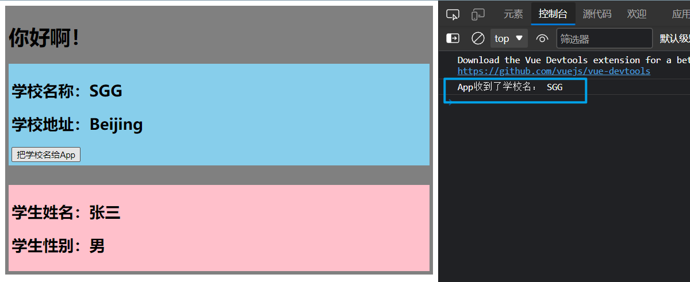
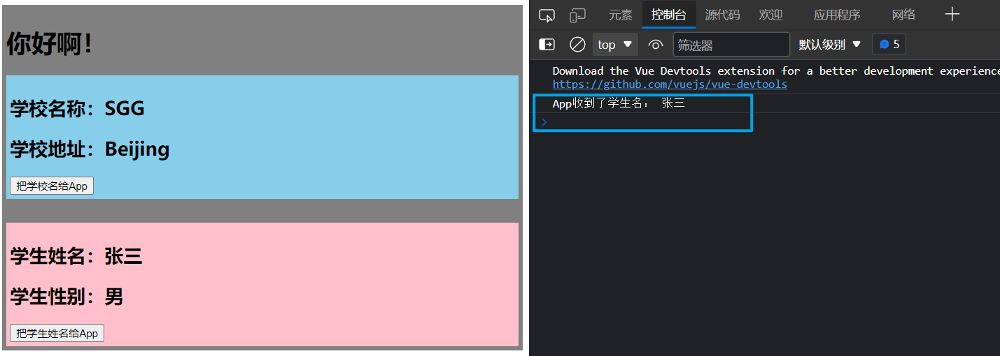
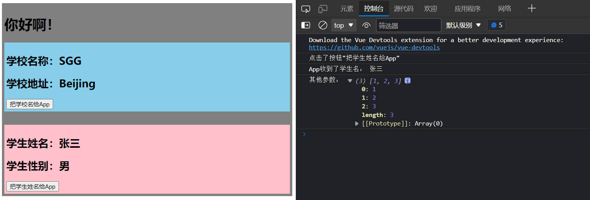
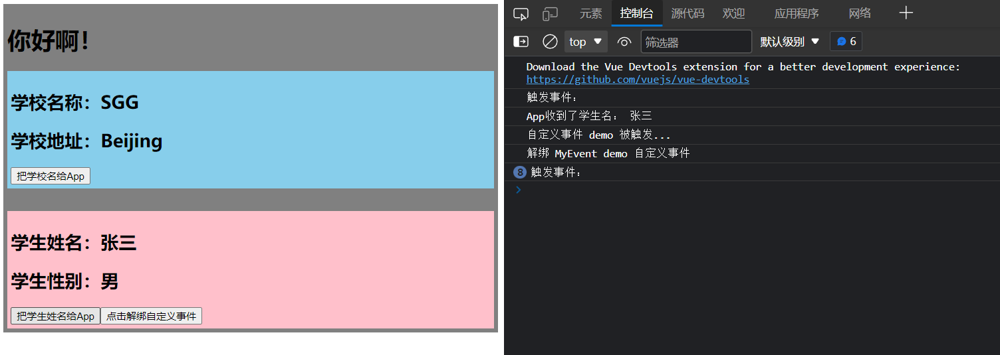
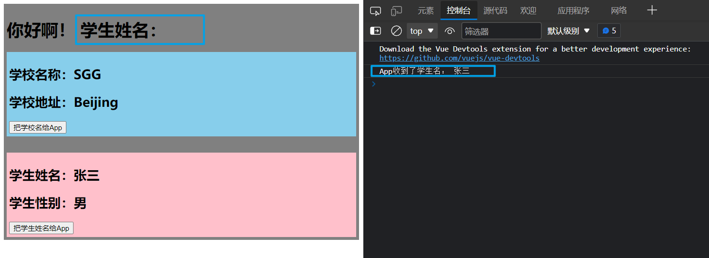
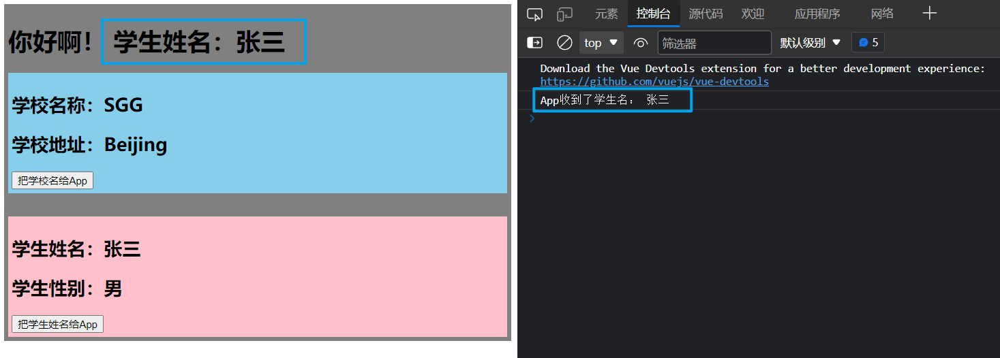
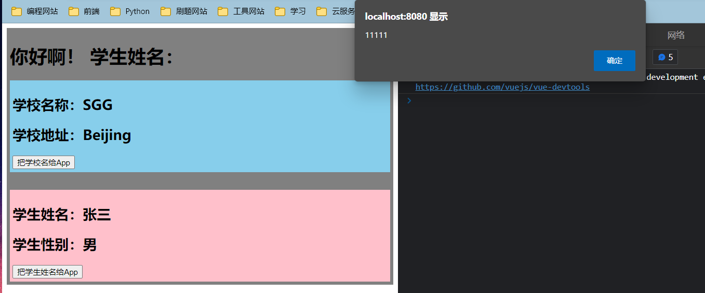

# 组件自定义事件

------

## 自定义事件

自定义事件是一种组件间通信的方式，适用于：**子组件 ===> 父组件**

使用场景：A是父组件，B是子组件，B想给A传数据，那么就要在A中给B绑定自定义事件（事件的回调在A中）。

## 1. 自定义属性实现子组件向父组件传递数据

App.vue

```html
<template>
  <div class="app">
    <h1>{{msg}}</h1>
    <School :getSchoolName="getSchoolName"></School>
    <Student></Student>
  </div>
</template>

<script>
//导入子组件
import Student from './components/Student'
import School from './components/School'

export default {
  name: 'App',
  components: { School, Student },
  data() {
    return {
      msg: '你好啊！'
    }
  },
  methods: {
    getSchoolName(name) {
      console.log('App收到了学校名：', name)
    }
  }
}
</script>

<style scoped>
.app {
  background-color: gray;
  padding: 5px;
}
</style>
```

School.vue

```html
<template>
	<div class="school">
		<h2>学校名称：{{name}}</h2>
		<h2>学校地址：{{address}}</h2>
		<button @click="sendSchoolName">把学校名给App</button>
	</div>
</template>

<script>
	export default {
		name:'School',
		props:['getSchoolName'],
		data() {
			return {
				name:'SGG',
				address:'Beijing',
			}
		},
		methods: {
			sendSchoolName(){
				// 调用父组件传递过来的方法
				// 将数据传递给父组件
				this.getSchoolName(this.name)
			}
		},
	}
</script>

<style scoped>
	.school{
		background-color: skyblue;
		padding: 5px;
	}
</style>
```

Student.vue

```html
<template>
	<div class="student">
		<h2>学生姓名：{{name}}</h2>
		<h2>学生性别：{{sex}}</h2>
	</div>
</template>

<script>
	export default {
		name:'Student',
		data() {
			return {
				name:'张三',
				sex:'男'
			}
		},
		
	}
</script>

<style scoped>
	.student{
		background-color: pink;
		padding: 5px;
		margin-top: 30px;
	}
</style>
```

> 

## 2. 自定义事件实现子组件向父组件传递数据

### 2.1 进行自定义事件的绑定

为子组件绑定自定义事件，在父组件中：

```html
<子组件名 @自定义事件名="事件的处理函数"></子组件名>
```

或

```html
<子组件名 v-on:自定义事件名="事件的处理函数"></子组件名>
```

App.vue

```html
<template>
  <div class="app">
    <h1>{{msg}}</h1>
    <School :getSchoolName="getSchoolName"></School>
		<!-- 
			1. 为子组件绑定自定义事件 MyEvent
					当自定义事件 MyEvent 被触发时，
					会调用事件的处理函数 getStudentName
		-->
    <Student @MyEvent="getStudentName"></Student>
  </div>
</template>

<script>
//导入子组件
import Student from './components/Student'
import School from './components/School'

export default {
  name: 'App',
  components: { School, Student },
  data() {
    return {
      msg: '你好啊！'
    }
  },
  methods: {
    getSchoolName(name) {
      console.log('App收到了学校名：', name)
    },
		getStudentName(name) {
			console.log('App收到了学生名：', name)
		}
  }
}
</script>

<style scoped>
.app {
  background-color: gray;
  padding: 5px;
}
</style>
```

### 2.2 触发自定义事件

> 进行自定义事件的触发，需要在被绑定自定义事件的子组件中进行触发。给谁绑定，谁触发。

> 子组件被绑定的自定义事件，自定义事件会挂载在对应子组件实例对象的`$emit`属性上。

触发自定义事件：

```js
this.$emit('自定义事件名', 向事件处理函数传递的参数)
```

Student.vue

```html
<template>
	<div class="student">
		<h2>学生姓名：{{name}}</h2>
		<h2>学生性别：{{sex}}</h2>
		<button @click="sendStudentName">把学生姓名给App</button>
	</div>
</template>

<script>
	export default {
		name:'Student',
		data() {
			return {
				name:'张三',
				sex:'男'
			}
		},
		methods: {
			sendStudentName() {
				// 触发自定义事件
				// 将学生姓名传递给自定义事件的处理函数
				this.$emit('MyEvent', this.name)
			}
		},
	}
</script>

<style scoped>
	.student{
		background-color: pink;
		padding: 5px;
		margin-top: 30px;
	}
</style>
```

> 

### 2.3 使用 ref 绑定自定义事件

> 使用 ref 为子组件绑定自定义事件，需要在mounted()中进行，因为此时组件的真实DOM才被渲染到页面上完成。

#### 2.3.1 语法

使用 ref 绑定自定义事件，在父组件中：

```html
<子组件名 ref="ref标记"></子组件名>
mounted(){
	// 先通过 $refs 获取对应的子组件
	// 然后使用 $on 为该子组件绑定自定义事件
	this.$refs.ref标记.$on('自定义事件名', 事件的处理函数)
}
```

#### 2.3.2 自定义事件的绑定

App.vue

```html
<template>
  <div class="app">
    <h1>{{msg}}</h1>
    <School :getSchoolName="getSchoolName"></School>
    <!-- 
			1. 为子组件绑定自定义事件 MyEvent
					当自定义事件 MyEvent 被触发时，
					会调用事件的处理函数 getStudentName
		-->
    <!-- <Student @MyEvent="getStudentName"></Student> -->

    <!-- 2. 使用 ref 进行自定义事件的绑定 -->
    <Student ref="student"></Student>
  </div>
</template>

<script>
//导入子组件
import Student from './components/Student'
import School from './components/School'

export default {
  name: 'App',
  components: { School, Student },
  data() {
    return {
      msg: '你好啊！'
    }
  },
  methods: {
    getSchoolName(name) {
      console.log('App收到了学校名：', name)
    },
    getStudentName(name) {
      console.log('App收到了学生名：', name)
    }
  },
	mounted() {
		// 为子组件 Student 绑定自定义事件，$on API将
		this.$refs.student.$on('MyEvent', this.getStudentName)
	},
}
</script>

<style scoped>
.app {
  background-color: gray;
  padding: 5px;
}
</style>
```

> 

#### 2.3.3 使用 ref 绑定自定义事件的好处

使用 ref 绑定自定义事件的好处，能够更好的处理自定义事件的绑定，能对自定义事件的绑定有更加灵活的控制。

> 使用 v-on 进行自定义事件的绑定，在页面渲染解析完成，vue就会为其绑定自定义指令，而使用 ref 绑定自定义事件，可以对其绑定的时间进行控制，如：延时、等待请求完成等。

App.vue

```html
<template>
  <div class="app">
    <h1>{{msg}}</h1>
    <School :getSchoolName="getSchoolName"></School>
    <!-- 
			1. 为子组件绑定自定义事件 MyEvent
					当自定义事件 MyEvent 被触发时，
					会调用事件的处理函数 getStudentName
		-->
    <!-- <Student @MyEvent="getStudentName"></Student> -->

    <!-- 
			2. 使用 ref 进行自定义事件的绑定
		-->
    <Student ref="student"></Student>
  </div>
</template>

<script>
//导入子组件
import Student from './components/Student'
import School from './components/School'

export default {
  name: 'App',
  components: { School, Student },
  data() {
    return {
      msg: '你好啊！'
    }
  },
  methods: {
    getSchoolName(name) {
      console.log('App收到了学校名：', name)
    },
    getStudentName(name) {
      console.log('App收到了学生名：', name)
    }
  },
	mounted() {
		// 等待三秒，为子组件 Student 绑定自定义事件
		setTimeout(()=>{
			this.$refs.student.$on('MyEvent', this.getStudentName)
		}, 3000)
	},
}
</script>

<style scoped>
.app {
  background-color: gray;
  padding: 5px;
}
</style>
```

> 

### 2.4 触发自定义事件向处理函数传递多个参数

> 在接收参数时，不想书写多个形参，可以使用`...`扩展运算符将多个参数进行接收。

App.vue

```html
<template>
  <div class="app">
    <h1>{{msg}}</h1>
    <School :getSchoolName="getSchoolName"></School>
    <!-- 
			1. 为子组件绑定自定义事件 MyEvent
					当自定义事件 MyEvent 被触发时，
					会调用事件的处理函数 getStudentName
		-->
    <!-- <Student @MyEvent="getStudentName"></Student> -->

    <!-- 
			2. 使用 ref 进行自定义事件的绑定
		-->
    <Student ref="student"></Student>
  </div>
</template>

<script>
//导入子组件
import Student from './components/Student'
import School from './components/School'

export default {
  name: 'App',
  components: { School, Student },
  data() {
    return {
      msg: '你好啊！'
    }
  },
  methods: {
    getSchoolName(name) {
      console.log('App收到了学校名：', name)
    },
    getStudentName(name, ...params) {
      console.log('App收到了学生名：', name)
      console.log('其他参数：', params)
    }
  },
  mounted() {
    // 为子组件 Student 绑定自定义事件
    this.$refs.student.$on('MyEvent', this.getStudentName)
  }
}
</script>

<style scoped>
.app {
  background-color: gray;
  padding: 5px;
}
</style>
```

Student.vue

```html
<template>
	<div class="student">
		<h2>学生姓名：{{name}}</h2>
		<h2>学生性别：{{sex}}</h2>
		<button @click="sendStudentName">把学生姓名给App</button>
	</div>
</template>

<script>
	export default {
		name:'Student',
		data() {
			return {
				name:'张三',
				sex:'男'
			}
		},
		methods: {
			sendStudentName() {
				console.log('点击了按钮"把学生姓名给App"')
				// 触发自定义事件
				// 将学生姓名传递给自定义事件的处理函数
				// 传递多个参数
				this.$emit('MyEvent', this.name, 1, 2, 3)
			}
		},
	}
</script>

<style scoped>
	.student{
		background-color: pink;
		padding: 5px;
		margin-top: 30px;
	}
</style>
```

> 

### 2.5 自定义事件只触发一次

> 实现方法与使用vue的内置事件一样，使用事件修饰符

App.vue

```html
<template>
  <div class="app">
    <h1>{{msg}}</h1>
    <School :getSchoolName="getSchoolName"></School>
    <Student @MyEvent.once="getStudentName"></Student>
    <!-- <Student ref="student"></Student> -->
  </div>
</template>

<script>
//导入子组件
import Student from './components/Student'
import School from './components/School'

export default {
  name: 'App',
  components: { School, Student },
  data() {
    return {
      msg: '你好啊！'
    }
  },
  methods: {
    getSchoolName(name) {
      console.log('App收到了学校名：', name)
    },
    getStudentName(name, ...params) {
      console.log('App收到了学生名：', name)
      console.log('其他参数：', params)
    }
  },
  mounted() {
    // 为子组件 Student 绑定自定义事件
		// 自定义事件只被触发一次
    // this.$refs.student.$once('MyEvent', this.getStudentName)
  }
}
</script>

<style scoped>
.app {
  background-color: gray;
  padding: 5px;
}
</style>
```

> 

### 2.6 解绑自定义事件

解绑自定义事件，需要在被绑定自定义事件的子组件实例对象上进行自定义事件的解绑。

#### 2.6.1 语法

解绑自定义事件，调用被绑定自定义事件的子组件实例对象上的`$off()`方法。

```js
this.$off(自定义事件)
```

#### 2.6.2 解绑一个自定义事件

```js
// 解绑 MyEvent 自定义事件
this.$off('MyEvent')
```

Student.vue

```html
<template>
	<div class="student">
		<h2>学生姓名：{{name}}</h2>
		<h2>学生性别：{{sex}}</h2>
		<button @click="sendStudentName">把学生姓名给App</button>
		<button @click="offEvent">点击解绑自定义事件</button>
	</div>
</template>

<script>
	export default {
		name:'Student',
		data() {
			return {
				name:'张三',
				sex:'男'
			}
		},
		methods: {
			sendStudentName() {
				console.log('点击了按钮"把学生姓名给App"')
				this.$emit('MyEvent', this.name)
			},
			offEvent() {
				// 解绑 MyEvent 自定义事件
				console.log('解绑 MyEvent 自定义事件')
				this.$off('MyEvent')
			}
		},
	}
</script>

<style scoped>
	.student{
		background-color: pink;
		padding: 5px;
		margin-top: 30px;
	}
</style>
```

> 

#### 2.6.3 解绑多个自定义事件

> 解绑多个自定义事件，需要向`$off()`方法中传入一个数组，数组中的元素为需要解绑的自定义事件的名

```js
// 解绑 MyEvent demo 自定义事件
this.$off(['MyEvent', 'demo'])
```

App.vue

```html
<template>
  <div class="app">
    <h1>{{msg}}</h1>
    <School :getSchoolName="getSchoolName"></School>
    <Student 
			@MyEvent="getStudentName"
			@demo="demo"
		></Student>
  </div>
</template>

<script>
//导入子组件
import Student from './components/Student'
import School from './components/School'

export default {
  name: 'App',
  components: { School, Student },
  data() {
    return {
      msg: '你好啊！'
    }
  },
  methods: {
    getSchoolName(name) {
      console.log('App收到了学校名：', name)
    },
    getStudentName(name) {
      console.log('App收到了学生名：', name)
    },
		demo() {
			console.log('自定义事件 demo 被触发...')
		}
  },
}
</script>

<style scoped>
.app {
  background-color: gray;
  padding: 5px;
}
</style>
```

Student.vue

```html
<template>
	<div class="student">
		<h2>学生姓名：{{name}}</h2>
		<h2>学生性别：{{sex}}</h2>
		<button @click="sendStudentName">把学生姓名给App</button>
		<button @click="offEvent">点击解绑自定义事件</button>
	</div>
</template>

<script>
	export default {
		name:'Student',
		data() {
			return {
				name:'张三',
				sex:'男'
			}
		},
		methods: {
			sendStudentName() {
				console.log('触发事件：')
				this.$emit('MyEvent', this.name)
				this.$emit('demo')
			},
			offEvent() {
				// 解绑 MyEvent demo 自定义事件
				console.log('解绑 MyEvent demo 自定义事件')
				this.$off(['MyEvent', 'demo'])
			}
		},
	}
</script>

<style scoped>
	.student{
		background-color: pink;
		padding: 5px;
		margin-top: 30px;
	}
</style>
```

> 

#### 2.6.4 解绑所有自定义事件

> 解绑所有自定义事件，向`$off()`方法中不传入参数即可

```js
// 解绑所有自定义事件
this.$off()
```

Student.vue

```html
<template>
	<div class="student">
		<h2>学生姓名：{{name}}</h2>
		<h2>学生性别：{{sex}}</h2>
		<button @click="sendStudentName">把学生姓名给App</button>
		<button @click="offEvent">点击解绑自定义事件</button>
	</div>
</template>

<script>
	export default {
		name:'Student',
		data() {
			return {
				name:'张三',
				sex:'男'
			}
		},
		methods: {
			sendStudentName() {
				console.log('触发事件：')
				this.$emit('MyEvent', this.name)
				this.$emit('demo')
			},
			offEvent() {
				// 解绑 所有 自定义事件
				console.log('解绑 所有 自定义事件')
				this.$off()
			}
		},
	}
</script>

<style scoped>
	.student{
		background-color: pink;
		padding: 5px;
		margin-top: 30px;
	}
</style>
```

> 

## 3. 自定义事件的注意点

### 3.1 使用 ref 绑定自定义事件中的 this

```html
<template>
  <div class="app">
    <h1>{{msg}} 学生姓名：{{stuName}}</h1>
    <School :getSchoolName="getSchoolName"></School>
    <!-- <Student @MyEvent="getStudentName"></Student> -->
    <Student ref="stu"></Student>
  </div>
</template>

<script>
//导入子组件
import Student from './components/Student'
import School from './components/School'

export default {
  name: 'App',
  components: { School, Student },
  data() {
    return {
      msg: '你好啊！',
			stuName: ''
    }
  },
  methods: {
    getSchoolName(name) {
      console.log('App收到了学校名：', name)
    },
    getStudentName(name) {
      console.log('App收到了学生名：', name)
    },
  },
	mounted() {
		// 由于vue规定
		// 谁触发事件，对应的回调函数中的this就指向谁
		// 由于触发自定义事件 MyEvent 为Student组件，且普通函数拥有自己的this
		// 所以 this 指向 Student组件实例对象
		// this.stuName = name 所以相当于向Student组件中的stuName赋值
		this.$refs.stu.$on('MyEvent', function(name) {
      		console.log('App收到了学生名：', name)
			this.stuName = name
    	})
	},
}
</script>

<style scoped>
.app {
  background-color: gray;
  padding: 5px;
}
</style>
```

> 

```js
mounted() {
		// 由于vue规定
		// 谁触发事件，对应的回调函数中的this就指向谁
		// 更改为箭头函数
		// 由于箭头函数没有自己的this
		// 所以会在函数声明位置向外查找，即App组件实例对象
		// 所以箭头函数 this.stuName = name 就是向 App组件实例对象中的stuName赋值
		this.$refs.stu.$on('MyEvent', (name) => {
     		 console.log('App收到了学生名：', name)
			this.stuName = name
    })
	},
```

> 

```html
<template>
  <div class="app">
    <h1>{{msg}} 学生姓名：{{stuName}}</h1>
    <School :getSchoolName="getSchoolName"></School>
    <!-- <Student @MyEvent="getStudentName"></Student> -->
    <Student ref="stu"></Student>
  </div>
</template>

<script>
//导入子组件
import Student from './components/Student'
import School from './components/School'

export default {
  name: 'App',
  components: { School, Student },
  data() {
    return {
      msg: '你好啊！',
			stuName: ''
    }
  },
  methods: {
    getSchoolName(name) {
      console.log('App收到了学校名：', name)
    },
    getStudentName(name) {
      console.log('App收到了学生名：', name)
			this.stuName = name
    },
  },
	mounted() {
		// 此种写法，会先将getStudentName函数中的this指向Student组件实例对象
		// 但是由于getStudentName函数声明在App组件的methods中
		// 在methods中的方法，this一定指向所在组件的实例对象
		// 所以getStudentName中的this最终指向App组件实例对象
		this.$refs.stu.$on('MyEvent', this.getStudentName)
	},
}
</script>

<style scoped>
.app {
  background-color: gray;
  padding: 5px;
}
</style>
```

> 

### 3.2 为子组件绑定内置事件

```html
<!-- 这样子绑定内置事件，会被认为是自定义事件，只不过自定义事件名字是click -->
<Student ref="stu" @click="show"></Student>
// App组件 methods
		show() {
			alert(11111)
		}
```

为子组件绑定内置事件，且不让内置事件被认为是自定义事件，需要使用事件修饰符`native`，即可为子组件绑定内置事件。

```html
<Student ref="stu" @click.native="show"></Student>
```

> 

## 4. 组件自定义事件 总结

1. 一种组件间通信的方式，适用于：**子组件 ===> 父组件**

2. 使用场景：A是父组件，B是子组件，B想给A传数据，那么就要在A中给B绑定自定义事件（事件的回调在A中）。

3. 绑定自定义事件：

   1. 第一种方式，在父组件中：`<Demo @atguigu="test"/>`或 `<Demo v-on:atguigu="test"/>`

   2. 第二种方式，在父组件中：

      ```js
      <Demo ref="demo"/>
      ......
      mounted(){
         this.$refs.xxx.$on('atguigu',this.test)
      }
      ```

   3. 若想让自定义事件只能触发一次，可以使用`once`修饰符，或`$once`方法。

4. 触发自定义事件：`this.$emit('atguigu',数据)`

5. 解绑自定义事件`this.$off('atguigu')`

6. 组件上也可以绑定原生DOM事件，需要使用`native`修饰符。

7. 注意：通过`this.$refs.xxx.$on('atguigu',回调)`绑定自定义事件时，回调要么配置在methods中，要么用箭头函数，否则this指向会出问题！

