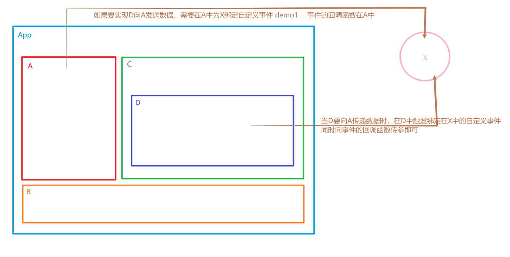

# 全局事件总线

## 1. 全局事件总线

全局事件总线是一种组件间通信的方式，能够实现任意组件间的通信。

原理图：


在全局事件总线中，X需要满足的条件：
1.所有的组件都可以看见X
2.X能够调用`$on() $off() $emit()`

## 2. $on() $off() $emit() 存放位置

`$on() $off() $emit()`三个方法被挂载在Vue的原型对象上。

```js
import Vue from 'vue'
import App from './App.vue'

//关闭vue的生产提示
Vue.config.productionTip = false

// 查看Vue的原型对象
console.log(Vue.prototype)

new Vue({
  render: h => h(App),
}).$mount('#app')
```

> 

> 在Vue中，VueComponent()的原型对象的原型对象为Vue()的原型对象。即组件的原型对象的原型对象为Vue()的原型对象。
>
> > 见21-2-2.5：重要的内置关系
>
> ```properties
> VueComponent.prototype.__proto__ === Vue.prototype //true
> ```

所以能够作为全局事件总线的可以是Vue的实例对象，或者是组件实例对象。

## 3. 组件实例对象作为全局事件总线

创建组件，需要先创建组件的构造函数：

```js
// {} 为组件的配置对象
const XVueComponent = Vue.extend({})
```

使用组件的构造函数，创建对应的组件：

```js
const X = new XVueComponent()
```

新创建的组件实例对象，要能够被所有的组件看见，需要将其挂载到Vue的原型对象上。

```js
Vue.prototype.X = X
```

main.js

```js
import Vue from 'vue'
import App from './App.vue'

//关闭vue的生产提示
Vue.config.productionTip = false

// 创建 VueComponent
// 由于新创建的组件只需要作为数据的中转站，所以不需要任何配置项
const XVueComponent = Vue.extend({})
// 创建组件实例对象
const X = new XVueComponent()
// 将组件实例对象挂载到Vue上
Vue.prototype.X = X

new Vue({
  render: h => h(App),
}).$mount('#app')
```

Student.vue

```html
<template>
  <div class="student">
    <h2>学生姓名：{{name}}</h2>
    <h2>学生性别：{{sex}}</h2>
		<button @click="show">点击查看中转数据的组件实例对象</button>
  </div>
</template>

<script>
export default {
  name: 'Student',
  data() {
    return {
      name: '张三',
      sex: '男'
    }
  },
	methods: {
		show() {
			console.log(this.X)
		}
	},
}
</script>

<style scoped>
.student {
  background-color: pink;
  padding: 5px;
  margin-top: 30px;
}
</style>
```

> 

## 4. Vue实例对象作为全局事件总线

main.js

```js
import Vue from 'vue'
import App from './App.vue'

//关闭vue的生产提示
Vue.config.productionTip = false

new Vue({
  render: h => h(App),
  // 将 Vue 实例对象挂载到 Vue 的原型对象上
  // 可以在 beforeCreate 中进行
  // 此时刚创建好 vue 实例对象
  beforeCreate() {
    // bus 总线
    // $ 为了迎合 vue 的命名习惯
    // 安装全局事件总线，$bus就是当前应用的vm
    Vue.prototype.$bus = this
  }
}).$mount('#app')
```

Student.vue

```html
<template>
  <div class="student">
    <h2>学生姓名：{{name}}</h2>
    <h2>学生性别：{{sex}}</h2>
		<button @click="show">点击查看中转数据的组件实例对象</button>
  </div>
</template>

<script>
export default {
  name: 'Student',
  data() {
    return {
      name: '张三',
      sex: '男'
    }
  },
	methods: {
		show() {
			console.log(this.$bus)
		}
	},
}
</script>

<style scoped>
.student {
  background-color: pink;
  padding: 5px;
  margin-top: 30px;
}
</style>
```

> 

## 5. 事件总线实现组件数据互传

> 注意：
> 由于充当事件总线的组件只有一个，所以在为其绑定自定义事件时，自定义事件的名不能重复。
> 在为事件总线绑定自定义事件的组件被销毁时，进行自定义事件的解绑。

实现将组件Student中的学生姓名传递给组件School：

School.vue

```html
<template>
  <div class="school">
    <h2>学校名称：{{name}}</h2>
    <h2>学校地址：{{address}}</h2>
  </div>
</template>

<script>
export default {
  name: 'School',
  data() {
    return {
      name: 'SGG',
      address: 'Beijing'
    }
  },
	mounted() {
		// 为全局事件总线绑定自定义事件
		this.$bus.$on('getStudentName', (name)=>{
			console.log('School 组件收到了数据：', name)
		})
	},
	beforeDestroy() {
		// 组件被销毁了，不能进行数据传输
		// 解绑事件
		this.$bus.$off('getStudentName')
	}
}
</script>

<style scoped>
.school {
  background-color: skyblue;
  padding: 5px;
}
</style>
```

Student.vue

```html
<template>
  <div class="student">
    <h2>学生姓名：{{name}}</h2>
    <h2>学生性别：{{sex}}</h2>
		<button @click="sendStudentName">点击发送学生姓名</button>
  </div>
</template>

<script>
export default {
  name: 'Student',
  data() {
    return {
      name: '张三',
      sex: '男'
    }
  },
	methods: {
		sendStudentName() {
			// 激活事件，发送数据
			this.$bus.$emit('getStudentName', this.name)
		}
	},
}
</script>

<style scoped>
.student {
  background-color: pink;
  padding: 5px;
  margin-top: 30px;
}
</style>
```

> 

## 6. 全局事件总线（GlobalEventBus）总结

1. 一种组件间通信的方式，适用于任意组件间通信。

2. 安装全局事件总线：

   ```js
   new Vue({
   	......
   	beforeCreate() {
   		Vue.prototype.$bus = this //安装全局事件总线，$bus就是当前应用的vm
   	},
       ......
   }) 
   ```

3. 使用事件总线：

   1. 接收数据：A组件想接收数据，则在A组件中给$bus绑定自定义事件，事件的回调留在A组件自身。

      ```js
      methods(){
        demo(data){......}
      }
      ......
      mounted() {
        this.$bus.$on('xxxx',this.demo)
      }
      ```

   2. 提供数据：`this.$bus.$emit('xxxx',数据)`

4. 最好在beforeDestroy钩子中，用$off去解绑当前组件所用到的事件。

