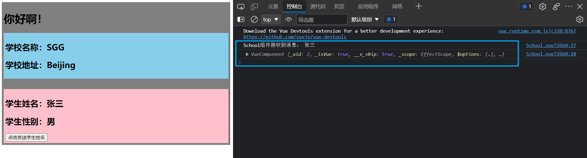

# 消息的订阅与发布

------

## 1. 消息的订阅与发布

### 1.1 简介

消息的订阅与发布类似报纸的订阅与发布，报纸订阅与发布的步骤：
（1）订阅报纸，留下报纸需要送到的地址
（2）邮递员送报纸

消息订阅与发布的步骤：
（1）订阅消息，留下消息名(好比手机号，消息的接受者)
（2）发布消息内容


### 1.2 pubsub-js

实现消息的订阅与发布需要借助第三方库，这里使用`pubsub-js`。

#### 1.2.1 安装

安装pubsub-js：

```html
npm i pubsub-js
```

#### 1.2.2 引入

引入pubsub-js：

> 需要进行消息的订阅与发布的组件都需要引入pubsub-js。

```js
import pubsub from 'pubsub-js'
```

- pubsub 是一个对象

#### 1.2.3 订阅消息

订阅消息，需要调用pubsub对象上的subscribe()方法进行消息的订阅

```js
pubsub.subscribe('消息名', 回调函数)
```

- subscribe()方法会返回订阅消息对应的ID
- 回调函数，不建议使用普通匿名函数，因为第三方库和vue不一样，不保证函数中的this指向vue实例或组件实例对象。建议使用箭头函数或者将普通函数写在methods配置项中。
- 回调函数接收两个参数，第一个参数为消息名，第二个参数为传递过来的数据

> subscribe：订阅

#### 1.2.4 发布消息

发布消息，需要调用pubsub对象上的publish()方法进行消息的发布。

```js
pubsub.publish('消息名', 数据)
```

#### 1.2.5 取消订阅

取消消息的订阅，需要调用pubsub对象上的unsubscribe()方法进行消息的取消订阅。

一般消息的取消订阅，在组件销毁之前进行取消订阅，即在beforeDestroy()中进行消息的取消订阅。

取消订阅需要根据之前订阅消息生成的消息ID来取消订阅对应的消息。

> 在不同方法中，使用同一个变量，可以将变量挂载在组件实例对象上。

```js
this.pubId = pubsub.subscribe('消息名', 回调函数)
pubsub.unsubscribe(this.pubId)
```

## 2. 消息的订阅与发布实现组件通信

main.js

```js
import Vue from 'vue'
import App from './App.vue'

//关闭vue的生产提示
Vue.config.productionTip = false

new Vue({
  render: h => h(App)
}).$mount('#app')
```

App.vue

```html
<template>
  <div class="app">
    <h1>{{msg}}</h1>
    <School></School>
    <Student></Student>
  </div>
</template>

<script>
//导入子组件
import Student from './components/Student'
import School from './components/School'

export default {
  name: 'App',
  components: { School, Student },
  data() {
    return {
      msg: '你好啊！'
    }
  }
}
</script>

<style scoped>
.app {
  background-color: gray;
  padding: 5px;
}
</style>
```

School.vue

```html
<template>
  <div class="school">
    <h2>学校名称：{{name}}</h2>
    <h2>学校地址：{{address}}</h2>
  </div>
</template>

<script>
// 导入pubsub-js进行消息的订阅
import pubsub from 'pubsub-js'

export default {
  name: 'School',
  data() {
    return {
      name: 'SGG',
      address: 'Beijing'
    }
  },
	mounted() {
    // 为全局事件总线绑定自定义事件
    // this.$bus.$on('getStudentName', (name)=>{
    // 	console.log('School 组件收到了数据：', name)
    // })
    // 使用pubsub进行消息的订阅
    this.pubId = pubsub.subscribe('getStudentName', (msgName, data)=>{
      console.log('School组件接收到消息：', data)
      console.log(this)
    })
	},
	beforeDestroy() {
    // 组件被销毁了 解绑事件
    // this.$bus.$off('getStudentName')
    // 取消消息的订阅
    pubsub.unsubscribe(this.pubId)
	}
}
</script>

<style scoped>
.school {
  background-color: skyblue;
  padding: 5px;
}
</style>
```

Student.vue

```html
<template>
  <div class="student">
    <h2>学生姓名：{{name}}</h2>
    <h2>学生性别：{{sex}}</h2>
		<button @click="sendStudentName">点击发送学生姓名</button>
  </div>
</template>

<script>
// 导入pubsub进行消息的发布
import pubsub from 'pubsub-js'

export default {
  name: 'Student',
  data() {
    return {
      name: '张三',
      sex: '男'
    }
  },
	methods: {
		sendStudentName() {
			// 激活事件，发送数据
			// this.$bus.$emit('getStudentName', this.name)
              // 进行消息的发布
              pubsub.publish('getStudentName', this.name)
		}
	},
}
</script>

<style scoped>
.student {
  background-color: pink;
  padding: 5px;
  margin-top: 30px;
}
</style>
```

> 

## 3. 消息的订阅与发布 总结

1. 一种组件间通信的方式，适用于任意组件间通信。

2. 使用步骤：

   1. 安装pubsub：`npm i pubsub-js`

   2. 引入: `import pubsub from 'pubsub-js'`

   3. 接收数据：A组件想接收数据，则在A组件中订阅消息，订阅的回调留在A组件自身。

      ```js
      methods(){
        demo(data){......}
      }
      ......
      mounted() {
        this.pid = pubsub.subscribe('xxx',this.demo) //订阅消息
      }
      ```

   4. 提供数据：`pubsub.publish('xxx',数据)`

   5. 最好在beforeDestroy钩子中，用`PubSub.unsubscribe(pid)`去取消订阅。

