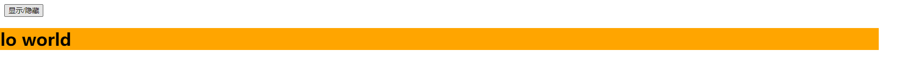
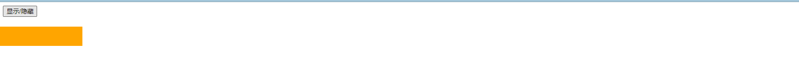
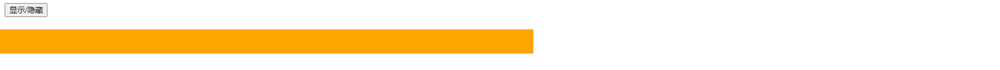
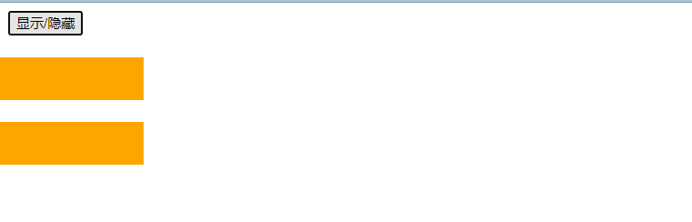
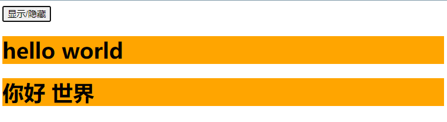
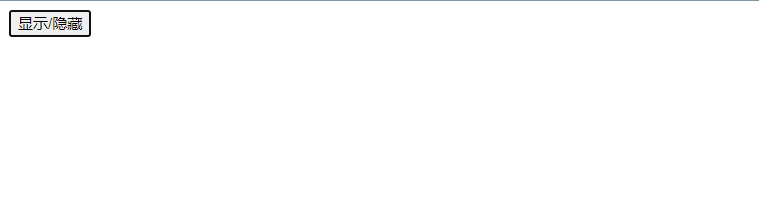
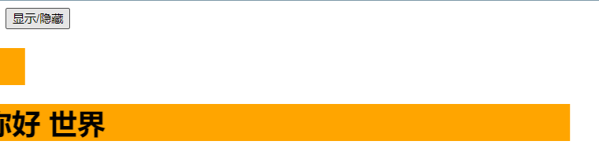

# 动画与过渡

## 1. 绑定class样式实现动画效果

main.js

```js
import Vue from 'vue'
import App from './App.vue'

//关闭vue的生产提示
Vue.config.productionTip = false

new Vue({
  render: h => h(App)
}).$mount('#app')
```

App.vue

```html
<template>
  <div class="app">
    <Test></Test>
  </div>
</template>

<script>
//导入子组件
import Test from './components/Test.vue'

export default {
  name: 'App',
  components: {
    Test
  }
}
</script>

<style scoped>
</style>
```

Test.vue

```html
<template>
  <div>
    <button @click="changeShow">显示/隐藏</button>
    <h1 :class="animation" v-show="isShow">hello world</h1>
  </div>
</template>

<script>
export default {
  name: 'Test',
  data() {
    return {
      // 控制显示与隐藏
      isShow: false,
      // 需要进行绑定的样式
      animation: ''
    }
  },
  methods: {
    changeShow() {
      // 如果是隐藏状态
      if (!this.isShow) {
        // 更改为显示状态，并且绑定进入样式
        this.isShow = true
        this.animation = 'enter'
      } else {
        // 如果不为隐藏状态
        // 更改为隐藏状态，绑定离开样式
        this.isShow = false
        this.animation = 'leave'
      }
    }
  }
}
</script>

<style scoped>
h1 {
  background-color: orange;
}

/* 进入动画 */
.enter {
  animation: sgg 0.5s linear;
}

/* 离开动画 */
.leave {
  animation: sgg 0.5s linear reverse;
}

/* 自定义动画 */
@keyframes sgg {
  from {
    transform: translateX(-100%);
  }
  to {
    transform: translateX(0px);
  }
}
</style>
```

> 
> 

## 2. transition 标签实现动画效果

### 2.1 语法

vue规定，想要让哪个元素具有动画效果，就使用 transition 标签将该元素进行包裹，vue会在合适的时机为元素加上动画效果。

```html
    <transition>
      <h1 v-show="isShow">hello world</h1>
    </transition>
```

要实现动画效果，还需要将动画的命名修改为符合vue的规定，进入页面的动画的命名为`v-enter-active`，离开页面的动画的命名为`v-leave-active`。

```css
/* 进入动画 */
.v-enter-active {
  animation: sgg 0.5s linear;
}

/* 离开动画 */
.v-leave-active {
  animation: sgg 0.5s linear reverse;
}

/* 自定义动画 */
@keyframes sgg {
  from {
    transform: translateX(-100%);
  }
  to {
    transform: translateX(0px);
  }
}
```

### 2.2 动画实现

Test.vue

```html
<template>
  <div>
    <button @click="changeShow">显示/隐藏</button>
    <transition>
      <h1 v-show="isShow">hello world</h1>
    </transition>
  </div>
</template>

<script>
export default {
  name: 'Test',
  data() {
    return {
      // 控制显示与隐藏
      isShow: false,
    }
  },
  methods: {
    changeShow() {
      // 如果是隐藏状态
      if (!this.isShow) {
        // 更改为显示状态
        this.isShow = true
      } else {
        // 如果不为隐藏状态
        // 更改为隐藏状态
        this.isShow = false
      }
    }
  }
}
</script>

<style scoped>
h1 {
  background-color: orange;
}

/* 进入动画 */
.v-enter-active {
  animation: sgg 0.5s linear;
}

/* 离开动画 */
.v-leave-active {
  animation: sgg 0.5s linear reverse;
}

/* 自定义动画 */
@keyframes sgg {
  from {
    transform: translateX(-100%);
  }
  to {
    transform: translateX(0px);
  }
}
</style>
```

> 
> 
> 
> 
> 

### 2.3 为 transition 标签指定名字

为 transition 标签指定名字，需要使用 transition 标签上的 name 属性，如果为 transition 标签指定了名字，那么对应的动画的名字也要进行相应的更改。

为 transition 标签指定了名字，可以实现使得不同的元素有不同的动画。

```html
    <transition name="hello">
      <h1 v-show="isShow">hello world</h1>
    </transition>
/* 进入动画 */
.hello-enter-active {
  animation: sgg 0.5s linear;
}

/* 离开动画 */
.hello-leave-active {
  animation: sgg 0.5s linear reverse;
}

/* 自定义动画 */
@keyframes sgg {
  from {
    transform: translateX(-100%);
  }
  to {
    transform: translateX(0px);
  }
}
```

Test.vue

```html
<template>
  <div>
    <button @click="changeShow">显示/隐藏</button>
    <transition name="hello">
      <h1 v-show="isShow">hello world</h1>
    </transition>
  </div>
</template>

<script>
export default {
  name: 'Test',
  data() {
    return {
      // 控制显示与隐藏
      isShow: false,
    }
  },
  methods: {
    changeShow() {
      // 如果是隐藏状态
      if (!this.isShow) {
        // 更改为显示状态
        this.isShow = true
      } else {
        // 如果不为隐藏状态
        // 更改为隐藏状态
        this.isShow = false
      }
    }
  }
}
</script>

<style scoped>
h1 {
  background-color: orange;
}

/* 进入动画 */
.hello-enter-active {
  animation: sgg 0.5s linear;
}

/* 离开动画 */
.hello-leave-active {
  animation: sgg 0.5s linear reverse;
}

/* 自定义动画 */
@keyframes sgg {
  from {
    transform: translateX(-100%);
  }
  to {
    transform: translateX(0px);
  }
}
</style>
```

> 
> 
> 
> 
> 

### 2.4 页面加载完成立即执行动画

要实现页面加载完成立即执行动画，需要使用 transition 标签的 appear 属性，指定该属性的值为 true。

```html
    <!-- 
      需要进行属性绑定，如果使用 appear="true" 则 appear 的值为 “true”
      使用 :appear="true"，appear 的值为 true
    -->
    <transition name="hello" :appear="true">
      <h1 v-show="isShow">hello world</h1>
    </transition>
```

或者

```html
    <!-- 
      appear 相当于 :appear="true"
    -->
    <transition name="hello" appear>
      <h1 v-show="isShow">hello world</h1>
    </transition>
```

Test.vue

```html
<template>
  <div>
    <button @click="changeShow">显示/隐藏</button>
    <!-- 
      页面加载完成立即执行动画，
      需要设置默认 h1 为显示
    -->
    <transition name="hello" appear>
      <h1 v-show="isShow">hello world</h1>
    </transition>
  </div>
</template>

<script>
export default {
  name: 'Test',
  data() {
    return {
      // 控制显示与隐藏
      isShow: true,
    }
  },
  methods: {
    changeShow() {
      // 如果是隐藏状态
      if (!this.isShow) {
        // 更改为显示状态
        this.isShow = true
      } else {
        // 如果不为隐藏状态
        // 更改为隐藏状态
        this.isShow = false
      }
    }
  }
}
</script>

<style scoped>
h1 {
  background-color: orange;
}

/* 进入动画 */
.hello-enter-active {
  animation: sgg 0.5s linear;
}

/* 离开动画 */
.hello-leave-active {
  animation: sgg 0.5s linear reverse;
}

/* 自定义动画 */
@keyframes sgg {
  from {
    transform: translateX(-100%);
  }
  to {
    transform: translateX(0px);
  }
}
</style>
```

> 
> 

## 3. 通过过渡实现动画效果

通过过渡实现动画效果一样需要使用 transition 标签将需要添加动画效果的元素进行包裹，vue会在合适的时机为元素加上动画效果。

```html
    <transition>
      <h1 v-show="isShow">hello world</h1>
    </transition>
```

通过过渡实现动画效果，需要提前写好过渡前的样式和过渡后的样式，过渡前后样式的类名需要满足vue的规定：

- 进入页面的起点：`.v-enter {}`
- 进入页面的终点：`v-enter-to {}`
- 离开页面的起点：`.v-leave {}`
- 离开页面的终点：`v-leave-to {}`

如果在 transition 标签中有指定 name 属性，则对应的样式类名中的`v`需要修改成对应的name。

```html
    <transition name="hello" appear>
      <h1 v-show="isShow">hello world</h1>
    </transition>
<style scoped>
h1 {
  background-color: orange;
  /* 指定动画的时间和方式 */
  transition: 0.5s linear;
}

/* 进入的起点 */
.hello-enter {
  transform: translate(-100%);
}

/* 进入的终点 */
.hello-enter-to {
  transform: translate(0);
}

/* 离开的起点 */
.hello-leave {
  transform: translate(0);
}

/* 离开的终点 */
.hello-leave-to {
  transform: translate(-100%);
}
</style>
```

由于离开的终点和进入的起点、离开的起点和进入的终点样式一样，所以可以进行合并：

```html
<style scoped>
h1 {
  background-color: orange;
  /* 指定动画的时间和方式 */
  transition: 0.5s linear;
}

/* 进入的起点 离开的终点 */
.hello-enter,
.hello-leave-to {
  transform: translate(-100%);
}

/* 进入的终点 离开的起点 */
.hello-enter-to,
.hello-leave {
  transform: translate(0);
}
</style>
```

动画执行的时间和方式可以写在`v-enter-active`和`v-leave-active`中，由于动画执行的时间和方式在进入页面和离开页面一样，可以进行合并。

动画执行的时间和方式可以写在`v-enter-active`和`v-leave-active`中，不会影响原来的css样式。

```html
<style scoped>
h1 {
  background-color: orange;
}

/* 进入的起点 离开的终点 */
.hello-enter,
.hello-leave-to {
  transform: translate(-100%);
}

/* 进入的终点 离开的起点 */
.hello-enter-to,
.hello-leave {
  transform: translate(0);
}

/* 动画被激活 */
.hello-enter-active,
.hello-leave-active {
  /* 指定动画的时间和方式 */
  transition: 0.5s linear;
}
</style>
```

Test.vue

```html
<template>
  <div>
    <button @click="changeShow">显示/隐藏</button>
    <transition name="hello" appear>
      <h1 v-show="isShow">hello world</h1>
    </transition>
  </div>
</template>

<script>
export default {
  name: 'Test',
  data() {
    return {
      // 控制显示与隐藏
      isShow: true,
    }
  },
  methods: {
    changeShow() {
      // 如果是隐藏状态
      if (!this.isShow) {
        // 更改为显示状态
        this.isShow = true
      } else {
        // 如果不为隐藏状态
        // 更改为隐藏状态
        this.isShow = false
      }
    }
  }
}
</script>

<style scoped>
h1 {
  background-color: orange;
}

/* 进入的起点 离开的终点 */
.hello-enter,
.hello-leave-to {
  transform: translate(-100%);
}

/* 进入的终点 离开的起点 */
.hello-enter-to,
.hello-leave {
  transform: translate(0);
}

/* 动画被激活 */
.hello-enter-active,
.hello-leave-active {
  /* 指定动画的时间和方式 */
  transition: 0.5s linear;
}
</style>
```

> 
> 
> 
> 
> 

## 4. 多个元素过渡

实现多个元素过渡，需要使用 transition-group 标签，transition 标签只能用于一个元素的过渡。

transition-group 标签的用法和 transition 标签的用法一样。

注意：如果使用 transition-group 标签实现多个元素的过渡，需要为每个元素指定 key 属性值(这里的 key 与 v-for 循环中的 key 一样)。

### 4.1 实现多个元素同时显示同时隐藏

Test.vue

```html
<template>
  <div>
    <button @click="changeShow">显示/隐藏</button>
    <transition-group name="hello" appear>
      <h1 v-show="isShow" key="1">hello world</h1>
      <h1 v-show="isShow" key="2">你好 世界</h1>
    </transition-group>
  </div>
</template>

<script>
export default {
  name: 'Test',
  data() {
    return {
      // 控制显示与隐藏
      isShow: true,
    }
  },
  methods: {
    changeShow() {
      // 如果是隐藏状态
      if (!this.isShow) {
        // 更改为显示状态
        this.isShow = true
      } else {
        // 如果不为隐藏状态
        // 更改为隐藏状态
        this.isShow = false
      }
    }
  }
}
</script>

<style scoped>
h1 {
  background-color: orange;
}

/* 进入的起点 离开的终点 */
.hello-enter,
.hello-leave-to {
  transform: translate(-100%);
}

/* 进入的终点 离开的起点 */
.hello-enter-to,
.hello-leave {
  transform: translate(0);
}

/* 动画被激活 */
.hello-enter-active,
.hello-leave-active {
  /* 指定动画的时间和方式 */
  transition: 0.5s linear;
}
</style>
```

> 
> 
> 
> 

### 4.2 实现一个元素显示一个元素隐藏

```html
<template>
  <div>
    <button @click="changeShow">显示/隐藏</button>
    <transition-group name="hello" appear>
      <h1 v-show="isShow" key="1">hello world</h1>
      <h1 v-show="!isShow" key="2">你好 世界</h1>
    </transition-group>
  </div>
</template>

<script>
export default {
  name: 'Test',
  data() {
    return {
      // 控制显示与隐藏
      isShow: true,
    }
  },
  methods: {
    changeShow() {
      // 如果是隐藏状态
      if (!this.isShow) {
        // 更改为显示状态
        this.isShow = true
      } else {
        // 如果不为隐藏状态
        // 更改为隐藏状态
        this.isShow = false
      }
    }
  }
}
</script>

<style scoped>
h1 {
  background-color: orange;
}

/* 进入的起点 离开的终点 */
.hello-enter,
.hello-leave-to {
  transform: translate(-100%);
}

/* 进入的终点 离开的起点 */
.hello-enter-to,
.hello-leave {
  transform: translate(0);
}

/* 动画被激活 */
.hello-enter-active,
.hello-leave-active {
  /* 指定动画的时间和方式 */
  transition: 0.5s linear;
}
</style>
```

> 
> 
> 
> 

## 5. 第三方动画库

> 这里演示 Animate.css
> [【npm 官网】](https://www.npmjs.com/)
> [【Animate.css 首页】](https://animate.style/)
> [【Animate.css 中文官网】](http://www.animate.net.cn/)

### 5.1 安装

```html
npm install animate.css --save
```

### 5.2 引入

```js
// 引入 Animate.css 库
import 'animate.css'
```

### 5.3 配置

在 transition 标签或者 transition-group 标签设置属性 name 的值为：`animate__animated animate__bounce`

```html
    <transition-group name="animate__animated animate__bounce" appear>
      <h1 v-show="isShow" key="1">hello world</h1>
      <h1 v-show="!isShow" key="2">你好 世界</h1>
    </transition-group>
```

### 5.4 设置进入页面和离开页面的动画

在 transition 标签或者 transition-group 标签设置设置进入页面和离开页面的动画，需要使用属性`enter-active-class`和`leave-active-class`

> 选择动画：
> 

### 5.5 实例效果

Test.vue

```html
<template>
  <div>
    <button @click="changeShow">显示/隐藏</button>
    <transition-group 
      name="animate__animated animate__bounce" 
      enter-active-class="animate__bounce"  //animate__bounce是从官网复制来的特效
      leave-active-class="animate__backOutUp"
      appear
    >
      <h1 v-show="isShow" key="1">hello world</h1>
      <h1 v-show="!isShow" key="2">你好 世界</h1>
    </transition-group>
  </div>
</template>

<script>
// 引入 Animate.css 库
import 'animate.css'

export default {
  name: 'Test',
  data() {
    return {
      // 控制显示与隐藏
      isShow: true,
    }
  },
  methods: {
    changeShow() {
      // 如果是隐藏状态
      if (!this.isShow) {
        // 更改为显示状态
        this.isShow = true
      } else {
        // 如果不为隐藏状态
        // 更改为隐藏状态
        this.isShow = false
      }
    }
  }
}
</script>

<style scoped>
h1 {
  background-color: orange;
}
</style>
```

> 

## 6. 动画与过渡 总结

1. 作用：在插入、更新或移除 DOM元素时，在合适的时候给元素添加样式类名。

2. 图示：

3. 写法：

   1. 准备好样式：

      - 元素进入的样式：
        1. v-enter：进入的起点
        2. v-enter-active：进入过程中
        3. v-enter-to：进入的终点
      - 元素离开的样式：
        1. v-leave：离开的起点
        2. v-leave-active：离开过程中
        3. v-leave-to：离开的终点

   2. 使用`<transition>`包裹要过度的元素，并配置name属性：

      ```html
      <transition name="hello">
      	<h1 v-show="isShow">你好啊！</h1>
      </transition>
      ```

   3. 备注：若有多个元素需要过度，则需要使用：`<transition-group>`，且每个元素都要指定`key`值。

