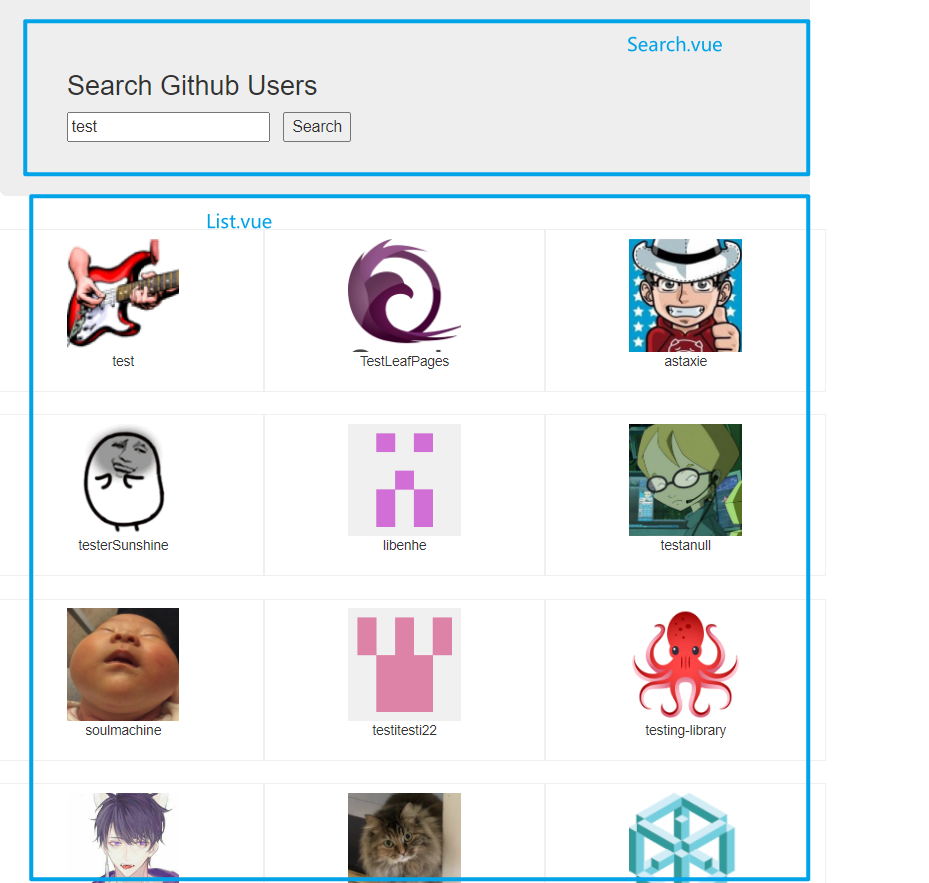
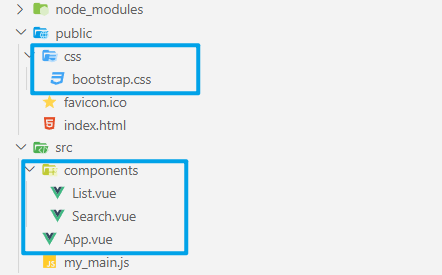
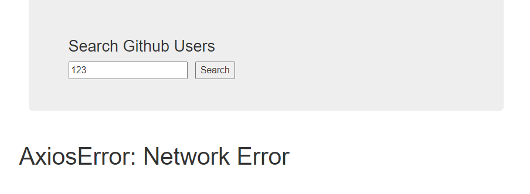

# github案例

## 1. 案例效果



## 2. 静态页面

```
<!DOCTYPE html>
<html lang="en">
<head>
  <meta charset="UTF-8">
  <title>Title</title>
  <link rel="stylesheet" href="./bootstrap.css">
  <link rel="stylesheet" href="./index.css">
</head>
<body>
<div id="app">
  <div class="container">
    <section class="jumbotron">
      <h3 class="jumbotron-heading">Search Github Users</h3>
      <div>
        <input type="text" placeholder="enter the name you search"/>&nbsp;<button>Search</button>
      </div>
    </section>
    <div class="row">
      <div class="card">
        <a href="https://github.com/xxxxxx" target="_blank">
          
        </a>
        <p class="card-text">xxxxxx</p>
      </div>
      <div class="card">
        <a href="https://github.com/xxxxxx" target="_blank">
          
        </a>
        <p class="card-text">xxxxxx</p>
      </div>
      <div class="card">
        <a href="https://github.com/xxxxxx" target="_blank">
          
        </a>
        <p class="card-text">xxxxxx</p>
      </div>
      <div class="card">
        <a href="https://github.com/xxxxxx" target="_blank">
          
        </a>
        <p class="card-text">xxxxxx</p>
      </div>
      <div class="card">
        <a href="https://github.com/xxxxxx" target="_blank">
          
        </a>
        <p class="card-text">xxxxxx</p>
      </div>
    </div>
  </div>
</div>
</body>
</html>
.album {
  min-height: 50rem; /* Can be removed; just added for demo purposes */
  padding-top: 3rem;
  padding-bottom: 3rem;
  background-color: #f7f7f7;
}

.card {
  float: left;
  width: 33.333%;
  padding: .75rem;
  margin-bottom: 2rem;
  border: 1px solid #efefef;
  text-align: center;
}

.card > img {
  margin-bottom: .75rem;
  border-radius: 100px;
}

.card-text {
  font-size: 85%;
}
```

## 3. 组件的拆分

### 3.1 目录结构



### 3.2 引入第三方css样式

在index.html中使用link标签引入第三方css样式

> 由于import导入第三方样式，会对引入的样式进行代码检查，而在代码中使用了本地没有的字体样式，会报错；使用link标签引入第三方样式不会进行严格的代码检查，不会报错。

index.html

```html
<!DOCTYPE html>
<html lang="">
  <head>
    <meta charset="utf-8">
    <!-- 针对ie浏览器的一个特殊配置，让ie浏览器以最高的渲染级别渲染页面 -->
    <meta http-equiv="X-UA-Compatible" content="IE=edge">
    <!-- 开启移动端的理想视口 -->
    <meta name="viewport" content="width=device-width,initial-scale=1.0">
    <!-- 配置页签图标  <%= BASE_URL %> 表示public文件夹所在的路径，防止项目部署后出现路径的错误-->
    <!-- 所以在该html文件中路径不使用 ./ ../ -->
    <link rel="icon" href="<%= BASE_URL %>favicon.ico">
    <!-- 引入第三方css样式 bootstrap -->
    <link rel="stylesheet" href="<%= BASE_URL %>css/bootstrap.css">
    <!-- 网页的标题 -->
    <title><%= htmlWebpackPlugin.options.title %></title>
  </head>
  <body>
    <!-- 浏览器不支持js，页面会显示noscript标签中的内容；支持js则不渲染noscript标签中的内容 -->
    <noscript>
      <strong>We're sorry but <%= htmlWebpackPlugin.options.title %> doesn't work properly without JavaScript enabled. Please enable it to continue.</strong>
    </noscript>
    <!-- 提供的容器 -->
    <div id="app"></div>
    <!-- built files will be auto injected -->
  </body>
</html>
```

### 3.3 拆分组件

App.vue

```html
<template>
  <div class="container">
    <!-- 使用子组件 -->
    <Search></Search>
    <List></List>
  </div>
</template>

<script>
// 导入子组件
import Search from './components/Search.vue'
import List from './components/List.vue'

export default {
  name: 'App',
  // 注册子组件
  components: {
    Search,
    List
  }
}
</script>
```

Search.vue

```html
<template>
  <section class="jumbotron">
    <h3 class="jumbotron-heading">Search Github Users</h3>
    <div>
      <input type="text" placeholder="enter the name you search" />&nbsp;<button>Search</button>
    </div>
  </section>
</template>

<script>
export default {
  name: 'Search'
}
</script>
```

List.vue

```html
<template>
  <div class="row">
    <div class="card">
      <a href="https://github.com/xxxxxx" target="_blank">
        
      </a>
      <p class="card-text">xxxxxx</p>
    </div>
    <div class="card">
      <a href="https://github.com/xxxxxx" target="_blank">
        
      </a>
      <p class="card-text">xxxxxx</p>
    </div>
    <div class="card">
      <a href="https://github.com/xxxxxx" target="_blank">
        
      </a>
      <p class="card-text">xxxxxx</p>
    </div>
    <div class="card">
      <a href="https://github.com/xxxxxx" target="_blank">
        
      </a>
      <p class="card-text">xxxxxx</p>
    </div>
    <div class="card">
      <a href="https://github.com/xxxxxx" target="_blank">
        
      </a>
      <p class="card-text">xxxxxx</p>
    </div>
  </div>
</template>

<script>
export default {
  name: 'List'
}
</script>

<style scoped>
.album {
  min-height: 50rem; /* Can be removed; just added for demo purposes */
  padding-top: 3rem;
  padding-bottom: 3rem;
  background-color: #f7f7f7;
}

.card {
  float: left;
  width: 33.333%;
  padding: 0.75rem;
  margin-bottom: 2rem;
  border: 1px solid #efefef;
  text-align: center;
}

.card > img {
  margin-bottom: 0.75rem;
  border-radius: 100px;
}

.card-text {
  font-size: 85%;
}
</style>
```

> 

## 4. 列表展示实现

### 4.1 查询请求数据

> 请求接口地址：
>
> ```
> https://api.github.com/search/users?q=xxx
> ```

Search.vue

```html
<template>
  <section class="jumbotron">
    <h3 class="jumbotron-heading">Search Github Users</h3>
    <div>
      <input 
        type="text" 
        placeholder="enter the name you search" 
        v-model="keyWord"
      />
      &nbsp;
      <button @click="searchUsers">Search</button>
    </div>
  </section>
</template>

<script>
// 导入axios
import axios from 'axios'

export default {
  name: 'Search',
  data() {
    return {
      keyWord: ''
    }
  },
  methods: {
    searchUsers() {
      axios.get(`https://api.github.com/search/users?q=${this.keyWord}`).then(
        response=>{
          console.log('请求成功', response.data)
        },
        error=>{
          console.log('请求失败', error)
        }
      )
    }
  },
}
</script>
```

> 

### 4.2 数据传递

子组件Search与List为兄弟组件，这里使用全局事件总线进行数据的传递。

#### 4.2.1 安装全局事件总线

main.js

```js
import Vue from 'vue'
import App from './App.vue'

//关闭vue的生产提示
Vue.config.productionTip = false

new Vue({
  render: h => h(App),
  beforeCreate() {
    // 让vue的实例对象作为全局事件总线
    Vue.prototype.$bus = this
  }
}).$mount('#app')
```

#### 4.2.2 全局事件总线绑定自定义事件

List.vue

```html
<script>
export default {
  name: 'List',
  data() {
    return {
      users: []
    }
  },
  mounted() {
    this.$bus.$on('getUsers', (users)=>{
      console.log('List组件收到了数据')
      this.users = users
    })
  }
}
</script>
```

#### 4.2.3 触发全局事件总线事件

Search.vue

```html
<template>
  <section class="jumbotron">
    <h3 class="jumbotron-heading">Search Github Users</h3>
    <div>
      <input 
        type="text" 
        placeholder="enter the name you search" 
        v-model="keyWord"
      />
      &nbsp;
      <button @click="searchUsers">Search</button>
    </div>
  </section>
</template>

<script>
// 导入axios
import axios from 'axios'

export default {
  name: 'Search',
  data() {
    return {
      keyWord: ''
    }
  },
  methods: {
    searchUsers() {
      // 发起请求获取用户数据
      axios.get(`https://api.github.com/search/users?q=${this.keyWord}`).then(
        response=>{
          console.log('请求成功')
          // 触发全局事件总线事件  传递数据
          this.$bus.$emit('getUsers', response.data.items)
        },
        error=>{
          console.log('请求失败', error)
        }
      )
    }
  },
}
</script>
```

> 

### 4.3 列表数据展示

#### 4.3.1 需要使用的数据


#### 4.3.2 数据展示

List.vue

```html
<template>
  <div class="row">
    <div class="card" v-for="user in users" :key="user.id">
      <a :href="user.html_url" target="_blank">
        
      </a>
      <p class="card-text">{{user.login}}</p>
    </div>
  </div>
</template>

<script>
export default {
  name: 'List',
  data() {
    return {
      users: []
    }
  },
  mounted() {
    // 全局事件总线绑定事件
    this.$bus.$on('getUsers', (users)=>{
      console.log('List组件收到了数据')
      this.users = users
    })
  }
}
</script>
```

> 

## 5. 完善案例

实现初始页面的欢迎词展示、数据请求过程中的加载提示、请求失败的错误信息显示。

List.vue

```html
<template>
  <div class="row">
    <!-- 用户列表 -->
    <div 
      class="card"
      v-show="info.users" 
      v-for="user in info.users" 
      :key="user.id">
      <a :href="user.html_url" target="_blank">
        
      </a>
      <p class="card-text">{{user.login}}</p>
    </div>
    <!-- 第一次加载 欢迎词 -->
    <h1 v-show="info.isFirst">welcome to use</h1>
    <!-- 加载中 -->
    <h1 v-show="info.isLoading">loading...</h1>
    <!-- 错误信息 -->
    <h1 v-show="info.errorMsg">{{info.errorMsg}}</h1>
  </div>
</template>

<script>
export default {
  name: 'List',
  data() {
    return {
      info: {
        // 是否第一次加载页面
        isFirst: true,
        // 是否加载数据
        isLoading: false,
        // 错误信息
        errorMsg: '',
        // 用户信息
        users: []
      }
    }
  },
  mounted() {
    // 全局事件总线绑定事件
    // this.$bus.$on('getUsers', (dataObj)=>{
    this.$bus.$on('updateUsers', (dataObj)=>{
      console.log('List组件收到了数据')
      // this.users = users
      // dataObj中有的属性会覆盖this.info中相同的属性
      // 没有则this.info保持原值
      this.info = {...this.info, ...dataObj}
    })
  }
}
</script>
```

Search.vue

```html
<template>
  <section class="jumbotron">
    <h3 class="jumbotron-heading">Search Github Users</h3>
    <div>
      <input type="text" placeholder="enter the name you search" v-model="keyWord" />
      &nbsp;
      <button @click="searchUsers">Search</button>
    </div>
  </section>
</template>

<script>
// 导入axios
import axios from 'axios'

export default {
  name: 'Search',
  data() {
    return {
      keyWord: ''
    }
  },
  methods: {
    searchUsers() {
      // 请求开始前初始化数据
      this.$bus.$emit('updateUsers', {
        // 进行请求了，取消欢迎词
        isFirst: false,
        // 请求开始，进入加载状态
        isLoading: true,
        // 无报错信息
        errorMsg: '',
        // 请求开始前，用户数据为空
        users: []
      })
      // 发起请求获取用户数据
      axios.get(`https://api.github.com/search/users?q=${this.keyWord}`).then(
        response => {
          console.log('请求成功')
          // 触发全局事件总线事件  传递数据
          // this.$bus.$emit('updateUsers', response.data.items)
          // 请求成功传递数据
          this.$bus.$emit('updateUsers', {
            // 原先是否第一次加载页面状态已经修改不用再次传递修改
            // 请求结束
            isLoading: false,
            // 无报错信息
            errorMsg: '',
            // 用户数据
            users: response.data.items
          })
        },
        error => {
          console.log('请求失败', error)
          // 请求失败传递数据
          this.$bus.$emit('updateUsers', {
            // 原先是否第一次加载页面状态已经修改不用再次传递修改
            // 请求结束
            isLoading: false,
            // 报错信息
            errorMsg: error,
            // 请求失败用户数据为空
            users: []
          })
        }
      )
    }
  }
}
</script>
```

>    

