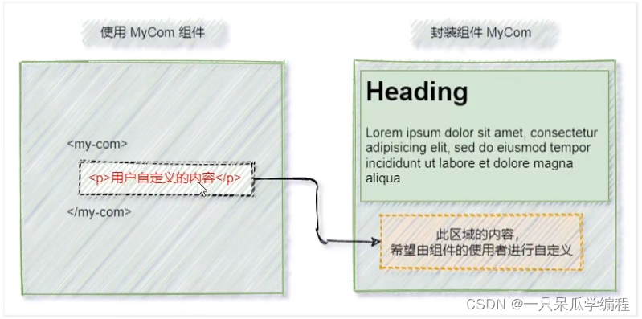
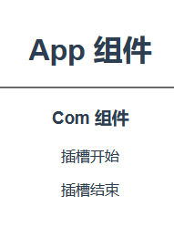
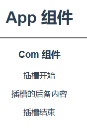
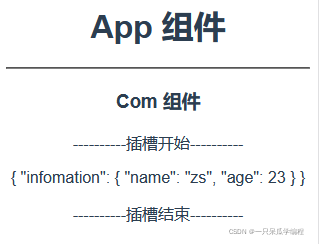
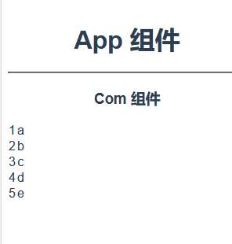

# 插槽

## 1. 插槽

插槽（Slot）是 vue 为组件的封装者提供的功能，允许开发者在封装组件时，把不确定的、希望由用户指定的部分定义为插槽。

可以把插槽认为是组件封装期间，为用户预留的内容的占位符，在组件的使用者使用该组件时可以为插槽指定填充的内容。



## 2. 默认插槽

### 2.1 插槽的基本使用

在封装组件时，可以通过`<slot>`元素定义插槽，从而为用户预留内容占位符。

Com.vue

```html
<template>
  <div>
    <h3>Com 组件</h3>
    <p>插槽开始</p>
    
    <!-- 为组件的使用者预留的区域 -->
    <slot></slot>
    
    <p>插槽结束</p>
  </div>
</template>

<script>
export default {
  name: 'Com'
}
</script>
```

App.vue

```html
<template>
  <div>
    <h1>App 组件</h1>
    <hr>
    
    <!-- 使用子组件 -->
    <Com>
      <!-- 指定需要向子组件的插槽区域放入的元素 -->
      <!-- 需要放入插槽的元素写在组件标签内 -->
      <div>插槽的内容</div>
    </Com>
    
  </div>
</template>

<script>
import Com from './Com.vue'

export default {
  name: 'App',
  components: {
    Com
  }
}
</script>
```

> 

### 2.2 没有预留插槽 组件标签内的内容会被丢弃

如果在封装组件时没有预留任何 `<slot>` 插槽，则用户提供的任何自定义内容都会被丢弃。即用户提供的页面元素没有位置放入。

Com.vue

```html
<template>
  <div>
    <h3>Com 组件</h3>
    <p>插槽开始</p>
    
    <!-- 为组件的使用者预留的区域 -->
    <!-- <slot></slot> -->
    
    <p>插槽结束</p>
  </div>
</template>

<script>
export default {
  name: 'Com'
}
</script>
```

App.vue

```html
<template>
  <div>
    <h1>App 组件</h1>
    <hr>
    
    <!-- 使用子组件 -->
    <Com>
      <!-- 指定需要向子组件的插槽区域放入的元素 -->
      <!-- 需要放入插槽的元素写在组件标签内 -->
      <div>插槽的内容</div>
    </Com>
    
  </div>
</template>

<script>
import Com from './Com.vue'

export default {
  name: 'App',
  components: {
    Com
  }
}
</script>
```

> 

### 2.3 后备内容

封装组件时，可以为预留的 `<slot>` 插槽提供后备内容（默认内容）。如果组件的使用者没有为插槽提供任何内容，则后备内容会生效，后备内容会展示在页面上。

Com.vue

```html
<template>
  <div>
    <h3>Com 组件</h3>
    <p>插槽开始</p>
    
    <!-- 为组件的使用者预留的区域 -->
    <slot>
      <div>插槽的后备内容</div>
    </slot>
    
    <p>插槽结束</p>
  </div>
</template>

<script>
export default {
  name: 'Com'
}
</script>

<style>

</style>
```

App.vue

```html
<template>
  <div>
    <h1>App 组件</h1>
    <hr>
    
     <!-- 使用子组件 -->
    <Com>
      <!-- 指定需要向子组件的插槽区域放入的元素 -->
      <!-- 需要放入插槽的元素写在组件标签内 -->
      <!-- <div>插槽的内容</div> -->
    </Com>
    
  </div>
</template>

<script>
import Com from './Com.vue'

export default {
  name: 'App',
  components: {
    Com
  }
}
</script>
```

> 

## 3. 具名插槽

如果在封装组件时需要预留多个插槽节点，则需要为每个 `<slot>`插槽指定具体的 name 名称。

这种带有具体名称的插槽叫做“具名插槽”。

注意：没有指定 name 名称的插槽，会有隐含的名称叫做 “default”。

### 3.1 具名插槽的定义

Com.vue

```html
<template>
  <div>
    <h3>Com 组件</h3>
    <p>----------插槽开始----------</p>
    
    <!-- 为组件的使用者预留的区域 -->
    <slot name="header"></slot>
    <!-- 没有指定 name，该插槽的 name 值默认为 default -->
    <slot></slot>
    <!-- <slot name="default"></slot> -->
    <slot name="bottom"></slot>
    
    <p>----------插槽结束----------</p>
  </div>
</template>

<script>
export default {
  name: 'Com'
}
</script>
```

### 3.2 为具名插槽提供内容

在向具名插槽提供内容的时候，我们可以在一个 `<template>` 元素上使用 v-slot 指令，并以 v-slot 的参数的形式指定元素需要放在哪个插槽中。

语法：

**最新版本写法**

```html
<template v-slot:插槽的name>
	需要向插槽中放入的内容
</template>
```

**一般写法**

```html
<template slot="插槽的name">
	需要向插槽中放入的内容
</template>
或者
<div slot="插槽的name">
	需要向插槽中放入的内容
</div>
```


> 注意：使用 v-slot 指令指定元素放在哪个插槽中，必须配合`<template>` 元素，且一个`<template>` 元素只能对应一个预留的插槽，即不能多个`<template>` 元素都使用 v-slot 指令指定相同的插槽。

> 在 2.6.0 中，我们为具名插槽和作用域插槽引入了一个新的统一的语法 (即 v-slot 指令)。它取代了 slot 和 slot-scope 这两个目前已被废弃但未被移除且仍在文档中的 attribute。

> 使用 slot 属性指定元素放置的插槽：`slot="插槽的name"`，slot 属性可以直接写在元素标签上，即 slot 属性不用必须与`<template>` 元素配合，且不同的标签可以使用 slot 属性指定相同的插槽，使用 slot 属性指定了相同的插槽都会被放入一个插槽中，后面的元素会被追加在前面放入插槽的元素后。

App.vue

```html
<template>
  <div>
    <h1>App 组件</h1>
    <hr>
    
    <Com>
      <!-- 指定需要向子组件的插槽区域放入的元素 -->
      <!-- 需要放入插槽的元素写在组件标签内 -->
      <!-- <div>插槽的内容</div> -->
      <template v-slot:header>
        <div>头部区域</div>
      </template>
      <template v-slot:default>
        <div>默认区域</div>
      </template>
      <template v-slot:bottom>
        <div>bottom区域</div>
      </template>
    </Com>
    
  </div>
</template>

<script>
import Com from './Com.vue'

export default {
  name: 'App',
  components: {
    Com
  }
}
</script>
```

> 

### 3.2 具名插槽的简写形式

跟 v-on 和 v-bind 一样，v-slot 也有缩写，即把参数之前的所有内容 (`v-slot:`) 替换为字符 `#`。例如 `v-slot:header`可以被重写为 `#header`

```html
<template>
  <div>
    <h1>App 组件</h1>
    <hr>
    <Com>
      <!-- 指定需要向子组件的插槽区域放入的元素 -->
      <!-- 需要放入插槽的元素写在组件标签内 -->
      <!-- <div>插槽的内容</div> -->
      <!-- <template v-slot:header> -->
      <template #header>
        <div>头部区域</div>
      </template>
      <!-- <template v-slot:default> -->
      <template #default>
        <div>默认区域</div>
      </template>
      <!-- <template v-slot:bottom> -->
      <template #bottom>
        <div>bottom区域</div>
      </template>
    </Com>
  </div>
</template>

<script>
import Com from './Com.vue'

export default {
  name: 'App',
  components: {
    Com
  }
}
</script>
```

> 

## 4. 作用域插槽

### 4.1 作用域插槽的使用

在封装组件的过程中，可以为预留的`<slot>`插槽绑定 props 数据，这种带有 props 数据的`<slot>`叫做“作用域插槽”。

作用域插槽，要显示的数据已经在组件中，以什么样的样式显示数据(用什么标签和标签的样式)，可以由组件的使用者进行指定。

> 为作用域插槽指定插槽内的元素必须使用 `<template>` 标签。

> 作用域插槽也能取名

Com.vue

```html
<template>
  <div>
    <h3>Com 组件</h3>
    <p>----------插槽开始----------</p>
    
    <!-- 为组件的使用者预留的区域 -->
    <!-- :infomation="info" 未来要进行渲染在插槽位置的数据 -->
    <!-- 怎么样渲染数据由组件的使用者决定 -->
    <slot :infomation="info"></slot>
    
    <p>----------插槽结束----------</p>
  </div>
</template>

<script>
export default {
  name: 'Com',
  data() {
    return {
      info: {
        name: 'zs',
        age: 23
      },
      msg: 'hello vue'
    }
  }
}
</script>
```

> 获取插槽绑定 props 数据的方法： 1.`scope="接收的变量名"`：`<template scope="接收的变量名">` 2.`slot-scope="接收的变量名"`：`<template slot-scope="接收的变量名">` 3.`v-slot:插槽名="接收的变量名"`：`<template v-slot:插槽名="接收的变量名">`

App.vue

```html
<template>
  <div>
    <h1>App 组件</h1>
    <hr>
    <Com>
      <!-- 指定需要向子组件的插槽区域放入的元素 -->
      <!-- 需要放入插槽的元素写在组件标签内 -->
      <!-- val 接收组件中要在插槽位置渲染的数据 -->
      <!-- val 组件通过 props 向插槽中传入的数据 -->
      <template #default="val">
        {{ val }}
      </template>
    </Com>
  </div>
</template>

<script>
import Com from './Com.vue'

export default {
  name: 'App',
  components: {
    Com
  }
}
</script>
```

> 得到的是一个对象 

### 4.2 解构作用域插槽的 prop

作用域插槽对外提供的数据对象，可以使用解构赋值简化数据的接收过程。

```html
<template>
  <div>
    <h3>Com 组件</h3>
    <p>----------插槽开始----------</p>
    <!-- 为组件的使用者预留的区域 -->
    <!-- :infomation="info" 未来要进行渲染在插槽位置的数据 -->
    <slot :infomation="info" :message="msg"></slot>
    <p>----------插槽结束----------</p>
  </div>
</template>

<script>
export default {
  name: 'Com',
  data() {
    return {
      info: {
        name: 'zs',
        age: 23
      },
      msg: 'hello vue'
    }
  }
}
</script>

<style>

</style>
```

> 

把information的数据解构出来

```html
<template>
  <div>
    <h1>App 组件</h1>
    <hr>
    <Com>
      <!-- 向子组件的插槽区域放入元素，写在组件标签内 -->
      <!-- val 接收组件中要在插槽位置渲染的数据 -->
      <template #default="{ infomation }">
        <div>{{ infomation.name }}</div>
        <div>{{ infomation.age }}</div>
      </template>
    </Com>
  </div>
</template>

<script>
import Com from './Com.vue'

export default {
  name: 'App',
  components: {
    Com
  }
}
</script>
```

### 4.3 声明作用域插槽

在封装 Com 组件的过程中，可以通过作用域插槽把表格每一行的数据传递给组件的使用者。

```html
<template>
  <div>
    <h3>Com 组件</h3>
    <tbody>
      <tr v-for="item in arr" :key="item.id">
        <!-- 作用域插槽 -->
        <slot :arr_i="item"></slot>
      </tr>
    </tbody>
  </div>
</template>

<script>
export default {
  name: 'Com',
  data() {
    return {
      arr: [
        {id: 1, data: 'a'},
        {id: 2, data: 'b'},
        {id: 3, data: 'c'},
        {id: 4, data: 'd'},
        {id: 5, data: 'e'},
      ]
    }
  }
}
</script>

<style>

</style>
```

### 4.4 使用作用域插槽

在使用 Com 组件时，自定义单元格的渲染方式，并接收作用域插槽对外提供的数据。

```html
<template>
  <div>
    <h1>App 组件</h1>
    <hr>
    <Com>
      <!-- 向子组件的插槽区域放入元素，写在组件标签内 -->
      <!-- 接收组件中要在插槽位置渲染的数据 -->
      <template #default="{arr_i}">
        <!-- 使用作用域插槽的数据 -->
        <td>{{ arr_i.id }}</td>
        <td>{{ arr_i.data }}</td>
      </template>
    </Com>
  </div>
</template>

<script>
import Com from './Com.vue'

export default {
  name: 'App',
  components: {
    Com
  }
}
</script>
```



## 5. 插槽 总结

1. 作用：让父组件可以向子组件指定位置插入html结构，也是一种组件间通信的方式，适用于 **父组件 ===> 子组件** 。

2. 分类：默认插槽、具名插槽、作用域插槽

3. 使用方式：

   1. 默认插槽：

      ```html
      父组件中：
              <Category>
                 <div>html结构1</div>
              </Category>
      子组件中：
              <template>
                  <div>
                     <!-- 定义插槽 -->
                     <slot>插槽默认内容...</slot>
                  </div>
              </template>
      ```

   2. 具名插槽：

      ```html
      父组件中：
              <Category>
                  <template slot="center">
                    <div>html结构1</div>
                  </template>
      
                  <template v-slot:footer>
                     <div>html结构2</div>
                  </template>
              </Category>
      子组件中：
              <template>
                  <div>
                     <!-- 定义插槽 -->
                     <slot name="center">插槽默认内容...</slot>
                     <slot name="footer">插槽默认内容...</slot>
                  </div>
              </template>
      ```

   3. 作用域插槽：

      1. 理解：数据在组件的自身，但根据数据生成的结构需要组件的使用者来决定。（games数据在Category组件中，但使用数据所遍历出来的结构由App组件决定）

      2. 具体编码：

         ```html
         父组件中：
         		<Category>
         			<template scope="scopeData">
         				<!-- 生成的是ul列表 -->
         				<ul>
         					<li v-for="g in scopeData.games" :key="g">{{g}}</li>
         				</ul>
         			</template>
         		</Category>
         
         		<Category>
         			<template slot-scope="scopeData">
         				<!-- 生成的是h4标题 -->
         				<h4 v-for="g in scopeData.games" :key="g">{{g}}</h4>
         			</template>
         		</Category>
         子组件中：
                 <template>
                     <div>
                         <slot :games="games"></slot>
                     </div>
                 </template>
         		
                 <script>
                     export default {
                         name:'Category',
                         props:['title'],
                         //数据在子组件自身
                         data() {
                             return {
                                 games:['红色警戒','穿越火线','劲舞团','超级玛丽']
                             }
                         },
                     }
                 </script>
         ```

