# vuex

## 1. vuex

### 1.1 vuex 是什么

vuex 是专门在 Vue 中实现集中式数据管理的一个 Vue 插件，对 vue 应用中多个组件的共享数据进行集中式的管理（读/写），也是一种组件间通信的方式，且适用于任意组件间通信。

> [vuex github地址](https://github.com/vuejs/vuex)

### 1.2 什么时候使用 vuex

1. 多个组件依赖于同一数据
2. 来自不同组件的行为需要变更同一数据

即多个组件需要对同一个数据进行读和写操作时可以使用 vuex。

使用全局事件总线实现多个组件对同一个数据进行读和写操作：

> 当对一个数据进行读写操作的组件较少时，全局事件总线可以简单实现，但是当对这个数据进行读和写操作的组件个数较多时，代码写起来较为繁琐。

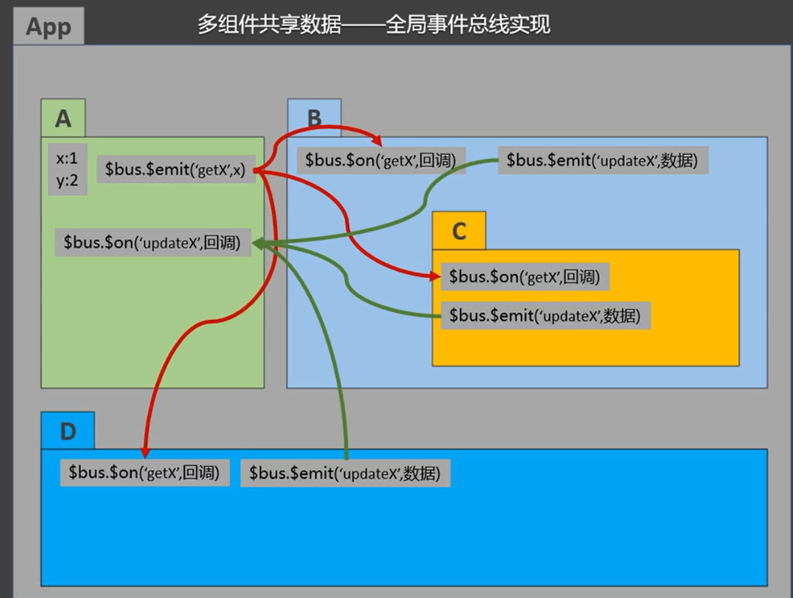

使用 vuex 实现多个组件对同一个数据进行读和写操作：

> 当对数据进行读和写操作的组件个数较多时，使用 vuex 实现比全局事件总线实现更为简易。

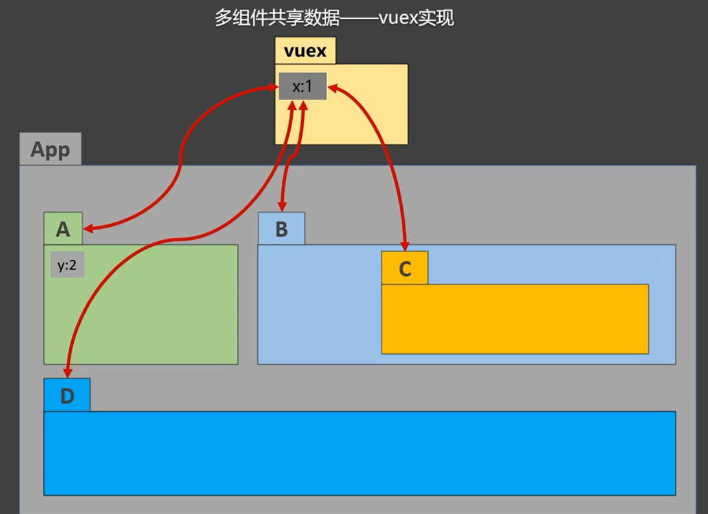

## 2. 求和案例

App.vue

```html
<template>
  <div>
    <!-- 使用子组件 -->
    <Count></Count>
  </div>
</template>

<script>
// 导入子组件
import Count from './components/Count.vue'

export default {
  name: 'App',
  // 注册子组件
  components: {
    Count
  }
}
</script>
```

Count.vue

```html
<template>
  <div>
    <h1>当前求和为: {{sum}}</h1>
    <select v-model.number="n">
      <option value="1">1</option>
      <option value="2">2</option>
      <option value="3">3</option>
    </select>
    <button @click="increment">+</button>
    <button @click="decrement">-</button>
    <button @click="incrementWait">等一等再加</button>
    <button @click="incrementOdd">当前求和为奇数再加</button>
  </div>
</template>

<script>
export default {
  name: 'Count',
  data() {
    return {
      n: 1,
      sum: 0
    }
  },
  methods: {
    increment() {
      this.sum += this.n
    },
    decrement() {
      this.sum -= this.n
    },
    incrementWait() {
      setTimeout(()=>{
        this.sum += this.n
      }, 500)
    },
    incrementOdd() {
      if ( this.sum % 2 ) {
        this.sum += this.n
      }
    }
  }
}
</script>

<style>
button {
  margin: 5px;
}
</style>
```

> 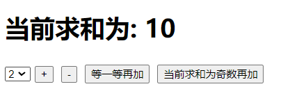

## 3. vuex 工作原理

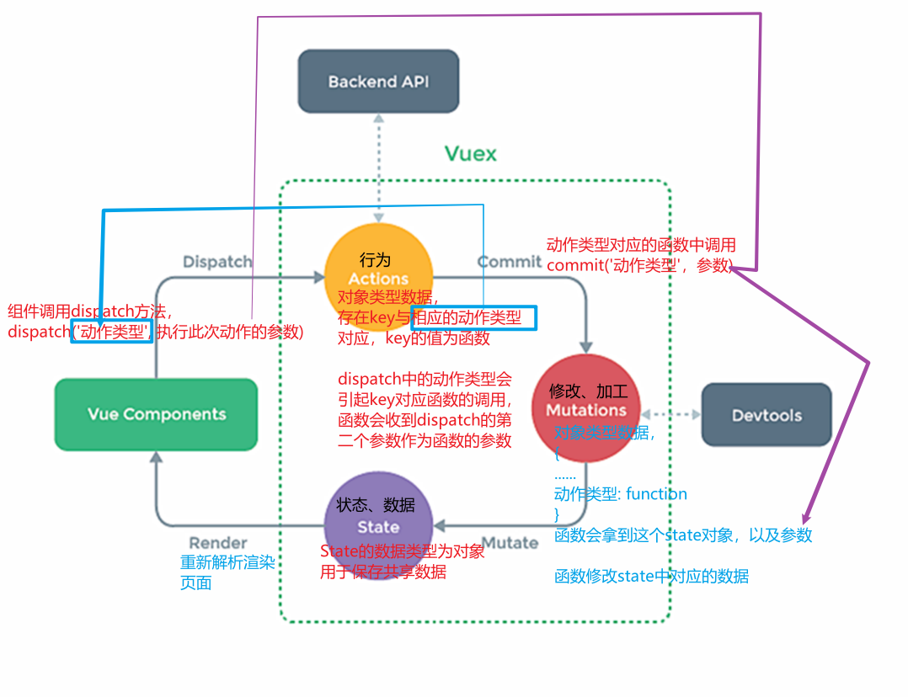

> Actions的作用，当组件调用dispatch方法只知道动作类型，而不知道参数，需要向外部服务器请求，这种情况下，可以在Actions中发送ajax请求获取参数。 如果动作类型和参数都知道，组件可以直接调用commit在Mutations对数据进行处理。


> vuex 中的 Actions、Mutations、State 需要受到 store 的管理，同时 dispatch 方法和 commit 方法由 store 提供。

## 4. 搭建 vuex 环境

> vue2使用vuex3版本 vue3使用vuex4版本

### 4.1 安装 vuex

> **由于使用的vue版本为2.x，所以安装vuex的3.x版本。**

```html
npm i vuex@3
```

### 4.2 新建 store 文件夹

在 src 文件夹下，创建一个 store 文件夹，在 store 文件夹下新建一个 index.js 文件。 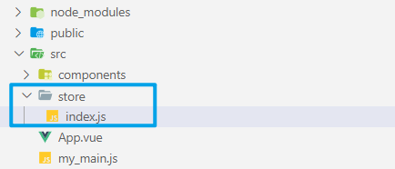

store/index.js

```js
// 该文件用于创建 vuex 中最为核心的 store

// 引入 vue
import Vue from 'vue'
// 引入 vuex
import Vuex from 'vuex'

// 使用 vuex 插件
Vue.use(Vuex)

// 准备 actions 用于响应组件中的动作
const actions = {}
// 准备 mutations 用于操作数据 state
const mutations = {}
// 准备 state 用于存储数据
const state = {}

// 创建并导出 store
export default new Vuex.Store({
  actions,
  mutations,
  state
})
```

> 在 store/index.js 中使用 vuex 插件而不是在 main.js 中使用 vuex 插件，是由于 vuex 插件的使用必须在创建 store 实例对象之前。 如果在 store/index.js 中创建 store 对象，在 main.js 中使用 vuex 插件，由于 import 的代码会被提升至最前， vuex 插件的使用一定在创建 store 对象之后，所以 vuex 插件的使用在 store/index.js 中。

### 4.3 store 配置项

在引入和使用 vuex 后，在创建 vue 实例对象时，可以传入一个配置项 store。在创建 vue 实例对象时传入 store 配置项，vue 实例对象和所有的组件实例对象上都会有一个 $store 属性。

main.js

```js
import Vue from 'vue'
import App from './App.vue'
// 引入 store
import store from './store'

//关闭vue的生产提示
Vue.config.productionTip = false

new Vue({
  render: h => h(App),
  // store 配置项
  // store: store
  // 简写
  store
}).$mount('#app')
```

App.vue

```html
<script>
// 导入子组件
import Count from './components/Count.vue'

export default {
  name: 'App',
  // 注册子组件
  components: {
    Count
  },
  mounted() {
    console.log(this)
  }
}
</script>
```

> 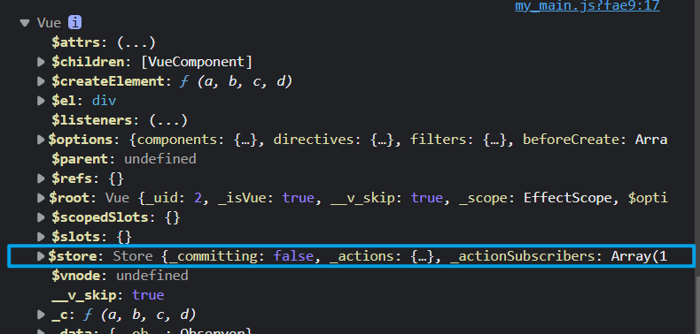 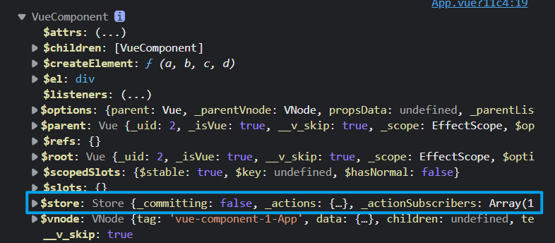

## 5. 求和案例(vuex版)

Count.vue

```html
<template>
  <div>
    <h1>当前求和为: {{$store.state.sum}}</h1>
    <select v-model.number="n">
      <option value="1">1</option>
      <option value="2">2</option>
      <option value="3">3</option>
    </select>
    <button @click="increment">+</button>
    <button @click="decrement">-</button>
    <button @click="incrementWait">等一等再加</button>
    <button @click="incrementOdd">当前求和为奇数再加</button>
  </div>
</template>

<script>
export default {
  name: 'Count',
  data() {
    return {
      n: 1
    }
  },
  methods: {
    increment() {
      // 使用 store 触发 vuex actions中对应的动作
      // this.$store.dispatch('increment', this.n)
      // 由于这个处理不需要进行额外的逻辑处理，可以直接调用 commit 让 mutations 操作数据
      this.$store.commit('INCREMENT', this.n)
    },
    decrement() {
      // 由于这个处理不需要进行额外的逻辑处理，可以直接调用 commit 让 mutations 操作数据
      this.$store.commit('DECREMENT', this.n)
    },
    incrementWait() {
      // 需要进行额外的逻辑处理
      // 等一段时间在加
      this.$store.dispatch('incrementWait', this.n)
    },
    incrementOdd() {
      // 需要进行额外的逻辑处理
      // 当前求和为奇数再加
      this.$store.dispatch('incrementOdd', this.n)
    }
  }
}
</script>

<style>
button {
  margin: 5px;
}
</style>
```

store/index.js

```js
// 该文件用于创建 vuex 中最为核心的 store

// 引入 vue
import Vue from 'vue'
// 引入 vuex
import Vuex from 'vuex'

// 使用 vuex
Vue.use(Vuex)

// 准备 actions 用于响应组件中的动作
const actions = {
  // 完整写法
  // increment: function() {}
  // 简写
  // 第一个参数为 store 的一部分属性组成的对象
  // 第二个参数为触发动作传递过来的值
  // increment(context, value) {
  //   console.log('actions 中的 increment 被触发', context, value)
  //   // 调用 commit 方法触发 mutations 中对应的函数处理数据
  //   // commit 中的动作大写，可以与 actions 中的进行区分
  //   context.commit('INCREMENT', value)
  // }

  // 等一等再加
  incrementWait(context, value) {
    console.log('actions 中的 incrementWait 被触发', context, value)
    setTimeout(() => {
      context.commit('INCREMENTWAIT', value)
    }, 500);
  },
  // 当前求和为奇数再加
  incrementOdd(context, value) {
    console.log('actions 中的 incrementOdd 被触发', context, value)
    // 在 context 对象有 state 属性
    if (context.state.sum % 2) {
      context.commit('INCREMENTODD', value)
    }
  }
}
// 准备 mutations 用于操作数据 state
const mutations = {
  // 第一个参数为 state 对象，可以直接通过第一个参数修改state内的内容
  // 第二个参数为触发动作传递过来的值
  // 加法
  INCREMENT(state, value) {
    console.log('mutations 中的 INCREMENT 被触发', state, value)
    state.sum += value
  },
  // 减法
  DECREMENT(state, value) {
    console.log('mutations 中的 DECREMENT 被触发', state, value)
    state.sum -= value
  },
  // 等一等再加
  INCREMENTWAIT(state, value) {
    console.log('mutations 中的 INCREMENTWAIT 被触发', state, value)
    state.sum += value
  },
  // 当前求和为奇数再加
  INCREMENTODD(state, value) {
    console.log('mutations 中的 INCREMENTODD 被触发', state, value)
    state.sum += value
  }
}
// 准备 state 用于存储数据
const state = {
  // 当前求和
  sum: 0
}

// 创建并导出 store
export default new Vuex.Store({
  actions,
  mutations,
  state
})
```

> 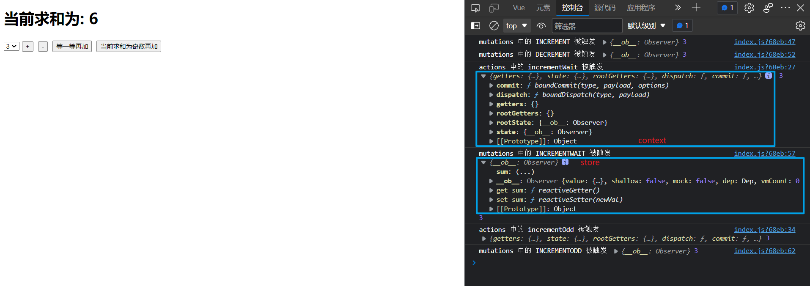

> vuex 中的 actions 负责业务逻辑的处理，mutations 负责数据的操作修改。 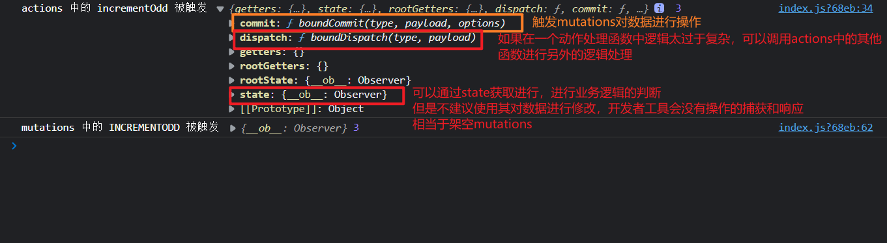

## 6. store 中的 getters 配置项

类似于计算属性，可以读取state中数据加工后的值。

### 6.1 getters 配置项

store/index.js

```js
// 该文件用于创建 vuex 中最为核心的 store
......

// 准备 actions 用于响应组件中的动作
const actions = {
  ......
}
// 准备 mutations 用于操作数据 state
const mutations = {
  ......
}
// 准备 state 用于存储数据
const state = {
  // 当前求和
  sum: 0
}

// getters 
const getters = {
  // 会有一个参数 state
  // 获取当前求和放大十倍后的值
  bigSum(state) {
    return state.sum * 10
  }
}

// 创建并导出 store
export default new Vuex.Store({
  actions,
  mutations,
  state,
  getters
})
```

### 6.2 读取 getters 配置项中的值

在 $store 实例对象中存在一个属性 getters： 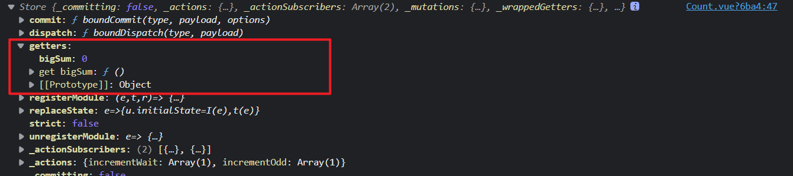

Count.vue

```html
<template>
  <div>
    <h1>当前求和为: {{$store.state.sum}}</h1>
    <h1>当前求和放大10倍为: {{$store.getters.bigSum}}</h1>
    <select v-model.number="n">
      <option value="1">1</option>
      <option value="2">2</option>
      <option value="3">3</option>
    </select>
    <button @click="increment">+</button>
    <button @click="decrement">-</button>
    <button @click="incrementWait">等一等再加</button>
    <button @click="incrementOdd">当前求和为奇数再加</button>
  </div>
</template>

<script>
export default {
  name: 'Count',
  data() {
    return {
      n: 1
    }
  },
  methods: {
    increment() {
      // 使用 store 触发 vuex actions中对应的动作
      // this.$store.dispatch('increment', this.n)
      // 由于这个处理不需要进行额外的逻辑处理，可以直接调用 commit 让 mutations 操作数据
      this.$store.commit('INCREMENT', this.n)
    },
    decrement() {
      // 由于这个处理不需要进行额外的逻辑处理，可以直接调用 commit 让 mutations 操作数据
      this.$store.commit('DECREMENT', this.n)
    },
    incrementWait() {
      // 需要进行额外的逻辑处理
      // 等一段时间在加
      this.$store.dispatch('incrementWait', this.n)
    },
    incrementOdd() {
      // 需要进行额外的逻辑处理
      // 当前求和为奇数再加
      this.$store.dispatch('incrementOdd', this.n)
    }
  }
}
</script>

<style>
button {
  margin: 5px;
}
</style>
```

> 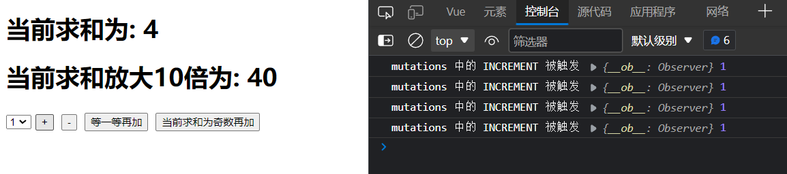

## 7. mapState & mapGetters

导入 mapState & mapGetters：

```js
// 导入 mapState mapGetters
import { mapState, mapGetters } from 'vuex'
```

### 7.1 mapState 生成 state 数据对应的计算属性

通过 mapState 生成 state 中各个数据对应的计算属性，可以在页面直接使用计算属性名获取 state 中的数据值，而不用通过 `$store.state.变量` 获取。

**mapState方法：**用于帮助我们映射`state`中的数据为计算属性

store/index.js

```js
......

// 准备 state 用于存储数据
const state = {
  // 当前求和
  sum: 0,
  school: 'SGG',
  subject: '前端'
}

......
```

#### 7.1.1 对象写法

```html
<template>
  <div>
    <h1>当前求和为: {{mySum}}</h1>
    <h1>当前求和放大10倍为: {{$store.getters.bigSum}}</h1>
    <h1>学校: {{mySchool}}</h1>
    <h1>学科: {{mySubject}}</h1>
    <select v-model.number="n">
      <option value="1">1</option>
      <option value="2">2</option>
      <option value="3">3</option>
    </select>
    <button @click="increment">+</button>
    <button @click="decrement">-</button>
    <button @click="incrementWait">等一等再加</button>
    <button @click="incrementOdd">当前求和为奇数再加</button>
  </div>
</template>

<script>
// 导入 mapState 
import {mapState} from 'vuex'

export default {
  name: 'Count',
  data() {
    return {
      n: 1
    }
  },
  computed: {
    // 借助mapState生成计算属性，从state中读取数据。（对象写法）
    // 借助mapState生成计算属性 返回结果为一个对象
    // {
    //   mySum: function() {},
    //   mySchool: function() {},
    //   mySubject: function() {}
    // }
    // 使用解构将每个函数解构出来并放到computed中
    ...mapState({
      // mySum 为计算属性名
      // 'sum' 为state中的变量名，写成字符串的形式会自动取state中寻找对应的变量
      mySum: 'sum',
      mySchool: 'school',
      mySubject: 'subject',
    })
  },
  methods: {
    ......
  }
}
</script>

<style>
button {
  margin: 5px;
}
</style>
```

> 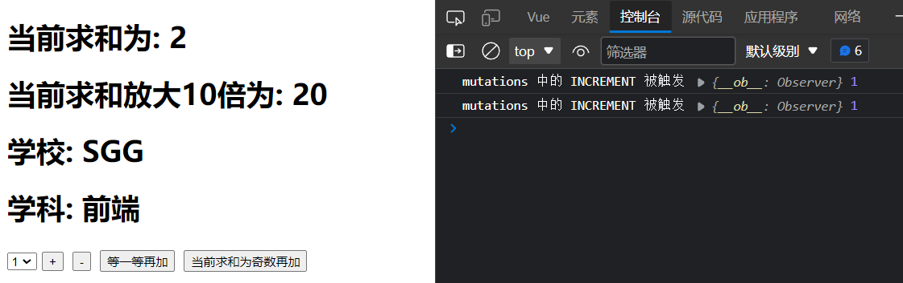

#### 7.1.2 数组写法

数组写法生成的计算属性名和state中的数据变量名一致。

```html
<template>
  <div>
    <h1>当前求和为: {{sum}}</h1>
    <h1>当前求和放大10倍为: {{$store.getters.bigSum}}</h1>
    <h1>学校: {{school}}</h1>
    <h1>学科: {{subject}}</h1>
    <select v-model.number="n">
      <option value="1">1</option>
      <option value="2">2</option>
      <option value="3">3</option>
    </select>
    <button @click="increment">+</button>
    <button @click="decrement">-</button>
    <button @click="incrementWait">等一等再加</button>
    <button @click="incrementOdd">当前求和为奇数再加</button>
  </div>
</template>

<script>
// 导入 mapState 
import {mapState} from 'vuex'

export default {
  name: 'Count',
  data() {
    return {
      n: 1
    }
  },
  computed: {
    // 借助mapState生成计算属性，从state中读取数据。（对象写法）
    // ...mapState({
    //   mySum: 'sum',
    //   mySchool: 'school',
    //   mySubject: 'subject',
    // })

    // 借助mapState生成计算属性，从state中读取数据。（数组写法）
    // 数组写法生成的计算属性名和state中的数据变量名一致。
    ...mapState(['sum', 'school', 'subject'])
  },
  methods: {
    ......
  }
}
</script>

<style>
button {
  margin: 5px;
}
</style>
```

> 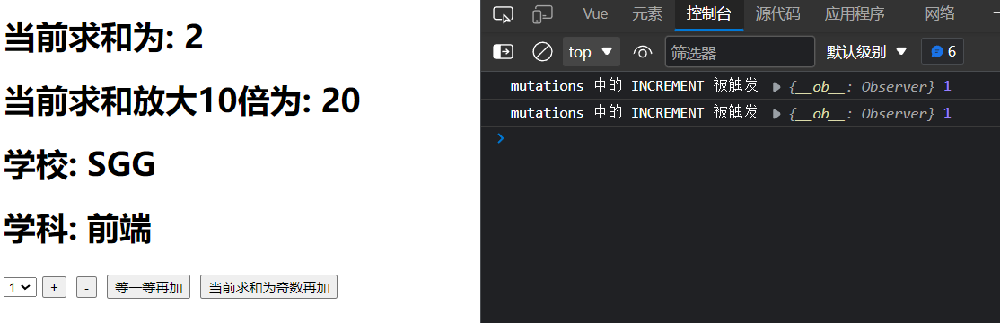

### 7.2 mapGetters 生成 getters 数据对应的计算属性

通过 mapGetters 生成 getters 中各个数据对应的计算属性，可以在页面直接使用计算属性名获取 getters 中的数据值，而不用通过 `$store.getters.变量` 获取。

**mapGetters方法：**用于帮助我们映射`getters`中的数据为计算属性

store/index.js

```js
......

// getters 
const getters = {
  // 会有一个参数 state
  // 获取当前求和放大十倍后的值
  bigSum(state) {
    return state.sum * 10
  }
}

......
```

#### 7.2.1 对象写法

Count.vue

```html
<template>
  <div>
    <h1>当前求和为: {{sum}}</h1>
    <h1>当前求和放大10倍为: {{bigSum}}</h1>
    <h1>学校: {{school}}</h1>
    <h1>学科: {{subject}}</h1>
    <select v-model.number="n">
      <option value="1">1</option>
      <option value="2">2</option>
      <option value="3">3</option>
    </select>
    <button @click="increment">+</button>
    <button @click="decrement">-</button>
    <button @click="incrementWait">等一等再加</button>
    <button @click="incrementOdd">当前求和为奇数再加</button>
  </div>
</template>

<script>
// 导入 mapState mapGetters
import { mapState, mapGetters } from 'vuex'

export default {
  name: 'Count',
  data() {
    return {
      n: 1
    }
  },
  computed: {
    ......

    // 借助mapState生成计算属性，从state中读取数据。（数组写法）
    // 数组写法生成的计算属性名和state中的数据变量名一致。
    ...mapState(['sum', 'school', 'subject']),

    // 借助mapGetters生成计算属性，从getters中读取数据。（对象写法）
    ...mapGetters({bigSum:'bigSum'})
  },
  methods: {
    ......
  }
}
</script>

<style>
button {
  margin: 5px;
}
</style>
```

> 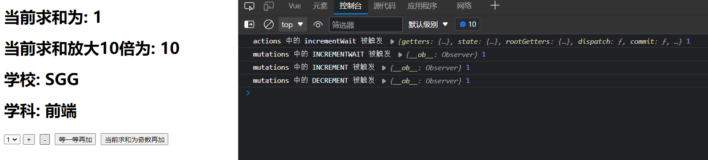

#### 7.2.2 数组写法

> 数组写法生成的计算属性名和getters中的数据变量名一致。

Count.vue

```html
<template>
  <div>
    <h1>当前求和为: {{sum}}</h1>
    <h1>当前求和放大10倍为: {{bigSum}}</h1>
    <h1>学校: {{school}}</h1>
    <h1>学科: {{subject}}</h1>
    <select v-model.number="n">
      <option value="1">1</option>
      <option value="2">2</option>
      <option value="3">3</option>
    </select>
    <button @click="increment">+</button>
    <button @click="decrement">-</button>
    <button @click="incrementWait">等一等再加</button>
    <button @click="incrementOdd">当前求和为奇数再加</button>
  </div>
</template>

<script>
// 导入 mapState mapGetters
import { mapState, mapGetters } from 'vuex'

export default {
  name: 'Count',
  data() {
    return {
      n: 1
    }
  },
  computed: {
    ......

    // 借助mapState生成计算属性，从state中读取数据。（数组写法）
    // 数组写法生成的计算属性名和state中的数据变量名一致。
    ...mapState(['sum', 'school', 'subject']),

    // 借助mapGetters生成计算属性，从getters中读取数据。（对象写法）
    // ...mapGetters({bigSum:'bigSum'})

    //借助mapGetters生成计算属性，从getters中读取数据。（数组写法）
    ...mapGetters(['bigSum'])
  },
  methods: {
    ......
  }
}
</script>

<style>
button {
  margin: 5px;
}
</style>
```

> 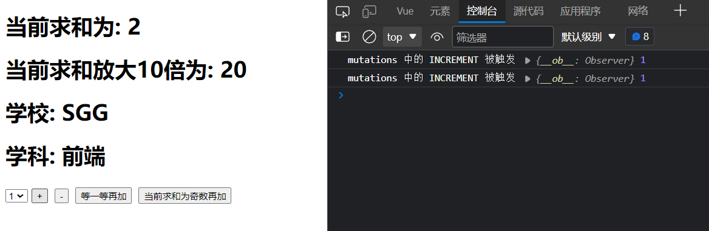

## 8. mapActions & mapMutations

### 8.1 mapMutations

**mapMutations方法：**用于帮助我们生成与`mutations`对话的方法，即：包含`$store.commit(xxx)`的函数

借助mapMutations生成对应的方法，方法中会调用commit去联系mutations

#### 8.1.1 引入 mapMutations

```js
// 引入 mapMutations
import { mapMutations } from 'vuex'
```

#### 8.1.2 对象写法

Count.vue

```html
<template>
  <div>
    <h1>当前求和为: {{sum}}</h1>
    <h1>当前求和放大10倍为: {{bigSum}}</h1>
    <h1>学校: {{school}}</h1>
    <h1>学科: {{subject}}</h1>
    <select v-model.number="n">
      <option value="1">1</option>
      <option value="2">2</option>
      <option value="3">3</option>
    </select>


    <button @click="increment(n)">+</button>
    <button @click="decrement(n)">-</button>


    <button @click="incrementWait">等一等再加</button>
    <button @click="incrementOdd">当前求和为奇数再加</button>
  </div>
</template>

<script>
// 导入 mapState mapGetters
import { mapState, mapGetters } from 'vuex'
// 引入 mapMutations
import { mapMutations } from 'vuex'

export default {
  name: 'Count',
  data() {
    return {
      n: 1
    }
  },
  computed: {
    ......
  },
  methods: {
    // 自己写的方法
    // increment() {
    //   this.$store.commit('INCREMENT', this.n)
    // },
    // decrement() {
    //   this.$store.commit('DECREMENT', this.n)
    // },

    // 借助mapMutations生成对应的方法，方法中会调用commit去联系mutations(对象写法)
    ...mapMutations({
      increment: 'INCREMENT',
      decrement: 'DECREMENT'
    }),
    // 生成的方法为：
    // increment(value) {
    //   this.$store.commit('INCREMENT', value)
    // },
    // 所以在调用mapMutations生成对应的方法时，需要传入value参数

    ......
  }
}
</script>
```

> 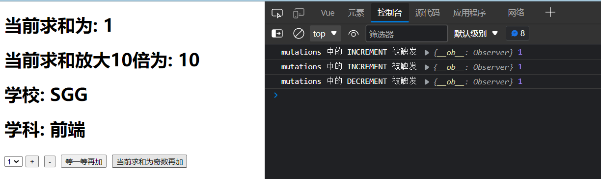

#### 8.1.3 数组写法

Count.vue

```html
<template>
  <div>
    <h1>当前求和为: {{sum}}</h1>
    <h1>当前求和放大10倍为: {{bigSum}}</h1>
    <h1>学校: {{school}}</h1>
    <h1>学科: {{subject}}</h1>
    <select v-model.number="n">
      <option value="1">1</option>
      <option value="2">2</option>
      <option value="3">3</option>
    </select>


    <button @click="INCREMENT(n)">+</button>
    <button @click="DECREMENT(n)">-</button>


    <button @click="incrementWait">等一等再加</button>
    <button @click="incrementOdd">当前求和为奇数再加</button>
  </div>
</template>

<script>
// 导入 mapState mapGetters
import { mapState, mapGetters } from 'vuex'
// 引入 mapMutations
import { mapMutations } from 'vuex'

export default {
  name: 'Count',
  data() {
    return {
      n: 1
    }
  },
  computed: {
    ......
  },
  methods: {
    // 自己写的方法
    // increment() {
    //   this.$store.commit('INCREMENT', this.n)
    // },
    // decrement() {
    //   this.$store.commit('DECREMENT', this.n)
    // },

    // 借助mapMutations生成对应的方法，方法中会调用commit去联系mutations(对象写法)
    // ...mapMutations({
    //   increment: 'INCREMENT',
    //   decrement: 'DECREMENT'
    // }),
    // 借助mapMutations生成对应的方法，方法中会调用commit去联系mutations(数组写法)
    ...mapMutations(['INCREMENT', 'DECREMENT']),

    ......
  }
}
</script>

<style>
button {
  margin: 5px;
}
</style>
```

> 

### 8.2 mapActions

**mapActions方法：**用于帮助我们生成与`actions`对话的方法，即：包含`$store.dispatch(xxx)`的函数

借助mapActions生成对应的方法，方法中会调用dispatch去联系actions

#### 8.2.1 引入 mapActions

```js
// 引入 mapActions 
import { mapActions } from 'vuex'
```

#### 8.2.2 对象写法

Count.vue

```html
<template>
  <div>
    <h1>当前求和为: {{sum}}</h1>
    <h1>当前求和放大10倍为: {{bigSum}}</h1>
    <h1>学校: {{school}}</h1>
    <h1>学科: {{subject}}</h1>
    <select v-model.number="n">
      <option value="1">1</option>
      <option value="2">2</option>
      <option value="3">3</option>
    </select>
    <button @click="INCREMENT(n)">+</button>
    <button @click="DECREMENT(n)">-</button>
    <button @click="incrementWait(n)">等一等再加</button>
    <button @click="incrementOdd(n)">当前求和为奇数再加</button>
  </div>
</template>

<script>
// 导入 mapState mapGetters
import { mapState, mapGetters } from 'vuex'
// 引入 mapMutations
import { mapMutations, mapActions } from 'vuex'

export default {
  name: 'Count',
  data() {
    return {
      n: 1
    }
  },
  computed: {
    ......
  },
  methods: {
    ......

    // 自己写的方法
    // incrementWait() {
    //   this.$store.dispatch('incrementWait', this.n)
    // },
    // incrementOdd() {
    //   this.$store.dispatch('incrementOdd', this.n)
    // }

    // 借助mapActions生成对应的方法，方法中会调用dispatch去联系actions(对象写法)
    ...mapActions({
      incrementWait: 'incrementWait',
      incrementOdd: 'incrementOdd'
    })
    // 生成的方法为：
    // incrementWait(value) {
    //   this.$store.dispatch('incrementWait', value)
    // },
    // 所以在调用mapActions生成对应的方法时，需要传入value参数
  }
}
</script>
```

> 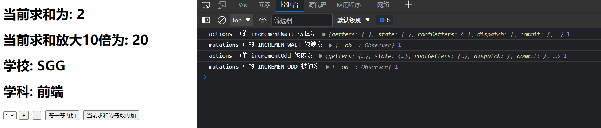

#### 8.2.3 数组写法

```html
<template>
  <div>
    <h1>当前求和为: {{sum}}</h1>
    <h1>当前求和放大10倍为: {{bigSum}}</h1>
    <h1>学校: {{school}}</h1>
    <h1>学科: {{subject}}</h1>
    <select v-model.number="n">
      <option value="1">1</option>
      <option value="2">2</option>
      <option value="3">3</option>
    </select>
    <button @click="INCREMENT(n)">+</button>
    <button @click="DECREMENT(n)">-</button>
    <button @click="incrementWait(n)">等一等再加</button>
    <button @click="incrementOdd(n)">当前求和为奇数再加</button>
  </div>
</template>

<script>
// 导入 mapState mapGetters
import { mapState, mapGetters } from 'vuex'
// 引入 mapMutations
import { mapMutations, mapActions } from 'vuex'

export default {
  name: 'Count',
  data() {
    return {
      n: 1
    }
  },
  computed: {
    ......
  },
  methods: {
    ......

    // 自己写的方法
    // incrementWait() {
    //   this.$store.dispatch('incrementWait', this.n)
    // },
    // incrementOdd() {
    //   this.$store.dispatch('incrementOdd', this.n)
    // }

    // 借助mapActions生成对应的方法，方法中会调用dispatch去联系actions(对象写法)
    // ...mapActions({
    //   incrementWait: 'incrementWait',
    //   incrementOdd: 'incrementOdd'
    // })
    // 借助mapActions生成对应的方法，方法中会调用dispatch去联系actions(数组写法)
    ...mapActions(['incrementWait', 'incrementOdd'])
  }
}
</script>
```

> 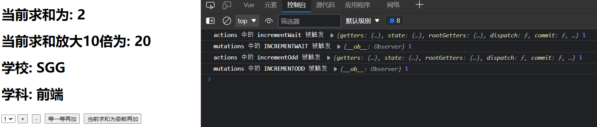

## 9. vuex 总结

### 1.概念

 在Vue中实现集中式状态（数据）管理的一个Vue插件，对vue应用中多个组件的共享状态进行集中式的管理（读/写），也是一种组件间通信的方式，且适用于任意组件间通信。

### 2.何时使用？

 多个组件需要共享数据时

### 3.搭建vuex环境

1. 创建文件：`src/store/index.js`

   ```js
   //引入Vue核心库
   import Vue from 'vue'
   //引入Vuex
   import Vuex from 'vuex'
   //应用Vuex插件
   Vue.use(Vuex)
   
   //准备actions对象——响应组件中用户的动作
   const actions = {}
   //准备mutations对象——修改state中的数据
   const mutations = {}
   //准备state对象——保存具体的数据
   const state = {}
   
   //创建并暴露store
   export default new Vuex.Store({
   	actions,
   	mutations,
   	state
   })
   ```

2. 在`main.js`中创建vm时传入`store`配置项

   ```js
   ......
   //引入store
   import store from './store'
   ......
   
   //创建vm
   new Vue({
   	el:'#app',
   	render: h => h(App),
   	store
   })
   ```

### 4.基本使用

1. 初始化数据、配置`actions`、配置`mutations`，操作文件`store.js`

   ```js
   //引入Vue核心库
   import Vue from 'vue'
   //引入Vuex
   import Vuex from 'vuex'
   //引用Vuex
   Vue.use(Vuex)
   
   const actions = {
       //响应组件中加的动作
   	jia(context,value){
   		// console.log('actions中的jia被调用了',miniStore,value)
   		context.commit('JIA',value)
   	},
   }
   
   const mutations = {
       //执行加
   	JIA(state,value){
   		// console.log('mutations中的JIA被调用了',state,value)
   		state.sum += value
   	}
   }
   
   //初始化数据
   const state = {
      sum:0
   }
   
   //创建并暴露store
   export default new Vuex.Store({
   	actions,
   	mutations,
   	state,
   })
   ```

2. 组件中读取vuex中的数据：`$store.state.sum`

3. 组件中修改vuex中的数据：`$store.dispatch('action中的方法名',数据)`或 `$store.commit('mutations中的方法名',数据)`

   > 备注：若没有网络请求或其他业务逻辑，组件中也可以越过actions，即不写`dispatch`，直接编写`commit`

### 5.getters的使用

1. 概念：当state中的数据需要经过加工后再使用时，可以使用getters加工。

2. 在`store.js`中追加`getters`配置

   ```js
   ......
   
   const getters = {
   	bigSum(state){
   		return state.sum * 10
   	}
   }
   
   //创建并暴露store
   export default new Vuex.Store({
   	......
   	getters
   })
   ```

3. 组件中读取数据：`$store.getters.bigSum`

### 6.四个map方法的使用

不借助map方法时：

```js
computed: {
	sum(){
        return this.$store.state.sum
    }
},
```

1. **mapState方法：**用于帮助我们映射`state`中的数据为计算属性

   ```js
   computed: {
       //借助mapState生成计算属性：sum、school、subject（对象写法）
        ...mapState({sum:'sum',school:'school',subject:'subject'}),
            
       //借助mapState生成计算属性：sum、school、subject（数组写法）
       ...mapState(['sum','school','subject']),
   },
   ```

2. **mapGetters方法：**用于帮助我们映射`getters`中的数据为计算属性

   ```js
   computed: {
       //借助mapGetters生成计算属性：bigSum（对象写法）
       ...mapGetters({bigSum:'bigSum'}),
   
       //借助mapGetters生成计算属性：bigSum（数组写法）
       ...mapGetters(['bigSum'])
   },
   ```

3. **mapActions方法：**用于帮助我们生成与`actions`对话的方法，即：包含`$store.dispatch(xxx)`的函数

   ```js
   methods:{
       //靠mapActions生成：incrementOdd、incrementWait（对象形式）
       ...mapActions({incrementOdd:'jiaOdd',incrementWait:'jiaWait'})
   
       //靠mapActions生成：incrementOdd、incrementWait（数组形式）
       ...mapActions(['jiaOdd','jiaWait'])
   }
   ```

4. **mapMutations方法：**用于帮助我们生成与`mutations`对话的方法，即：包含`$store.commit(xxx)`的函数

   ```js
   methods:{
       //靠mapActions生成：increment、decrement（对象形式）
       ...mapMutations({increment:'JIA',decrement:'JIAN'}),
       
       //靠mapMutations生成：JIA、JIAN（对象形式）
       ...mapMutations(['JIA','JIAN']),
   }
   ```

> 备注：mapActions与mapMutations使用时，若需要传递参数需要：在模板中绑定事件时传递好参数，否则参数是事件对象。

