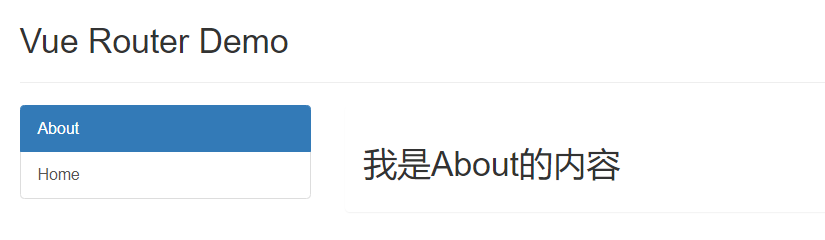
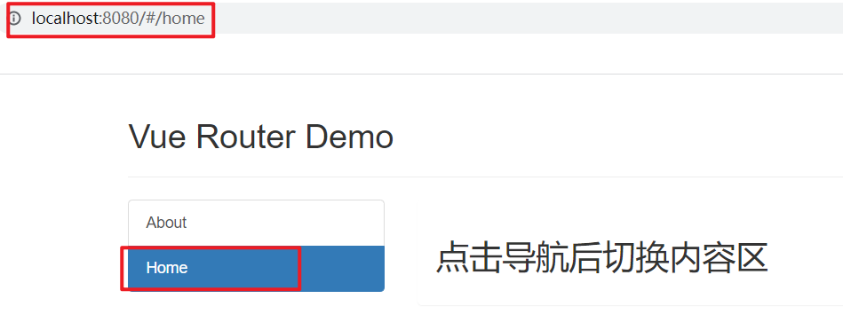

# 路由及路由的基本使用

## 1. 相关概念

### 1.1 SPA

SPA 指的是一个 web 网站只有唯一的一个 HTML 页面，所有组件的展示与切换都在这唯一的一个页面内完成。 此时，不同组件之间的切换需要通过前端路由来实现。

1. 单页 Web 应用（single page web application，SPA）。
2. 整个应用只有一个完整的页面。
3. 点击页面中的导航链接不会刷新页面，只会做页面的局部更新。
4. 数据需要通过 ajax 请求获取。

在 SPA 项目中，不同功能之间的切换，要依赖于前端路由来完成。

### 1.2 vue-router

#### 1.2.1 vue-router 的概念

vue-router 是 vue 的一个插件库，是 vue.js 官方给出的路由解决方案，专门用来实现 SPA 应用。它只能结合 vue 项目进行使用，能够轻松的管理 SPA 项目中组件的切换。

#### 1.2.2 vue-router 的版本

vue-router 目前有 3.x 的版本和 4.x 的版本。

其中： vue-router 3.x 结合 vue2 进行使用，[vue-router 3.x 的官方文档地址](https://v3.router.vuejs.org/zh/) vue-router 4.x 结合 vue3 进行使用，[vue-router 4.x 的官方文档地址](https://router.vuejs.org/zh/)

### 1.3 路由

#### 1.3.1 路由的概念

一个路由就是一组映射关系（key - value），key 为路径, value 可能是 function 或 component。

一个路由 key 对应的 value 是 function 还是 component 取决于路由的类别。

#### 1.3.2 路由的分类

路由分为前端路由和后端路由。

1. 后端路由：
   1. 理解：后端路由指的是，请求方式、请求地址与 function 处理函数之间的对应关系。value 是 function, 用于处理客户端提交的请求。
   2. 工作过程：服务器接收到一个请求时, 根据请求路径找到匹配的函数 来处理请求, 返回响应数据。
2. 前端路由：
   1. 理解：前端路由指的是，路径 与 component 组件之间的对应关系。value 是 component，用于展示页面内容。
   2. 工作过程：当浏览器的路径改变时, 对应的组件就会显示。 ① 用户点击了页面上的路由链接 ② 导致了 URL 地址栏中的值发生了变化 ③ 前端路由监听了到地址的变化 ④ 前端路由把当前地址对应的组件渲染都浏览器中

## 2. 路由的基本使用

### 2.1 案例实现效果



### 2.2 案例准备

#### 2.2.1 静态页面

```html
<html lang="en">
<head>
  <meta charset="utf-8">
  <title>Vue App</title>
  <link rel="stylesheet" href="./css/bootstrap.css">
</head>
<body>
  <div>
    <div class="row">
      <div class="col-xs-offset-2 col-xs-8">
        <div class="page-header"><h2>Vue Router Demo</h2></div>
      </div>
    </div>
    <div class="row">
      <div class="col-xs-2 col-xs-offset-2">
        <div class="list-group">
          <a class="list-group-item active" href="./about.html">About</a>
          <a class="list-group-item" href="./home.html">Home</a>
        </div>
      </div>
      <div class="col-xs-6">
        <div class="panel">
          <div class="panel-body">
            <h2>我是About的内容</h2>
          </div>
        </div>
      </div>
    </div>
  </div>
</body>
</html>
```

#### 2.2.2 文件目录结构


#### 2.2.3 index.js中引入bootstrap

```html
    <!-- 引入第三方css样式 bootstrap -->
    <link rel="stylesheet" href="<%= BASE_URL %>css/bootstrap.css">
```

#### 2.2.4 组件的拆分

main.js

```js
import Vue from 'vue'
import App from './App.vue'

//关闭vue的生产提示
Vue.config.productionTip = false

new Vue({
  render: h => h(App),
}).$mount('#app')
```

App.vue

```html
<template>
  <div>
    <!-- 使用子组件 -->
    <div class="row">
      <div class="col-xs-offset-2 col-xs-8">
        <div class="page-header">
          <h2>Vue Router Demo</h2>
        </div>
      </div>
    </div>
    <div class="row">
      <div class="col-xs-2 col-xs-offset-2">
        <div class="list-group">
          <a class="list-group-item active" href="./about.html">About</a>
          <a class="list-group-item" href="./home.html">Home</a>
        </div>
      </div>
      <div class="col-xs-6">
        <div class="panel">
          <div class="panel-body">
            <h2>点击导航后切换内容区</h2>
          </div>
        </div>
      </div>
    </div>
  </div>
</template>

<script>
// 导入子组件

export default {
  name: 'App',
  // 注册子组件
  components: {

  }
}
</script>
```

Home.vue

```html
<template>
  <div>
    <h2>Home组件</h2>
  </div>
</template>

<script>
export default {
  name: 'Home'
}
</script>

<style>

</style>
```

About.vue

```html
<template>
  <div>
    <h2>About组件</h2>
  </div>
</template>

<script>
export default {
  name: 'About'
}
</script>

<style>

</style>
```

### 2.3 安装 vue-router

> 注意： vue-router 3.x 结合 vue2 进行使用，[vue-router 3.x 的官方文档地址](https://v3.router.vuejs.org/zh/) vue-router 4.x 结合 vue3 进行使用，[vue-router 4.x 的官方文档地址](https://router.vuejs.org/zh/)

> 这里vue的版本为2.x，所以安装vue-router的3.x版本

```npm
npm i vue-router@3
```

### 2.4 引入与使用 vue-router 插件

> 由于 vue-router 是 vue 中的一个插件，所以使用 vue-router 需要先引入和使用 vue-router。

```js
// 引入 vue-router
import VueRouter from 'vue-router'

// 使用 vue-router 插件
Vue.use(VueRouter)
```

> 在引入和使用 vue-router 之后，实例化 vue 实例对象时可以传入一个配置项 router。

### 2.5 新建文件夹创建路由器

目录结构：  router/index.js

```js
// 该文件专门用于创建整个应用的路由器
import VueRouter from 'vue-router'
//引入组件
import About from '../components/About'
import Home from '../components/Home'

//创建并暴露一个路由器
export default new VueRouter({
	// 路由，地址与组件的对应关系
	routes:[
		{
			path:'/about',
			component:About
		},
		{
			path:'/home',
			component:Home
		}
	]
})
```

### 2.6 引入并配置路由器

main.js

```js
import Vue from 'vue'
import App from './App.vue'
// 引入 vue-router
import VueRouter from 'vue-router'
// 引入路由器
import router from './router'

// 使用 vue-router 插件
Vue.use(VueRouter)

//关闭vue的生产提示
Vue.config.productionTip = false

new Vue({
  render: h => h(App),
  // 配置路由器
  router: router
}).$mount('#app')
```

### 2.7 实现导航区地址修改

实现导航区地址的修改，需要使用 vue-router 提供的标签 `<router-link ></router-link>`，跳转到的地址通过 router-link 标签上的 to 属性指定。

> 跳转到的路由地址需要与路由器中配置的一致 激活时的样式可以通过 active-class 属性指定

```html
	<div class="col-xs-2 col-xs-offset-2">
        <div class="list-group">
          <!-- 原始html中使用a标签实现页面的跳转 -->
          <!-- <a class="list-group-item active" href="./about.html">About</a> -->
          <!-- <a class="list-group-item" href="./home.html">Home</a> -->
          
          <!-- Vue中借助router-link标签实现路由的切换 -->
          <!-- 跳转到的路由地址需要与路由器中配置的一致 -->
          <!-- 通过 active-class 属性指定激活时的样式 -->
          <router-link class="list-group-item" active-class="active" to="/about">About</router-link>
          <router-link class="list-group-item" active-class="active" to="/home">Home</router-link>
        </div>
      </div>
```

>  

### 2.8 当前路由对应的组件的呈现

指定当前路由对应组件呈现的位置使用 router-view 标签。

```html
	<div class="col-xs-6">
        <div class="panel">
          <div class="panel-body">
			<!-- <h2>点击导航后切换内容区</h2> -->
			
            <!-- 指定当前路由对应组件的呈现位置 -->
            <router-view></router-view>
          </div>
        </div>
      </div>
```

>  

## 3. 几个注意点

1. 路由组件通常存放在`pages`文件夹，一般组件通常存放在`components`文件夹。
2. 通过切换，“隐藏”了的路由组件，默认是被销毁掉的，需要的时候再去挂载。
3. 每个组件都有自己的`$route`属性，里面存储着自己的路由信息。
4. 整个应用共用一个router，可以通过组件的`$router`属性获取到。

## 4. 总结 路由及路由的基本使用

### 4.1 路由

1. 理解： 一个路由（route）就是一组映射关系（key - value），多个路由需要路由器（router）进行管理。
2. 前端路由：key是路径，value是组件。

### 4.2 基本使用

1. 安装vue-router，命令：`npm i vue-router`

2. 应用插件：`Vue.use(VueRouter)`

3. 编写router配置项:

   ```js
   //引入VueRouter
   import VueRouter from 'vue-router'
   //引入Luyou 组件
   import About from '../components/About'
   import Home from '../components/Home'
   
   //创建router实例对象，去管理一组一组的路由规则
   const router = new VueRouter({
   	routes:[
   		{
   			path:'/about',
   			component:About
   		},
   		{
   			path:'/home',
   			component:Home
   		}
   	]
   })
   
   //暴露router
   export default router
   ```

4. 实现切换（active-class可配置高亮样式）

   ```vue
   <router-link active-class="active" to="/about">About</router-link>
   ```

5. 指定展示位置

   ```vue
   <router-view></router-view>
   ```

