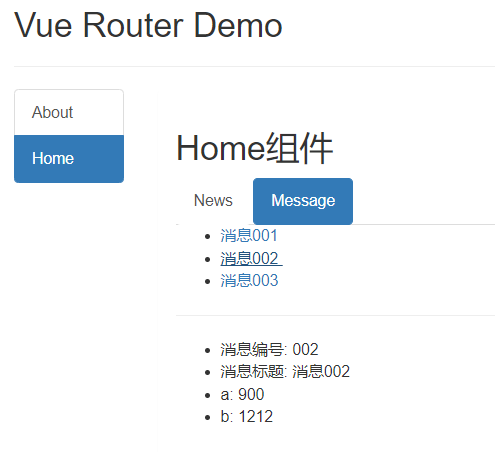
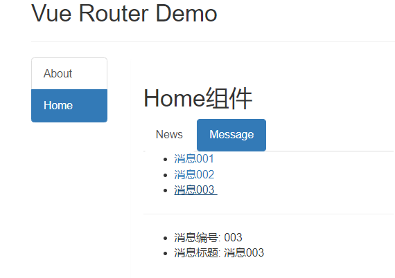
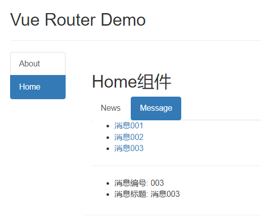

# 路由传参 & 命名路由

## 1. 页面组件

### 1.1 目录结构


### 1.3 路由配置

```js
// 该文件专门用于创建整个应用的路由器
import VueRouter from 'vue-router'
//引入组件
import About from '../pages/About'
import Home from '../pages/Home'
import Message from '../pages/Message'
import News from '../pages/News'
import Detail from '../pages/Detail'

//创建并暴露一个路由器
export default new VueRouter({
  routes: [
    { path: '/about', component: About },
    {
      path: '/home',
      component: Home,
      children: [
        { path: 'news', component: News },
        {
          path: 'message',
          component: Message,
          children: [
            { path: 'detail', component: Detail }
          ]
        }
      ]
    }
  ]
})
```

### 1.2 组件

Home.vue

```html
<template>
  <div>
    <h2>Home组件</h2>
    <ul class="nav nav-tabs">
      <li>
        <router-link class="list-group-item" active-class="active" to="/home/news">News</router-link>
      </li>
      <li>
        <router-link class="list-group-item" active-class="active" to="/home/message">Message</router-link>
      </li>
    </ul>
    <div>
      <router-view></router-view>
    </div>
  </div>
</template>

<script>
export default {
  name: 'Home'
}
</script>

<style>
</style>
```

Message.vue

```html
<template>
  <div>
    <ul>
      <li v-for="m in messageList" :key="m.id">
        <router-link to="/home/message/detail">{{m.title}}</router-link>&nbsp;&nbsp;
      </li>
    </ul>
    <hr>
    <router-view></router-view>
  </div>
</template>

<script>
export default {
  name: 'Message',
  data() {
    return {
      messageList: [
        {id: '001', title: '消息001'},
        {id: '002', title: '消息002'},
        {id: '003', title: '消息003'},
      ]
    }
  },
}
</script>

<style>
</style>
```

Detail.vue

```html
<template>
  <div>
    <ul>
      <li>消息编号: {{}}</li>
      <li>消息标题: {{}}</li>
    </ul>
  </div>
</template>

<script>
export default {
  name: 'Detail'
}
</script>

<style>
</style>
```

> 

## 2. 路由 query 传参

### 2.1 使用 query 传参

#### 2.1.1 to 的字符串写法

```html
    <ul>
      <li v-for="m in messageList" :key="m.id">
        <router-link :to="`/home/message/detail?id=${m.id}&title=${m.title}`">{{m.title}}</router-link>&nbsp;&nbsp;
      </li>
    </ul>
```

#### 2.1.2 to 的对象写法

```html
    <ul>
      <li v-for="m in messageList" :key="m.id">
        <!-- <router-link :to="`/home/message/detail?id=${m.id}&title=${m.title}`">{{m.title}}</router-link>&nbsp;&nbsp; -->
        <router-link :to="{
          path: '/home/message/detail',
          query: {
            id: m.id,
            title: m.title
          }
        }">
          {{m.title}}
        </router-link>
        &nbsp;&nbsp;
      </li>
    </ul>
```

### 2.2 组件接收 query 参数

在路由跳转时通过 query 进行传参，传递的参数会被存放在组件实例对象的 `$route` 属性上。

Detail.vue

```html
<template>
  <div>
    <ul>
      <li>消息编号: {{}}</li>
      <li>消息标题: {{}}</li>
    </ul>
  </div>
</template>

<script>
export default {
  name: 'Detail',
  mounted() {
    console.log(this.$route)
  }
}
</script>

<style>
</style>
```

> 

Detail.vue

```html
<template>
  <div>
    <ul>
      <li>消息编号: {{$route.query.id}}</li>
      <li>消息标题: {{$route.query.title}}</li>
    </ul>
  </div>
</template>
```

> 

### 2.3 总结 路由 query 传参

1. 传递参数

   ```html
   <!-- 跳转并携带query参数，to的字符串写法 -->
   <router-link :to="/home/message/detail?id=666&title=你好">跳转</router-link>
   				
   <!-- 跳转并携带query参数，to的对象写法 -->
   <router-link 
   	:to="{
   		path:'/home/message/detail',
   		query:{
   		   id:666,
               title:'你好'
   		}
   	}"
   >跳转</router-link>
   ```

2. 接收参数：

   ```js
   $route.query.id
   $route.query.title
   ```

## 3. 命名路由

命名路由可以简化使用路由进行跳转时路径的写法。

### 3.1 配置命名路由

设置命名路由，在配置路由时，为路由添加一个 name 配置项。

router/index.js

```js
// 该文件专门用于创建整个应用的路由器
import VueRouter from 'vue-router'
//引入组件
import About from '../pages/About'
import Home from '../pages/Home'
import Message from '../pages/Message'
import News from '../pages/News'
import Detail from '../pages/Detail'

//创建并暴露一个路由器
export default new VueRouter({
  routes: [
    {
      name: 'about',
      path: '/about',
      component: About
    },
    {
      name: 'home',
      path: '/home',
      component: Home,
      children: [
        {
          name: 'news',
          path: 'news',
          component: News
        },
        {
          name: 'message',
          path: 'message',
          component: Message,
          children: [
            {
              name: 'messageDetail',
              path: 'detail',
              component: Detail
            }
          ]
        }
      ]
    }
  ]
})
```

### 3.2 使用命名路由

使用命名路由时，router-link 标签的 to 属性需要使用对象写法，在对象写法中，使用name 替代原来的 path。

Message.vue

```html
<router-link :to="{
  name: 'messageDetail',
  query: {
    id: m.id,
    title: m.title
  }
}">
  {{m.title}}
</router-link>
```

> 

### 3.3 总结 命名路由

1. 作用：可以简化路由的跳转。

2. 如何使用

   1. 给路由命名：

      ```js
      {
      	path:'/demo',
      	component:Demo,
      	children:[
      		{
      			path:'test',
      			component:Test,
      			children:[
      				{
                            name:'hello' //给路由命名
      					path:'welcome',
      					component:Hello,
      				}
      			]
      		}
      	]
      }
      ```

   2. 简化跳转：

      ```html
      <!--简化前，需要写完整的路径 -->
      <router-link to="/demo/test/welcome">跳转</router-link>
      
      <!--简化后，直接通过名字跳转 -->
      <router-link :to="{name:'hello'}">跳转</router-link>
      
      <!--简化写法配合传递参数 -->
      <router-link 
      	:to="{
      		name:'hello',
      		query:{
      		   id:666,
                  title:'你好'
      		}
      	}"
      >跳转</router-link>
      ```

## 4. 路由 params 传参

### 4.1 使用 params 参数

#### 4.1.1 设置路由地址占位符

router/index.js

```js
        {
          name: 'message',
          path: 'message',
          component: Message,
          children: [
            {
              name: 'messageDetail',
              // :id :title 均为params参数的占位
              path: 'detail/:id/:title',
              component: Detail
            }
          ]
        }
```

#### 4.1.2 params 参数字符串写法

```html
    <ul>
      <li v-for="m in messageList" :key="m.id">
        <router-link :to="`/home/message/detail/${m.id}/${m.title}`">{{m.title}}</router-link>&nbsp;&nbsp;
          {{m.title}}
        </router-link>
        &nbsp;&nbsp;
      </li>
    </ul>
```

#### 4.1.3 params 参数对象写法

> 注意：使用 params 进行传参时，路由地址**不能使用 path，只能使用 name**。即 params 进行传参时使用对象写法只能使用命名路由。

```html
    <ul>
      <li v-for="m in messageList" :key="m.id">
        <!-- <router-link :to="`/home/message/detail/${m.id}/${m.title}`">{{m.title}}</router-link>&nbsp;&nbsp; -->
        <router-link :to="{
          name: 'messageDetail',
          params: {
            id: m.id,
            title: m.title
          }
        }">
          {{m.title}}
        </router-link>
        &nbsp;&nbsp;
      </li>
    </ul>
```

### 4.2 组件接收 params 参数

在路由跳转时通过 params 进行传参，传递的参数会被存放在组件实例对象的 `$route` 属性上。

```html
<template>
  <div>
    <ul>
      <li>消息编号: {{$route.params.id}}</li>
      <li>消息标题: {{$route.params.title}}</li>
    </ul>
  </div>
</template>

<script>
export default {
  name: 'Detail',
  mounted() {
    console.log(this.$route)
  }
}
</script>

<style>
</style>
```

> 

### 4.3 总结 路由 params 传参

1. 配置路由，声明接收params参数

   ```js
   {
   	path:'/home',
   	component:Home,
   	children:[
   		{
   			path:'news',
   			component:News
   		},
   		{
   			component:Message,
   			children:[
   				{
   					name:'xiangqing',
   					path:'detail/:id/:title', //使用占位符声明接收params参数
   					component:Detail
   				}
   			]
   		}
   	]
   }
   ```

2. 传递参数

   ```html
   <!-- 跳转并携带params参数，to的字符串写法 -->
   <router-link :to="/home/message/detail/666/你好">跳转</router-link>
   				
   <!-- 跳转并携带params参数，to的对象写法 -->
   <router-link 
   	:to="{
   		name:'xiangqing',
   		params:{
   		   id:666,
               title:'你好'
   		}
   	}"
   >跳转</router-link>
   ```

   > 特别注意：路由携带params参数时，若使用to的对象写法，则不能使用path配置项，必须使用name配置！

3. 接收参数：

   ```js
   $route.params.id
   $route.params.title
   ```

## 5. 路由的 props 配置

### 5.1 第一种写法：props值为对象

该对象中所有的key-value的组合最终都会通过props传给组件

> 但是这种写法传递的数据为死数据

router/index.js

```js
        {
          name: 'message',
          path: 'message',
          component: Message,
          children: [
            {
              name: 'messageDetail',
              // :id :title 均为params参数的占位
              path: 'detail/:id/:title',
              component: Detail,
              props: {a: 900, b: 1212}
            }
          ]
        }
```

Detail.vue

```html
<template>
  <div>
    <ul>
      <li>消息编号: {{$route.params.id}}</li>
      <li>消息标题: {{$route.params.title}}</li>
      <li>a: {{a}}</li>
      <li>b: {{b}}</li>
    </ul>
  </div>
</template>

<script>
export default {
  name: 'Detail',
  props: ['a', 'b'],
  mounted() {
    console.log(this.$route)
  }
}
</script>

<style>
</style>
```

> 

### 5.2 第二种写法：props值为布尔值

布尔值为true，则把路由收到的所有params参数通过props传给组件。

router/index.js

```js
        {
          name: 'message',
          path: 'message',
          component: Message,
          children: [
            {
              name: 'messageDetail',
              // :id :title 均为params参数的占位
              path: 'detail/:id/:title',
              component: Detail,
              // props: {a: 900, b: 1212}
              props: true
            }
          ]
        }
```

Detail.vue

```html
<template>
  <div>
    <ul>
      <li>消息编号: {{id}}</li>
      <li>消息标题: {{title}}</li>
    </ul>
  </div>
</template>

<script>
export default {
  name: 'Detail',
  props: ['id', 'title'],
  mounted() {
    console.log(this.$route)
  }
}
</script>

<style>
</style>
```

> 

### 5.3 第三种写法：props值为函数

该函数返回的对象中每一组key-value都会通过props传给组件

Detail.vue

> 使用 query 传参

```html
        <router-link :to="{
          name: 'messageDetail',
          query: {
            id: m.id,
            title: m.title
          }
        }">
          {{m.title}}
        </router-link>
```

router/index.js

```js
        {
          name: 'message',
          path: 'message',
          component: Message,
          children: [
            {
              name: 'messageDetail',
              // :id :title 均为params参数的占位
              path: 'detail',
              component: Detail,
              // props: {a: 900, b: 1212}
              // props: true
              props($route) {
                return {
                  id: $route.query.id,
                  title: $route.query.title
                }
              },
              // 直接从 $route 中解构出 query
              // props({query}) {
              //   return {
              //     id: query.id,
              //     title: query.title
              //   }
              // }
            }
          ]
        }
```

Detail.vue

```html
<template>
  <div>
    <ul>
      <li>消息编号: {{id}}</li>
      <li>消息标题: {{title}}</li>
    </ul>
  </div>
</template>

<script>
export default {
  name: 'Detail',
  props: ['id', 'title'],
  mounted() {
    console.log(this.$route)
  }
}
</script>

<style>
</style>
```

> 

### 5.4 总结 路由的 props 配置

 作用：让路由组件更方便的收到参数

```js
{
	name:'xiangqing',
	path:'detail/:id',
	component:Detail,

	//第一种写法：props值为对象，该对象中所有的key-value的组合最终都会通过props传给Detail组件
	// props:{a:900}

	//第二种写法：props值为布尔值，布尔值为true，则把路由收到的所有params参数通过props传给Detail组件
	// props:true
	
	//第三种写法：props值为函数，该函数返回的对象中每一组key-value都会通过props传给Detail组件
	props(route){
		return {
			id:route.query.id,
			title:route.query.title
		}
	}
}
```

## 6. `<router-link>`的replace属性

1. 作用：控制路由跳转时操作浏览器历史记录的模式
2. 浏览器的历史记录有两种写入方式：分别为`push`和`replace`，`push`是追加历史记录，`replace`是替换当前记录。路由跳转时候默认为`push`
3. 如何开启`replace`模式：`<router-link replace .......>News</router-link>`

