# 24.props

### 1 组件的 props

为了提高组件的复用性，在封装 vue 组件时需要遵守如下的原则：

> 组件的 DOM 结构、Style 样式要尽量复用
> 组件中要展示的数据，尽量由组件的使用者提供

为了方便使用者为组件提供要展示的数据，vue 组件提供了 props 的概念。

props 是组件的自定义属性，组件的使用者可以通过 props 把数据传递到子组件内部，供子组件内部进行使用。

props 的作用：
父组件通过 props 向子组件传递要展示的数据。

props 的好处：
提高了组件的复用性。

### 2 在组件中声明 props

在封装 vue 组件时，可以把动态的数据项声明为 props 自定义属性。自定义属性可以在当前组件的模板结构中被直接使用。示例代码如下：

```html
<template>
  <div>
    <h3>标题：{{title}}</h3>
    <h5>作者：{{author}}</h5>
    <h6>发布时间：{{pubTime}}</h6>
  </div>
</template>

<script>
export default {
  name: 'MyArticle',
  // 外界可以传递指定的数据，到当前的组件中
  props: ['title', 'author', 'pubTime']
}
</script>
```

父组件向子组件传值，可以直接传值，也可以使用动态属性绑定。

可以使用 v-bind 属性绑定的形式，为组件动态绑定 props 的值。

```html
<template>
  <div>
    <h1>这是 App.vue 根组件</h1>
    <hr />
    <my-article :title="info.title" :author="'post by ' + info.author" pub-time="1989"></my-article>
  </div>
</template>

<script>
import MyArticle from './Article.vue'

export default {
  name: 'MyApp',
  data() {
    return {
      info: {
        title: 'abc',
        author: '123',
      },
    }
  },
  components: {
    MyArticle,
  },
}
</script>
```

> 使用v-bind指令的形式向子组件中的props配置项传递数据，传递的为js表达式的结果，如果没有使用v-bind，传递的为字符串类型的数据。

### 3 无法使用未声明的 props

如果父组件给子组件传递了未声明的 props 属性，则这些属性会被忽略，无法被子组件使用，示例代码如下：

```html
<template>
  <div>
    <h3>标题：{{title}}</h3>
    <h5>作者：{{author}}</h5>
    <h6>发布时间：{{pubTime}}</h6>
  </div>
</template>

<script>
export default {
  name: 'MyArticle',
  // 外界可以传递指定的数据，到当前的组件中
  props: ['title', 'author']
}
</script>


<template>
  <div>
    <h1>这是 App.vue 根组件</h1>
    <hr />
    <my-article :title="info.title" :author="'post by ' + info.author" pub-time="1989"></my-article>
  </div>
</template>

<script>
import MyArticle from './Article.vue'

export default {
  name: 'MyApp',
  data() {
    return {
      info: {
        title: 'abc',
        author: '123',
      },
    }
  },
  components: {
    MyArticle,
  },
}
</script>
```

在子组件中不存在pubTime。

### 4 props 的大小写命名

组件中如果使用“camelCase (驼峰命名法)”声明了 props 属性的名称，则有两种方式为其绑定属性的值：

```html
<template>
  <div>
    <h6>发布时间：{{pubTime}}</h6>
  </div>
</template>
<script>
export default {
  name: 'MyArticle',
  // 外界可以传递指定的数据，到当前的组件中
  props: ['pubTime']
}
</script>


<template>
  <div>
    <h1>这是 App.vue 根组件</h1>
    <hr />
    <my-article pub-time="1989"></my-article>
    <my-article pubTime="1989"></my-article>
  </div>
</template>

<script>
import MyArticle from './Article.vue'

export default {
  name: 'MyApp',
  data() {
    return {
      info: {
        title: 'abc',
        author: '123',
      },
    }
  },
  components: {
    MyArticle,
  },
}
</script>
```

### 5 props 验证

props 验证指的是：在封装组件时对外界传递过来的 props 数据进行合法性的校验，从而防止数据不合法的问题。

使用**数组类型的 props 节点**的缺点：无法为每个 prop 指定具体的数据类型。

### 6 对象类型的 props 节点

使用对象类型的 props 节点，可以对每个 prop 进行数据类型的校验


语法：

```yaml
// props: ['count', 'state'],
  props: {
    count: {
      type: Number
    },
    state: Boolean
  }
```


```html
<template>
  <div>
    <p>数量：{{ count }}</p>
    <p>状态：{{ state }}</p>
  </div>
</template>

<script>
export default {
  name: 'MyCount',
  // props: ['count', 'state'],
  props: {
    count: {
      type: Number
    },
    state: Boolean
  }
}
</script>

<style lang="less" scoped></style>
```

### 7 props 验证

对象类型的 props 节点提供了多种数据验证方案。

> ① 基础的类型检查
> ② 多个可能的类型
> ③ 必填项校验
> ④ 属性默认值
> ⑤ 自定义验证函数

### 8 基础的类型检查

可以直接为组件的 prop 属性指定基础的校验类型，从而防止组件的使用者为其绑定错误类型的数据。

#### 8.1 支持校验的基础类型

```javascript
String
Number
Boolean
Array
Object
Date
Function
Symbol
```

### 9 多个可能的类型

如果某个 prop 属性值的类型不唯一，此时可以通过数组的形式，为其指定多个可能的类型

info的值可能是字符串或数字

```properties
 info: [String, Number]
```

```html
<template>
  <div>
    <p>数量：{{ count }}</p>
    <p>状态：{{ state }}</p>
  </div>
</template>

<script>
export default {
  name: 'MyCount',
  // props: ['count', 'state'],
  props: {
    count: {
      type: Number
    },
    state: Boolean,
    info: [String, Number]
  },
}
</script>

<style lang="less" scoped></style>
```

### 10 必填项校验

如果组件的某个 prop 属性是必填项，必须让组件的使用者为其传递属性的值。

可以将其设置为必填项：

```yaml
count: {
      type: Number,
      required: true //count属性的值必须有
    },
```

```html
    
<template>
  <div>
    <p>数量：{{ count }}</p>
    <p>状态：{{ state }}</p>
  </div>
</template>

<script>
export default {
  name: 'MyCount',
  // props: ['count', 'state'],
  props: {
    count: {
      type: Number,
      required: true
    },
    state: Boolean,
    info: [String, Number]
  },
}
</script>

<style lang="less" scoped></style>
```

### 11 属性默认值

在封装组件时，可以为某个 prop 属性指定默认值。

```yaml
 count: {
      type: Number,
      required: true,
      default: 100 //如果没有传值，count默认为100
    },
```

```html
   
<template>
  <div>
    <p>数量：{{ count }}</p>
    <p>状态：{{ state }}</p>
  </div>
</template>

<script>
export default {
  name: 'MyCount',
  // props: ['count', 'state'],
  props: {
    count: {
      type: Number,
      required: true,
      default: 100
    },
    state: Boolean,
    info: [String, Number]
  },
}
</script>

<style lang="less" scoped></style>
```

### 12 自定义验证函数

在封装组件时，可以为 prop 属性指定自定义的验证函数，从而对 prop 属性的值进行更加精确的控制。

通过validator函数对type属性进行校验，value为传入给type的值，type的值为数组中的一个。
返回值为true表示验证通过，否则验证失败。

```yaml
  type: {
      validator(value) {
        return ['success', 'warning', 'danger'].indexOf(value) !== -1
      }
    }
```

```html
  
<template>
  <div>
    <p>数量：{{ count }}</p>
    <p>状态：{{ state }}</p>
  </div>
</template>

<script>
export default {
  name: 'MyCount',
  // props: ['count', 'state'],
  props: {
    count: {
      type: Number,
      required: true,
      default: 100
    },
    state: Boolean,
    info: [String, Number],
    myType: {
      validator(value) {
        return ['success', 'warning', 'danger'].indexOf(value) !== -1
      }
    }
  },
}
</script>

<style lang="less" scoped></style>

<!--
<MyCount :myType="'success'" />  合法
<MyCount :myType="'info'" /> 不合法
-->
```

### 13 props配置项的注意点

1. 不要修改props中的值，props是只读的，Vue底层会监测你对props的修改，如果进行了修改，就会发出警告，若业务需求确实需要修改，那么请复制props的内容到data中一份，然后去修改data中的数据。
2. 子组件接收到的数据是父组件传递数据的 **引用**，而不是拷贝。因此在子组件中修改props，父组件的相应的属性也会被改变
3. 如果data与props中存在同名的变量，那么会优先使用props中的数据，因为优先级props更高
4. props中不要使用已经被vue使用了的关键字作为接收父组件传递数据的变量名。

### 14 props实现子组件给父组件传递数据

使用props实现子组件给父组件传递数据有一个前提：父组件得提前给子组件一个函数，子组件在合适的时候调用函数

> 以下代码流程总结，父组件将方法传递给子组件，子组件再将数据作为参数传递给父组件传过来的方法。

**App.vue**

```html
<template>
	<div class="app">
		<h1>{{msg}}，学生姓名是:{{studentName}}</h1>

		<!-- 通过父组件给子组件传递函数类型的props实现：子给父传递数据 -->
		<School :getSchoolName="getSchoolName"/>
	</div>
</template>

<script>
	import Student from './components/Student'
	import School from './components/School'

	export default {
		name:'App',
		components:{School,Student},
		data() {
			return {
				msg:'你好啊！',
				studentName:''
			}
		},
		methods: {
            //父组件给子组件提供的函数
			getSchoolName(name){
				console.log('App收到了学校名：',name)
			},
		},s
	}
</script>

<style scoped>
	.app{
		background-color: gray;
		padding: 5px;
	}
</style>
```

**School.vue**

```html
<template>
	<div class="school">
		<h2>学校名称：{{name}}</h2>
		<h2>学校地址：{{address}}</h2>
		<button @click="sendSchoolName">把学校名给App</button>
	</div>
</template>

<script>
	export default {
		name:'School',
		props:['getSchoolName'],
		data() {
			return {
				name:'尚硅谷',
				address:'北京',
			}
		},
		methods: {
            //子组件调用sendSchoolName方法时，父组件的getSchoolName方法也被调用
			sendSchoolName(){
				this.getSchoolName(this.name)
			}
		},
	}
</script>

<style scoped>
	.school{
		background-color: skyblue;
		padding: 5px;
	}
</style>
```

# 25.mixin 混入

------

## 1. mixin 混入

mixin (混入)可以把多个组件共用的配置提取成一个混入对象，实现对组件配置项的复用。

## 2. 未使用混入的页面

App.vue

```html
<template>
  <div>
    <School></School>
    <Student></Student>
  </div>
</template>

<script>
// 导入子组件
import School from './components/School.vue'
import Student from './components/Student.vue'

export default {
  name: 'App',
  components: {
    School,
    Student
  }
}
</script>

<style>
</style>
```

> 

School.vue

```html
<template>
  <div class="demo">
    <h2>学校：{{name}}</h2>
    <h2>地址：{{address}}</h2>
    <button @click="showName">showName</button>
  </div>
</template>

<script>
export default {
  name: 'School',
  data() {
    return {
      name: 'SGG',
      address: 'Beijing'
    }
  },
  methods: {
    showName() {
      alert(this.name)
    }
  }
}
</script>

<style>
</style>
```

> 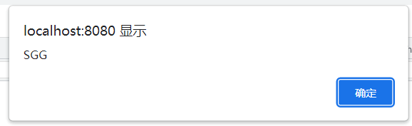

Student.vue

```html
<template>
  <div>
    <h2>姓名：{{name}}</h2>
    <h2>年龄：{{age}}</h2>
    <button @click="showName">showName</button>
  </div>
</template>

<script>
export default {
  name: 'Student',
  data() {
    return {
      name: 'ZS',
      age: 18
    }
  },
  methods: {
    showName() {
      alert(this.name)
    }
  }
}
</script>

<style>
</style>
```

> 

> 观察代码发现在School组件和Student组件的方法代码一致，即两个组件的methods配置项代码一致，可以把多个组件共用的配置提取成一个混入对象。

## 3. 将相同的配置项抽取

> 在src目录下建立一个mixin.js文件，用于编写不同组件相同的配置项。
> 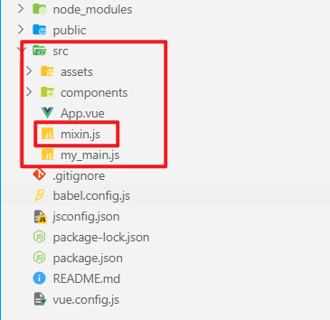

mixin.js

```js
export const mixin = {
  methods: {
    showName() {
      alert(this.name)
    }
  }
}
```

## 4. mixin 混入的使用

在组件中使用mixin混入，需要先将其进行导入，然后再组件的配置项mixins中使用。

School.vue

```html
<template>
  <div class="demo">
    <h2>学校：{{name}}</h2>
    <h2>地址：{{address}}</h2>
    <button @click="showName">showName</button>
  </div>
</template>

<script>
// 导入mixin
import {mixin} from '../mixin'

export default {
  name: 'School',
  data() {
    return {
      name: 'SGG',
      address: 'Beijing'
    }
  },
  mixins: [mixin]
}
</script>

<style>
</style>
```

> 

Student.vue

```html
<template>
  <div>
    <h2>姓名：{{name}}</h2>
    <h2>年龄：{{age}}</h2>
    <button @click="showName">showName</button>
  </div>
</template>

<script>
import {mixin} from '../mixin'

export default {
  name: 'Student',
  data() {
    return {
      name: 'ZS',
      age: 18
    }
  },
  mixins: [mixin]
}
</script>

<style>
</style>
```

> 

在mixin混入中也可以编写组件的其他配置项。

mixin.js

```js
export const mixin = {
  methods: {
    showName() {
      alert(this.name)
    }
  }
}

export const mixin2 = {
  data() {
    return {
      x: 100,
      y: 200
    }
  },
}
```

School.vue

```html
<template>
  <div class="demo">
    <h2>学校：{{name}}</h2>
    <h2>地址：{{address}}</h2>
    <button @click="showName">showName</button>
  </div>
</template>

<script>
// 导入mixin
import {mixin, mixin2} from '../mixin'

export default {
  name: 'School',
  data() {
    return {
      name: 'SGG',
      address: 'Beijing'
    }
  },
  mixins: [mixin, mixin2]
}
</script>

<style>
</style>
```

> 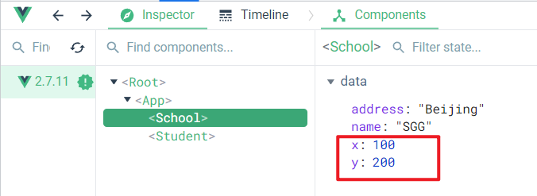

## 5.mixin全局混入

在main.js中通过 Vue.mixin(xxx) 进行混入

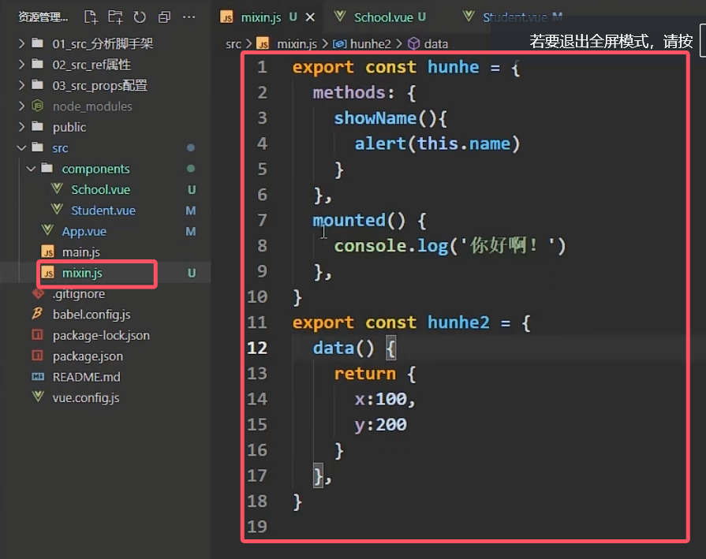

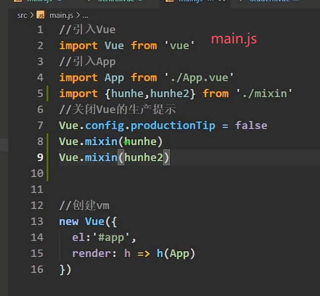

## 6. mixin中的配置项与组件的配置项冲突

### 6.1 普通配置项

当mixin中的普通配置项与组件的普通配置项发生冲突时，优先使用组件中自己的配置项。

School.vue

```html
<template>
  <div class="demo">
    <h2>学校：{{name}}</h2>
    <h2>地址：{{address}}</h2>
    <button @click="showName">showName</button>
  </div>
</template>

<script>
// 导入mixin
import {mixin, mixin2} from '../mixin'

export default {
  name: 'School',
  data() {
    return {
      name: 'SGG',
      address: 'Beijing',
      x: 666
    }
  },
  mixins: [mixin, mixin2]
}
</script>

<style>
</style>
```

> 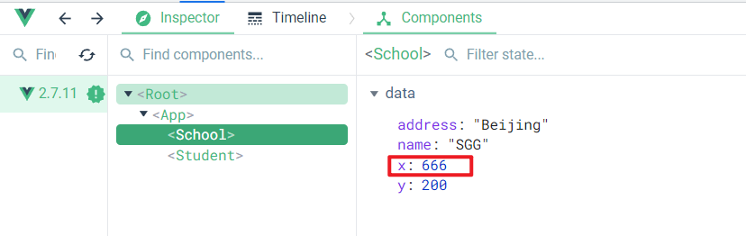

### 6.2 生命周期钩子

当mixin中的生命周期函数与组件中的周期函数发生冲突时，会先执行mixin中的生命周期函数，后执行组件自己的生命周期函数。

mixin.js

```js
export const mixin = {
  methods: {
    showName() {
      alert(this.name)
    }
  }
}

export const mixin2 = {
  data() {
    return {
      x: 100,
      y: 200
    }
  },
}

export const mixin3 = {
  mounted() {
    console.log('mixin3 mounted')
  }
}
```

School.vue

```html
<template>
  <div class="demo">
    <h2>学校：{{name}}</h2>
    <h2>地址：{{address}}</h2>
    <button @click="showName">showName</button>
  </div>
</template>

<script>
// 导入mixin
import {mixin, mixin2, mixin3} from '../mixin'

export default {
  name: 'School',
  data() {
    return {
      name: 'SGG',
      address: 'Beijing',
      x: 666
    }
  },
  mixins: [mixin, mixin2, mixin3],
  mounted() {
    console.log('School mounted')
  }
}
</script>

<style>
</style>
```

> 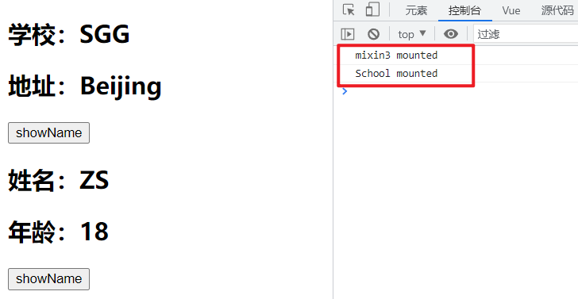

## 7. mixin 总结

1. 功能：可以把多个组件共用的配置提取成一个混入对象

2. 使用方式：

   - 第一步定义混合：

     ```properties
     {
         data(){....},
         methods:{....}
         ....
     }
     ```

   - 第二步使用混入：

     全局混入：`Vue.mixin(xxx)`
     ​ 局部混入：`mixins:['xxx']`

# 26.插件

------

## 1. 插件

Vue中自定义的插件，插件就是包含install方法的一个对象，install的第一个参数是Vue()，第二个以后的参数是插件使用者传递的数据，插件对象中的install方法会被vue自动调用。

使用插件能够增强vue的功能

## 2. 插件的定义

> 在src文件夹下创建plugins.js文件，用于自定义插件
> 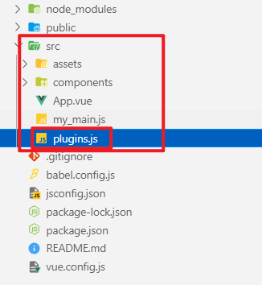

plugins.js

```js
export default {
	// 使用插件时，vue会自动将Vue()[vue实例对象的构造函数]传入
	// x,y,z 为其他自己传入的参数
	install(Vue,x,y,z){
		console.log(x,y,z)
		//全局过滤器
		Vue.filter('mySlice',function(value){
			return value.slice(0,4)
		})

		//定义全局指令
		Vue.directive('fbind',{
			//指令与元素成功绑定时（一上来）
			bind(element,binding){
				element.value = binding.value
			},
			//指令所在元素被插入页面时
			inserted(element,binding){
				element.focus()
			},
			//指令所在的模板被重新解析时
			update(element,binding){
				element.value = binding.value
			}
		})

		//定义混入
		Vue.mixin({
			data() {
				return {
					x:100,
					y:200
				}
			},
		})

		//给Vue原型上添加一个方法（vm和vc就都能用了）
		Vue.prototype.hello = ()=>{alert('你好啊')}
	}
}
```

## 3. 插件的使用

使用插件时，先导入对应的插件，使用`Vue.use()`方法使用对应的插件。

main.js

```js
//引入Vue
import Vue from 'vue'
//引入App组件，它是所有组件的父组件
import App from './App.vue'
// 导入插件
import plugins from './plugins.js'

//关闭vue的生产提示
Vue.config.productionTip = false

// 使用插件
Vue.use(plugins)

//创建Vue实例对象---vm
new Vue({
  // 将App组件放入容器中
  render: h => h(App),
// 指定vue控制的容器
}).$mount('#app')
```

App.vue

```html
<template>
  <div>
    <School></School>
    <Student></Student>
  </div>
</template>

<script>
// 导入子组件
import School from './components/School.vue'
import Student from './components/Student.vue'

export default {
  name: 'App',
  components: {
    School,
    Student
  }
}
</script>

<style>
</style>
```

School.vue

```html
<template>
	<div>
		<!-- 能够使用插件里的全局过滤器 -->
		<h2>学校名称：{{name | mySlice}}</h2>
		<h2>学校地址：{{address}}</h2>
		<button @click="test">点我测试一个hello方法</button>
	</div>
</template>

<script>
	export default {
		name:'School',
		data() {
			return {
				name:'SGG',
				address:'Beijing',
			}
		},
		methods: {
			test(){
				this.hello()
			}
		},
	}
</script>
```

Student.vue

```html
<template>
	<div>
		<h2>学生姓名：{{name}}</h2>
		<h2>学生性别：{{sex}}</h2>
        <!-- 能够使用插件里的全局自定义指令 -->
		<input type="text" v-fbind:value="name">
	</div>
</template>

<script>
	export default {
		name:'Student',
		data() {
			return {
				name:'张三',
				sex:'男'
			}
		},
	}
</script>
```

> 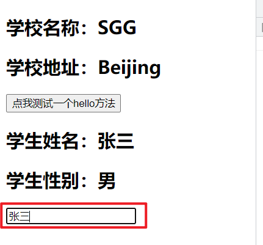
> 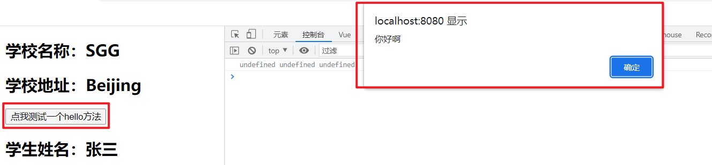

# 27.scoped 组件间的样式冲突

------

## 1. 组件之间的样式冲突问题

默认情况下，写在 .vue 组件中的样式会全局生效，因此很容易造成多个组件之间的样式冲突问题。

导致组件之间样式冲突的根本原因是：

> ① 单页面应用程序中，所有组件的 DOM 结构，都是基于唯一的 index.html 页面进行呈现的
> ② 每个组件中的样式，都会影响整个 index.html 页面中的 DOM 元素

### 1.1 如何解决组件样式冲突的问题

为每个组件分配唯一的自定义属性，在编写组件样式时，通过属性选择器来控制样式的作用域，示例代码如下：


### 1.2 style 节点的 scoped 属性

为了提高开发效率和开发体验，vue 为 style 节点提供了 scoped 属性，从而防止组件之间的样式冲突问题：

```html
<template>
  <div>
    <h3 class="title">这是 List.vue 组件</h3>

    <p>这是 List.vue 中的 p 标签</p>
    <p>这是 List.vue 中的 p 标签</p>
  </div>
</template>

<script>
export default {
  name: 'MyList',
}
</script>

<style lang="less" scoped>
</style>
<template>
  <div>
    <h1>这是 App.vue 组件</h1>

    <p>App 中的 p 标签</p>
    <p>App 中的 p 标签</p>

    <hr />

    <my-list></my-list>
  </div>
</template>

<script>
import MyList from './List.vue'

export default {
  name: 'MyApp',
  components: {
    MyList,
  },
}
</script>

<style lang="less" scoped>
p {
  color: red;
}
</style>
```

## 2. /deep/ 样式穿透

如果给当前组件的 style 节点添加了 scoped 属性，则当前组件的样式对其子组件是不生效的。

如果想让某些样式对子组件生效，可以使用 /deep/ 深度选择器。

**注意：**
/deep/ 是 vue2.x 中实现样式穿透的方案。在 vue3.x 中推荐使用 :deep() 替代 /deep/。

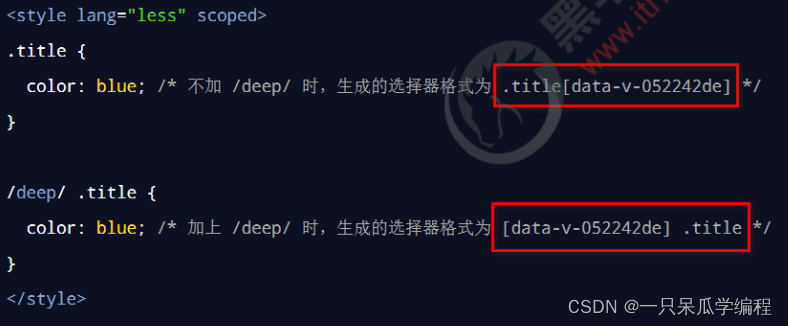

```html
<template>
  <div>
    <h3 class="title">这是 List.vue 组件</h3>
    <p>这是 List.vue 中的 p 标签</p>
    <p>这是 List.vue 中的 p 标签</p>
  </div>
</template>

<script>
export default {
  name: 'MyList',
}
</script>

<style lang="less" scoped>
</style>
<template>
  <div>
    <h1>这是 App.vue 组件</h1>

    <p>App 中的 p 标签</p>
    <p>App 中的 p 标签</p>

    <hr />

    <my-list></my-list>
  </div>
</template>

<script>
import MyList from './List.vue'

export default {
  name: 'MyApp',
  components: {
    MyList,
  },
}
</script>

<style lang="less" scoped>
p {
  color: red;
}

// /deep/ .title {
//   color: blue;
// }

:deep(.title) {
  color: blue;
}
</style>
```

## 3. 让 style 中支持 less 语法

如果希望使用 less 语法编写组件的 style 样式，可以按照如下两个步骤进行配置：

> ① 运行 `npm install less -D` 命令安装依赖包，从而提供 less 语法的编译支持
>
> ② 在 `<style>`标签上添加 lang=“less” 属性，即可使用 less 语法编写组件的样式

```html
<style lang="less" scoped>
  h1 {
    color: aquamarine;
    span {
      color: aqua;
    }
  }
</style>
```

# 28.TodoList 案例

------

## 1. 组件化编码流程（通用）

1. 实现静态组件：抽取组件，使用组件实现静态页面效果
2. 展示动态数据：
   - 数据的类型、名称是什么？
   - 数据保存在哪个组件？
3. 交互——从绑定事件监听开始

## 2. 页面组件的划分

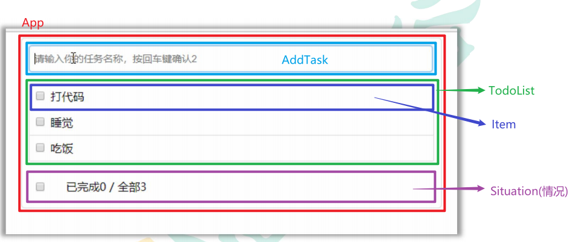
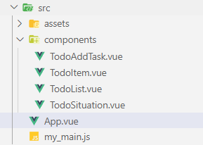

## 3. 静态页面代码

```vue
<!doctype html>
<html lang="en">
<head>
  <meta charset="utf-8">
  <title>React App</title>

  <link rel="stylesheet" href="index.css">
</head>
<body>
<div id="root">
  <div class="todo-container">
    <div class="todo-wrap">
      <div class="todo-header">
        <input type="text" placeholder="请输入你的任务名称，按回车键确认"/>
      </div>
      <ul class="todo-main">
        <li>
          <label>
            <input type="checkbox"/>
            <span>xxxxx</span>
          </label>
          <button class="btn btn-danger" style="display:none">删除</button>
        </li>
        <li>
          <label>
            <input type="checkbox"/>
            <span>yyyy</span>
          </label>
          <button class="btn btn-danger" style="display:none">删除</button>
        </li>
      </ul>
      <div class="todo-footer">
        <label>
          <input type="checkbox"/>
        </label>
        <span>
          <span>已完成0</span> / 全部2
        </span>
        <button class="btn btn-danger">清除已完成任务</button>
      </div>
    </div>
  </div>
</div>

</body>
</html>
/*base*/
body {
  background: #fff;
}

.btn {
  display: inline-block;
  padding: 4px 12px;
  margin-bottom: 0;
  font-size: 14px;
  line-height: 20px;
  text-align: center;
  vertical-align: middle;
  cursor: pointer;
  box-shadow: inset 0 1px 0 rgba(255, 255, 255, 0.2), 0 1px 2px rgba(0, 0, 0, 0.05);
  border-radius: 4px;
}

.btn-danger {
  color: #fff;
  background-color: #da4f49;
  border: 1px solid #bd362f;
}

.btn-danger:hover {
  color: #fff;
  background-color: #bd362f;
}

.btn:focus {
  outline: none;
}

.todo-container {
  width: 600px;
  margin: 0 auto;
}
.todo-container .todo-wrap {
  padding: 10px;
  border: 1px solid #ddd;
  border-radius: 5px;
}

/*header*/
.todo-header input {
  width: 560px;
  height: 28px;
  font-size: 14px;
  border: 1px solid #ccc;
  border-radius: 4px;
  padding: 4px 7px;
}

.todo-header input:focus {
  outline: none;
  border-color: rgba(82, 168, 236, 0.8);
  box-shadow: inset 0 1px 1px rgba(0, 0, 0, 0.075), 0 0 8px rgba(82, 168, 236, 0.6);
}

/*main*/
.todo-main {
  margin-left: 0px;
  border: 1px solid #ddd;
  border-radius: 2px;
  padding: 0px;
}

.todo-empty {
  height: 40px;
  line-height: 40px;
  border: 1px solid #ddd;
  border-radius: 2px;
  padding-left: 5px;
  margin-top: 10px;
}
/*item*/
li {
  list-style: none;
  height: 36px;
  line-height: 36px;
  padding: 0 5px;
  border-bottom: 1px solid #ddd;
}

li label {
  float: left;
  cursor: pointer;
}

li label li input {
  vertical-align: middle;
  margin-right: 6px;
  position: relative;
  top: -1px;
}

li button {
  float: right;
  display: none;
  margin-top: 3px;
}

li:before {
  content: initial;
}

li:last-child {
  border-bottom: none;
}

/*footer*/
.todo-footer {
  height: 40px;
  line-height: 40px;
  padding-left: 6px;
  margin-top: 5px;
}

.todo-footer label {
  display: inline-block;
  margin-right: 20px;
  cursor: pointer;
}

.todo-footer label input {
  position: relative;
  top: -1px;
  vertical-align: middle;
  margin-right: 5px;
}

.todo-footer button {
  float: right;
  margin-top: 5px;
}
```

## 4. 静态页面组件化拆分

App.vue

```html
<template>
  <div class="todo-container">
    <div class="todo-wrap">
      <TodoAddTask></TodoAddTask>
      <TodoList></TodoList>
      <TodoSituation></TodoSituation>
    </div>
  </div>
</template>

<script>
// 导入子组件
import TodoAddTask from './components/TodoAddTask.vue'
import TodoList from './components/TodoList.vue'
import TodoSituation from './components/TodoSituation.vue'

export default {
  name: 'App',
  components: { TodoAddTask, TodoList, TodoSituation }
}
</script>

<style>
/*base*/
body {
  background: #fff;
}

.btn {
  display: inline-block;
  padding: 4px 12px;
  margin-bottom: 0;
  font-size: 14px;
  line-height: 20px;
  text-align: center;
  vertical-align: middle;
  cursor: pointer;
  box-shadow: inset 0 1px 0 rgba(255, 255, 255, 0.2), 0 1px 2px rgba(0, 0, 0, 0.05);
  border-radius: 4px;
}

.btn-danger {
  color: #fff;
  background-color: #da4f49;
  border: 1px solid #bd362f;
}

.btn-danger:hover {
  color: #fff;
  background-color: #bd362f;
}

.btn:focus {
  outline: none;
}

.todo-container {
  width: 600px;
  margin: 0 auto;
}
.todo-container .todo-wrap {
  padding: 10px;
  border: 1px solid #ddd;
  border-radius: 5px;
}
</style>
```

TodoAddTask.vue

```html
<template>
  <div class="todo-header">
    <input type="text" placeholder="请输入你的任务名称，按回车键确认" />
  </div>
</template>

<script>
export default {
  name: 'TodoAddTask'
}
</script>

<style scoped>
/*header*/
.todo-header input {
  width: 560px;
  height: 28px;
  font-size: 14px;
  border: 1px solid #ccc;
  border-radius: 4px;
  padding: 4px 7px;
}

.todo-header input:focus {
  outline: none;
  border-color: rgba(82, 168, 236, 0.8);
  box-shadow: inset 0 1px 1px rgba(0, 0, 0, 0.075), 0 0 8px rgba(82, 168, 236, 0.6);
}
</style>
```

TodoList.vue

```html
<template>
  <ul class="todo-main">
    <TodoItem></TodoItem>    
    <TodoItem></TodoItem>    
    <TodoItem></TodoItem>    
  </ul>
</template>

<script>
// 导入子组件
import TodoItem from './TodoItem.vue'

export default {
  name: 'TodoList',
  components: {TodoItem}
}
</script>

<style scoped>
/*main*/
.todo-main {
  margin-left: 0px;
  border: 1px solid #ddd;
  border-radius: 2px;
  padding: 0px;
}

.todo-empty {
  height: 40px;
  line-height: 40px;
  border: 1px solid #ddd;
  border-radius: 2px;
  padding-left: 5px;
  margin-top: 10px;
}
</style>
```

TodoItem.vue

```html
<template>
  <li>
    <label>
      <input type="checkbox" />
      <span>xxxxx</span>
    </label>
    <button class="btn btn-danger" style="display:none">删除</button>
  </li>
</template>

<script>
export default {
  name: 'TodoItem'
}
</script>

<style scoped>
/*item*/
li {
  list-style: none;
  height: 36px;
  line-height: 36px;
  padding: 0 5px;
  border-bottom: 1px solid #ddd;
}

li label {
  float: left;
  cursor: pointer;
}

li label li input {
  vertical-align: middle;
  margin-right: 6px;
  position: relative;
  top: -1px;
}

li button {
  float: right;
  display: none;
  margin-top: 3px;
}

li:before {
  content: initial;
}

li:last-child {
  border-bottom: none;
}
</style>
```

TodoSituation.vue

```html
<template>
  <div class="todo-footer">
    <label>
      <input type="checkbox" />
    </label>
    <span>
      <span>已完成0</span> / 全部2
    </span>
    <button class="btn btn-danger">清除已完成任务</button>
  </div>
</template>

<script>
export default {
  name: 'TodoSituation'
}
</script>

<style scoped>
/*footer*/
.todo-footer {
  height: 40px;
  line-height: 40px;
  padding-left: 6px;
  margin-top: 5px;
}

.todo-footer label {
  display: inline-block;
  margin-right: 20px;
  cursor: pointer;
}

.todo-footer label input {
  position: relative;
  top: -1px;
  vertical-align: middle;
  margin-right: 5px;
}

.todo-footer button {
  float: right;
  margin-top: 5px;
}
</style>
```

> 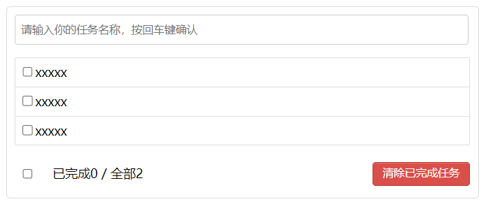

## 5. 初始化数据列表

TodoList.vue

```html
<template>
  <ul class="todo-main">
    <TodoItem 
      v-for="todo in todos" 
      :key="todo.id" 
      :todoObj="todo"
    ></TodoItem>    
  </ul>
</template>

<script>
// 导入子组件
import TodoItem from './TodoItem.vue'

export default {
  name: 'TodoList',
  components: {TodoItem},
  data() {
    return {
      todos: [
        {id: '001', todo: '吃饭', done: true},
        {id: '002', todo: '睡觉', done: false},
        {id: '003', todo: '打豆豆', done: true}
      ]
    }
  },
}
</script>

<style scoped>
/*main*/
.todo-main {
  margin-left: 0px;
  border: 1px solid #ddd;
  border-radius: 2px;
  padding: 0px;
}

.todo-empty {
  height: 40px;
  line-height: 40px;
  border: 1px solid #ddd;
  border-radius: 2px;
  padding-left: 5px;
  margin-top: 10px;
}
</style>
```

TodoItem.vue

```html
<template>
  <li>
    <label>
      <!-- 使用v-bind绑定checked属性，true则有这个属性，false无这个属性 -->
      <input type="checkbox" :checked="todoObj.done"/>
      <span>{{todoObj.todo}}</span>
    </label>
    <button class="btn btn-danger" style="display:none">删除</button>
  </li>
</template>

<script>
export default {
  name: 'TodoItem',
  props: ['todoObj']
}
</script>

<style scoped>
/*item*/
li {
  list-style: none;
  height: 36px;
  line-height: 36px;
  padding: 0 5px;
  border-bottom: 1px solid #ddd;
}

li label {
  float: left;
  cursor: pointer;
}

li label li input {
  vertical-align: middle;
  margin-right: 6px;
  position: relative;
  top: -1px;
}

li button {
  float: right;
  display: none;
  margin-top: 3px;
}

li:before {
  content: initial;
}

li:last-child {
  border-bottom: none;
}
</style>
```

> 

## 6. 添加列表数据

> 随机生成id，使用`nanoid`，安装`nanoid`，`npm i nanoid`
> 导入`nanoid`，`import {nanoid} from nanoid`
> 使用`nanoid`，`nanoid()`会返回一个唯一的字符串

> 修改列表数据的存放位置为App.vue，便于数据的添加。

> 当前数据的传递方式
> 添加数据：
> App组件将添加待做事项的方法传递给TodoAddTask组件，TodoAddTask组件调用父组件传递过来的方法添加待做事项，由于方法真正存在的位置为App组件，相当于TodoAddTask组件只是拥有方法的使用权。
> 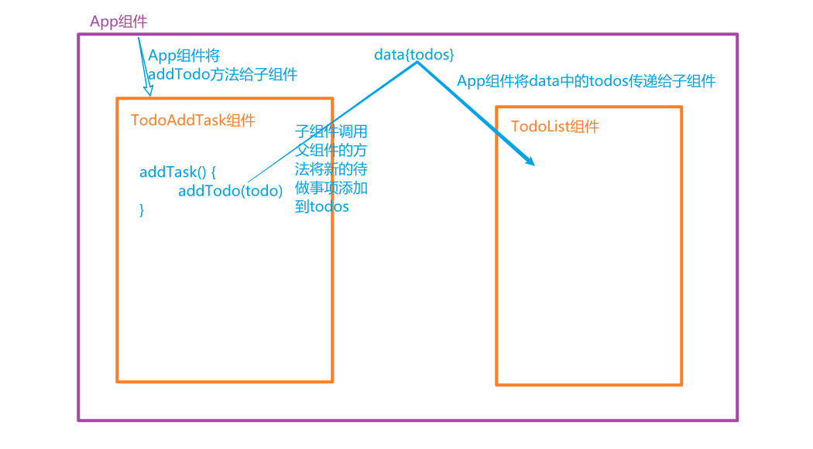

App.vue

```html
<template>
  <div class="todo-container">
    <div class="todo-wrap">
      <!-- 将添加待做事项的方法传入子组件中 -->
      <TodoAddTask :addTodo="addTodo"></TodoAddTask>
      <TodoList :todos="todos"></TodoList>
      <TodoSituation></TodoSituation>
    </div>
  </div>
</template>

<script>
// 导入子组件
import TodoAddTask from './components/TodoAddTask.vue'
import TodoList from './components/TodoList.vue'
import TodoSituation from './components/TodoSituation.vue'

export default {
  name: 'App',
  components: { TodoAddTask, TodoList, TodoSituation },
  data() {
    return {
      todos: [
        {id: '001', todo: '吃饭', done: true},
        {id: '002', todo: '睡觉', done: false},
        {id: '003', todo: '打豆豆', done: true}
      ]
    }
  },
  methods: {
    // 将新的待做事项添加到列表中
    addTodo(todo) {
      this.todos.unshift(todo)
    }
  },
}
</script>
```

TodoList.vue

```html
<template>
  <ul class="todo-main">
    <!-- 将每个待做事项传入TodoItem -->
    <TodoItem 
      v-for="todo in todos" 
      :key="todo.id" 
      :todoObj="todo"
    ></TodoItem>    
  </ul>
</template>

<script>
// 导入子组件
import TodoItem from './TodoItem.vue'

export default {
  name: 'TodoList',
  components: {TodoItem},
  props: ['todos']
}
</script>
```

TodoAddTask.vue

```html
<template>
  <div class="todo-header">
    <input 
      type="text" 
      placeholder="请输入你的任务名称，按回车键确认"
      v-model="task"
      @keydown.enter="addTask"
    />
  </div>
</template>

<script>
// 导入nanoid 
import {nanoid} from 'nanoid'

export default {
  name: 'TodoAddTask',
  props: ['addTodo'],
  data() {
    return {
      task: ''
    }
  },
  methods: {
    addTask() {
      // 没有输入不进行添加
      if (!this.task) return
      // console.log(this.task)
      // 新的待做事项
      const todo = {
        id: nanoid(),
        todo: this.task,
        done: false
      }
      // 添加待做事项
      this.addTodo(todo)
      // 输入框清空
      this.task = ''
    }
  }
}
</script>
```

> 

## 7. 勾选

> 由于数据在App组件中，所以修改数据中完成状态的方法也写在App组件中，然后将方法传递给子组件调用，子组件调用方法修改勾选状态。

App.vue

```html
<template>
  <div class="todo-container">
    <div class="todo-wrap">
      <!-- 将添加待做事项的方法传入子组件中 -->
      <TodoAddTask :addTodo="addTodo"></TodoAddTask>
      <!-- 将数据和方法传入子组件 -->
      <TodoList 
        :todos="todos"
        :changeDone="changeDone"
      ></TodoList>
      <TodoSituation></TodoSituation>
    </div>
  </div>
</template>

<script>
// 导入子组件
import TodoAddTask from './components/TodoAddTask.vue'
import TodoList from './components/TodoList.vue'
import TodoSituation from './components/TodoSituation.vue'

export default {
  name: 'App',
  components: { TodoAddTask, TodoList, TodoSituation },
  data() {
    return {
      todos: [
        {id: '001', todo: '吃饭', done: true},
        {id: '002', todo: '睡觉', done: false},
        {id: '003', todo: '打豆豆', done: true}
      ]
    }
  },
  methods: {
    // 将新的待做事项添加到列表中
    addTodo(todo) {
      this.todos.unshift(todo)
    },
    // 修改待做事项的勾选状态
    changeDone(id) {
      this.todos.forEach((todo)=>{
        if (todo.id === id) todo.done = !todo.done
      })
    }
  },
}
</script>
```

TodoList.vue

```html
<template>
  <ul class="todo-main">
    <!-- 将每个待做事项传入TodoItem -->
    <!-- 将方法传递给子组件 -->
    <TodoItem 
      v-for="todo in todos" 
      :key="todo.id" 
      :todoObj="todo"
      :changeDone="changeDone"
    ></TodoItem>    
  </ul>
</template>

<script>
// 导入子组件
import TodoItem from './TodoItem.vue'

export default {
  name: 'TodoList',
  components: {TodoItem},
  props: ['todos', 'changeDone']
}
</script>
```

TodoItem.vue

```html
<template>
  <li>
    <label>
      <!-- 使用v-bind绑定checked属性，true则有这个属性，false无这个属性 -->
      <input type="checkbox" :checked="todoObj.done" @click="changeChecked"/>
      <span>{{todoObj.todo}}</span>
    </label>
    <button class="btn btn-danger" style="display:none">删除</button>
  </li>
</template>

<script>
export default {
  name: 'TodoItem',
  props: ['todoObj', 'changeDone'],
  methods: {
    // 修改勾选状态
    changeChecked() {
      this.changeDone(this.todoObj.id)
    }
  },
}
</script>

<style scoped>
/*item*/
li {
  list-style: none;
  height: 36px;
  line-height: 36px;
  padding: 0 5px;
  border-bottom: 1px solid #ddd;
}

li label {
  float: left;
  cursor: pointer;
}

li label li input {
  vertical-align: middle;
  margin-right: 6px;
  position: relative;
  top: -1px;
}

li button {
  float: right;
  display: none;
  margin-top: 3px;
}

li:before {
  content: initial;
}

li:last-child {
  border-bottom: none;
}
</style>
```

> 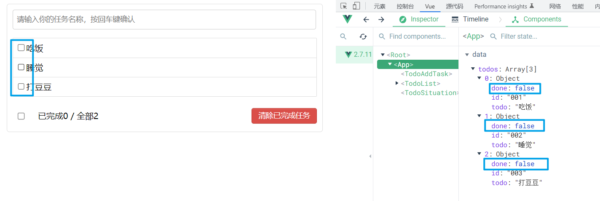

## 8. 删除

鼠标悬浮，对应的item项背景颜色改变，删除按钮显示。

TodoItem.vue

```css
li:hover {
  background-color: #ddd;
}

li:hover button {
  display: inline-block;
}
    <button class="btn btn-danger" @click="handlerDelete">删除</button>
```

App.vue

```html
<template>
  <div class="todo-container">
    <div class="todo-wrap">
      <!-- 将添加待做事项的方法传入子组件中 -->
      <TodoAddTask :addTodo="addTodo"></TodoAddTask>
      <!-- 将数据和方法传入子组件 -->
      <TodoList 
        :todos="todos"
        :changeDone="changeDone"
        :deleteTodo="deleteTodo"
      ></TodoList>
      <TodoSituation></TodoSituation>
    </div>
  </div>
</template>

<script>
// 导入子组件
import TodoAddTask from './components/TodoAddTask.vue'
import TodoList from './components/TodoList.vue'
import TodoSituation from './components/TodoSituation.vue'

export default {
  name: 'App',
  components: { TodoAddTask, TodoList, TodoSituation },
  data() {
    return {
      todos: [
        {id: '001', todo: '吃饭', done: true},
        {id: '002', todo: '睡觉', done: false},
        {id: '003', todo: '打豆豆', done: true}
      ]
    }
  },
  methods: {
    // 将新的待做事项添加到列表中
    addTodo(todo) {
      this.todos.unshift(todo)
    },
    // 修改待做事项的勾选状态
    changeDone(id) {
      this.todos.forEach((todo)=>{
        if (todo.id === id) todo.done = !todo.done
      })
    },
    // 删除todo
    deleteTodo(id) {
      this.todos = this.todos.filter((todo)=>{
        return todo.id !== id
      })
    }
  },
}
</script>
```

TodoList.vue

```html
<template>
  <ul class="todo-main">
    <!-- 将每个待做事项传入TodoItem -->
    <!-- 将方法传递给子组件 -->
    <TodoItem 
      v-for="todo in todos" 
      :key="todo.id" 
      :todoObj="todo"
      :changeDone="changeDone"
      :deleteTodo="deleteTodo"
    ></TodoItem>    
  </ul>
</template>

<script>
// 导入子组件
import TodoItem from './TodoItem.vue'

export default {
  name: 'TodoList',
  components: {TodoItem},
  props: ['todos', 'changeDone', 'deleteTodo']
}
</script>
```

TodoItem.vue

```html
<template>
  <li>
    <label>
      <!-- 使用v-bind绑定checked属性，true则有这个属性，false无这个属性 -->
      <input type="checkbox" :checked="todoObj.done" @click="changeChecked"/>
      <span>{{todoObj.todo}}</span>
    </label>
    <button class="btn btn-danger" @click="handlerDelete">删除</button>
  </li>
</template>

<script>
export default {
  name: 'TodoItem',
  props: ['todoObj', 'changeDone', 'deleteTodo'],
  methods: {
    // 修改勾选状态
    changeChecked() {
      this.changeDone(this.todoObj.id)
    },
    // 删除
    handlerDelete() {
      // 弹出框点击确定执行if中的代码
      // 点击取消不执行
      if (confirm('确定删除吗？')) {
        this.deleteTodo(this.todoObj.id)
      }
    }
  },
}
</script>
```

> 
> 

## 9. 底部待做事项状态统计

App.vue

```html
<template>
  <div class="todo-container">
    <div class="todo-wrap">
      <!-- 将添加待做事项的方法传入子组件中 -->
      <TodoAddTask :addTodo="addTodo"></TodoAddTask>
      <!-- 将数据和方法传入子组件 -->
      <TodoList 
        :todos="todos"
        :changeDone="changeDone"
        :deleteTodo="deleteTodo"
      ></TodoList>
      <TodoSituation :todos="todos"></TodoSituation>
    </div>
  </div>
</template>
```

TodoSituation.vue

```html
<template>
  <div class="todo-footer">
    <label>
      <input type="checkbox" />
    </label>
    <span>
      <span>已完成{{doneTotal}}</span> / 全部{{todos.length}}
    </span>
    <button class="btn btn-danger">清除已完成任务</button>
  </div>
</template>

<script>
export default {
  name: 'TodoSituation',
  props: ['todos'],
  computed: {
    doneTotal() {
      // 对todos进行遍历统计
      // pre为上一次的返回值
      // todo为当前的遍历项
      return this.todos.reduce((pre, todo) => {
        return pre + (todo.done ? 1 : 0)
      }, 0)
    }
  }
}
</script>
```

> 

## 10. 全选 & 清除已完成

App.vue

```html
<template>
  <div class="todo-container">
    <div class="todo-wrap">
      <!-- 将添加待做事项的方法传入子组件中 -->
      <TodoAddTask :addTodo="addTodo"></TodoAddTask>
      <!-- 将数据和方法传入子组件 -->
      <TodoList 
        :todos="todos"
        :changeDone="changeDone"
        :deleteTodo="deleteTodo"
      ></TodoList>
      <TodoSituation 
        :todos="todos"
        :checkAll="checkAll"
        :deleteDone="deleteDone"
      ></TodoSituation>
    </div>
  </div>
</template>

<script>
// 导入子组件
import TodoAddTask from './components/TodoAddTask.vue'
import TodoList from './components/TodoList.vue'
import TodoSituation from './components/TodoSituation.vue'

export default {
  name: 'App',
  components: { TodoAddTask, TodoList, TodoSituation },
  data() {
    return {
      todos: [
        {id: '001', todo: '吃饭', done: true},
        {id: '002', todo: '睡觉', done: false},
        {id: '003', todo: '打豆豆', done: true}
      ]
    }
  },
  methods: {
    // 将新的待做事项添加到列表中
    addTodo(todo) {
      this.todos.unshift(todo)
    },
    // 修改待做事项的勾选状态
    changeDone(id) {
      this.todos.forEach((todo)=>{
        if (todo.id === id) todo.done = !todo.done
      })
    },
    // 删除todo
    deleteTodo(id) {
      this.todos = this.todos.filter((todo)=>{
        return todo.id !== id
      })
    },
    // 全选 全不选
    checkAll(done) {
      this.todos.forEach((todo)=>{
        todo.done = done
      })
    },
    // 清除已完成
    deleteDone() {
      this.todos = this.todos.filter(todo => !todo.done)
    }
  },
}
</script>
```

TodoSituation.vue

```html
<template>
  <div class="todo-footer" v-show="total">
    <label>
      <input type="checkbox" v-model="isAll"/>
    </label>
    <span>
      <span>已完成{{doneTotal}}</span> / 全部{{total}}
    </span>
    <button class="btn btn-danger" @click="clearDone">清除已完成任务</button>
  </div>
</template>

<script>
export default {
  name: 'TodoSituation',
  props: ['todos', 'checkAll', 'deleteDone'],
  computed: {
    // 计算总的待做事项数
    total() {
      return this.todos.length
    },
    // 计算打钩的待做事项数
    doneTotal() {
      return this.todos.reduce((pre, todo) => {
        return pre + (todo.done ? 1 : 0)
      }, 0)
    },
    // 是否全部勾选
    isAll: {
      get() {
        return this.total === this.doneTotal && this.total >0
      },
      set(value) {
        this.checkAll(value)
      }
    }
  },
  methods: {
    // 清除已完成
    clearDone() {
      this.deleteDone()
    }
  },
}
</script>
```

> 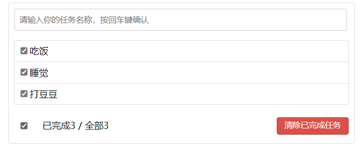
> 
> 

## 11. 总结

1. 组件化编码流程：
   - (1).拆分静态组件：组件要按照功能点拆分，命名不要与html元素冲突。
   - (2).实现动态组件：考虑好数据的存放位置，数据是一个组件在用，还是一些组件在用：
     - 1).一个组件在用：放在组件自身即可。
     - 2). 一些组件在用：放在他们共同的父组件上（`状态提升`）。
   - (3).实现交互：从绑定事件开始。
2. props适用于：
   - (1).父组件 ==> 子组件 通信
   - (2).子组件 ==> 父组件 通信（要求父先给子一个函数）
3. 使用v-model时要切记：v-model绑定的值不能是props传过来的值，因为props是不可以修改的！
4. props传过来的若是对象类型的值，修改对象中的属性时Vue不会报错，但不推荐这样做。

## 12.浏览器本地存储

localStorage.html

```html
<!DOCTYPE html>
<html>
	<head>
		<meta charset="UTF-8" />
		<title>localStorage</title>
	</head>
	<body>
		<h2>localStorage</h2>
		<button onclick="saveData()">点我保存一个数据</button>
		<button onclick="readData()">点我读取一个数据</button>
		<button onclick="deleteData()">点我删除一个数据</button>
		<button onclick="deleteAllData()">点我清空一个数据</button>

		<script type="text/javascript" >
			let p = {name:'张三',age:18}

			function saveData(){
				localStorage.setItem('msg','hello!!!')
				localStorage.setItem('msg2',666)
				localStorage.setItem('person',JSON.stringify(p))
			}
			function readData(){
				console.log(localStorage.getItem('msg'))
				console.log(localStorage.getItem('msg2'))

				const result = localStorage.getItem('person')
				console.log(JSON.parse(result))

				// console.log(localStorage.getItem('msg3'))
			}
			function deleteData(){
				localStorage.removeItem('msg2')
			}
			function deleteAllData(){
				localStorage.clear()
			}
		</script>
	</body>
</html>
```

sessionStorage.html

```html
<!DOCTYPE html>
<html>
	<head>
		<meta charset="UTF-8" />
		<title>sessionStorage</title>
	</head>
	<body>
		<h2>sessionStorage</h2>
		<button onclick="saveData()">点我保存一个数据</button>
		<button onclick="readData()">点我读取一个数据</button>
		<button onclick="deleteData()">点我删除一个数据</button>
		<button onclick="deleteAllData()">点我清空一个数据</button>

		<script type="text/javascript" >
			let p = {name:'张三',age:18}

			function saveData(){
				sessionStorage.setItem('msg','hello!!!')
				sessionStorage.setItem('msg2',666)
				sessionStorage.setItem('person',JSON.stringify(p))
			}
			function readData(){
				console.log(sessionStorage.getItem('msg'))
				console.log(sessionStorage.getItem('msg2'))

				const result = sessionStorage.getItem('person')
				console.log(JSON.parse(result))

				// console.log(sessionStorage.getItem('msg3'))
			}
			function deleteData(){
				sessionStorage.removeItem('msg2')
			}
			function deleteAllData(){
				sessionStorage.clear()
			}
		</script>
	</body>
</html>
```

## 13. 实现本地存储

App.vue

```html
<template>
  <div class="todo-container">
    <div class="todo-wrap">
      <!-- 将添加待做事项的方法传入子组件中 -->
      <TodoAddTask :addTodo="addTodo"></TodoAddTask>
      <!-- 将数据和方法传入子组件 -->
      <TodoList :todos="todos" :changeDone="changeDone" :deleteTodo="deleteTodo"></TodoList>
      <TodoSituation :todos="todos" :checkAll="checkAll" :deleteDone="deleteDone"></TodoSituation>
    </div>
  </div>
</template>

<script>
// 导入子组件
import TodoAddTask from './components/TodoAddTask.vue'
import TodoList from './components/TodoList.vue'
import TodoSituation from './components/TodoSituation.vue'

export default {
  name: 'App',
  components: { TodoAddTask, TodoList, TodoSituation },
  data() {
    return {
      // todos的值从本地存储中进行获取
      // 如果本地存储不存在todos会返回null，此时todos的值为空数组
      // 当读取本地存储返回null，null为假，会返回 []
      // 由于存储的为json字符串，需要进行类型转换
      todos: JSON.parse(localStorage.getItem('todos')) || []
    }
  },
  methods: {
    // 将新的待做事项添加到列表中
    addTodo(todo) {
      this.todos.unshift(todo)
    },
    // 修改待做事项的勾选状态
    changeDone(id) {
      this.todos.forEach(todo => {
        if (todo.id === id) todo.done = !todo.done
      })
    },
    // 删除todo
    deleteTodo(id) {
      this.todos = this.todos.filter(todo => {
        return todo.id !== id
      })
    },
    // 全选 全不选
    checkAll(done) {
      this.todos.forEach(todo => {
        todo.done = done
      })
    },
    // 清除已完成
    deleteDone() {
      this.todos = this.todos.filter(todo => !todo.done)
    }
  },
  watch: {
    // 使用监视属性监视todos的改变
    // 只要todos发生了改变，就将新的todos进行本地存储
    todos: {
      // 由于默认只会监视一层，监视数组内对象中是否完成的变化需要进行深度监视
      deep: true,
      handler(newVal) {
        // 由于todos是数组对象类型数据，进行本地存储需要转换为json
        localStorage.setItem('todos', JSON.stringify(newVal))
      }
    }
  }
}
</script>
```

> 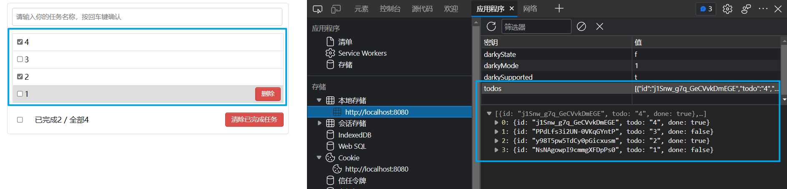

## 14. 自定义事件实现子组件向父组件传递数据

App.vue

```html
<template>
  <div class="todo-container">
    <div class="todo-wrap">
      <!-- 为子组件TodoAddTask绑定自定义事件addTodo，事件的回调函数为addTodo() -->
      <TodoAddTask @addTodo="addTodo"></TodoAddTask>
      <!-- 将数据和方法传入子组件 -->
      <TodoList :todos="todos" :changeDone="changeDone" :deleteTodo="deleteTodo"></TodoList>
      <!-- 为子组件 TodoSituation 绑定自定义事件checkAll deleteDone -->
      <TodoSituation :todos="todos" @checkAll="checkAll" @deleteDone="deleteDone"></TodoSituation>
    </div>
  </div>
</template>

<script>
// 导入子组件
import TodoAddTask from './components/TodoAddTask.vue'
import TodoList from './components/TodoList.vue'
import TodoSituation from './components/TodoSituation.vue'

export default {
  name: 'App',
  components: { TodoAddTask, TodoList, TodoSituation },
  data() {
    return {
      // todos的值从本地存储中进行获取
      // 如果本地存储不存在todos会返回null，此时todos的值为空数组
      // 当读取本地存储返回null，null为假，会返回 []
      // 由于存储的为json字符串，需要进行类型转换
      todos: JSON.parse(localStorage.getItem('todos')) || []
    }
  },
  methods: {
    // 将新的待做事项添加到列表中
    addTodo(todo) {
      this.todos.unshift(todo)
    },
    // 修改待做事项的勾选状态
    changeDone(id) {
      this.todos.forEach(todo => {
        if (todo.id === id) todo.done = !todo.done
      })
    },
    // 删除todo
    deleteTodo(id) {
      this.todos = this.todos.filter(todo => {
        return todo.id !== id
      })
    },
    // 全选 全不选
    checkAll(done) {
      this.todos.forEach(todo => {
        todo.done = done
      })
    },
    // 清除已完成
    deleteDone() {
      this.todos = this.todos.filter(todo => !todo.done)
    }
  },
  watch: {
    // 使用监视属性监视todos的改变
    // 只要todos发生了改变，就将新的todos进行本地存储
    todos: {
      // 由于默认只会监视一层，监视数组内对象中是否完成的变化需要进行深度监视
      deep: true,
      handler(newVal) {
        // 由于todos是数组对象类型数据，进行本地存储需要转换为json
        localStorage.setItem('todos', JSON.stringify(newVal))
      }
    }
  }
}
</script>
```

TodoAddTask.vue

```html
<template>
  <div class="todo-header">
    <input 
      type="text" 
      placeholder="请输入你的任务名称，按回车键确认"
      v-model="task"
      @keydown.enter="addTask"
    />
  </div>
</template>

<script>
// 导入nanoid 
import {nanoid} from 'nanoid'

export default {
  name: 'TodoAddTask',
  // 使用自定义事件，不用再接收父组件传递的函数
  // props: ['addTodo'],
  data() {
    return {
      task: ''
    }
  },
  methods: {
    addTask() {
      // 没有输入不进行添加
      if (!this.task) return
      // 新的待做事项
      const todo = {
        id: nanoid(),
        todo: this.task,
        done: false
      }
      // 触发自定义事件 添加待做事项
      // this.addTodo(todo)
      this.$emit('addTodo', todo)
      // 输入框清空
      this.task = ''
    }
  }
}
</script>
```

TodoSituation.vue

```html
<template>
  <div class="todo-footer" v-show="total">
    <label>
      <input type="checkbox" v-model="isAll"/>
    </label>
    <span>
      <span>已完成{{doneTotal}}</span> / 全部{{total}}
    </span>
    <button class="btn btn-danger" @click="clearDone">清除已完成任务</button>
  </div>
</template>

<script>
export default {
  name: 'TodoSituation',
  // props: ['todos', 'checkAll', 'deleteDone'],
  // 使用自定义事件，不用再接收父组件传递的函数
  props: ['todos'],
  computed: {
    // 计算总的待做事项数
    total() {
      return this.todos.length
    },
    // 计算打钩的待做事项数
    doneTotal() {
      return this.todos.reduce((pre, todo) => {
        return pre + (todo.done ? 1 : 0)
      }, 0)
    },
    // 是否全部勾选
    isAll: {
      get() {
        return this.total === this.doneTotal && this.total >0
      },
      set(value) {
        // this.checkAll(value)
        // 触发自定义事件 选择所有
        this.$emit('checkAll', value)
      }
    }
  },
  methods: {
    // 清除已完成
    clearDone() {
      // this.deleteDone()
      // 触发自定义事件 清除已完成
      this.$emit('deleteDone')
    }
  },
}
</script>
```

> 
> 
> 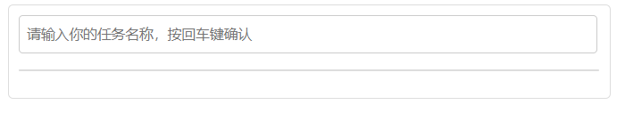

## 15. 全局事件总线实现组件数据传递

全局事件总线实现TodoItem组件向App组件传递数据。

main.js

```js
import Vue from 'vue'
import App from './App.vue'

//关闭vue的生产提示
Vue.config.productionTip = false

new Vue({
  render: h => h(App),
  beforeCreate() {
    // 注册全局事件总线
    Vue.prototype.$bus = this
  }
}).$mount('#app')
```

App.vue

```html
<template>
  <div class="todo-container">
    <div class="todo-wrap">
      <!-- 为子组件TodoAddTask绑定自定义事件addTodo，事件的回调函数为addTodo() -->
      <TodoAddTask @addTodo="addTodo"></TodoAddTask>
      <!-- 将数据传入子组件 -->
      <TodoList :todos="todos"></TodoList>
      <!-- 为子组件 TodoSituation 绑定自定义事件checkAll deleteDone -->
      <TodoSituation :todos="todos" @checkAll="checkAll" @deleteDone="deleteDone"></TodoSituation>
    </div>
  </div>
</template>

<script>
// 导入子组件
import TodoAddTask from './components/TodoAddTask.vue'
import TodoList from './components/TodoList.vue'
import TodoSituation from './components/TodoSituation.vue'

export default {
  name: 'App',
  components: { TodoAddTask, TodoList, TodoSituation },
  data() {
    return {
      todos: JSON.parse(localStorage.getItem('todos')) || []
    }
  },
  methods: {
    // 将新的待做事项添加到列表中
    addTodo(todo) {
      this.todos.unshift(todo)
    },
    // 修改待做事项的勾选状态
    changeDone(id) {
      this.todos.forEach(todo => {
        if (todo.id === id) todo.done = !todo.done
      })
    },
    // 删除todo
    deleteTodo(id) {
      this.todos = this.todos.filter(todo => {
        return todo.id !== id
      })
    },
    // 全选 全不选
    checkAll(done) {
      this.todos.forEach(todo => {
        todo.done = done
      })
    },
    // 清除已完成
    deleteDone() {
      this.todos = this.todos.filter(todo => !todo.done)
    }
  },
  watch: {
    // 使用监视属性监视todos的改变
    // 只要todos发生了改变，就将新的todos进行本地存储
    todos: {
      // 由于默认只会监视一层，监视数组内对象中是否完成的变化需要进行深度监视
      deep: true,
      handler(newVal) {
        // 由于todos是数组对象类型数据，进行本地存储需要转换为json
        localStorage.setItem('todos', JSON.stringify(newVal))
      }
    }
  },
  mounted() {
    // 为全局事件总线绑定自定义事件，用于组件之间的数据通信
    this.$bus.$on('changeDone', this.changeDone)
    this.$bus.$on('deleteTodo', this.deleteTodo)
  },
  beforeDestroy() {
    // 为全局事件总线解绑自定义事件
    this.$bus.$off('changeDone')
    this.$bus.$off('deleteTodo')
  }
}
</script>

<style>
/*base*/
body {
  background: #fff;
}

.btn {
  display: inline-block;
  padding: 4px 12px;
  margin-bottom: 0;
  font-size: 14px;
  line-height: 20px;
  text-align: center;
  vertical-align: middle;
  cursor: pointer;
  box-shadow: inset 0 1px 0 rgba(255, 255, 255, 0.2), 0 1px 2px rgba(0, 0, 0, 0.05);
  border-radius: 4px;
}

.btn-danger {
  color: #fff;
  background-color: #da4f49;
  border: 1px solid #bd362f;
}

.btn-danger:hover {
  color: #fff;
  background-color: #bd362f;
}

.btn:focus {
  outline: none;
}

.todo-container {
  width: 600px;
  margin: 0 auto;
}
.todo-container .todo-wrap {
  padding: 10px;
  border: 1px solid #ddd;
  border-radius: 5px;
}
</style>
```

TodoList.vue

```html
<template>
  <ul class="todo-main">
    <!-- 将每个待做事项传入TodoItem -->
    <TodoItem 
      v-for="todo in todos" 
      :key="todo.id" 
      :todoObj="todo"
    ></TodoItem>    
  </ul>
</template>

<script>
// 导入子组件
import TodoItem from './TodoItem.vue'

export default {
  name: 'TodoList',
  components: {TodoItem},
  props: ['todos']
}
</script>

<style scoped>
/*main*/
.todo-main {
  margin-left: 0px;
  border: 1px solid #ddd;
  border-radius: 2px;
  padding: 0px;
}

.todo-empty {
  height: 40px;
  line-height: 40px;
  border: 1px solid #ddd;
  border-radius: 2px;
  padding-left: 5px;
  margin-top: 10px;
}
</style>
```

TodoItem.vue

```html
<template>
  <li>
    <label>
      <!-- 使用v-bind绑定checked属性，true则有这个属性，false无这个属性 -->
      <input type="checkbox" :checked="todoObj.done" @click="changeChecked"/>
      <span>{{todoObj.todo}}</span>
    </label>
    <button class="btn btn-danger" @click="handlerDelete">删除</button>
  </li>
</template>

<script>
export default {
  name: 'TodoItem',
  props: ['todoObj'],
  methods: {
    // 修改勾选状态
    changeChecked() {
      // this.changeDone(this.todoObj.id)
      // 触发自定义事件向App组件传递修改后的数据
      this.$bus.$emit('changeDone', this.todoObj.id)
    },
    // 删除
    handlerDelete() {
      // 弹出框点击确定执行if中的代码
      // 点击取消不执行
      if (confirm('确定删除吗？')) {
        // this.deleteTodo(this.todoObj.id)
        // 触发自定义事件向App组件传递修改后的数据
        this.$bus.$emit('deleteTodo', this.todoObj.id)
      }
    }
  },
}
</script>

<style scoped>
/*item*/
li {
  list-style: none;
  height: 36px;
  line-height: 36px;
  padding: 0 5px;
  border-bottom: 1px solid #ddd;
}

li label {
  float: left;
  cursor: pointer;
}

li label li input {
  vertical-align: middle;
  margin-right: 6px;
  position: relative;
  top: -1px;
}

li button {
  float: right;
  display: none;
  margin-top: 3px;
}

li:before {
  content: initial;
}

li:last-child {
  border-bottom: none;
}

li:hover {
  background-color: #ddd;
}

li:hover button {
  display: inline-block;
}
</style>
```

> 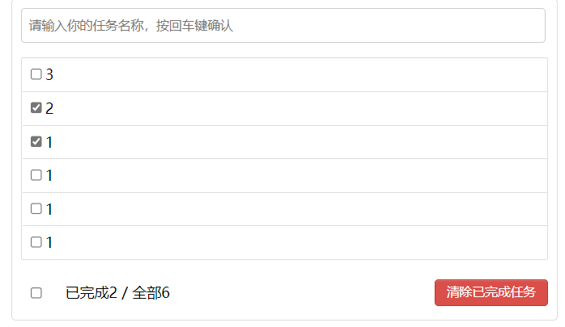
> 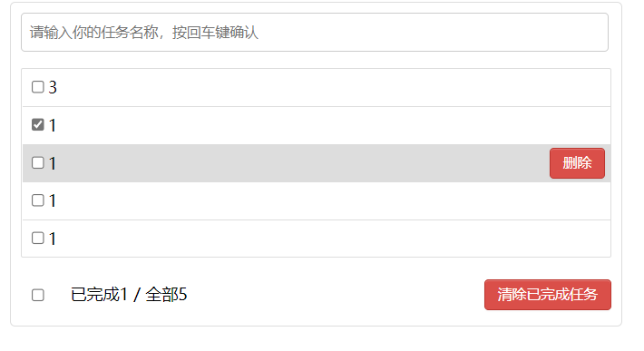

## 16. 实现待做事项的修改

TodoItem.vue

```html
<template>
  <li>
    <label>
      <!-- 使用v-bind绑定checked属性，true则有这个属性，false无这个属性 -->
      <input type="checkbox" :checked="todoObj.done" @click="changeChecked" />
      <span v-show="!todoObj.isEdit">{{todoObj.todo}}</span>
      <!--  ref="inputTask" 获取输入框 -->
      <input v-show="todoObj.isEdit" type="text" v-model="todoObj.todo" @blur="handlerBlur" ref="inputTask">
    </label>
    <button class="btn btn-danger" @click="handlerDelete">删除</button>
    <!-- 输入框出现隐藏按钮 -->
    <button v-show="!todoObj.isEdit" class="btn btn-edit" @click="handlerEdit">编辑</button>
  </li>
</template>

<script>
export default {
  name: 'TodoItem',
  props: ['todoObj'],
  methods: {
    // 修改勾选状态
    changeChecked() {
      // this.changeDone(this.todoObj.id)
      // 触发自定义事件向App组件传递修改后的数据
      this.$bus.$emit('changeDone', this.todoObj.id)
    },
    // 删除
    handlerDelete() {
      // 弹出框点击确定执行if中的代码
      // 点击取消不执行
      if (confirm('确定删除吗？')) {
        // this.deleteTodo(this.todoObj.id)
        // 触发自定义事件向App组件传递修改后的数据
        this.$bus.$emit('deleteTodo', this.todoObj.id)
      }
    },
    // 编辑待做事项
    handlerEdit() {
      // 判断对象上是否已经存在isEdit属性
      // 存在修改isEdit
      if ('isEdit' in this.todoObj) {
        console.log('todoObj存在isEdit属性，进行属性值的修改')
        this.todoObj.isEdit = true
      } else {
        // 向待做事项对象上添加是否处于编辑状态
        // 初始为编辑状态
        console.log('todoObj没有isEdit属性，进行属性的添加')
        this.$set(this.todoObj, 'isEdit', true)
      }
      // nextTick方法会在模板解析完成后执行回调函数中的代码
      this.$nextTick(() => {
        // 获取输入框自动获取焦点
        this.$refs.inputTask.focus()
        // <input v-show="todoObj.isEdit" type="text" v-model="todoObj.todo" @blur="handlerBlur" ref="inputTask"> 双向数据绑定，直接修改对象内的数值，不用在另外进行值的更新
      })
    },
    // 失去焦点取消编辑状态
    handlerBlur() {
      this.todoObj.isEdit = false
    }
  }
}
</script>
```

> 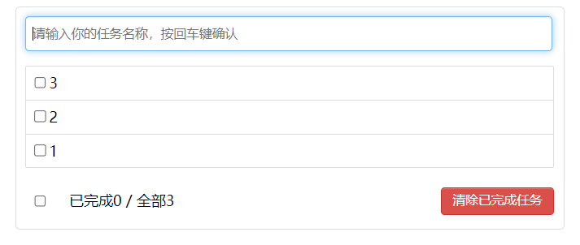
> 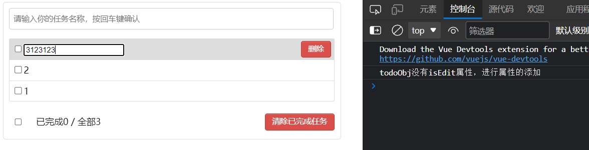
> 

# 29.组件自定义事件

------

## 自定义事件

自定义事件是一种组件间通信的方式，适用于：**子组件 ===> 父组件**

使用场景：A是父组件，B是子组件，B想给A传数据，那么就要在A中给B绑定自定义事件（事件的回调在A中）。

## 1. 自定义属性实现子组件向父组件传递数据

App.vue

```html
<template>
  <div class="app">
    <h1>{{msg}}</h1>
    <School :getSchoolName="getSchoolName"></School>
    <Student></Student>
  </div>
</template>

<script>
//导入子组件
import Student from './components/Student'
import School from './components/School'

export default {
  name: 'App',
  components: { School, Student },
  data() {
    return {
      msg: '你好啊！'
    }
  },
  methods: {
    getSchoolName(name) {
      console.log('App收到了学校名：', name)
    }
  }
}
</script>

<style scoped>
.app {
  background-color: gray;
  padding: 5px;
}
</style>
```

School.vue

```html
<template>
	<div class="school">
		<h2>学校名称：{{name}}</h2>
		<h2>学校地址：{{address}}</h2>
		<button @click="sendSchoolName">把学校名给App</button>
	</div>
</template>

<script>
	export default {
		name:'School',
		props:['getSchoolName'],
		data() {
			return {
				name:'SGG',
				address:'Beijing',
			}
		},
		methods: {
			sendSchoolName(){
				// 调用父组件传递过来的方法
				// 将数据传递给父组件
				this.getSchoolName(this.name)
			}
		},
	}
</script>

<style scoped>
	.school{
		background-color: skyblue;
		padding: 5px;
	}
</style>
```

Student.vue

```html
<template>
	<div class="student">
		<h2>学生姓名：{{name}}</h2>
		<h2>学生性别：{{sex}}</h2>
	</div>
</template>

<script>
	export default {
		name:'Student',
		data() {
			return {
				name:'张三',
				sex:'男'
			}
		},
		
	}
</script>

<style scoped>
	.student{
		background-color: pink;
		padding: 5px;
		margin-top: 30px;
	}
</style>
```

> 

## 2. 自定义事件实现子组件向父组件传递数据

### 2.1 进行自定义事件的绑定

为子组件绑定自定义事件，在父组件中：

```html
<子组件名 @自定义事件名="事件的处理函数"></子组件名>
```

或

```html
<子组件名 v-on:自定义事件名="事件的处理函数"></子组件名>
```

App.vue

```html
<template>
  <div class="app">
    <h1>{{msg}}</h1>
    <School :getSchoolName="getSchoolName"></School>
		<!-- 
			1. 为子组件绑定自定义事件 MyEvent
					当自定义事件 MyEvent 被触发时，
					会调用事件的处理函数 getStudentName
		-->
    <Student @MyEvent="getStudentName"></Student>
  </div>
</template>

<script>
//导入子组件
import Student from './components/Student'
import School from './components/School'

export default {
  name: 'App',
  components: { School, Student },
  data() {
    return {
      msg: '你好啊！'
    }
  },
  methods: {
    getSchoolName(name) {
      console.log('App收到了学校名：', name)
    },
		getStudentName(name) {
			console.log('App收到了学生名：', name)
		}
  }
}
</script>

<style scoped>
.app {
  background-color: gray;
  padding: 5px;
}
</style>
```

### 2.2 触发自定义事件

> 进行自定义事件的触发，需要在被绑定自定义事件的子组件中进行触发。给谁绑定，谁触发。

> 子组件被绑定的自定义事件，自定义事件会挂载在对应子组件实例对象的`$emit`属性上。

触发自定义事件：

```js
this.$emit('自定义事件名', 向事件处理函数传递的参数)
```

Student.vue

```html
<template>
	<div class="student">
		<h2>学生姓名：{{name}}</h2>
		<h2>学生性别：{{sex}}</h2>
		<button @click="sendStudentName">把学生姓名给App</button>
	</div>
</template>

<script>
	export default {
		name:'Student',
		data() {
			return {
				name:'张三',
				sex:'男'
			}
		},
		methods: {
			sendStudentName() {
				// 触发自定义事件
				// 将学生姓名传递给自定义事件的处理函数
				this.$emit('MyEvent', this.name)
			}
		},
	}
</script>

<style scoped>
	.student{
		background-color: pink;
		padding: 5px;
		margin-top: 30px;
	}
</style>
```

> 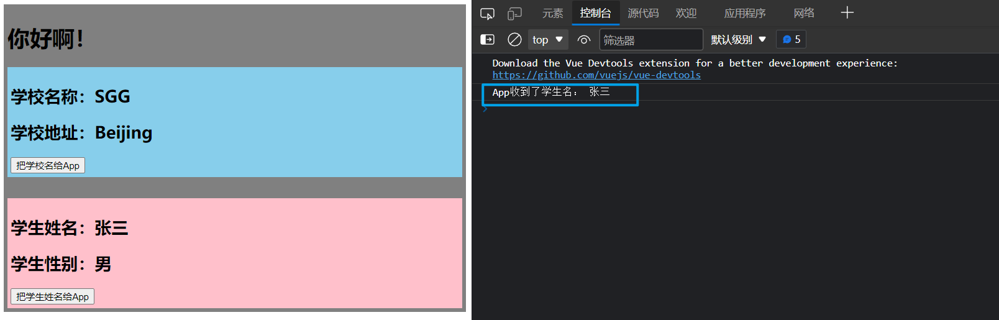

### 2.3 使用 ref 绑定自定义事件

> 使用 ref 为子组件绑定自定义事件，需要在mounted()中进行，因为此时组件的真实DOM才被渲染到页面上完成。

#### 2.3.1 语法

使用 ref 绑定自定义事件，在父组件中：

```html
<子组件名 ref="ref标记"></子组件名>
mounted(){
	// 先通过 $refs 获取对应的子组件
	// 然后使用 $on 为该子组件绑定自定义事件
	this.$refs.ref标记.$on('自定义事件名', 事件的处理函数)
}
```

#### 2.3.2 自定义事件的绑定

App.vue

```html
<template>
  <div class="app">
    <h1>{{msg}}</h1>
    <School :getSchoolName="getSchoolName"></School>
    <!-- 
			1. 为子组件绑定自定义事件 MyEvent
					当自定义事件 MyEvent 被触发时，
					会调用事件的处理函数 getStudentName
		-->
    <!-- <Student @MyEvent="getStudentName"></Student> -->

    <!-- 2. 使用 ref 进行自定义事件的绑定 -->
    <Student ref="student"></Student>
  </div>
</template>

<script>
//导入子组件
import Student from './components/Student'
import School from './components/School'

export default {
  name: 'App',
  components: { School, Student },
  data() {
    return {
      msg: '你好啊！'
    }
  },
  methods: {
    getSchoolName(name) {
      console.log('App收到了学校名：', name)
    },
    getStudentName(name) {
      console.log('App收到了学生名：', name)
    }
  },
	mounted() {
		// 为子组件 Student 绑定自定义事件，$on API将
		this.$refs.student.$on('MyEvent', this.getStudentName)
	},
}
</script>

<style scoped>
.app {
  background-color: gray;
  padding: 5px;
}
</style>
```

> 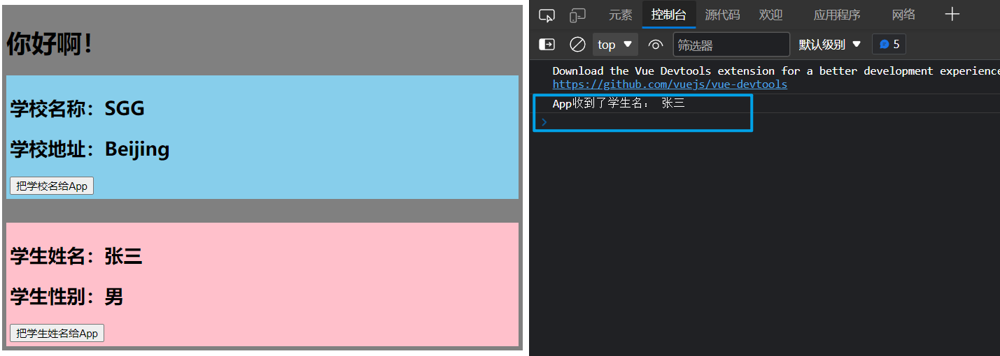

#### 2.3.3 使用 ref 绑定自定义事件的好处

使用 ref 绑定自定义事件的好处，能够更好的处理自定义事件的绑定，能对自定义事件的绑定有更加灵活的控制。

> 使用 v-on 进行自定义事件的绑定，在页面渲染解析完成，vue就会为其绑定自定义指令，而使用 ref 绑定自定义事件，可以对其绑定的时间进行控制，如：延时、等待请求完成等。

App.vue

```html
<template>
  <div class="app">
    <h1>{{msg}}</h1>
    <School :getSchoolName="getSchoolName"></School>
    <!-- 
			1. 为子组件绑定自定义事件 MyEvent
					当自定义事件 MyEvent 被触发时，
					会调用事件的处理函数 getStudentName
		-->
    <!-- <Student @MyEvent="getStudentName"></Student> -->

    <!-- 
			2. 使用 ref 进行自定义事件的绑定
		-->
    <Student ref="student"></Student>
  </div>
</template>

<script>
//导入子组件
import Student from './components/Student'
import School from './components/School'

export default {
  name: 'App',
  components: { School, Student },
  data() {
    return {
      msg: '你好啊！'
    }
  },
  methods: {
    getSchoolName(name) {
      console.log('App收到了学校名：', name)
    },
    getStudentName(name) {
      console.log('App收到了学生名：', name)
    }
  },
	mounted() {
		// 等待三秒，为子组件 Student 绑定自定义事件
		setTimeout(()=>{
			this.$refs.student.$on('MyEvent', this.getStudentName)
		}, 3000)
	},
}
</script>

<style scoped>
.app {
  background-color: gray;
  padding: 5px;
}
</style>
```

> 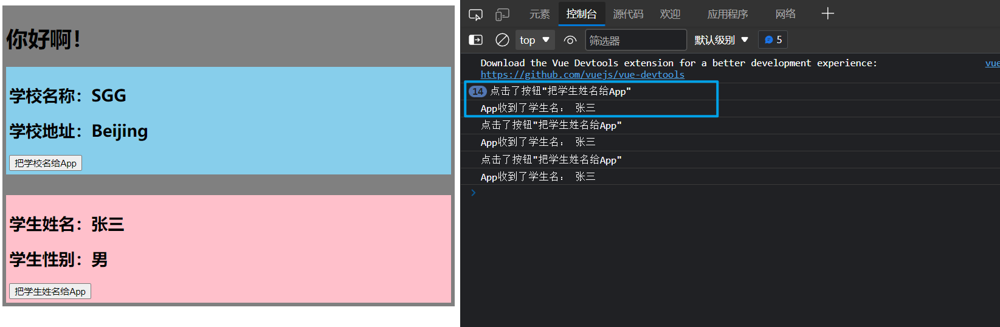

### 2.4 触发自定义事件向处理函数传递多个参数

> 在接收参数时，不想书写多个形参，可以使用`...`扩展运算符将多个参数进行接收。

App.vue

```html
<template>
  <div class="app">
    <h1>{{msg}}</h1>
    <School :getSchoolName="getSchoolName"></School>
    <!-- 
			1. 为子组件绑定自定义事件 MyEvent
					当自定义事件 MyEvent 被触发时，
					会调用事件的处理函数 getStudentName
		-->
    <!-- <Student @MyEvent="getStudentName"></Student> -->

    <!-- 
			2. 使用 ref 进行自定义事件的绑定
		-->
    <Student ref="student"></Student>
  </div>
</template>

<script>
//导入子组件
import Student from './components/Student'
import School from './components/School'

export default {
  name: 'App',
  components: { School, Student },
  data() {
    return {
      msg: '你好啊！'
    }
  },
  methods: {
    getSchoolName(name) {
      console.log('App收到了学校名：', name)
    },
    getStudentName(name, ...params) {
      console.log('App收到了学生名：', name)
      console.log('其他参数：', params)
    }
  },
  mounted() {
    // 为子组件 Student 绑定自定义事件
    this.$refs.student.$on('MyEvent', this.getStudentName)
  }
}
</script>

<style scoped>
.app {
  background-color: gray;
  padding: 5px;
}
</style>
```

Student.vue

```html
<template>
	<div class="student">
		<h2>学生姓名：{{name}}</h2>
		<h2>学生性别：{{sex}}</h2>
		<button @click="sendStudentName">把学生姓名给App</button>
	</div>
</template>

<script>
	export default {
		name:'Student',
		data() {
			return {
				name:'张三',
				sex:'男'
			}
		},
		methods: {
			sendStudentName() {
				console.log('点击了按钮"把学生姓名给App"')
				// 触发自定义事件
				// 将学生姓名传递给自定义事件的处理函数
				// 传递多个参数
				this.$emit('MyEvent', this.name, 1, 2, 3)
			}
		},
	}
</script>

<style scoped>
	.student{
		background-color: pink;
		padding: 5px;
		margin-top: 30px;
	}
</style>
```

> 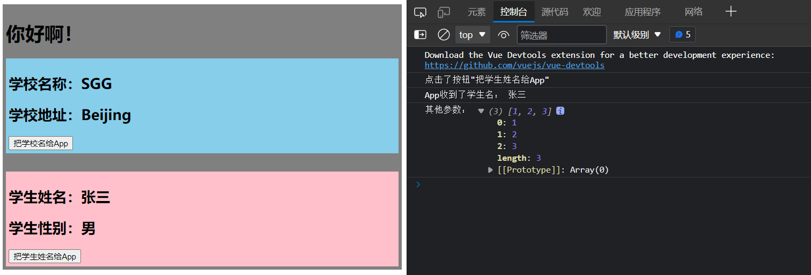

### 2.5 自定义事件只触发一次

> 实现方法与使用vue的内置事件一样，使用事件修饰符

App.vue

```html
<template>
  <div class="app">
    <h1>{{msg}}</h1>
    <School :getSchoolName="getSchoolName"></School>
    <Student @MyEvent.once="getStudentName"></Student>
    <!-- <Student ref="student"></Student> -->
  </div>
</template>

<script>
//导入子组件
import Student from './components/Student'
import School from './components/School'

export default {
  name: 'App',
  components: { School, Student },
  data() {
    return {
      msg: '你好啊！'
    }
  },
  methods: {
    getSchoolName(name) {
      console.log('App收到了学校名：', name)
    },
    getStudentName(name, ...params) {
      console.log('App收到了学生名：', name)
      console.log('其他参数：', params)
    }
  },
  mounted() {
    // 为子组件 Student 绑定自定义事件
		// 自定义事件只被触发一次
    // this.$refs.student.$once('MyEvent', this.getStudentName)
  }
}
</script>

<style scoped>
.app {
  background-color: gray;
  padding: 5px;
}
</style>
```

> 

### 2.6 解绑自定义事件

解绑自定义事件，需要在被绑定自定义事件的子组件实例对象上进行自定义事件的解绑。

#### 2.6.1 语法

解绑自定义事件，调用被绑定自定义事件的子组件实例对象上的`$off()`方法。

```js
this.$off(自定义事件)
```

#### 2.6.2 解绑一个自定义事件

```js
// 解绑 MyEvent 自定义事件
this.$off('MyEvent')
```

Student.vue

```html
<template>
	<div class="student">
		<h2>学生姓名：{{name}}</h2>
		<h2>学生性别：{{sex}}</h2>
		<button @click="sendStudentName">把学生姓名给App</button>
		<button @click="offEvent">点击解绑自定义事件</button>
	</div>
</template>

<script>
	export default {
		name:'Student',
		data() {
			return {
				name:'张三',
				sex:'男'
			}
		},
		methods: {
			sendStudentName() {
				console.log('点击了按钮"把学生姓名给App"')
				this.$emit('MyEvent', this.name)
			},
			offEvent() {
				// 解绑 MyEvent 自定义事件
				console.log('解绑 MyEvent 自定义事件')
				this.$off('MyEvent')
			}
		},
	}
</script>

<style scoped>
	.student{
		background-color: pink;
		padding: 5px;
		margin-top: 30px;
	}
</style>
```

> 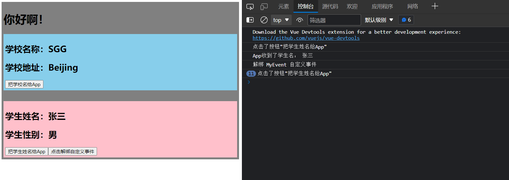

#### 2.6.3 解绑多个自定义事件

> 解绑多个自定义事件，需要向`$off()`方法中传入一个数组，数组中的元素为需要解绑的自定义事件的名

```js
// 解绑 MyEvent demo 自定义事件
this.$off(['MyEvent', 'demo'])
```

App.vue

```html
<template>
  <div class="app">
    <h1>{{msg}}</h1>
    <School :getSchoolName="getSchoolName"></School>
    <Student 
			@MyEvent="getStudentName"
			@demo="demo"
		></Student>
  </div>
</template>

<script>
//导入子组件
import Student from './components/Student'
import School from './components/School'

export default {
  name: 'App',
  components: { School, Student },
  data() {
    return {
      msg: '你好啊！'
    }
  },
  methods: {
    getSchoolName(name) {
      console.log('App收到了学校名：', name)
    },
    getStudentName(name) {
      console.log('App收到了学生名：', name)
    },
		demo() {
			console.log('自定义事件 demo 被触发...')
		}
  },
}
</script>

<style scoped>
.app {
  background-color: gray;
  padding: 5px;
}
</style>
```

Student.vue

```html
<template>
	<div class="student">
		<h2>学生姓名：{{name}}</h2>
		<h2>学生性别：{{sex}}</h2>
		<button @click="sendStudentName">把学生姓名给App</button>
		<button @click="offEvent">点击解绑自定义事件</button>
	</div>
</template>

<script>
	export default {
		name:'Student',
		data() {
			return {
				name:'张三',
				sex:'男'
			}
		},
		methods: {
			sendStudentName() {
				console.log('触发事件：')
				this.$emit('MyEvent', this.name)
				this.$emit('demo')
			},
			offEvent() {
				// 解绑 MyEvent demo 自定义事件
				console.log('解绑 MyEvent demo 自定义事件')
				this.$off(['MyEvent', 'demo'])
			}
		},
	}
</script>

<style scoped>
	.student{
		background-color: pink;
		padding: 5px;
		margin-top: 30px;
	}
</style>
```

> 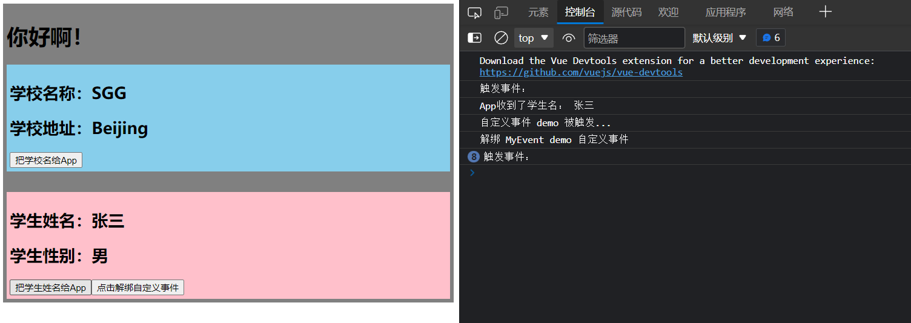

#### 2.6.4 解绑所有自定义事件

> 解绑所有自定义事件，向`$off()`方法中不传入参数即可

```js
// 解绑所有自定义事件
this.$off()
```

Student.vue

```html
<template>
	<div class="student">
		<h2>学生姓名：{{name}}</h2>
		<h2>学生性别：{{sex}}</h2>
		<button @click="sendStudentName">把学生姓名给App</button>
		<button @click="offEvent">点击解绑自定义事件</button>
	</div>
</template>

<script>
	export default {
		name:'Student',
		data() {
			return {
				name:'张三',
				sex:'男'
			}
		},
		methods: {
			sendStudentName() {
				console.log('触发事件：')
				this.$emit('MyEvent', this.name)
				this.$emit('demo')
			},
			offEvent() {
				// 解绑 所有 自定义事件
				console.log('解绑 所有 自定义事件')
				this.$off()
			}
		},
	}
</script>

<style scoped>
	.student{
		background-color: pink;
		padding: 5px;
		margin-top: 30px;
	}
</style>
```

> 

## 3. 自定义事件的注意点

### 3.1 使用 ref 绑定自定义事件中的 this

```html
<template>
  <div class="app">
    <h1>{{msg}} 学生姓名：{{stuName}}</h1>
    <School :getSchoolName="getSchoolName"></School>
    <!-- <Student @MyEvent="getStudentName"></Student> -->
    <Student ref="stu"></Student>
  </div>
</template>

<script>
//导入子组件
import Student from './components/Student'
import School from './components/School'

export default {
  name: 'App',
  components: { School, Student },
  data() {
    return {
      msg: '你好啊！',
			stuName: ''
    }
  },
  methods: {
    getSchoolName(name) {
      console.log('App收到了学校名：', name)
    },
    getStudentName(name) {
      console.log('App收到了学生名：', name)
    },
  },
	mounted() {
		// 由于vue规定
		// 谁触发事件，对应的回调函数中的this就指向谁
		// 由于触发自定义事件 MyEvent 为Student组件，且普通函数拥有自己的this
		// 所以 this 指向 Student组件实例对象
		// this.stuName = name 所以相当于向Student组件中的stuName赋值
		this.$refs.stu.$on('MyEvent', function(name) {
      		console.log('App收到了学生名：', name)
			this.stuName = name
    	})
	},
}
</script>

<style scoped>
.app {
  background-color: gray;
  padding: 5px;
}
</style>
```

> 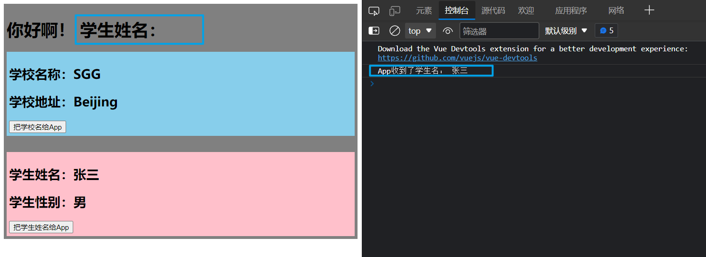

```js
mounted() {
		// 由于vue规定
		// 谁触发事件，对应的回调函数中的this就指向谁
		// 更改为箭头函数
		// 由于箭头函数没有自己的this
		// 所以会在函数声明位置向外查找，即App组件实例对象
		// 所以箭头函数 this.stuName = name 就是向 App组件实例对象中的stuName赋值
		this.$refs.stu.$on('MyEvent', (name) => {
     		 console.log('App收到了学生名：', name)
			this.stuName = name
    })
	},
```

> 

```html
<template>
  <div class="app">
    <h1>{{msg}} 学生姓名：{{stuName}}</h1>
    <School :getSchoolName="getSchoolName"></School>
    <!-- <Student @MyEvent="getStudentName"></Student> -->
    <Student ref="stu"></Student>
  </div>
</template>

<script>
//导入子组件
import Student from './components/Student'
import School from './components/School'

export default {
  name: 'App',
  components: { School, Student },
  data() {
    return {
      msg: '你好啊！',
			stuName: ''
    }
  },
  methods: {
    getSchoolName(name) {
      console.log('App收到了学校名：', name)
    },
    getStudentName(name) {
      console.log('App收到了学生名：', name)
			this.stuName = name
    },
  },
	mounted() {
		// 此种写法，会先将getStudentName函数中的this指向Student组件实例对象
		// 但是由于getStudentName函数声明在App组件的methods中
		// 在methods中的方法，this一定指向所在组件的实例对象
		// 所以getStudentName中的this最终指向App组件实例对象
		this.$refs.stu.$on('MyEvent', this.getStudentName)
	},
}
</script>

<style scoped>
.app {
  background-color: gray;
  padding: 5px;
}
</style>
```

> 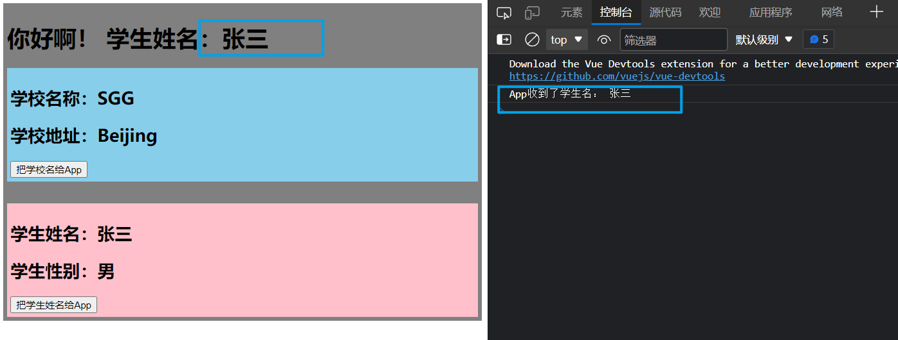

### 3.2 为子组件绑定内置事件

```html
<!-- 这样子绑定内置事件，会被认为是自定义事件，只不过自定义事件名字是click -->
<Student ref="stu" @click="show"></Student>
// App组件 methods
		show() {
			alert(11111)
		}
```

为子组件绑定内置事件，且不让内置事件被认为是自定义事件，需要使用事件修饰符`native`，即可为子组件绑定内置事件。

```html
<Student ref="stu" @click.native="show"></Student>
```

> 

## 4. 组件自定义事件 总结

1. 一种组件间通信的方式，适用于：**子组件 ===> 父组件**

2. 使用场景：A是父组件，B是子组件，B想给A传数据，那么就要在A中给B绑定自定义事件（事件的回调在A中）。

3. 绑定自定义事件：

   1. 第一种方式，在父组件中：`<Demo @atguigu="test"/>`或 `<Demo v-on:atguigu="test"/>`

   2. 第二种方式，在父组件中：

      ```js
      <Demo ref="demo"/>
      ......
      mounted(){
         this.$refs.xxx.$on('atguigu',this.test)
      }
      ```

   3. 若想让自定义事件只能触发一次，可以使用`once`修饰符，或`$once`方法。

4. 触发自定义事件：`this.$emit('atguigu',数据)`

5. 解绑自定义事件`this.$off('atguigu')`

6. 组件上也可以绑定原生DOM事件，需要使用`native`修饰符。

7. 注意：通过`this.$refs.xxx.$on('atguigu',回调)`绑定自定义事件时，回调要么配置在methods中，要么用箭头函数，否则this指向会出问题！

# 30.全局事件总线

## 1. 全局事件总线

全局事件总线是一种组件间通信的方式，能够实现任意组件间的通信。

原理图：
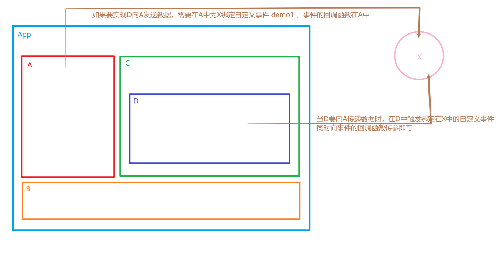

在全局事件总线中，X需要满足的条件：
1.所有的组件都可以看见X
2.X能够调用`$on() $off() $emit()`

## 2. $on() $off() $emit() 存放位置

`$on() $off() $emit()`三个方法被挂载在Vue的原型对象上。

```js
import Vue from 'vue'
import App from './App.vue'

//关闭vue的生产提示
Vue.config.productionTip = false

// 查看Vue的原型对象
console.log(Vue.prototype)

new Vue({
  render: h => h(App),
}).$mount('#app')
```

> 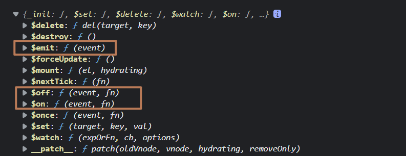

> 在Vue中，VueComponent()的原型对象的原型对象为Vue()的原型对象。即组件的原型对象的原型对象为Vue()的原型对象。
>
> > 见21-2-2.5：重要的内置关系
>
> ```properties
> VueComponent.prototype.__proto__ === Vue.prototype //true
> ```

所以能够作为全局事件总线的可以是Vue的实例对象，或者是组件实例对象。

## 3. 组件实例对象作为全局事件总线

创建组件，需要先创建组件的构造函数：

```js
// {} 为组件的配置对象
const XVueComponent = Vue.extend({})
```

使用组件的构造函数，创建对应的组件：

```js
const X = new XVueComponent()
```

新创建的组件实例对象，要能够被所有的组件看见，需要将其挂载到Vue的原型对象上。

```js
Vue.prototype.X = X
```

main.js

```js
import Vue from 'vue'
import App from './App.vue'

//关闭vue的生产提示
Vue.config.productionTip = false

// 创建 VueComponent
// 由于新创建的组件只需要作为数据的中转站，所以不需要任何配置项
const XVueComponent = Vue.extend({})
// 创建组件实例对象
const X = new XVueComponent()
// 将组件实例对象挂载到Vue上
Vue.prototype.X = X

new Vue({
  render: h => h(App),
}).$mount('#app')
```

Student.vue

```html
<template>
  <div class="student">
    <h2>学生姓名：{{name}}</h2>
    <h2>学生性别：{{sex}}</h2>
		<button @click="show">点击查看中转数据的组件实例对象</button>
  </div>
</template>

<script>
export default {
  name: 'Student',
  data() {
    return {
      name: '张三',
      sex: '男'
    }
  },
	methods: {
		show() {
			console.log(this.X)
		}
	},
}
</script>

<style scoped>
.student {
  background-color: pink;
  padding: 5px;
  margin-top: 30px;
}
</style>
```

> 

## 4. Vue实例对象作为全局事件总线

main.js

```js
import Vue from 'vue'
import App from './App.vue'

//关闭vue的生产提示
Vue.config.productionTip = false

new Vue({
  render: h => h(App),
  // 将 Vue 实例对象挂载到 Vue 的原型对象上
  // 可以在 beforeCreate 中进行
  // 此时刚创建好 vue 实例对象
  beforeCreate() {
    // bus 总线
    // $ 为了迎合 vue 的命名习惯
    // 安装全局事件总线，$bus就是当前应用的vm
    Vue.prototype.$bus = this
  }
}).$mount('#app')
```

Student.vue

```html
<template>
  <div class="student">
    <h2>学生姓名：{{name}}</h2>
    <h2>学生性别：{{sex}}</h2>
		<button @click="show">点击查看中转数据的组件实例对象</button>
  </div>
</template>

<script>
export default {
  name: 'Student',
  data() {
    return {
      name: '张三',
      sex: '男'
    }
  },
	methods: {
		show() {
			console.log(this.$bus)
		}
	},
}
</script>

<style scoped>
.student {
  background-color: pink;
  padding: 5px;
  margin-top: 30px;
}
</style>
```

> 

## 5. 事件总线实现组件数据互传

> 注意：
> 由于充当事件总线的组件只有一个，所以在为其绑定自定义事件时，自定义事件的名不能重复。
> 在为事件总线绑定自定义事件的组件被销毁时，进行自定义事件的解绑。

实现将组件Student中的学生姓名传递给组件School：

School.vue

```html
<template>
  <div class="school">
    <h2>学校名称：{{name}}</h2>
    <h2>学校地址：{{address}}</h2>
  </div>
</template>

<script>
export default {
  name: 'School',
  data() {
    return {
      name: 'SGG',
      address: 'Beijing'
    }
  },
	mounted() {
		// 为全局事件总线绑定自定义事件
		this.$bus.$on('getStudentName', (name)=>{
			console.log('School 组件收到了数据：', name)
		})
	},
	beforeDestroy() {
		// 组件被销毁了，不能进行数据传输
		// 解绑事件
		this.$bus.$off('getStudentName')
	}
}
</script>

<style scoped>
.school {
  background-color: skyblue;
  padding: 5px;
}
</style>
```

Student.vue

```html
<template>
  <div class="student">
    <h2>学生姓名：{{name}}</h2>
    <h2>学生性别：{{sex}}</h2>
		<button @click="sendStudentName">点击发送学生姓名</button>
  </div>
</template>

<script>
export default {
  name: 'Student',
  data() {
    return {
      name: '张三',
      sex: '男'
    }
  },
	methods: {
		sendStudentName() {
			// 激活事件，发送数据
			this.$bus.$emit('getStudentName', this.name)
		}
	},
}
</script>

<style scoped>
.student {
  background-color: pink;
  padding: 5px;
  margin-top: 30px;
}
</style>
```

> 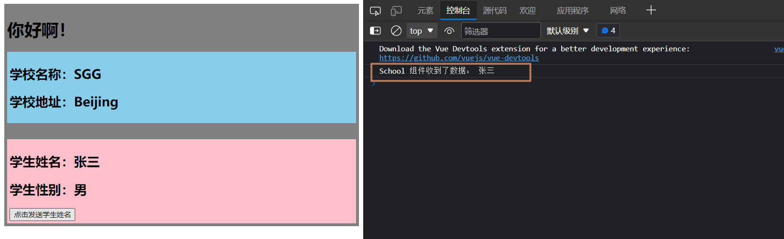

## 6. 全局事件总线（GlobalEventBus）总结

1. 一种组件间通信的方式，适用于任意组件间通信。

2. 安装全局事件总线：

   ```js
   new Vue({
   	......
   	beforeCreate() {
   		Vue.prototype.$bus = this //安装全局事件总线，$bus就是当前应用的vm
   	},
       ......
   }) 
   ```

3. 使用事件总线：

   1. 接收数据：A组件想接收数据，则在A组件中给$bus绑定自定义事件，事件的回调留在A组件自身。

      ```js
      methods(){
        demo(data){......}
      }
      ......
      mounted() {
        this.$bus.$on('xxxx',this.demo)
      }
      ```

   2. 提供数据：`this.$bus.$emit('xxxx',数据)`

4. 最好在beforeDestroy钩子中，用$off去解绑当前组件所用到的事件。

# 31.消息的订阅与发布

------

## 1. 消息的订阅与发布

### 1.1 简介

消息的订阅与发布类似报纸的订阅与发布，报纸订阅与发布的步骤：
（1）订阅报纸，留下报纸需要送到的地址
（2）邮递员送报纸

消息订阅与发布的步骤：
（1）订阅消息，留下消息名(好比手机号，消息的接受者)
（2）发布消息内容

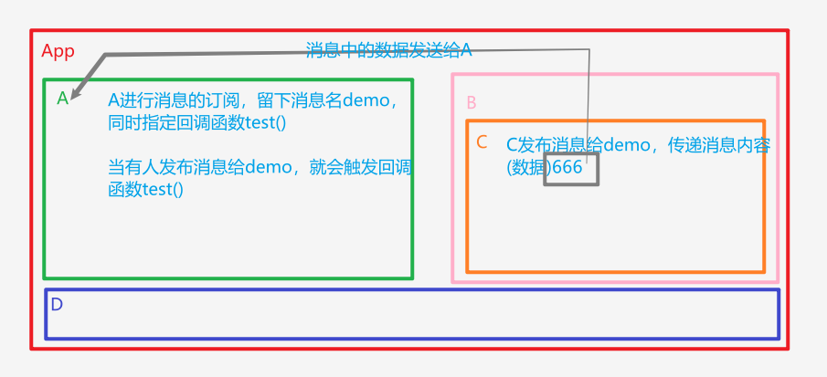

### 1.2 pubsub-js

实现消息的订阅与发布需要借助第三方库，这里使用`pubsub-js`。

#### 1.2.1 安装

安装pubsub-js：

```html
npm i pubsub-js
```

#### 1.2.2 引入

引入pubsub-js：

> 需要进行消息的订阅与发布的组件都需要引入pubsub-js。

```js
import pubsub from 'pubsub-js'
```

- pubsub 是一个对象

#### 1.2.3 订阅消息

订阅消息，需要调用pubsub对象上的subscribe()方法进行消息的订阅

```js
pubsub.subscribe('消息名', 回调函数)
```

- subscribe()方法会返回订阅消息对应的ID
- 回调函数，不建议使用普通匿名函数，因为第三方库和vue不一样，不保证函数中的this指向vue实例或组件实例对象。建议使用箭头函数或者将普通函数写在methods配置项中。
- 回调函数接收两个参数，第一个参数为消息名，第二个参数为传递过来的数据

> subscribe：订阅

#### 1.2.4 发布消息

发布消息，需要调用pubsub对象上的publish()方法进行消息的发布。

```js
pubsub.publish('消息名', 数据)
```

#### 1.2.5 取消订阅

取消消息的订阅，需要调用pubsub对象上的unsubscribe()方法进行消息的取消订阅。

一般消息的取消订阅，在组件销毁之前进行取消订阅，即在beforeDestroy()中进行消息的取消订阅。

取消订阅需要根据之前订阅消息生成的消息ID来取消订阅对应的消息。

> 在不同方法中，使用同一个变量，可以将变量挂载在组件实例对象上。

```js
this.pubId = pubsub.subscribe('消息名', 回调函数)
pubsub.unsubscribe(this.pubId)
```

## 2. 消息的订阅与发布实现组件通信

main.js

```js
import Vue from 'vue'
import App from './App.vue'

//关闭vue的生产提示
Vue.config.productionTip = false

new Vue({
  render: h => h(App)
}).$mount('#app')
```

App.vue

```html
<template>
  <div class="app">
    <h1>{{msg}}</h1>
    <School></School>
    <Student></Student>
  </div>
</template>

<script>
//导入子组件
import Student from './components/Student'
import School from './components/School'

export default {
  name: 'App',
  components: { School, Student },
  data() {
    return {
      msg: '你好啊！'
    }
  }
}
</script>

<style scoped>
.app {
  background-color: gray;
  padding: 5px;
}
</style>
```

School.vue

```html
<template>
  <div class="school">
    <h2>学校名称：{{name}}</h2>
    <h2>学校地址：{{address}}</h2>
  </div>
</template>

<script>
// 导入pubsub-js进行消息的订阅
import pubsub from 'pubsub-js'

export default {
  name: 'School',
  data() {
    return {
      name: 'SGG',
      address: 'Beijing'
    }
  },
	mounted() {
    // 为全局事件总线绑定自定义事件
    // this.$bus.$on('getStudentName', (name)=>{
    // 	console.log('School 组件收到了数据：', name)
    // })
    // 使用pubsub进行消息的订阅
    this.pubId = pubsub.subscribe('getStudentName', (msgName, data)=>{
      console.log('School组件接收到消息：', data)
      console.log(this)
    })
	},
	beforeDestroy() {
    // 组件被销毁了 解绑事件
    // this.$bus.$off('getStudentName')
    // 取消消息的订阅
    pubsub.unsubscribe(this.pubId)
	}
}
</script>

<style scoped>
.school {
  background-color: skyblue;
  padding: 5px;
}
</style>
```

Student.vue

```html
<template>
  <div class="student">
    <h2>学生姓名：{{name}}</h2>
    <h2>学生性别：{{sex}}</h2>
		<button @click="sendStudentName">点击发送学生姓名</button>
  </div>
</template>

<script>
// 导入pubsub进行消息的发布
import pubsub from 'pubsub-js'

export default {
  name: 'Student',
  data() {
    return {
      name: '张三',
      sex: '男'
    }
  },
	methods: {
		sendStudentName() {
			// 激活事件，发送数据
			// this.$bus.$emit('getStudentName', this.name)
              // 进行消息的发布
              pubsub.publish('getStudentName', this.name)
		}
	},
}
</script>

<style scoped>
.student {
  background-color: pink;
  padding: 5px;
  margin-top: 30px;
}
</style>
```

> 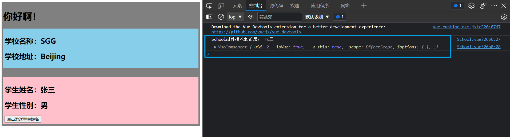

## 3. 消息的订阅与发布 总结

1. 一种组件间通信的方式，适用于任意组件间通信。

2. 使用步骤：

   1. 安装pubsub：`npm i pubsub-js`

   2. 引入: `import pubsub from 'pubsub-js'`

   3. 接收数据：A组件想接收数据，则在A组件中订阅消息，订阅的回调留在A组件自身。

      ```js
      methods(){
        demo(data){......}
      }
      ......
      mounted() {
        this.pid = pubsub.subscribe('xxx',this.demo) //订阅消息
      }
      ```

   4. 提供数据：`pubsub.publish('xxx',数据)`

   5. 最好在beforeDestroy钩子中，用`PubSub.unsubscribe(pid)`去取消订阅。

# 32.$nextTick()

------

   ## 1. $nextTick()

   ### 1.1 语法

   ```js
this.$nextTick(回调函数)
   ```

   ### 1.2 作用

   在下一次 DOM 更新结束后执行其指定的回调。

   ### 1.3 使用时机

   当改变数据后，要基于更新后的新DOM进行某些操作时，要在nextTick所指定的回调函数中执行。

   ## 2. $nextTick() 使用实例

   需求：需要实现点击按钮，使用文本框对页面中的标题数据进行修改，且文本框能够自动获取焦点，文本框失去焦点保存修改后的标题，且文本框隐藏。

   ```html
<!DOCTYPE html>
<html lang="en">
<head>
  <meta charset= "UTF-8">
  <meta http-equiv="X-UA-Compatible" content="IE=edge">
  <meta name="viewport" content="width=device-width, initial-scale=1.0">
  <title>Document</title>
</head>
<body>
  <div id="root">
    <h1>{{title}}</h1>
    <input 
      type="text" 
      v-model="title"
      v-show="isEdit"
      ref="inputTitle"
      @blur="handlerBlur"
    >
    <button
      v-show="!isEdit"
      @click="handlerEdit"
    >点击修改标题</button>
  </div>
</body>
<script src="https://cdn.jsdelivr.net/npm/vue@2.6.14/dist/vue.js"></script>
<script>
  const vm = new Vue({
    el: '#root',
    data: {
      title: 'hello world',
      // 是否处于编辑状态
      isEdit: false
    },
    methods: {
      // 对标题进行编辑
      handlerEdit() {
        // 修改状态为编辑状态
        this.isEdit = !this.isEdit
        // 直接让输入框获取焦点
        // 此时函数中的代码还未完全执行完成，vue不会进行模板的重新解析
        // 所以更新后的还未放入页面，此时获取焦点无效
        // this.$refs.inputTitle.focus()

        // 使用nextTick()在页面解析完成后让文本框获取焦点
        // 基于更新后的新输入框进行操作，使其获取焦点
        this.$nextTick(()=>{
          this.$refs.inputTitle.focus()
        })
      },
      // 处理文本框失去焦点
      handlerBlur() {
        // 修改状态为不处于编辑状态
        this.isEdit = !this.isEdit
      }
    },
  })
</script>
</html>
   ```

   > 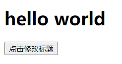
   > 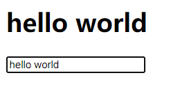
   > 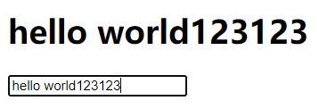
   > 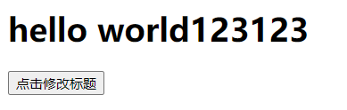

# 33.动画与过渡

## 1. 绑定class样式实现动画效果

main.js

```js
import Vue from 'vue'
import App from './App.vue'

//关闭vue的生产提示
Vue.config.productionTip = false

new Vue({
  render: h => h(App)
}).$mount('#app')
```

App.vue

```html
<template>
  <div class="app">
    <Test></Test>
  </div>
</template>

<script>
//导入子组件
import Test from './components/Test.vue'

export default {
  name: 'App',
  components: {
    Test
  }
}
</script>

<style scoped>
</style>
```

Test.vue

```html
<template>
  <div>
    <button @click="changeShow">显示/隐藏</button>
    <h1 :class="animation" v-show="isShow">hello world</h1>
  </div>
</template>

<script>
export default {
  name: 'Test',
  data() {
    return {
      // 控制显示与隐藏
      isShow: false,
      // 需要进行绑定的样式
      animation: ''
    }
  },
  methods: {
    changeShow() {
      // 如果是隐藏状态
      if (!this.isShow) {
        // 更改为显示状态，并且绑定进入样式
        this.isShow = true
        this.animation = 'enter'
      } else {
        // 如果不为隐藏状态
        // 更改为隐藏状态，绑定离开样式
        this.isShow = false
        this.animation = 'leave'
      }
    }
  }
}
</script>

<style scoped>
h1 {
  background-color: orange;
}

/* 进入动画 */
.enter {
  animation: sgg 0.5s linear;
}

/* 离开动画 */
.leave {
  animation: sgg 0.5s linear reverse;
}

/* 自定义动画 */
@keyframes sgg {
  from {
    transform: translateX(-100%);
  }
  to {
    transform: translateX(0px);
  }
}
</style>
```

> 
> 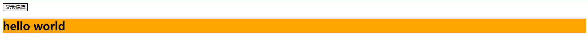

## 2. transition 标签实现动画效果

### 2.1 语法

vue规定，想要让哪个元素具有动画效果，就使用 transition 标签将该元素进行包裹，vue会在合适的时机为元素加上动画效果。

```html
    <transition>
      <h1 v-show="isShow">hello world</h1>
    </transition>
```

要实现动画效果，还需要将动画的命名修改为符合vue的规定，进入页面的动画的命名为`v-enter-active`，离开页面的动画的命名为`v-leave-active`。

```css
/* 进入动画 */
.v-enter-active {
  animation: sgg 0.5s linear;
}

/* 离开动画 */
.v-leave-active {
  animation: sgg 0.5s linear reverse;
}

/* 自定义动画 */
@keyframes sgg {
  from {
    transform: translateX(-100%);
  }
  to {
    transform: translateX(0px);
  }
}
```

### 2.2 动画实现

Test.vue

```html
<template>
  <div>
    <button @click="changeShow">显示/隐藏</button>
    <transition>
      <h1 v-show="isShow">hello world</h1>
    </transition>
  </div>
</template>

<script>
export default {
  name: 'Test',
  data() {
    return {
      // 控制显示与隐藏
      isShow: false,
    }
  },
  methods: {
    changeShow() {
      // 如果是隐藏状态
      if (!this.isShow) {
        // 更改为显示状态
        this.isShow = true
      } else {
        // 如果不为隐藏状态
        // 更改为隐藏状态
        this.isShow = false
      }
    }
  }
}
</script>

<style scoped>
h1 {
  background-color: orange;
}

/* 进入动画 */
.v-enter-active {
  animation: sgg 0.5s linear;
}

/* 离开动画 */
.v-leave-active {
  animation: sgg 0.5s linear reverse;
}

/* 自定义动画 */
@keyframes sgg {
  from {
    transform: translateX(-100%);
  }
  to {
    transform: translateX(0px);
  }
}
</style>
```

> 
> 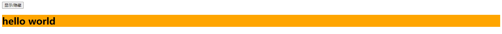
> 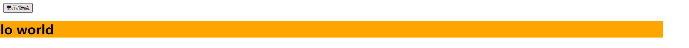
> 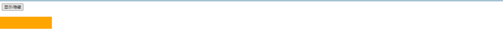
> 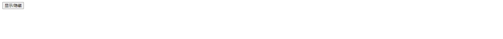

### 2.3 为 transition 标签指定名字

为 transition 标签指定名字，需要使用 transition 标签上的 name 属性，如果为 transition 标签指定了名字，那么对应的动画的名字也要进行相应的更改。

为 transition 标签指定了名字，可以实现使得不同的元素有不同的动画。

```html
    <transition name="hello">
      <h1 v-show="isShow">hello world</h1>
    </transition>
/* 进入动画 */
.hello-enter-active {
  animation: sgg 0.5s linear;
}

/* 离开动画 */
.hello-leave-active {
  animation: sgg 0.5s linear reverse;
}

/* 自定义动画 */
@keyframes sgg {
  from {
    transform: translateX(-100%);
  }
  to {
    transform: translateX(0px);
  }
}
```

Test.vue

```html
<template>
  <div>
    <button @click="changeShow">显示/隐藏</button>
    <transition name="hello">
      <h1 v-show="isShow">hello world</h1>
    </transition>
  </div>
</template>

<script>
export default {
  name: 'Test',
  data() {
    return {
      // 控制显示与隐藏
      isShow: false,
    }
  },
  methods: {
    changeShow() {
      // 如果是隐藏状态
      if (!this.isShow) {
        // 更改为显示状态
        this.isShow = true
      } else {
        // 如果不为隐藏状态
        // 更改为隐藏状态
        this.isShow = false
      }
    }
  }
}
</script>

<style scoped>
h1 {
  background-color: orange;
}

/* 进入动画 */
.hello-enter-active {
  animation: sgg 0.5s linear;
}

/* 离开动画 */
.hello-leave-active {
  animation: sgg 0.5s linear reverse;
}

/* 自定义动画 */
@keyframes sgg {
  from {
    transform: translateX(-100%);
  }
  to {
    transform: translateX(0px);
  }
}
</style>
```

> 
> 
> 
> 
> 

### 2.4 页面加载完成立即执行动画

要实现页面加载完成立即执行动画，需要使用 transition 标签的 appear 属性，指定该属性的值为 true。

```html
    <!-- 
      需要进行属性绑定，如果使用 appear="true" 则 appear 的值为 “true”
      使用 :appear="true"，appear 的值为 true
    -->
    <transition name="hello" :appear="true">
      <h1 v-show="isShow">hello world</h1>
    </transition>
```

或者

```html
    <!-- 
      appear 相当于 :appear="true"
    -->
    <transition name="hello" appear>
      <h1 v-show="isShow">hello world</h1>
    </transition>
```

Test.vue

```html
<template>
  <div>
    <button @click="changeShow">显示/隐藏</button>
    <!-- 
      页面加载完成立即执行动画，
      需要设置默认 h1 为显示
    -->
    <transition name="hello" appear>
      <h1 v-show="isShow">hello world</h1>
    </transition>
  </div>
</template>

<script>
export default {
  name: 'Test',
  data() {
    return {
      // 控制显示与隐藏
      isShow: true,
    }
  },
  methods: {
    changeShow() {
      // 如果是隐藏状态
      if (!this.isShow) {
        // 更改为显示状态
        this.isShow = true
      } else {
        // 如果不为隐藏状态
        // 更改为隐藏状态
        this.isShow = false
      }
    }
  }
}
</script>

<style scoped>
h1 {
  background-color: orange;
}

/* 进入动画 */
.hello-enter-active {
  animation: sgg 0.5s linear;
}

/* 离开动画 */
.hello-leave-active {
  animation: sgg 0.5s linear reverse;
}

/* 自定义动画 */
@keyframes sgg {
  from {
    transform: translateX(-100%);
  }
  to {
    transform: translateX(0px);
  }
}
</style>
```

> 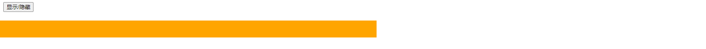
> 

## 3. 通过过渡实现动画效果

通过过渡实现动画效果一样需要使用 transition 标签将需要添加动画效果的元素进行包裹，vue会在合适的时机为元素加上动画效果。

```html
    <transition>
      <h1 v-show="isShow">hello world</h1>
    </transition>
```

通过过渡实现动画效果，需要提前写好过渡前的样式和过渡后的样式，过渡前后样式的类名需要满足vue的规定：

- 进入页面的起点：`.v-enter {}`
- 进入页面的终点：`v-enter-to {}`
- 离开页面的起点：`.v-leave {}`
- 离开页面的终点：`v-leave-to {}`

如果在 transition 标签中有指定 name 属性，则对应的样式类名中的`v`需要修改成对应的name。

```html
    <transition name="hello" appear>
      <h1 v-show="isShow">hello world</h1>
    </transition>
<style scoped>
h1 {
  background-color: orange;
  /* 指定动画的时间和方式 */
  transition: 0.5s linear;
}

/* 进入的起点 */
.hello-enter {
  transform: translate(-100%);
}

/* 进入的终点 */
.hello-enter-to {
  transform: translate(0);
}

/* 离开的起点 */
.hello-leave {
  transform: translate(0);
}

/* 离开的终点 */
.hello-leave-to {
  transform: translate(-100%);
}
</style>
```

由于离开的终点和进入的起点、离开的起点和进入的终点样式一样，所以可以进行合并：

```html
<style scoped>
h1 {
  background-color: orange;
  /* 指定动画的时间和方式 */
  transition: 0.5s linear;
}

/* 进入的起点 离开的终点 */
.hello-enter,
.hello-leave-to {
  transform: translate(-100%);
}

/* 进入的终点 离开的起点 */
.hello-enter-to,
.hello-leave {
  transform: translate(0);
}
</style>
```

动画执行的时间和方式可以写在`v-enter-active`和`v-leave-active`中，由于动画执行的时间和方式在进入页面和离开页面一样，可以进行合并。

动画执行的时间和方式可以写在`v-enter-active`和`v-leave-active`中，不会影响原来的css样式。

```html
<style scoped>
h1 {
  background-color: orange;
}

/* 进入的起点 离开的终点 */
.hello-enter,
.hello-leave-to {
  transform: translate(-100%);
}

/* 进入的终点 离开的起点 */
.hello-enter-to,
.hello-leave {
  transform: translate(0);
}

/* 动画被激活 */
.hello-enter-active,
.hello-leave-active {
  /* 指定动画的时间和方式 */
  transition: 0.5s linear;
}
</style>
```

Test.vue

```html
<template>
  <div>
    <button @click="changeShow">显示/隐藏</button>
    <transition name="hello" appear>
      <h1 v-show="isShow">hello world</h1>
    </transition>
  </div>
</template>

<script>
export default {
  name: 'Test',
  data() {
    return {
      // 控制显示与隐藏
      isShow: true,
    }
  },
  methods: {
    changeShow() {
      // 如果是隐藏状态
      if (!this.isShow) {
        // 更改为显示状态
        this.isShow = true
      } else {
        // 如果不为隐藏状态
        // 更改为隐藏状态
        this.isShow = false
      }
    }
  }
}
</script>

<style scoped>
h1 {
  background-color: orange;
}

/* 进入的起点 离开的终点 */
.hello-enter,
.hello-leave-to {
  transform: translate(-100%);
}

/* 进入的终点 离开的起点 */
.hello-enter-to,
.hello-leave {
  transform: translate(0);
}

/* 动画被激活 */
.hello-enter-active,
.hello-leave-active {
  /* 指定动画的时间和方式 */
  transition: 0.5s linear;
}
</style>
```

> 
> 
> 
> 
> 

## 4. 多个元素过渡

实现多个元素过渡，需要使用 transition-group 标签，transition 标签只能用于一个元素的过渡。

transition-group 标签的用法和 transition 标签的用法一样。

注意：如果使用 transition-group 标签实现多个元素的过渡，需要为每个元素指定 key 属性值(这里的 key 与 v-for 循环中的 key 一样)。

### 4.1 实现多个元素同时显示同时隐藏

Test.vue

```html
<template>
  <div>
    <button @click="changeShow">显示/隐藏</button>
    <transition-group name="hello" appear>
      <h1 v-show="isShow" key="1">hello world</h1>
      <h1 v-show="isShow" key="2">你好 世界</h1>
    </transition-group>
  </div>
</template>

<script>
export default {
  name: 'Test',
  data() {
    return {
      // 控制显示与隐藏
      isShow: true,
    }
  },
  methods: {
    changeShow() {
      // 如果是隐藏状态
      if (!this.isShow) {
        // 更改为显示状态
        this.isShow = true
      } else {
        // 如果不为隐藏状态
        // 更改为隐藏状态
        this.isShow = false
      }
    }
  }
}
</script>

<style scoped>
h1 {
  background-color: orange;
}

/* 进入的起点 离开的终点 */
.hello-enter,
.hello-leave-to {
  transform: translate(-100%);
}

/* 进入的终点 离开的起点 */
.hello-enter-to,
.hello-leave {
  transform: translate(0);
}

/* 动画被激活 */
.hello-enter-active,
.hello-leave-active {
  /* 指定动画的时间和方式 */
  transition: 0.5s linear;
}
</style>
```

> 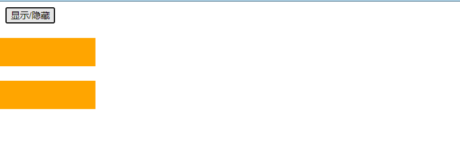
> 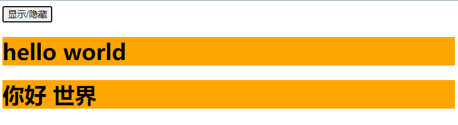
> 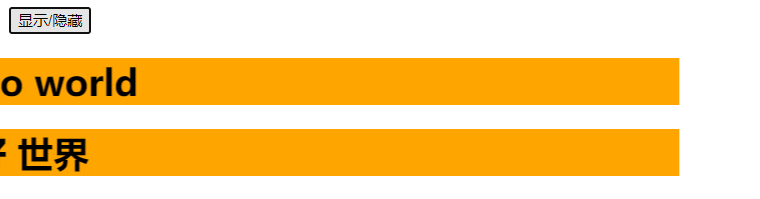
> 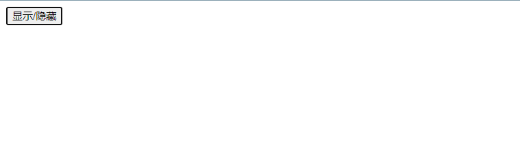

### 4.2 实现一个元素显示一个元素隐藏

```html
<template>
  <div>
    <button @click="changeShow">显示/隐藏</button>
    <transition-group name="hello" appear>
      <h1 v-show="isShow" key="1">hello world</h1>
      <h1 v-show="!isShow" key="2">你好 世界</h1>
    </transition-group>
  </div>
</template>

<script>
export default {
  name: 'Test',
  data() {
    return {
      // 控制显示与隐藏
      isShow: true,
    }
  },
  methods: {
    changeShow() {
      // 如果是隐藏状态
      if (!this.isShow) {
        // 更改为显示状态
        this.isShow = true
      } else {
        // 如果不为隐藏状态
        // 更改为隐藏状态
        this.isShow = false
      }
    }
  }
}
</script>

<style scoped>
h1 {
  background-color: orange;
}

/* 进入的起点 离开的终点 */
.hello-enter,
.hello-leave-to {
  transform: translate(-100%);
}

/* 进入的终点 离开的起点 */
.hello-enter-to,
.hello-leave {
  transform: translate(0);
}

/* 动画被激活 */
.hello-enter-active,
.hello-leave-active {
  /* 指定动画的时间和方式 */
  transition: 0.5s linear;
}
</style>
```

> 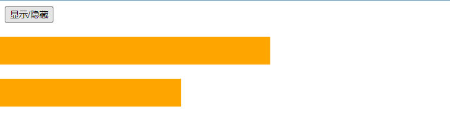
> 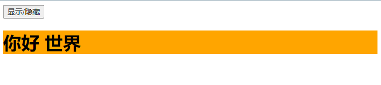
> 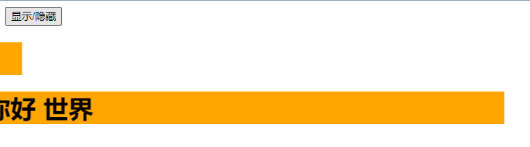
> 

## 5. 第三方动画库

> 这里演示 Animate.css
> [【npm 官网】](https://www.npmjs.com/)
> [【Animate.css 首页】](https://animate.style/)
> [【Animate.css 中文官网】](http://www.animate.net.cn/)

### 5.1 安装

```html
npm install animate.css --save
```

### 5.2 引入

```js
// 引入 Animate.css 库
import 'animate.css'
```

### 5.3 配置

在 transition 标签或者 transition-group 标签设置属性 name 的值为：`animate__animated animate__bounce`

```html
    <transition-group name="animate__animated animate__bounce" appear>
      <h1 v-show="isShow" key="1">hello world</h1>
      <h1 v-show="!isShow" key="2">你好 世界</h1>
    </transition-group>
```

### 5.4 设置进入页面和离开页面的动画

在 transition 标签或者 transition-group 标签设置设置进入页面和离开页面的动画，需要使用属性`enter-active-class`和`leave-active-class`

> 选择动画：
> 

### 5.5 实例效果

Test.vue

```html
<template>
  <div>
    <button @click="changeShow">显示/隐藏</button>
    <transition-group 
      name="animate__animated animate__bounce" 
      enter-active-class="animate__bounce"  //animate__bounce是从官网复制来的特效
      leave-active-class="animate__backOutUp"
      appear
    >
      <h1 v-show="isShow" key="1">hello world</h1>
      <h1 v-show="!isShow" key="2">你好 世界</h1>
    </transition-group>
  </div>
</template>

<script>
// 引入 Animate.css 库
import 'animate.css'

export default {
  name: 'Test',
  data() {
    return {
      // 控制显示与隐藏
      isShow: true,
    }
  },
  methods: {
    changeShow() {
      // 如果是隐藏状态
      if (!this.isShow) {
        // 更改为显示状态
        this.isShow = true
      } else {
        // 如果不为隐藏状态
        // 更改为隐藏状态
        this.isShow = false
      }
    }
  }
}
</script>

<style scoped>
h1 {
  background-color: orange;
}
</style>
```

> 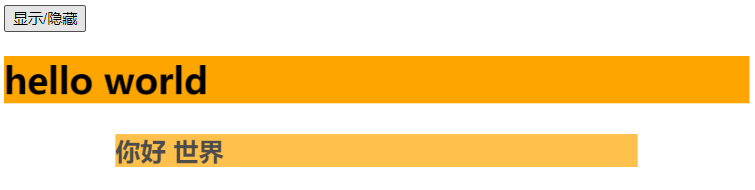

## 6. 动画与过渡 总结

1. 作用：在插入、更新或移除 DOM元素时，在合适的时候给元素添加样式类名。

2. 图示：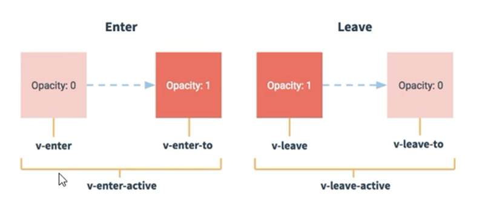

3. 写法：

   1. 准备好样式：

      - 元素进入的样式：
        1. v-enter：进入的起点
        2. v-enter-active：进入过程中
        3. v-enter-to：进入的终点
      - 元素离开的样式：
        1. v-leave：离开的起点
        2. v-leave-active：离开过程中
        3. v-leave-to：离开的终点

   2. 使用`<transition>`包裹要过度的元素，并配置name属性：

      ```html
      <transition name="hello">
      	<h1 v-show="isShow">你好啊！</h1>
      </transition>
      ```

   3. 备注：若有多个元素需要过度，则需要使用：`<transition-group>`，且每个元素都要指定`key`值。

# 34.配置代理

------

   ## 1. 使用 axios 发送请求

   ### 1.1 安装 axios

   ```html
npm i axios
   ```

   ### 1.2 引入 axios

   ```js
import axios from 'axios'
   ```

   ### 1.3 发送请求

   ```html
<template>
  <div>
    <button @click="getMsg">获取信息</button>
  </div>
</template>

<script>
import axios from 'axios'

export default {
  name: 'App',
  methods: {
    getMsg() {
      axios.get('https://blog.csdn.net/m0_53022813/article/details/127392473').then(
        response=>{
          console.log('请求成功了', response.data)
        },
        error=>{
          console.log('请求失败了',error)
        }
      )
    }
  },
}
</script>
   ```

   > 观察结果，发生了跨域请求
   > 

   > 跨域请求：
   > 当请求地址与发送请求程序的协议名(http ftp等)、主机名(或IP地址)、端口号中有一个不一致会提示跨域请求。
   > 跨域请求的解决办法：
   > 1、cors，在服务器进行响应头设置
   > 2、jsonp，利用script标签中src属性引入外部资源不受同源策略限制，只能解决get的跨域请求
   > 3、代理服务器，浏览器在请求数据时，不直接向服务器请求，而是向代理服务器请求，代理服务器向服务器发起请求获取数据，然后把数据返回给浏览器。其中代理服务器与浏览器在同一主机上，同时端口号也一致，浏览器与代理服务器不会发生跨域请求；代理服务器与服务器之间的通信不存在跨域问题。
   > 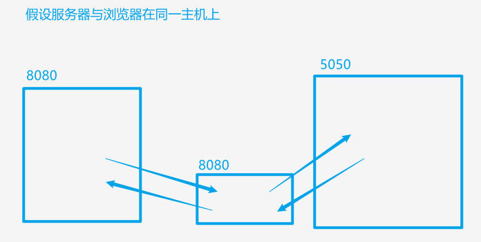

   > 这里使用代理服务器解决跨域问题

   ## 2. 借助vue-cli开启代理服务器

   通过 vue.config.js 修改脚手架配置开启代理服务器。

   > [vue-cli官网 开启代理服务器 配置参考](https://cli.vuejs.org/zh/config/#devserver-proxy)

   ### 2.1 方法一

   vue.config.js

   ```js
// 使用 @vue/cli-service 提供的 defineConfig 帮手函数，以获得更好的类型提示
// vue.config.js
const { defineConfig } = require('@vue/cli-service')

module.exports = defineConfig({
  // 选项
  pages: {
    index: {
      // page 的入口
      entry: 'src/my_main.js'
    }
  },
  // 关闭语法检查
  lintOnSave: false,
  // 开启代理服务器
  devServer: {
    // 设置代理服务器向服务器的请求地址，即向服务器发起请求
    // 只需要写到端口号
    proxy: 'https://blog.csdn.net'
  }
})
   ```

   > 修改 vue.config.js 配置文件，记得重启运行项目

   App.vue

   ```html
<template>
  <div>
    <button @click="getMsg">获取信息</button>
  </div>
</template>

<script>
import axios from 'axios'

export default {
  name: 'App',
  methods: {
    getMsg() {
      // 修改请求
      // 由原来的向服务器请求改为向代理服务器请求
      // 页面运行的地址 http://localhost:8080/
      // 所以代理服务器的地址也为 http://localhost:8080/
      // m0_53022813/article/details/127392473 资源路径不用修改
      axios.get('http://localhost:8080/m0_53022813/article/details/127392473').then(
        response=>{
          console.log('请求成功了', response.data)
        },
        error=>{
          console.log('请求失败了',error)
        }
      )
    }
  },
}
</script>
   ```

   > 请求成功，解决跨域问题
   > 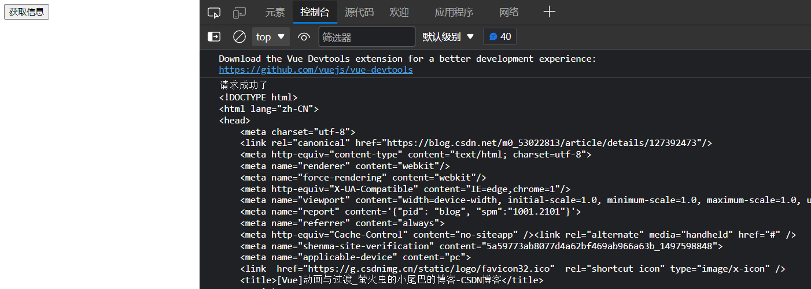

   方式一有两个缺点：
   1、当请求的资源本地就有，也就是项目对应的 public 中有相同名字的文件，代理服务器不会请求服务器，而是将本地的资源直接返回。
   2、只能配置一个代理服务器。
   3、不能灵活的控制请求是否走代理。

   ### 2.2 方法二

   vue.config.js

   ```js
// 使用 @vue/cli-service 提供的 defineConfig 帮手函数，以获得更好的类型提示
// vue.config.js
const { defineConfig } = require('@vue/cli-service')

module.exports = defineConfig({
  // 选项
  pages: {
    index: {
      // page 的入口
      entry: 'src/my_main.js'
    }
  },
  // 关闭语法检查
  lintOnSave: false,
  // 开启代理服务器
  // devServer: {
  //   // 设置代理服务器向服务器的请求地址，即向服务器发起请求
  //   // 只需要写到端口号
  //   proxy: 'https://blog.csdn.net'
  // },
  // 开启代理服务器 方法二
  devServer: {
    proxy: {
      // /api为请求前缀，可以改成其他名字
      // 只要请求资源路径的前缀为 /api 就通过代理服务器发送请求
      // 否则不通过代理服务器发送请求
      '/api': {
        // 设置代理服务器向服务器的请求地址，即向服务器发起请求
        target: 'https://blog.csdn.net',
        // 为路径重写，匹配api开头的字符串，并把api替换为空字符串，
        // 这样才能保证代理服务器转发给服务器的资源路径不带前边的前缀
        pathRewrite:{'^/api':''},
        // 用于支持websocket
        ws: true,
        // changeOrigin设置为true时，服务器收到的请求头中的host会与服务器一样
        //  changeOrigin设置为false时，服务器收到的请求头中的host为真实的请求来源地址
        //  changeOrigin默认值为true
        changeOrigin: true
      }
    }
  }
})
   ```

   > 修改 vue.config.js 配置文件，记得重启运行项目

   App.vue

   ```html
<template>
  <div>
    <button @click="getMsg">获取信息</button>
  </div>
</template>

<script>
import axios from 'axios'

export default {
  name: 'App',
  methods: {
    getMsg() {
      // 修改请求
      // 由原来的向服务器请求改为向代理服务器请求
      // 页面运行的地址 http://localhost:8080/
      // 所以代理服务器的地址也为 http://localhost:8080/
      // m0_53022813/article/details/127392473 资源路径需要添加对应的前缀
      axios.get('http://localhost:8080/api/m0_53022813/article/details/127392473').then(
        response=>{
          console.log('请求成功了', response.data)
        },
        error=>{
          console.log('请求失败了',error)
        }
      )
    }
  },
}
</script>
   ```

   > 请求成功
   > 

   ## 3. vue脚手架配置代理 总结

   ### 3.1 方法一

    在vue.config.js中添加如下配置：

   ```js
devServer:{
  proxy:"http://localhost:5000"
}
   ```

   说明：

      1. 优点：配置简单，请求资源时直接发给前端（8080）即可。
      2. 缺点：不能配置多个代理，不能灵活的控制请求是否走代理。
      3. 工作方式：若按照上述配置代理，当请求了前端不存在的资源时，那么该请求会转发给服务器 （优先匹配前端资源）

   ### 3.2 方法二

    编写vue.config.js配置具体代理规则：

   ```js
module.exports = {
	devServer: {
      proxy: {
      '/api1': {// 匹配所有以 '/api1'开头的请求路径
        target: 'http://localhost:5000',// 代理目标的基础路径
        changeOrigin: true,
        pathRewrite: {'^/api1': ''}
      },
      '/api2': {// 匹配所有以 '/api2'开头的请求路径
        target: 'http://localhost:5001',// 代理目标的基础路径
        changeOrigin: true,
        pathRewrite: {'^/api2': ''}
      }
    }
  }
}
/*
   changeOrigin设置为true时，服务器收到的请求头中的host为：localhost:5000
   changeOrigin设置为false时，服务器收到的请求头中的host为：localhost:8080
   changeOrigin默认值为true
*/
   ```

   说明：

      1. 优点：可以配置多个代理，且可以灵活的控制请求是否走代理。
      2. 缺点：配置略微繁琐，请求资源时必须加前缀。

   
