# 35.github案例

## 1. 案例效果


## 2. 静态页面

```
<!DOCTYPE html>
<html lang="en">
<head>
  <meta charset="UTF-8">
  <title>Title</title>
  <link rel="stylesheet" href="./bootstrap.css">
  <link rel="stylesheet" href="./index.css">
</head>
<body>
<div id="app">
  <div class="container">
    <section class="jumbotron">
      <h3 class="jumbotron-heading">Search Github Users</h3>
      <div>
        <input type="text" placeholder="enter the name you search"/>&nbsp;<button>Search</button>
      </div>
    </section>
    <div class="row">
      <div class="card">
        <a href="https://github.com/xxxxxx" target="_blank">
          
        </a>
        <p class="card-text">xxxxxx</p>
      </div>
      <div class="card">
        <a href="https://github.com/xxxxxx" target="_blank">
          
        </a>
        <p class="card-text">xxxxxx</p>
      </div>
      <div class="card">
        <a href="https://github.com/xxxxxx" target="_blank">
          
        </a>
        <p class="card-text">xxxxxx</p>
      </div>
      <div class="card">
        <a href="https://github.com/xxxxxx" target="_blank">
          
        </a>
        <p class="card-text">xxxxxx</p>
      </div>
      <div class="card">
        <a href="https://github.com/xxxxxx" target="_blank">
          
        </a>
        <p class="card-text">xxxxxx</p>
      </div>
    </div>
  </div>
</div>
</body>
</html>
.album {
  min-height: 50rem; /* Can be removed; just added for demo purposes */
  padding-top: 3rem;
  padding-bottom: 3rem;
  background-color: #f7f7f7;
}

.card {
  float: left;
  width: 33.333%;
  padding: .75rem;
  margin-bottom: 2rem;
  border: 1px solid #efefef;
  text-align: center;
}

.card > img {
  margin-bottom: .75rem;
  border-radius: 100px;
}

.card-text {
  font-size: 85%;
}
```

## 3. 组件的拆分

### 3.1 目录结构

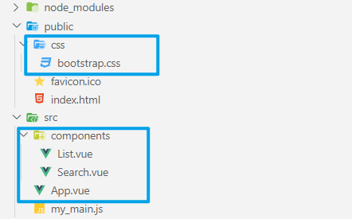

### 3.2 引入第三方css样式

在index.html中使用link标签引入第三方css样式

> 由于import导入第三方样式，会对引入的样式进行代码检查，而在代码中使用了本地没有的字体样式，会报错；使用link标签引入第三方样式不会进行严格的代码检查，不会报错。

index.html

```html
<!DOCTYPE html>
<html lang="">
  <head>
    <meta charset="utf-8">
    <!-- 针对ie浏览器的一个特殊配置，让ie浏览器以最高的渲染级别渲染页面 -->
    <meta http-equiv="X-UA-Compatible" content="IE=edge">
    <!-- 开启移动端的理想视口 -->
    <meta name="viewport" content="width=device-width,initial-scale=1.0">
    <!-- 配置页签图标  <%= BASE_URL %> 表示public文件夹所在的路径，防止项目部署后出现路径的错误-->
    <!-- 所以在该html文件中路径不使用 ./ ../ -->
    <link rel="icon" href="<%= BASE_URL %>favicon.ico">
    <!-- 引入第三方css样式 bootstrap -->
    <link rel="stylesheet" href="<%= BASE_URL %>css/bootstrap.css">
    <!-- 网页的标题 -->
    <title><%= htmlWebpackPlugin.options.title %></title>
  </head>
  <body>
    <!-- 浏览器不支持js，页面会显示noscript标签中的内容；支持js则不渲染noscript标签中的内容 -->
    <noscript>
      <strong>We're sorry but <%= htmlWebpackPlugin.options.title %> doesn't work properly without JavaScript enabled. Please enable it to continue.</strong>
    </noscript>
    <!-- 提供的容器 -->
    <div id="app"></div>
    <!-- built files will be auto injected -->
  </body>
</html>
```

### 3.3 拆分组件

App.vue

```html
<template>
  <div class="container">
    <!-- 使用子组件 -->
    <Search></Search>
    <List></List>
  </div>
</template>

<script>
// 导入子组件
import Search from './components/Search.vue'
import List from './components/List.vue'

export default {
  name: 'App',
  // 注册子组件
  components: {
    Search,
    List
  }
}
</script>
```

Search.vue

```html
<template>
  <section class="jumbotron">
    <h3 class="jumbotron-heading">Search Github Users</h3>
    <div>
      <input type="text" placeholder="enter the name you search" />&nbsp;<button>Search</button>
    </div>
  </section>
</template>

<script>
export default {
  name: 'Search'
}
</script>
```

List.vue

```html
<template>
  <div class="row">
    <div class="card">
      <a href="https://github.com/xxxxxx" target="_blank">
        
      </a>
      <p class="card-text">xxxxxx</p>
    </div>
    <div class="card">
      <a href="https://github.com/xxxxxx" target="_blank">
        
      </a>
      <p class="card-text">xxxxxx</p>
    </div>
    <div class="card">
      <a href="https://github.com/xxxxxx" target="_blank">
        
      </a>
      <p class="card-text">xxxxxx</p>
    </div>
    <div class="card">
      <a href="https://github.com/xxxxxx" target="_blank">
        
      </a>
      <p class="card-text">xxxxxx</p>
    </div>
    <div class="card">
      <a href="https://github.com/xxxxxx" target="_blank">
        
      </a>
      <p class="card-text">xxxxxx</p>
    </div>
  </div>
</template>

<script>
export default {
  name: 'List'
}
</script>

<style scoped>
.album {
  min-height: 50rem; /* Can be removed; just added for demo purposes */
  padding-top: 3rem;
  padding-bottom: 3rem;
  background-color: #f7f7f7;
}

.card {
  float: left;
  width: 33.333%;
  padding: 0.75rem;
  margin-bottom: 2rem;
  border: 1px solid #efefef;
  text-align: center;
}

.card > img {
  margin-bottom: 0.75rem;
  border-radius: 100px;
}

.card-text {
  font-size: 85%;
}
</style>
```

> 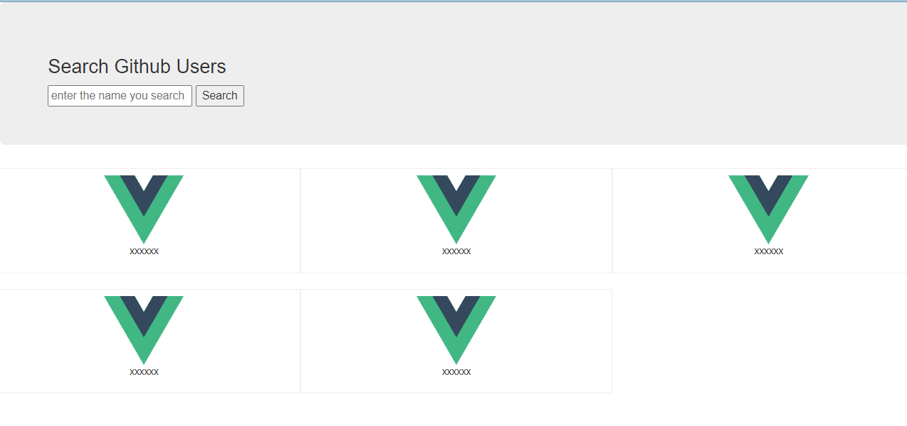

## 4. 列表展示实现

### 4.1 查询请求数据

> 请求接口地址：
>
> ```
> https://api.github.com/search/users?q=xxx
> ```

Search.vue

```html
<template>
  <section class="jumbotron">
    <h3 class="jumbotron-heading">Search Github Users</h3>
    <div>
      <input 
        type="text" 
        placeholder="enter the name you search" 
        v-model="keyWord"
      />
      &nbsp;
      <button @click="searchUsers">Search</button>
    </div>
  </section>
</template>

<script>
// 导入axios
import axios from 'axios'

export default {
  name: 'Search',
  data() {
    return {
      keyWord: ''
    }
  },
  methods: {
    searchUsers() {
      axios.get(`https://api.github.com/search/users?q=${this.keyWord}`).then(
        response=>{
          console.log('请求成功', response.data)
        },
        error=>{
          console.log('请求失败', error)
        }
      )
    }
  },
}
</script>
```

> 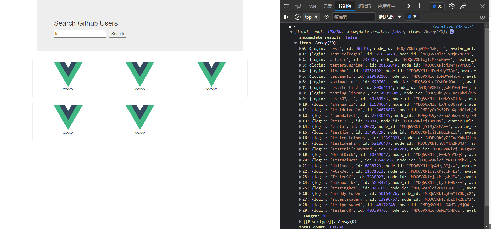

### 4.2 数据传递

子组件Search与List为兄弟组件，这里使用全局事件总线进行数据的传递。

#### 4.2.1 安装全局事件总线

main.js

```js
import Vue from 'vue'
import App from './App.vue'

//关闭vue的生产提示
Vue.config.productionTip = false

new Vue({
  render: h => h(App),
  beforeCreate() {
    // 让vue的实例对象作为全局事件总线
    Vue.prototype.$bus = this
  }
}).$mount('#app')
```

#### 4.2.2 全局事件总线绑定自定义事件

List.vue

```html
<script>
export default {
  name: 'List',
  data() {
    return {
      users: []
    }
  },
  mounted() {
    this.$bus.$on('getUsers', (users)=>{
      console.log('List组件收到了数据')
      this.users = users
    })
  }
}
</script>
```

#### 4.2.3 触发全局事件总线事件

Search.vue

```html
<template>
  <section class="jumbotron">
    <h3 class="jumbotron-heading">Search Github Users</h3>
    <div>
      <input 
        type="text" 
        placeholder="enter the name you search" 
        v-model="keyWord"
      />
      &nbsp;
      <button @click="searchUsers">Search</button>
    </div>
  </section>
</template>

<script>
// 导入axios
import axios from 'axios'

export default {
  name: 'Search',
  data() {
    return {
      keyWord: ''
    }
  },
  methods: {
    searchUsers() {
      // 发起请求获取用户数据
      axios.get(`https://api.github.com/search/users?q=${this.keyWord}`).then(
        response=>{
          console.log('请求成功')
          // 触发全局事件总线事件  传递数据
          this.$bus.$emit('getUsers', response.data.items)
        },
        error=>{
          console.log('请求失败', error)
        }
      )
    }
  },
}
</script>
```

> 

### 4.3 列表数据展示

#### 4.3.1 需要使用的数据


#### 4.3.2 数据展示

List.vue

```html
<template>
  <div class="row">
    <div class="card" v-for="user in users" :key="user.id">
      <a :href="user.html_url" target="_blank">
        
      </a>
      <p class="card-text">{{user.login}}</p>
    </div>
  </div>
</template>

<script>
export default {
  name: 'List',
  data() {
    return {
      users: []
    }
  },
  mounted() {
    // 全局事件总线绑定事件
    this.$bus.$on('getUsers', (users)=>{
      console.log('List组件收到了数据')
      this.users = users
    })
  }
}
</script>
```

> 

## 5. 完善案例

实现初始页面的欢迎词展示、数据请求过程中的加载提示、请求失败的错误信息显示。

List.vue

```html
<template>
  <div class="row">
    <!-- 用户列表 -->
    <div 
      class="card"
      v-show="info.users" 
      v-for="user in info.users" 
      :key="user.id">
      <a :href="user.html_url" target="_blank">
        
      </a>
      <p class="card-text">{{user.login}}</p>
    </div>
    <!-- 第一次加载 欢迎词 -->
    <h1 v-show="info.isFirst">welcome to use</h1>
    <!-- 加载中 -->
    <h1 v-show="info.isLoading">loading...</h1>
    <!-- 错误信息 -->
    <h1 v-show="info.errorMsg">{{info.errorMsg}}</h1>
  </div>
</template>

<script>
export default {
  name: 'List',
  data() {
    return {
      info: {
        // 是否第一次加载页面
        isFirst: true,
        // 是否加载数据
        isLoading: false,
        // 错误信息
        errorMsg: '',
        // 用户信息
        users: []
      }
    }
  },
  mounted() {
    // 全局事件总线绑定事件
    // this.$bus.$on('getUsers', (dataObj)=>{
    this.$bus.$on('updateUsers', (dataObj)=>{
      console.log('List组件收到了数据')
      // this.users = users
      // dataObj中有的属性会覆盖this.info中相同的属性
      // 没有则this.info保持原值
      this.info = {...this.info, ...dataObj}
    })
  }
}
</script>
```

Search.vue

```html
<template>
  <section class="jumbotron">
    <h3 class="jumbotron-heading">Search Github Users</h3>
    <div>
      <input type="text" placeholder="enter the name you search" v-model="keyWord" />
      &nbsp;
      <button @click="searchUsers">Search</button>
    </div>
  </section>
</template>

<script>
// 导入axios
import axios from 'axios'

export default {
  name: 'Search',
  data() {
    return {
      keyWord: ''
    }
  },
  methods: {
    searchUsers() {
      // 请求开始前初始化数据
      this.$bus.$emit('updateUsers', {
        // 进行请求了，取消欢迎词
        isFirst: false,
        // 请求开始，进入加载状态
        isLoading: true,
        // 无报错信息
        errorMsg: '',
        // 请求开始前，用户数据为空
        users: []
      })
      // 发起请求获取用户数据
      axios.get(`https://api.github.com/search/users?q=${this.keyWord}`).then(
        response => {
          console.log('请求成功')
          // 触发全局事件总线事件  传递数据
          // this.$bus.$emit('updateUsers', response.data.items)
          // 请求成功传递数据
          this.$bus.$emit('updateUsers', {
            // 原先是否第一次加载页面状态已经修改不用再次传递修改
            // 请求结束
            isLoading: false,
            // 无报错信息
            errorMsg: '',
            // 用户数据
            users: response.data.items
          })
        },
        error => {
          console.log('请求失败', error)
          // 请求失败传递数据
          this.$bus.$emit('updateUsers', {
            // 原先是否第一次加载页面状态已经修改不用再次传递修改
            // 请求结束
            isLoading: false,
            // 报错信息
            errorMsg: error,
            // 请求失败用户数据为空
            users: []
          })
        }
      )
    }
  }
}
</script>
```

>    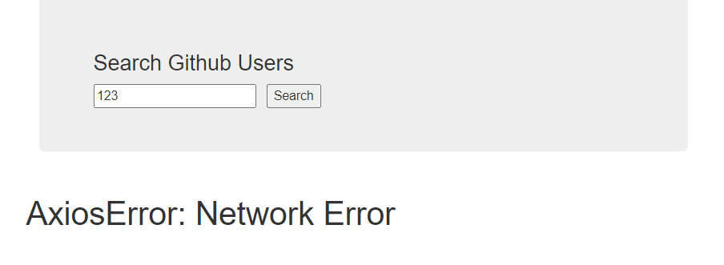

# 36.vue-resource(不常用)

## 1. vue-resource

> vue 发送请求推荐使用 axios ，vue-resource 的更新频率不高，且 vue 也推荐 axios。

vue-resource 是 vue 中一个用于发送请求的插件。

### 1.1 安装 vue-resource

```html
npm i vue-resource
```

### 1.2 导入 vue-resource

> vue-resource 中使用的是默认导出，导入 vue-resource 使用一个变量接收即可。

```js
import vueResource from 'vue-resource'
```

### 1.3 使用插件 vue-resource

```js
Vue.use(vueResource)
```

> 使用 Vue 的 use() 方法使用插件，在所有的 vue 实例对象和组件实例对象中会多一个 $http 属性。 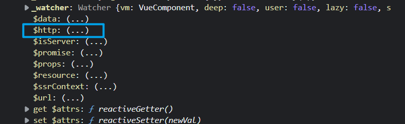

### 1.4 使用 vue-resource 发送请求

> vue-resource 与 axios 一样都是 promise 风格的，vue-resource 发送请求的方法与形式和 axios 一样。

以发送 get 请求为例：

- axios：

  ```js
  	  // 发起请求获取用户数据
        axios.get(`请求地址`).then(
          response => {
            console.log('请求成功')
            // 请求成功的处理
          },
          error => {
            console.log('请求失败', error)
            // 请求失败的处理          
          }
        )
  ```

- vue-resource：

  ```js
  	  // 发起请求获取用户数据
        this.$http.get(`请求地址`).then(
          response => {
            console.log('请求成功')
            // 请求成功的处理
          },
          error => {
            console.log('请求失败', error)
            // 请求失败的处理          
          }
        )
  ```

## 2. github 案例 vue-resource 发送请求

main.js

```js
import Vue from 'vue'
import App from './App.vue'
// 导入 vue-resource
import vueResource from 'vue-resource'

// 使用插件 vue-resource
Vue.use(vueResource)
//关闭vue的生产提示
Vue.config.productionTip = false

new Vue({
  render: h => h(App),
  beforeCreate() {
    // 让vue的实例对象作为全局事件总线
    Vue.prototype.$bus = this
  }
}).$mount('#app')
```

Search.vue

```html
<template>
  <section class="jumbotron">
    <h3 class="jumbotron-heading">Search Github Users</h3>
    <div>
      <input type="text" placeholder="enter the name you search" v-model="keyWord" />
      &nbsp;
      <button @click="searchUsers">Search</button>
    </div>
  </section>
</template>

<script>
// 导入axios
import axios from 'axios'

export default {
  name: 'Search',
  data() {
    return {
      keyWord: ''
    }
  },
  methods: {
    searchUsers() {
      // 请求开始前初始化数据
      this.$bus.$emit('updateUsers', {
        // 进行请求了，取消欢迎词
        isFirst: false,
        // 请求开始，进入加载状态
        isLoading: true,
        // 无报错信息
        errorMsg: '',
        // 请求开始前，用户数据为空
        users: []
      })
      // 发起请求获取用户数据
      this.$http.get(`https://api.github.com/search/users?q=${this.keyWord}`).then(
        response => {
          console.log('请求成功')
          // 触发全局事件总线事件  传递数据
          // this.$bus.$emit('updateUsers', response.data.items)
          // 请求成功传递数据
          this.$bus.$emit('updateUsers', {
            // 原先是否第一次加载页面状态已经修改不用再次传递修改
            // 请求结束
            isLoading: false,
            // 无报错信息
            errorMsg: '',
            // 用户数据
            users: response.data.items
          })
        },
        error => {
          console.log('请求失败', error)
          // 请求失败传递数据
          this.$bus.$emit('updateUsers', {
            // 原先是否第一次加载页面状态已经修改不用再次传递修改
            // 请求结束
            isLoading: false,
            // 报错信息
            errorMsg: error,
            // 请求失败用户数据为空
            users: []
          })
        }
      )
    }
  }
}
</script>
```

> 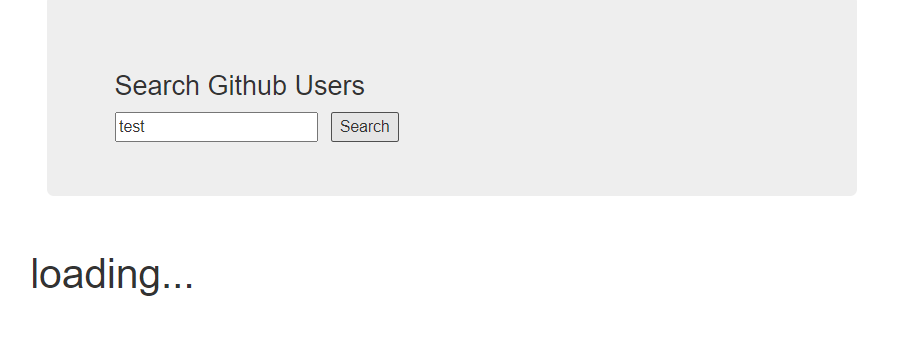 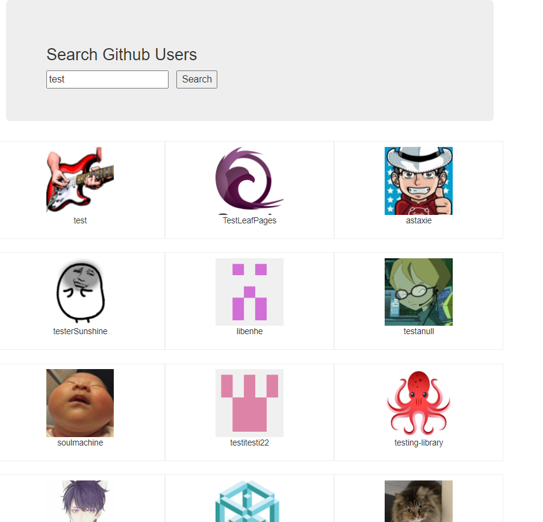

# 37.插槽

## 1. 插槽

插槽（Slot）是 vue 为组件的封装者提供的功能，允许开发者在封装组件时，把不确定的、希望由用户指定的部分定义为插槽。

可以把插槽认为是组件封装期间，为用户预留的内容的占位符，在组件的使用者使用该组件时可以为插槽指定填充的内容。


## 2. 默认插槽

### 2.1 插槽的基本使用

在封装组件时，可以通过`<slot>`元素定义插槽，从而为用户预留内容占位符。

Com.vue

```html
<template>
  <div>
    <h3>Com 组件</h3>
    <p>插槽开始</p>
    
    <!-- 为组件的使用者预留的区域 -->
    <slot></slot>
    
    <p>插槽结束</p>
  </div>
</template>

<script>
export default {
  name: 'Com'
}
</script>
```

App.vue

```html
<template>
  <div>
    <h1>App 组件</h1>
    <hr>
    
    <!-- 使用子组件 -->
    <Com>
      <!-- 指定需要向子组件的插槽区域放入的元素 -->
      <!-- 需要放入插槽的元素写在组件标签内 -->
      <div>插槽的内容</div>
    </Com>
    
  </div>
</template>

<script>
import Com from './Com.vue'

export default {
  name: 'App',
  components: {
    Com
  }
}
</script>
```

> 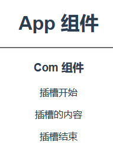

### 2.2 没有预留插槽 组件标签内的内容会被丢弃

如果在封装组件时没有预留任何 `<slot>` 插槽，则用户提供的任何自定义内容都会被丢弃。即用户提供的页面元素没有位置放入。

Com.vue

```html
<template>
  <div>
    <h3>Com 组件</h3>
    <p>插槽开始</p>
    
    <!-- 为组件的使用者预留的区域 -->
    <!-- <slot></slot> -->
    
    <p>插槽结束</p>
  </div>
</template>

<script>
export default {
  name: 'Com'
}
</script>
```

App.vue

```html
<template>
  <div>
    <h1>App 组件</h1>
    <hr>
    
    <!-- 使用子组件 -->
    <Com>
      <!-- 指定需要向子组件的插槽区域放入的元素 -->
      <!-- 需要放入插槽的元素写在组件标签内 -->
      <div>插槽的内容</div>
    </Com>
    
  </div>
</template>

<script>
import Com from './Com.vue'

export default {
  name: 'App',
  components: {
    Com
  }
}
</script>
```

> 

### 2.3 后备内容

封装组件时，可以为预留的 `<slot>` 插槽提供后备内容（默认内容）。如果组件的使用者没有为插槽提供任何内容，则后备内容会生效，后备内容会展示在页面上。

Com.vue

```html
<template>
  <div>
    <h3>Com 组件</h3>
    <p>插槽开始</p>
    
    <!-- 为组件的使用者预留的区域 -->
    <slot>
      <div>插槽的后备内容</div>
    </slot>
    
    <p>插槽结束</p>
  </div>
</template>

<script>
export default {
  name: 'Com'
}
</script>

<style>

</style>
```

App.vue

```html
<template>
  <div>
    <h1>App 组件</h1>
    <hr>
    
     <!-- 使用子组件 -->
    <Com>
      <!-- 指定需要向子组件的插槽区域放入的元素 -->
      <!-- 需要放入插槽的元素写在组件标签内 -->
      <!-- <div>插槽的内容</div> -->
    </Com>
    
  </div>
</template>

<script>
import Com from './Com.vue'

export default {
  name: 'App',
  components: {
    Com
  }
}
</script>
```

> 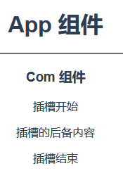

## 3. 具名插槽

如果在封装组件时需要预留多个插槽节点，则需要为每个 `<slot>`插槽指定具体的 name 名称。

这种带有具体名称的插槽叫做“具名插槽”。

注意：没有指定 name 名称的插槽，会有隐含的名称叫做 “default”。

### 3.1 具名插槽的定义

Com.vue

```html
<template>
  <div>
    <h3>Com 组件</h3>
    <p>----------插槽开始----------</p>
    
    <!-- 为组件的使用者预留的区域 -->
    <slot name="header"></slot>
    <!-- 没有指定 name，该插槽的 name 值默认为 default -->
    <slot></slot>
    <!-- <slot name="default"></slot> -->
    <slot name="bottom"></slot>
    
    <p>----------插槽结束----------</p>
  </div>
</template>

<script>
export default {
  name: 'Com'
}
</script>
```

### 3.2 为具名插槽提供内容

在向具名插槽提供内容的时候，我们可以在一个 `<template>` 元素上使用 v-slot 指令，并以 v-slot 的参数的形式指定元素需要放在哪个插槽中。

语法：

**最新版本写法**

```html
<template v-slot:插槽的name>
	需要向插槽中放入的内容
</template>
```

**一般写法**

```html
<template slot="插槽的name">
	需要向插槽中放入的内容
</template>
或者
<div slot="插槽的name">
	需要向插槽中放入的内容
</div>
```


> 注意：使用 v-slot 指令指定元素放在哪个插槽中，必须配合`<template>` 元素，且一个`<template>` 元素只能对应一个预留的插槽，即不能多个`<template>` 元素都使用 v-slot 指令指定相同的插槽。

> 在 2.6.0 中，我们为具名插槽和作用域插槽引入了一个新的统一的语法 (即 v-slot 指令)。它取代了 slot 和 slot-scope 这两个目前已被废弃但未被移除且仍在文档中的 attribute。

> 使用 slot 属性指定元素放置的插槽：`slot="插槽的name"`，slot 属性可以直接写在元素标签上，即 slot 属性不用必须与`<template>` 元素配合，且不同的标签可以使用 slot 属性指定相同的插槽，使用 slot 属性指定了相同的插槽都会被放入一个插槽中，后面的元素会被追加在前面放入插槽的元素后。

App.vue

```html
<template>
  <div>
    <h1>App 组件</h1>
    <hr>
    
    <Com>
      <!-- 指定需要向子组件的插槽区域放入的元素 -->
      <!-- 需要放入插槽的元素写在组件标签内 -->
      <!-- <div>插槽的内容</div> -->
      <template v-slot:header>
        <div>头部区域</div>
      </template>
      <template v-slot:default>
        <div>默认区域</div>
      </template>
      <template v-slot:bottom>
        <div>bottom区域</div>
      </template>
    </Com>
    
  </div>
</template>

<script>
import Com from './Com.vue'

export default {
  name: 'App',
  components: {
    Com
  }
}
</script>
```

> 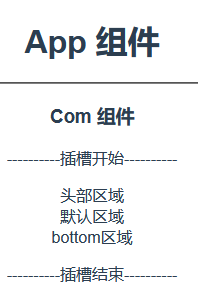

### 3.2 具名插槽的简写形式

跟 v-on 和 v-bind 一样，v-slot 也有缩写，即把参数之前的所有内容 (`v-slot:`) 替换为字符 `#`。例如 `v-slot:header`可以被重写为 `#header`

```html
<template>
  <div>
    <h1>App 组件</h1>
    <hr>
    <Com>
      <!-- 指定需要向子组件的插槽区域放入的元素 -->
      <!-- 需要放入插槽的元素写在组件标签内 -->
      <!-- <div>插槽的内容</div> -->
      <!-- <template v-slot:header> -->
      <template #header>
        <div>头部区域</div>
      </template>
      <!-- <template v-slot:default> -->
      <template #default>
        <div>默认区域</div>
      </template>
      <!-- <template v-slot:bottom> -->
      <template #bottom>
        <div>bottom区域</div>
      </template>
    </Com>
  </div>
</template>

<script>
import Com from './Com.vue'

export default {
  name: 'App',
  components: {
    Com
  }
}
</script>
```

> 

## 4. 作用域插槽

### 4.1 作用域插槽的使用

在封装组件的过程中，可以为预留的`<slot>`插槽绑定 props 数据，这种带有 props 数据的`<slot>`叫做“作用域插槽”。

作用域插槽，要显示的数据已经在组件中，以什么样的样式显示数据(用什么标签和标签的样式)，可以由组件的使用者进行指定。

> 为作用域插槽指定插槽内的元素必须使用 `<template>` 标签。

> 作用域插槽也能取名

Com.vue

```html
<template>
  <div>
    <h3>Com 组件</h3>
    <p>----------插槽开始----------</p>
    
    <!-- 为组件的使用者预留的区域 -->
    <!-- :infomation="info" 未来要进行渲染在插槽位置的数据 -->
    <!-- 怎么样渲染数据由组件的使用者决定 -->
    <slot :infomation="info"></slot>
    
    <p>----------插槽结束----------</p>
  </div>
</template>

<script>
export default {
  name: 'Com',
  data() {
    return {
      info: {
        name: 'zs',
        age: 23
      },
      msg: 'hello vue'
    }
  }
}
</script>
```

> 获取插槽绑定 props 数据的方法： 1.`scope="接收的变量名"`：`<template scope="接收的变量名">` 2.`slot-scope="接收的变量名"`：`<template slot-scope="接收的变量名">` 3.`v-slot:插槽名="接收的变量名"`：`<template v-slot:插槽名="接收的变量名">`

App.vue

```html
<template>
  <div>
    <h1>App 组件</h1>
    <hr>
    <Com>
      <!-- 指定需要向子组件的插槽区域放入的元素 -->
      <!-- 需要放入插槽的元素写在组件标签内 -->
      <!-- val 接收组件中要在插槽位置渲染的数据 -->
      <!-- val 组件通过 props 向插槽中传入的数据 -->
      <template #default="val">
        {{ val }}
      </template>
    </Com>
  </div>
</template>

<script>
import Com from './Com.vue'

export default {
  name: 'App',
  components: {
    Com
  }
}
</script>
```

> 得到的是一个对象 

### 4.2 解构作用域插槽的 prop

作用域插槽对外提供的数据对象，可以使用解构赋值简化数据的接收过程。

```html
<template>
  <div>
    <h3>Com 组件</h3>
    <p>----------插槽开始----------</p>
    <!-- 为组件的使用者预留的区域 -->
    <!-- :infomation="info" 未来要进行渲染在插槽位置的数据 -->
    <slot :infomation="info" :message="msg"></slot>
    <p>----------插槽结束----------</p>
  </div>
</template>

<script>
export default {
  name: 'Com',
  data() {
    return {
      info: {
        name: 'zs',
        age: 23
      },
      msg: 'hello vue'
    }
  }
}
</script>

<style>

</style>
```

> 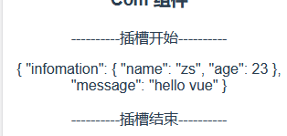

把information的数据解构出来

```html
<template>
  <div>
    <h1>App 组件</h1>
    <hr>
    <Com>
      <!-- 向子组件的插槽区域放入元素，写在组件标签内 -->
      <!-- val 接收组件中要在插槽位置渲染的数据 -->
      <template #default="{ infomation }">
        <div>{{ infomation.name }}</div>
        <div>{{ infomation.age }}</div>
      </template>
    </Com>
  </div>
</template>

<script>
import Com from './Com.vue'

export default {
  name: 'App',
  components: {
    Com
  }
}
</script>
```

### 4.3 声明作用域插槽

在封装 Com 组件的过程中，可以通过作用域插槽把表格每一行的数据传递给组件的使用者。

```html
<template>
  <div>
    <h3>Com 组件</h3>
    <tbody>
      <tr v-for="item in arr" :key="item.id">
        <!-- 作用域插槽 -->
        <slot :arr_i="item"></slot>
      </tr>
    </tbody>
  </div>
</template>

<script>
export default {
  name: 'Com',
  data() {
    return {
      arr: [
        {id: 1, data: 'a'},
        {id: 2, data: 'b'},
        {id: 3, data: 'c'},
        {id: 4, data: 'd'},
        {id: 5, data: 'e'},
      ]
    }
  }
}
</script>

<style>

</style>
```

### 4.4 使用作用域插槽

在使用 Com 组件时，自定义单元格的渲染方式，并接收作用域插槽对外提供的数据。

```html
<template>
  <div>
    <h1>App 组件</h1>
    <hr>
    <Com>
      <!-- 向子组件的插槽区域放入元素，写在组件标签内 -->
      <!-- 接收组件中要在插槽位置渲染的数据 -->
      <template #default="{arr_i}">
        <!-- 使用作用域插槽的数据 -->
        <td>{{ arr_i.id }}</td>
        <td>{{ arr_i.data }}</td>
      </template>
    </Com>
  </div>
</template>

<script>
import Com from './Com.vue'

export default {
  name: 'App',
  components: {
    Com
  }
}
</script>
```


## 5. 插槽 总结

1. 作用：让父组件可以向子组件指定位置插入html结构，也是一种组件间通信的方式，适用于 **父组件 ===> 子组件** 。

2. 分类：默认插槽、具名插槽、作用域插槽

3. 使用方式：

   1. 默认插槽：

      ```html
      父组件中：
              <Category>
                 <div>html结构1</div>
              </Category>
      子组件中：
              <template>
                  <div>
                     <!-- 定义插槽 -->
                     <slot>插槽默认内容...</slot>
                  </div>
              </template>
      ```

   2. 具名插槽：

      ```html
      父组件中：
              <Category>
                  <template slot="center">
                    <div>html结构1</div>
                  </template>
      
                  <template v-slot:footer>
                     <div>html结构2</div>
                  </template>
              </Category>
      子组件中：
              <template>
                  <div>
                     <!-- 定义插槽 -->
                     <slot name="center">插槽默认内容...</slot>
                     <slot name="footer">插槽默认内容...</slot>
                  </div>
              </template>
      ```

   3. 作用域插槽：

      1. 理解：数据在组件的自身，但根据数据生成的结构需要组件的使用者来决定。（games数据在Category组件中，但使用数据所遍历出来的结构由App组件决定）

      2. 具体编码：

         ```html
         父组件中：
         		<Category>
         			<template scope="scopeData">
         				<!-- 生成的是ul列表 -->
         				<ul>
         					<li v-for="g in scopeData.games" :key="g">{{g}}</li>
         				</ul>
         			</template>
         		</Category>
         
         		<Category>
         			<template slot-scope="scopeData">
         				<!-- 生成的是h4标题 -->
         				<h4 v-for="g in scopeData.games" :key="g">{{g}}</h4>
         			</template>
         		</Category>
         子组件中：
                 <template>
                     <div>
                         <slot :games="games"></slot>
                     </div>
                 </template>
         		
                 <script>
                     export default {
                         name:'Category',
                         props:['title'],
                         //数据在子组件自身
                         data() {
                             return {
                                 games:['红色警戒','穿越火线','劲舞团','超级玛丽']
                             }
                         },
                     }
                 </script>
         ```

# 38.vuex

## 1. vuex

### 1.1 vuex 是什么

vuex 是专门在 Vue 中实现集中式数据管理的一个 Vue 插件，对 vue 应用中多个组件的共享数据进行集中式的管理（读/写），也是一种组件间通信的方式，且适用于任意组件间通信。

> [vuex github地址](https://github.com/vuejs/vuex)

### 1.2 什么时候使用 vuex

1. 多个组件依赖于同一数据
2. 来自不同组件的行为需要变更同一数据

即多个组件需要对同一个数据进行读和写操作时可以使用 vuex。

使用全局事件总线实现多个组件对同一个数据进行读和写操作：

> 当对一个数据进行读写操作的组件较少时，全局事件总线可以简单实现，但是当对这个数据进行读和写操作的组件个数较多时，代码写起来较为繁琐。

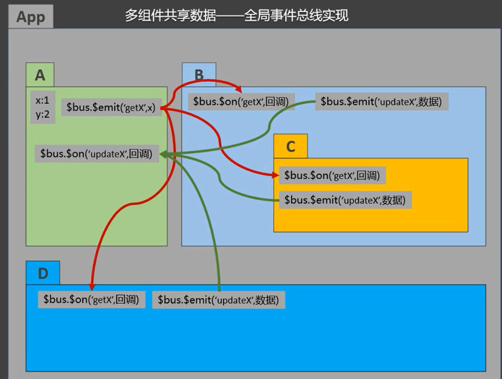

使用 vuex 实现多个组件对同一个数据进行读和写操作：

> 当对数据进行读和写操作的组件个数较多时，使用 vuex 实现比全局事件总线实现更为简易。

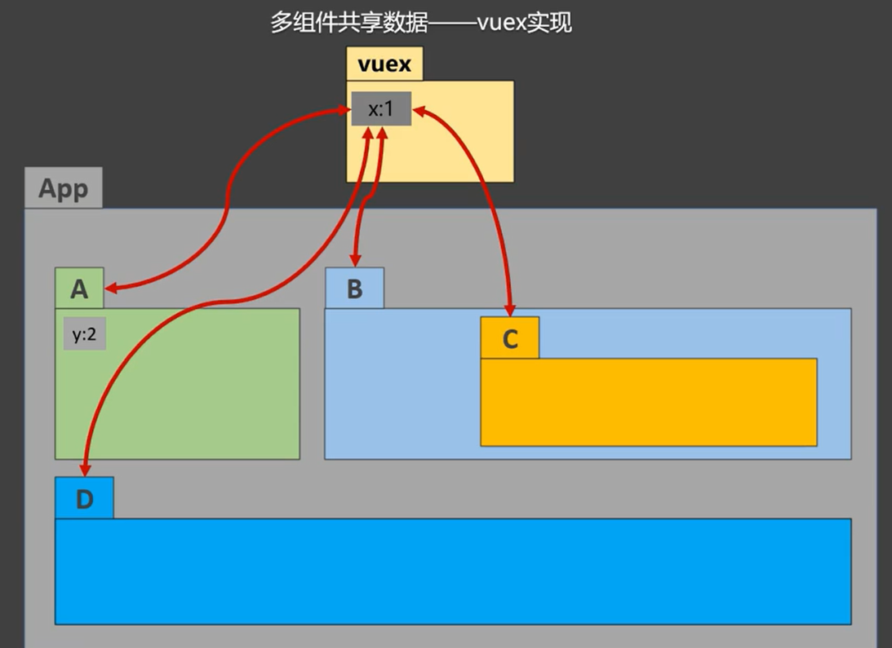

## 2. 求和案例

App.vue

```html
<template>
  <div>
    <!-- 使用子组件 -->
    <Count></Count>
  </div>
</template>

<script>
// 导入子组件
import Count from './components/Count.vue'

export default {
  name: 'App',
  // 注册子组件
  components: {
    Count
  }
}
</script>
```

Count.vue

```html
<template>
  <div>
    <h1>当前求和为: {{sum}}</h1>
    <select v-model.number="n">
      <option value="1">1</option>
      <option value="2">2</option>
      <option value="3">3</option>
    </select>
    <button @click="increment">+</button>
    <button @click="decrement">-</button>
    <button @click="incrementWait">等一等再加</button>
    <button @click="incrementOdd">当前求和为奇数再加</button>
  </div>
</template>

<script>
export default {
  name: 'Count',
  data() {
    return {
      n: 1,
      sum: 0
    }
  },
  methods: {
    increment() {
      this.sum += this.n
    },
    decrement() {
      this.sum -= this.n
    },
    incrementWait() {
      setTimeout(()=>{
        this.sum += this.n
      }, 500)
    },
    incrementOdd() {
      if ( this.sum % 2 ) {
        this.sum += this.n
      }
    }
  }
}
</script>

<style>
button {
  margin: 5px;
}
</style>
```

> 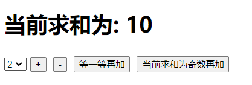

## 3. vuex 工作原理

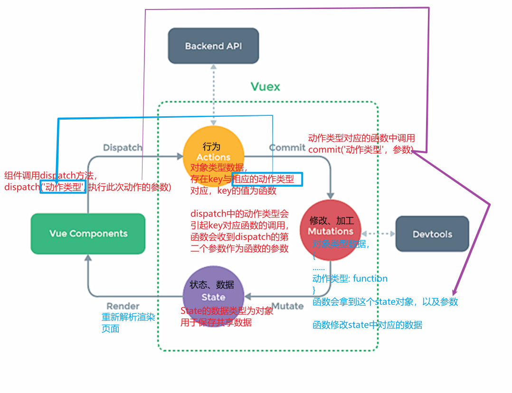

> Actions的作用，当组件调用dispatch方法只知道动作类型，而不知道参数，需要向外部服务器请求，这种情况下，可以在Actions中发送ajax请求获取参数。 如果动作类型和参数都知道，组件可以直接调用commit在Mutations对数据进行处理。


> vuex 中的 Actions、Mutations、State 需要受到 store 的管理，同时 dispatch 方法和 commit 方法由 store 提供。

## 4. 搭建 vuex 环境

> vue2使用vuex3版本 vue3使用vuex4版本

### 4.1 安装 vuex

> **由于使用的vue版本为2.x，所以安装vuex的3.x版本。**

```html
npm i vuex@3
```

### 4.2 新建 store 文件夹

在 src 文件夹下，创建一个 store 文件夹，在 store 文件夹下新建一个 index.js 文件。 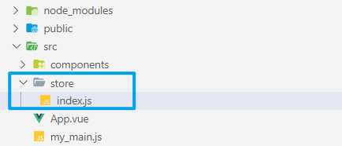

store/index.js

```js
// 该文件用于创建 vuex 中最为核心的 store

// 引入 vue
import Vue from 'vue'
// 引入 vuex
import Vuex from 'vuex'

// 使用 vuex 插件
Vue.use(Vuex)

// 准备 actions 用于响应组件中的动作
const actions = {}
// 准备 mutations 用于操作数据 state
const mutations = {}
// 准备 state 用于存储数据
const state = {}

// 创建并导出 store
export default new Vuex.Store({
  actions,
  mutations,
  state
})
```

> 在 store/index.js 中使用 vuex 插件而不是在 main.js 中使用 vuex 插件，是由于 vuex 插件的使用必须在创建 store 实例对象之前。 如果在 store/index.js 中创建 store 对象，在 main.js 中使用 vuex 插件，由于 import 的代码会被提升至最前， vuex 插件的使用一定在创建 store 对象之后，所以 vuex 插件的使用在 store/index.js 中。

### 4.3 store 配置项

在引入和使用 vuex 后，在创建 vue 实例对象时，可以传入一个配置项 store。在创建 vue 实例对象时传入 store 配置项，vue 实例对象和所有的组件实例对象上都会有一个 $store 属性。

main.js

```js
import Vue from 'vue'
import App from './App.vue'
// 引入 store
import store from './store'

//关闭vue的生产提示
Vue.config.productionTip = false

new Vue({
  render: h => h(App),
  // store 配置项
  // store: store
  // 简写
  store
}).$mount('#app')
```

App.vue

```html
<script>
// 导入子组件
import Count from './components/Count.vue'

export default {
  name: 'App',
  // 注册子组件
  components: {
    Count
  },
  mounted() {
    console.log(this)
  }
}
</script>
```

>  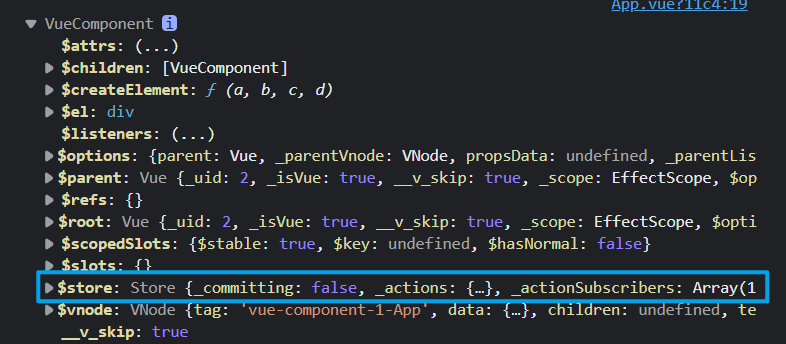

## 5. 求和案例(vuex版)

Count.vue

```html
<template>
  <div>
    <h1>当前求和为: {{$store.state.sum}}</h1>
    <select v-model.number="n">
      <option value="1">1</option>
      <option value="2">2</option>
      <option value="3">3</option>
    </select>
    <button @click="increment">+</button>
    <button @click="decrement">-</button>
    <button @click="incrementWait">等一等再加</button>
    <button @click="incrementOdd">当前求和为奇数再加</button>
  </div>
</template>

<script>
export default {
  name: 'Count',
  data() {
    return {
      n: 1
    }
  },
  methods: {
    increment() {
      // 使用 store 触发 vuex actions中对应的动作
      // this.$store.dispatch('increment', this.n)
      // 由于这个处理不需要进行额外的逻辑处理，可以直接调用 commit 让 mutations 操作数据
      this.$store.commit('INCREMENT', this.n)
    },
    decrement() {
      // 由于这个处理不需要进行额外的逻辑处理，可以直接调用 commit 让 mutations 操作数据
      this.$store.commit('DECREMENT', this.n)
    },
    incrementWait() {
      // 需要进行额外的逻辑处理
      // 等一段时间在加
      this.$store.dispatch('incrementWait', this.n)
    },
    incrementOdd() {
      // 需要进行额外的逻辑处理
      // 当前求和为奇数再加
      this.$store.dispatch('incrementOdd', this.n)
    }
  }
}
</script>

<style>
button {
  margin: 5px;
}
</style>
```

store/index.js

```js
// 该文件用于创建 vuex 中最为核心的 store

// 引入 vue
import Vue from 'vue'
// 引入 vuex
import Vuex from 'vuex'

// 使用 vuex
Vue.use(Vuex)

// 准备 actions 用于响应组件中的动作
const actions = {
  // 完整写法
  // increment: function() {}
  // 简写
  // 第一个参数为 store 的一部分属性组成的对象
  // 第二个参数为触发动作传递过来的值
  // increment(context, value) {
  //   console.log('actions 中的 increment 被触发', context, value)
  //   // 调用 commit 方法触发 mutations 中对应的函数处理数据
  //   // commit 中的动作大写，可以与 actions 中的进行区分
  //   context.commit('INCREMENT', value)
  // }

  // 等一等再加
  incrementWait(context, value) {
    console.log('actions 中的 incrementWait 被触发', context, value)
    setTimeout(() => {
      context.commit('INCREMENTWAIT', value)
    }, 500);
  },
  // 当前求和为奇数再加
  incrementOdd(context, value) {
    console.log('actions 中的 incrementOdd 被触发', context, value)
    // 在 context 对象有 state 属性
    if (context.state.sum % 2) {
      context.commit('INCREMENTODD', value)
    }
  }
}
// 准备 mutations 用于操作数据 state
const mutations = {
  // 第一个参数为 state 对象，可以直接通过第一个参数修改state内的内容
  // 第二个参数为触发动作传递过来的值
  // 加法
  INCREMENT(state, value) {
    console.log('mutations 中的 INCREMENT 被触发', state, value)
    state.sum += value
  },
  // 减法
  DECREMENT(state, value) {
    console.log('mutations 中的 DECREMENT 被触发', state, value)
    state.sum -= value
  },
  // 等一等再加
  INCREMENTWAIT(state, value) {
    console.log('mutations 中的 INCREMENTWAIT 被触发', state, value)
    state.sum += value
  },
  // 当前求和为奇数再加
  INCREMENTODD(state, value) {
    console.log('mutations 中的 INCREMENTODD 被触发', state, value)
    state.sum += value
  }
}
// 准备 state 用于存储数据
const state = {
  // 当前求和
  sum: 0
}

// 创建并导出 store
export default new Vuex.Store({
  actions,
  mutations,
  state
})
```

> 

> vuex 中的 actions 负责业务逻辑的处理，mutations 负责数据的操作修改。 

## 6. store 中的 getters 配置项

类似于计算属性，可以读取state中数据加工后的值。

### 6.1 getters 配置项

store/index.js

```js
// 该文件用于创建 vuex 中最为核心的 store
......

// 准备 actions 用于响应组件中的动作
const actions = {
  ......
}
// 准备 mutations 用于操作数据 state
const mutations = {
  ......
}
// 准备 state 用于存储数据
const state = {
  // 当前求和
  sum: 0
}

// getters 
const getters = {
  // 会有一个参数 state
  // 获取当前求和放大十倍后的值
  bigSum(state) {
    return state.sum * 10
  }
}

// 创建并导出 store
export default new Vuex.Store({
  actions,
  mutations,
  state,
  getters
})
```

### 6.2 读取 getters 配置项中的值

在 $store 实例对象中存在一个属性 getters： 

Count.vue

```html
<template>
  <div>
    <h1>当前求和为: {{$store.state.sum}}</h1>
    <h1>当前求和放大10倍为: {{$store.getters.bigSum}}</h1>
    <select v-model.number="n">
      <option value="1">1</option>
      <option value="2">2</option>
      <option value="3">3</option>
    </select>
    <button @click="increment">+</button>
    <button @click="decrement">-</button>
    <button @click="incrementWait">等一等再加</button>
    <button @click="incrementOdd">当前求和为奇数再加</button>
  </div>
</template>

<script>
export default {
  name: 'Count',
  data() {
    return {
      n: 1
    }
  },
  methods: {
    increment() {
      // 使用 store 触发 vuex actions中对应的动作
      // this.$store.dispatch('increment', this.n)
      // 由于这个处理不需要进行额外的逻辑处理，可以直接调用 commit 让 mutations 操作数据
      this.$store.commit('INCREMENT', this.n)
    },
    decrement() {
      // 由于这个处理不需要进行额外的逻辑处理，可以直接调用 commit 让 mutations 操作数据
      this.$store.commit('DECREMENT', this.n)
    },
    incrementWait() {
      // 需要进行额外的逻辑处理
      // 等一段时间在加
      this.$store.dispatch('incrementWait', this.n)
    },
    incrementOdd() {
      // 需要进行额外的逻辑处理
      // 当前求和为奇数再加
      this.$store.dispatch('incrementOdd', this.n)
    }
  }
}
</script>

<style>
button {
  margin: 5px;
}
</style>
```

> 

## 7. mapState & mapGetters

导入 mapState & mapGetters：

```js
// 导入 mapState mapGetters
import { mapState, mapGetters } from 'vuex'
```

### 7.1 mapState 生成 state 数据对应的计算属性

通过 mapState 生成 state 中各个数据对应的计算属性，可以在页面直接使用计算属性名获取 state 中的数据值，而不用通过 `$store.state.变量` 获取。

**mapState方法：**用于帮助我们映射`state`中的数据为计算属性

store/index.js

```js
......

// 准备 state 用于存储数据
const state = {
  // 当前求和
  sum: 0,
  school: 'SGG',
  subject: '前端'
}

......
```

#### 7.1.1 对象写法

```html
<template>
  <div>
    <h1>当前求和为: {{mySum}}</h1>
    <h1>当前求和放大10倍为: {{$store.getters.bigSum}}</h1>
    <h1>学校: {{mySchool}}</h1>
    <h1>学科: {{mySubject}}</h1>
    <select v-model.number="n">
      <option value="1">1</option>
      <option value="2">2</option>
      <option value="3">3</option>
    </select>
    <button @click="increment">+</button>
    <button @click="decrement">-</button>
    <button @click="incrementWait">等一等再加</button>
    <button @click="incrementOdd">当前求和为奇数再加</button>
  </div>
</template>

<script>
// 导入 mapState 
import {mapState} from 'vuex'

export default {
  name: 'Count',
  data() {
    return {
      n: 1
    }
  },
  computed: {
    // 借助mapState生成计算属性，从state中读取数据。（对象写法）
    // 借助mapState生成计算属性 返回结果为一个对象
    // {
    //   mySum: function() {},
    //   mySchool: function() {},
    //   mySubject: function() {}
    // }
    // 使用解构将每个函数解构出来并放到computed中
    ...mapState({
      // mySum 为计算属性名
      // 'sum' 为state中的变量名，写成字符串的形式会自动取state中寻找对应的变量
      mySum: 'sum',
      mySchool: 'school',
      mySubject: 'subject',
    })
  },
  methods: {
    ......
  }
}
</script>

<style>
button {
  margin: 5px;
}
</style>
```

> 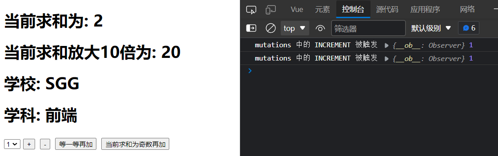

#### 7.1.2 数组写法

数组写法生成的计算属性名和state中的数据变量名一致。

```html
<template>
  <div>
    <h1>当前求和为: {{sum}}</h1>
    <h1>当前求和放大10倍为: {{$store.getters.bigSum}}</h1>
    <h1>学校: {{school}}</h1>
    <h1>学科: {{subject}}</h1>
    <select v-model.number="n">
      <option value="1">1</option>
      <option value="2">2</option>
      <option value="3">3</option>
    </select>
    <button @click="increment">+</button>
    <button @click="decrement">-</button>
    <button @click="incrementWait">等一等再加</button>
    <button @click="incrementOdd">当前求和为奇数再加</button>
  </div>
</template>

<script>
// 导入 mapState 
import {mapState} from 'vuex'

export default {
  name: 'Count',
  data() {
    return {
      n: 1
    }
  },
  computed: {
    // 借助mapState生成计算属性，从state中读取数据。（对象写法）
    // ...mapState({
    //   mySum: 'sum',
    //   mySchool: 'school',
    //   mySubject: 'subject',
    // })

    // 借助mapState生成计算属性，从state中读取数据。（数组写法）
    // 数组写法生成的计算属性名和state中的数据变量名一致。
    ...mapState(['sum', 'school', 'subject'])
  },
  methods: {
    ......
  }
}
</script>

<style>
button {
  margin: 5px;
}
</style>
```

> 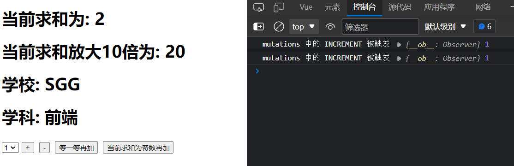

### 7.2 mapGetters 生成 getters 数据对应的计算属性

通过 mapGetters 生成 getters 中各个数据对应的计算属性，可以在页面直接使用计算属性名获取 getters 中的数据值，而不用通过 `$store.getters.变量` 获取。

**mapGetters方法：**用于帮助我们映射`getters`中的数据为计算属性

store/index.js

```js
......

// getters 
const getters = {
  // 会有一个参数 state
  // 获取当前求和放大十倍后的值
  bigSum(state) {
    return state.sum * 10
  }
}

......
```

#### 7.2.1 对象写法

Count.vue

```html
<template>
  <div>
    <h1>当前求和为: {{sum}}</h1>
    <h1>当前求和放大10倍为: {{bigSum}}</h1>
    <h1>学校: {{school}}</h1>
    <h1>学科: {{subject}}</h1>
    <select v-model.number="n">
      <option value="1">1</option>
      <option value="2">2</option>
      <option value="3">3</option>
    </select>
    <button @click="increment">+</button>
    <button @click="decrement">-</button>
    <button @click="incrementWait">等一等再加</button>
    <button @click="incrementOdd">当前求和为奇数再加</button>
  </div>
</template>

<script>
// 导入 mapState mapGetters
import { mapState, mapGetters } from 'vuex'

export default {
  name: 'Count',
  data() {
    return {
      n: 1
    }
  },
  computed: {
    ......

    // 借助mapState生成计算属性，从state中读取数据。（数组写法）
    // 数组写法生成的计算属性名和state中的数据变量名一致。
    ...mapState(['sum', 'school', 'subject']),

    // 借助mapGetters生成计算属性，从getters中读取数据。（对象写法）
    ...mapGetters({bigSum:'bigSum'})
  },
  methods: {
    ......
  }
}
</script>

<style>
button {
  margin: 5px;
}
</style>
```

> 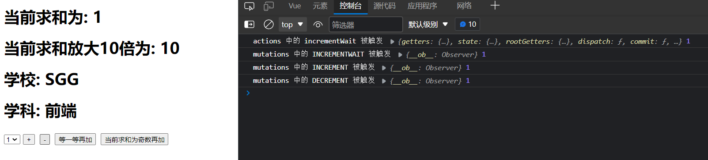

#### 7.2.2 数组写法

> 数组写法生成的计算属性名和getters中的数据变量名一致。

Count.vue

```html
<template>
  <div>
    <h1>当前求和为: {{sum}}</h1>
    <h1>当前求和放大10倍为: {{bigSum}}</h1>
    <h1>学校: {{school}}</h1>
    <h1>学科: {{subject}}</h1>
    <select v-model.number="n">
      <option value="1">1</option>
      <option value="2">2</option>
      <option value="3">3</option>
    </select>
    <button @click="increment">+</button>
    <button @click="decrement">-</button>
    <button @click="incrementWait">等一等再加</button>
    <button @click="incrementOdd">当前求和为奇数再加</button>
  </div>
</template>

<script>
// 导入 mapState mapGetters
import { mapState, mapGetters } from 'vuex'

export default {
  name: 'Count',
  data() {
    return {
      n: 1
    }
  },
  computed: {
    ......

    // 借助mapState生成计算属性，从state中读取数据。（数组写法）
    // 数组写法生成的计算属性名和state中的数据变量名一致。
    ...mapState(['sum', 'school', 'subject']),

    // 借助mapGetters生成计算属性，从getters中读取数据。（对象写法）
    // ...mapGetters({bigSum:'bigSum'})

    //借助mapGetters生成计算属性，从getters中读取数据。（数组写法）
    ...mapGetters(['bigSum'])
  },
  methods: {
    ......
  }
}
</script>

<style>
button {
  margin: 5px;
}
</style>
```

> 

## 8. mapActions & mapMutations

### 8.1 mapMutations

**mapMutations方法：**用于帮助我们生成与`mutations`对话的方法，即：包含`$store.commit(xxx)`的函数

借助mapMutations生成对应的方法，方法中会调用commit去联系mutations

#### 8.1.1 引入 mapMutations

```js
// 引入 mapMutations
import { mapMutations } from 'vuex'
```

#### 8.1.2 对象写法

Count.vue

```html
<template>
  <div>
    <h1>当前求和为: {{sum}}</h1>
    <h1>当前求和放大10倍为: {{bigSum}}</h1>
    <h1>学校: {{school}}</h1>
    <h1>学科: {{subject}}</h1>
    <select v-model.number="n">
      <option value="1">1</option>
      <option value="2">2</option>
      <option value="3">3</option>
    </select>


    <button @click="increment(n)">+</button>
    <button @click="decrement(n)">-</button>


    <button @click="incrementWait">等一等再加</button>
    <button @click="incrementOdd">当前求和为奇数再加</button>
  </div>
</template>

<script>
// 导入 mapState mapGetters
import { mapState, mapGetters } from 'vuex'
// 引入 mapMutations
import { mapMutations } from 'vuex'

export default {
  name: 'Count',
  data() {
    return {
      n: 1
    }
  },
  computed: {
    ......
  },
  methods: {
    // 自己写的方法
    // increment() {
    //   this.$store.commit('INCREMENT', this.n)
    // },
    // decrement() {
    //   this.$store.commit('DECREMENT', this.n)
    // },

    // 借助mapMutations生成对应的方法，方法中会调用commit去联系mutations(对象写法)
    ...mapMutations({
      increment: 'INCREMENT',
      decrement: 'DECREMENT'
    }),
    // 生成的方法为：
    // increment(value) {
    //   this.$store.commit('INCREMENT', value)
    // },
    // 所以在调用mapMutations生成对应的方法时，需要传入value参数

    ......
  }
}
</script>
```

> 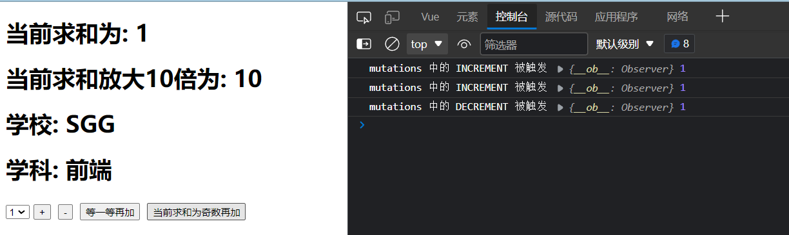

#### 8.1.3 数组写法

Count.vue

```html
<template>
  <div>
    <h1>当前求和为: {{sum}}</h1>
    <h1>当前求和放大10倍为: {{bigSum}}</h1>
    <h1>学校: {{school}}</h1>
    <h1>学科: {{subject}}</h1>
    <select v-model.number="n">
      <option value="1">1</option>
      <option value="2">2</option>
      <option value="3">3</option>
    </select>


    <button @click="INCREMENT(n)">+</button>
    <button @click="DECREMENT(n)">-</button>


    <button @click="incrementWait">等一等再加</button>
    <button @click="incrementOdd">当前求和为奇数再加</button>
  </div>
</template>

<script>
// 导入 mapState mapGetters
import { mapState, mapGetters } from 'vuex'
// 引入 mapMutations
import { mapMutations } from 'vuex'

export default {
  name: 'Count',
  data() {
    return {
      n: 1
    }
  },
  computed: {
    ......
  },
  methods: {
    // 自己写的方法
    // increment() {
    //   this.$store.commit('INCREMENT', this.n)
    // },
    // decrement() {
    //   this.$store.commit('DECREMENT', this.n)
    // },

    // 借助mapMutations生成对应的方法，方法中会调用commit去联系mutations(对象写法)
    // ...mapMutations({
    //   increment: 'INCREMENT',
    //   decrement: 'DECREMENT'
    // }),
    // 借助mapMutations生成对应的方法，方法中会调用commit去联系mutations(数组写法)
    ...mapMutations(['INCREMENT', 'DECREMENT']),

    ......
  }
}
</script>

<style>
button {
  margin: 5px;
}
</style>
```

> 

### 8.2 mapActions

**mapActions方法：**用于帮助我们生成与`actions`对话的方法，即：包含`$store.dispatch(xxx)`的函数

借助mapActions生成对应的方法，方法中会调用dispatch去联系actions

#### 8.2.1 引入 mapActions

```js
// 引入 mapActions 
import { mapActions } from 'vuex'
```

#### 8.2.2 对象写法

Count.vue

```html
<template>
  <div>
    <h1>当前求和为: {{sum}}</h1>
    <h1>当前求和放大10倍为: {{bigSum}}</h1>
    <h1>学校: {{school}}</h1>
    <h1>学科: {{subject}}</h1>
    <select v-model.number="n">
      <option value="1">1</option>
      <option value="2">2</option>
      <option value="3">3</option>
    </select>
    <button @click="INCREMENT(n)">+</button>
    <button @click="DECREMENT(n)">-</button>
    <button @click="incrementWait(n)">等一等再加</button>
    <button @click="incrementOdd(n)">当前求和为奇数再加</button>
  </div>
</template>

<script>
// 导入 mapState mapGetters
import { mapState, mapGetters } from 'vuex'
// 引入 mapMutations
import { mapMutations, mapActions } from 'vuex'

export default {
  name: 'Count',
  data() {
    return {
      n: 1
    }
  },
  computed: {
    ......
  },
  methods: {
    ......

    // 自己写的方法
    // incrementWait() {
    //   this.$store.dispatch('incrementWait', this.n)
    // },
    // incrementOdd() {
    //   this.$store.dispatch('incrementOdd', this.n)
    // }

    // 借助mapActions生成对应的方法，方法中会调用dispatch去联系actions(对象写法)
    ...mapActions({
      incrementWait: 'incrementWait',
      incrementOdd: 'incrementOdd'
    })
    // 生成的方法为：
    // incrementWait(value) {
    //   this.$store.dispatch('incrementWait', value)
    // },
    // 所以在调用mapActions生成对应的方法时，需要传入value参数
  }
}
</script>
```

> 

#### 8.2.3 数组写法

```html
<template>
  <div>
    <h1>当前求和为: {{sum}}</h1>
    <h1>当前求和放大10倍为: {{bigSum}}</h1>
    <h1>学校: {{school}}</h1>
    <h1>学科: {{subject}}</h1>
    <select v-model.number="n">
      <option value="1">1</option>
      <option value="2">2</option>
      <option value="3">3</option>
    </select>
    <button @click="INCREMENT(n)">+</button>
    <button @click="DECREMENT(n)">-</button>
    <button @click="incrementWait(n)">等一等再加</button>
    <button @click="incrementOdd(n)">当前求和为奇数再加</button>
  </div>
</template>

<script>
// 导入 mapState mapGetters
import { mapState, mapGetters } from 'vuex'
// 引入 mapMutations
import { mapMutations, mapActions } from 'vuex'

export default {
  name: 'Count',
  data() {
    return {
      n: 1
    }
  },
  computed: {
    ......
  },
  methods: {
    ......

    // 自己写的方法
    // incrementWait() {
    //   this.$store.dispatch('incrementWait', this.n)
    // },
    // incrementOdd() {
    //   this.$store.dispatch('incrementOdd', this.n)
    // }

    // 借助mapActions生成对应的方法，方法中会调用dispatch去联系actions(对象写法)
    // ...mapActions({
    //   incrementWait: 'incrementWait',
    //   incrementOdd: 'incrementOdd'
    // })
    // 借助mapActions生成对应的方法，方法中会调用dispatch去联系actions(数组写法)
    ...mapActions(['incrementWait', 'incrementOdd'])
  }
}
</script>
```

> 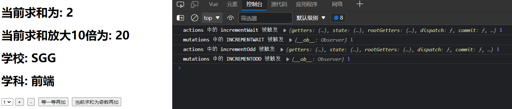

## 9. vuex 总结

### 1.概念

 在Vue中实现集中式状态（数据）管理的一个Vue插件，对vue应用中多个组件的共享状态进行集中式的管理（读/写），也是一种组件间通信的方式，且适用于任意组件间通信。

### 2.何时使用？

 多个组件需要共享数据时

### 3.搭建vuex环境

1. 创建文件：`src/store/index.js`

   ```js
   //引入Vue核心库
   import Vue from 'vue'
   //引入Vuex
   import Vuex from 'vuex'
   //应用Vuex插件
   Vue.use(Vuex)
   
   //准备actions对象——响应组件中用户的动作
   const actions = {}
   //准备mutations对象——修改state中的数据
   const mutations = {}
   //准备state对象——保存具体的数据
   const state = {}
   
   //创建并暴露store
   export default new Vuex.Store({
   	actions,
   	mutations,
   	state
   })
   ```

2. 在`main.js`中创建vm时传入`store`配置项

   ```js
   ......
   //引入store
   import store from './store'
   ......
   
   //创建vm
   new Vue({
   	el:'#app',
   	render: h => h(App),
   	store
   })
   ```

### 4.基本使用

1. 初始化数据、配置`actions`、配置`mutations`，操作文件`store.js`

   ```js
   //引入Vue核心库
   import Vue from 'vue'
   //引入Vuex
   import Vuex from 'vuex'
   //引用Vuex
   Vue.use(Vuex)
   
   const actions = {
       //响应组件中加的动作
   	jia(context,value){
   		// console.log('actions中的jia被调用了',miniStore,value)
   		context.commit('JIA',value)
   	},
   }
   
   const mutations = {
       //执行加
   	JIA(state,value){
   		// console.log('mutations中的JIA被调用了',state,value)
   		state.sum += value
   	}
   }
   
   //初始化数据
   const state = {
      sum:0
   }
   
   //创建并暴露store
   export default new Vuex.Store({
   	actions,
   	mutations,
   	state,
   })
   ```

2. 组件中读取vuex中的数据：`$store.state.sum`

3. 组件中修改vuex中的数据：`$store.dispatch('action中的方法名',数据)`或 `$store.commit('mutations中的方法名',数据)`

   > 备注：若没有网络请求或其他业务逻辑，组件中也可以越过actions，即不写`dispatch`，直接编写`commit`

### 5.getters的使用

1. 概念：当state中的数据需要经过加工后再使用时，可以使用getters加工。

2. 在`store.js`中追加`getters`配置

   ```js
   ......
   
   const getters = {
   	bigSum(state){
   		return state.sum * 10
   	}
   }
   
   //创建并暴露store
   export default new Vuex.Store({
   	......
   	getters
   })
   ```

3. 组件中读取数据：`$store.getters.bigSum`

### 6.四个map方法的使用

不借助map方法时：

```js
computed: {
	sum(){
        return this.$store.state.sum
    }
},
```

1. **mapState方法：**用于帮助我们映射`state`中的数据为计算属性

   ```js
   computed: {
       //借助mapState生成计算属性：sum、school、subject（对象写法）
        ...mapState({sum:'sum',school:'school',subject:'subject'}),
            
       //借助mapState生成计算属性：sum、school、subject（数组写法）
       ...mapState(['sum','school','subject']),
   },
   ```

2. **mapGetters方法：**用于帮助我们映射`getters`中的数据为计算属性

   ```js
   computed: {
       //借助mapGetters生成计算属性：bigSum（对象写法）
       ...mapGetters({bigSum:'bigSum'}),
   
       //借助mapGetters生成计算属性：bigSum（数组写法）
       ...mapGetters(['bigSum'])
   },
   ```

3. **mapActions方法：**用于帮助我们生成与`actions`对话的方法，即：包含`$store.dispatch(xxx)`的函数

   ```js
   methods:{
       //靠mapActions生成：incrementOdd、incrementWait（对象形式）
       ...mapActions({incrementOdd:'jiaOdd',incrementWait:'jiaWait'})
   
       //靠mapActions生成：incrementOdd、incrementWait（数组形式）
       ...mapActions(['jiaOdd','jiaWait'])
   }
   ```

4. **mapMutations方法：**用于帮助我们生成与`mutations`对话的方法，即：包含`$store.commit(xxx)`的函数

   ```js
   methods:{
       //靠mapActions生成：increment、decrement（对象形式）
       ...mapMutations({increment:'JIA',decrement:'JIAN'}),
       
       //靠mapMutations生成：JIA、JIAN（对象形式）
       ...mapMutations(['JIA','JIAN']),
   }
   ```

> 备注：mapActions与mapMutations使用时，若需要传递参数需要：在模板中绑定事件时传递好参数，否则参数是事件对象。

# 39.多组件共享数据与vuex模块化

## 1. 多组件共享数据案例

### 1.1 实现效果

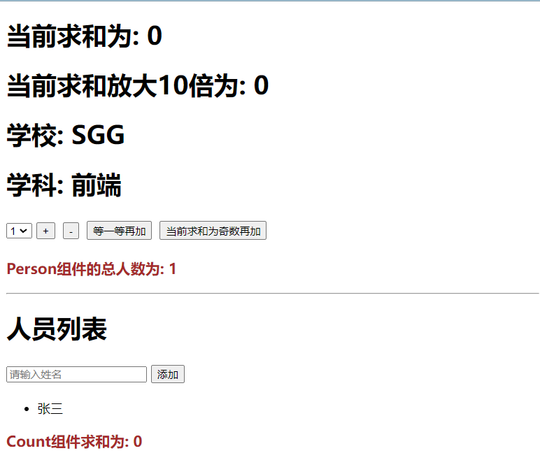

### 1.2 代码实现

store/index.js

```js
// 该文件用于创建 vuex 中最为核心的 store

// 引入 vue
import Vue from 'vue'
// 引入 vuex
import Vuex from 'vuex'

// 使用 vuex
Vue.use(Vuex)

// 准备 actions 用于响应组件中的动作
const actions = {
  // 等一等再加
  incrementWait(context, value) {
    console.log('actions 中的 incrementWait 被触发', context, value)
    setTimeout(() => {
      context.commit('INCREMENTWAIT', value)
    }, 500);
  },
  // 当前求和为奇数再加
  incrementOdd(context, value) {
    console.log('actions 中的 incrementOdd 被触发', context, value)
    if (context.state.sum % 2) {
      context.commit('INCREMENTODD', value)
    }
  }
}
// 准备 mutations 用于操作数据 state
const mutations = {
  // 加法
  INCREMENT(store, value) {
    console.log('mutations 中的 INCREMENT 被触发', store, value)
    store.sum += value
  },
  // 减法
  DECREMENT(store, value) {
    console.log('mutations 中的 DECREMENT 被触发', store, value)
    store.sum -= value
  },
  // 等一等再加
  INCREMENTWAIT(store, value) {
    console.log('mutations 中的 INCREMENTWAIT 被触发', store, value)
    store.sum += value
  },
  // 当前求和为奇数再加
  INCREMENTODD(store, value) {
    console.log('mutations 中的 INCREMENTODD 被触发', store, value)
    store.sum += value
  },
  // 添加人员
  ADD_PERSON(state, person) {
    state.personList.unshift(person)
  }
}
// 准备 state 用于存储数据
const state = {
  // 当前求和
  sum: 0,
  school: 'SGG',
  subject: '前端',
  personList: [
    {id: '001', name: '张三'}
  ]
}

// getters 
const getters = {
  // 会有一个参数 state
  // 获取当前求和放大十倍后的值
  bigSum(state) {
    return state.sum * 10
  }
}

// 创建并导出 store
export default new Vuex.Store({
  actions,
  mutations,
  state,
  getters
})
```

main.js

```js
import Vue from 'vue'
import App from './App.vue'
// 引入 store
import store from './store'

//关闭vue的生产提示
Vue.config.productionTip = false

new Vue({
  render: h => h(App),
  store
}).$mount('#app')
```

App.vue

```html
<template>
  <div>
    <!-- 使用子组件 -->
    <Count></Count>
    <hr>
    <Person></Person>
  </div>
</template>

<script>
// 导入子组件
import Count from './components/Count.vue'
import Person from './components/Person.vue'

export default {
  name: 'App',
  // 注册子组件
  components: {
    Count,
    Person
  }
}
</script>
```

Count.vue

```html
<template>
  <div>
    <h1>当前求和为: {{sum}}</h1>
    <h1>当前求和放大10倍为: {{bigSum}}</h1>
    <h1>学校: {{school}}</h1>
    <h1>学科: {{subject}}</h1>
    <select v-model.number="n">
      <option value="1">1</option>
      <option value="2">2</option>
      <option value="3">3</option>
    </select>
    <button @click="INCREMENT(n)">+</button>
    <button @click="DECREMENT(n)">-</button>
    <button @click="incrementWait(n)">等一等再加</button>
    <button @click="incrementOdd(n)">当前求和为奇数再加</button>
    <h3>Person组件的总人数为: {{personList.length}}</h3>
  </div>
</template>

<script>
// 导入 mapState mapGetters
import { mapState, mapGetters } from 'vuex'
// 引入 mapMutations
import { mapMutations, mapActions } from 'vuex'

export default {
  name: 'Count',
  data() {
    return {
      n: 1
    }
  },
  computed: {
    // 借助mapState生成计算属性，从state中读取数据。（数组写法）
    ...mapState(['sum', 'school', 'subject', 'personList']),
    //借助mapGetters生成计算属性，从getters中读取数据。（数组写法）
    ...mapGetters(['bigSum'])
  },
  methods: {
    // 借助mapMutations生成对应的方法，方法中会调用commit去联系mutations(数组写法)
    ...mapMutations(['INCREMENT', 'DECREMENT']),
    // 借助mapActions生成对应的方法，方法中会调用dispatch去联系actions(数组写法)
    ...mapActions(['incrementWait', 'incrementOdd'])
  }
}
</script>

<style>
button {
  margin: 5px;
}

h3 {
  color: brown;
}
</style>
```

Person.vue

```html
<template>
  <div>
    <h1>人员列表</h1>
    <input type="text" placeholder="请输入姓名" v-model="name">
    <button @click="addPerson">添加</button>
    <ul>
      <li v-for="person in personList" :key="person.id">{{person.name}}</li>
    </ul>
    <h3>Count组件求和为: {{sum}}</h3>
  </div>
</template>

<script>
// 导入 mapState mapMutations
import {mapState, mapMutations} from 'vuex'
// 导入 nanoid 用于 id 的生成
import {nanoid} from 'nanoid'

export default {
  name: 'Person',
  data() {
    return {
      name: ''
    }
  },
  computed: {
    ...mapState(['personList', 'sum'])
  },
  methods: {
    addPerson() {
      const person = {
        id: nanoid(),
        name: this.name
      }
      this.ADD_PERSON(person)
      this.name = ''
    },
    ...mapMutations(['ADD_PERSON'])
  }
}
</script>

<style>

</style>
```

> 

## 2. vuex 模块化

vuex 模块化是将 vuex 中 actions、mutations、state、getters 中的数据和方法根据功能进行拆分。即和同一个功能相关的 actions、mutations、state、getters 放在一起。

### 2.1 vuex 模块化拆分

store/index.js

```js
// 该文件用于创建 vuex 中最为核心的 store

// 引入 vue
import Vue from 'vue'
// 引入 vuex
import Vuex from 'vuex'

// 使用 vuex
Vue.use(Vuex)

// 和计算相关的配置项
const acountOptions = {
  actions: {
    // 等一等再加
    incrementWait(context, value) {
      console.log('actions 中的 incrementWait 被触发', context, value)
      setTimeout(() => {
        context.commit('INCREMENTWAIT', value)
      }, 500);
    },
    // 当前求和为奇数再加
    incrementOdd(context, value) {
      console.log('actions 中的 incrementOdd 被触发', context, value)
      if (context.state.sum % 2) {
        context.commit('INCREMENTODD', value)
      }
    }
  },
  mutations: {
    // 加法
    INCREMENT(store, value) {
      console.log('mutations 中的 INCREMENT 被触发', store, value)
      store.sum += value
    },
    // 减法
    DECREMENT(store, value) {
      console.log('mutations 中的 DECREMENT 被触发', store, value)
      store.sum -= value
    },
    // 等一等再加
    INCREMENTWAIT(store, value) {
      console.log('mutations 中的 INCREMENTWAIT 被触发', store, value)
      store.sum += value
    },
    // 当前求和为奇数再加
    INCREMENTODD(store, value) {
      console.log('mutations 中的 INCREMENTODD 被触发', store, value)
      store.sum += value
    },
  },
  state: {
    sum: 0,
    school: 'SGG',
    subject: '前端',
  },
  getters: {
    bigSum(state) {
      return state.sum * 10
    }
  }
}

// 和人员相关的配置项
const personOptions = {
  actions: {},
  mutations: {
    // 添加人员
    ADD_PERSON(state, person) {
      state.personList.unshift(person)
    }
  },
  state: {
    personList: [
      { id: '001', name: '张三' }
    ]
  },
  getters: {}
}
```

### 2.2 使用模块化后的配置项

创建store实例对象时，使用模块化后的配置项，模块化后的配置项需要写在store的modules配置项中。

store/index.js

```js
// 创建并导出 store
export default new Vuex.Store({
  modules: {
    acount: acountOptions,
    person: personOptions
  }
})
```

### 2.2 开启命名空间

> 启用命名空间后，模块内的状态（state）、getters、mutations 和 actions 将被隔离，避免命名冲突，同时提供更清晰的访问路径。

```js
// 配置项开启命名空间
namespaced: true,
```

store/index.js

```js
// 和计算相关的配置项
const acountOptions = {
  namespaced: true,
  actions: {
    ......
  },
  mutations: {
    ......
  },
  state: {
    ......
  },
  getters: {
    ......
  }
}

// 和人员相关的配置项
const personOptions = {
  namespaced: true,
  actions: {},
  mutations: {
    ......
  },
  state: {
    ......
  },
  getters: {}
}
```

### 2.3 模块化后读取数据和方法

vuex 模块化使用 mapState、mapGetters、mapMutations、mapActions 读取数据和获取相应的方法，需要在数组和对象前面先传入一个参数，该参数为数据和方法对应所在的命名空间。

Count.vue

```html
<template>
  <div>
    <h1>当前求和为: {{sum}}</h1>
    <h1>当前求和放大10倍为: {{bigSum}}</h1>
    <h1>学校: {{school}}</h1>
    <h1>学科: {{subject}}</h1>
    <select v-model.number="n">
      <option value="1">1</option>
      <option value="2">2</option>
      <option value="3">3</option>
    </select>
    <button @click="INCREMENT(n)">+</button>
    <button @click="DECREMENT(n)">-</button>
    <button @click="incrementWait(n)">等一等再加</button>
    <button @click="incrementOdd(n)">当前求和为奇数再加</button>
    <h3>Person组件的总人数为: {{personList.length}}</h3>
  </div>
</template>

<script>
// 导入 mapState mapGetters
import { mapState, mapGetters } from 'vuex'
// 引入 mapMutations
import { mapMutations, mapActions } from 'vuex'

export default {
  name: 'Count',
  data() {
    return {
      n: 1
    }
  },
  computed: {
    // 借助mapState生成计算属性，从state中读取数据。（数组写法）
    ...mapState('acount',['sum', 'school', 'subject']),
    ...mapState('person',['personList']),
    //借助mapGetters生成计算属性，从getters中读取数据。（数组写法）
    ...mapGetters('acount',['bigSum'])
  },
  methods: {
    // 借助mapMutations生成对应的方法，方法中会调用commit去联系mutations(数组写法)
    ...mapMutations('acount',['INCREMENT', 'DECREMENT']),
    // 借助mapActions生成对应的方法，方法中会调用dispatch去联系actions(数组写法)
    ...mapActions('acount',['incrementWait', 'incrementOdd'])
  }
}
</script>

<style>
button {
  margin: 5px;
}

h3 {
  color: brown;
}
</style>
```

Person.vue

```html
<template>
  <div>
    <h1>人员列表</h1>
    <input type="text" placeholder="请输入姓名" v-model="name">
    <button @click="addPerson">添加</button>
    <ul>
      <li v-for="person in personList" :key="person.id">{{person.name}}</li>
    </ul>
    <h3>Count组件求和为: {{sum}}</h3>
  </div>
</template>

<script>
// 导入 mapState mapMutations
import {mapState, mapMutations} from 'vuex'
// 导入 nanoid 用于 id 的生成
import {nanoid} from 'nanoid'

export default {
  name: 'Person',
  data() {
    return {
      name: ''
    }
  },
  computed: {
    ...mapState('acount',['sum']),
    ...mapState('person',['personList'])
  },
  methods: {
    addPerson() {
      const person = {
        id: nanoid(),
        name: this.name
      }
      this.ADD_PERSON(person)
      this.name = ''
    },
    ...mapMutations('person', ['ADD_PERSON'])
  }
}
</script>

<style>

</style>
```

> 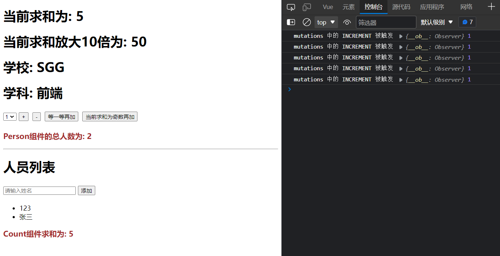

## 3. 总结 多组件共享数据与vuex模块化

### 3.1. 目的

让代码更好维护，让多种数据分类更加明确。

### 3.2. 修改`store.js`

```javascript
   const countAbout = {
     namespaced:true,//开启命名空间
     state:{x:1},
     mutations: { ... },
     actions: { ... },
     getters: {
       bigSum(state){
          return state.sum * 10
       }
     }
   }
   
   const personAbout = {
     namespaced:true,//开启命名空间
     state:{ ... },
     mutations: { ... },
     actions: { ... }
   }
   
   const store = new Vuex.Store({
     modules: {
       countAbout,
       personAbout
     }
   })
```

### 3.3 开启命名空间后，组件中读取state数据

```js
   //方式一：自己直接读取
   this.$store.state.personAbout.list
   //方式二：借助mapState读取：
   ...mapState('countAbout',['sum','school','subject']),
```

### 3.4. 开启命名空间后，组件中读取getters数据：

```js
   //方式一：自己直接读取
   this.$store.getters['personAbout/firstPersonName']
   //方式二：借助mapGetters读取：
   ...mapGetters('countAbout',['bigSum'])
```

### 3.5. 开启命名空间后，组件中调用dispatch

```js
   //方式一：自己直接dispatch
   this.$store.dispatch('personAbout/addPersonWang',person)
   //方式二：借助mapActions：
   ...mapActions('countAbout',{incrementOdd:'jiaOdd',incrementWait:'jiaWait'})
```

### 3.6. 开启命名空间后，组件中调用commit

```js
   //方式一：自己直接commit
   this.$store.commit('personAbout/ADD_PERSON',person)
   //方式二：借助mapMutations：
   ...mapMutations('countAbout',{increment:'JIA',decrement:'JIAN'}),
```

# 40.路由及路由的基本使用

## 1. 相关概念

### 1.1 SPA

SPA 指的是一个 web 网站只有唯一的一个 HTML 页面，所有组件的展示与切换都在这唯一的一个页面内完成。 此时，不同组件之间的切换需要通过前端路由来实现。

1. 单页 Web 应用（single page web application，SPA）。
2. 整个应用只有一个完整的页面。
3. 点击页面中的导航链接不会刷新页面，只会做页面的局部更新。
4. 数据需要通过 ajax 请求获取。

在 SPA 项目中，不同功能之间的切换，要依赖于前端路由来完成。

### 1.2 vue-router

#### 1.2.1 vue-router 的概念

vue-router 是 vue 的一个插件库，是 vue.js 官方给出的路由解决方案，专门用来实现 SPA 应用。它只能结合 vue 项目进行使用，能够轻松的管理 SPA 项目中组件的切换。

#### 1.2.2 vue-router 的版本

vue-router 目前有 3.x 的版本和 4.x 的版本。

其中： vue-router 3.x 结合 vue2 进行使用，[vue-router 3.x 的官方文档地址](https://v3.router.vuejs.org/zh/) vue-router 4.x 结合 vue3 进行使用，[vue-router 4.x 的官方文档地址](https://router.vuejs.org/zh/)

### 1.3 路由

#### 1.3.1 路由的概念

一个路由就是一组映射关系（key - value），key 为路径, value 可能是 function 或 component。

一个路由 key 对应的 value 是 function 还是 component 取决于路由的类别。

#### 1.3.2 路由的分类

路由分为前端路由和后端路由。

1. 后端路由：
   1. 理解：后端路由指的是，请求方式、请求地址与 function 处理函数之间的对应关系。value 是 function, 用于处理客户端提交的请求。
   2. 工作过程：服务器接收到一个请求时, 根据请求路径找到匹配的函数 来处理请求, 返回响应数据。
2. 前端路由：
   1. 理解：前端路由指的是，路径 与 component 组件之间的对应关系。value 是 component，用于展示页面内容。
   2. 工作过程：当浏览器的路径改变时, 对应的组件就会显示。 ① 用户点击了页面上的路由链接 ② 导致了 URL 地址栏中的值发生了变化 ③ 前端路由监听了到地址的变化 ④ 前端路由把当前地址对应的组件渲染都浏览器中

## 2. 路由的基本使用

### 2.1 案例实现效果

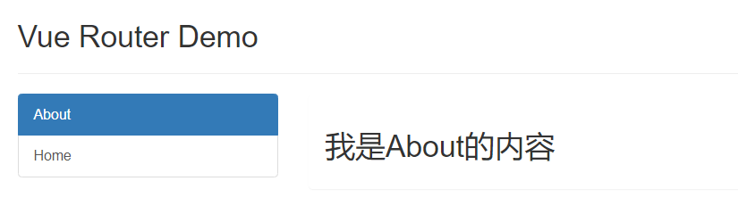

### 2.2 案例准备

#### 2.2.1 静态页面

```html
<html lang="en">
<head>
  <meta charset="utf-8">
  <title>Vue App</title>
  <link rel="stylesheet" href="./css/bootstrap.css">
</head>
<body>
  <div>
    <div class="row">
      <div class="col-xs-offset-2 col-xs-8">
        <div class="page-header"><h2>Vue Router Demo</h2></div>
      </div>
    </div>
    <div class="row">
      <div class="col-xs-2 col-xs-offset-2">
        <div class="list-group">
          <a class="list-group-item active" href="./about.html">About</a>
          <a class="list-group-item" href="./home.html">Home</a>
        </div>
      </div>
      <div class="col-xs-6">
        <div class="panel">
          <div class="panel-body">
            <h2>我是About的内容</h2>
          </div>
        </div>
      </div>
    </div>
  </div>
</body>
</html>
```

#### 2.2.2 文件目录结构


#### 2.2.3 index.js中引入bootstrap

```html
    <!-- 引入第三方css样式 bootstrap -->
    <link rel="stylesheet" href="<%= BASE_URL %>css/bootstrap.css">
```

#### 2.2.4 组件的拆分

main.js

```js
import Vue from 'vue'
import App from './App.vue'

//关闭vue的生产提示
Vue.config.productionTip = false

new Vue({
  render: h => h(App),
}).$mount('#app')
```

App.vue

```html
<template>
  <div>
    <!-- 使用子组件 -->
    <div class="row">
      <div class="col-xs-offset-2 col-xs-8">
        <div class="page-header">
          <h2>Vue Router Demo</h2>
        </div>
      </div>
    </div>
    <div class="row">
      <div class="col-xs-2 col-xs-offset-2">
        <div class="list-group">
          <a class="list-group-item active" href="./about.html">About</a>
          <a class="list-group-item" href="./home.html">Home</a>
        </div>
      </div>
      <div class="col-xs-6">
        <div class="panel">
          <div class="panel-body">
            <h2>点击导航后切换内容区</h2>
          </div>
        </div>
      </div>
    </div>
  </div>
</template>

<script>
// 导入子组件

export default {
  name: 'App',
  // 注册子组件
  components: {

  }
}
</script>
```

Home.vue

```html
<template>
  <div>
    <h2>Home组件</h2>
  </div>
</template>

<script>
export default {
  name: 'Home'
}
</script>

<style>

</style>
```

About.vue

```html
<template>
  <div>
    <h2>About组件</h2>
  </div>
</template>

<script>
export default {
  name: 'About'
}
</script>

<style>

</style>
```

### 2.3 安装 vue-router

> 注意： vue-router 3.x 结合 vue2 进行使用，[vue-router 3.x 的官方文档地址](https://v3.router.vuejs.org/zh/) vue-router 4.x 结合 vue3 进行使用，[vue-router 4.x 的官方文档地址](https://router.vuejs.org/zh/)

> 这里vue的版本为2.x，所以安装vue-router的3.x版本

```npm
npm i vue-router@3
```

### 2.4 引入与使用 vue-router 插件

> 由于 vue-router 是 vue 中的一个插件，所以使用 vue-router 需要先引入和使用 vue-router。

```js
// 引入 vue-router
import VueRouter from 'vue-router'

// 使用 vue-router 插件
Vue.use(VueRouter)
```

> 在引入和使用 vue-router 之后，实例化 vue 实例对象时可以传入一个配置项 router。

### 2.5 新建文件夹创建路由器

目录结构： 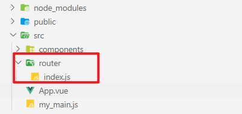 router/index.js

```js
// 该文件专门用于创建整个应用的路由器
import VueRouter from 'vue-router'
//引入组件
import About from '../components/About'
import Home from '../components/Home'

//创建并暴露一个路由器
export default new VueRouter({
	// 路由，地址与组件的对应关系
	routes:[
		{
			path:'/about',
			component:About
		},
		{
			path:'/home',
			component:Home
		}
	]
})
```

### 2.6 引入并配置路由器

main.js

```js
import Vue from 'vue'
import App from './App.vue'
// 引入 vue-router
import VueRouter from 'vue-router'
// 引入路由器
import router from './router'

// 使用 vue-router 插件
Vue.use(VueRouter)

//关闭vue的生产提示
Vue.config.productionTip = false

new Vue({
  render: h => h(App),
  // 配置路由器
  router: router
}).$mount('#app')
```

### 2.7 实现导航区地址修改

实现导航区地址的修改，需要使用 vue-router 提供的标签 `<router-link ></router-link>`，跳转到的地址通过 router-link 标签上的 to 属性指定。

> 跳转到的路由地址需要与路由器中配置的一致 激活时的样式可以通过 active-class 属性指定

```html
	<div class="col-xs-2 col-xs-offset-2">
        <div class="list-group">
          <!-- 原始html中使用a标签实现页面的跳转 -->
          <!-- <a class="list-group-item active" href="./about.html">About</a> -->
          <!-- <a class="list-group-item" href="./home.html">Home</a> -->
          
          <!-- Vue中借助router-link标签实现路由的切换 -->
          <!-- 跳转到的路由地址需要与路由器中配置的一致 -->
          <!-- 通过 active-class 属性指定激活时的样式 -->
          <router-link class="list-group-item" active-class="active" to="/about">About</router-link>
          <router-link class="list-group-item" active-class="active" to="/home">Home</router-link>
        </div>
      </div>
```

>  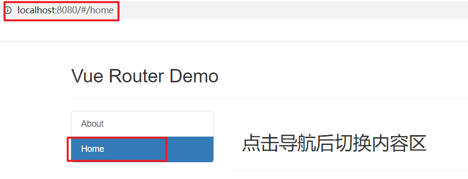

### 2.8 当前路由对应的组件的呈现

指定当前路由对应组件呈现的位置使用 router-view 标签。

```html
	<div class="col-xs-6">
        <div class="panel">
          <div class="panel-body">
			<!-- <h2>点击导航后切换内容区</h2> -->
			
            <!-- 指定当前路由对应组件的呈现位置 -->
            <router-view></router-view>
          </div>
        </div>
      </div>
```

> 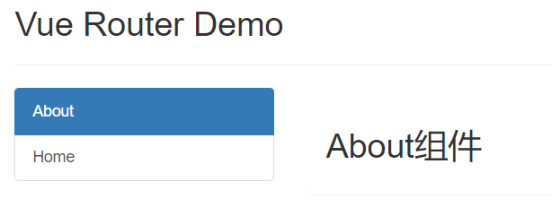 

## 3. 几个注意点

1. 路由组件通常存放在`pages`文件夹，一般组件通常存放在`components`文件夹。
2. 通过切换，“隐藏”了的路由组件，默认是被销毁掉的，需要的时候再去挂载。
3. 每个组件都有自己的`$route`属性，里面存储着自己的路由信息。
4. 整个应用共用一个router，可以通过组件的`$router`属性获取到。

## 4. 总结 路由及路由的基本使用

### 4.1 路由

1. 理解： 一个路由（route）就是一组映射关系（key - value），多个路由需要路由器（router）进行管理。
2. 前端路由：key是路径，value是组件。

### 4.2 基本使用

1. 安装vue-router，命令：`npm i vue-router`

2. 应用插件：`Vue.use(VueRouter)`

3. 编写router配置项:

   ```js
   //引入VueRouter
   import VueRouter from 'vue-router'
   //引入Luyou 组件
   import About from '../components/About'
   import Home from '../components/Home'
   
   //创建router实例对象，去管理一组一组的路由规则
   const router = new VueRouter({
   	routes:[
   		{
   			path:'/about',
   			component:About
   		},
   		{
   			path:'/home',
   			component:Home
   		}
   	]
   })
   
   //暴露router
   export default router
   ```

4. 实现切换（active-class可配置高亮样式）

   ```vue
   <router-link active-class="active" to="/about">About</router-link>
   ```

5. 指定展示位置

   ```vue
   <router-view></router-view>
   ```

# 41.嵌套(多级)路由

## 1. 静态页面

```html
<html lang="en">
<head>
  <meta charset="utf-8">
  <title>Vue App</title>
  <link rel="stylesheet" href="./css/bootstrap.css">
</head>
<body>
<div id="root">
  <div>
    <div class="row">
      <div class="col-xs-offset-2 col-xs-8">
        <div class="page-header"><h2>Vue Router Demo</h2></div>
      </div>
    </div>
    <div class="row">
      <div class="col-xs-2 col-xs-offset-2">
        <div class="list-group">
          <a class="list-group-item" href="/about">About</a>
          <a class="list-group-item active"href="/home" aria-current="page">Home</a>
        </div>
      </div>
      <div class="col-xs-6">
        <div class="panel">
          <div class="panel-body">
            <div>
              <h2>Home组件内容</h2>
              <div>
                <ul class="nav nav-tabs">
                  <li>
                    <a class="list-group-item" href="./home-news.html">News</a>
                  </li>
                  <li>
                    <a class="list-group-item active" href="./home-message.html">Message</a>
                  </li>
                </ul>
                <div>
                  <ul>
                    <li>
                      <a href="/message1">message001</a>&nbsp;&nbsp;
                    </li>
                    <li>
                      <a href="/message2">message002</a>&nbsp;&nbsp;
                    </li>
                    <li>
                      <a href="/message/3">message003</a>&nbsp;&nbsp;
                    </li>
                  </ul>
                </div>
              </div>
            </div>
          </div>
        </div>
      </div>
    </div>
  </div>
</div>
</body>
</html>
```

> 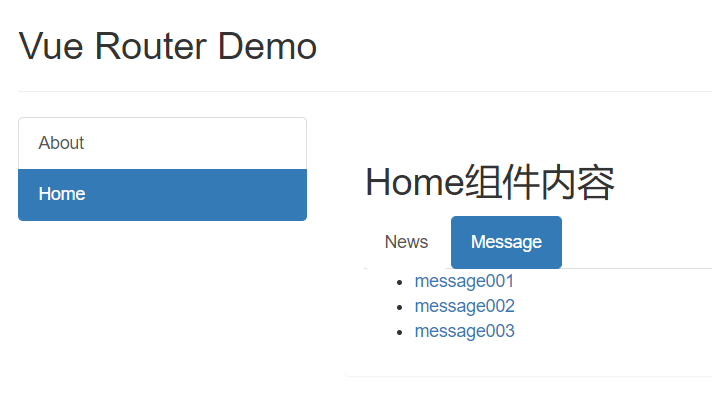

## 2. 组件的拆分

### 2.1 目录结构

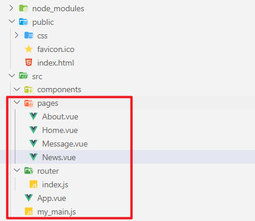

### 2.2 组件

Home.vue

```html
<template>
  <div>
    <h2>Home组件</h2>
    <ul class="nav nav-tabs">
      <li>
        <a class="list-group-item" href="./home-news.html">News</a>
      </li>
      <li>
        <a class="list-group-item active" href="./home-message.html">Message</a>
      </li>
    </ul>
    <div>
      ???????????
    </div>
  </div>
</template>

<script>
export default {
  name: 'Home'
}
</script>

<style>
</style>
```

Message.vue

```html
<template>
  <div>
    <ul>
      <li>
        <a href="/message1">message001</a>&nbsp;&nbsp;
      </li>
      <li>
        <a href="/message2">message002</a>&nbsp;&nbsp;
      </li>
      <li>
        <a href="/message/3">message003</a>&nbsp;&nbsp;
      </li>
    </ul>
  </div>
</template>

<script>
export default {
  name: 'Message'
}
</script>

<style>
</style>
```

News.vue

```html
<template>
  <div>
    <ul>
      <li>news001</li>
      <li>news002</li>
      <li>news003</li>
    </ul>
  </div>
</template>

<script>
export default {
  name: 'News'
}
</script>

<style>
</style>
```

About.vue

```html
<template>
  <div>
    <h2>About组件</h2>
  </div>
</template>

<script>
export default {
  name: 'About'
}
</script>

<style>

</style>
```

## 3. 嵌套路由的配置

子路由写在父级路由的 children 配置项相中，在子路由中路径不用写 `/` 。

router/index.js

```js
// 该文件专门用于创建整个应用的路由器
import VueRouter from 'vue-router'
//引入组件
import About from '../pages/About'
import Home from '../pages/Home'
import Message from '../pages/Message'
import News from '../pages/News'

//创建并暴露一个路由器
export default new VueRouter({
  routes: [
    {
      path: '/about',
      component: About
    },
    {
      path: '/home',
      component: Home,
      // Home下的子路由
      children: [
        { path: 'news', component: News },
        { path: 'message', component: Message }
      ]
    }
  ]
})
```

> 在页面中路由进行跳转时，路径需要书写完整。即`/父级路由路径/子路由路径`

Home.vue

```html
<template>
  <div>
    <h2>Home组件</h2>
    <ul class="nav nav-tabs">
      <li>
        <!-- Vue中借助router-link标签实现路由的切换 -->
        <router-link class="list-group-item" active-class="active" to="/home/news">News</router-link>
      </li>
      <li>
        <!-- Vue中借助router-link标签实现路由的切换 -->
        <router-link class="list-group-item" active-class="active" to="/home/message">Message</router-link>
      </li>
    </ul>
    <div>
      <!-- 指定当前路由对应组件的呈现位置 -->
      <router-view></router-view>
    </div>
  </div>
</template>

<script>
export default {
  name: 'Home'
}
</script>

<style>
</style>
```

> 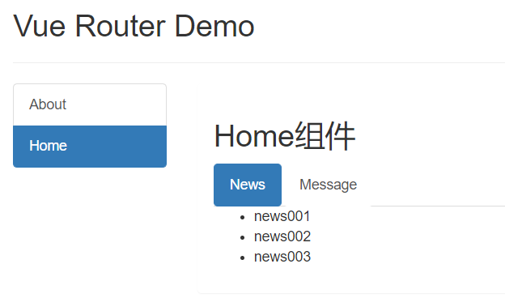 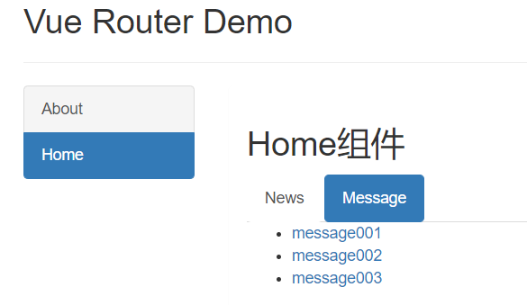

## 4. 总结 嵌套(多级)路由

1. 配置路由规则，使用children配置项：

   ```js
   routes:[
   	{
   		path:'/about',
   		component:About,
   	},
   	{
   		path:'/home',
   		component:Home,
   		children:[ //通过children配置子级路由
   			{
   				path:'news', //此处一定不要写：/news
   				component:News
   			},
   			{
   				path:'message',//此处一定不要写：/message
   				component:Message
   			}
   		]
   	}
   ]
   ```

2. 跳转（要写完整路径）：

   ```vue
   <router-link to="/home/news">News</router-link>
   ```

# 42.路由传参 & 命名路由

## 1. 页面组件

### 1.1 目录结构

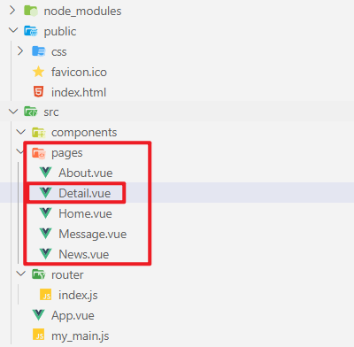

### 1.3 路由配置

```js
// 该文件专门用于创建整个应用的路由器
import VueRouter from 'vue-router'
//引入组件
import About from '../pages/About'
import Home from '../pages/Home'
import Message from '../pages/Message'
import News from '../pages/News'
import Detail from '../pages/Detail'

//创建并暴露一个路由器
export default new VueRouter({
  routes: [
    { path: '/about', component: About },
    {
      path: '/home',
      component: Home,
      children: [
        { path: 'news', component: News },
        {
          path: 'message',
          component: Message,
          children: [
            { path: 'detail', component: Detail }
          ]
        }
      ]
    }
  ]
})
```

### 1.2 组件

Home.vue

```html
<template>
  <div>
    <h2>Home组件</h2>
    <ul class="nav nav-tabs">
      <li>
        <router-link class="list-group-item" active-class="active" to="/home/news">News</router-link>
      </li>
      <li>
        <router-link class="list-group-item" active-class="active" to="/home/message">Message</router-link>
      </li>
    </ul>
    <div>
      <router-view></router-view>
    </div>
  </div>
</template>

<script>
export default {
  name: 'Home'
}
</script>

<style>
</style>
```

Message.vue

```html
<template>
  <div>
    <ul>
      <li v-for="m in messageList" :key="m.id">
        <router-link to="/home/message/detail">{{m.title}}</router-link>&nbsp;&nbsp;
      </li>
    </ul>
    <hr>
    <router-view></router-view>
  </div>
</template>

<script>
export default {
  name: 'Message',
  data() {
    return {
      messageList: [
        {id: '001', title: '消息001'},
        {id: '002', title: '消息002'},
        {id: '003', title: '消息003'},
      ]
    }
  },
}
</script>

<style>
</style>
```

Detail.vue

```html
<template>
  <div>
    <ul>
      <li>消息编号: {{}}</li>
      <li>消息标题: {{}}</li>
    </ul>
  </div>
</template>

<script>
export default {
  name: 'Detail'
}
</script>

<style>
</style>
```

> 

## 2. 路由 query 传参

### 2.1 使用 query 传参

#### 2.1.1 to 的字符串写法

```html
    <ul>
      <li v-for="m in messageList" :key="m.id">
        <router-link :to="`/home/message/detail?id=${m.id}&title=${m.title}`">{{m.title}}</router-link>&nbsp;&nbsp;
      </li>
    </ul>
```

#### 2.1.2 to 的对象写法

```html
    <ul>
      <li v-for="m in messageList" :key="m.id">
        <!-- <router-link :to="`/home/message/detail?id=${m.id}&title=${m.title}`">{{m.title}}</router-link>&nbsp;&nbsp; -->
        <router-link :to="{
          path: '/home/message/detail',
          query: {
            id: m.id,
            title: m.title
          }
        }">
          {{m.title}}
        </router-link>
        &nbsp;&nbsp;
      </li>
    </ul>
```

### 2.2 组件接收 query 参数

在路由跳转时通过 query 进行传参，传递的参数会被存放在组件实例对象的 `$route` 属性上。

Detail.vue

```html
<template>
  <div>
    <ul>
      <li>消息编号: {{}}</li>
      <li>消息标题: {{}}</li>
    </ul>
  </div>
</template>

<script>
export default {
  name: 'Detail',
  mounted() {
    console.log(this.$route)
  }
}
</script>

<style>
</style>
```

> 

Detail.vue

```html
<template>
  <div>
    <ul>
      <li>消息编号: {{$route.query.id}}</li>
      <li>消息标题: {{$route.query.title}}</li>
    </ul>
  </div>
</template>
```

> 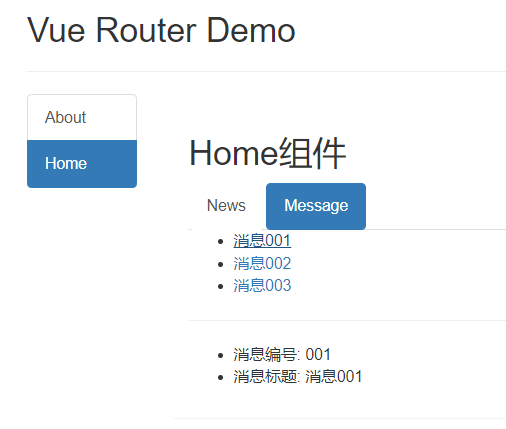

### 2.3 总结 路由 query 传参

1. 传递参数

   ```html
   <!-- 跳转并携带query参数，to的字符串写法 -->
   <router-link :to="/home/message/detail?id=666&title=你好">跳转</router-link>
   				
   <!-- 跳转并携带query参数，to的对象写法 -->
   <router-link 
   	:to="{
   		path:'/home/message/detail',
   		query:{
   		   id:666,
               title:'你好'
   		}
   	}"
   >跳转</router-link>
   ```

2. 接收参数：

   ```js
   $route.query.id
   $route.query.title
   ```

## 3. 命名路由

命名路由可以简化使用路由进行跳转时路径的写法。

### 3.1 配置命名路由

设置命名路由，在配置路由时，为路由添加一个 name 配置项。

router/index.js

```js
// 该文件专门用于创建整个应用的路由器
import VueRouter from 'vue-router'
//引入组件
import About from '../pages/About'
import Home from '../pages/Home'
import Message from '../pages/Message'
import News from '../pages/News'
import Detail from '../pages/Detail'

//创建并暴露一个路由器
export default new VueRouter({
  routes: [
    {
      name: 'about',
      path: '/about',
      component: About
    },
    {
      name: 'home',
      path: '/home',
      component: Home,
      children: [
        {
          name: 'news',
          path: 'news',
          component: News
        },
        {
          name: 'message',
          path: 'message',
          component: Message,
          children: [
            {
              name: 'messageDetail',
              path: 'detail',
              component: Detail
            }
          ]
        }
      ]
    }
  ]
})
```

### 3.2 使用命名路由

使用命名路由时，router-link 标签的 to 属性需要使用对象写法，在对象写法中，使用name 替代原来的 path。

Message.vue

```html
<router-link :to="{
  name: 'messageDetail',
  query: {
    id: m.id,
    title: m.title
  }
}">
  {{m.title}}
</router-link>
```

> 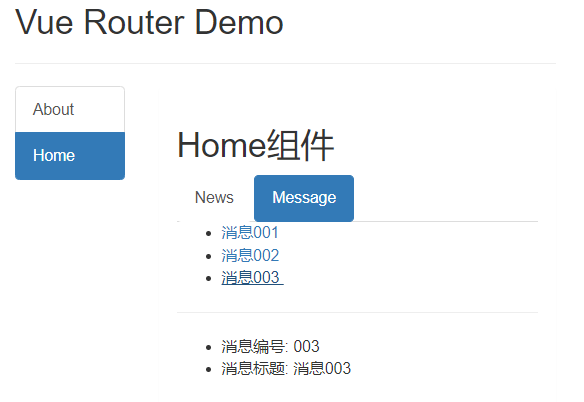

### 3.3 总结 命名路由

1. 作用：可以简化路由的跳转。

2. 如何使用

   1. 给路由命名：

      ```js
      {
      	path:'/demo',
      	component:Demo,
      	children:[
      		{
      			path:'test',
      			component:Test,
      			children:[
      				{
                            name:'hello' //给路由命名
      					path:'welcome',
      					component:Hello,
      				}
      			]
      		}
      	]
      }
      ```

   2. 简化跳转：

      ```html
      <!--简化前，需要写完整的路径 -->
      <router-link to="/demo/test/welcome">跳转</router-link>
      
      <!--简化后，直接通过名字跳转 -->
      <router-link :to="{name:'hello'}">跳转</router-link>
      
      <!--简化写法配合传递参数 -->
      <router-link 
      	:to="{
      		name:'hello',
      		query:{
      		   id:666,
                  title:'你好'
      		}
      	}"
      >跳转</router-link>
      ```

## 4. 路由 params 传参

### 4.1 使用 params 参数

#### 4.1.1 设置路由地址占位符

router/index.js

```js
        {
          name: 'message',
          path: 'message',
          component: Message,
          children: [
            {
              name: 'messageDetail',
              // :id :title 均为params参数的占位
              path: 'detail/:id/:title',
              component: Detail
            }
          ]
        }
```

#### 4.1.2 params 参数字符串写法

```html
    <ul>
      <li v-for="m in messageList" :key="m.id">
        <router-link :to="`/home/message/detail/${m.id}/${m.title}`">{{m.title}}</router-link>&nbsp;&nbsp;
          {{m.title}}
        </router-link>
        &nbsp;&nbsp;
      </li>
    </ul>
```

#### 4.1.3 params 参数对象写法

> 注意：使用 params 进行传参时，路由地址**不能使用 path，只能使用 name**。即 params 进行传参时使用对象写法只能使用命名路由。

```html
    <ul>
      <li v-for="m in messageList" :key="m.id">
        <!-- <router-link :to="`/home/message/detail/${m.id}/${m.title}`">{{m.title}}</router-link>&nbsp;&nbsp; -->
        <router-link :to="{
          name: 'messageDetail',
          params: {
            id: m.id,
            title: m.title
          }
        }">
          {{m.title}}
        </router-link>
        &nbsp;&nbsp;
      </li>
    </ul>
```

### 4.2 组件接收 params 参数

在路由跳转时通过 params 进行传参，传递的参数会被存放在组件实例对象的 `$route` 属性上。

```html
<template>
  <div>
    <ul>
      <li>消息编号: {{$route.params.id}}</li>
      <li>消息标题: {{$route.params.title}}</li>
    </ul>
  </div>
</template>

<script>
export default {
  name: 'Detail',
  mounted() {
    console.log(this.$route)
  }
}
</script>

<style>
</style>
```

> 

### 4.3 总结 路由 params 传参

1. 配置路由，声明接收params参数

   ```js
   {
   	path:'/home',
   	component:Home,
   	children:[
   		{
   			path:'news',
   			component:News
   		},
   		{
   			component:Message,
   			children:[
   				{
   					name:'xiangqing',
   					path:'detail/:id/:title', //使用占位符声明接收params参数
   					component:Detail
   				}
   			]
   		}
   	]
   }
   ```

2. 传递参数

   ```html
   <!-- 跳转并携带params参数，to的字符串写法 -->
   <router-link :to="/home/message/detail/666/你好">跳转</router-link>
   				
   <!-- 跳转并携带params参数，to的对象写法 -->
   <router-link 
   	:to="{
   		name:'xiangqing',
   		params:{
   		   id:666,
               title:'你好'
   		}
   	}"
   >跳转</router-link>
   ```

   > 特别注意：路由携带params参数时，若使用to的对象写法，则不能使用path配置项，必须使用name配置！

3. 接收参数：

   ```js
   $route.params.id
   $route.params.title
   ```

## 5. 路由的 props 配置

### 5.1 第一种写法：props值为对象

该对象中所有的key-value的组合最终都会通过props传给组件

> 但是这种写法传递的数据为死数据

router/index.js

```js
        {
          name: 'message',
          path: 'message',
          component: Message,
          children: [
            {
              name: 'messageDetail',
              // :id :title 均为params参数的占位
              path: 'detail/:id/:title',
              component: Detail,
              props: {a: 900, b: 1212}
            }
          ]
        }
```

Detail.vue

```html
<template>
  <div>
    <ul>
      <li>消息编号: {{$route.params.id}}</li>
      <li>消息标题: {{$route.params.title}}</li>
      <li>a: {{a}}</li>
      <li>b: {{b}}</li>
    </ul>
  </div>
</template>

<script>
export default {
  name: 'Detail',
  props: ['a', 'b'],
  mounted() {
    console.log(this.$route)
  }
}
</script>

<style>
</style>
```

> 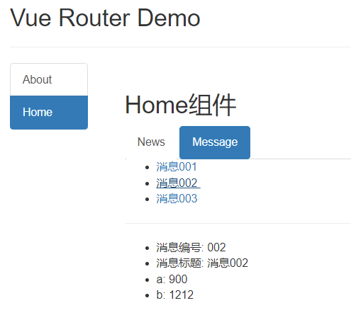

### 5.2 第二种写法：props值为布尔值

布尔值为true，则把路由收到的所有params参数通过props传给组件。

router/index.js

```js
        {
          name: 'message',
          path: 'message',
          component: Message,
          children: [
            {
              name: 'messageDetail',
              // :id :title 均为params参数的占位
              path: 'detail/:id/:title',
              component: Detail,
              // props: {a: 900, b: 1212}
              props: true
            }
          ]
        }
```

Detail.vue

```html
<template>
  <div>
    <ul>
      <li>消息编号: {{id}}</li>
      <li>消息标题: {{title}}</li>
    </ul>
  </div>
</template>

<script>
export default {
  name: 'Detail',
  props: ['id', 'title'],
  mounted() {
    console.log(this.$route)
  }
}
</script>

<style>
</style>
```

> 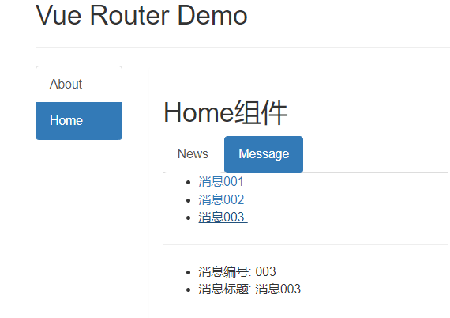

### 5.3 第三种写法：props值为函数

该函数返回的对象中每一组key-value都会通过props传给组件

Detail.vue

> 使用 query 传参

```html
        <router-link :to="{
          name: 'messageDetail',
          query: {
            id: m.id,
            title: m.title
          }
        }">
          {{m.title}}
        </router-link>
```

router/index.js

```js
        {
          name: 'message',
          path: 'message',
          component: Message,
          children: [
            {
              name: 'messageDetail',
              // :id :title 均为params参数的占位
              path: 'detail',
              component: Detail,
              // props: {a: 900, b: 1212}
              // props: true
              props($route) {
                return {
                  id: $route.query.id,
                  title: $route.query.title
                }
              },
              // 直接从 $route 中解构出 query
              // props({query}) {
              //   return {
              //     id: query.id,
              //     title: query.title
              //   }
              // }
            }
          ]
        }
```

Detail.vue

```html
<template>
  <div>
    <ul>
      <li>消息编号: {{id}}</li>
      <li>消息标题: {{title}}</li>
    </ul>
  </div>
</template>

<script>
export default {
  name: 'Detail',
  props: ['id', 'title'],
  mounted() {
    console.log(this.$route)
  }
}
</script>

<style>
</style>
```

> 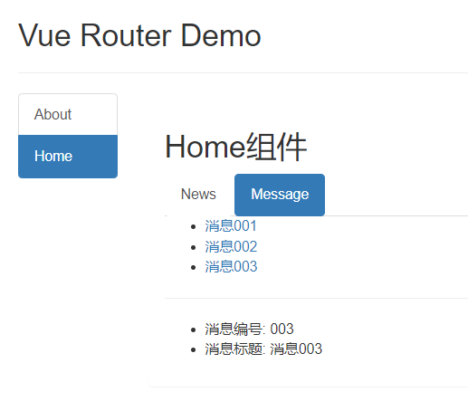

### 5.4 总结 路由的 props 配置

 作用：让路由组件更方便的收到参数

```js
{
	name:'xiangqing',
	path:'detail/:id',
	component:Detail,

	//第一种写法：props值为对象，该对象中所有的key-value的组合最终都会通过props传给Detail组件
	// props:{a:900}

	//第二种写法：props值为布尔值，布尔值为true，则把路由收到的所有params参数通过props传给Detail组件
	// props:true
	
	//第三种写法：props值为函数，该函数返回的对象中每一组key-value都会通过props传给Detail组件
	props(route){
		return {
			id:route.query.id,
			title:route.query.title
		}
	}
}
```

## 6. `<router-link>`的replace属性

1. 作用：控制路由跳转时操作浏览器历史记录的模式
2. 浏览器的历史记录有两种写入方式：分别为`push`和`replace`，`push`是追加历史记录，`replace`是替换当前记录。路由跳转时候默认为`push`
3. 如何开启`replace`模式：`<router-link replace .......>News</router-link>`

# 43.编程式路由导航

## 1. 声明式导航 & 编程式导航

### 1.1 声明式导航

通过点击链接实现导航的方式，叫做声明式导航。

例如： 普通网页中点击`<a>`链接、vue 项目中点击 `<router-link>`都属于声明式导航。

### 1.2 编程式导航

通过调用 API 方法实现导航的方式，叫做编程式导航。

例如： 普通网页中调用 location.href 跳转到新页面的方式，属于编程式导航。

## 2. vue-router 中的编程式导航 API

vue-router 提供了许多编程式导航的 API，vue-router 提供的编程式导航 API 都在 **vue-router 的原型对象上。** 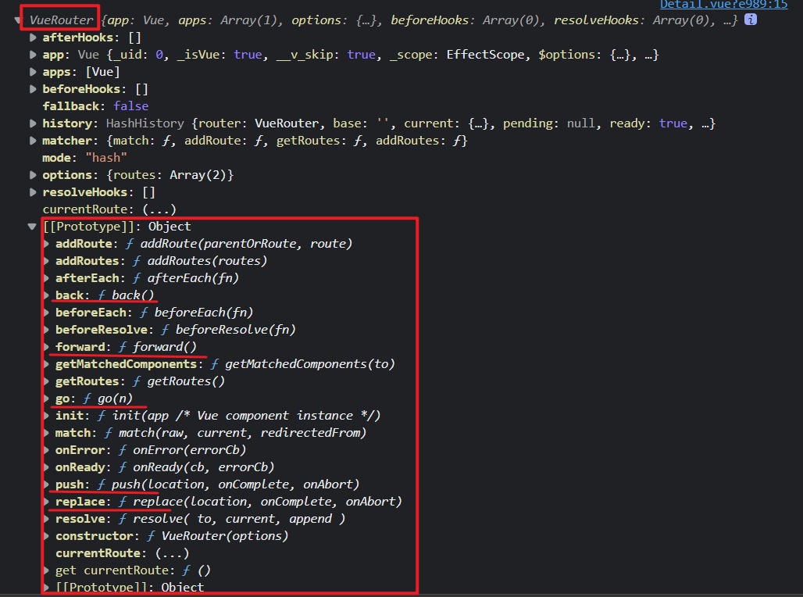

### 2.1 常用的编程式导航 API

1. `$router.push(地址)` 跳转到指定 hash 地址，并增加一条历史记录
2. `$router.replace(地址)` 跳转到指定的 hash 地址，并替换掉当前的历史记录
3. `$router.go(数值 n)` 实现导航历史前进、后退，n 为前进或后退的次数
4. `$router.back()` 在历史记录中，后退到上一个页面
5. `$router.forward()` 在历史记录中，前进到下一个页面

### 2.2 $router.push与$router.replace

调用 `$router.push()`方法或`$router.replace()`方法，可以跳转到指定的地址，从而展示对应的组件页面。

push 和 replace 的区别：

> push 会增加一条历史记录 replace 不会增加历史记录，而是替换掉当前的历史记录

```html
<template>
  <div class="home-container">
    <h3>Home 组件</h3>

    <hr />

    <button @click="gotoLk">通过 push 跳转到“洛基”页面</button>
    <button @click="gotoLk2">通过 replace 跳转到“洛基”页面</button>
  </div>
</template>

<script>
export default {
  name: 'Home',
  methods: {
    gotoLk() {
      // 通过编程式导航 API，导航跳转到指定的页面
      this.$router.push('/movie/1')
    },
    gotoLk2() {
    	// 通过编程式导航 API，导航跳转到指定的页面
      	this.$router.replace('/movie/1')
    }
  }
}
</script>

<style lang="less" scoped>
.home-container {
  min-height: 200px;
  background-color: pink;
  padding: 15px;
}
</style>
```

### 2.3 $router.go

调用 `$router.go()`方法，可以在浏览历史中前进和后退。`$router.go()`方法通过参数指定前进或后退的次数。参数为正数表示前进，参数为负数表示后退。

```html
<template>
  <div class="movie-container">
    <!-- this.$route 是路由的“参数对象” -->
    <!-- this.$router 是路由的“导航对象” -->
    <h3>Movie 组件 --- {{ $route.params.mid }} --- {{ mid }}</h3>
    <button @click="showThis">打印 this</button>
    <button @click="goback">后退</button>
  </div>
</template>

<script>
export default {
  name: 'Movie',
  // 接收 props 数据
  props: ['mid'],
  methods: {
    showThis() {
      console.log(this)
    },
    goback() {
      // go(-1) 表示后退一层
      // 如果后退的层数超过上限，则原地不动
      this.$router.go(-1)
    }
  }
}
</script>

<style lang="less" scoped>
.movie-container {
  min-height: 200px;
  background-color: lightsalmon;
  padding: 15px;
}
</style>
```

### 2.4 $router.back() & $router.forward()

在实际开发中，一般只会前进和后退一层页面。因此 vue-router 提供了如下两个便捷方法：`$router.back()` & `$router.forward()`

- `$router.back()` ：在历史记录中，后退到上一个页面
- `$router.forward()` ：在历史记录中，前进到下一个页面

```html
<template>
  <div class="movie-container">
    <!-- this.$route 是路由的“参数对象” -->
    <!-- this.$router 是路由的“导航对象” -->
    <h3>Movie 组件 --- {{ $route.params.mid }} --- {{ mid }}</h3>
    <button @click="showThis">打印 this</button>
    <button @click="goback">后退</button>
    <!-- 在行内使用编程式导航跳转的时候，this 必须要省略，否则会报错！ -->
    <button @click="$router.back()">back 后退</button>
    <button @click="$router.forward()">forward 前进</button>
  </div>
</template>

<script>
export default {
  name: 'Movie',
  // 接收 props 数据
  props: ['mid'],
  methods: {
    showThis() {
      console.log(this)
    },
    goback() {
      // go(-1) 表示后退一层
      // 如果后退的层数超过上限，则原地不动
      this.$router.go(-1)
    }
  }
}
</script>

<style lang="less" scoped>
.movie-container {
  min-height: 200px;
  background-color: lightsalmon;
  padding: 15px;
}
</style>
```

## 3. 总结 编程式路由导航

1. 作用：不借助`<router-link>`实现路由跳转，让路由跳转更加灵活

2. 具体编码：

   ```js
   //$router的两个API
   this.$router.push({
   	name:'xiangqing',
       params:{
           id:xxx,
           title:xxx
       }
   })
   
   this.$router.replace({
   	name:'xiangqing',
       params:{
           id:xxx,
           title:xxx
       }
   })
   this.$router.forward() //前进
   this.$router.back() //后退
   this.$router.go() //可前进也可后退
   ```

# 44.缓存路由组件 & activated()与deactivated()

## 1. 缓存路由组件

默认情况下，进行路由的切换原来展示在页面上的组件会被销毁，新的组件会被挂载在页面上。由于每次通过路由切换组件，原来的组件都会被销毁，所以原来组件中的状态将不被保留，即每次展示在页面上的都是一个全新的被创建的组件实例对象。

> 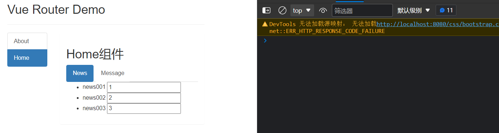 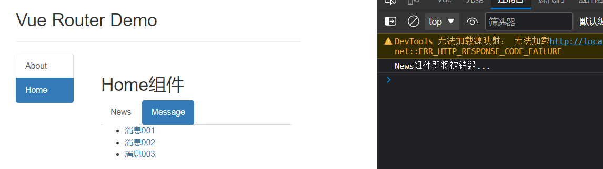 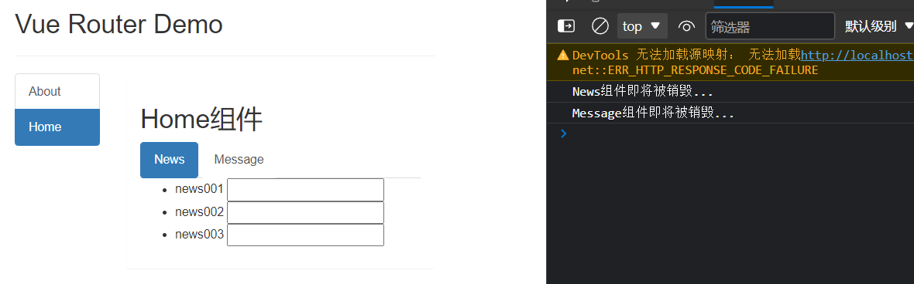

如果需要在通过路由切换组件时，将原来的组件进行保留，使得在切换组件时原来的组件不被销毁，需要使用 `keep-alive` 标签将组件的展示区域的 `router-view` 标签进行包裹。

```html
<template>
  <div>
    <h2>Home组件</h2>
    <ul class="nav nav-tabs">
      <li>
        <router-link class="list-group-item" active-class="active" to="/home/news">News</router-link>
      </li>
      <li>
        <router-link class="list-group-item" active-class="active" to="/home/message">Message</router-link>
      </li>
    </ul>
    <div>
      <!-- 展示在该区域的组件不会被销毁，会被保留 -->
      <keep-alive>
        <router-view></router-view>
      </keep-alive>
    </div>
  </div>
</template>
```

> 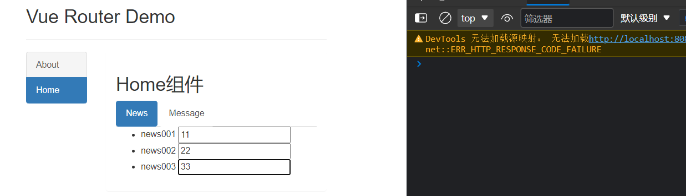 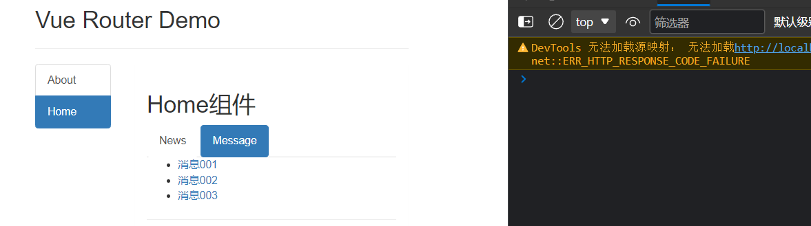 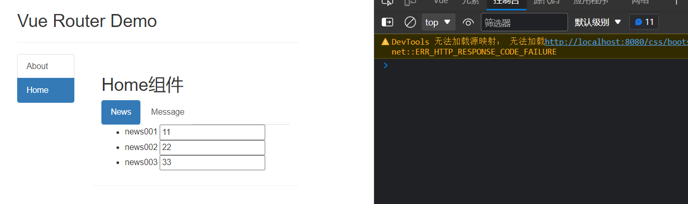

默认情况下，如果只是单纯的使用 `keep-alive` 标签将 `router-view` 标签进行包裹，则展示在该区域的所有组件都将会被保留下来，不会被销毁。

如果需要指定保留的组件，则需要在 `keep-alive` 标签中使用 `include` 属性指定需要保留的组件，使用 include 属性之后只有指定的组件会被保留。

> 注意：include 属性中写的是组件名 name

```html
    <div>
      <keep-alive include="News">
        <router-view></router-view>
      </keep-alive>
    </div>
```

> 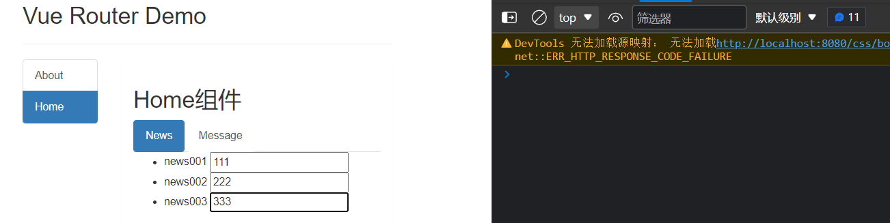 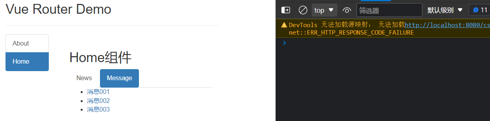 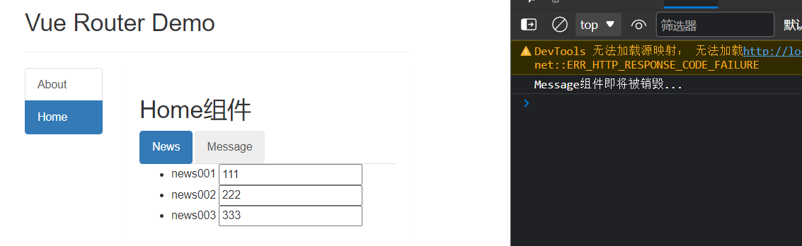

> 如果需要指定保留多个组件不被销毁，使用属性绑定指令数组形式的写法：
>
> ```html
> <div>
>   <keep-alive :include="['News', 'Message']">
>     <router-view></router-view>
>   </keep-alive>
> </div>
> ```

## 2. 总结 缓存路由组件

1. 作用：让不展示的路由组件保持挂载，不被销毁。

2. 具体编码：

   ```html
   单个组件
   <keep-alive include="News"> 
       <router-view></router-view>
   </keep-alive>
   
   多个组件
    <keep-alive :include="['News', 'Message']">
      <router-view></router-view>
    </keep-alive>
   ```

## 3. activated()与deactivated()

activated()与deactivated()是两个生命周期钩子(生命周期函数)。

activated()与deactivated()是路由组件所独有的两个生命周期钩子，用于捕获路由组件的激活状态。

- `activated`路由组件被激活时触发。
- `deactivated`路由组件失活时触发。

> 当前页面显示的是哪个组件，那个组件就被激活

# 45.路由守卫

## 1. 路由守卫

### 1.1 概念

路由守卫能够对路由进行权限控制，即在路由进行改变时，可以判断当前能否访问路由对应的组件。

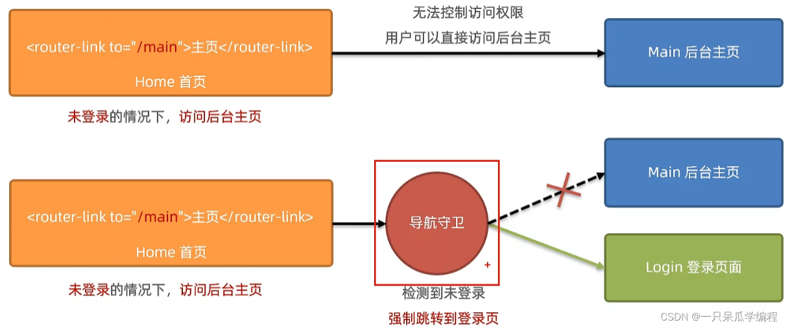

### 1.2 分类

路由守卫分为：全局守卫、独享守卫、组件内守卫。

## 2. 全局路由守卫

### 2.1 全局前置路由守卫

全局前置路由守卫会在初始化时被触发，在每次进行路由的切换前也会被触发。

```js
// 全局前置路由守卫
// 在初始化时被触发，在每次进行路由的切换前也会被触发
// 全局前置路由守卫的回调函数接收三个参数
// to：表示将要访问的路由的信息对象
// from：表示将要离开的路由的信息对象
// next：是一个函数，表示放行的意思，调用next()才可以访问to的路由
router.beforeEach((to, from, next) => {
  
})
router.beforeEach((to, from, next) => {
  console.log(to, from)
})
```

> 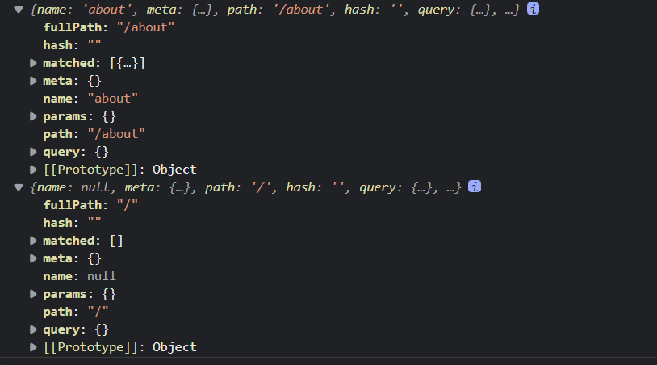

实现如果localStorage中存在school的值为SGG则可以对News组件和Message组件进行访问，如果school的值不为SGG则不能进行访问。其他组件可以不用判断直接放行。

router/index.js

```js
// 该文件专门用于创建整个应用的路由器
import VueRouter from 'vue-router'
//引入组件
import About from '../pages/About'
import Home from '../pages/Home'
import Message from '../pages/Message'
import News from '../pages/News'
import Detail from '../pages/Detail'

// 创建一个路由器
// 路由器的暴露需要在路由守卫之后，
// 否则路由守卫不会触发(路由守卫控制权限之前路由器已经被暴露出去了)
const router = new VueRouter({
  routes: [
    {
      name: 'about',
      path: '/about',
      component: About
    },
    {
      name: 'home',
      path: '/home',
      component: Home,
      children: [
        {
          name: 'news',
          path: 'news',
          component: News
        },
        {
          name: 'message',
          path: 'message',
          component: Message,
          children: [
            {
              name: 'messageDetail',
              path: 'detail',
              component: Detail,
              props($route) {
                return {
                  id: $route.query.id,
                  title: $route.query.title
                }
              },
            }
          ]
        }
      ]
    }
  ]
})

// 全局前置路由守卫
// 在初始化时被触发，在每次进行路由的切换前也会被触发
// 全局前置路由守卫的回调函数接收三个参数
// to：表示将要访问的路由的信息对象
// from：表示将要离开的路由的信息对象
// next：是一个函数，表示放行的意思，调用next()才可以访问to的路由
router.beforeEach((to, from, next) => {
  console.log(to)
  // 通过路由的name判断要前往的路由
  // 如果要访问 News Message 组件进行权限判断
  if (to.name === 'news' || to.name === 'message') {
    // 判断 school 的值是否为 SGG
    if (localStorage.getItem('school') === 'SGG') {
      next()
    } else {
      alert('school的值不为SGG，不能访问')
    }
  } else { // 访问其他组件直接放行
    next()
  }
})

// 保留路由器
export default router
```

> 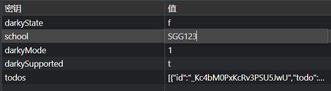 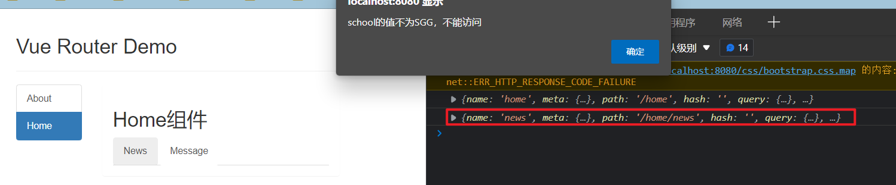  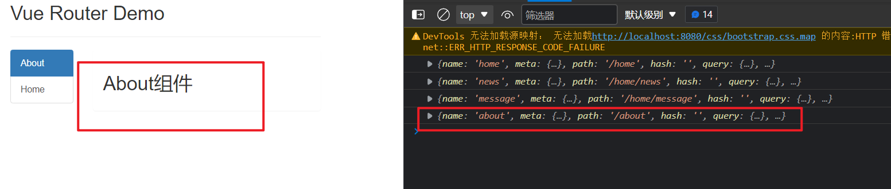

### 2.2 meta

在配置路由时，可以传入meta配置项，在meta配置项中可以写我们自己的数据，可以用于判断当前路由是否需要进行权限的判断。

```js
// 全局前置路由守卫
router.beforeEach((to, from, next) => {
  console.log(to)
  // 路由meta中的isAuth为true则要进行权限的控制
  if (to.meta.isAuth) {
    // 判断 school 的值是否为 SGG
    if (localStorage.getItem('school') === 'SGG') {
      next()
    } else {
      alert('school的值不为SGG，不能访问')
    }
  } else { // 访问其他组件直接放行
    next()
  }
})

// 创建一个路由器
const router = new VueRouter({
  routes: [
    {
      name: 'about',
      path: '/about',
      component: About,
      meta: {isAuth: false}
    },
    {
      name: 'home',
      path: '/home',
      component: Home,
      children: [
        {
          name: 'news',
          path: 'news',
          component: News,
          meta: {isAuth: true}
        },
        {
          name: 'message',
          path: 'message',
          component: Message,
          meta: {isAuth: true},
          children: [
            {
              name: 'messageDetail',
              path: 'detail',
              component: Detail,
              props($route) {
                return {
                  id: $route.query.id,
                  title: $route.query.title
                }
              },
            }
          ]
        }
      ]
    }
  ]
})
```

> 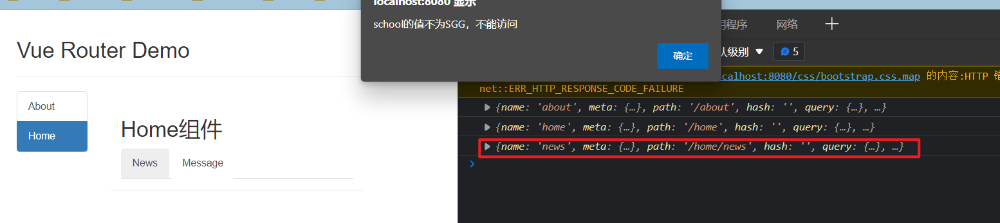

### 2.3 全局后置路由守卫

全局后置路由守卫会在初始化时被触发，在每次进行路由的切换后也会被触发。

```js
// 全局后置路由守卫
// 在初始化时被触发，在每次进行路由的切换后也会被触发
// 全局前置路由守卫的回调函数接收两个参数
// to：表示将要访问的路由的信息对象
// from：表示将要离开的路由的信息对象
// 全局后置路由守卫无 next
router.afterEach((to, from, next) => {
  console.log(to, from, next)
})
```

> 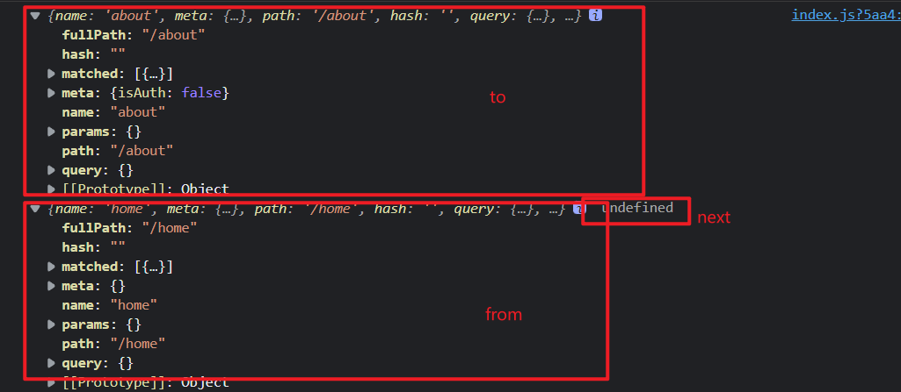

访问相关组件之后，实现页面标题根据当前不同组件进行切换。

```js
// 创建一个路由器
const router = new VueRouter({
  routes: [
    {
      name: 'about',
      path: '/about',
      component: About,
      meta: {isAuth: false, title: '关于'}
    },
    {
      name: 'home',
      path: '/home',
      component: Home,
      meta: {isAuth: false, title: '主页'},
      children: [
        {
          name: 'news',
          path: 'news',
          component: News,
          meta: {isAuth: true, title: '新闻'}
        },
        {
          name: 'message',
          path: 'message',
          component: Message,
          meta: {isAuth: true, title: '消息'},
          children: [
            {
              name: 'messageDetail',
              path: 'detail',
              component: Detail,
              meta: {isAuth: false, title: '详情'},
              props($route) {
                return {
                  id: $route.query.id,
                  title: $route.query.title
                }
              },
            }
          ]
        }
      ]
    }
  ]
})
// 全局后置路由守卫
router.afterEach((to, from, next) => {
  // console.log(to, from, next)
  // 切换页面的标题
  document.title = to.meta.title
})
```

> 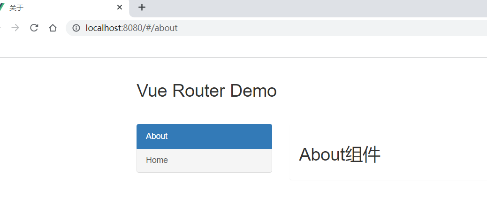 

## 3. 独享路由守卫

独享路由守卫写在每个路由对应的配置中，即独享路由守卫是每个路由所独享的，独享路由守卫与全局前置路由守卫类似。

> 注意：独享路由守卫与全局路由守卫不一样，独享路由守卫不分前置和后置。

> 注释全局前置路由守卫

```js
// 创建一个路由器
const router = new VueRouter({
  routes: [
    ......
    {
      name: 'home',
      path: '/home',
      component: Home,
      meta: { isAuth: false, title: '主页' },
      children: [
        {
          name: 'news',
          path: 'news',
          component: News,
          meta: { isAuth: true, title: '新闻' },
          beforeEnter(to, from, next) {
            console.log(to, from)
            // 判断 school 的值是否为 SGG
            if (localStorage.getItem('school') === 'SGG') {
              next()
            } else {
              console.log('school的值不正确，不能访问')
              alert('school的值不正确，不能访问')
            }
          }
        },
        ......
          ]
        }
      ]
    }
  ]
})
```

> 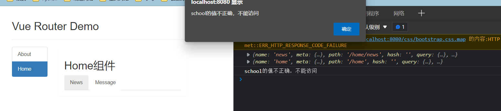

## 4. 组件内路由守卫

组件内路由守卫写在组件内，组件路由守卫有： 1.`beforeRouteEnter`：通过路由规则，进入该组件时被调用 2.`beforeRouteLeave`：通过路由规则，离开该组件时被调用

> 注释全局前置路由守卫与全局后置路由守卫

```html
<template>
  <div>
    <h2>About组件</h2>
  </div>
</template>

<script>
export default {
  name: 'About',
  beforeRouteEnter(to, from, next) {
    console.log('beforeRouteEnter')
    console.log(to)
    console.log(from)
    next()
  },
  beforeRouteLeave(to, from, next) {
    console.log('beforeRouteLeave')
    console.log(to)
    console.log(from)
    next()
  }
}
</script>

<style>

</style>
```

>  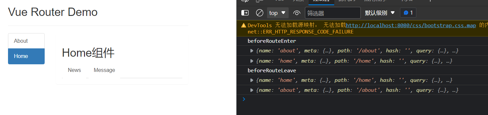

## 5. 总结 路由守卫

1. 作用：对路由进行权限控制

2. 分类：全局守卫、独享守卫、组件内守卫

3. 全局守卫:

   > 写在router/index.js 中 export default router之前

   ```js
   //全局前置守卫：初始化时执行、每次路由切换前执行
   router.beforeEach((to,from,next)=>{
   	console.log('beforeEach',to,from)
   	if(to.meta.isAuth){ //判断当前路由是否需要进行权限控制
   		if(localStorage.getItem('school') === 'atguigu'){ //权限控制的具体规则
   			next() //放行
   		}else{
   			alert('暂无权限查看')
   			// next({name:'guanyu'})
   		}
   	}else{
   		next() //放行
   	}
   })
   
   //全局后置守卫：初始化时执行、每次路由切换后执行
   router.afterEach((to,from)=>{
   	console.log('afterEach',to,from)
   	if(to.meta.title){ 
   		document.title = to.meta.title //修改网页的title
   	}else{
   		document.title = 'vue_test'
   	}
   })
   ```

4. 独享守卫:

   ```js
   beforeEnter(to,from,next){
   	console.log('beforeEnter',to,from)
   	if(to.meta.isAuth){ //判断当前路由是否需要进行权限控制
   		if(localStorage.getItem('school') === 'atguigu'){
   			next()
   		}else{
   			alert('暂无权限查看')
   			// next({name:'guanyu'})
   		}
   	}else{
   		next()
   	}
   }
   ```

5. 组件内守卫：

   ```js
   //进入守卫：通过路由规则，进入该组件时被调用
   beforeRouteEnter (to, from, next) {
   },
   //离开守卫：通过路由规则，离开该组件时被调用
   beforeRouteLeave (to, from, next) {
   }
   ```

# 46.路由器的两种工作模式

1. 对于一个url来说，什么是hash值？—— #及其后面的内容就是hash值。

2. hash值不会包含在 HTTP 请求中，即：hash值不会带给服务器。

3. hash模式：

   1. 地址中永远带着#号，不美观 。
   2. 若以后将地址通过第三方手机app分享，若app校验严格，则地址会被标记为不合法。
   3. 兼容性较好。

4. history模式：

   1. 地址干净，美观 。
   2. 兼容性和hash模式相比略差。
   3. 应用部署上线时需要后端人员支持，解决刷新页面服务端404的问题。

5. hash模式与history模式的切换：

   ```js
   const router =  new VueRouter({
   	// mode:'hash', // hash模式
   	// mode:'history', // history模式
   	routes:[......]
   })
   ```

# 47.Vue UI组件库

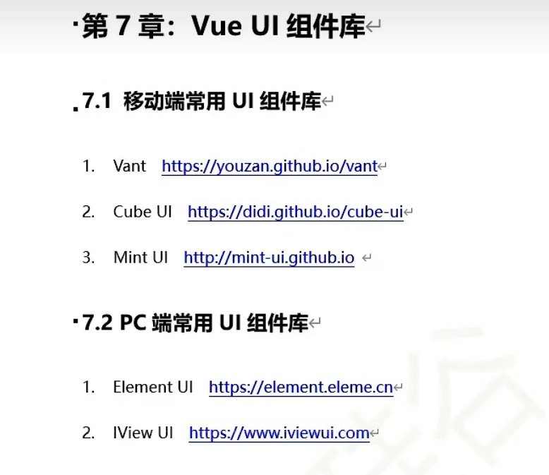

Vue UI相关的知识不需要记笔记，用到时查看对应的官方文档即可。

这里列举的只是比较知名的组件库，可以自己发掘好用的组件库
