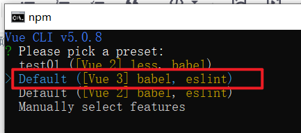
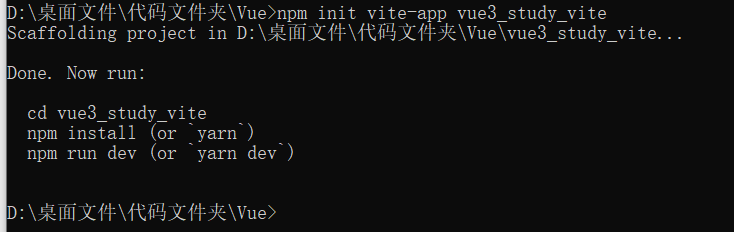
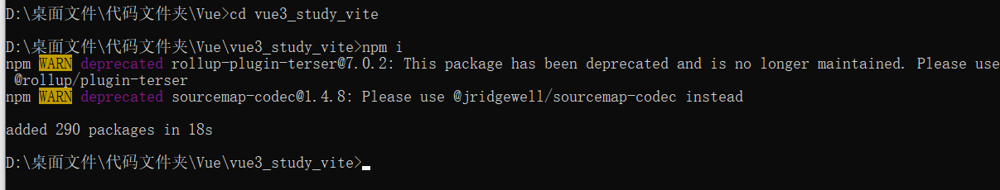
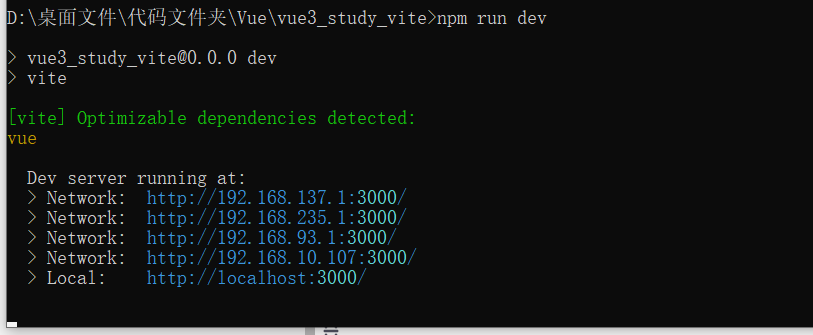

# 创建Vue3.0工程

##  创建Vue3项目

###  vue-cli

使用vue-cli创建Vue3项目，需要确保vue-cli版本在4.5.0以上。

```bash
## 查看@vue/cli版本，确保@vue/cli版本在4.5.0以上
vue --version
vue -V

## 安装或者升级@vue/cli
npm install -g @vue/cli
```

使用vue-cli创建Vue3项目

```bash
vue create vue3_study
```




###  vite

vite创建Vue3项目步骤：

```bash
## 创建工程
npm init vite-app <project-name>
## 进入工程目录
cd <project-name>
## 安装依赖
npm install
## 运行
npm run dev
npm init vite-app vue3_study_vite
```



```bash
cd vue3_study_vite
npm i
```



```bash
npm run dev
```



##  项目结构

> 使用的为vue-cli创建的项目


src\main.js

```js
// 引入的为一个名为createApp的工厂函数，不再是Vue构造函数（原本是import Vue  from 'vue'）
import { createApp } from 'vue'
import App from './App.vue'

// 创建应用实例对象，类似于Vue2中的vm，但是更“轻”，并挂载根标签
createApp(App).mount('#app')
```

src\App.vue

```html
<template>
  <!-- Vue3组件中的模板结构可以没有根标签 -->
  
  <HelloWorld msg="Welcome to Your Vue.js App"/>
</template>
```

##  Vue3开发者工具的安装

可参考：[[Vue\]开发环境搭建](https://blog.csdn.net/m0_53022813/article/details/124612823)

