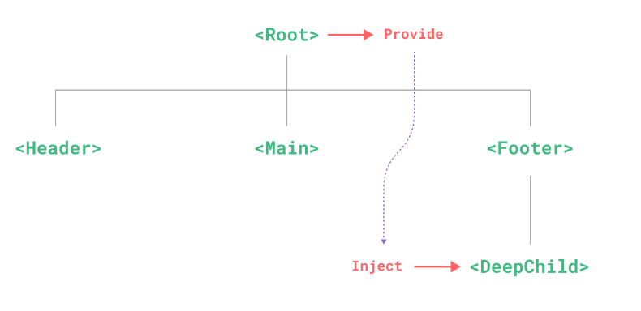

# 其它Composition API

##  shallowReactive 与 shallowRef

- shallowReactive：只处理对象最外层属性的响应式（浅响应式）。
- shallowRef：只处理基本数据类型的响应式, 不进行对象的响应式处理，对于对象类型数据直接将该对象作为ref对象的value的值。
- 什么时候使用?
  - 如果有一个对象数据，结构比较深, 但变化时只是最外层属性变化 ===> shallowReactive。
  - 如果有一个对象数据，后续功能不会修改该对象中的属性，而是生成新的对象来替换，即对于该对象数据在后续功能中不会修改其属性，而是会将该对象整个进行替换 ===> shallowRef。

##  readonly 与 shallowReadonly

- readonly 与 shallowReadonly 均接收一个响应式数据为参数。
- readonly: 让一个响应式数据变为只读的（深只读），传入的响应式数据不管有几层，都不能进行修改。
- shallowReadonly：让一个响应式数据变为只读的（浅只读），传入的响应式数据只有最外层数据不能进行修改。
- 应用场景: 不希望数据被修改时。将数据交给其他组件并且不希望这个组件对数据进行更改。

##  toRaw 与 markRaw

- toRaw：
  - toRaw 接收一个响应式对象为参数，只能接收reactive生成的响应式对象，不能处理ref生成的响应式数据
  - 作用：将一个由`reactive`生成的**响应式对象**转为**普通对象**。
  - 使用场景：用于读取响应式对象对应的普通对象，对这个普通对象的所有操作，不会引起页面更新。
- markRaw：
  - 接收一个对象类型数据为参数
  - 作用：标记一个对象，使其永远不会再成为响应式对象。向一个已经是响应式对象的数据追加一个属性，该属性的值为对象类型数据，vue会为其自动添加响应式，当不希望该属性的值为响应式时可以使用该函数，减小开销。
  - 应用场景:
    1. 有些值不应被设置为响应式的，例如复杂的第三方类库等，如果向响应式对象追加一个第三方类库对象(一般属性多且层次多)，开销会很大。
    2. 当渲染具有不可变数据源的大列表时，跳过响应式转换可以提高性能。

##  customRef

- 作用：创建一个自定义的 ref，并对其依赖项跟踪和更新触发进行显式控制。
- 实现防抖效果：

```html
  <template>
  	<input type="text" v-model="keyword">
  	<h3>{{keyword}}</h3>
  </template>
  
  <script>
  	import {ref,customRef} from 'vue'
  	export default {
  		name:'Demo',
  		setup(){
  			// let keyword = ref('hello') //使用Vue准备好的内置ref
  			//自定义一个myRef
  			function myRef(value,delay){
  				let timer
  				//通过customRef去实现自定义
  				return customRef((track,trigger)=>{
  					return{
  						get(){ // 读取数据时调用
  							track() //告诉Vue这个value值是需要被“追踪”的，告诉vue追踪数据的变化
  							return value
  						},
  						set(newValue){ // 修改数据时调用
  							clearTimeout(timer) // 触发就清除原先的定时器不执行之前定时器的回调
  							timer = setTimeout(()=>{
  								value = newValue // 修改数据
  								trigger() //告诉Vue去更新界面，重新解析模板
  							},delay)
  						}
  					}
  				})
  			}
  			let keyword = myRef('hello',500) //使用程序员自定义的ref
  			return {
  				keyword
  			}
  		}
  	}
  </script>
```

##  provide 与 inject



- 作用：实现**祖与后代组件间**通

- 套路：父组件有一个 `provide` 选项来提供数据，后代组件有一个 `inject` 选项来开始使用这些数据

> 注意点：
> 父组件也可以给子组件传递数据，不过父子组件间传递数据一般不用provide/inject，而用更简单的 props
> provide/inject的好处就是：如果用props传递数据，那么爷孙组件的数据就要从爷 -> 父 -> 孙这个顺序层层传递。
> provide/inject能直接从任何一个组件接收到祖组件的数据

- 具体写法：

  1. 祖组件中：

     ```js
     import {provide} from 'vue'
     
     setup(){
     	......
         let car = reactive({name:'奔驰',price:'40万'})
         // 给后代组件传递数据 
         // 第一个参数为对传递数据的命名，第二个参数为传递的数据
         provide('car',car)
         ......
     }
     ```

  2. 后代组件中：

     ```js
     import {inject} from 'vue'
     
     
     setup(props,context){
     	......
     	// 获取祖组件传递过来命名为car的数据
         const car = inject('car')
         return {car}
     	......
     }
     ```

##  响应式数据的判断

- isRef: 检查一个值是否为一个 ref 对象
- isReactive: 检查一个对象是否是由 `reactive` 创建的响应式代理
- isReadonly: 检查一个对象是否是由 `readonly` 创建的只读代理
- isProxy: 检查一个对象是否是由 `reactive` 或者 `readonly` 方法创建的代理


