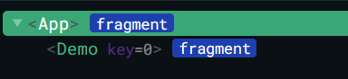

# 新的组件

##  Fragment

- 在Vue2中: 组件必须有一个根标签

- 在Vue3中: 组件可以没有根标签, 内部会将多个标签包含在一个Fragment虚拟元素中

- 好处: 减少标签层级, 减小内存占用

  

##  Teleport

- 什么是Teleport？—— `Teleport` 是一种能够将我们的**组件html结构**移动到指定位置的技术。

  ```html
  <!-- 移动位置可以标签元素或标签选择器 -->
  <teleport to="移动位置">
  	<div v-if="isShow" class="mask">
  		<div class="dialog">
  			<h3>我是一个弹窗</h3>
  			<button @click="isShow = false">关闭弹窗</button>
  		</div>
  	</div>
  </teleport>
  ```

```html
<template>
	<div>
		<button @click="isShow = true">点我弹个窗</button>
		<!-- 将html结构移动到body中 -->
		<teleport to="body">
			<div v-if="isShow" class="mask">
				<div class="dialog">
					<h3>我是一个弹窗</h3>
					<h4>一些内容</h4>
					<h4>一些内容</h4>
					<h4>一些内容</h4>
					<button @click="isShow = false">关闭弹窗</button>
				</div>
			</div>
		</teleport>
	</div>
</template>

<script>
	import {ref} from 'vue'
	export default {
		name:'Dialog',
		setup(){
			let isShow = ref(false)
			return {isShow}
		}
	}
</script>

<style>
	.mask{
		position: absolute;
		top: 0;bottom: 0;left: 0;right: 0;
		background-color: rgba(0, 0, 0, 0.5);
	}
	.dialog{
		position: absolute;
		top: 50%;
		left: 50%;
		transform: translate(-50%,-50%);
		text-align: center;
		width: 300px;
		height: 300px;
		background-color: green;
	}
</style>
```


##  Suspense

```js
// 静态引入只要组件不引入成功，当前整个组件都不会进行显示
// import Child from './components/Child'//静态引入
// 异步引入引入的组件等加载完成再进行显示，当前组件可以不用等待引入成功即可先进行显示
import {defineAsyncComponent} from 'vue' 
const Child = defineAsyncComponent(()=>import('./components/Child')) //异步引入
```

- 当异步引入的组件引入完成，组件会突然显示，造成用户体验效果不佳

- Suspense 标签可以在等待异步组件时渲染一些额外内容，让应用有更好的用户体验

- 如果组件为异步引入且使用了Suspense，则组件的setup可以返回Promise实例对象，即当Suspense和异步组件配合时，setup可以是一个async函数。

- 使用步骤：

  - 异步引入组件

    ```js
    import {defineAsyncComponent} from 'vue'
    const Child = defineAsyncComponent(()=>import('./components/Child.vue'))
    ```

  - 使用`Suspense`包裹组件，并配置好`default`与 `fallback`

    ```html
    <template>
    	<div class="app">
    		<h3>我是App组件</h3>
    		<Suspense>
    		    <!-- 用于放置真正需要显示的组件 -->
    			<template v-slot:default>
    				<Child/>
    			</template>
    			<!-- 用于放置等待异步组件时渲染的内容 -->
    			<template v-slot:fallback>
    				<h3>加载中.....</h3>
    			</template>
    		</Suspense>
    	</div>
    </template>
    ```

