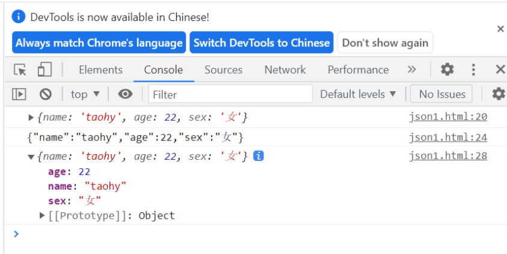
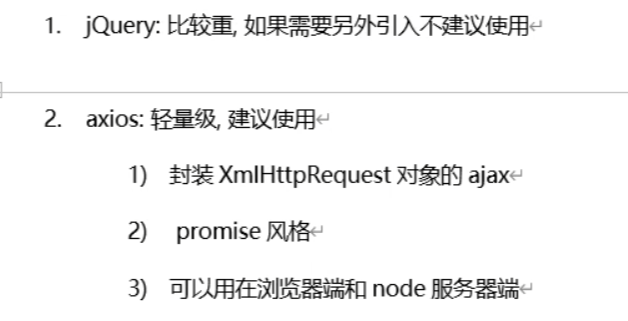
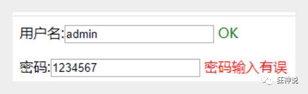
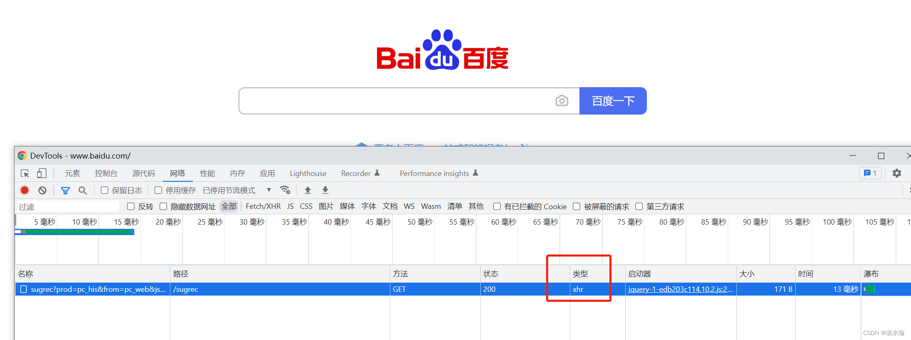

# Web1.0时代

- 早期网站，登录，如果失败，需要刷新页面，才能登录；不点击提交按钮，就不知道自己密码错了；

# Web2.0时代

最重要的因素是Ajax

- 现在大多数的网站，都是局部刷新，不刷新整个页面的情况下，实现页面更新。
- 注册的时候，发现手机已经注册过了，但是你只是输入了，没有提交，然后他就提示了。

# JSON

## 1. JSON简介

- JSON（JavaScript Object Notation, JS对象简谱）是一种轻量级的数据交换格式。
- JSON 是 JS 对象的字符串表示法，它使用文本表示一个 JS 对象的信息，本质是一个字符串。
- 任何支持的类型都可以通过 JSON 来表示，例如字符串、数字、对象、数组等。但是对象{}和数组[]是比较特殊且常用的两种类型。
- JSON 和 JS 对象互转 ，字符串转对象使用**JSON.parse()** 方法、对象转字符串使用**JSON.stringify()** 方法

前后端分离，数据交互变得异常重要，JSON就是王者

## 2. JS中使用JSON

```html
<body>
    <!-- script标签不指定type的话，会默认变成<script type="text/javascript"> -->
    <script>
        // 编写一个对象
        var user = {
            name: 'taohy',
            age: 22,
            sex: '女'
        }
        // 输出一个对象
        console.log(user);

        // 将js转换成json字符串  方法 JSON.stringify
        var jsonStr = JSON.stringify(user);
        console.log(jsonStr);  // {"name":"taohy","age":22,"sex":"女"}

        // 将jsonStr转换成json对象 方法 JSON.parse
        var jsonObj = JSON.parse(jsonStr);
        console.log(jsonObj);
        
    </script>
</body>
```



## 3. 后端JSON解析工具（jackson）

> 思考问题：我们正常返回它会走视图解析器，而JSON需要返回的是一个字符串
>
> 市面上有很多第三方jar包可以实现这个功能，Jackson应该是目前比较好的json解析工具了，当然工具不止这一个，比如还有阿里巴巴的fastjson等等；我们这里使用Jackson，使用它需要导入它的jar包;

配置SpringMVC需要的配置

```xml
<!-- https://mvnrepository.com/artifact/com.fasterxml.jackson.core/jackson-core -->
<dependency>
    <groupId>com.fasterxml.jackson.core</groupId>
    <artifactId>jackson-databind</artifactId>
    <version>2.9.8</version>
</dependency>
```

## 4、解决乱码

```xml
<!--JSON格式乱码处理方式-->
<mvc:annotation-driven>
    <mvc:message-converters register-defaults="true">
        <bean class="org.springframework.http.converter.StringHttpMessageConverter">
            <constructor-arg value="UTF-8"/>
        </bean>
        <bean class="org.springframework.http.converter.json.MappingJackson2HttpMessageConverter">
            <property name="objectMapper">
                <bean class="org.springframework.http.converter.json.Jackson2ObjectMapperFactoryBean">
                    <property name="failOnEmptyBeans" value="false"/>
                </bean>
            </property>
        </bean>
    </mvc:message-converters>
</mvc:annotation-driven>
```

## 5、返回Json字符串统一问题

在类上直接使用@RestController，这样子，里面所有的方法都只会返回json字符串了，不用再每一个都添加@ResponseBody !我们在前后端分离开发中，一般都使用@RestController ，十分便捷!

`@RestController` 是一个用于 Spring MVC 中的注解，它实际上是 `@Controller` 和 `@ResponseBody` 注解的组合。其主要作用是将控制器中的方法返回值直接写入 HTTP 响应体中，而不是通过视图解析器解析为视图。

>下面代码为了演示jackson类中ObjectMapperr的使用才这样写。
>实际上`@RestController` 注解已经表明这个控制器会将方法的返回值直接作为 HTTP 响应的主体，并且自动转换为 JSON 格式。 因此，可以省略掉 `ObjectMapper`，直接返回 `User` 对象。 Spring 会自动将这个对象转换为 JSON 格式。

```java
@RestController
public class UserController {
 
    //produces:指定响应体返回类型和编码
    //在注解中添加属性可以解决后端返回给前端的数据乱码问题，@RequestMapping(value = "/json1",produces = "application/json;charset=utf-8") ;使用xml配置文件也可以解决乱码问题
    @RequestMapping(value = "/json1")
    public String json1() throws JsonProcessingException {
        //创建一个jackson的对象映射器，用来解析数据
        ObjectMapper mapper = new ObjectMapper();
        //创建一个对象
        User user = new User("秦疆1号", 3, "男");
        //将我们的对象解析成为json格式
        String str = mapper.writeValueAsString(user);
        //由于@ResponseBody注解，这里会将str转成json格式返回；十分方便
        return str;
    }
 
}
```

## 6、编写一个工具类

```java
package com.kuang.utils;
 
import com.fasterxml.jackson.core.JsonProcessingException;
import com.fasterxml.jackson.databind.ObjectMapper;
import com.fasterxml.jackson.databind.SerializationFeature;
 
import java.text.SimpleDateFormat;
 
public class JsonUtils {
    
    public static String getJson(Object object) {
        return getJson(object,"yyyy-MM-dd HH:mm:ss");
    }
 
    public static String getJson(Object object,String dateFormat) {
        ObjectMapper mapper = new ObjectMapper();
        //不使用时间差的方式
        mapper.configure(SerializationFeature.WRITE_DATES_AS_TIMESTAMPS, false);
        //自定义日期格式对象
        SimpleDateFormat sdf = new SimpleDateFormat(dateFormat);
        //指定日期格式
        mapper.setDateFormat(sdf);
        try {
            return mapper.writeValueAsString(object);
        } catch (JsonProcessingException e) {
            e.printStackTrace();
        }
        return null;
    }
}
```

## 7、使用工具类

```java
@RequestMapping("/json5")
public String json5() throws JsonProcessingException {
    Date date = new Date();
    String json = JsonUtils.getJson(date);
    return json;
}
```


# AJAX

##  1. 简介

- AJAX = Asynchronous JavaScript and XML（异步的 JavaScript 和 XML）。
- AJAX 是一种在无需重新加载整个网页的情况下，能够更新部分网页的技术。
- Ajax 不是一种新的编程语言，而是一种用于创建更好更快以及交互性更强的Web应用程序的技术。
- 使用ajax技术的网页，通过在后台服务器进行少量的数据交换，就可以实现异步局部更新

**使用AJAX有两种方式：自己封装；使用第三方AJAX库**

**自己封装（不推荐）**：耗时，封装的不一定完善

**使用第三方库**：


## 2. jQuery.ajax

- 直接使用jquery提供的，方便学习和使用，避免重复造轮子
- Ajax的核心是XMLHttpRequest对象(XHR)。XHR为向服务器发送请求和解析服务器响应提供了接口。能够以异步方式从服务器获取新数据
- 通过 jQuery AJAX 方法，您能够使用 HTTP Get 和 HTTP Post 从远程服务器上请求文本、HTML、XML 或 JSON – 同时您能够把这些外部数据直接载入网页的被选元素中
- jQuery 不是生产者，而是大自然搬运工
- jQuery Ajax本质就是 XMLHttpRequest，对他进行了封装，方便调用

```javascript
jQuery.ajax(...)
      部分参数：
            url：请求地址
            type：请求方式，GET、POST（1.9.0之后用method）
        headers：请求头
            data：要发送的数据
    contentType：即将发送信息至服务器的内容编码类型(默认: "application/x-www-form-urlencoded; charset=UTF-8")
          async：是否异步
        timeout：设置请求超时时间（毫秒）
      beforeSend：发送请求前执行的函数(全局)
        complete：完成之后执行的回调函数(全局)
        success：成功之后执行的回调函数(全局)
          error：失败之后执行的回调函数(全局)
        accepts：通过请求头发送给服务器，告诉服务器当前客户端可接受的数据类型
        dataType：将服务器端返回的数据转换成指定类型
          "xml": 将服务器端返回的内容转换成xml格式
          "text": 将服务器端返回的内容转换成普通文本格式
          "html": 将服务器端返回的内容转换成普通文本格式，在插入DOM中时，如果包含JavaScript标签，则会尝试去执行。
        "script": 尝试将返回值当作JavaScript去执行，然后再将服务器端返回的内容转换成普通文本格式
          "json": 将服务器端返回的内容转换成相应的JavaScript对象
        "jsonp": JSONP 格式使用 JSONP 形式调用函数时，如 "myurl?callback=?" jQuery 将自动替换 ? 为正确的函数名，以执行回调函数
```

## 3. 使用

#### 1. 简单的测试

- 使用最原始的HttpServletResponse处理 , .最简单 , 最通用

1. 配置web.xml 和 springmvc的配置文件

   ```xml
   <?xml version="1.0" encoding="UTF-8"?>
   <beans xmlns="http://www.springframework.org/schema/beans"
         xmlns:xsi="http://www.w3.org/2001/XMLSchema-instance"
         xmlns:context="http://www.springframework.org/schema/context"
         xmlns:mvc="http://www.springframework.org/schema/mvc"
         xsi:schemaLocation="http://www.springframework.org/schema/beans
          http://www.springframework.org/schema/beans/spring-beans.xsd
          http://www.springframework.org/schema/context
          https://www.springframework.org/schema/context/spring-context.xsd
          http://www.springframework.org/schema/mvc
          https://www.springframework.org/schema/mvc/spring-mvc.xsd">
   
      <!-- 自动扫描指定的包，下面所有注解类交给IOC容器管理 -->
      <context:component-scan base-package="com.controller"/>
      <mvc:default-servlet-handler />
      <mvc:annotation-driven />
   
      <!-- 视图解析器 -->
      <bean class="org.springframework.web.servlet.view.InternalResourceViewResolver"
            id="internalResourceViewResolver">
          <!-- 前缀 -->
          <property name="prefix" value="/WEB-INF/jsp/" />
          <!-- 后缀 -->
          <property name="suffix" value=".jsp" />
      </bean>
   
   </beans>
   ```

2. 编写一个AjaxController

   ```java
   @Controller
   public class AjaxController {
   
      @RequestMapping("/a1")
      public void ajax1(String name , HttpServletResponse response) throws IOException {
          if ("admin".equals(name)){
              response.getWriter().print("true");
         }else{
              response.getWriter().print("false");
         }
     }
   
   }
   ```

3. 导入jquery ， 可以使用在线的CDN ， 也可以下载导入

   ```html
   <script src="https://code.jquery.com/jquery-3.1.1.min.js"></script>
   <script src="${pageContext.request.contextPath}/statics/js/jquery-3.1.1.min.js"></script>
   ```

4. 编写index.jsp测试

   ```html
   <%@ page contentType="text/html;charset=UTF-8" language="java" %>
   <html>
    <head>
      <title>$Title$</title>
     <%--<script src="https://code.jquery.com/jquery-3.1.1.min.js"></script>--%>
      <script src="${pageContext.request.contextPath}/statics/js/jquery-3.1.1.min.js"></script>
      <script>
          function a1(){
              $.post({
                  url:"${pageContext.request.contextPath}/a1",
                  data:{'name':$("#txtName").val()},
                  success:function (data,status) {
                      alert(data);
                      alert(status);
                 }
             });
         }
      </script>
    </head>
    <body>
   
   <%--onblur：失去焦点触发事件--%>
   用户名:<input type="text" id="txtName" onblur="a1()"/>
   
    </body>
   </html>
   ```

5. 启动tomcat测试

#### 2. Springmvc实现

1. 实体类user

   ```java
   @Data
   @AllArgsConstructor
   @NoArgsConstructor
   public class User {
   
      private String name;
      private int age;
      private String sex;
   
   }
   ```

2. 获取一个集合对象，展示到前端页面

   ```java
   @RequestMapping("/a2")
   public List<User> ajax2(){
      List<User> list = new ArrayList<User>();
      list.add(new User("张三",10,"男"));
      list.add(new User("李四",20,"女"));
      list.add(new User("王五",30,"男"));
      return list; //由于@RestController注解，将list转成json格式返回
   }
   ```

3. 前端页面

   ```html
   <%@ page contentType="text/html;charset=UTF-8" language="java" %>
   <html>
   <head>
      <title>Title</title>
   </head>
   <body>
   <input type="button" id="btn" value="获取数据"/>
   <table width="80%" align="center">
      <tr>
          <td>姓名</td>
          <td>年龄</td>
          <td>性别</td>
      </tr>
      <tbody id="content">
      </tbody>
   </table>
   
   <script src="${pageContext.request.contextPath}/statics/js/jquery-3.1.1.min.js"></script>
   <script>
   
      $(function () {
          $("#btn").click(function () {
              $.post("${pageContext.request.contextPath}/a2",function (data) {
                  console.log(data)
                  var html="";
                  for (var i = 0; i <data.length ; i++) {
                      html+= "<tr>" +
                          "<td>" + data[i].name + "</td>" +
                          "<td>" + data[i].age + "</td>" +
                          "<td>" + data[i].sex + "</td>" +
                          "</tr>"
                 }
                  $("#content").html(html);
             });
         })
     })
   </script>
   </body>
   </html>
   ```

- 成功实现了数据回显

#### 3. 注册提示效果

- 再测试一个小Demo

1. Controller

   ```java
   @RequestMapping("/a3")
   public String ajax3(String name,String pwd){
      String msg = "";
      //模拟数据库中存在数据
      if (name!=null){
          if ("admin".equals(name)){
              msg = "OK";
         }else {
              msg = "用户名输入错误";
         }
     }
      if (pwd!=null){
          if ("123456".equals(pwd)){
              msg = "OK";
         }else {
              msg = "密码输入有误";
         }
     }
      return msg; //由于@RestController注解，将msg转成json格式返回
   }
   ```

2. login.jsp

   ```html
   <%@ page contentType="text/html;charset=UTF-8" language="java" %>
   <html>
   <head>
      <title>ajax</title>
      <script src="${pageContext.request.contextPath}/statics/js/jquery-3.1.1.min.js"></script>
      <script>
   
          function a1(){
              $.post({
                  url:"${pageContext.request.contextPath}/a3",
                  data:{'name':$("#name").val()},
                  success:function (data) {
                      if (data.toString()=='OK'){
                          $("#userInfo").css("color","green");
                     }else {
                          $("#userInfo").css("color","red");
                     }
                      $("#userInfo").html(data);
                 }
             });
         }
          function a2(){
              $.post({
                  url:"${pageContext.request.contextPath}/a3",
                  data:{'pwd':$("#pwd").val()},
                  success:function (data) {
                      if (data.toString()=='OK'){
                          $("#pwdInfo").css("color","green");
                     }else {
                          $("#pwdInfo").css("color","red");
                     }
                      $("#pwdInfo").html(data);
                 }
             });
         }
   
      </script>
   </head>
   <body>
   <p>
     用户名:<input type="text" id="name" onblur="a1()"/>
      <span id="userInfo"></span>
   </p>
   <p>
     密码:<input type="text" id="pwd" onblur="a2()"/>
      <span id="pwdInfo"></span>
   </p>
   </body>
   </html>
   ```

3. 测试
   

#### 4. 获取baidu接口Demo

```html
<!DOCTYPE HTML>
<html>
<head>
   <meta http-equiv="Content-Type" content="text/html; charset=utf-8">
   <title>JSONP百度搜索</title>
   <style>
       #q{
           width: 500px;
           height: 30px;
           border:1px solid #ddd;
           line-height: 30px;
           display: block;
           margin: 0 auto;
           padding: 0 10px;
           font-size: 14px;
      }
       #ul{
           width: 520px;
           list-style: none;
           margin: 0 auto;
           padding: 0;
           border:1px solid #ddd;
           margin-top: -1px;
           display: none;
      }
       #ul li{
           line-height: 30px;
           padding: 0 10px;
      }
       #ul li:hover{
           background-color: #f60;
           color: #fff;
      }
   </style>
   <script>

       // 2.步骤二
       // 定义demo函数 (分析接口、数据)
       function demo(data){
           var Ul = document.getElementById('ul');
           var html = '';
           // 如果搜索数据存在 把内容添加进去
           if (data.s.length) {
               // 隐藏掉的ul显示出来
               Ul.style.display = 'block';
               // 搜索到的数据循环追加到li里
               for(var i = 0;i<data.s.length;i++){
                   html += '<li>'+data.s[i]+'</li>';
              }
               // 循环的li写入ul
               Ul.innerHTML = html;
          }
      }

       // 1.步骤一
       window.onload = function(){
           // 获取输入框和ul
           var Q = document.getElementById('q');
           var Ul = document.getElementById('ul');

           // 事件鼠标抬起时候
           Q.onkeyup = function(){
               // 如果输入框不等于空
               if (this.value != '') {
                   // ☆☆☆☆☆☆☆☆☆☆☆☆☆☆☆☆☆☆JSONPz重点☆☆☆☆☆☆☆☆☆☆☆☆☆☆☆☆☆☆☆☆
                   // 创建标签
                   var script = document.createElement('script');
                   //给定要跨域的地址 赋值给src
                   //这里是要请求的跨域的地址 我写的是百度搜索的跨域地址
                   script.src = 'https://sp0.baidu.com/5a1Fazu8AA54nxGko9WTAnF6hhy/su?wd='+this.value+'&cb=demo';
                   // 将组合好的带src的script标签追加到body里
                   document.body.appendChild(script);
              }
          }
      }
   </script>
</head>

<body>
<input type="text" id="q" />
<ul id="ul">

</ul>
</body>
</html>
```

## 4. 总结

- Ajax即Asynchronous Javascript And XML（异步JavaScript和XML）
- 使用Ajax技术网页应用能够快速地将增量更新呈现在用户界面上，而不需要重载（刷新）整个页面，这使得程序能够更快地回应用户的操作。
- Ajax 不是一种新的编程语言，而是一种用于创建更好更快以及交互性更强的Web应用程序的技术。
- 增加B/S架构的体验性 未来的主流，并且会爆发式的持续增长
- 产品链 ：H5+网页+客户端+手机端（Android、IOS）+小程序

纯js实现Ajax不去深究，直接用jquery实现，有兴趣的了解下本质XMLHttpRequest！xhr


- Ajax的核心是XMLHttpRequest对象XHR。xhr为向服务器发送请求和解析服务器提供了借口。能够以异步方式从服务器获取新数据。
- JQuery提供多个与AJAX有关的方法。
- 通过jQuery Ajax的方法，能够使用HTPP GET和HTTP POST从远程服务器上请求文本、html、xml或json，同时能够把这些外部数据直接载入网页的被选元素中。
- jQuery不是生产者，而是大自然的搬运工。

[jQuery API ajax介绍：](https://jquery.cuishifeng.cn/jQuery.Ajax.html)https://jquery.cuishifeng.cn/jQuery.Ajax.html
[jQuery官网下载：](https://jquery.com/)https://jquery.com/

Ajax总结：
使用jQuery需要导入jQuery，使用Vue导入Vue，两个都不用，自己原生态实现。