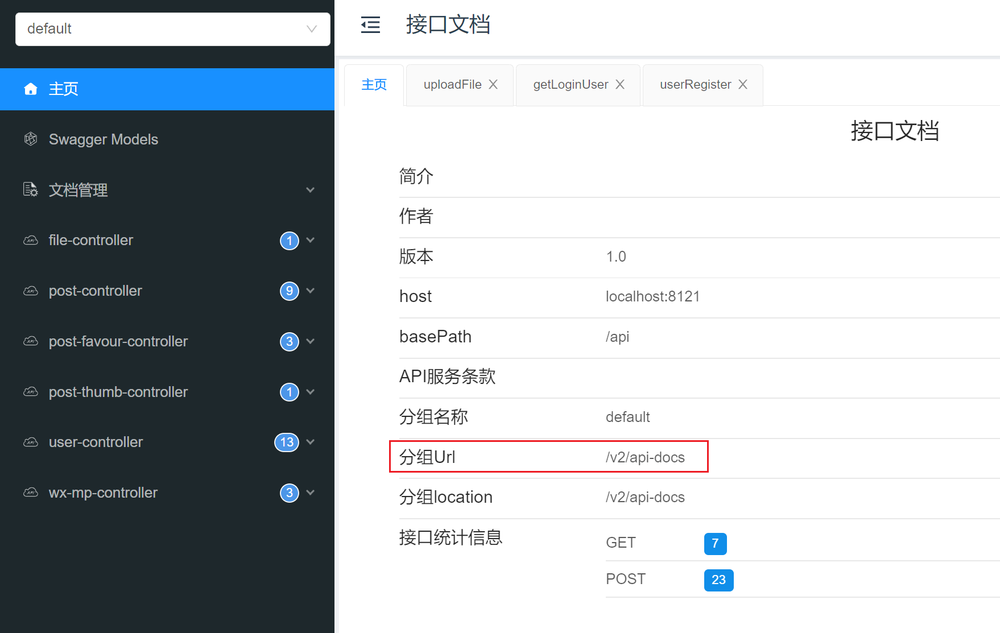
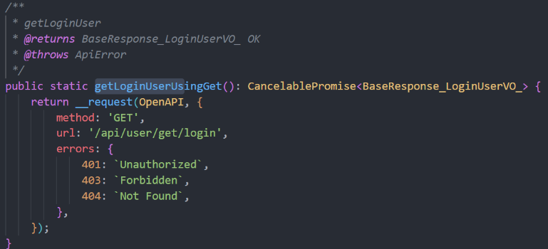
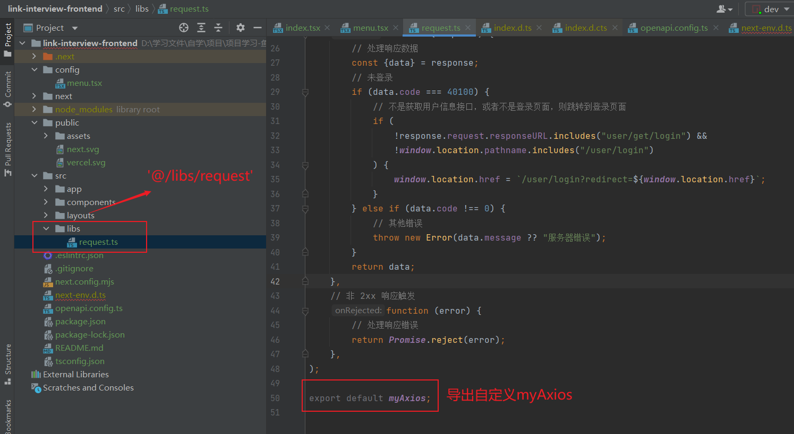
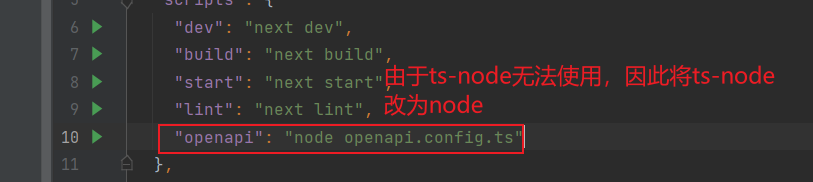
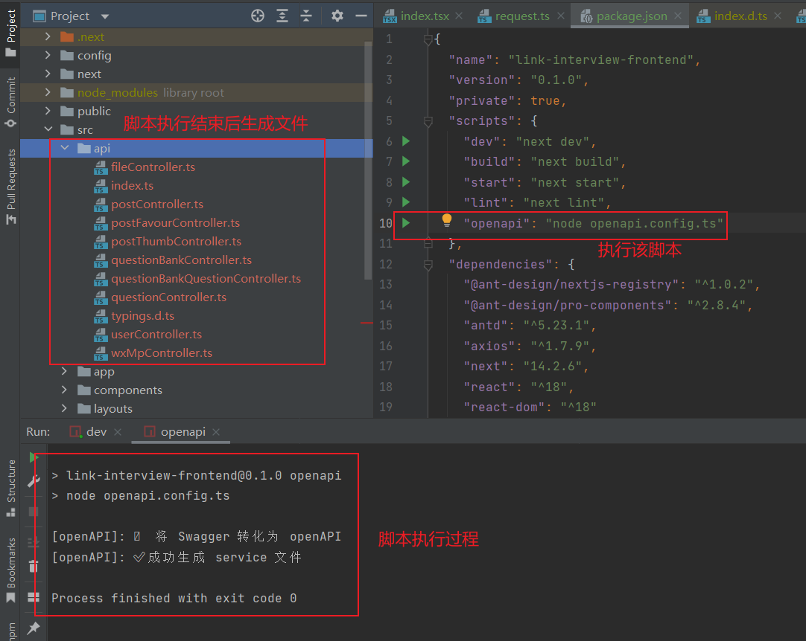

> 原文地址：https://blog.csdn.net/XiugongHao/article/details/139665006

###  下载 axios

npm install axios

### OpenAPI Typescript Codegen 的基本使用

> OpenAPI Typescript Codegen 官网：https://github.com/ferdikoomen/openapi-typescript-codegen

#### 安装 OpenAPI Typescript Codegen

```sh
npm install openapi-typescript-codegen --save-dev
```

–input：指定接口文档的路径、url 或字符串内容（必填）

–output：代码生成的目录

–client：生成的代码所需要使用的请求库

#### 准备 OpenAPI 规范文件

在你的项目中，准备一个符合 OpenAPI 规范的 JSON （OpenAPI 格式 / Swagger / Slf4j 接口文档的导出格式都是 JSON）或 YAML 文件。该文件描述了你的 API 的端点、参数、响应等信息。



#### 生成 TypeScript 代码

在终端或命令提示符中，使用以下命令生成 TypeScript 代码：

```
openapi --input http://localhost:8121/api//v2/api-docs --output ./generated --client axios
```

这里的 `http://localhost:8121/api//v2/api-docs` 是你准备的 OpenAPI 规范文件的路径，`./generated` 是生成的 TypeScript 代码的输出路径。你可以根据需要自定义这些路径。



### @umijs/openapi 的基本使用

如果采用传统开发方式，针对每个请求都要单独编写代码，很麻烦。

推荐使用 OpenAPI 工具，直接自动生成即可：https://www.npmjs.com/package/@umijs/openapi

按照官方文档的步骤，先安装：

```shell
npm i --save-dev @umijs/openapi
```

在 **项目根目录** 新建 `openapi.config.ts`，根据自己的需要定制生成的代码：

```typescript
const { generateService } = require("@umijs/openapi");

generateService({
  requestLibPath: "import request from '@/libs/request'",
  schemaPath: "http://localhost:8101/api/v2/api-docs",
  serversPath: "./src",
});
```

**注意，要将 schemaPath 改为自己后端服务提供的 Swagger 接口文档的地址**。

requestLibPath 为自己的导出的 axios 实例文件。



在 package.json 的 script 中添加 `"openapi": "ts-node openapi.config.ts"`

如果 ts-node 无法运行，改为 node



执行该命令，可以在 `/src/api` 目录看到生成的请求代码。



执行即可生成请求代码，还包括 TypeScript 类型。以后每次后端接口变更时，只需要重新生成一遍就好。