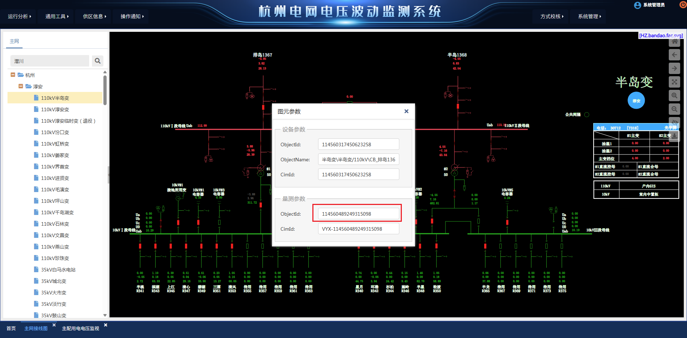

## 命令

### 重启服务器后需要执行的命令

```sh
x7ctrlcmd stop
x7ctrlcmd start
```

```sh
cd /usr/app/tomcat/bin
shutdown.sh
startup.sh
tail -f ../logs/catalina.out
```

### 查看/修改量测数据

> -D：日期
>
> -HM：时分
>
> -C：量测code
> 
>
> -V：要设置的值

**查看量测值**：

```sh
x7fun showhis -D10 -HM0831 -C114560489249351504
```

**修改量测值**：

```sh
x7fun sethis -D10 -HM0831 -C114560489249351504 -V1
```

生成成图文件：

````sh
x7uhzhou anasend -K变压器ID或变电站ID -CONTSS -NDB

# 到这个目录查看生成的文件
cd /home/df8600/df8600/dat/autogr/sendzg 
````


## 工具
