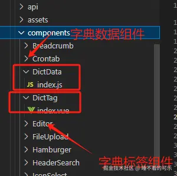
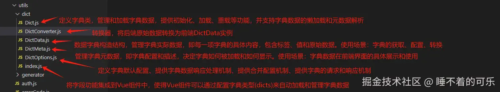
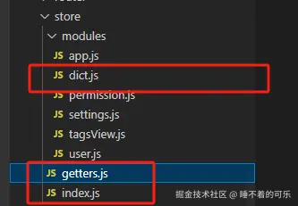
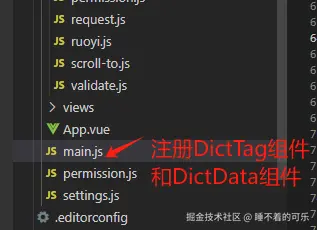

> 原文地址：https://juejin.cn/post/7463836172558499891

###  一、Vue2版本主要文件目录

1. 组件目录`src/components`：数据字典组件、字典标签组件



1. 工具目录`src/utils`：字典工具类



1. `store`目录`src/store`：字典数据



1. `main.js`：字典数据初始化



页面使用字典例子：

```javascript
<template>
  <div>
   <el-table >
      <el-table-column label="任务组名" align="center" prop="jobGroup">
        <template slot-scope="scope">
          <dict-tag :options="dict.type.sys_job_group" :value="scope.row.jobGroup"/>
        </template>
      </el-table-column>
    </el-table>
  </div>
</template>
<script>
export default {
  components: {},
  name: "",
  dicts: ['sys_job_group', 'sys_job_status'],
  data() {
    return {}
    };
  },
  created() {},
  methods: {}
};
</script>
```

### 二、各个目录下文件的理解

#### i. `DictData`组件

`DictData`组件`src/components/DictData/index.js`文件内容：

```javascript
import Vue from 'vue'
import store from '@/store'
import DataDict from '@/utils/dict'
import { getDicts as getDicts } from '@/api/system/dict/data'

/**
 * searchDictByKey函数
 * 作用：
 * 在 dict（字典数组）中根据 key 查找对应的 value。
 * 如果找到匹配的 key，返回其 value；如果找不到，返回 null。
 * 特点：
 * 用于从 Vuex 的 dict 缓存中快速查找指定类型的字典数据，提升性能，避免重复请求。
 */
function searchDictByKey(dict, key) {
  if (key == null && key == "") {
    return null
  }
  try {
    for (let i = 0; i < dict.length; i++) {
      if (dict[i].key == key) {
        return dict[i].value
      }
    }
  } catch (e) {
    return null
  }
}
/**
 * install函数
 * 核心功能：
 * 1. 使用 Vue.use 注册字典功能：
 * 将封装的 DataDict 字典管理工具全局挂载到 Vue。
 * 配置字典的元数据（metas），为字典定义统一的字段映射规则和加载方式。
 * 2. 配置元数据 metas：
 * '*' 表示为所有字典类型提供的通用配置。
 * labelField: 定义字典数据中的标签字段名称（例如 dictLabel）。
 * valueField: 定义字典数据中的值字段名称（例如 dictValue）。
 * request: 定义加载字典数据的请求方法，优先从缓存加载，若缓存中没有，则发起 HTTP 请求加载。
 * request 函数：
 * 优先从缓存中获取：
 * 调用 searchDictByKey 从 store.getters.dict 中查找是否已有指定类型的字典数据。
 * 如果缓存中存在，直接返回一个 Promise，解析为缓存数据。
 * 如果缓存中没有：
 * 调用 getDicts(dictMeta.type) 向后端接口请求字典数据。
 * 请求成功后，将数据存入 Vuex 的 dict 模块中，并解析返回数据。
 */
function install() {
  Vue.use(DataDict, {
    metas: {
      '*': {
        labelField: 'dictLabel',
        valueField: 'dictValue',
        request(dictMeta) {
          const storeDict = searchDictByKey(store.getters.dict, dictMeta.type)
          if (storeDict) {
            return new Promise(resolve => { resolve(storeDict) })
          } else {
            return new Promise((resolve, reject) => {
              getDicts(dictMeta.type).then(res => {
                store.dispatch('dict/setDict', { key: dictMeta.type, value: res.data })
                resolve(res.data)
              }).catch(error => {
                reject(error)
              })
            })
          }
        },
      },
    },
  })
}
/**
 * 将 install 函数作为默认导出，使其可以通过 Vue.use() 插件的方式在 Vue 项目中注册和使用。
 */
export default {
  install,
}
```

**作用总结**：

1. 集成字典管理功能：
   - 使用 `Vue.use()` 将字典功能作为插件集成到项目中，全局提供字典的加载、缓存和管理能力。
2. 支持缓存和动态加载：
   - 优先从 `Vuex` 缓存中加载字典数据，减少重复请求。
   - 如果缓存中没有数据，则通过 `getDicts` 方法动态加载字典，并更新缓存。
3. 统一字段映射：
   - 通过 `metas` 配置字典数据的字段映射规则（如 `labelField` 和 `valueField`），使项目中字典数据的使用更加统一和灵活。
4. 便于扩展和维护：
   - 使用插件模式封装，便于在项目中安装和使用，同时支持通过配置轻松扩展字典的加载逻辑和字段映射规则。

------

**适用场景**：

- 后台管理系统：
  - 动态加载用户角色、状态、分类等字典数据，避免硬编码。
  - 支持通过 `Vuex` 缓存提升性能，并统一管理字典数据。
- 需要复用的字典管理逻辑：
  - 在多个页面或组件中需要使用字典数据时，避免重复请求和手动解析，统一通过封装的字典管理工具加载和处理数据。

------

#### ii. 工具文件`index.js`

目录文件`src/utils/dict/index.js`

`index.js `的作用是将字典功能集成到 `Vue` 组件中，使得 `Vue` 组件可以通过配置字典类型（`dicts`）来自动加载和管理字典数据。具体来说，它通过 `Vue` 的 `mixin` 将字典管理的逻辑添加到每个组件中，并提供了初始化、加载、准备好后回调等功能。

**主要作用**：

1. 字典管理的集成：
   - 将字典管理功能封装成 `Vue` 插件，使用时只需要通过配置字典类型（`dicts`）在组件中，`index.js` 会自动为该组件管理字典数据。
2. `Vue.mixin`的使用：
   - 在 `Vue` 组件中，`Vue.mixin` 会在每个组件中注入字典管理的功能。具体做法是在每个组件的 `data` 中自动添加一个 `dict` 属性，该属性是 `Dict` 类的实例，负责管理字典数据。
3. 字典的初始化：
   - 在 `created` 生命周期钩子中，`index.js` 会初始化字典（通过调用 `dict.init` 方法）。初始化过程会使用组件的 `dicts` 配置项，进行字典数据的加载和准备工作。
4. 字典准备后的回调：
   - `options.onCreated`：可以在字典初始化后执行一些操作。
   - `options.onReady`：字典准备好后执行操作。
   - `$emit('dictReady')`：组件会发出一个 `dictReady` 事件，表明字典数据已经准备好。
   - `onDictReady` 方法：如果组件中有定义该方法，则会在字典准备好后调用它。

**代码分析**：

```javascript
import Dict from './Dict'
import { mergeOptions } from './DictOptions'

export default function(Vue, options) {
  mergeOptions(options)  // 合并用户提供的字典配置项
  
  // 使用 Vue.mixin 将字典管理的功能注入到所有组件中
  Vue.mixin({
    data() {
      // 如果组件没有定义 dicts 字段，返回一个空对象
      if (this.$options === undefined || this.$options.dicts === undefined || this.$options.dicts === null){
        return {}
      }
      const dict = new Dict()  // 创建一个新的字典实例
      dict.owner = this  // 设置字典实例的 owner 为当前组件
      return {
        dict  // 将字典实例注入到组件的 data 中
      }
    },
    created() {
      // 确保字典实例存在
      if (!(this.dict instanceof Dict)) {
        return
      }
      // 字典初始化完成后执行回调
      options.onCreated && options.onCreated(this.dict)
      
      // 调用字典实例的 init 方法进行初始化，传入组件的 dicts 配置项
      this.dict.init(this.$options.dicts).then(() => {
        // 字典初始化完成后的回调
        options.onReady && options.onReady(this.dict)
        
        // 字典加载完成后执行其他操作
        this.$nextTick(() => {
          this.$emit('dictReady', this.dict)  // 发出 dictReady 事件
          
          // 如果组件定义了 onDictReady 方法，则调用它
          if (this.$options.methods && this.$options.methods.onDictReady instanceof Function) {
            this.$options.methods.onDictReady.call(this, this.dict)
          }
        })
      })
    },
  })
}
```

------

#### iii. 工具文件`DictOptions.js`

工具目录文件`src/utils/dict/DictOptions.js`

`DictOptions.js` 的作用是定义和管理字典的默认配置和全局选项，以及提供一个字典数据的处理机制。它为字典系统提供了默认的请求方式、响应转换器、字段映射等配置项，允许用户根据需要进行扩展和自定义。具体来说，它的作用包括以下几个方面：

1. **定义字典的默认配置**

`DictOptions.js` 中的 `options` 对象包含了字典系统的默认设置，主要是为字典的请求、响应处理和字段映射提供默认配置。

- `metas`：字典的元数据配置。

  

  是一个通用的默认配置项，它定义了所有字典的默认行为。例如：

  - `request`：默认的字典请求方法，接受一个 `dictMeta` 对象作为参数，并返回一个 `Promise`，模拟加载字典数据。在这里它只是简单的 `console.log` 和返回空数组，实际应用中会根据字典的类型请求数据。
  - `responseConverter`：默认的响应数据转换器，它用于将后端响应的数据转换成符合前端需求的字典项数据（`DictData`）。
  - `labelField` 和 `valueField`：定义了字典项的标签字段和值字段，默认是 `'label'` 和 `'value'`。
  - `DEFAULT_LABEL_FIELDS` 和 `DEFAULT_VALUE_FIELDS`：定义了默认的标签字段和值字段，分别是 `label`、`name`、`title` 和 `value`、`id`、`uid`、`key`。这些字段通常是字典项中用于展示和存储数据的字段。

1. **提供字典数据响应处理机制**

`DictOptions.js` 包含了一个 `responseConverter` 函数，它用于处理字典数据的响应。这个函数的作用是将从后端获取到的原始字典数据转换成前端可以使用的 `DictData` 实例。

```javascript
function responseConverter(response, dictMeta) {
  const dicts = response.content instanceof Array ? response.content : response;
  if (dicts === undefined) {
    console.warn(`no dict data of "${dictMeta.type}" found in the response`);
    return [];
  }
  return dicts.map(d => dictConverter(d, dictMeta));
}
```

- response：是后端返回的字典数据。
- dictMeta：字典元数据，包含字典的配置。
- dicts：是从 response 中提取出来的字典数据列表（content 字段中的数据）。
- 使用 dictConverter 函数将每个字典项转换为 DictData 对象。

1. **提供合并配置的机制**

`DictOptions.js` 提供了 `mergeOptions` 方法，用于将用户自定义的配置合并到默认的 `options` 配置中。这使得用户可以灵活地定制字典的行为，而不需要修改默认配置。

```javascript
export function mergeOptions(src) {
  mergeRecursive(options, src);
}
```

`mergeOptions` 函数接受一个自定义的配置对象（`src`），并通过 `mergeRecursive` 方法将其与默认的 `options` 配置合并，确保用户的自定义配置能够覆盖默认配置中的部分选项。

1. **提供字典的请求和响应机制**

`DictOptions.js` 还提供了一个默认的 `request` 方法，它是字典数据的请求方式。用户可以根据需要替换或扩展该方法。

```javascript
request: (dictMeta) => {
  console.log(`load dict ${dictMeta.type}`);
  return Promise.resolve([]);
}
```

这个方法目前只是模拟请求字典数据，实际应用中可能会根据字典的 type 或其他参数从服务器请求字典数据。 **总结 DictOptions.js 的作用**

- 统一配置管理：`DictOptions.js` 统一管理字典的默认配置，包括请求方式、响应数据处理、字段映射等，确保字典系统的统一性。
- 响应数据转换：提供`responseConverter` 函数，将后端响应的字典数据转换为前端可以使用的格式（`DictData` 对象）。
- 扩展性：通过 `mergeOptions`方法，允许用户自定义字典的配置，灵活调整字典系统的行为。
- 字典请求机制：提供一个默认的字典请求方式，并允许用户根据字典类型进行自定义请求。

**在整个字典系统中的作用** `DictOptions.js` 作为一个配置文件，为字典系统提供了默认配置和扩展机制，保证了字典的灵活性和可扩展性。它允许字典请求和响应的处理方式保持统一，同时也能支持根据不同字典类型进行自定义配置和处理。

整体文件源码：

```javascript
import { mergeRecursive } from "@/utils/ruoyi";
import dictConverter from './DictConverter'

export const options = {
  metas: {
    '*': {
      /**
       * 字典请求，方法签名为function(dictMeta: DictMeta): Promise
       */
      request: (dictMeta) => {
        console.log(`load dict ${dictMeta.type}`)
        return Promise.resolve([])
      },
      /**
       * 字典响应数据转换器，方法签名为function(response: Object, dictMeta: DictMeta): DictData
       */
      responseConverter,
      labelField: 'label',
      valueField: 'value',
    },
  },
  /**
   * 默认标签字段
   */
  DEFAULT_LABEL_FIELDS: ['label', 'name', 'title'],
  /**
   * 默认值字段
   */
  DEFAULT_VALUE_FIELDS: ['value', 'id', 'uid', 'key'],
}

/**
 * 映射字典
 * @param {Object} response 字典数据
 * @param {DictMeta} dictMeta 字典元数据
 * @returns {DictData}
 */
function responseConverter(response, dictMeta) {
  const dicts = response.content instanceof Array ? response.content : response
  if (dicts === undefined) {
    console.warn(`no dict data of "${dictMeta.type}" found in the response`)
    return []
  }
  return dicts.map(d => dictConverter(d, dictMeta))
}

export function mergeOptions(src) {
  mergeRecursive(options, src)
}

export default options
```

------

#### iv. 工具文件`DictData.js`

目录文件`src/utils/dict/DictData.js`

`DictData.js` 实际上定义了一个 `DictData` 类，用来封装字典数据的结构。在这种情况下，`DictData.js` 的作用是：

1. **封装字典数据结构** `DictData.js` 文件定义了一个 `DictData` 类，它的作用是封装字典项的数据结构，使得每个字典项拥有统一的属性，并方便进行管理和操作。 **类的属性说明**：

- `label`：字典项的标签，通常是显示给用户看的文字（例如，“男”、“女”、“启用”、“禁用”）。

- `value`：字典项的值，通常是用来与后台进行交互的数据值（例如，性别为 1 表示男，2 表示女）。

- `raw`：字典项的原始数据，保存字典项的完整数据对象（可能包括更多的字段），用来备份原始数据或进行额外的操作。 **构造函数**： `DictData` 类的构造函数接受三个参数：`label`、`value` 和 `raw`，并将其赋值给实例的对应属性。

  文件源码：

  ```javascript
  /**
   * @classdesc 字典数据
   * @property {String} label 标签
   * @property {*} value 标签
   * @property {Object} raw 原始数据
   */
  export default class DictData {
    constructor(label, value, raw) {
      this.label = label
      this.value = value
      this.raw = raw
    }
  }
  ```

1. **使用场景**

这个类的主要作用是对字典项数据进行封装，使得字典数据在使用时能够有一个清晰的结构。这样做有以下几个好处：

- 清晰的数据结构：通过封装字典数据，每个字典项都有统一的属性（`label`、`value`、`raw`），方便在程序中使用。
- 便于扩展和管理：随着项目的复杂化，字典项的数据结构可能会有所扩展。例如，你可能需要对每个字典项进行额外的操作（如格式化、校验等），封装成类可以让这些操作更简洁。
- 增强代码可读性：当你使用字典数据时，可以通过实例化 `DictData` 类来创建字典项对象，代码的意图更清晰，维护起来更方便。

1. 扩展性 随着需求的变化，字典项可能会有更多的字段和功能。使用 `DictData` 类可以让你很容易地进行扩展。例如，如果以后需要增加字典项的描述或排序信息，你可以在 `DictData` 类中添加新的属性或方法来支持这些功能，而不需要修改全局的字典数据结构。

**总结：`DictData.js` 的作用**

`DictData.js` 主要作用是通过封装字典数据的结构，使得每个字典项拥有 `label`（标签）、`value`（值）和 `raw`（原始数据）三个主要属性。这种封装方式让字典数据更加规范化、易于管理，并且为扩展和后续操作提供了灵活性。

------

#### v. 工具目录文件`DictMeta.js`

目录文件`src/utils/dict/DictMeta.js`

`DictMeta.js`文件的作用是定义和管理字典的元数据（`Metadata`）。通过这个类，可以对字典的数据来源、格式和一些特殊配置进行统一管理。元数据通常包含字典的类型、请求方式、字段名等信息，用于描述字典数据如何被请求、如何展示及如何与其他部分的数据进行交互。

1. `DictMeta` 类定义 `DictMeta` 类主要负责封装字典的元数据，包含字典的类型、请求方式、字段映射、是否懒加载等信息。每个字典元数据对象都由构造函数接受一个配置对象，并将其属性赋值给实例。

```javascript
export default class DictMeta {
  constructor(options) {
    this.type = options.type;                 // 字典类型（例如：性别、状态等）
    this.request = options.request;           // 请求方式，可能是字典数据的获取接口
    this.responseConverter = options.responseConverter; // 响应转换器，处理返回数据的格式
    this.labelField = options.labelField;     // 标签字段，对应字典项的显示文本字段
    this.valueField = options.valueField;     // 值字段，对应字典项的值字段
    this.lazy = options.lazy === true;        // 是否懒加载，懒加载意味着字典数据需要在使用时才请求
  }
}
```

- `type`: 字典的类型，例如性别、状态、角色等。
- `request`: 获取字典数据的请求方式，可以是一个字符串（接口地址）或者函数（自定义获取数据的逻辑）。
- `responseConverter`: 用于转换字典数据的函数，例如将后端返回的数据格式化为适合前端使用的格式。
- `labelField` 和 `valueField`: 用于指定字典数据中“标签”和“值”字段的名称，以便从字典数据中提取相应的字段。
- `lazy`: 一个布尔值，表示字典数据是否懒加载。懒加载意味着字典数据不会在应用初始化时加载，而是根据需要请求。

2. `DictMeta.parse` 函数 `DictMeta.parse` 函数用于解析字典的元数据，它接受一个字典类型或一个配置对象，并返回一个 `DictMeta` 实例。在解析过程中，它首先根据传入的参数获取字典的元数据配置，然后合并默认配置（`DictOptions.metas['*']`）和自定义配置，最终返回一个 `DictMeta` 对象。

```javascript
DictMeta.parse = function(options) {
  let opts = null;
  if (typeof options === 'string') {
    // 如果 options 是字典类型的字符串，查找其对应的元数据配置
    opts = DictOptions.metas[options] || {};
    opts.type = options;
  } else if (typeof options === 'object') {
    opts = options;
  }
  // 合并默认配置和自定义配置
  opts = mergeRecursive(DictOptions.metas['*'], opts);
  return new DictMeta(opts); // 返回解析后的 DictMeta 实例
};
```

- 如果 `options` 是字典类型的字符串（如 `"GENDER"`），则从 `DictOptions.metas` 中获取该字典类型的元数据配置，并将其类型赋值。
- 如果 `options` 是一个对象，则直接使用该对象作为字典元数据的配置。
- `mergeRecursive` 函数用于合并默认的配置（`DictOptions.metas['*']`）和传入的配置，以保证自定义配置可以覆盖默认配置。

3. **`DictOptions` 和 `mergeRecursive`**

- `DictOptions`：是一个存储了不同字典类型元数据的对象。它通常会包含一个 `metas` 属性，`metas` 是字典类型到元数据配置的映射。
- `mergeRecursive`：是一个用于合并配置的工具函数，它会递归地合并两个对象，确保配置合并时不会丢失层级结构中的数据。

**`DictMeta.js` 的作用和功能**

- 封装字典的元数据：通过 `DictMeta` 类，可以封装和管理字典的类型、请求方式、字段名称等元数据信息。每个字典都拥有统一的元数据结构，这样可以在不同地方统一管理字典数据。
- 灵活的字典配置：`DictMeta` 支持自定义字典的获取方式、字段名映射等，同时也提供了懒加载的功能。通过 `parse` 函数，可以根据传入的字典类型或配置对象灵活地生成 `DictMeta` 实例。
- 支持字典的自动合并和继承：通过 `mergeRecursive` 函数，可以实现字典元数据的自动合并，支持配置继承。例如，你可以为特定字典类型定制化配置，同时保留默认配置。
- 支持响应转换器：`DictMeta` 中的 `responseConverter` 字段支持定义响应数据的转换器函数，可以在请求字典数据后，对数据进行格式化处理，使其符合前端的要求。

**DictMeta.js总结**

- `DictMeta.js` 主要作用是管理字典的元数据，为字典提供类型、请求方式、字段名、懒加载等配置信息。
- 它通过 `DictMeta.parse` 方法解析字典类型或配置对象，生成一个字典的元数据实例。
- 通过将字典元数据与实际数据请求分开管理，`DictMeta.js` 提高了代码的可维护性、灵活性和扩展性。

**`DictMeta.js` 和 `DictData.js` 在字典管理系统中扮演着不同的角色，它们的作用、用途和关注点也有所不同。以下是它们的具体区别**：

1. **关注点不同**

- `DictMeta.js`：主要关注 **字典元数据**，即字典的配置、结构和如何获取字典数据。它定义了字典的元信息，包括字典类型、请求方式、字段映射等。它描述了字典的**"行为"和"来源"**，以及如何从后端获取字典数据并如何展示这些数据。
- `DictData.js`：主要关注 **字典数据**，即字典项本身的具体内容。它封装了字典项的具体数据，通常包含字典项的标签、值以及原始数据。`DictData.js` 主要是描述字典项的**"内容"**，即每一项字典的具体数据。

2. **功能差异** `DictMeta.js`：

- 管理字典的元信息，主要是字典的配置和结构定义。
- 包含字典的类型、请求方式（如何获取字典数据）、字段映射（如何将后端字段转换为前端字段）、懒加载等。
- 负责定义字典的如何使用，而不是字典的具体数据。

`DictData.js`：

- 管理单个字典项的数据，封装了字典项的显示信息和实际值。
- 每个字典项有 `label`（标签）、`value`（值）和 `raw`（原始数据）三个属性，封装了具体的数据内容。
- 主要关注字典项的内容，以及如何使用这些内容。

3. **类和实例的差异**

- `DictMeta`类：封装字典的元数据，它的实例描述一个字典的配置，例如字典类型、请求方法等。
  - 每个 `DictMeta` 实例描述的是字典的元数据，多个字典类型可以有不同的 `DictMeta` 实例。
- `DictData`类：封装字典项的数据，它的实例描述一个字典项的数据。
  - 每个 `DictData` 实例描述的是字典的一个具体项，包含 `label`、`value` 和 `raw` 三个字段。

4. **作用范围** `DictMeta`：作用范围较广，通常在应用的字典配置、获取字典数据、转换字典数据等方面起作用。它定义了字典如何被请求和显示。它是字典系统的"配置"层。

`DictData`：作用范围较窄，通常用于存储字典项的具体数据。它是字典系统的"数据"层。

5. 举例说明

假设我们要管理性别字典（`GENDER`）：

- `DictMeta.js` 的实例（`DictMeta`）：

  ```javascript
  const genderDictMeta = new DictMeta({
    type: 'GENDER',              // 字典类型：性别
    request: '/api/dict/gender', // 请求接口：获取性别字典的接口
    responseConverter: (data) => data.map(item => ({ label: item.name, value: item.id })), // 响应转换器：将后端数据转换成前端需要的格式
    labelField: 'name',          // 标签字段：性别的名字（“男”、“女”）
    valueField: 'id',            // 值字段：性别的ID（1, 2）
    lazy: false                  // 是否懒加载：是否需要懒加载性别字典
  });
  ```

  `DictMeta` 描述了字典的类型（`GENDER`）、获取字典数据的接口、数据转换方式等信息。

- `DictData.js` 的实例（`DictData`）：

  ```javascript
   const maleDict = new DictData('男', 1, { id: 1, name: '男' });
   const femaleDict = new DictData('女', 2, { id: 2, name: '女' });
  ```

  `DictData` 是对具体字典项的封装。每个 `DictData` 实例代表字典中的一项数据，包含标签、值和原始数据。

6. **`DictMeta.js` 和 `DictData.js`区别 总结比较**

| 属性/功能 | `DictMeta.js`                                | `DictData.js`                      |
| --------- | -------------------------------------------- | ---------------------------------- |
| 主要关注  | 字典的配置、元数据、如何请求和显示字典数据   | 字典项的内容、标签和值             |
| 封装内容  | 字典的类型、请求方式、响应转换器、字段映射等 | 字典项的标签、值和原始数据         |
| 作用层次  | 管理字典的配置和结构，字典的“行为”           | 管理字典数据，字典项的“内容”       |
| 实例表示  | 描述一个字典类型的配置                       | 描述一个字典项的具体数据           |
| 使用场景  | 字典的获取、配置、转换                       | 字典数据在前端界面的具体展示和使用 |


**`DictMeta.js` 和 `DictData.js`区别 总结**

- `DictMeta.js` 管理的是字典的元数据，即字典的配置和描述，决定字典如何被加载和如何显示。
- `DictData.js` 管理的是字典的实际数据，即每一项字典的具体内容，包含标签、值和原始数据。 它们配合使用，`DictMeta` 提供字典的配置和请求方式，`DictData` 提供字典项的具体数据。在字典系统中，`DictMeta` 主要负责字典的行为，`DictData` 主要负责字典的内容。

------

#### vi. 工具文件`DictConverter.js`

目录文件`src/utils/dict/DictConverter.js`

`DictConverter.js` 的作用是负责将原始字典数据（通常是从后端获取的数据）转换为 `DictData` 实例。它根据字典元数据（`dictMeta`）中的字段配置，提取相应的标签字段（`label`）和值字段（`value`），并创建一个包含这些信息的 `DictData` 实例。以下是对其主要功能和作用的详细解释：

1. **字典数据转换（核心功能）** `DictConverter.js`的核心功能是将原始字典数据（通常是一个对象）转换为一个结构化的 `DictData` 实例，方便在前端展示和操作。

- `dict`：原始字典项的数据，通常是从后端获取的。
- `dictMeta`：字典的元数据，包含字典项的配置和字段映射信息（例如标签字段和值字段）。

`DictConverter.js` 通过调用 `determineDictField` 函数，动态地根据 `dictMeta` 中配置的字段名称（例如 `labelField` 和 `valueField`）来提取字典项的标签和值。如果没有指定字段，则使用 `DictOptions.js` 中定义的默认字段。

2. **`determineDictField` 函数的作用** `determineDictField` 函数的作用是根据提供的字段名（`labelField` 或 `valueField`），从字典项（`dict`）中查找相应的字段值。

```javascript
function determineDictField(dict, ...fields) {
  return fields.find(f => Object.prototype.hasOwnProperty.call(dict, f))
}
```

- `dict` 是字典项的原始数据对象。
- `...fields` 是一个或多个字段名（例如 `label`、`name`、`title` 等），用于查找字典项中包含的字段。
- 函数会遍历字段列表，查找 `dict` 中是否有该字段。如果找到，就返回该字段的值。

3. 字典数据转换的流程 在 `DictConverter` 函数中，首先调用`determineDictField` 来确定字典项中的标签字段和值字段。然后，它将标签和对应的值传递给 `DictData` 构造函数，创建一个新的 `DictData` 实例。

```javascript
export default function(dict, dictMeta) {
  const label = determineDictField(dict, dictMeta.labelField, ...DictOptions.DEFAULT_LABEL_FIELDS)
  const value = determineDictField(dict, dictMeta.valueField, ...DictOptions.DEFAULT_VALUE_FIELDS)
  return new DictData(dict[label], dict[value], dict)
}
```

- `label`：通过 `determineDictField` 找到字典项的标签字段的值。
- `value`：通过 `determineDictField` 找到字典项的值字段的值。
- 最后，使用 `DictData` 构造函数创建并返回一个新的 `DictData` 实例，其中包含了标签、值和原始字典数据。

4. **创建 `DictData` 实例** 通过 `new DictData(dict[label]`, `dict[value]`, `dict`)，`DictConverter` 会返回一个包含了以下内容的 `DictData` 实例：

- `dict[label]`：字典项的标签（例如，“男”、“女”）。
- `dict[value]`：字典项的值（例如，1 或 2）。
- `dict`：原始字典数据，可能包含更多字段（如 `id`、`name` 等）。

`DictData` 类将这些数据封装在一个对象中，便于在应用中使用和展示。

文件源码：

```javascript
import DictOptions from './DictOptions'
import DictData from './DictData'

export default function(dict, dictMeta) {
  const label = determineDictField(dict, dictMeta.labelField, ...DictOptions.DEFAULT_LABEL_FIELDS)
  const value = determineDictField(dict, dictMeta.valueField, ...DictOptions.DEFAULT_VALUE_FIELDS)
  return new DictData(dict[label], dict[value], dict)
}

/**
 * 确定字典字段
 * @param {DictData} dict
 * @param  {...String} fields
 */
function determineDictField(dict, ...fields) {
  return fields.find(f => Object.prototype.hasOwnProperty.call(dict, f))
}
```

- 功能：将原始字典数据（如 `{ id: 1, name: "男", value: 1 }`）根据 `dictMeta` 中的字段配置（如 `labelField: "name", valueField: "value"`）转换为 `DictData` 实例，方便后续使用。
- 工作流程：
  1. 确定字典项的标签字段（例如 `"name"`）和值字段（例如 `"value"`）。
  2. 使用这些字段值来创建一个新的 `DictData` 实例。
  3. 返回这个实例，以便在前端使用。

**`DictConverter.js`总结**

`DictConverter.js` 的作用是将从后端获取到的字典数据通过配置字段（如标签和值）转换成结构化的 `DictData` 实例。它通过 `determineDictField` 函数灵活地从原始数据中提取字段，并创建一个符合前端需求的数据格式，使得字典系统更加灵活和可配置。

------

#### vii. 工具目录文件`Dict.js`

目录文件`src/utils/dict/Dict.js`

`Dict.js` 是一个用于管理和加载字典数据的类。它提供了字典的初始化、加载、重载等功能，并支持字典数据的懒加载和元数据解析。这个文件是字典系统的核心，负责从后端加载字典数据，存储字典标签和值，并提供相关的接口供应用其他部分使用。以下是该文件的主要作用和功能解析：

1. **`Dict` 类的作用** `Dict` 类是字典管理系统的核心类，它的作用是：

- 存储字典数据。
- 提供字典的初始化、加载和重载功能。
- 管理字典的标签（`label`）和字典类型（`type`）。
- 通过字典元数据（`DictMeta`）加载字典数据，支持懒加载和动态请求字典。

2. **Dict 类的属性**

- `label`：一个对象，用于存储字典项的标签，字典的类型作为对象的属性。
  - 例如：`this.label[type]` 存储字典类型为 `type` 的字典标签。
- `type`：一个对象，用于存储字典项的值，字典的类型作为对象的属性。
  - 例如：`this.type[type]` 存储字典类型为 `type` 的字典项数组。
- `_dictMetas`：一个数组，存储字典元数据（`DictMeta`）实例，用于描述不同字典的配置。
  - 每个字典的元数据包括字典的类型、请求方法、字段映射等信息。

3. **`init` 方法** `init` 方法用于初始化字典对象，接收一个字典类型数组或对象作为参数，并根据元数据配置加载字典数据。

```javascript
init(options) {
  if (options instanceof Array) {
    options = { types: options }
  }
  const opts = mergeRecursive(DEFAULT_DICT_OPTIONS, options)
  if (opts.types === undefined) {
    throw new Error('need dict types')
  }
  const ps = []
  this._dictMetas = opts.types.map(t => DictMeta.parse(t))
  this._dictMetas.forEach(dictMeta => {
    const type = dictMeta.type
    Vue.set(this.label, type, {})
    Vue.set(this.type, type, [])
    if (dictMeta.lazy) {
      return
    }
    ps.push(loadDict(this, dictMeta))
  })
  return Promise.all(ps)
}
```

- **参数**：`options` 是字典类型的配置，可以是字典类型的数组，也可以是包含 `types` 字段的对象。
- 流程：
  1. 通过 `mergeRecursive` 合并默认配置和传入的配置。
  2. 解析每个字典类型的元数据（`DictMeta.parse(t)`）。
  3. 对于每个字典类型，如果设置了 `lazy` 为 `false`，就加载字典数据。
  4. 返回一个 `Promise.all`，确保所有字典数据加载完成。

4. **`reloadDict` 方法** `reloadDict` 方法用于重新加载某个字典类型的数据。

```javascript
reloadDict(type) {
  const dictMeta = this._dictMetas.find(e => e.type === type)
  if (dictMeta === undefined) {
    return Promise.reject(`the dict meta of ${type} was not found`)
  }
  return loadDict(this, dictMeta)
}
```

- 参数：`type` 是需要重新加载的字典类型。
- 功能：根据字典类型查找对应的字典元数据（`dictMeta`），并重新加载该字典的数据。

5. **`loadDict` 方法** `loadDict` 方法是用于加载字典数据的核心方法，它会调用字典元数据中的 `request` 方法请求字典数据，并通过 `responseConverter` 处理响应数据。

```javascript
function loadDict(dict, dictMeta) {
  return dictMeta.request(dictMeta)
    .then(response => {
      const type = dictMeta.type
      let dicts = dictMeta.responseConverter(response, dictMeta)
      if (!(dicts instanceof Array)) {
        console.error('the return of responseConverter must be Array.<DictData>')
        dicts = []
      } else if (dicts.filter(d => d instanceof DictData).length !== dicts.length) {
        console.error('the type of elements in dicts must be DictData')
        dicts = []
      }
      dict.type[type].splice(0, Number.MAX_SAFE_INTEGER, ...dicts)
      dicts.forEach(d => {
        Vue.set(dict.label[type], d.value, d.label)
      })
      return dicts
    })
}
```

- 功能

  ：

  1. 调用字典元数据中的 `request` 方法获取字典数据。
  2. 使用字典元数据中的 `responseConverter` 函数转换响应数据为 `DictData` 实例。
  3. 校验转换后的数据是否符合预期（是否是 `DictData` 实例的数组）。
  4. 将转换后的字典项数据存储到 `dict.type[type]` 中。
  5. 使用 `Vue.set` 更新字典标签 `dict.label[type]`。

6. **总结 Dict.js 的作用** `Dict.js` 主要负责字典数据的管理和加载工作。它通过字典元数据（`DictMeta`）来配置字典的请求、响应处理和懒加载等功能。它的关键功能包括：

- 字典初始化：通过 `init` 方法初始化字典系统，加载配置的字典类型。
- 字典重载：通过 `reloadDict` 方法重新加载指定类型的字典。
- 字典数据加载：通过 `loadDict` 方法请求字典数据，并将其转换为 `DictData` 实例。
- 通过这些功能，`Dict.js` 提供了一个可扩展的字典管理系统，可以灵活地加载、转换和管理字典数据，适应不同业务需求。

文件内容整体源码：

```javascript
import Vue from 'vue'
import { mergeRecursive } from "@/utils/ruoyi";
import DictMeta from './DictMeta'
import DictData from './DictData'

const DEFAULT_DICT_OPTIONS = {
  types: [],
}

/**
 * @classdesc 字典
 * @property {Object} label 标签对象，内部属性名为字典类型名称
 * @property {Object} dict 字段数组，内部属性名为字典类型名称
 * @property {Array.<DictMeta>} _dictMetas 字典元数据数组
 */
export default class Dict {
  constructor() {
    this.owner = null
    this.label = {}
    this.type = {}
  }

  init(options) {
    if (options instanceof Array) {
      options = { types: options }
    }
    const opts = mergeRecursive(DEFAULT_DICT_OPTIONS, options)
    if (opts.types === undefined) {
      throw new Error('need dict types')
    }
    const ps = []
    this._dictMetas = opts.types.map(t => DictMeta.parse(t))
    this._dictMetas.forEach(dictMeta => {
      const type = dictMeta.type
      Vue.set(this.label, type, {})
      Vue.set(this.type, type, [])
      if (dictMeta.lazy) {
        return
      }
      ps.push(loadDict(this, dictMeta))
    })
    return Promise.all(ps)
  }

  /**
   * 重新加载字典
   * @param {String} type 字典类型
   */
  reloadDict(type) {
    const dictMeta = this._dictMetas.find(e => e.type === type)
    if (dictMeta === undefined) {
      return Promise.reject(`the dict meta of ${type} was not found`)
    }
    return loadDict(this, dictMeta)
  }
}

/**
 * 加载字典
 * @param {Dict} dict 字典
 * @param {DictMeta} dictMeta 字典元数据
 * @returns {Promise}
 */
function loadDict(dict, dictMeta) {
  return dictMeta.request(dictMeta)
    .then(response => {
      const type = dictMeta.type
      let dicts = dictMeta.responseConverter(response, dictMeta)
      if (!(dicts instanceof Array)) {
        console.error('the return of responseConverter must be Array.<DictData>')
        dicts = []
      } else if (dicts.filter(d => d instanceof DictData).length !== dicts.length) {
        console.error('the type of elements in dicts must be DictData')
        dicts = []
      }
      dict.type[type].splice(0, Number.MAX_SAFE_INTEGER, ...dicts)
      dicts.forEach(d => {
        Vue.set(dict.label[type], d.value, d.label)
      })
      return dicts
    })
}
```

------

#### viii. `main.js` 和 工具文件`ruoyi.js` 和 `DictTag`组件

```
main.js` 和 目录文件`src/utils/ruoyi.js` 和 `DictTag`组件 `src/components/DictTag/index.vue
```

`main.js` 相关内容

```javascript
import {  selectDictLabel, selectDictLabels } from "@/utils/ruoyi";
// 字典数据组件
import DictData from '@/components/DictData'
// 字典标签组件
import DictTag from '@/components/DictTag'
// 字典数据组件
import DictData from '@/components/DictData'

// 全局方法挂载
Vue.prototype.getDicts = getDicts
Vue.prototype.selectDictLabel = selectDictLabel
Vue.prototype.selectDictLabels = selectDictLabels

// 全局组件挂载
Vue.component('DictTag', DictTag)

DictData.install()
```

`src/utils/ruoyi.js` 相关内容

```javascript
// 回显数据字典
export function selectDictLabel(datas, value) {
  if (value === undefined) {
    return '';
  }
  var actions = [];
  Object.keys(datas).some(key => {
    if (datas[key].value == '' + value) {
      actions.push(datas[key].label);
      return true;
    }
  });
  if (actions.length === 0) {
    actions.push(value);
  }
  return actions.join('');
}

// 回显数据字典（字符串、数组）
export function selectDictLabels(datas, value, separator) {
  if (value === undefined || value.length === 0) {
    return '';
  }
  if (Array.isArray(value)) {
    value = value.join(',');
  }
  var actions = [];
  var currentSeparator = undefined === separator ? ',' : separator;
  var temp = value.split(currentSeparator);
  Object.keys(value.split(currentSeparator)).some(val => {
    var match = false;
    Object.keys(datas).some(key => {
      if (datas[key].value == '' + temp[val]) {
        actions.push(datas[key].label + currentSeparator);
        match = true;
      }
    });
    if (!match) {
      actions.push(temp[val] + currentSeparator);
    }
  });
  return actions.join('').substring(0, actions.join('').length - 1);
}

// 数据合并
export function mergeRecursive(source, target) {
  for (var p in target) {
    try {
      if (target[p].constructor == Object) {
        source[p] = mergeRecursive(source[p], target[p]);
      } else {
        source[p] = target[p];
      }
    } catch (e) {
      source[p] = target[p];
    }
  }
  return source;
}
```

`DictTag`组件 `src/components/DictTag/index.vue` 源码内容

```vue
<template>
  <div>
    <template v-for="(item, index) in options">
      <template v-if="values.includes(item.value)">
        <span
          v-if="(item.raw.listClass == 'default' || item.raw.listClass == '') && (item.raw.cssClass == '' || item.raw.cssClass == null)"
          :key="item.value"
          :index="index"
          :class="item.raw.cssClass"
          >{{ item.label + ' ' }}</span
        >
        <el-tag
          v-else
          :disable-transitions="true"
          :key="item.value"
          :index="index"
          :type="item.raw.listClass == 'primary' ? '' : item.raw.listClass"
          :class="item.raw.cssClass"
        >
          {{ item.label + ' ' }}
        </el-tag>
      </template>
    </template>
    <template v-if="unmatch && showValue">
      {{ unmatchArray | handleArray }}
    </template>
  </div>
</template>

<script>
export default {
  name: "DictTag",
  props: {
    options: {
      type: Array,
      default: null,
    },
    value: [Number, String, Array],
    // 当未找到匹配的数据时，显示value
    showValue: {
      type: Boolean,
      default: true,
    },
    separator: {
      type: String,
      default: ","
    }
  },
  data() {
    return {
      unmatchArray: [], // 记录未匹配的项
    }
  },
  computed: {
    values() {
      if (this.value === null || typeof this.value === 'undefined' || this.value === '') return []
      return Array.isArray(this.value) ? this.value.map(item => '' + item) : String(this.value).split(this.separator)
    },
    unmatch() {
      this.unmatchArray = []
      // 没有value不显示
      if (this.value === null || typeof this.value === 'undefined' || this.value === '' || this.options.length === 0) return false
      // 传入值为数组
      let unmatch = false // 添加一个标志来判断是否有未匹配项
      this.values.forEach(item => {
        if (!this.options.some(v => v.value === item)) {
          this.unmatchArray.push(item)
          unmatch = true // 如果有未匹配项，将标志设置为true
        }
      })
      return unmatch // 返回标志的值
    },

  },
  filters: {
    handleArray(array) {
      if (array.length === 0) return '';
      return array.reduce((pre, cur) => {
        return pre + ' ' + cur;
      })
    },
  }
};
</script>
<style scoped>
.el-tag + .el-tag {
  margin-left: 10px;
}
</style>
```

------

### 三、总结

文件目录结构

```plaintext
src/
├── utils/
│   ├── dict/
│   │   ├── Dict.js
│   │   ├── DictData.js
│   │   ├── DictMeta.js
│   │   ├── DictConverter.js
│   │   ├── DictOptions.js
│   │   ├── index.js  // 插件入口文件

src/
├── components/
│   ├── DictData/
│   │   ├── index.js

src/
├── store/
│   ├── modules/
│   │   ├── dict.js
```

1. **`Dict.js`**

- 作用：
  - `Dict` 类是字典的核心逻辑，实现了字典的加载、重新加载、以及维护字典数据的能力。
  - 它将字典数据保存为 `label（字典值`-标签映射）和 `type（字典类型的数据数组）。`
- 关键功能：
  - **初始化字典**： `init()` 方法根据配置项加载所有字典类型的数据。
  - **字典数据更新**： `reloadDict()` 支持按类型重新加载字典数据。
  - **Vue响应式**： 使用 `Vue.set` 动态设置字典数据，确保数据变更可以触发视图更新。

2. **`DictData.js`**

- 作用：
  - 定义 `DictData` 类，作为单个字典项的结构封装。
- 设计特点：
  - 通过类的形式封装字典项的 `label` 和 `value`，便于后续操作和扩展。
  - `DictData` 也保留了原始字典数据（`raw` 属性），便于对原始数据的操作。

3. **`DictMeta.js`**

- 作用：
  - 定义字典元数据 `DictMeta` 类，用于描述字典的配置信息，如字典类型、是否懒加载、请求逻辑等。
- 设计特点：
  - 提供 `parse` 方法，从配置对象中生成 `DictMeta` 实例，确保元数据结构的一致性。
  - 通过 `request` 和 `responseConverter` 支持自定义数据加载和转换逻辑。

4. **`DictConverter.js`**

- **作用**： 实现字典数据的转换逻辑，将原始数据转换为符合 `DictData` 的格式。
- 设计特点：
  - 动态根据配置的 `labelField` 和 `valueField` 提取字段，支持不同格式的数据。
  - 遇到字段名称冲突或缺失时，会根据默认字段名（如 `label`, `name`, `title` 等）进行查找，提升兼容性。

5. **`DictOptions.js`**

- 作用：
  - 定义数据字典的全局配置项，如默认字段名、请求方法、响应数据转换器等。
- 设计特点：
  - 可通过 `mergeOptions` 方法动态合并用户的自定义配置，确保插件的灵活性。
  - 提供了默认的字段映射（如 `labelField` 和 `valueField`），减少重复配置。

6. **`index.js`**

- 作用：
  - `src/utils/dict/index.js` 是数据字典的插件入口文件，用于将字典功能集成到 `Vue` 项目中。
- 关键逻辑：
  - 合并配置：
    - 使用 `mergeOptions` 方法，将用户传入的配置与全局默认配置合并。
  - 注册全局混入：
    - 在 `Vue` 中注册一个 `mixin`，为每个组件提供字典的生命周期支持和数据字典实例。
  - 组件支持：
    - 如果组件中定义了 `dicts` 配置项，插件会自动初始化 `Dict` 实例并加载相关数据。
  - 事件与回调：
    - 支持字典加载完成后的事件通知（`onReady``、dictReady` 等），便于外部逻辑扩展。

7. **`src/components/DictData/index.js` 组件**

- 作用：
  - 封装 `Vue` 插件，将字典管理功能全局集成到项目中。
  - 支持从 `Vuex` 缓存加载数据，或在没有缓存时动态请求。
- 设计思路：
  - 将字典加载逻辑封装为插件，简化组件开发。
  - 支持 `metas` 配置，方便不同组件自定义字典字段规则。

8. **`Vuex` 模块：`store/modules/dict.js`**

- 作用：
  - 本地缓存字典数据，提高加载效率。
  - 提供添加、删除、清空字典的功能。
- 设计思路：
  - 利用 `Vuex` 的状态管理特性，将字典作为全局共享资源。
  - 缓存机制减少后端请求，提升性能。

### 四、使用了哪些设计模式

1. **单例模式 (`Singleton Pattern`)**

- **体现**：
  - `Dict` 类在 `src/utils/dict/Dict.js` 文件中作为数据字典的核心逻辑实现，被 `Vue` 的 `mixin` 注入到每个组件中，确保每个组件中都使用同一个字典实例。
  - 单例模式确保了字典数据的唯一性，全局共享，避免重复创建多个字典实例。
- **优点**：
  - 全局共享字典实例，减少资源消耗。
  - 数据集中管理，便于维护和修改。

2. **工厂模式 (`Factory Pattern`)**

- **体现**：

  - 在 `src/utils/dict/index.js` 文件中，通过 `Vue.mixin` 的 `data` 属性动态创建一个 `Dict` 实例。每个组件如果需要字典数据，就通过工厂动态生成或初始化字典对象。

  - 例如：

    ```javascript
    const dict = new Dict();
    dict.owner = this;
    return { dict };
    ```

- **优点**：

  - 动态生成组件特定的字典实例或字典属性，满足组件的特定需求。
  - 将复杂的初始化逻辑封装在工厂内部，简化组件中的代码。

3. **观察者模式 (`Observer Pattern`)**

- **体现**：

  - 数据字典的加载和数据更新使用了 `Vue` 的响应式系统，利用 `Vue` 的 `watch` 和事件机制实现了字典数据的动态监听和响应。

  - 当字典数据加载完成时，通过 `$emit` 通知组件：

    ```javascript
    this.$emit('dictReady', this.dict);
    ```

- **优点**：

  - 字典数据的变化能够实时反映到相关组件中，提升了交互体验。
  - 解耦组件与字典数据之间的直接依赖，组件只需要监听字典事件。

4. **策略模式 (`Strategy Pattern`)**

- **体现**：

  - `DictOptions` 在 `src/utils/dict/DictOptions.js` 文件中定义了一些全局配置（例如请求策略），包括如何从后端接口请求字典数据：

  ```javascript
  request(dictMeta) {
    return getDicts(dictMeta.type);
  }
  ```

  - 可以通过自定义 `request` 策略来动态替换字典数据获取逻辑。例如，本地缓存或后端请求。

- **优点**：

  - 字典数据的获取逻辑与核心功能分离，易于扩展和修改。
  - 允许使用不同的策略（如缓存优先、接口优先）来优化性能。

5. **装饰器模式 (`Decorator Pattern`)**

- **体现**：

  - `Vue.mixin` 的使用本质上是一种装饰器模式，将字典的初始化和加载功能动态地添加到每个 `Vue` 组件中：

    ```javascript
    Vue.mixin({
      data() {
        const dict = new Dict();
        dict.owner = this;
        return { dict };
      },
      created() {
        if (this.dict instanceof Dict) {
          this.dict.init(this.$options.dicts);
        }
      },
    });
    ```

- **优点**：

  - 无需显式在每个组件中手动编写字典逻辑，降低代码冗余。
  - 字典逻辑对组件是透明的，组件无需关心底层实现。

6. **模板方法模式 (`Template Method Pattern`)**

- **体现**：

  - 在 `Dict.js` 中，字典数据的加载过程定义了一个通用模板：

    ```javascript
    init(dicts) {
      // 通用加载逻辑
      return this.fetchDicts(dicts).then(data => {
        this.dictData = data;
      });
    }
    ```

  - 子类或具体实现可以重写 `fetchDicts` 方法来修改数据加载的细节逻辑，而不改变整体流程。

- **优点**：

  - 定义通用的数据加载流程，允许细节灵活定制。
  - 提高了代码的可复用性和扩展性。

7. **缓存模式 (`Caching`)**

- **体现**：

  - 字典数据在组件中初始化后，会被存储在一个集中管理的地方（如 `Vuex store` 或自定义的内存数据中），以便下次直接使用，而不需要重新请求：

    ```javascript
    const storeDict = searchDictByKey(store.getters.dict, dictMeta.type);
    if (storeDict) {
      return Promise.resolve(storeDict);
    }
    ```

- **优点**：

  - 提升性能，避免重复的接口请求。
  - 减少网络开销，提升用户体验。

**设计模式总结**

主要采用了以下设计模式：

| 设计模式     | 作用                                                       |
| ------------ | ---------------------------------------------------------- |
| 单例模式     | 确保字典实例全局唯一性，减少资源浪费。                     |
| 工厂模式     | 动态生成字典实例，满足组件的不同需求。                     |
| 观察者模式   | 字典数据变化时通知组件进行更新，提升解耦性和动态响应能力。 |
| 策略模式     | 提供多种请求策略（如缓存或接口请求），便于扩展和优化性能。 |
| 装饰器模式   | 动态为组件添加字典功能，无需显式改动组件代码。             |
| 模板方法模式 | 定义通用的字典加载流程，允许细节可定制。                   |
| 缓存模式     | 减少重复请求，优化数据加载性能。                           |


这些模式的结合使得字典管理的逻辑更加灵活、模块化和高效，但同时也使系统设计较为复杂。因此在实际使用时，可以根据项目的规模和需求，适当取舍。

#### 后记

这种数据字典的使用，在同时使用多个组件会出现多个初始化，造成重复请求。目前想到的方式是通过父组件获取所有字典数据，多个子组件通过computed计算器属性获取vuex中存储的字典数据，避免多次重复请求。