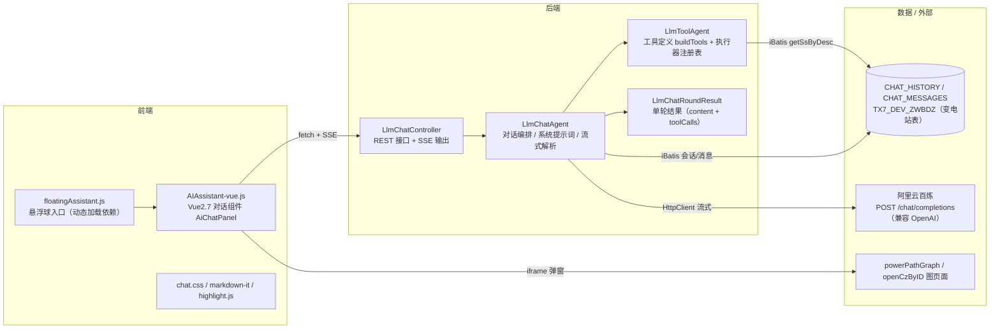
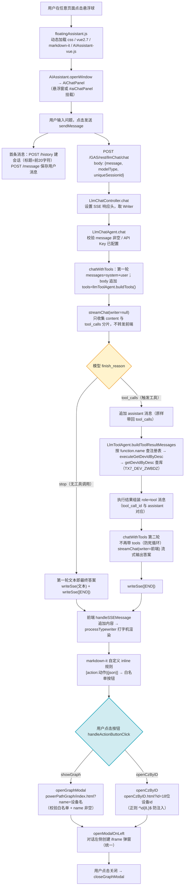
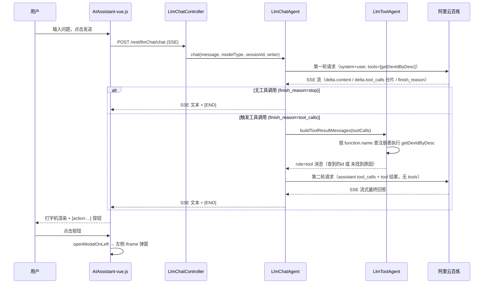

# AI 对话模块说明（LLM Chat Module）

> 维护人：牛富斌　｜　最后更新：2026-08-28
> 本文档用于沉淀本模块的**功能**、**执行流程**与**技术细节**，后续改动请同步更新。
> 流程图使用 Mermaid 编写（纯文本、可编辑），在 GitHub / VS Code / Typora / Obsidian 等支持 Mermaid 的 Markdown 渲染器中可直接查看。

---

## 1. 模块功能清单

| 功能 | 说明 | 入口 |
| --- | --- | --- |
| 悬浮助手入口 | 任意页面引入 `floatingAssistant.js` 后出现可拖拽悬浮球，点击打开 AI 对话窗口 | `floatingAssistant/floatingAssistant.js` |
| 流式对话 | 调用阿里云百炼（DashScope 兼容模式），SSE 流式输出，前端打字机逐字渲染 | `POST /GAS/rest/llmChat/chat` |
| Function Calling | 第一轮携带 `tools`，模型自行决定是否调用 `getDevIdByDesc` 工具；触发则本地执行后第二轮出答案 | `LlmChatAgent.chatWithTools` |
| 查看图像按钮 | 模型输出 `[action:showGraph|{"name":"..."}]`，前端渲染为“查看供电电源”按钮，点击在对话左侧弹出电源路径图 | `openGraphModal` |
| 供电范围/路径按钮 | 工具查到设备 id 后模型输出 `[action:openCzByID|{"id":"...","name":"..."}]`，渲染为“查看供电路径”按钮，左侧弹出单站供区图 | `openCzByID` |
| 历史会话 | 会话列表、消息记录、新建/删除/重命名/置顶、批量删除 | `/GAS/rest/llmChat/*` |
| 安全防护 | 前端动作白名单、HTML 转义、id 纯数字校验；系统提示词禁止模型输出 HTML/onclick | 前端 `AIAssistant-vue.js` |

---

## 2. 总体架构

---

## 3. 端到端执行流程（主流程图，可编辑）

### 3.1 时序图（对话主链路）

---

## 4. 前端技术细节（AIAssistant-vue.js）

### 4.1 入口与依赖
- 由 `floatingAssistant.js` 按需动态加载：`chat.css`、`github.min.css`、`dwr/engine.js`、`dwr/util.js`、`dwr/interface/gasService.js`、`vue2.7.14.js`、`markdown-it.min.js`、`highlight.min.js`、`AIAssistant-vue.js`。
- `AIAssistant.openWindow({modelType, title, height, top})` 创建弹窗，Vue2 组件 `AiChatPanel` 挂载。
- 弹窗定位：高度取 `#main_card-body` 高度，top 取 `.header` 下沿（`calcChatWindowPosition`），窗口 resize 时自动保持。

### 4.2 发送与 SSE 接收
- 请求体：`{ message, modelType, uniqueSessionId }`；`modelType` 由 `getModelType` 按关键词选择（重载/过载/停电/全停/故障 → `transferWorkFlow`，否则 `autoGraphWorkFlow`）。**后端当前不使用 modelType / uniqueSessionId（预留）**。
- 用 `fetch` POST `/GAS/rest/llmChat/chat`，读 `response.body.getReader()` 逐段解码。
- **跨 chunk 行缓冲**：SSE 的一行 `data:` 可能被拆成多段，用 `sseBuffer` 拼完整后再解析（`data: {"message":"..."}`）。
- 消息标记：
  - `[END]`：正常结束，触发打字机收尾并 `saveMessage` 保存 AI 消息。
  - `[ERROR]...`：错误；已有部分回复则追加错误文本结束，否则 `showError` 提示。
- 中断：`interruptReply` 关闭连接，把最后一条 AI 消息标记为中断并追加“（回复已中断）”。

### 4.3 打字机渲染（processTypewriter）
- 15ms 间隔逐字追加 `displayContent`，渲染为 `renderedContent`。
- 跳过 HTML 标签中间态（避免破坏标签）；对 `[action:...]` 标记做**整段跳过**：流式阶段未传完则原地等待，完整后才一次渲染为按钮，避免显示半截标记。
- markdown 渲染用 markdown-it，开启 `html: true`（但按钮只通过自定义规则生成，见下）。

### 4.4 动作按钮协议（前端渲染与安全）
- 自定义 inline 规则 `ai_action_button`（注册在 `link` 规则之前）解析 `[action:动作名|{json}]`。
- 白名单 `ACTION_HANDLERS = { showGraph: 'openGraphModal', openCzByID: 'openCzByID' }`，未注册动作不渲染。
- 按钮文案 `ACTION_BUTTON_LABELS = { showGraph: '查看供电电源', openCzByID: '查看供电路径' }`。
- `buildActionButtonHtml` 对动作名与参数做属性转义；点击由消息区事件委托 `handleActionButtonClick` 处理，JSON 解析失败直接忽略。
- 图像地址：
  - `IMAGE_GRAPH_BASE_URL = 'http://10.20.51.38:8080/GAS/WebPage/business/gas/powerPathGraph/index.html'`（**当前写死主机:端口**，`config.js` 里的 `GRAPH_URL` 动态地址暂未接入）。
  - `CZ_GRAPH_BASE_URL = '/GAS/WebPage/business/gas/LayeredFlowChart/openCzByID.html'`（相对路径）。
- 弹窗统一走 `openModalOnLeft(url, title)`：悬浮窗模式放**对话框左侧**（宽度=浏览器宽-对话框宽-间距），全屏挂载模式（`#aiChatPanel`）为居中覆盖；iframe 加载目标页面。
- 安全校验：`openCzByID` 要求 id 匹配 `/^\d{8,}$/`（设备 id 为 18 位数字，防 URL 注入）；`openGraphModal` 要求 name 非空且 base URL 必须包含 `/powerPathGraph/index.html`。

### 4.5 历史会话（前端）
- 接口统一封装 `callLlmChatApi`（base `/GAS/rest/llmChat`，GET/DELETE 拼 query，返回 `code==='200'` 取 `data`）。
- 首次提问创建会话（`chatId = 'chat_' + 时间戳 + 随机串`，标题取问题前 20 字符）；每条用户/AI 消息都 `saveMessage`。
- 历史面板：加载列表、点击加载消息、右键菜单（置顶/重命名/删除）、批量删除、固定面板；置顶通过 `SORT` 长度控制（≤12 位视为置顶）。
- 消息存储：用户消息存原文，AI 消息存 `renderedContent`（渲染后的 HTML）；加载时用户消息重新转义，AI 消息直接用已渲染内容避免二次渲染。

---

## 5. 后端技术细节

### 5.1 REST 接口（LlmChatController，前缀 `/GAS/rest/llmChat`）

`web.xml` 中 `DispatcherServlet`（servlet-name=rest）映射 `/rest/*`，故 Controller 的 `@RequestMapping("/llmChat")` 对外是 `/GAS/rest/llmChat`。

| 方法 | 路径 | 参数 | 说明 |
| --- | --- | --- | --- |
| GET | `/histories` | userId?, chatTitle? | 会话列表 |
| POST | `/history` | chatId, chatTitle, sort?, userId? | 建会话 |
| GET | `/messages` | chatId? | 某会话消息列表 |
| POST | `/message` | messageId, chatId, role, originalContent, renderedContent, createdTime(毫秒) | 存消息（后端转成 `yyyy-MM-dd HH:mm:ss`） |
| DELETE | `/history` | chatId | 删会话 |
| DELETE | `/messages` | chatId | 删消息 |
| PUT | `/history` | chatId, chatTitle?, sort?, userId? | 重命名/置顶 |
| POST | `/chat` | message, modelType, uniqueSessionId | **流式对话**，SSE 响应 |

统一返回 `ResponseType{code:"200"/"500", message, data}`；`/chat` 例外，直接写 SSE 流。

### 5.2 流式对话（LlmChatAgent）

#### chat() 入口
1. 空 message → SSE `[ERROR]请求内容为空`；API Key 未配置或为 `YOUR_*` → SSE `[ERROR]未配置API Key`。
2. 创建 `CloseableHttpClient`，调 `chatWithTools`；异常 → `[ERROR]...`；finally 关闭连接。

#### chatWithTools()：两轮 Function Calling
- **第一轮**：`buildChatRequestBody(buildMessages(message))` 后 `put("tools", llmToolAgent.buildTools())`；`streamChat(body, null, ...)` —— **writer 传 null**，只收集不转发。
  - 无工具调用（`toolCalls.isEmpty()`）：第一轮文本即最终答案，`writeSse(文本) + writeSse("[END]")` 结束（空内容兜底文案“抱歉，未能获取到有效回答，请重试”）。
  - 触发工具：`messages = buildMessages(message)` → 追加 `buildAssistantToolCallMessage(toolCalls)`（assistant 消息必须**原样带回 tool_calls**）→ 追加 `llmToolAgent.buildToolResultMessages(toolCalls)` 的 role=tool 消息。
- **第二轮**：`buildChatRequestBody(messages)` **不再带 tools**，`streamChat(body, writer, ...)` 流式输出最终回答，末尾 `[END]`。
- 设计要点：第二轮不带 tools 是为了**强制模型输出文字回答，避免再次触发工具调用形成死循环**；因此一次提问最多一轮工具调用。
- **上下文**：`buildMessages` 只组装 system + 当前用户问题，**不加载数据库历史**——当前每次请求对模型而言是单轮（历史仅用于前端展示，未回喂模型）。

#### streamChat()：一次 chat/completions 请求
- URL：`llmBaseUrl` + `/chat/completions`（兼容已配置到 `/v1` 或 `/v1/`；默认 `https://dashscope.aliyuncs.com/compatible-mode/v1`）。
- Header：`Authorization: Bearer <apiKey>`、`Content-Type: application/json`、`Accept: text/event-stream`。
- 超时：连接 10s、连接池 10s、Socket 60s。
- Body：`{model, stream:true, messages, [tools]}`；model 默认 `qwen-plus`。
- 解析：逐行读 `data:` 帧，`[DONE]` 结束；每帧取 `choices[0].delta`：
  - `delta.content` → 累加；writer 非空时立即 `writeSse` 转发。
  - `delta.tool_calls` → `mergeToolCallDeltas` 合并分片。
  - `finish_reason` 为 `stop` 或 `tool_calls` 时结束本轮。
- 返回 `LlmChatRoundResult(content, toolCalls)`。

#### tool_calls 分片合并（mergeToolCallDeltas）
- 每个函数调用分片带 `index`；`id` / `function.name` 只在首片出现，`function.arguments` 是 JSON 字符串片段，需**按 index 跨片拼接**。
- 用 `toolCalls` 列表按 index 补齐占位后合并。

### 5.3 工具注册表与执行（LlmToolAgent）

- 统一签名接口 `LlmToolExecutor { String execute(JSONObject args); }`，返回**直接喂给模型的工具结果文本**。
- 注册表 `Map<String, LlmToolExecutor> toolExecutors`：模型返回 `function.name` 后按名查找执行器。
- 注册方式：**匿名内部类**（不能用 lambda / 方法引用，原因见第 7 节）。
- `buildTools()`：组装 OpenAI/DashScope 兼容的 tools 数组，当前只有 `getDevIdByDesc`：
  - description：仅“供电范围/供电路径/供电区域”类问题调用；电源类问题**禁止调用**（应输出 showGraph）；其他问题不调用。
  - 参数 `devDesc`（必填）：模型从用户问题中自行提取设备/变电站描述（如“白洋变”）。
- `buildToolResultMessages(toolCalls)`：遍历每个调用 → 查注册表 → `parseArguments` 解析参数 → 执行 → 组装 `{role:"tool", tool_call_id, content}` 消息；未注册工具给模型明确错误文本（由模型转述，避免对话失败）。
- `executeGetDevIdByDesc(args)`：
  - devDesc 为空 → `设备id：未找到；原因：未识别到要查询的变电站或设备名称...`
  - 查库成功 → `【供电范围/供电路径查询结果】设备id：xxx；设备名称：yyy`（模型据此输出 openCzByID 按钮）
  - 未找到/失败 → `设备id：未找到；原因：zzz`（模型转述原因，不输出按钮）
- `getDevIdByDesc(devDesc)`（工具实现）：
  - iBatis `getSsByDesc`：`SELECT * FROM TX7_DEV_ZWBDZ WHERE DESCRIPTION LIKE CONCAT('%',#desc#,'%')`。
  - 多条匹配时取 **DESCRIPTION 最短**的一条（描述越短越接近设备本名）。
  - 返回 Map：`id`=CODE（18 位数字，即 openCzByID.html?id= 用的 id）、`name`=DESCRIPTION、`errorReason`；空值/异常时降级为原因文本，由模型转述。

### 5.4 系统提示词（buildSystemPrompt）

规则（模型输出协议）：
1. 用户要求“查看/打开/展示…图像/图形/图/接线图/示意图/供电电源/供电来源/电源情况”→ 先简短说明，末尾**单独一行**输出 `[action:showGraph|{"name":"设备或变电站名称"}]`。
2. 用户询问“供电范围/供电路径/供电区域”→ **必须调用 getDevIdByDesc**（devDesc 传名称，不要猜 id；电源类问题归规则 1，禁止调用）：
   - 工具返回 18 位数字 id → 末尾单独一行 `[action:openCzByID|{"id":"xxx","name":"yyy"}]`，id/name 原样使用；此时不再输出 showGraph。
   - 工具返回“未找到+原因” → 自然语言转述原因并提示确认名称重试，**不输出按钮**。
3. 其他问题：正常回答，不调用任何工具、不输出按钮。
4. 严禁输出 HTML、`<script>`、`onclick` 等可执行内容。
5. 按钮标记独占一行、每回复最多一个。

### 5.5 持久化（iBatis，llmChat.xml）

- 表 `CHAT_HISTORY`：CHAT_ID、CHAT_TITLE、USER_ID、SORT、CREATED_TIME。
- 表 `CHAT_MESSAGES`：MESSAGE_ID、CHAT_ID、ROLE(0 用户/1 AI)、ORIGINAL_CONTENT、RENDERED_CONTENT、CREATED_TIME、EXTENSION_MESSAGE。
- 语句：insertChatHistory / getChatHistories / deleteChatHistory / updateChatHistory / insertMessage / deleteMessages / getMessages / getSsByDesc。

### 5.6 配置项

| 配置 | 位置 | 说明 |
| --- | --- | --- |
| `llm.dashscope.apiKey` | `WebContent/WEB-INF/config.properties`（及地区配置） | 百炼 API Key；`beanConfig.xml` 默认 `YOUR_DASHSCOPE_API_KEY` |
| `llm.dashscope.baseUrl` | 同上 | 默认 `https://dashscope.aliyuncs.com/compatible-mode/v1` |
| `llm.dashscope.model` | 同上 | 默认 `qwen-plus` |
| `llmChatAgent` bean | `conf/beanConfig.xml` | 注入 df8600SqlExe、llmApiKey/baseUrl/model、llmToolAgent |
| `llmToolAgent` bean | 同上 | 注入 df8600SqlExe |

---

## 6. 关键文件清单

| 文件 | 职责 |
| --- | --- |
| `com/dfe/e8800/business/gas/agent/LlmChatAgent.java` | 对话编排、系统提示词、流式解析、SSE 输出、历史 CRUD |
| `com/dfe/e8800/business/gas/agent/LlmToolAgent.java` | 工具定义（buildTools）与执行器注册表（getDevIdByDesc） |
| `com/dfe/e8800/business/gas/beans/LlmChatRoundResult.java` | 单轮结果：content + toolCalls |
| `com/dfe/e8800/business/gas/controller/LlmChatController.java` | REST + SSE 接口 |
| `WebPage/business/gas/aiChat/AIAssistant-vue.js` | 前端 Vue 对话组件（渲染/SSE/按钮/弹窗/历史） |
| `WebPage/business/gas/aiChat/floatingAssistant.js`（同目录上级） | 悬浮球入口、按需加载依赖 |
| `WebPage/business/gas/aiChat/config.js` | 预留：动态 `GRAPH_URL`（当前未被 AIAssistant-vue.js 使用） |
| `conf/beanConfig.xml` | Spring Bean 装配 |
| `conf/ibatisSqlMap/llmChat.xml` | 会话/消息/变电站查询 SQL |

---

## 7. 已知技术约束与坑

1. **JDK 1.8 + Spring 3.1（内置旧 ASM）不能解析 `invokedynamic`**：在 `LlmToolAgent` 里用 lambda / 方法引用注册执行器会抛
   `BeanDefinitionStoreException ... ArrayIndexOutOfBoundsException: 8193`。**必须用匿名内部类**（代码中已加注释说明）。
2. **无 lambda / record / 新语法**：项目整体按 JDK 1.8 与旧框架约束编码。
3. **每次对话对模型是单轮**：历史消息只入库展示，未回喂模型（如需多轮记忆需改造 `buildMessages`）。
4. **图片地址写死**：`IMAGE_GRAPH_BASE_URL` 目前硬编码 `http://10.20.51.38:8080/...`，`config.js` 的动态 `GRAPH_URL` 未接入。
5. **日志规范**：log4j 1.x，不使用 `{}` 占位符，使用字符串拼接（`logger.info("...devDesc=" + devDesc)`）。

---

## 8. 请核对（与你的理解是否一致）

请重点确认以下几点是否与你的理解一致：

- [ ] 大模型在两轮内完成：第一轮带 `tools` 让模型选工具 → 后端本地执行 → 第二轮不带 `tools` 出最终答案，**一次提问最多一轮工具调用**。
- [ ] 工具不是“写在系统提示词里”，而是放在第一轮请求体的 `tools` 字段中；系统提示词只约束**输出格式与按钮协议**。
- [ ] `getDevIdByDesc` 返回 Map（id/name/errorReason），工具层把它转成两形态文本喂给模型，由模型决定输出按钮还是转述原因。
- [ ] 按钮不是模型输出的 HTML，而是 `[action:...]` 文本标记，由前端白名单渲染成按钮。
- [ ] showGraph（供电电源）与 openCzByID（供电范围/路径）两类按钮统一在对话左侧 iframe 弹窗打开。
- [ ] 当前模型侧无多轮上下文记忆（历史只入库展示）。
- [ ] 后端限制：JDK 1.8 + Spring 3.1，执行器注册不能用 lambda/方法引用。

如有出入，请指出，我会同步修订本文档与流程图。
