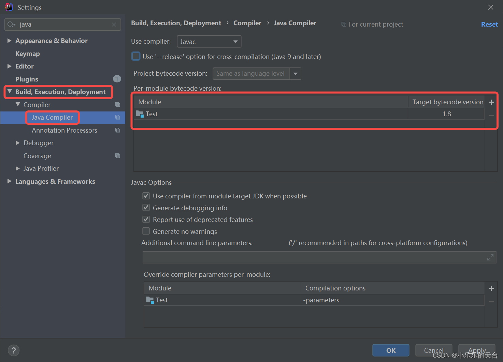

## IntelliJ IDEA

### IDEA检查项目的jdk版本需要看的地方

> 1、检查项目结构，如下图所示选择即可


> 选择了之后打开了如下界面：
> 下面的三张图全部都要检查选择jdk8的版本 


------

> 2、进入设置，如下所示：


> 进入之后，根据下图，挨个选择，将改项目模块的二进制码版本也选择成jdk1.8



> 在pom文件中检查java版本


### 使IDEA注释不顶格

1、进入 Settings -> Editor -> Code Style -> Java ，
2、在右边选择 “Code Generation” 

3、然后找到 Comment Code 那块，把Line comment at first column和
Block comment at first column 去掉前面两个的复选框


其它类型文件也可以通过这种方式实现“注释不顶格”。


### 修改IDEA快捷键

依次点击 File –> settings 或者 Ctrl + Alt + S –> Keymap，在右侧Keymap中下拉选择自己喜欢的快捷键方式，如下图


也可以修改某一个快捷键，如下图


可以在搜索框中搜索自己需要的功能，我需要的是将关闭标签页的ctrl + F4 修改为 ctrl + W


### 导出导入IDEA配置


导出的配置可以在其它的JetBrains产品使用

### IDEA全局查找替换

Ctrl + Shift + F 全局查找

Ctrl + Shift + R 全局替换

### IDEA自动 import 和 移除 类

> 在下面的两个可勾选项中，**On the fly**” 是一个英语短语，意思是 **即时地**、**动态地** 或 **随时随地** 完成某项任务，而无需事先停止或准备。


### IDEA同时管理多个可运行模块 / 底部添加services仪表盘

> 底部添加services仪表盘 就是 让IDEA同时管理多个可运行模块 的解决方案

按 Alt + 8 快捷键即可调出services仪表盘 


### IDEA配置代理（暂时需要验证）

> IDEA配置代理的想法来源：
>
> - 在之前使用Docker时，发现就算在服务器上开启了代理也不能让Docker使用docker search 和 docker pull等命令，需要为Docker配置代理才可以。
> - 而IDEA也有类似的情况：电脑上开了代理，IDEA有时候push也会失败，plugins market有时也会加载不出来插件市场的插件，需要开启Clash的TUN模式才能解决（**TUN 模式**模拟了一个虚拟网卡，能够接管系统的所有流量），因此我猜测IDEA并没有走代理，需要额外配置才能被代理接管


### 使用IDEA自定义代码片段

####  1. 打开IDEA，点击 `Settings`，选择 `Live Templates`。


#### 2. 点击 `Add`，选择 `2 Template Group`。


#### 3. 输入自定义的 `Group Name`，点击 `OK`。


#### 4. 选中自定义组，点击 `Add`，选择 `Live Template`。


#### 5. 添加自定义头注释：

- `Abbreviation` 输入 `hh`（根据个人习惯设置快捷键）。

- `Template text` 输入你喜欢的模板，例如：

  ```java
  /*
   * Copyright(C) [2023] [com.company]
   *
   * Author: [name]
   * Email: [email]
   *
   * This software is provided by the copyright owner under the terms of the license agreement.
   * Unauthorized use of this software is strictly prohibited.
   *
   * This software is provided under an open-source license without any express or implied warranties.
   * For details, please refer to the license file.
   */
  ```

- `Expand with` 选择 `Enter`。

- 点击 `Apply`。
  

### IDEA快捷键折叠/展开代码

**Ctrl + Shift + 减号**：折叠所有代码

所有代码被折叠


**Ctrl + Shift + 加号**：展开所有代码

所有代码被展开


## WebStorm

### WebStorm快捷键Prettier格式化代码


## GoLand

## PyCharm

## VSCode

### 创建自定义代码片段

1. **打开用户代码片段设置：**

   - 在 VSCode 中，按下 `Ctrl+Shift+P`（或 `Cmd+Shift+P`），调出命令面板。
   - 输入 `Snippets: Configure Snippets`后按回车。在新展示的内容中，选择
     
   - 在弹出的列表中，选择您所使用的编程语言（例如 `javascript`）。

2. **添加自定义代码片段：**

   - 在打开的代码片段文件中，添加以下内容：

     ```json
     {
       "document.getElementById": {
         "prefix": "did",
         "body": "document.getElementById('$1')",
         "description": "Insert document.getElementById"
       }
     }
     ```

   - 上述配置中，`prefix` 是触发补全的关键字，
     `body` 是插入的代码内容，
     `$1` 表示光标的初始位置（如果片段中有多个占位符，例如 `$1` 和 `$2`，按 `Tab` 键可以依次跳转到这些位置，逐个编辑内容。），
     `description` 是对该片段的描述。

3. **保存并使用：**

   - 保存代码片段文件。
   - 在 JavaScript 文件中，输入 `did`，然后按下 `Tab` 键，VSCode 将自动补全为 `document.getElementById('')`，并将光标定位在引号内，方便您直接输入元素的 ID。

### 自定义快捷键


搜索想要进行配置快捷键的功能


## VisualStudio

### VisualStudio2022设置快捷键

点击工具->选项，


选择环境->键盘即进入到设置快捷键的界面，


应用 VSCode 的键盘方案，VisualStudio和VSCode有了相同的快捷键


### VisualStudio2022快捷键总结

#### 快速生成属性 -- Ctrl R, Ctrl E

将鼠标光标放在要生成属性这一行，按下快捷键生成该字段的属性。


选中多个字段并按快捷键


