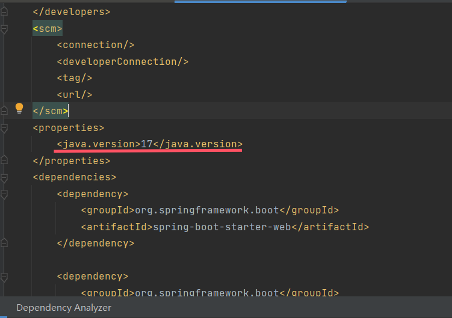

## IntelliJ IDEA

### IDEA检查项目的jdk版本需要看的地方

> 1、检查项目结构，如下图所示选择即可


> 选择了之后打开了如下界面：
> 下面的三张图全部都要检查选择jdk8的版本 


------

> 2、进入设置，如下所示：


> 进入之后，根据下图，挨个选择，将改项目模块的二进制码版本也选择成jdk1.8


> 在pom文件中检查java版本



### 使IDEA注释不顶格

1、进入 Settings -> Editor -> Code Style -> Java ，
2、在右边选择 “Code Generation” 

3、然后找到 Comment Code 那块，把Line comment at first column和
Block comment at first column 去掉前面两个的复选框


其它类型文件也可以通过这种方式实现“注释不顶格”。


### 修改IDEA快捷键

依次点击 File –> settings 或者 Ctrl + Alt + S –> Keymap，在右侧Keymap中下拉选择自己喜欢的快捷键方式，如下图


也可以修改某一个快捷键，如下图


可以在搜索框中搜索自己需要的功能，我需要的是将关闭标签页的ctrl + F4 修改为 ctrl + W


### 导出导入IDEA配置


导出的配置可以在其它的JetBrains产品使用

### IDEA全局查找替换

Ctrl + Shift + F 全局查找

Ctrl + Shift + R 全局替换

### IDEA自动 import 和 移除 类

> 在下面的两个可勾选项中，**On the fly**” 是一个英语短语，意思是 **即时地**、**动态地** 或 **随时随地** 完成某项任务，而无需事先停止或准备。


### IDEA同时管理多个可运行模块 / 底部添加services仪表盘

> 底部添加services仪表盘 就是 让IDEA同时管理多个可运行模块 的解决方案

按 Alt + 8 快捷键即可调出services仪表盘 


### IDEA配置代理（暂时需要验证）

> IDEA配置代理的想法来源：
>
> - 在之前使用Docker时，发现就算在服务器上开启了代理也不能让Docker使用docker search 和 docker pull等命令，需要为Docker配置代理才可以。
> - 而IDEA也有类似的情况：电脑上开了代理，IDEA有时候push也会失败，plugins market有时也会加载不出来插件市场的插件，需要开启Clash的TUN模式才能解决（**TUN 模式**模拟了一个虚拟网卡，能够接管系统的所有流量），因此我猜测IDEA并没有走代理，需要额外配置才能被代理接管


### 使用IDEA自定义代码片段

####  1. 打开IDEA，点击 `Settings`，选择 `Live Templates`。


#### 2. 点击 `Add`，选择 `2 Template Group`。


#### 3. 输入自定义的 `Group Name`，点击 `OK`。


#### 4. 选中自定义组，点击 `Add`，选择 `Live Template`。


#### 5. 添加自定义头注释：

- `Abbreviation` 输入 `hh`（根据个人习惯设置快捷键）。

- `Template text` 输入你喜欢的模板，例如：

  ```java
  /*
   * Copyright(C) [2023] [com.company]
   *
   * Author: [name]
   * Email: [email]
   *
   * This software is provided by the copyright owner under the terms of the license agreement.
   * Unauthorized use of this software is strictly prohibited.
   *
   * This software is provided under an open-source license without any express or implied warranties.
   * For details, please refer to the license file.
   */
  ```

- `Expand with` 选择 `Enter`。

- 点击 `Apply`。
  

### IDEA快捷键折叠/展开代码

**Ctrl + Shift + 减号**：折叠所有代码

所有代码被折叠


**Ctrl + Shift + 加号**：展开所有代码

所有代码被展开


### IDEA自动同步代码到**虚拟机** / **服务器**

#### 创建连接

1.首先点击 Tools -> Deployment -> Configuration


在新窗口中点击 `加号`，再点击 `SFTP`


接下来点击此处


#### 创建映射

1.在创建完连接之后，先点击要同步的服务器，再点击Mappings


2.按照下图配置。


3.按照图中勾选自动上传


4.也可以手动同步


最后可以看到文件全部同步到远程服务器


## WebStorm

### WebStorm快捷键Prettier格式化代码


## GoLand

## PyCharm

## VSCode

### 创建自定义代码片段

1. **打开用户代码片段设置：**

   - 在 VSCode 中，按下 `Ctrl+Shift+P`（或 `Cmd+Shift+P`），调出命令面板。
   - 输入 `Snippets: Configure Snippets`后按回车。在新展示的内容中，选择
     
   - 在弹出的列表中，选择您所使用的编程语言（例如 `javascript`）。

2. **添加自定义代码片段：**

   - 在打开的代码片段文件中，添加以下内容：

     ```json
     {
       "document.getElementById": {
         "prefix": "did",
         "body": "document.getElementById('$1')",
         "description": "Insert document.getElementById"
       }
     }
     ```

   - 上述配置中，`prefix` 是触发补全的关键字，
     `body` 是插入的代码内容，
     `$1` 表示光标的初始位置（如果片段中有多个占位符，例如 `$1` 和 `$2`，按 `Tab` 键可以依次跳转到这些位置，逐个编辑内容。），
     `description` 是对该片段的描述。

3. **保存并使用：**

   - 保存代码片段文件。
   - 在 JavaScript 文件中，输入 `did`，然后按下 `Tab` 键，VSCode 将自动补全为 `document.getElementById('')`，并将光标定位在引号内，方便您直接输入元素的 ID。

### 自定义快捷键


搜索想要进行配置快捷键的功能


## VisualStudio

### VisualStudio2022设置快捷键

点击工具->选项，


选择环境->键盘即进入到设置快捷键的界面，


应用 VSCode 的键盘方案，VisualStudio和VSCode有了相同的快捷键


### VisualStudio2022快捷键总结

#### 快速生成属性 -- Ctrl R, Ctrl E

将鼠标光标放在要生成属性这一行，按下快捷键生成该字段的属性。


选中多个字段并按快捷键


### VisualStudio2022安装ReSharper插件破解版

首先打开JetBrains的[ReShaper官网](https://www.jetbrains.com.cn/resharper/download/other.html)，下载2022.x版本的ReSharper。


下载并安装后，右键以管理员身份运行[破解工具](https://pan.baidu.com/s/1BZQaN9nfXmGt0f4GTDpb1w?pwd=5wjb)


运行后将有30天免费试用，每次到期后运行依次即可。

## Eclipse

### 设置 sql 颜色

1.点击window,选择Preferences


2.搜索syn,查找 Sql Editor 下的 [Syntax](https://so.csdn.net/so/search?q=Syntax&spm=1001.2101.3001.7020) Coloring,选择它


3.有时候点了apply,不会马上起作用，要先关闭打开的sql文件，再重新打开才会看到效果

### 切换Jdk版本和SpringBoot

> 原文地址：https://juejin.cn/post/7175531370242900028

在创建SpringBoot项目时，没有提供Jdk1.8的选项，只能先选择高版本Jdk，再降级Jdk版本

#### 一、SpringBoot版本

SpringBoot版本只需要更改此处即可


#### 二、JDK版本

此处以我把jdk版本从1.8切换到1.7为例：

其实方法很简单，所有需要在eclipse中设置，分两块：

##### 第一块

设置eclipse工作空间的JDK版本，即eclipse中所有项目的编译运行的环境（全局配置）

###### 步骤1

Window —> Preferences —> Java —> Compiler —> 右侧面板设置为1.7

如图所示：


###### 步骤2

Window —> Preferences —> Java —> Installed JREs —> 右侧面板“Add”本地的1.7版本JDK路径，并勾上


如果没有上面5的话，就点击5右边的Add…如下图：


点击Next会出现下图所示：按指示往下进行


##### 第二块

配置你要改变JDK的项目的JDK版本：

###### 步骤3

点击项目右键 —> Properties —> Java Build Path —> Libraries —> 然后确保Libraries右侧的标签页“Order And Export”也出现JRE System Library [JavaSE-1.7]

点击项目右键（一般是cms-core分项目，而不是cms-cms项目）—> Properties（或项目右键 —> Build Path —> Configure Build Path）—> Java Build Path（右侧面板）—> Libraries —>（如果有JRE System Library [JavaSE-1.8]就点右侧的“Edit…”改为本地jdk1.7，如果是其他的jdk点“Remove” —> Add Library… —> 选“JRE System Library ” —> Next —> 再改为本地的jdk1.7）—> 然后确保Libraries右侧的标签页“Order And Export”也出现JRE System Library [JavaSE-1.7]

###### 步骤4

与Java Build Path同页面的Java Compiler—右侧面板设置为1.7

###### 步骤5

与Java Compiler同页面的Project Facets—右侧面板勾上Java，Version设为1.7


**重要提示**：有些人本来项目是好的或者新导下来没问题的项目，在设置完JDK后项目就出错了，项目包名上有小红叉，但是就是没找到报错的文件，此时你就要看看是不是你的项目右键 —> build path设置页面有没有报错的，也要看看你的JDK版本这几步都设置到了吗，少其中一步你的项目可能会报错出现小红叉而不会在具体的文件上出现小红叉，即使你的项目能跑，好像运行没什么问题，等项目部署到服务器上，真正的版本问题出现，很有可能就找不到方向了。在此重要提醒！！！

### 插件商店修改镜像

> 原文地址：https://blog.csdn.net/weixin_43954092/article/details/105114635

在使用eclipse进行开发的时候，经常会用到一些插件来提高开发效率。

但因为eclipse默认从官网下载的。因此，经常会出现下载时间很长，或者下载失败的情况。

那么如何优化eclipse插件下载速度呢，我们可以选择使用国内镜像站。

那么，本文就谈谈要如何将eclipse的默认网站修改为国内镜像站。

**第一步**：点击Window–>Preferences，进入Preferences界面


**第二步**：输入"Available"进行搜索，进入Available Software Sites界面


**第四步**：在这个界面，将默认网站修改为国内镜像站：即把所有的http://download.eclipse.org/改为**http://mirrors.ustc.edu.cn/eclipse/**


修改完成后，点击Apply and Close。

完成这些操作，重新开始下载插件，会发现下载速度快了很多

> 更改结果如下图：
>
> 

### yml文件中将回车从Tab变为Space

1. **打开Eclipse的偏好设置:**点击`Window` -> `Preferences`。
2. **找到文本编辑器设置:**依次选择`General` -> `Editors` -> `Text Editors`。
3. **设置Tab键行为:**勾选`Insert spaces for tabs`选项。这会使Eclipse在按下Tab键时插入空格而不是Tab字符。

配置之后，在所有文件中按回车键，都会在新一行开头填充开头。


### 代码花括号自动新起一行(设置代码格式标准)

preferences -> Java -> Code Style -> Formatter -> Edit / New


经过上面的设置，代码的花括号就会自动另起一行了。

也可以设置在此页面设置其它内容

### 自动生成Getter/Setter

右键，点击Source，或者直接按**Alt + Shift +S**
再点击Generate Geeters and Setters，就会自动在鼠标位置生成Get Set方


### 快速导入包

Ctrl + Shift + O

### Eclipse开启与关闭代码提示

> 原文地址：https://blog.csdn.net/weixin_48419914/article/details/121551738

#### 关闭

**Eclipse 取消自动代码提示**

1. 去到菜单window->Preferences->Java->Editor->ContentAssist
2. **看看Enable auto activation之前有没有打上勾 ,有勾去掉即可**

去掉自动提示后也可以在输入代码的字母后按**alt+/**进行提示

#### 开启 

**一、Eclipse代码里面的代码提示功能默认是关闭的，只有输入“.”的时候才会提示功能**

如何修改eclipse配置，开启代码自动提示功能 

1. 打开 **Eclipse -> Window -> Perferences -> Java -> Editor -> Content Assist**
2. 在右边最下面一栏找到**auto-Activation** 
3. 下面有三个选项，找到第二个“**Auto activation triggers for Java**：”选项 在其后的文本框中会看到一个“**.**”存在。这表示：只有输入“**.**”之后才会有代码提示和自动补全。
4. 把该文本框中的“**.**”换掉，换成“**abcdefghijklmnopqrstuvwxyz.**”，这样，你在Eclipse里面写Java代码就可以做到按“**abcdefghijklmnopqrstuvwxyz.**”中的任意一个字符都会有代码提示。 

> 小白笔者建议：不要所有字母全部开启，否则会有特别麻烦的提示效果，笔者只开启了s和o两个字母，方便syso能提示出System.out.println()

**二、可是eclipse不允许输入这么的字符，文本框中最多允许输入4个字符**

通过修改配置文件的方法实现，具体操作步骤如下: 

1. 打开Eclipse，然后**“window”→“Preferences**”
2. 选择“java”，展开，“Editor”，选择“Content Assist”。

3.选择“Content Assist”，然后看到右边，右边的“**AutoActivation**”下面的“**Auto Activation triggers for java**”这个选项。其实就是指触发代码提示的就是“**.**”这个符号。 

4.“**AutoActivation triggers for java**”这个选项，在“**.**”后加**abc**字母，方便后面的查找 修改。然后“apply”，点击“OK”。

5. 然后**，“File”→“Export”**，在弹出的窗口中选择**“General”→“Perferences”**，点击“下一步”。
6. 选择导出文件路径，本人导出到桌面，输入“abc”作为文件名，点击“保存”。
7. 在桌面找到刚在保存的文件“abc.epf”,右键选择“用记事本打开”。 
8. 按“ctrl + F”快捷键，输入“.abc”，点击“查找下一个”。
9. 查找到“.abc”的配置信息如下：如下：
10. 把**“.abc”改成“.abcdefghijklmnopqrstuvwxyz**(,”，保存，关闭“test.epf”。
11. 回到MyEclipse界面，**“File”→“Import”**，在弹出的窗口中选择“Perferences”，点击“下一步”，选择刚在已经修改的“**abc.epf**”文件，点击“打开”，点击“Finish”。该步骤和上面 的导出步骤类似。

12.修改完毕，测试一下就行了

### 快速生成serialVersionUID

先实现Serializable接口

再把鼠标放到按Ctrl + 1。

再按Quick Fix

### 更新Maven依赖

右键 -> Maven -> Update Project


### xml文件 提示Element type “xxx“ must be declared

Preference -> XML（Wild Web Developer）

勾选Download external resources like referenced DTO，XSD


### 选择一整列（块选择模式）

Alt+Shift+A  开启块选择模式，开启后可以选中一列
