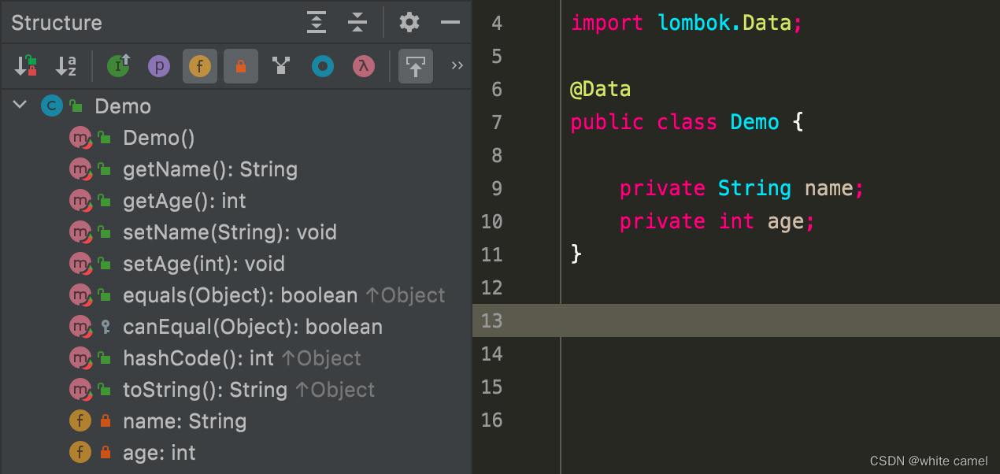
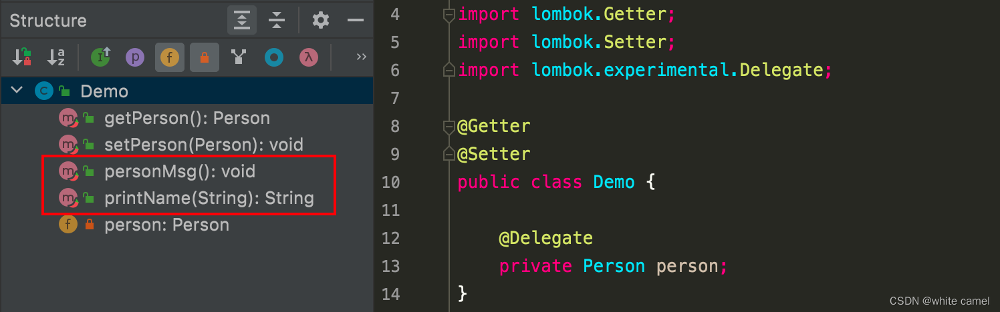
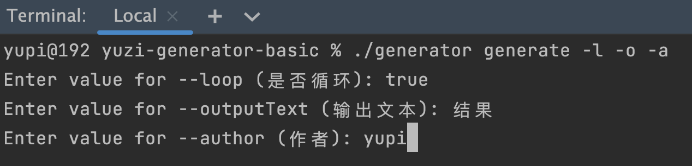
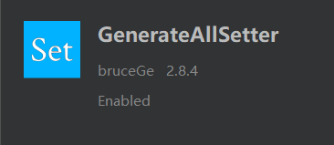
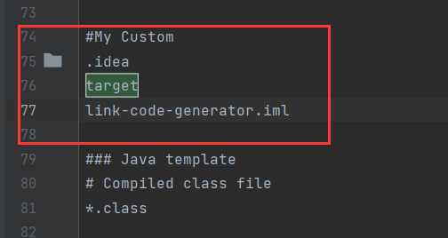

## Java实用类库

### Apache Commons 常用工具类

#### 一、commons-lang3

##### 引入依赖

```xml
<dependency>
    <groupId>org.apache.commons</groupId>
    <artifactId>commons-lang3</artifactId>
    <version>3.12.0</version>
</dependency>
```

##### StringUtils 字符串工具类

```java
包含判断方法：contains/containsXXX 
字符串替换方法：replace/replaceXXX 
获取子串：substring/substringXXX 
判断方法：
1、isEmpty/isNotEmpty/isBlank/isNotBlank/isNumeric/isWhitespace/isAnyBlank
2、sartsWith/startsWithAny/endsWith/endsWithIgnoreCase
索引(index)：indexOf/indexOfXXX/tIndexOf/lastIndexOfXXX
处理方法：
    abbreviate 缩短 capitalise 首字母 repeat 重复 left/right/center 左右中间
    removeXXX 移除 trimXXX 去空  reverseXXX 翻转 stripXXX 移除
    defaultXXX 默认 lowerCase/upperCase deleteXXX 删除处理
    splitXXX分解处理 join 拼接
```

##### StringEscapeUtils 转义字符串工具类

> StringEscapeUtils类可以对html js xml sql 等代码进行转义来防止SQL注入

```java
escapeCsv/unescapeCsv/escapeHtml/unescapeHtml/escapeJava/unescapeJava
escapeJavaScript/unescapeJavaScript/escapeXml/unescapeXml/escapeSql
```

##### NumberUtils 数字工具类

```java
创建数字：createXXX  创建Integer,Float,Double,Number,BigDecimal,BigInteger等数字
字符转数字：toXXX     字符串转数字：Byte,Double,Float,Int,Long,Short
判断是否数字：isDigits/isNumber
其他方法：compare,max,min,
```

##### ArrayUtils 数组工具类

```java
添加移除:add,addAll，remove,removeElement,
拷贝：clone
判断：contains,isEmpty,isNotEmpty,isEquals,isSameLength,
其他：getLength,indexOf,lastIndexOf,nullToEmpty,reverse,subArray,
转换：toMap,toObject,toPrimitive,toString
```

##### RandomUtils 随机数工具类

```java
nextBoolean/nextInt/nextLong/nextFloat/nextDouble
```

##### RandomStringUtils 随机字符串工具类

```java
random/randomNumeric/randomAlphabetic/randomAscii
```

##### DateUtils 日期工具类

```java
说明：XXX表示milisecends,seconds,minutes,hours,days,weeks,months,years
时间加减：add/addXXX 
时间设置：setXXX 
获取片段：getFragmentInXXX    获取date的1月1日0点0分0秒到指定时间的片段值
判断： isSameDay/isSameInstant/isSameLocalTime
转换： parseDate/parseDateStrictly
取模： ceiling/round/truncate
时间段：iterator   注意rangeStyle=1到4表示周范围以及偏移，5和6表示月偏移
```

##### DateFormatUtils时间格式化

```java
格式化：format/formatUTC
```

##### DurationFormatUtils时间段格式化

```java
formatDuration/formatDurationHMS/formatDurationISO
formatPeriod/formatPeriodISO
formatDurationWords
```

##### StopWatch 秒表

```java
start/stop/suspend/split/resume/reset/unsplit
getSplitTime/getStartTime/getTime/
toSplitString/toString
```

##### EnumUtils 枚举工具类

```java
getEnum/getEnumIgnoreCase/getEnumList/getEnumMap
iterator
```

##### 反射工具类

######## ClassUtils 类工具

```java
获取： 
    1、类和接口 ：getClass/getAllInterfaces/getAllSuperclasses/getShortClassName
    2、包：getPackageName/getPackageCanonicalName
    3、方法：getPublicMethod
转换：
    1、toClass/convertClassesToClassNames/convertClassNamesToClasses/
    2、primitivesToWrappers/primitiveToWrapper/wrappersToPrimitives/wrapperToPrimitive
判断：isAssignable/isInnerClass
```

######## MethodUtils

```java
getAccessibleMethod/getMatchingAccessibleMethod
invokeMethod/invokeStaticMethod/invokeExactMethod/invokeExactStaticMethod
```

######## FieldUtils

```java
getField/readField/writeField
getDeclaredField/readDeclaredField/writeDeclaredField
readDeclaredStaticField/readStaticField/writeDeclaredStaticField/writeStaticField
```

######## ConstructorUtils

```java
getAccessibleConstructor/getMatchingAccessibleConstructor
invokeConstructor/invokeExactConstructor
```

##### ObjectUtils 对象工具类

```java
max/min/toString/identityToString/appendIdentityToString/defaultIfNull
```

##### SystemUtils 系统属性工具类

```java
getJavaHome/getJavaIoTmpDir/getJavaVersion/getUserDir/getUserHome/
isJavaAwtHeadless/isJavaVersionAtLeast
```

##### SerializationUtils 序列化工具类

```java
clone/deserialize/serialize
```

##### LocaleUtils 本地工具类

```java
availableLocaleList/availableLocaleSet
countriesByLanguage
localeLookupList/toLocale/isAvailableLocale/languagesByCountry
```

#### 二、commons-collecions4

##### 引入依赖

```xml
<!-- https://mvnrepository.com/artifact/org.apache.commons/commons-collections4 -->
<dependency>
    <groupId>org.apache.commons</groupId>
    <artifactId>commons-collections4</artifactId>
    <version>4.4</version>
</dependency>
```

##### CollectionUtils 集合工具类

```java
添加/删除:addAll/addIgnoreNull/retainAll/removeAll/
获取：
	find/get/containsAny/index/size/sizeIsEmpty/select/selectRejected/subtract
	typedCollection
判断： 
	isEmpty/isNotEmpty/isFull/exists/isEqualCollection/
	isSubCollection/isProperSubCollection 
转换： 
	collect/transform/transformedCollection/predicatedCollection
	unmodifiableCollection/synchronizedCollection 
计算：cardinality/countMatches/maxSize
过滤：filter
集合：intersection/union/disjunction  交集，并集，差集
其他操作：
   reverseArray  翻转  forAllDo 给每个元素执行闭包
   getCardinalityMap 转成Map,key是元素，value是次数
```

##### ListUtils-List工具类

```java
判断： isEqualList
集合：intersection/sum/union/retainAll 交集，并集，合集，差集
操作：removeAll/hashCodeForList
子集： typedList/subtract/fixedSizeList
转换处理：synchronizedList/unmodifiableList/predicatedList/transformedList/lazyList
```

##### SetUtils-Set集合工具类

```java
判断：isEqualSet
转换处理：
		transformedSet/transformedSortedSet/predicatedSet/predicatedSortedSet
		unmodifiableSet/synchronizedSet/synchronizedSortedSet
		orderedSet/typedSet/typedSortedSet
操作：hashCodeForSet
```

##### MapUtils-Map工具类

```java
获取：getObject/getString/getXXX/getXXXValue  获取指定类型值，getXXXValue 如果没有值则默认值
子集：fixedSizeMap/fixedSizeSortedMap/typedMap/typedSortedMap
判断：isEmpty/isNotEmpty
转换：
	predicatedMap/predicatedSortedMap/transformedMap/transformedSortedMap/
	synchronizedMap/synchronizedSortedMap/
	unmodifiableMap/unmodifiableSortedMap/multiValueMap/orderedMap
	toMap/toProperties/lazyMap/lazySortedMap
添加移除：safeAddToMap/putAll
其他操作：invertMap/debugPrint/verbosePrint
```

#### 三、commons-beanutils

##### 引入依赖

```xml
<dependency>
    <groupId>commons-beanutils</groupId>
    <artifactId>commons-beanutils</artifactId>
    <version>1.9.4</version>
</dependency>
```

##### BeanUtils/BeanUtilsBean

```java
拷贝： cloneBean/copyProperties/copyProperty
获取：getArrayProperty/getSimpleProperty/getProperty
其他操作：setProperty设置属性 populate将Bean设置到Map中  describe将Bean转成Map  
```

##### PropertyUtils类

```java
判断：isReadable/isWriteable
获取：
	getProperty/getSimpleProperty/getPropertyType 
	getReadMethod/getWriteMethod/getIndexedProperty/setIndexedProperty
	getMappedProperty/setMappedProperty/getNestedProperty/setNestedProperty  
	getPropertyDescriptor/getPropertyEditorClass
拷贝和设置：copyProperties/setProperty/setSimpleProperty /clearDescriptors       
```

#### 四、commons-io

##### 引入依赖

```xml
<dependency>
    <groupId>commons-io</groupId>
    <artifactId>commons-io</artifactId>
    <version>2.11.0</version>
</dependency>
```

##### FileUtils 文件操作工具类

```java
文件夹操作： 
 copyDirectory/deleteDirectory/cleanDirectory/getTempDirectory/getTempDirectoryPath
 moveDirectory/moveDirectoryToDirectory/moveFileToDirectory/moveToDirectory
 forceMkdir/getUserDirectory/getUserDirectoryPath
文件操作：
	touch/copyFile/copyURLToFile/moveFile/deleteQuietly/forceDelete/forceDeleteOnExit
	toFile/toFiles/toURLs
	isFileNewer/isFileOlder
	readLines/readFileToByteArray/readFileToString/lineIterator/openOutputStream
	write/writeLines/writeByteArrayToFile/writeStringToFile/openInputStream
其他操作：
    iterateFiles/listFiles/contentEquals/sizeOf/sizeOfDirectory
```

##### IOUtils 流操作工具类

```java
读操作：lineIterator/read/readLines
写操作：write/writeLines
转换： toInputStream/toBufferedInputStream/toByteArray/toCharArray/toString
其他操作：copy/copyLarge/contentEquals/skip/skipFully/closeQuietly
```

##### FilenameUtils 文件名工具类

```java
获取：
	getName/getBaseName/getPrefix/getPrefixLength/getExtension
	getPath/getFullPath/getFullPathNoEndSeparator/getPathNoEndSeparator
判断：
	isExtension/equals/equalsNormalized/equalsOnSystem
其他操作：
	removeExtension/indexOfExtension
	separatorsToSystem/separatorsToUnix/separatorsToWindows
	indexOfLastSeparator
```

##### 其他工具类

```java
文件比较器：
    CompositeFileComparator/DefaultFileComparator/DirectoryFileComparator
    ExtensionFileComparator/LastModifiedFileComparator/NameFileComparator
    PathFileComparator/PathFileComparator
文件过滤器：
    AgeFileFilter/AndFileFilter/CanReadFileFilter/CanWriteFileFilter
    DelegateFileFilter/DirectoryFileFilter/EmptyFileFilter/FalseFileFilter/FileFileFilter
    FileFilterUtils/HiddenFileFilter/MagicNumberFileFilter/NameFileFilter/NotFileFilter
    OrFileFilter/PrefixFileFilter/RegexFileFilter/SizeFileFilter/SuffixFileFilter
    TrueFileFilter/WildcardFileFilter/WildcardFilter
```

### lombok常用注解

#### 介绍

> 官方网址 : https://projectlombok.org/

Lombok是一款Java开发插件，使得Java开发者可以通过其定义的一些注解来消除业务工程中冗长和繁琐的代码，尤其对于简单的Java模型对象（POJO）。

在开发环境中使用Lombok插件后，Java开发人员可以节省出重复构建，诸如hashCode和equals这样的方法以及各种业务对象模型的accessor和ToString等方法的大量时间。对于这些方法，**它能够在编译源代码期间自动帮我们生成这些方法**，并没有如反射那样降低程序的性能。

#### 引入Maven依赖

> 采用最新版本 1.18.24

```xml
<dependency>
    <groupId>org.projectlombok</groupId>
    <artifactId>lombok</artifactId>
    <scope>provided</scope>
    <version>1.18.24</version>
</dependency>
```

#### 常用的注解

##### @NoArgsConstructor/@AllArgsConstructor

- @NoArgsConstructor/@AllArgsConstructor就是为该类产生无参的构造方法和包含所有参数的构造方法

测试案例1:

```java
@AllArgsConstructor
public class Demo extends Parent{
    private String name;
    private int age;
}

@AllArgsConstructor
@NoArgsConstructor
class Parent {
    private Integer id;
}
```

编译后的两个class文件如下：

> 此注解并不会把父类的属性id拿到Demo的构造器里面去，这是需要注意的地方。

```java
public class Demo {
    private String name;
    private int age;

    public Demo() {
    }

    public Demo(String name, int age) {
        this.name = name;
        this.age = age;
    }
}

class Parent {
    private Integer id;

    public Parent(Integer id) {
        this.id = id;
    }

    public Parent() {
    }
}
```

通过IDEA的类结构, 也可以看出来生成了哪些东西


------

测试案例2:

> 通过 @AllArgsConstructor(access = AccessLevel.PROTECTED) , 可以指定构造器的访问权限

```java
@AllArgsConstructor(access = AccessLevel.PROTECTED)
public class Demo{
    private String name;
    private int age;
}
```

编译后生成:

```java
public class Demo {
    private String name;
    private int age;

    protected Demo(String name, int age) {
        this.name = name;
        this.age = age;
    }
}
```

------

测试案例3:

> @AllArgsConstructor(access = AccessLevel.PROTECTED, staticName = “test”)

```java
@AllArgsConstructor(access = AccessLevel.PROTECTED, staticName = "test")
public class Demo{
    private final int finalVal = 10;
    private String name;
    private int age;
}
```

编译后 :

```java
public class Demo {
    private String name;
    private int age;

    private Demo(String name, int age) {
        this.name = name;
        this.age = age;
    }

    protected static Demo test(String name, int age) {
        return new Demo(name, age);
    }
}
```

上面效果为：可以指定生成的构造器的访问权限。但是如果指定了一个静态方法，那么构造器会自动会被**private**，只通过静态方法对外提供访问，并且我们发现final的属性值，是不会放进构造函数里面的。

> @NoArgsConstructor的使用方式同@AllArgsConstructor

##### @RequiredArgsConstructor

@RequiredArgsConstructor注解则会将类中所有带有`@NonNull注解 / org.jetbrains.annotations.NotNull注解`的或者带有`final修饰的成员变量`生成对应的构造方法

测试案例:

```java
@RequiredArgsConstructor
public class Demo {

    @NonNull
    private final int finalVal;
    @NonNull
    private String name;
    @NonNull
    private int age;
}
```

编译后生成:

```java
public class Demo {
    @NonNull
    private final int finalVal;
    @NonNull
    private String name;
    @NonNull
    private int age;

    public Demo(@NonNull int finalVal, @NonNull String name, @NonNull int age) {
        if (name == null) {
            throw new NullPointerException("name is marked non-null but is null");
        } else {
            this.finalVal = finalVal;
            this.name = name;
            this.age = age;
        }
    }
}
```


解释：该注解会识别@NonNull字段和final修饰得字段，然后以该字段为元素生成一个构造函数。

> 如果所有字段都没有@NonNull注解，那效果同@NoArgsConstructor ;
> @RequiredArgsConstructor 注解的参数, 和其他两个注解一样

> 注意: 当然这三个生成构造器的注解，要求成员变量都是非静态的, 否则静态变量不会在构造器中被赋值

##### @Getter/@Setter

这一对注解从名字上就很好理解，用在成员变量上面或者类上面，相当于为成员变量生成对应的get和set方法，**同时还可以为生成的方法指定访问修饰符**，当然，默认为public

```java
// 如果指定在类上,所有字段都会生成get/set方法
// 指定在字段上, 只有标注的字段才会生成get/set方法
@Getter
@Setter
public class Demo {

    private String name;
    private int age;
}
```


> 这两个注解直接用在类上，可以为此类里的所有非静态成员变量生成对应的get和set方法。**如果是final变量，那就只会有get方法**

##### @ToString/@EqualsAndHashCode

这两个注解也比较好理解，就是生成toString，equals和hashcode方法，同时后者还会生成一个canEqual方法，用于判断某个对象是否是当前类的实例。**生成方法时只会使用类中的非静态成员变量。**

```java
@ToString
@EqualsAndHashCode
public class Demo {

    private String name;
    private int age;
}
```


> 有些关键的属性，可以控制toString的输出，我们可以了解一下：

```java
//@EqualsAndHashCode也有类似的下面的属性,
@ToString(
        includeFieldNames = true, //是否使用字段名
        exclude = {"name"}, //排除某些字段
        of = {"age"}, //只使用某些字段
        callSuper = true //是否让父类字段也参与 默认false
)
```

##### @Data

相当于注解集合。效果等同于 **@Getter + @Setter + @ToString + @EqualsAndHashCode + @RequiredArgsConstructor** 效果同和这5个注解的效果

> 需要注意的是，这里不包括@NoArgsConstructor和@AllArgsConstructor
>
> - 所以, 一般使用@Data时,要配合这两个注解一起使用

```java
@Data
public class Demo {
    private String name;
    private int age;
}
```



##### @Builder

@Builder提供了一种比较推崇的构建值对象的方式; 非常推荐的一种构建值对象的方式。

缺点就是父类的属性不能产于builder

> 标注@Builder的类, 会在类内部生成一个内部类,用于生成值对象

```java
@Builder
public class Demo {
    private final int finalVal = 10;

    private String name;
    private int age;
}
```

编译后生成:

```java
public class Demo {
    private final int finalVal = 10;
    private String name;
    private int age;

    Demo(String name, int age) {
        this.name = name;
        this.age = age;
    }

    public static Demo.DemoBuilder builder() {
        return new Demo.DemoBuilder();
    }

    public static class DemoBuilder {
        private String name;
        private int age;

        DemoBuilder() {
        }

        public Demo.DemoBuilder name(String name) {
            this.name = name;
            return this;
        }

        public Demo.DemoBuilder age(int age) {
            this.age = age;
            return this;
        }

        public Demo build() {
            return new Demo(this.name, this.age);
        }

        public String toString() {
            return "Demo.DemoBuilder(name=" + this.name + ", age=" + this.age + ")";
        }
    }
}
```


使用方式:

```java
public class Main {

    public static void main(String[] args) {
        Demo demo = Demo.builder().name("zss").age(20).build();
        System.out.println(demo);
    }
}
```

> **`一般我们给POJO类, 标注的Lombok注解, 百分之90就是这4个 : @Data, @NoArgsConstructor, @AllArgsConstructor, @Builder`**

##### @Accessors

@Accessors 一个为getter和setter方法设计的更流畅的注解
这个注解要搭配@Getter与@Setter使用，用来修改默认的setter与getter方法的形式。

**@Accessors属性详解**

- fluent 属性 : 链式的形式 这个特别好用，方法连缀越来越方便了
- chain 属性 : 流式的形式（若无显示指定chain的值，也会把chain设置为true）
- prefix 属性 : 生成指定前缀的属性的getter与setter方法，并且生成的getter与setter方法时会去除前缀

测试不使用@Accessors时


**fluent属性**

默认为false，当该值为 true 时，对应字段的 getter 方法前面就没有 get，setter 方法就不会有 set。

编译后生成:

```java
public class Demo {
    private final int finalVal = 10;
    private String xxName;
    private int yyAge;

    public Demo() {
    }

    public int finalVal() {
        Objects.requireNonNull(this);
        return 10;
    }

    public String xxName() {
        return this.xxName;
    }

    public int yyAge() {
        return this.yyAge;
    }

    public Demo xxName(String xxName) {
        this.xxName = xxName;
        return this;
    }

    public Demo yyAge(int yyAge) {
        this.yyAge = yyAge;
        return this;
    }

    public String toString() {
        int var10000 = this.finalVal();
        return "Demo(finalVal=" + var10000 + ", xxName=" + this.xxName() + ", yyAge=" + this.yyAge() + ")";
    }
}
```

使用:

```java
public class Main {

    public static void main(String[] args) {
        Demo demo = new Demo();
        // setter方法; 这里包含了chain=true的功能,可以链式设置值
        demo.xxName("lucky").yyAge(20);
        // getter方法
        System.out.println(demo.xxName() + "," + demo.yyAge());
        System.out.println("demo = " + demo);
    }
}
```

**chain属性**

不写默认为false，当该值为 true 时，**对应字段的 setter 方法调用后，会返回当前对象, 进行链式设置值**


编译后生成:

```java
public class Demo {
    private final int finalVal = 10;
    private String xxName;
    private int yyAge;

    public Demo() {
    }

    public int getFinalVal() {
        Objects.requireNonNull(this);
        return 10;
    }

    public String getXxName() {
        return this.xxName;
    }

    public int getYyAge() {
        return this.yyAge;
    }

    public Demo setXxName(String xxName) {
        this.xxName = xxName;
        return this;
    }

    public Demo setYyAge(int yyAge) {
        this.yyAge = yyAge;
        return this;
    }

    public String toString() {
        int var10000 = this.getFinalVal();
        return "Demo(finalVal=" + var10000 + ", xxName=" + this.getXxName() + ", yyAge=" + this.getYyAge() + ")";
    }
}
```

使用

```java
public class Main {

    public static void main(String[] args) {
        Demo demo = new Demo();
        // setter方法
        demo.setXxName("lucky").setYyAge(20);
        System.out.println("demo = " + demo);
    }
}
```

**prefix属性**

该属性是一个字符串数组，当该数组有值时，表示忽略字段中对应的前缀，生成对应的 getter 和 setter 方法。

如果，我们把它的前缀加到 @Accessors 的属性值中，则可以像没有前缀那样，去调用字段的 getter和 setter 方法。


> 这里只是把原有属性的前缀给去掉

#### 其他注解

##### @SneakyThrows

**这个注解用在方法上**，可以将方法中的代码用try-catch语句包裹起来，捕获异常并在catch中用Lombok.sneakyThrow(e)把异常抛出，可以使用@SneakyThrows(Exception.class)的形式指定抛出哪种异常

```java
public class Demo {
    @SneakyThrows(UnsupportedEncodingException.class)
    public String utf8ToString(byte[] bytes) {
        return new String(bytes, "UTF8");
    }
}
```

编译生成后:

```java
public class Demo {
    public String utf8ToString(byte[] bytes) {
        try {
            return new String(bytes, "UTF8");
        } catch (UnsupportedEncodingException var3) {
            throw var3;
        }
    }
}
```

##### @Value

> @Value注解和@Data类似，区别在于它会把所有成员变量默认定义为private final修饰，并且不会生成set方法。

**所以@Value更适合只读性更强的类**，所以特殊情况下，还是可以使用的。

##### @Cleanup

> @Cleanup能够自动释放资源; 和 try-with-resources的区别: [try-with-resources和lombok的@Cleanup](https://blog.csdn.net/qq_44461217/article/details/122477443)

**这个注解用在`局部变量`上，可以保证此变量代表的资源会被自动关闭，默认是调用资源的close()方法。**

如果该资源有其它关闭方法，可使用`@Cleanup(“methodName”)`来指定要调用的方法，就用输入输出流来举个例子吧：

```java
@SneakyThrows(Exception.class)
public static void main(String[] args) {
    @Cleanup InputStream in = new FileInputStream(args[0]);
    @Cleanup OutputStream out = new FileOutputStream(args[1]);
    byte[] b = new byte[1024];
    while (true) {
        int r = in.read(b);
        if (r == -1) break;
        out.write(b, 0, r);
    }
}
```

编译后生成:

```java
public static void main(String[] args) {
    try {
        FileInputStream in = new FileInputStream(args[0]);

        try {
            FileOutputStream out = new FileOutputStream(args[1]);

            try {
                byte[] b = new byte[1024];

                while(true) {
                    int r = in.read(b);
                    if (r == -1) {
                        return;
                    }

                    out.write(b, 0, r);
                }
            } finally {
                if (Collections.singletonList(out).get(0) != null) {
                    out.close();
                }

            }
        } finally {
            if (Collections.singletonList(in).get(0) != null) {
                in.close();
            }

        }
    } catch (Exception var15) {
        throw var15;
    }
}
```

##### @NotNull

**这个注解可以用在成员方法或者构造方法的参数上**，会自动产生一个关于此参数的非空检查，如果参数为空，则抛出一个空指针异常。

```java
//成员方法参数加上@NonNull注解
public String getName(@NonNull Person p){
    return p.getName();
}
```

编译生成后:

```java
public String getName(@NonNull Person p){
    if(p == null){
        throw new NullPointerException("person");
    }
    return p.getName();
}
```

##### @Synchronized

> 作用于方法，可以替换 synchronized 关键字或 lock 锁

这个注解用在类方法或者实例方法上，效果和synchronized关键字相同，区别在于锁对象不同，对于类方法和实例方法，synchronized关键字的锁对象分别是类的class对象和this对象

而@Synchronized得锁对象分别是私有静态final对象lock和私有final对象lock，当然，也可以自己指定锁对象

> 注意: 属性value指定锁对象，当锁对象不存在时，则编译不通过，默认为 “”

```java
public class Demo {

    private Object obj;

    @Synchronized
    public static void hello() {
        System.out.println("world");
    }

    @Synchronized
    public int answerToLife() {
        return 42;
    }

    @Synchronized("obj")
    public void foo() {
        System.out.println("bar");
    }
}
```

编译后生成:

```java
public class Demo {
    private static final Object $LOCK = new Object[0];
    private final Object $lock = new Object[0];
    private Object obj;

    public Demo() {
    }

    public static void hello() {
        synchronized($LOCK) {
            System.out.println("world");
        }
    }

    public int answerToLife() {
        synchronized(this.$lock) {
            return 42;
        }
    }

    public void foo() {
        synchronized(this.obj) {
            System.out.println("bar");
        }
    }
}
```

##### @Log、@Log4j、@Slf4j、@Log4j2、@CommonsLog、@XSlf4j等日志注解

> 相对日志进行了解的, 请参考我的博客 : [日志系列](https://blog.csdn.net/m0_37989980/category_11952181.html?spm=1001.2014.3001.5482)

> 这些注解都有topic属性：设置 getLogger(String name) 方法的参数

**这些注解用在类上**，可以省去从日志工厂生成日志对象这一步，直接进行日志记录。

**具体注解根据日志工具的不同而不同**，同时，可以在注解中使用topic来指定生成log对象时的类名。不同的日志注解总结如下(上面是注解，下面是实际作用)：

###### @Log注解

> 默认是会生成java.util.logging.Logger对象, JUL

```java
private static final java.util.logging.Logger log = java.util.logging.Logger.getLogger(LogExample.class.getName());
```

使用JUL日志框架

```java
@Log
public class LombokJULTest {
    /*
        日志入口程序
        java.util.logging.Logger
     */
     
    // @Log标注在JULTest类上,就表示自动生成了下面这行代码
    // Logger log = Logger.getLogger("com.lucky.jul.JULTest");
    @Test
    public void test01() {
        // 方式1
        log.info("输出info信息1");
        // 方式2
        log.log(Level.INFO, "输出info信息2");
    }
}

控制台输出:
八月 14, 2022 9:17:13 上午 com.lucky.jul.JULTest test01
信息: 输出info信息1
八月 14, 2022 9:17:13 上午 com.lucky.jul.JULTest test01
信息: 输出info信息2
```

编译后生成:

```java
public class LombokJULTest {
    private static final Logger log = Logger.getLogger(LombokJULTest.class.getName());

    public LombokJULTest() {
    }

    @Test
    public void testLombokLog() {
        log.info("输出info信息1");
        log.log(Level.INFO, "输出info信息2");
    }
}
```

###### @Log4j注解

> 默认是会生成 org.apache.log4j.Logger 对象

```java
private static final org.apache.log4j.Logger log = org.apache.log4j.Logger.getLogger(LogExample.class);
```

**使用Log4j框架案例:**

```xml
<dependency>
    <groupId>log4j</groupId>
    <artifactId>log4j</artifactId>
    <version>1.2.17</version>
</dependency>
```

log4j配置文件 (resources下, log4j.properties文件)

```xml
log4j.rootLogger=trace,console,
#配置appender输出方式
log4j.appender.console=org.apache.log4j.ConsoleAppender
#配置输出的格式
log4j.appender.console.layout=org.apache.log4j.PatternLayout
log4j.appender.console.layout.conversionPattern=[%-5p]%r %c%t%d{yyyy-MM-dd HH:mm:ss:SSS} %m%n
@Log4j
public class LombokLog4jTest {

    // 使用Lombok的@Log4j注解, 相当于会自动生成下面这个logger对象
    // Logger log = Logger.getLogger(LombokLog4jTest.class);

    @Test
    public void testLombokLog4j() {
        // BasicConfigurator.configure(); // 默认指定了log4j的logger,输出位置,输出格式;不需要配置文件也可以打印日志

        // debug是默认的级别, 所以不会输出trace信息
        log.fatal("fatal信息");
        log.error("error信息");
        log.warn("warn信息");
        log.info("info信息");
        log.debug("debug信息");
        log.trace("trace信息");
    }
}

控制台输出:
[FATAL]0 com.lucky.log4j.LombokLog4jTestmain2022-08-14 11:02:45:720 fatal信息
[ERROR]2 com.lucky.log4j.LombokLog4jTestmain2022-08-14 11:02:45:722 error信息
[WARN ]2 com.lucky.log4j.LombokLog4jTestmain2022-08-14 11:02:45:722 warn信息
[INFO ]3 com.lucky.log4j.LombokLog4jTestmain2022-08-14 11:02:45:723 info信息
```

编译后生成代码:

```java
public class LombokLog4jTest {
    private static final Logger log = Logger.getLogger(LombokLog4jTest.class);

    public LombokLog4jTest() {
    }

    @Test
    public void testLombokLog4j() {
        log.fatal("fatal信息");
        log.error("error信息");
        log.warn("warn信息");
        log.info("info信息");
        log.debug("debug信息");
        log.trace("trace信息");
    }
}
```

###### @Log4j2注解

> 前最优秀的Java日志框架, Log4j2也可以充当简单的日志门面来使用

```java
private static final org.apache.logging.log4j.Logger log = org.apache.logging.log4j.LogManager.getLogger(LogExample.class);
```

使用案例: (本次使用Log4j2充当日志门面,实现简单的日志打印)

```xml
<dependencies>
     <!-- log4j2日志门面 -->
      <dependency>
          <groupId>org.apache.logging.log4j</groupId>
          <artifactId>log4j-api</artifactId>
          <version>2.12.1</version>
      </dependency>

      <!-- log4j2日志实现 -->
      <dependency>
          <groupId>org.apache.logging.log4j</groupId>
          <artifactId>log4j-core</artifactId>
          <version>2.12.1</version>
      </dependency>

      <!-- 异步日志依赖 -->
      <dependency>
          <groupId>com.lmax</groupId>
          <artifactId>disruptor</artifactId>
          <version>3.3.7</version>
      </dependency>
</dependencies>
```

resources目录下, log4j2.xml

```sql
<?xml version="1.0" encoding="utf-8" ?>
<Configuration status="debug">
    <!-- 配置appender -->
    <Appenders>
        <Console name="consoleAppender" target="SYSTEM_ERR">
            <PatternLayout pattern="[%-5level] %d{yyyy-MM-dd HH:mm:ss.SSS} %c %M %L %thread %m%n"/>
        </Console>
    </Appenders>
    <!-- 配置logger -->
    <Loggers>
        <!-- 配置root logger -->
        <Root level="trace">
            <!-- 引用appender -->
            <AppenderRef ref="consoleAppender"/>
        </Root>
    </Loggers>
</Configuration>
import lombok.extern.log4j.Log4j2;
import org.junit.Test;

@Log4j2
public class LombokLog4j2Test {

    // @Log4j2会自动生成下面的Logger对象
    // Logger log = LogManager.getLogger(Log4j2Test.class);

    @Test
    public void lombokLog4jTest() {
        log.fatal("fatal信息");
        log.error("error信息");
        log.warn("warn信息");
        log.info("info信息");
        log.debug("debug信息");
        log.trace("trace信息");
    }
}

控制台输出:
[FATAL] 2022-08-14 11:43:31.845 com.lucky.Log4j2Test lombokLog4jTest 14 main fatal信息
[ERROR] 2022-08-14 11:43:31.849 com.lucky.Log4j2Test lombokLog4jTest 15 main error信息
[WARN ] 2022-08-14 11:43:31.849 com.lucky.Log4j2Test lombokLog4jTest 16 main warn信息
[INFO ] 2022-08-14 11:43:31.849 com.lucky.Log4j2Test lombokLog4jTest 17 main info信息
[DEBUG] 2022-08-14 11:43:31.850 com.lucky.Log4j2Test lombokLog4jTest 18 main debug信息
[TRACE] 2022-08-14 11:43:31.850 com.lucky.Log4j2Test lombokLog4jTest 19 main trace信息
```

编译后生成:

```java
import org.apache.logging.log4j.LogManager;
import org.apache.logging.log4j.Logger;
import org.junit.Test;

public class LombokLog4j2Test {
    private static final Logger log = LogManager.getLogger(LombokLog4j2Test.class);

    public LombokLog4j2Test() {
    }

    @Test
    public void lombokLog4jTest() {
        log.fatal("fatal信息");
        log.error("error信息");
        log.warn("warn信息");
        log.info("info信息");
        log.debug("debug信息");
        log.trace("trace信息");
    }
}
```

###### @Slf4j注解

> Slf4j日志门面(Simple Logging Facade For Java) , Slf4j主要是为了给Java日志访问提供一套标准、规范的API框架，**其主要意义在于提供接口，具体的实现可以交由其他日志框架，例如log4j和logback等**

```java
private static final org.slf4j.Logger log = org.slf4j.LoggerFactory.getLogger(LogExample.class);
```

使用案例: (Slf4j + Log4j2实现日志输出)

```xml
<!-- slf4j日志门面 -->
<dependency>
    <groupId>org.slf4j</groupId>
    <artifactId>slf4j-api</artifactId>
    <version>1.7.25</version>
</dependency>
<!-- log4j2适配器 -->
<dependency>
    <groupId>org.apache.logging.log4j</groupId>
    <artifactId>log4j-slf4j-impl</artifactId>
    <version>2.12.1</version>
</dependency>

<!-- log4j2日志门面 -->
<dependency>
    <groupId>org.apache.logging.log4j</groupId>
    <artifactId>log4j-api</artifactId>
    <version>2.12.1</version>
</dependency>

<!-- log4j2日志实现 -->
<dependency>
    <groupId>org.apache.logging.log4j</groupId>
    <artifactId>log4j-core</artifactId>
    <version>2.12.1</version>
</dependency>

<!-- 异步日志依赖 -->
<dependency>
    <groupId>com.lmax</groupId>
    <artifactId>disruptor</artifactId>
    <version>3.3.7</version>
</dependency>
```

resources目录下, log4j2.xml

```sql
<?xml version="1.0" encoding="utf-8" ?>
<Configuration status="debug">
    <!-- 配置appender -->
    <Appenders>
        <Console name="consoleAppender" target="SYSTEM_ERR">
            <PatternLayout pattern="[%-5level] %d{yyyy-MM-dd HH:mm:ss.SSS} %c %M %L %thread %m%n"/>
        </Console>
    </Appenders>
    <!-- 配置logger -->
    <Loggers>
        <!-- 配置root logger -->
        <Root level="trace">
            <!-- 引用appender -->
            <AppenderRef ref="consoleAppender"/>
        </Root>
    </Loggers>
</Configuration>
import lombok.extern.slf4j.Slf4j;
import org.junit.Test;

@Slf4j
public class LombokSlf4jTest {

    // @Slf4j会自动生成下面这个Logger对象
    // Logger log = LoggerFactory.getLogger(LombokSlf4jTest.class);

    @Test
    public void lombokSlf4jTest() {
        log.error("error信息");
        log.warn("warn信息");
        log.info("info信息");
        log.debug("debug信息");
        log.trace("trace信息");
    }
}
```

编译后生成:

```java
import org.junit.Test;
import org.slf4j.Logger;
import org.slf4j.LoggerFactory;

public class LombokSlf4jTest {
    private static final Logger log = LoggerFactory.getLogger(LombokSlf4jTest.class);

    public LombokSlf4jTest() {
    }

    @Test
    public void lombokSlf4jTest() {
        log.error("error信息");
        log.warn("warn信息");
        log.info("info信息");
        log.debug("debug信息");
        log.trace("trace信息");
    }
}
```

其他的Lombok日志注解, 自行了解咯

```java
@CommonsLog
private static final org.apache.commons.logging.Log log = org.apache.commons.logging.LogFactory.getLog(LogExample.class);
@JBossLog
private static final org.jboss.logging.Logger log = org.jboss.logging.Logger.getLogger(LogExample.class);
@XSlf4j
private static final org.slf4j.ext.XLogger log = org.slf4j.ext.XLoggerFactory.getXLogger(LogExample.class);
```

##### @Delegate

被@Delegate注释的属性，会把这个属性类型的**公有非静态方法**合到当前类

```java
public class Person {

    public void personMsg() {
        System.out.println("Person.personMsg");
    }

    public String printName(String name) {
        return name;
    }

    private Integer printAge(Integer age) {
        return age;
    }

    public static void printOther() {
        System.out.println("Person.printOther");
    }
}
@Getter
@Setter
public class Demo {

    @Delegate
    private Person person;
}
```

编译后生成:

```java
public class Demo {
    private Person person;

    public Demo() {
    }

    public Person getPerson() {
        return this.person;
    }

    public void setPerson(Person person) {
        this.person = person;
    }

    public void personMsg() {
        this.getPerson().personMsg();
    }

    public String printName(String name) {
        return this.getPerson().printName(name);
    }
}
```


使用:

```java
public class Main {

    public static void main(String[] args) {
        Demo demo = new Demo();
        demo.setPerson(new Person());
        demo.personMsg();
        System.out.println(demo.printName("lucky"));
    }
}
```

##### @Singular

使用 @Singular 注解一个集合字段（如果没有指定 value 属性值，那么集合字段名需要是复数形式），会生成添加元素方法向集合添加单个元素

> 只能配合@Builder注解使用, 该注解作用于字段和参数上, 一般用在集合属性和集合参数


使用:

```java
public class Main {

    public static void main(String[] args) {
        Demo demo = Demo.builder().name("lucky")
                .num(1).num(2).num(3)
                .build();
        System.out.println("demo = " + demo);
    }
}

控制台输出:
demo = Demo(name=lucky, nums=[1, 2, 3])
```

### POI和EasyExcel

#### 1.应用场景

1. 将用户信息导出为excel表格
2. 讲Excel表中的信息录入到网站数据库，大大减小网站数据的录入量！

开发中经常会涉及到excel的处理，如导出Excel到数据库中！

操作Excel目前比较流行的就是Apache POI和阿里巴巴的easyExcel

#### 2.Apache POI

##### 简介

Apache POI官网: https://poi.apache.org/


HSSF 对应 Excel 03 版本，最多支持65535行

XSSF对应 Excel 07 版本，行数无限制

缺点：

- 使用比较麻烦
- 数据量大的时候会可能报OOM异常

##### 项目准备

创建maven项目，作为父项目，去掉src目录

创建module模块，也是maven项目poi-study

导入依赖

```java
<dependencies>
    <!--poi和poi-ooxml版本一定要一致，否则可能出现依赖冲突，导致类、方法、属性找不到的问题-->
    <!--xLs(03)-->
    <dependency>
        <groupId>org.apache.poi</groupId>
        <artifactId>poi</artifactId>
        <version>4.1.2</version>
    </dependency>
    <!--xLsx(07)-->
    <dependency>
        <groupId>org.apache.poi</groupId>
        <artifactId>poi-ooxml</artifactId>
        <version>4.1.2</version>
    </dependency>
    <!--日期格式化工具-->
    <dependency>
        <groupId>joda-time</groupId>
        <artifactId>joda-time</artifactId>
        <version>2.10.1</version>
    </dependency>
    <!--test-->
    <dependency>
        <groupId>junit</groupId>
        <artifactId>junit</artifactId>
        <version>4.12</version>
    </dependency>
</dependencies>
```

创建两个版本的Excel文件

打开可以看到，03版最多支持到65536行，而07版不受限制，理论上无限

二者文件名后缀不同，对应操作的Java工具类也不同

明确几个概念，工作簿、工作表、行、单元格，分别对应了各自的对象


##### 代码演示

写测试，创建类

```java
public class ExcelWriteTest {
    // 构建路径
    String PATH = "D:\\学习文件\\Tests\\POI_and_EasyExcel\\excel\\";
    @Test
    public void testWrite03() throws Exception {
        // 创建工作簿
        Workbook workbook = new HSSFWorkbook();
        // 创建工作表
        Sheet sheet = workbook.createSheet("考核成绩表");
        // 创建第一行
        Row row1 = sheet.createRow(0);// 第一行
        // 创建单元格
        Cell cell1 = row1.createCell(0);// 第一行的第一列
        cell1.setCellValue("数学");
        Cell cell2 = row1.createCell(1);
        cell2.setCellValue(100);
        // 第二行
        Row row2 = sheet.createRow(1);// 第一行
        Cell cell21 = row2.createCell(0);// 第一行的第一列
        cell21.setCellValue("时间");
        Cell cell22 = row2.createCell(1);
        cell22.setCellValue(new DateTime().toString("yyyy-MM-dd HH:mm:ss"));
        // 生成表,IO流,03版本使用xls后缀
        FileOutputStream fileOutputStream = new FileOutputStream(PATH+"考核成绩表03.xls");
        workbook.write(fileOutputStream);
        // 关闭流
        fileOutputStream.close();
        System.out.println("考核成绩表03输出完毕");
    }
    @Test
    public void testWrite07() throws Exception {
        // 创建工作簿
        Workbook workbook = new XSSFWorkbook();
        // 创建工作表
        Sheet sheet = workbook.createSheet("考核成绩表");
        // 创建第一行
        Row row1 = sheet.createRow(0);// 第一行
        // 创建单元格
        Cell cell1 = row1.createCell(0);// 第一行的第一列
        cell1.setCellValue("语文");
        Cell cell2 = row1.createCell(1);
        cell2.setCellValue(100);
        // 第二行
        Row row2 = sheet.createRow(1);// 第一行
        Cell cell21 = row2.createCell(0);// 第一行的第一列
        cell21.setCellValue("时间");
        Cell cell22 = row2.createCell(1);
        cell22.setCellValue(new DateTime().toString("yyyy-MM-dd HH:mm:ss"));
        // 生成表,IO流,07版本使用xlsx后缀
        FileOutputStream fileOutputStream = new FileOutputStream(PATH+"考核成绩表07.xlsx");
        workbook.write(fileOutputStream);
        // 关闭流
        fileOutputStream.close();
        System.out.println("考核成绩表07输出完毕");
    }
}
```

##### 大文件写HSSF-03

缺点：最多只能处理65536行，否则会报异常

```java
java.lang.IllegalArgumentException: Invalid row number (65536) outside allowable range (0..65535)
```

优点：过程中写入缓存，不操作磁盘，最后一次性写入磁盘，速度快

```java
 @Test
    public void testWriteBigData03() throws IOException {
        double begin = System.currentTimeMillis();
        Workbook workbook = new HSSFWorkbook();
        Sheet sheet = workbook.createSheet();
        for(int i = 0; i < 65536; i++){
            Row row = sheet.createRow(i);
            for(int j = 0; j < 10; j++){
                Cell cell = row.createCell(j);
                cell.setCellValue(j);
            }
        }

        FileOutputStream fos = new FileOutputStream(PATH + "03BigData");
        workbook.write(fos);
        fos.close();
        double end = System.currentTimeMillis();
        System.out.println("耗时" + (end - begin)/1000 + "秒");
    }
```

运行结果


##### 大文件写XSSF-07

- 缺点：写数据时速度非常慢，非常耗内存，也会发生内存溢出，如100万条数据
- 优点：可以写较大的数据量，如20万条数据

只做一下修改

```java
Workbook workbook = new XSSFWorkbook();
FileOutputStream fos = new FileOutputStream(PATH + "07BigData");
```


时间较长，但是可以写更多数据

##### 大文件写SXSSF-07升级版

优点：可以写非常大量的数据库，如100万条甚至更多条，写数据速度快，占用更少的内存

注意：

- 过程中会产生临时文件，需要在程序运行结束后清理临时文件
- 默认由100条记录被保存在内存中，如果超出这数量，则最前面的数据被写入临时文件
- 如果想自定义内存中数据的数量，可以使用new SXSSFWorkbook（数量）

需要修改地方

```java
Workbook workbook = new SXSSFWorkbook();
Fileoutputstream ops = new Fileoutputstream(PATH +"07版本Excel大量数据测试.xlsx");
```

```java
   	@Test
    public void testwrite07_S_BigData() throws IOException {
        //时间
        long begin = System.currentTimeMillis();
        //创建一个薄
        Workbook workbook = new SXSSFWorkbook(100);
        //创建表
        Sheet sheet = workbook.createSheet();
        //写入数据
        for (int rowNum = 0; rowNum < 65536; rowNum++) {
            Row row = sheet.createRow(rowNum);
            for (int cellNum = 0; cellNum < 10; cellNum++) {
                Cell cell = row.createCell(cellNum);
                cell.setCellValue(cellNum);
            }
        }
		FileOutputStream fos = new FileOutputStream(PATH + "07_S_BigData.xlsx");
        workbook.write(fos);
        fos.close();
        //清除临时缓存
        ((SXSSFWorkbook)workbook).dispose();
        System.out.println("over");
        long end = System.currentTimeMillis();
        System.out.println((double) (end - begin) / 1000);
    }
```

SXSSWorkbook 来自官方解释：实现：BigGridDemo策略的流式XSSFWorkbook版本。这允许写入非常大的文件而不会耗尽内存，因为任何时候只有可配置的行部分被保存在内存中。

##### POI-Excel读

###### 简单读取

03类型

```java
	@Test
    public void testRead03() throws Exception {
        //获取文件流
        FileInputStream fis = new FileInputStream(PATH + "03版本测试.xls");
        //1、创建一个工作簿。使用 exceL能操作的这边他都可以操作！
        Workbook workbook = new HSSFWorkbook(fis);
        //2、得到表
        Sheet sheet = workbook.getSheetAt(0);
        //3、得到行
        Row row = sheet.getRow(0);
        //4、得到列
        Cell cell = row.getCell(1);

        //读取值的时候，一定要注意类型！
        //getStringCellValue 字符串类型
        System.out.println(cell.getNumericCellValue());
        fis.close();
    }
```

07类型

```java
    @Test
    public void testRead07() throws Exception {
        //获取文件流
        FileInputStream fis = new FileInputStream(PATH + "07版本测试.xlsx");
        //1、创建一个工作簿。使用 exceL能操作的这边他都可以操作！
        Workbook workbook = new XSSFWorkbook(fis);
        //2、得到表
        Sheet sheet = workbook.getSheetAt(0);
        //3、得到行
        Row row = sheet.getRow(0);
        //4、得到列
        Cell cell = row.getCell(0);

        //读取值的时候，一定要注意类型！
        //getStringCellValue 字符串类型
        System.out.println(cell.getStringCellValue());
        fis.close();
    }
```

注意获取值的类型即可

> 读取不同的数据类型，是工作上的重点，这段类型匹配代码工作时直接复制

###### **判断不同的数据类型**

```java
    @Test
    public void testCellType() throws Exception {

        //获取文件流
        FileInputStream fis = new FileInputStream(PATH +"课题信息表20190701.xlsx");

        //创建一个工作簿。使用 excel能操作的这边他都可以操作
        Workbook workbook = new XSSFWorkbook(fis);
        Sheet sheet = workbook.getSheetAt(0);

        //获取标题内容
        Row rowTitle = sheet.getRow(0);
        if (rowTitle != null) {
            //得到一行有多少列有数据
            int cellCount = rowTitle.getPhysicalNumberOfCells();
            for (int cellNum = 0; cellNum < cellCount; cellNum++) {
                Cell cell = rowTitle.getCell(cellNum);
                if (cell != null) {
                    int cellType = cell.getCellType();
                    String cellValue = cell.getStringCellValue();
                    System.out.print(cellValue + "|");
                }
            }
            System.out.println();
        }

        //获取表中的内容
        //获取表中有多少行有数据
        int rowCount = sheet.getPhysicalNumberOfRows();
        for (int rowNum = 1; rowNum < rowCount; rowNum++) {
            Row rowData = sheet.getRow(rowNum);
            if (rowData != null) {
                //读取列
                int cellCount = rowTitle.getPhysicalNumberOfCells();
                for (int cellNum = 0; cellNum < cellCount; cellNum++) {
                    System.out.println("[" + (rowNum + 1) + "-" + (cellNum + 1) + "]");

                    Cell cell = rowData.getCell(cellNum);
                    //匹配列的数据类型
                    if (cell != null) {
                        int cellType = cell.getCellType();
                        String cellValue = "";

                        switch (cellType) {
                            case HSSFCell.CELL_TYPE_STRING://字符
                                System.out.print("【 String】");
                                cellValue = cell.getStringCellValue();
                                break;
                            case HSSFCell.CELL_TYPE_BOOLEAN://布尔
                                System.out.print("【 BOOLEAN】");
                                cellValue = String.valueOf(cell.getBooleanCellValue());
                                break;
                            case HSSFCell.CELL_TYPE_BLANK://空
                                System.out.print("【 BLANK】");
                                break;
                            case HSSFCell.CELL_TYPE_NUMERIC://数字(日期、普通数字)
                                System.out.print("【 NUMERIC】");
                                if (HSSFDateUtil.isCellDateFormatted(cell)) {// 日期
                                    System.out.print("--【日期】");
                                    Date date = cell.getDateCellValue();
                                    cellValue = new DateTime(date).toString("yyyy-MM-dd");
                                } else {
                                    //不是日期格式，防止数字过长！
                                    System.out.print("--【转换为字符串输出】");
                                    cell.setCellType(HSSFCell.CELL_TYPE_STRING);
                                    cellValue = cell.toString();
                                }
                                break;
                            case HSSFCell.CELL_TYPE_ERROR://错误
                                System.out.print("【 数据类型错误】");
                                break;
                        }
                        System.out.println(cellValue);
                    }
                }
            }
        }
        //关闭流
        fis.close();
    }
```

###### 计算公式（了解即可）

```java
    @Test
    public void testFormula() throws Exception {
        FileInputStream fis = new FileInputStream(PATH+"公式.xls");
        //创建一个工作簿。使用 excel能操作的这边他都可以操作
        Workbook workbook = new HSSFWorkbook(fis);
        Sheet sheet = workbook.getSheetAt(0);

        Row row = sheet.getRow(4);
        Cell cell = row.getCell(0);

        //拿到计算公司 evaL
        FormulaEvaluator FormulaEvaluator = new HSSFFormulaEvaluator((HSSFWorkbook) workbook);

        //输出单元格的内容
        int cellType = cell.getCellType();
        switch (cellType) {
            case Cell.CELL_TYPE_FORMULA://公式
                String formula = cell.getCellFormula();
                System.out.println(formula);

                //计算
                CellValue evaluate = FormulaEvaluator.evaluate(cell);
                String cellValue = evaluate.formatAsString();
                System.out.println(cellValue);
                break;
        }
    }
```

运行结果

```
SUM(A2:A4)
600.0
```

#### 3.EasyExcel

##### 简介

easyExcel官网地址: https://github.com/alibaba/easyexcel

EasyExcel是阿里巴巴开源的一个excel处理框架，以使用简单，节约内存著称。

EasyExcel能大量减少占用内存的主要原因是在解析Excel时没有将文件数据一次性全部加载到内存中，而是从一个磁盘上一行行读取数据，逐个解析。

下图是EasyExcel和POI在解析Excel时的对比图(时间与空间的相互取舍)。


官方文档: https://easyexcel.opensource.alibaba.com/docs/current/	

##### 项目准备

添加依赖

```xml
	<!--easyexcel-->
        <dependency>
            <groupId>com.alibaba</groupId>
            <artifactId>easyexcel</artifactId>
            <version >2.2.0-beta2</version>
        </dependency>
```

由于easyexcel依赖中包含POI相关依赖,有可能发生冲突,所以注释掉

```xml
    <!--导入依赖-->
    <dependencies>
        <!--fastjson-->
        <dependency>
            <groupId>com.alibaba</groupId>
            <artifactId>fastjson</artifactId>
            <version >1.2.62</version>
        </dependency>

        <!--easyexcel-->
        <dependency>
            <groupId>com.alibaba</groupId>
            <artifactId>easyexcel</artifactId>
            <version >2.2.0-beta2</version>
        </dependency>
    <!--lombok-->
	<dependency>
		<groupId>org.projectlombok</groupId>
		<artifactId>lombok</artifactId>
		<version >1.18.12</version>
	</dependency>

<!--        &lt;!&ndash;xLs(03)&ndash;&gt;
        <dependency>
            <groupId>org.apache.poi</groupId>
            <artifactId>poi</artifactId>
            <version>3.9</version>
        </dependency>
        &lt;!&ndash;xLsx(07)&ndash;&gt;
        <dependency>
            <groupId>org.apache.poi</groupId>
            <artifactId>poi-ooxml</artifactId>
            <version>3.9</version>
        </dependency>-->
        <!--日期格式化工具-->
        <dependency>
            <groupId>joda-time</groupId>
            <artifactId>joda-time</artifactId>
            <version>2.10.1</version>
        </dependency>
        <!--test-->
        <dependency>
            <groupId>junit</groupId>
            <artifactId>junit</artifactId>
            <version>4.12</version>
        </dependency>
    </dependencies>
```

实体类

```java
@Data
public class DemoData {
    @ExcelProperty("字符串标题")
    private String string;
    @ExcelProperty("日期标题")
    private Date date;
    @ExcelProperty("数字标题")
    private Double doubleData;
    //忽略这个字段
    @ExcelIgnore
    private String ignore;
}
```

##### EasyExcel写入操作

```java
package com.kuang.easy;

import com.alibaba.excel.EasyExcel;
import org.junit.Test;
import java.util.ArrayList;
import java.util.Date;
import java.util.List;

public class EasyTest {
    String PATH = "ExcelCreate\\";

    //模拟写入数据
    private List<DemoData> data() {
        java.util.List<DemoData> list = new ArrayList<DemoData>();
        for (int i = 0; i < 10; i++) {
            DemoData data = new DemoData();
            data.setString("字符串" + i);
            data.setDate(new Date());
            data.setDoubleData(0.56);
            list.add(data);
        }
        return list;
    }

    //根据list写excel
    @Test
    public void simplewrite() {
        String fileName = PATH + "EasyTest.xlsx";
        //这里需要指定写用哪个 class去写，然后写到第一个 sheet，名字为模板然后文件流会自动关闭
        //write(fileName,格式类)
        //sheet（表名）
        //doWrite（数据）
        EasyExcel.write(fileName, DemoData.class).sheet("模板").doWrite(data());
    }
}
```


##### EasyExcel读取操作

> 以下均为官网代码

实体类

```java
@Data
public class DemoData {
    private String string;
    private Date date;
    private Double doubleData;
}
```

监听器

```java
// 有个很重要的点 DemoDataListener 不能被spring管理，要每次读取excel都要new,然后里面用到spring可以构造方法传进去
@Slf4j
public class DemoDataListener implements ReadListener<DemoData> {

    /**
     * 每隔5条存储数据库，实际使用中可以100条，然后清理list ，方便内存回收
     */
    private static final int BATCH_COUNT = 100;
    /**
     * 缓存的数据
     */
    private List<DemoData> cachedDataList = ListUtils.newArrayListWithExpectedSize(BATCH_COUNT);
    /**
     * 假设这个是一个DAO，当然有业务逻辑这个也可以是一个service。当然如果不用存储这个对象没用。
     */
    private DemoDAO demoDAO;

    public DemoDataListener() {
        // 这里是demo，所以随便new一个。实际使用如果到了spring,请使用下面的有参构造函数
        demoDAO = new DemoDAO();
    }

    /**
     * 如果使用了spring,请使用这个构造方法。每次创建Listener的时候需要把spring管理的类传进来
     *
     * @param demoDAO
     */
    public DemoDataListener(DemoDAO demoDAO) {
        this.demoDAO = demoDAO;
    }

    /**
     * 这个每一条数据解析都会来调用
     *
     * @param data    one row value. Is is same as {@link AnalysisContext#readRowHolder()}
     * @param context
     */
    @Override
    public void invoke(DemoData data, AnalysisContext context) {
        log.info("解析到一条数据:{}", JSON.toJSONString(data));
        cachedDataList.add(data);
        // 达到BATCH_COUNT了，需要去存储一次数据库，防止数据几万条数据在内存，容易OOM
        if (cachedDataList.size() >= BATCH_COUNT) {
            saveData();
            // 存储完成清理 list
            cachedDataList = ListUtils.newArrayListWithExpectedSize(BATCH_COUNT);
        }
    }

    /**
     * 所有数据解析完成了 都会来调用
     *
     * @param context
     */
    @Override
    public void doAfterAllAnalysed(AnalysisContext context) {
        // 这里也要保存数据，确保最后遗留的数据也存储到数据库
        saveData();
        log.info("所有数据解析完成！");
    }

    /**
     * 加上存储数据库
     */
    private void saveData() {
        log.info("{}条数据，开始存储数据库！", cachedDataList.size());
        demoDAO.save(cachedDataList);
        log.info("存储数据库成功！");
    }
}
```

持久层

```java
/**
 * 假设这个是你的DAO存储。当然还要这个类让spring管理，当然你不用需要存储，也不需要这个类。
 **/
public class DemoDAO {
    public void save(List<DemoData> list) {
        // 如果是mybatis,尽量别直接调用多次insert,自己写一个mapper里面新增一个方法batchInsert,所有数据一次性插入
    }
}
```

读取代码

```java
    /**
     * 最简单的读
     * <p>
     * 1. 创建excel对应的实体对象 参照{@link DemoData}
     * <p>
     * 2. 由于默认一行行的读取excel，所以需要创建excel一行一行的回调监听器，参照{@link DemoDataListener}
     * <p>
     * 3. 直接读即可
     */
    @Test
    public void simpleRead() {
        // 写法1：JDK8+ ,不用额外写一个DemoDataListener
        // since: 3.0.0-beta1
        String fileName = TestFileUtil.getPath() + "demo" + File.separator + "demo.xlsx";
        // 这里默认每次会读取100条数据 然后返回过来 直接调用使用数据就行
        // 具体需要返回多少行可以在`PageReadListener`的构造函数设置
        EasyExcel.read(fileName, DemoData.class, new PageReadListener<DemoData>(dataList -> {
            for (DemoData demoData : dataList) {
                log.info("读取到一条数据{}", JSON.toJSONString(demoData));
            }
        })).sheet().doRead();

        // 写法2：
        // 匿名内部类 不用额外写一个DemoDataListener
        fileName = TestFileUtil.getPath() + "demo" + File.separator + "demo.xlsx";
        // 这里 需要指定读用哪个class去读，然后读取第一个sheet 文件流会自动关闭
        EasyExcel.read(fileName, DemoData.class, new ReadListener<DemoData>() {
            /**
             * 单次缓存的数据量
             */
            public static final int BATCH_COUNT = 100;
            /**
             *临时存储
             */
            private List<DemoData> cachedDataList = ListUtils.newArrayListWithExpectedSize(BATCH_COUNT);

            @Override
            public void invoke(DemoData data, AnalysisContext context) {
                cachedDataList.add(data);
                if (cachedDataList.size() >= BATCH_COUNT) {
                    saveData();
                    // 存储完成清理 list
                    cachedDataList = ListUtils.newArrayListWithExpectedSize(BATCH_COUNT);
                }
            }

            @Override
            public void doAfterAllAnalysed(AnalysisContext context) {
                saveData();
            }

            /**
             * 加上存储数据库
             */
            private void saveData() {
                log.info("{}条数据，开始存储数据库！", cachedDataList.size());
                log.info("存储数据库成功！");
            }
        }).sheet().doRead();

        // 有个很重要的点 DemoDataListener 不能被spring管理，要每次读取excel都要new,然后里面用到spring可以构造方法传进去
        // 写法3：
        fileName = TestFileUtil.getPath() + "demo" + File.separator + "demo.xlsx";
        // 这里 需要指定读用哪个class去读，然后读取第一个sheet 文件流会自动关闭
        EasyExcel.read(fileName, DemoData.class, new DemoDataListener()).sheet().doRead();

        // 写法4
        fileName = TestFileUtil.getPath() + "demo" + File.separator + "demo.xlsx";
        // 一个文件一个reader
        try (ExcelReader excelReader = EasyExcel.read(fileName, DemoData.class, new DemoDataListener()).build()) {
            // 构建一个sheet 这里可以指定名字或者no
            ReadSheet readSheet = EasyExcel.readSheet(0).build();
            // 读取一个sheet
            excelReader.read(readSheet);
        }
    }
```

固定套路

- 写入，固定类格式进行写入
- 读取，根据监听器设置的规则进行读取！

### Java命令行开发框架--picocli

> 文章来自：鱼皮项目--08-代码生成器中第三篇文章 的 “二、Picocli 命令行框架入门”

网上有关 Picocli 框架的教程非常少，最推荐的入门方式除了看鱼皮的教程外，就是阅读官方文档了。

官方文档：https://picocli.info/

推荐从官方提供的快速入门教程开始：https://picocli.info/quick-guide.html

一般我们学习新技术的步骤是：先跑通入门 Demo，再学习该技术的用法和特性。

#### 入门 Demo

1）在 `link-code-generator-basic` 项目的 `pom.xml` 文件中引入 picocli 的依赖：

```xml
<!-- https://picocli.info -->
<dependency>
    <groupId>info.picocli</groupId>
    <artifactId>picocli</artifactId>
    <version>4.7.5</version>
</dependency>
```

然后我们在 `com.newfbin` 包下新建 `cli.example` 包，用于存放所有和 Picocli 入门有关的示例代码。

2）复制官方快速入门教程中的示例代码到 `com.newfbin.cli.example` 包下，并略微修改 run 方法中的代码，打印参数的值。

完整代码如下：

```java
package com.newfbin.cli.example;

import picocli.CommandLine;
import picocli.CommandLine.Command;
import picocli.CommandLine.Option;
import picocli.CommandLine.Parameters;

@Command(name = "ASCIIArt", version = "ASCIIArt 1.0", mixinStandardHelpOptions = true) 
public class ASCIIArt implements Runnable { 

    @Option(names = { "-s", "--font-size" }, description = "Font size") 
    int fontSize = 19;

    @Parameters(paramLabel = "<word>", defaultValue = "Hello, picocli", 
               description = "Words to be translated into ASCII art.")
    private String[] words = { "Hello,", "picocli" }; 

    @Override
    public void run() {
        // 自己实现业务逻辑
        System.out.println("fontSize = " + fontSize);
        System.out.println("words = " + String.join(",", words));
    }

    public static void main(String[] args) {
        int exitCode = new CommandLine(new ASCIIArt()).execute(args); 
        System.exit(exitCode); 
    }
}
```

看不懂这段代码没关系，官方文档已经给了非常详细的解释：


帮大家翻译一下：

1. 创建一个实现 `Runnable` 或 `Callable` 接口的类，这就是一个命令。

2. 使用 `@Command` 注解标记该类并为其命名，`mixinStandardHelpOptions` 属性设置为 true 可以给应用程序自动添加 `--help` 和 `--version` 选项。

3. 通过 `@Option` 注解将字段设置为命令行选项，可以给选项设置名称和描述。

4. 通过 `@Parameters` 注解将字段设置为命令行参数，可以指定默认值、描述等信息。

5. Picocli 会将命令行参数转换为强类型值，并自动注入到注解字段中。

6. 在类的 `run` 或 `call` 方法中定义业务逻辑，当命令解析成功（用户敲了回车）后被调用。

7. 在 `main` 方法中，通过 `CommandLine` 对象的 `execute` 方法来处理用户输入的命令，剩下的就交给 Picocli 框架来解析命令并执行业务逻辑啦~

8. `CommandLine.execute` 方法返回一个退出代码。可以调用 `System.exit` 并将该退出代码作为参数，从而向调用进程表示成功或失败。

   

3）让我们更改主程序的执行参数（args）来测试程序，能够成功看到输出结果，如下图：


通过这个入门 Demo，我们可以简单总结一个命令的开发流程：

1. 创建命令
2. 设置选项和参数
3. 编写命令执行的业务逻辑
4. 通过 CommandLine 对象接受输入并执行命令

在跑通了入门 Demo 后，我们来学习一些 Picocli 开发命令行的实用功能。

#### 实用功能

##### 1、帮助手册

通过给类添加的 `@Command` 注解参数 `mixinStandardHelpOptions` 设置为 true 来开启：

```java
@Command(name = "ASCIIArt", mixinStandardHelpOptions = true) 
```

然后将主程序的输入参数设置为 `--help` 就能打印出命令的帮助手册信息了，如下图：


可以看到，Picocli 生成的帮助手册不仅规范、而且清晰完整。

##### 2、命令解析

Picocli 最核心的能力就是命令解析，能够从一句完整的命令中解析选项和参数，并填充到对象的属性中。

Picocli 使用注解的方式实现命令解析，不需要自己编写代码，整个类看起来非常清晰。

最核心的 2 个注解其实在入门 Demo 中我们已经使用到了：

- `@Option` 注解用于解析选项
- `@Parameters` 注解用于解析参数


示例代码如下：

```java
@Option(names = { "-s", "--font-size" }, description = "Font size") 
int fontSize = 19;

@Parameters(paramLabel = "<word>", defaultValue = "Hello, picocli", 
           description = "Words to be translated into ASCII art.")
private String[] words = { "Hello,", "picocli" }; 
```

可以给这些注解指定参数，比较常用的参数有：

1）@Option 注解的 names 参数：指定选项英文名称。

2）description 参数：指定描述信息，从而让生成的帮助手册和提示信息更清晰。

3）@Parameters 注解的 paramLabel 参数：参数标签，作用类似于描述信息。

4）@Parameters 注解的 defaultValue 参数：默认值，参考文档：https://picocli.info/#_default_values

5）required 参数：要求必填，参考文档：https://picocli.info/#_required_arguments

示例代码如下：

```java
class RequiredOption {
    
    @Option(names = "-a", required = true)
    String author;
}
```

此外，命令解析天然支持 **多值选项** ，只需要把对象属性的类型设置为数组类型即可，比如：

```java
@Option(names = "-option")
int[] values;
```

具体可以参考官方文档：https://picocli.info/#_multiple_values

更多关于选项和参数注解的用法，也可以阅读官方文档学习：https://picocli.info/quick-guide.html#_options_and_parameters

##### 3、交互式输入

所谓的交互式输入就是允许用户像跟程序聊天一样，在程序的指引下一个参数一个参数地输入。

如下图：



Picocli 为交互式输入提供了很好的支持，我梳理了大概 4 种交互式输入的模式。

###### 1）基本能力

交互式输入的一个典型应用场景就是：用户要登录时，引导 ta 输入密码。

官方已经为我们提供了一段交互式输入的示例代码，鱼皮对它进行了简化，示例代码如下：

> 参考官方文档：https://picocli.info/#_interactive_password_options
>

```java
package com.newfbin.cli.example;

import picocli.CommandLine;
import picocli.CommandLine.Option;

import java.util.concurrent.Callable;

public class Login implements Callable<Integer> {
    @Option(names = {"-u", "--user"}, description = "User name")
    String user;

    @Option(names = {"-p", "--password"}, description = "Passphrase", interactive = true)
    String password;

    public Integer call() throws Exception {
        System.out.println("password = " + password);
        return 0;
    }

    public static void main(String[] args) {
        new CommandLine(new Login()).execute("-u", "user123", "-p");
    }
}
```

让我们分析下上面的代码，主要包含 4 个部分：

1）首先命令类需要实现 `Callable` 接口

```java
public class Login implements Callable<Integer> {
	...
}
```

2）将 `@Option` 注解的 `interactive` 参数设置为 true，表示该选项支持交互式输入

```java
@Option(names = {"-p", "--password"}, interactive = true)
String password;
```

3）在所有参数都输入完成后，会执行 `call` 方法，可以在该方法中编写具体的业务逻辑：

```java
public Integer call() throws Exception {
    System.out.println("password = " + password);
    return 0;
}
```

4）在 Main 方法中执行命令并传入参数：

```java
new CommandLine(new Login()).execute("-u", "user123", "-p");
```

执行上述代码，看到程序提示我们输入密码：


注意，如果以 jar 包方式运行上述程序，用户的输入默认是不会显示在控制台的（类似输入密码时的体验）。从 Picocli 4.6 版本开始，可以通过指定 `@Option` 注解的 `echo` 参数为 true 来显示用户的输入，并通过 `prompt` 参数指定引导用户输入的提示语。

###### 2）多个选项交互式

Picocli 支持在一个命令中指定多个交互式输入的选项，会按照顺序提示用户并接收输入。

在上述代码中再增加一个 checkPassword 选项，同样开启交互式输入，代码如下：

```java
public class Login implements Callable<Integer> {
    @Option(names = {"-u", "--user"}, description = "User name")
    String user;

    @Option(names = {"-p", "--password"}, description = "Passphrase", interactive = true)
    String password;

    @Option(names = {"-cp", "--checkPassword"}, description = "Check Password", interactive = true)
    String checkPassword;

    public Integer call() throws Exception {
        System.out.println("password = " + password);
        System.out.println("checkPassword = " + checkPassword);
        return 0;
    }

    public static void main(String[] args) {
        new CommandLine(new Login()).execute("-u", "user123", "-p");
    }
}
```

但运行上述代码我们会发现，怎么只提示我输入了密码，没提示我输入确认密码呢？


这是由于 Picocli 框架的规则，用户必须在命令中指定需要交互式输入的选项（比如 `-p`），才会引导用户输入。

所以我们需要修改上述代码中的 main 方法，给命令输入补充 `-cp` 参数：

```java
public static void main(String[] args) {
    new CommandLine(new Login()).execute("-u", "user123", "-p", "-cp");
}
```

再次执行，这下程序会依次提醒我们输入两个选项啦：


根据实际使用情况，又可以将交互式输入分为 2 种模式：

- 可选交互式：用户可以直接在整行命令中输入选项，而不用给用户提示信息。
- 强制交互式：用户必须获得提示并输入某个选项，不允许不填写。

下面分别讲解这两种模式。

###### 3）可选交互式

默认情况下，是无法直接在命令中给交互式选项指定任何参数的，只能通过交互式输入，比如命令中包含 `-p xxx` 会报错。

> 可选交互式官方文档：https://picocli.info/#_optionally_interactive
>

让我们测试一下，给上面的示例代码输入以下参数：

```java
new CommandLine(new Login()).execute("-u", "user123", "-p", "xxx", "-cp");
```

执行效果如下图，出现了参数不匹配的报错：


官方提供了可选交互式的解决方案，通过调整 `@Option` 注解中的 `arity` 属性来指定每个选项可接受的参数个数，就能解决这个问题。

> arity 官方介绍：https://picocli.info/#_arity
>

示例代码如下：

```java
@Option(names = {"-p", "--password"}, arity = "0..1", description = "Passphrase", interactive = true)
String password;
```

然后可以直接在完整命令中给交互式选项设置值：

```java
new CommandLine(new Login()).execute("-u", "user123", "-p", "123", "-cp");
```

执行结果如图，不再提示让用户输入 password 选项，而是直接读取了命令中的值：


这里鱼皮推荐一个最佳实践：建议给所有需要交互式输入的选项都增加 `arity` 参数（一般是 `arity = "0..1"`），这样用户既可以在完整命令中直接给选项填充参数，也可以选择交互式输入。

示例代码如下：

```java
public class Login implements Callable<Integer> {
    @Option(names = {"-u", "--user"}, description = "User name")
    String user;

    // 设置了 arity 参数，可选交互式
    @Option(names = {"-p", "--password"}, arity = "0..1", description = "Passphrase", interactive = true)
    String password;

    // 设置了 arity 参数，可选交互式
    @Option(names = {"-cp", "--checkPassword"}, arity = "0..1", description = "Check Password", interactive = true)
    String checkPassword;

    public Integer call() throws Exception {
        System.out.println("password = " + password);
        System.out.println("checkPassword = " + checkPassword);
        return 0;
    }

    public static void main(String[] args) {
        new CommandLine(new Login()).execute("-u", "user123", "-p", "123", "-cp", "456");
    }
}
```

###### 4）强制交互式

在之前已经提到，如果用户不在命令中输入交互式选项（比如 `-p`），那么系统不会提示用户输入这个选项，属性的值将为默认值（比如 null）。

举个例子，下列命令中不带 `-p` 选项：

```java
new CommandLine(new Login()).execute("-u", "user123");
```

执行就会发现，程序不会提示用户输入 `-p` 选项的参数，而是直接输出结果，值为 null：


但有些时候，我们要求用户必须输入某个选项，而不能使用默认的空值，怎么办呢？

官方给出了强制交互式的解决方案，参考文档：https://picocli.info/#_forcing_interactive_input

但是，官方的解决方案是需要自己定义业务逻辑的。原理是在命令执行后对属性进行判断，如果用户没有输入指定的参数，那么再通过 `System.console().readLine` 等方式提示用户输入，示例代码如下：

```java
@Command
public class Main implements Runnable {
    @Option(names = "--interactive", interactive = true)
    String value;

    public void run() {
        if (value == null && System.console() != null) {
            // 主动提示用户输入
            value = System.console().readLine("Enter value for --interactive: ");
        }
        System.out.println("You provided value '" + value + "'");
    }

    public static void main(String[] args) {
        new CommandLine(new Main()).execute(args);
    }
}
```

个人不是很喜欢这种方案，因为要额外编写提示代码，感觉又回到自主实现了。

鱼皮想出的一种方案是，编写一段通用的校验程序，如果用户的输入命令中没有包含交互式选项，那么就自动为输入命令补充该选项即可，这样就能强制触发交互式输入。

说通俗一点，检测 args 数组中是否存在对应选项，不存在则为数组增加选项元素。

该思路作为一个小扩展点，实现起来并不复杂，大家可以自行实现。（小提示：可以利用反射自动读取必填的选项名称）

##### 4、子命令

子命令是指命令中又包含一组命令，相当于命令的分组嵌套，适用于功能较多、较为复杂的命令行程序，比如 git、docker 命令等。

官方文档：https://picocli.info/#_subcommands

在 Picocli 中，提供了两种设置子命令的方式。

###### 1）声明式

通过 `@Command` 注解的 `subcommands` 属性来给命令添加子命令，优点是更直观清晰。

示例代码如下：

```java
@Command(subcommands = {
    GitStatus.class,
    GitCommit.class,
    GitAdd.class,
    GitBranch.class,
    GitCheckout.class,
    GitClone.class,
    GitDiff.class,
    GitMerge.class,
    GitPush.class,
    GitRebase.class,
    GitTag.class
})
public class Git { /* ... */ }
```

###### 2）编程式

在创建 `CommandLine` 对象时，调用 `addSubcommand` 方法来绑定子命令，优点是更灵活。

示例代码如下：

```java
CommandLine commandLine = new CommandLine(new Git())
        .addSubcommand("status",   new GitStatus())
        .addSubcommand("commit",   new GitCommit())
        .addSubcommand("add",      new GitAdd())
        .addSubcommand("branch",   new GitBranch())
        .addSubcommand("checkout", new GitCheckout())
        .addSubcommand("clone",    new GitClone())
        .addSubcommand("diff",     new GitDiff())
        .addSubcommand("merge",    new GitMerge())
        .addSubcommand("push",     new GitPush())
        .addSubcommand("rebase",   new GitRebase())
        .addSubcommand("tag",      new GitTag());
```

###### 实践

让我们编写一个示例程序，支持增加、删除、查询 3 个子命令，并传入不同的 args 来测试效果。

完整代码如下：

```java
package com.newfbin.cli.example;

import picocli.CommandLine;
import picocli.CommandLine.Command;

@Command(name = "main", mixinStandardHelpOptions = true)
public class SubCommandExample implements Runnable {

    @Override
    public void run() {
        System.out.println("执行主命令");
    }

    @Command(name = "add", description = "增加", mixinStandardHelpOptions = true)
    static class AddCommand implements Runnable {
        public void run() {
            System.out.println("执行增加命令");
        }
    }

    @Command(name = "delete", description = "删除", mixinStandardHelpOptions = true)
    static class DeleteCommand implements Runnable {
        public void run() {
            System.out.println("执行删除命令");
        }
    }

    @Command(name = "query", description = "查询", mixinStandardHelpOptions = true)
    static class QueryCommand implements Runnable {
        public void run() {
            System.out.println("执行查询命令");
        }
    }

    public static void main(String[] args) {
        // 执行主命令
        String[] myArgs = new String[] { };
        // 查看主命令的帮助手册
//        String[] myArgs = new String[] { "--help" };
        // 执行增加命令
//        String[] myArgs = new String[] { "add" };
        // 执行增加命令的帮助手册
//        String[] myArgs = new String[] { "add", "--help" };
        // 执行不存在的命令，会报错
//        String[] myArgs = new String[] { "update" };
        int exitCode = new CommandLine(new SubCommandExample())
                .addSubcommand(new AddCommand())
                .addSubcommand(new DeleteCommand())
                .addSubcommand(new QueryCommand())
                .execute(myArgs);
        System.exit(exitCode);
    }
}
```

测试运行，发现当输入 `--help` 参数时，打印出了主命令和所有的子命令信息，证明子命令绑定成功：


##### 5、其他功能

除了上面演示的功能外，还有一些可能有用的功能，大家感兴趣了解下就好，不要作为重点学习。

比如：

- 参数分组：https://picocli.info/#_argument_groups
- 错误处理：https://picocli.info/#_handling_errors
- 颜色高亮：https://picocli.info/#_ansi_colors_and_styles

#### 更多学习资源

关于 Picocli 的学习资源极少，还是以官方文档为主。

分享一篇还算完整的博客：

- Picocli 中文入门学习：https://blog.csdn.net/it_freshman/article/details/125458116

### Java操作Docker -- docker-java

####  修改docker.service文件

先通过`find`查找到docker.service文件存放路径

```shell
find / -name docker.service
```

我本地存放docker.service文件的路径为`/usr/lib/systemd/system/docker.service`

修改`docker.service`文件的`ExecStart`参数，增加`-H tcp://0.0.0.0:2375`

```powershell
ExecStart=/usr/bin/dockerd -H tcp://0.0.0.0:2375 -H fd:// --containerd=/run/containerd/containerd.sock
```

#### 加载配置并重启docker

```powershell
systemctl daemon-reload #重新加载服务docker的配置文件
systemctl restart docker #重启docker服务
```

通过 curl 访问验证

```powershell
curl http://localhost:2375/version
```

 通过IP验证，本机ip为http://192.168.13.129:2375/version 


#### 创建项目并引入docker-java依赖

```xml
        <!-- docker java -->
        <dependency>
            <groupId>com.github.docker-java</groupId>
            <artifactId>docker-java</artifactId>
            <version>3.3.0</version>
        </dependency>
        <!-- docker java httpclient -->
        <dependency>
            <groupId>com.github.docker-java</groupId>
            <artifactId>docker-java-transport-httpclient5</artifactId>
            <version>3.3.0</version>
        </dependency>
		
		<!-- fastjson 和 docker java无关，可自行选择添加，下面的示例代码会用到fastjson -->
        <dependency>
            <groupId>com.alibaba</groupId>
            <artifactId>fastjson</artifactId>
            <version>1.2.4</version>
        </dependency>
```

#### 修改docker信息，实现远程访问

#### 创建连接

```java
    public DockerClient connectDocker(){
        DockerClient dockerClient = DockerClientBuilder.getInstance("tcp://192.168.13.129:2375").build();
        Info info = dockerClient.infoCmd().exec();  //相当于 docker info 命令
        String infoStr = JSONObject.toJSONString(info);
        System.out.println("docker的环境信息如下：=================");
        System.out.println(info);
        return dockerClient;
    }
```

如果控制台打印了信息，则代表你已经通过java 连接上了docker

到目前为止，我们已经连上docker了，接下来我会写很多示例给大家去使用，避免大家全网找文档。

#### 最强示例

##### 1.首先来一个高逼格的：丢弃普通连接，实现安全连接 (未成功)

> 执行下面的步骤后出现如下错误：
>
> 
>
> 

- 编写生成证书的脚本，这是在网上找的，可以自动生成脚本并且完成拷贝

 `vim auto_gen_docker.sh`

```shell
#!/bin/bash
#
# -------------------------------------------------------------
# 自动创建 Docker TLS 证书
# -------------------------------------------------------------
# 以下是配置信息
# --[BEGIN]------------------------------
CODE="docker"
IP="192.168.1.1"
PASSWORD="123456"
COUNTRY="CN"
STATE="HUNAN"
CITY="CHANGSHA"
ORGANIZATION="thyc"
ORGANIZATIONAL_UNIT="Dev"
COMMON_NAME="$IP"
EMAIL="an23gn@163.com"
# --[END]--
# Generate CA key
openssl genrsa -aes256 -passout "pass:$PASSWORD" -out "ca-key-$CODE.pem" 4096
# Generate CA
openssl req -new -x509 -days 365 -key "ca-key-$CODE.pem" -sha256 -out "ca-$CODE.pem" -passin "pass:$PASSWORD" -subj "/C=$COUNTRY/ST=$STATE/L=$CITY/O=$ORGANIZATION/OU=$ORGANIZATIONAL_UNIT/CN=$COMMON_NAME/emailAddress=$EMAIL"
# Generate Server key
openssl genrsa -out "server-key-$CODE.pem" 4096
# Generate Server Certs.
openssl req -subj "/CN=$COMMON_NAME" -sha256 -new -key "server-key-$CODE.pem" -out server.csr
echo "subjectAltName = IP:$IP,IP:127.0.0.1" >> extfile.cnf
echo "extendedKeyUsage = serverAuth" >> extfile.cnf
openssl x509 -req -days 365 -sha256 -in server.csr -passin "pass:$PASSWORD" -CA "ca-$CODE.pem" -CAkey "ca-key-$CODE.pem" -CAcreateserial -out "server-cert-$CODE.pem" -extfile extfile.cnf
# Generate Client Certs.
rm -f extfile.cnf
openssl genrsa -out "key-$CODE.pem" 4096
openssl req -subj '/CN=client' -new -key "key-$CODE.pem" -out client.csr
echo extendedKeyUsage = clientAuth >> extfile.cnf
openssl x509 -req -days 365 -sha256 -in client.csr -passin "pass:$PASSWORD" -CA "ca-$CODE.pem" -CAkey "ca-key-$CODE.pem" -CAcreateserial -out "cert-$CODE.pem" -extfile extfile.cnf
rm -vf client.csr server.csr
chmod -v 0400 "ca-key-$CODE.pem" "key-$CODE.pem" "server-key-$CODE.pem"
chmod -v 0444 "ca-$CODE.pem" "server-cert-$CODE.pem" "cert-$CODE.pem"
# 打包客户端证书
mkdir -p "tls-client-certs-$CODE"
cp -f "ca-$CODE.pem" "cert-$CODE.pem" "key-$CODE.pem" "tls-client-certs-$CODE/"
cd "tls-client-certs-$CODE"
tar zcf "tls-client-certs-$CODE.tar.gz" *
mv "tls-client-certs-$CODE.tar.gz" ../
cd ..
rm -rf "tls-client-certs-$CODE"
# 拷贝服务端证书
mkdir -p /etc/docker/certs.d
cp "ca-$CODE.pem" "server-cert-$CODE.pem" "server-key-$CODE.pem" /etc/docker/certs.d/
```

- 执行脚本

```shell
chmod a+x auto_gen_docker.sh
sh auto_gen_docker.sh
```

- 拷贝当前目录下的tls-client-certs-docker.tar 文件到项目的resource下，并解压，如图所示：


- 编写建立安全连接的方法

```java
   public static DockerClient getDockerClient() {
        // 进行安全认证
        DockerClientConfig config = DefaultDockerClientConfig.createDefaultConfigBuilder()
                // 服务器ip
                .withDockerHost("tcp://IP:PORT")
                .withDockerTlsVerify(true)
                // 压缩包解压的路径
                .withDockerCertPath("D:\\code\\my_code\\test-skill\\src\\main\\resources\\tls-client-certs-docker")
                // API版本 可通过在服务器 docker version 命令查看
                .withApiVersion("1.43")
                // 默认
                .withRegistryUrl("https://index.docker.io/v1/")
                // 默认 
                .withRegistryUsername("docker")
                // 默认
                .withRegistryPassword("123456")
                // 默认
                .withRegistryEmail("an23gn@163.com")
                .build();
        // docker命令执行工厂
        DockerCmdExecFactory dockerCmdExecFactory = new JerseyDockerCmdExecFactory()
                .withReadTimeout(60000)
                .withConnectTimeout(60000)
                .withMaxTotalConnections(100)
                .withMaxPerRouteConnections(10);
        dockerClient = DockerClientBuilder.getInstance(config).withDockerCmdExecFactory(dockerCmdExecFactory).build();
        return dockerClient;
    }
```

使用这个docker-client代替上面普通连接生成的docker-client

```java
    public DockerClient connectDocker(){
        DockerClient dockerClient = getDockerClient();
        Info info = dockerClient.infoCmd().exec();
        String infoStr = JSONObject.toJSONString(info);
        System.out.println("docker的环境信息如下：=================");
        System.out.println(info);
        return dockerClient;
    }
```

执行后，应该会报如下这个错误 Client sent an HTTP request to an HTTPS server 这是我踩的其中一个坑，后面我通过跟踪源码，找到问题所在：源码中需要验证认证文件是否存在：


但是我们压缩包里面的认证文件是这样的：


所导致没有识别到认证文件，从而导致docker以为我们没有采用https协议，默认就是用http；但是我们服务端是开启了https的，所以会出现上面那个错误。

如何解决呢？源码是修改不了的，我们只需要把我们生成的认证文件修改成他需要的名称格式就可以了，相信有不少网友也遇到过这样的坑吧！

按要求修改后


重新运行 程序正常.

##### 2.创建容器

```java
    //相当于 docker create --name <containerName> -p 8088:80 <imageName>  （创建一个容器但不运行）
	public CreateContainerResponse createContainers(DockerClient client,String containerName,String imageName){
        //映射端口8088—>80
        ExposedPort tcp80 = ExposedPort.tcp(80); //容器内端口
        Ports portBindings = new Ports();
        portBindings.bind(tcp80, Ports.Binding.bindPort(8088)); //宿主机端口
        CreateContainerResponse container = client.createContainerCmd(imageName)
                .withName(containerName)
                .withHostConfig(newHostConfig().withPortBindings(portBindings))
                .withExposedPorts(tcp80).exec();
        return container;
    }
```

##### 3.加载镜像

```java
    //相当于 docker load -i <filePath>
	//docker load - 从 tar 文件加载镜像到本地 Docker 镜像库。
	//-i <filePath> - 指定镜像 tar 文件的路径，用于加载镜像。
	public LoadImageCmd loadImage(DockerClient client, String filePath){
        LoadImageCmd loadImageCmd = null;
        try {
            loadImageCmd = client.loadImageCmd(new FileInputStream(filePath));
        } catch (FileNotFoundException e) {
            e.printStackTrace();
        }
        return loadImageCmd;
    }
```

##### 4.拉取镜像

```java
//相当于 docker pull <image>
String image = "openjdk:8-alpine";
PullImageCmd pullImageCmd = dockerClient.pullImageCmd(image);
//自定义拉取回调函数，指定在拉取镜像的各个阶段要做的事情
PullImageResultCallback pullImageResultCallback = new PullImageResultCallback() {
    @Override
    public void onNext(PullResponseItem item) {
        System.out.println("下载镜像" + item.getStatus());
        super.onNext(item);
    }
};
try {
    pullImageCmd
        .exec(pullImageResultCallback) //启动了镜像拉取,拉取过程是异步的，拉取过程中会触发回调函数 onNext() 报告拉取状态。
        .awaitCompletion(); //阻塞当前线程，直到拉取镜像的过程完全完成。
} catch (InterruptedException e) {
    System.out.println("拉取镜像异常");
    e.printStackTrace();
}
System.out.println("下载完成");
```

##### 5.删除镜像

```java
    //相当于 docker rmi <imageId>
	public void removeImage(DockerClient client,String imageId){
        client.removeImageCmd(imageId).exec();
    }
```

##### 6.移除容器

```java
    //  相当于 docker rm <containerId>
	public void removeContainer(DockerClient client,String containerId){
        client.removeContainerCmd(containerId).exec();
    }
```

##### 7.启动容器

```java
    //想当于 docker start <containerId>
	public void startContainer(DockerClient client,String containerId){
        client.startContainerCmd(containerId).exec();
    }
```

##### 8.停止容器

```java
     //想当于 docker stop <containerId>
	public void stopContainer(DockerClient client,String containerId){
        client.stopContainerCmd(containerId).exec();
    }
```

##### 9.路径挂载

使用hostConfig方式，直接使用Volumes是行不通的，这个也是请教我领导的，自己确实琢磨了半天。

```java
//相当于 docker create --name <containerName> -v 服务器路径:容器路径 <imageName>
public CreateContainerResponse createContainers(DockerClient client,String containerName,String imageName){
        HostConfig hostConfig = newHostConfig();
        Bind bind = new Bind("服务器路径",new Volume("容器路径"));
        hostConfig.setBinds(bind);
        CreateContainerResponse container = client.createContainerCmd(imageName)
                .withName(containerName)
                .withHostConfig(hostConfig)
                .exec();
        return container;
    }

	//hostConfig可以采用以下写法
    //HostConfig hostConfig = new HostConfig();
    //hostConfig
    //        .withMemory(100 * 1000 * 1000L)
    //        .withMemorySwap(0L)
    //        .withCpuCount(1L)
    //        //.withSecurityOpts(Arrays.asList("seccomp=安全管理配置字符串"))
    //        .setBinds(new Bind(userCodeParentPath, new Volume("/app")));
```

##### 10 执行命令

创建容器时执行命令：

```java
// docker create 语法 ： docker create [OPTIONS] IMAGE [COMMAND] [ARG...]
// 相当于 docker create --name <containerName> <imageName> python /root/scripts/test.py （创建容器时执行命令）
public CreateContainerResponse createContainers(DockerClient client,String containerName,String imageName){
        HostConfig hostConfig = newHostConfig();
        CreateContainerResponse container = client.createContainerCmd(imageName)
                .withName(containerName)
                .withHostConfig(hostConfig)
                .withCmd("python","/root/scripts/test.py")
                .exec();
        return container;
    }
```

在运行的容器内执行命令

```java
// docker exec语法：docker exec [OPTIONS] CONTAINER COMMAND [ARG...]
// docker exec -i <containerId> java -cp /app Main <inputArgsArray>
String[] cmdArray = ArrayUtil.append(new String[]{"java", "-cp", "/app", "Main"}, inputArgsArray);
ExecCreateCmdResponse execCreateCmdResponse = dockerClient.execCreateCmd(containerId)
        .withCmd(cmdArray)
        .withAttachStdin(true)
        .withAttachStdout(true)
        .withAttachStderr(true)
        .exec();
```


## IDEA实用插件

### generateAllSetter----快速生成set和get方法

#### 插件图标



#### 使用方法

在对象上敲击Alt + Enter


### MyBatisX----根据数据库自动生成domain,mapper,service代码

#### 插件图标


#### 使用方法


插件的推荐配置：


如果数据库列名为驼峰式命令，则要勾选上ActualColumn，这样生成的属性名也是驼峰式：


生成的代码中，记得修改resources/mapper下新增的代码


将生成的报名改为自己的实际包名


### MavenHelper----Maven必备工具

#### 插件图标


#### 使用方法

点击pom文件底部的DependencyAnalyzer


### SonarLint----查找并快速修复不规范的代码

#### 插件图标


#### 使用方法

鼠标悬停在出现黄色的代码上


文件右上角可以查看更具体的信息


### .ignore----快捷生成.gitignore语句

#### 插件图标


#### 使用方法

首先使用.ignore插件创建.gitignore文件


创建时，Language，Frameworks中选择Java，Global Templates中选择JetBrains


然后可以在项目根目录看到生成的 .gitignore 文件，模板已经包含了常用的 Java 项目忽略清单，比如编译后的文件、日志文件、压缩包等：


在.gitignore文件中加入自己要忽略的内容



### GsonFormatPlus----JSON 文件转 Java 类

#### 插件图标


#### 使用方法

打开要生成的目标类文件：


然后将完整的 json文件 复制到左侧窗口：


点击左下角的 `Setting` 按钮，弹出高级配置，按照下图的规则配置：


然后就为 `Meta` 类自动填充了属性信息，如下图：


### MetricsReloaded----计算程序的圈复杂度

#### 插件图标


#### 使用方法

> 圈复杂度（Cyclomatic Complexity）是一种用于评估代码复杂性的软件度量方法。一般情况下，代码的分支判断越多，圈复杂度越高。一般情况下，代码圈复杂度建议 <= 10，不建议超过 20！
>
> 
>
> 在圈复杂度的计算中，通常使用的指标有（这段不用记）：
>
> 1. COGC (Cyclomatic Complexity)：圈复杂度，是一种通过计算图中的节点、边和连接组件的数量来度量程序复杂性的指标。COGC 通常用于衡量程序中的决策点数量。
> 2. VG (节点个数)：表示图中节点的数量。
> 3. EDGES (边的数量)：表示图中边的数量。
> 4. EVG (Essential VG)：表示程序中的基本节点数，是计算中剔除掉虚拟节点后的节点数量。
> 5. IVG (Inessential VG)：表示程序中的非基本节点数，是计算中保留的虚拟节点数量。

找到需要检测圈复杂度的类或方法（此处是 `MetaValidator`），点击右键 => 分析 => 计算圈复杂度：


### jclasslib Bytecode Viewer ---- 查看字节码文件反汇编 / 反解析后的格式

#### 插件图标


#### 使用方法


点击view中的该选项，将会在侧边栏展示反编译后的解析信息：


