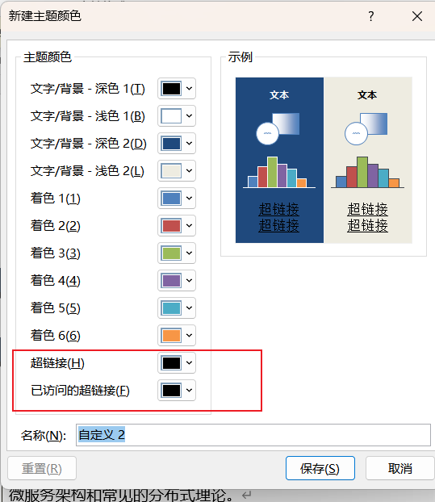
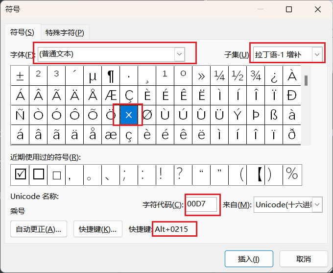

# 

# Word

## Word快捷键

> 仅记录不常见、不常用的快捷键

`shift + F3`可快速实现字母大小写切换

`Alt + =` 快速插入公式

## Word自定义快捷键

Word有些功能没有提供默认的快捷键，可以自定义快捷键。

1. 按 Alt+F、T 以打开**“Word 选项”**对话框。

2. 按向下键选择**“自定义功能区”**。

3. 重复按 Tab 键直到选中对话框底部的“**自定义**”，然后按 Enter。

   

4. 例如开始选项卡中的“删除线”和“字体颜色”功能没有快捷键，通过问AI某个功能对应的命令是什么，找到需要设置快捷键的命令

   

   

   

   

   

   

## Word通配符

### Word通配符基本语法与用法

#### Word查找栏代码·通配符一览表

|      | 取消勾选通配符复选框 |                         | 勾选通配符复选框                 |                          |
| ---- | -------------------- | ----------------------- | :------------------------------- | ------------------------ |
| 序号 | 特殊字符             | 代码                    | 特殊字符                         | 代码 或 通配符           |
| 1    | 任意单个字符         | ^?                      | 任意单个字符                     | ?                        |
| 2    | 任意数字             | ^#                      | 任意数字（单个）                 | [0-9]                    |
| 3    | 任意英文字母         | ^$                      | 任意英文字母                     | [a-zA-Z]                 |
| 4    | 段落标记↵            | ^p                      | 段落标记                         | ^13                      |
| 5    | 手动换行符↓          | ^l  (这是是小写的英文L) | 手动换行符                       | ^l 或 ^11                |
| 6    | 图形                 | ^g 或 ^1                | 图形                             | ^g                       |
| 7    | 1/4长划线            | ^+                      | 1/4长划线                        | ^q                       |
| 8    | 长划线               | ^j                      | 长划线                           | ^+                       |
| 9    | 短划线               | ^q                      | 短划线                           | ^=                       |
| 10   | 制表符               | ^t                      | 制表符                           | ^t                       |
| 11   | 脱字号               | ^                       | 脱字号                           | ^^                       |
| 12   | 分栏符               | ^v                      | 分栏符                           | ^n 或 ^14                |
| 13   | 分节符               | ^b                      | 分节符/分页符                    | ^m                       |
| 14   | 省略号               | ^n                      | 省略号                           | ^i                       |
| 15   | 全角省略号           | ^i                      | 全角省略号                       | ^j                       |
| 16   | 无宽非分隔符         | ^z                      | 无宽非分隔符                     | ^z                       |
| 17   | 无宽可选分隔符       | ^x                      | 无宽可选分隔符                   | ^x                       |
| 18   | 不间断空格           | ^s                      | 不间断空格                       | ^s                       |
| 19   | 不间断连字符         | ^~                      | 不间断连字符                     | ^~                       |
| 20   | ¶段落符号            | ^%                      | ¶段落符号                        | ^%                       |
| 21   | §分节符              | ^                       | §分节符                          | ^                        |
| 22   | 脚注标记             | ^f 或 ^2                |                                  |                          |
| 23   | 可选连字符           | ^-                      | 可选连字符                       | ^-                       |
| 24   | 空白区域             | ^w                      |                                  |                          |
| 25   | 手动分页符           | ^m 或 ^12               | 手动分页符/分节符                | ^m                       |
| 26   | 尾注标记             | ^e                      |                                  |                          |
| 27   | 域                   | ^d                      |                                  |                          |
| 28   | Unicode 字符         | ^Unnnn                  |                                  |                          |
| 29   | 全角空格             | ^u8195                  |                                  |                          |
| 30   | 半角空格             | ^32 或 ^u8194           |                                  |                          |
| 31   | 批注                 | ^a 或 ^5                |                                  |                          |
| 32   |                      |                         | 表达式 （替换表达式使用 \1 \2 ） | ( )                      |
| 33   |                      |                         | 单词开头                         | <  （例：<2表示以2开头） |
| 34   |                      |                         | 单词结尾                         | >  （例：3>表示以3结尾） |
| 35   |                      |                         | 任意字符串                       | *                        |
| 36   |                      |                         | 指定范围外任意单个字符           | [!x-z]                   |
| 37   |                      |                         | 指定范围内任意单个字符           | [ - ]                    |
| 38   |                      |                         | 1个以上前一字符或表达式          | @                        |
| 39   |                      |                         | n 个前一字符或表达式             | { n }                    |
| 40   |                      |                         | n个以上前一字符或表达式          | { n, }                   |
| 41   |                      |                         | n 到 m 个前一字符或表达式        | { n,m }                  |
| 42   |                      |                         | 所有小写英文字母                 | [a-z]                    |
| 43   |                      |                         | 所有大写英文字母                 | [A-Z]                    |
| 44   |                      |                         | 所有西文字符                     | [^1-^127]                |
| 45   |                      |                         | 所有中文汉字和中文标点           | [!^1-^127]               |
| 46   |                      |                         | 所有中文汉字（CJK统一字符）      | [一-龥] 或 [一-﨩]       |
| 47   |                      |                         | 所有中文标点                     | [!一-龥^1-^127]          |
| 48   |                      |                         | 所有非数字字符                   | [!0-9]                   |

注：要查找已被定义为通配符的字符，该字符前键入反斜杠 \ 。查找？、*、（、）、[ 、] 等的代码分别是`\？、\*、\(、\)、\[、\] `。

#### Word通配符用法详解

**1、任意单个字符**：

“?”可以代表任意单个字符，输入几个“?”就代表几个未知字符。如：
输入“? 国”就可以找到诸如“中国”、“美国”、“英国”等字符；
输入“???国”可以找到“孟加拉国”等字符。

**2、任意多个字符**：

 “*”可以代表任意多个字符。如：
输入“*国”就可以找到“中国”、“美国”、 “孟加拉国”等字符。

**3、指定字符之一**：

 “[]”框内的字符可以是指定要查找的字符之一，如：
输入“[中美]国”就可以找到“中国”、“美国”。 又如：
输入“th[iu]g”，就可查找到“thigh”和“thug”。 
输入“[学硕博]士”，查找到的将会是学士、士、硕士、博士。 
输入“[大中小]学”可以查找到“大学”、“中学”或“小学”，但不查找“求学”、“开学”等。
输入“[高矮]个”的话，Word查找工具就可以找到“高个”、“矮个”等内容。

**4、指定范围内的任意单个字符**：

 “[x-x]”可以指定某一范围内的任意单个字符，如：
输入“[a-e]ay”就可以找到“bay”、“day”等字符，要注意的是指定范围内的字符必须用升序。 用升序。如：
输入“[a-c]mend”的话，Word查找工具就可以找到“amend”、“bmend”、“cmend”等字符内容。

**5、排除指定范、排除指定范围内的任意单个字符**：

“[!x-x]”可以用来排除指定范围内的任意单个字符，如：
输入“[!c-f]”就可以找到“bay”、“gay”、“lay”等字符，但是不等字符，但是不会找到“cay”、“day”等字符。要注意范围必须用升序。
又如：
输入“[!a-c]”的话，Word程序就可以找到“good”、“see”、“these”等目标字符，而所有包含字符a、b、c之类的内容都不会在查找结果中出现。
又如：
输入“m[!a]st”，用，用来查找“mist”和“most”不会查找“mast”。 
输入“[!a]n”，查到的将会是除an以外的所有可能组合如：合如：in、on 等。

 

**6、指定前一字符的个数：**

“{n}”可以用来指定要查找的字符中包含前一字符的个数，如：
输入“cho{1} se”就是说包含1个前一字符“o”，可以找到“chose”，输入“cho{2}se”就是说包含2个前一字符“o”，可以找到， “choose”。 
又如：
输入“lit{1}le”就是说包含1个前一字符“t”，可以找到“litle”。 
输入“lit{2}le”就是说包含2个前一字符“t”，可以找到“little”。 
输入“te{2}n”，表示查找“teen”而不会查找“ten”。 
输入“of{2}ice”，查找到的将会是office。

**7、指定前一字符、指定前一字符数范围：**

“{x,x}”可以用指定要查找字符中前一字符数范围，如：
输入“cho{1,2}”，则说明包含前一字符“o”数目范围是1-2个，则可以找到“chose”、“choose”。

**8、一个以上的前一字符：**

 “@”可以用来指定要查找字符中包含一个以上的前一字符，如：
输入“cho@se”，就可以找到， “chose”、“choose”等字符。

**9、指定起始字符串：**

“<”可以用来指定要查找字符中的起始字符串，如：
输入“<ag”，就说明要查找的字符的起始字符为“ag”，可以找到 “ago”、“agree”、“again”等字符。
输入“<te”的话，可能查到“ten”、“tea”等。

**10、指定结尾字符串：**

 “>”可以用来指定要查找字符中的结尾字符串，如：
输入“er>”，就说明要查找的字符的结尾字符为“er”，可以找到 “ver”、“her”、“lover”等等。
输入“en>”， 就说明要查找到以“en”结尾的所有目标对象，可能找到“ten”、“pen”、“men”
输入“up>”，就说明要查找到以“up”结尾的所有目标对象， **例如**会找到“setup”、“cup”等等。

**11、表达式查找：**

“（）”，尤其用于多个关键词的组合查找。
键入“（America）（China）”，在“替换为”中键入“\2 \1”，Word找到“America China”并替换为“China America”。 
输入“<(江山)*(多娇)>”，就表示查找的是所有以“江山”开头并且 以“多娇”结尾的字符串。

另外为了更精确的查找，你还可以把以上的通配符联合起来使用，如：
输入“<(ag)*(er)>”则表示查找所有以“ag”开头并且以“er”结尾的单词，注意这时需要用括号将来区分开不同的查找规则。最后还要注意如果要查找已经被定义为通配符的字符，如“*”、“?”等字符，必须在该字符前面加上反斜杠“\”，如：输入“\*”则表示查找字符“*”。

#### 使用通配符搜索

选中“使用通配符”复选框后，Word 只查找与指定文本精确匹配的文本（请注意，“区分大小写”和“全字匹配”复选框会变灰而不可用，表明这些选项已自动选中，您不能关闭这些选项）。

要查找已被定义为通配符的字符，请在该字符前键入反斜扛 (\)， **例如**，要查找问号，可键入“\？”。

| 序号 | 查找内容                               | 通配符 | 示例                                                         |
| ---- | -------------------------------------- | ------ | ------------------------------------------------------------ |
| 1.   | 任意单个字符                           | ?      | **例如**，s?t可查找“sat”和“set”。                            |
| 2.   | 任意字符串                             | *      | **例如**，s*d可查找“sad”和“started”。                        |
| 3.   | 单词的开头                             | <      | **例如**，<(inter)查找“interesting”和“intercept”，但不查找“splintered”。 |
| 4.   | 单词的结尾                             | >      | **例如**，(in)>查找“in”和“within”，但不查找“interesting”。   |
| 5.   | 指定字符之一                           | []     | **例如**，w[io]n查找“win”和“won”。                           |
| 6.   | 指定范围内任意单个字符                 | [-]    | **例如**，[r-t]ight查找“right”和“sight”。必须用升序来表示该范围。 |
| 7.   | 中括号内指定字符范围以外的任意单个字符 | [!x-z] | **例如**，t[!a-m]ck查找“tock”和“tuck”，但不查找“tack”和“tick”。 |
| 8.   | n个重复的前一字符或表达式              | {n}    | **例如**，fe{2}d查找“feed”，但不查找“fed”。                  |
| 9.   | 至少n个前一字符或表达式                | {n,}   | **例如**，fe{1,}d查找“fed”和“feed”。                         |
| 10.  | n到m个前一字符或表达式                 | {n,m}  | **例如**，10{1,3}查找“10”、“100”和“1000”。                   |
| 11.  | 一个以上的前一字符或表达式             | @      | **例如**，lo@t查找“lot”和“loot”。                            |

一些代码只有在选中或清除“使用通配符”选项时才能使用。

#### 使用代码搜索

可以在“查找内容”或“替换为”框中使用的代码

| 段落标记()     | 键入^p（选中“使用通配符”复选框时在“查找内容”框中无效）或键入^13 |
| -------------- | ------------------------------------------------------------ |
| 制表符()       | 键入^t或键入^9                                               |
| ASCII字符      | 键入^nnn，其中nnn是字符代码                                  |
| ANSIcharacter  | 键入^0nnn，其中nnn是字符代码                                 |
| 长划线(—)      | 键入^+                                                       |
| 短划线(–)      | 键入^=                                                       |
| 脱字号         | 键入^^                                                       |
| 手动换行符()   | 键入^l或键入^11                                              |
| 分栏符         | 键入^n或键入^14                                              |
| 分页符或分节符 | 键入^12（替换时，插入分页符）                                |
| 手动分页符     | 键入^m（当选中“使用通配符”复选框时，还将查找或替换分节符）   |
| 不间断空格()   | 键入^s                                                       |
| 不间断连字符() | 键入^~                                                       |
| 可选连字符()   | 键入^-                                                       |

只能在“查找内容”框中使用的代码（选中“使用通配符”复选框时）

| 图片或图形（仅嵌入） | 键入^g |
| -------------------- | ------ |
|                      |        |

只能在“查找内容”框中使用的代码（清除“使用通配符”复选框时）

| 任意字符                           | 键入^?                                                   |
| ---------------------------------- | -------------------------------------------------------- |
| 任意数字                           | 键入^#                                                   |
| 任意字                             | 键入^$                                                   |
| Unicode字符                        | 键入^Unnnn，其中“nnnn”是字符代码                         |
| 图片或图形（仅嵌入）               | 键入^1                                                   |
| 脚注标记                           | 键入^f或键入^2                                           |
| 尾注标记                           | 键入^e                                                   |
| 域                                 | 键入^d                                                   |
| 正在打开域大括号（当域代码可见时） | 键入^19                                                  |
| 正在关闭域大括号（当域代码可见时） | 键入^21                                                  |
| 批注                               | 键入^a或键入^5                                           |
| 分节符                             | 键入^b                                                   |
| 全角空格(Unicode)                  | 键入^u8195                                               |
| 半角空格(Unicode)                  | 键入^u8194                                               |
| 白色空格                           | 键入^w（可以是常规空格、不间断空格以及制表符的任意组合） |

只能在“替换为”框中使用的代码

| “Windows剪贴板”的内容 | 键入^c |
| --------------------- | ------ |
| “查找内容”框的内容    | 键入^& |

选中“使用通配符”复选框后，Microsoft Word 不识别在“查找内容”框中输入的用于下列项目的代码：尾注和脚注标记、域、段落标记、分节符或空白区域。若要搜索这些项目，可以在“查找内容”框中键入下列替换代码。（注意，没有可用于域的替换代码）

| 若要查找脚注或尾注标记 | 键入“^2”       | 注意，Word 无法区分脚注和尾注标记。 |
| ---------------------- | -------------- | ----------------------------------- |
| 若要查找段落标记       | 键入“^13”      |                                     |
| 若要查找分节符         | 键入“^12”      | Word 将搜索手动分页符和分节符。     |
| 查找空白区域           | 键入“空格{1,}” |                                     |

**例子：**

1. 将Word文档中相邻的两个数字间都加入tab制表位

查找正则：([0-9])([0-9])
替换正则：\1^t\2
补：Word中使用正则做替换时对分组的引用是使用\n的形式（n为分组的数字）

### Word文档中正则表达式使用记录

> Word文档中的查找替换与正则表达式有些许出入

#### 匹配所有类似[1-3]、[23]、[22,23] 的文献字符串，并替换为上角标

**表达式**：  `\[[0-9,-]{1,}\]`   替换为  Ctrl + Shift + 加号键

**解释**：

 

#### 匹配所有的`汉字 汉字`，替换为 `汉字汉字`

**表达式**：  `([一-﨩]) ([一-﨩])`   替换为  `\1\2`

**解释**：`([一-﨩])`是一个捕获组。匹配 Unicode 中汉字字符范围（几乎涵盖了所有常用和非常用的汉字）。

`\1` 和 `\2` 是反向引用。`\1` 引用的是第一个捕获组（即第一个匹配到的汉字）所捕获的内容，`\2` 引用的是第二个捕获组（即第二个匹配到的汉字）所捕获的内容。通过将替换内容设置为 `\1\2`，就实现了将原来匹配到的两个中间有空格的汉字，替换为去掉中间空格后的两个连续的汉字。

## Word中目录右边页码对不齐解决方法

### 现象

这个目录对不齐原因未知；

### 解决方法：

1，在视图中打开标尺；

2，选择对不齐的目录项；如果整个目录都有出现不对齐，选择整个目录。

3，拖动标尺，进行对齐；

4，被治愈了。

## 为Word中的公式添加编号

1、Word中发现公式插入后，在**公式框**右侧后边输入**编号（#编号 或者 #(编号)）**，点击回车键。

2、公式编号添加成功，编号自动在**右侧对齐**，后续添加时依次重复上面操作。

## Word中插入 第xx页 共xx页

首先把光标放在要插入的位置（如页眉、页脚）

插入 `—>` 文档部件 `—>` 域 `—>` Page(当前页码) / NumPages(文档总页码) / SectionPages(本节文档总页码)

------

### 插入第xx页

1.插入 `—>` 文档部件 `—>` 域 `—>` Page(当前页码) `—>` 确定

### 插入共xx页

2.插入 `—>` 文档部件 `—>` 域 `—>`  NumPages(文档总页码) / SectionPages(本节文档总页码) `—>` 确定

## Word分节符

### 一、节和分节符

在同一个文档中，不同章节的页眉页脚不同，这都离不开“节”，**节是设置版式的单元，不同节的版式可以不同。**要想看到分节符，需要先打开【显示编辑标记】。

Word中实现节的方式就是使用【分节符】，如果没有使用分节符，就默认将整篇文档视为一节。

当需要分节的时候，我们需要使用【布局】选项卡下的【分隔符】，从中选择需要的分节符。

不同的节，我们可以设置不同的版式，如：

1.纸张大小和方向；

2.打印机纸张来源；

3.页边距；

4.文本对齐方式；

5.页眉和页脚；

6.页码编号：可以中断然后重新计数；分节符共有四种：

#### 1.下一页分节符

插入这个分节符可以让下一节的内容在下一页显示。

这是**使用概率比较高**的分节符类型。

#### 2.连续分节符

当前节和下一节在同一页面中，常常用来页内的排版。在不同节设置不同的格式，如列数，行号，页边距等。最常用的一个案例是在小论文中，摘要使用一栏，而正文使用两栏。

#### 3.偶数页分节符

使新的一节从下一个偶数页开始。如果下一页是奇数页，这一页将保持空白。常常用在书籍排版中，要求新的一节总是显示在右侧版面。

#### 4.奇数页分节符

与偶数页分节符类似。在以前的文章中讲解过【分页符】，【分页符】和【下一页分节符】的区别在于，前者分页后，所有页面还是在同一节内，会使用同一节的版式，而后者的前后两页分属不同的节，可以设置不同的版式。

### 二、使用分节符设置论文页脚

论文中的页眉要求经常是这样的。

在摘要前不需要设置页眉页脚，摘要和目录设置页眉，目录后正文的页眉与每章的标题相同。

因此只需要使用分节符，将样式相同的页面分开就可以了。

由此可以实现前几页页脚为罗马数字，后几页页脚为阿拉伯数字的样式

## Word微软雅黑字体行间距过大

1.当前我们可以看到文字是微软雅黑的字体，但是间隔比较大。

2.我们将行倍数调至最低也是比较大，如何解决？

3.点击段落菜单栏中的右下角的按钮。

4.弹出这个对话框，找到定义文档网格，将对勾去掉，点击确定。

5.这个时候行间距就变小了。

### 总结

1.当前我们可以看到文字是微软雅黑的字体，但是间隔比较大。

2.我们将行倍数调至最低也是比较大，如何解决？

3.点击段落菜单栏中的右下角的按钮。

4.弹出这个对话框，找到定义文档网格，将对勾去掉，点击确定。

5.这个时候行间距就变小了。

## Word更改超链接跳转前后的颜色

点击"设计"，再点击"颜色"

点击“自定义颜色”

将“超链接”和“已访问的超链接”改为自己需要的颜色

## Word调整列表编号与文本之间的距离

首先选中列表符号并点击右键。

在出现的右键菜单中选择“调整列表缩进”

可以通过将制表符改为空格来缩短列表编号与文本之间的距离

## Word中快捷打出数学符号

### 快捷键位置

在Word中，可以在`插入->符号->其它符号->普通文本`中找到任何符号的Unicode字符和快捷键，通过快捷键可以快速输入特殊字符

### 快捷键分类

Word中的快捷键分为`Unicode字符，Alt+X`和`Alt+Alt码`两种，`Alt+Alt码`这种方式可以在任何文本输入框中输入特殊字符，而`Unicode字符，Alt+X`这种方式是Word独有的，只能在Word中使用。

### 快捷键举例

常用的，但是键盘上没有的数学符号有 `×、÷、≈`等。

`×`对应的Alt码和快捷键是：

`÷`对应的Alt码和快捷键是：

`≈`对应的Unicode码和快捷键是：

### 常用Alt码

# Excel

## Excel快捷键

`F2` 快捷进入单元格内编辑

`Alt + Enter`单元格内换行

## 调整表格行高

首先选中要调整的表格

点击格式

点击行高

输入行高后，选中的行都变成同一高度

# PPT

