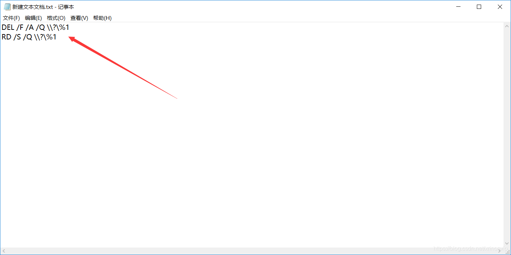
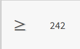
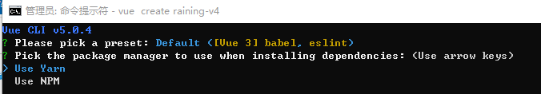

## 系统问题

### win 快捷键

> 仅记录不常见、不常用的快捷键

`Ctrl + Win + D`  创建虚拟桌面

`Ctrl + Win + F4` 删除当前虚拟桌面

`Ctrl + Win + 左方向键` `Ctrl + Win + 右方向键` 快捷切换桌面

`Win + D` 回到桌面

`Alt + Tab` 切换应用

### win 控制台运行jar包

```shell
java -jar .\user-center-backend-0.0.1-SNAPSHOT.jar --server.port=8081
```

### win 查找端口号并删除进程

要查找8080端口的pid号，那么在终端中输入netstat -ano | findstr 8080,找到LISTENING那一行，即可看到8080端口号的pid号为28808


步骤3：通过pid号，杀死指定端口号的进程，释放端口

上一步骤我们查询到8080端口号的pid号为28808，那么我们可以通过这个pid号杀死8080端口的进程，释放8080端口。

终端中输入taskkill /f /pid 28808，按下回车，即可杀死进程，释放端口。


除了通过taskkill /f /pid 28808命令杀死进程，我们还可以打开任务管理器，点击详细信息,找到指定pid的进程，点击结束任务，即可即可杀死进程，释放端口。


> TCP    0.0.0.0:1099           0.0.0.0:0              LISTENING       5852  
> TCP    [::]:1099              [::]:0                 LISTENING       5852 
>
> 上面这段信息的含义:
>
> - **TCP**: 表明这是TCP协议的套接字。
> - **0.0.0.0:1099** 和 **[::]:1099**: 这两个地址和端口组合表明有一个服务在TCP的1099端口上进行监听。
>   其中`0.0.0.0:1099`表示在IPv4上所有接口监听，而`[::]:1099`表示在IPv6上所有接口监听。


---

### win11 选择一个应用以打开此xxx文件 里面有许多已经卸载的程序(如qt)


原因是程序没有卸载干净
打开注册表编辑器，之前我是qt没有卸载干净，打开方式里有很多xxx/xxx/qtcreator
ctrl+f，搜索，把包含qtcreator的项和文件夹全部删掉

删除之后问题解决：


### win更改磁盘大小，重新分配磁盘空间

#### 系统自带磁盘管理

> 缺点：功能单一

按Win + X键，选择磁盘管理


#### 使用第三方工具

可使用的工具有 “傲梅分区助手” “DiskGenius（未使用）”，均为免费强大的磁盘管理工具

### win 查看及导出目录结构

#### 一、查看目录结构

**目录窗口视图**


##### 1. 查看目录结构（文件夹）

在当前要操作的文件夹目录下输入命令tree. 此时得到目录下树形的目录结构。默认情况下只显示“文件夹”而不显示文件。


##### 2. 查看目录结构（包括文件）

在tree命令后面加入参数 /f 将以层次的结构显示所有文件夹及文件的名称。


#### 二、导出目录结构

将当前文件夹树形结构写入xxx.txt中

```powershell
tree /f >darknet.txt
保存的树形结构，只含有文件夹
tree /f >darknetf.txt
保存的树形结构，包含文件夹和文件
```

### win bat文本echo显示中文乱码处理方法

1.使用 UTF-8 编码：将 BAT 脚本保存为 UTF-8 编码格式，然后在命令行窗口中运行该脚本。

2.设置代码页：在 BAT 脚本开头添加代码页设置命令，例如：chcp 65001，其中 65001 是 UTF-8 的代码页。

3.使用第三方工具：使用第三方工具如 Notepad++ 等编辑器打开 BAT 脚本，在其中添加中文输出，然后保存为 UTF-8 编码格式并运行。

通过以上方法，您可以在 Windowss 中正确输出中文，避免乱码问题。

示例内容：

```shell
chcp 65001
@echo off
if “abc”==“ABC” (
echo 大小相等
) else (
echo 大小不等
)
```

### 右键文件夹打开IDEA

**一、问题描述**

已下载IDEA，但是右键打开之前保存的项目文件，无法显示以IDEA方式打开。


**二、解决步骤**

1. 打开注册表

win+R键输入**regedit**


 2、查找路径为**计算机\HKEY_LOCAL_MACHINE\SOFTWARE\Classes\Directory\shell**

（我找了半天没看到Classes,建议直接粘贴粗体路径，回车就能定位到该路径下了）


3、 右键shell，新建-项(K)，将新建的项文件名改为**JB_IDEA**

> JB全家桶的项文件名 建议都命名为 JB_xxx 的格式，这样JB全家桶的右键菜单选项都会集中在一起.
> 如果不按照JB_xxx的格式命名，各个软件的命名将不统一，右键菜单选项将会过于分散。
>
> 


4、选中上一步新建的项IDEA，右键-新建-字符串值（S)，并改名为Icon


 5、修改“(默认)”的数据和“Icon”的数据

第一行“（默认）”的数据可以写**Open Folder as IDEA Project**

第二行“Icon”的数据是安装idea64.exe的路径,可以右键桌面的IDEA查询属性，在“目标”处查到该安装路径，如下图，将该路径粘贴到Icon的数值数据处


 6、添加 command 项,并添加值，数据为**"第5步的idea64.exe的路径""%1"**


**设置右键文件夹背景空白处打开 IDEA**

设置和前面类似, 但注册表位置改为 :

```bash
计算机\HKEY_CLASSES_ROOT\Directory\Background\shell\
```


### 删除文件出现”该项目不在请确认该项目的位置“

删除文件出现”找不到该项目，该项目不在请确认该项目的位置“，如下图：


 解决办法：

1、首先新建一个txt文件，把下面的代码复制到里面然后保存

```bash
DEL /F /A /Q \\?\%1 
RD /S /Q \\?\%1
```

如下图所示：



2、接下来把文件扩展名改成： aa .bat（注意：这个文件名要和你想要删除的那个文件或文件夹的名字一样）。比如我的那个删除不掉的文件夹叫“神经网络和深度学习 ”，我就把txt文档改成“神经网络和深度学习 .bat”


3、接下来把想要删除的那个文件拖动到刚才的bat文件上


4、顽固文件夹就被删除了

**Reference：**

[由于找不到该项目桌面文件无法删除怎么办](https://jingyan.baidu.com/article/a681b0de72fe343b19434644.html)


### 解决bat文件运行结束后自动关闭窗口问题

#### 方法一：在cmd窗口运行脚本

1.在bat文件所在目录运行cmd


2.输入bat文件的名字，运行bat文件。脚本执行结束后，cmd窗口不会关闭，能够看到完整的信息


#### 方法二：在bat文件结尾加上 pause

1.在bat文件结尾加上pause


2.脚本执行结束后不会立即退出，而是需要按下一个按键才会退出


### 使用bat脚本或程序运行java程序中文乱码问题

#### bat脚本运行java程序

##### 问题描述：

在cmd窗口内运行jar包，不会出现中文乱码问题。


在bat脚本中写入java -jar命令并执行脚本。发现出现了中文乱码问题


##### 解决办法：

**统一终端、脚本、JVM 三者的编码环境**。

> 将三者的编码环境都统一为UTF-8或者其它编码格式，就不会出现乱码问题了。

###### 终端编码环境：

通过在脚本开头加上`chcp 65001` 将运行该脚本时的终端编码改为 UTF-8


###### 脚本编码环境：

保存脚本时要将脚本环境设置为 UTF-8


###### JVM编码环境：

通过在`java -jar` 命令中加上 `-Dfile.encoding=UTF-8` ，将JVM的编码换环境设置为 UTF-8。


#### 程序内运行java程序

##### 问题描述：

使用`Runtime.getRuntime.exec()`执行`java -cp <classpath> <main_class>` 命令时，


出现中文乱码


##### 解决办法：

加上`-Dfile.encoding=UTF-8`，乱码问题解决


在命令行中运行Java程序，可以通过指定`-Dfile.encoding=UTF-8`参数来设置文件编码。例如：

```bash
java -Dfile.encoding=UTF-8 -cp . Main
```

确保使用命令行运行时，控制台也支持UTF-8编码。

> 出现乱码的原因是，命令行终端的编码是 GBK，和 java 代码文件本身的编码 UTF-8 不一致，导致乱码。
>
> 也可以通过 `chcp` 命令查看命令行终端编码，GBK 是 936，UTF-8 是 65001。
>
> 
>
> 但是 **不建议** 大家改变终端编码来解决编译乱码，因为其他运行你代码的人也要改变环境，兼容性很差。

### 在文本编辑器中快速打出特殊符号

在Word中，可以在`插入->符号->其它符号->普通文本`中找到任何符号的Unicode字符和快捷键，通过快捷键可以快速输入特殊字符


Word中的快捷键分为`Unicode字符，Alt+X`和`Alt+Alt码`两种，`Alt+Alt码`这种方式可以在任何文本输入框中输入特殊字符，而`Unicode字符，Alt+X`这种方式是Word独有的，只能在Word中使用。

常用的，但是键盘上没有的数学符号有 `×、÷、≈`等。

`×`对应的Alt码和快捷键是：


`÷`对应的Alt码和快捷键是：


`≈`对应的Unicode码和快捷键是：


### Windows Alt码表

#### Alt码表1-99

| Symbol | AltCode | Symbol | AltCode | Symbol | AltCode |
| ------ | ------- | ------ | ------- | ------ | ------- |
| ☺      | 1       | "      | 34      | C      | 67      |
| ☻      | 2       | #      | 35      | D      | 68      |
| ♥      | 3       | $      | 36      | E      | 69      |
| ♦      | 4       | %      | 37      | F      | 70      |
| ♣      | 5       | &      | 38      | G      | 71      |
| ♠      | 6       | '      | 39      | H      | 72      |
| •      | 7       | (      | 40      | I      | 73      |
| ◘      | 8       | )      | 41      | J      | 74      |
| ○      | 9       | *      | 42      | K      | 75      |
| ◙      | 10      | +      | 43      | L      | 76      |
| ♂      | 11      | ,      | 44      | M      | 77      |
| ♀      | 12      | -      | 45      | N      | 78      |
| ♪      | 13      | .      | 46      | O      | 79      |
| ♫      | 14      | /      | 47      | P      | 80      |
| ☼      | 15      | 0      | 48      | Q      | 81      |
| ►      | 16      | 1      | 49      | R      | 82      |
| ◄      | 17      | 2      | 50      | S      | 83      |
| ↕      | 18      | 3      | 51      | T      | 84      |
| ‼      | 19      | 4      | 52      | U      | 85      |
| ¶      | 20      | 5      | 53      | V      | 86      |
| §      | 21      | 6      | 54      | W      | 87      |
| ▬      | 22      | 7      | 55      | X      | 88      |
| ↨      | 23      | 8      | 56      | Y      | 89      |
| ↑      | 24      | 9      | 57      | Z      | 90      |
| ↓      | 25      | :      | 58      | [      | 91      |
| →      | 26      | ;      | 59      | \      | 92      |
| ←      | 27      | <      | 60      | ]      | 93      |
| ∟      | 28      | =      | 61      | ^      | 94      |
| ↔      | 29      | >      | 62      | _      | 95      |
| ▲      | 30      | ?      | 63      | `      | 96      |
| ▼      | 31      | @      | 64      | a      | 97      |
| spc    | 32      | A      | 65      | b      | 98      |
| !      | 33      | B      | 66      | c      | 99      |

#### Alt码表100-255

| Symbol | AltCode | Symbol | AltCode | Symbol | AltCode |
| ------ | ------- | ------ | ------- | ------ | ------- |
| d      | 100     | ÿ      | 152     | ╠      | 204     |
| e      | 101     | Ö      | 153     | ═      | 205     |
| f      | 102     | Ü      | 154     | ╬      | 206     |
| g      | 103     | ¢      | 155     | ╧      | 207     |
| h      | 104     | £      | 156     | ╨      | 208     |
| i      | 105     | ¥      | 157     | ╤      | 209     |
| j      | 106     | ₧      | 158     | ╥      | 210     |
| k      | 107     | ƒ      | 159     | ╙      | 211     |
| l      | 108     | á      | 160     | ╘      | 212     |
| m      | 109     | í      | 161     | ╒      | 213     |
| n      | 110     | ó      | 162     | ╓      | 214     |
| o      | 111     | ú      | 163     | ╫      | 215     |
| p      | 112     | ñ      | 164     | ╪      | 216     |
| q      | 113     | Ñ      | 165     | ┘      | 217     |
| r      | 114     | ª      | 166     | ┌      | 218     |
| s      | 115     | º      | 167     | █      | 219     |
| t      | 116     | ¿      | 168     | ▄      | 220     |
| u      | 117     | ⌐      | 169     | ▌      | 221     |
| v      | 118     | ¬      | 170     | ▐      | 222     |
| w      | 119     | ½      | 171     | ▀      | 223     |
| x      | 120     | ¼      | 172     | α      | 224     |
| y      | 121     | ¡      | 173     | ß      | 225     |
| z      | 122     | «      | 174     | Γ      | 226     |
| {      | 123     | »      | 175     | π      | 227     |
| \|     | 124     | ░      | 176     | Σ      | 228     |
| }      | 125     | ▒      | 177     | σ      | 229     |
| ~      | 126     | ▓      | 178     | µ      | 230     |
| ⌂      | 127     | │      | 179     | τ      | 231     |
| Ç      | 128     | ┤      | 180     | Φ      | 232     |
| ü      | 129     | ╡      | 181     | Θ      | 233     |
| é      | 130     | ╢      | 182     | Ω      | 234     |
| â      | 131     | ╖      | 183     | δ      | 235     |
| ä      | 132     | ╕      | 184     | ∞      | 236     |
| à      | 133     | ╣      | 185     | φ      | 237     |
| å      | 134     | ║      | 186     | ε      | 238     |
| ç      | 135     | ╗      | 187     | ∩      | 239     |
| ê      | 136     | ╝      | 188     | ≡      | 240     |
| ë      | 137     | ╜      | 189     | ±      | 241     |
| è      | 138     | ╛      | 190     | ≥      | 242     |
| ï      | 139     | ┐      | 191     | ≤      | 243     |
| î      | 140     | └      | 192     | ⌠      | 244     |
| ì      | 141     | ┴      | 193     | ⌡      | 245     |
| Ä      | 142     | ┬      | 194     | ÷      | 246     |
| Å      | 143     | ├      | 195     | ≈      | 247     |
| É      | 144     | ─      | 196     | °      | 248     |
| æ      | 145     | ┼      | 197     | ∙      | 249     |
| Æ      | 146     | ╞      | 198     | ·      | 250     |
| ô      | 147     | ╟      | 199     | √      | 251     |
| ö      | 148     | ╚      | 200     | ⁿ      | 252     |
| ò      | 149     | ╔      | 201     | ²      | 253     |
| û      | 150     | ╩      | 202     | ■      | 254     |
| ù      | 151     | ╦      | 203     | spc    | 255     |

#### Alt码表0128-0255

> 在0128-0255中，0129、0141、0143、0144、0157、0173 这些编码没有被定义，不存在

| Symbol | AltCode | Symbol | AltCode | Symbol | AltCode |
| ------ | ------- | ------ | ------- | ------ | ------- |
| €      | 0128    | ¯      | 0175    | Ø      | 0216    |
| ‚      | 0130    | °      | 0176    | Ù      | 0217    |
| ƒ      | 0131    | ±      | 0177    | Ú      | 0218    |
| „      | 0132    | ²      | 0178    | Û      | 0219    |
| …      | 0133    | ³      | 0179    | Ü      | 0220    |
| †      | 0134    | ´      | 0180    | Ý      | 0221    |
| ‡      | 0135    | µ      | 0181    | Þ      | 0222    |
| ˆ      | 0136    | ¶      | 0182    | ß      | 0223    |
| ‰      | 0137    | ·      | 0183    | à      | 0224    |
| Š      | 0138    | ¸      | 0184    | á      | 0225    |
| ‹      | 0139    | ¹      | 0185    | â      | 0226    |
| Œ      | 0140    | º      | 0186    | ã      | 0227    |
| Ž      | 0142    | »      | 0187    | ä      | 0228    |
| ‘      | 0145    | ¼      | 0188    | å      | 0229    |
| ’      | 0146    | ½      | 0189    | æ      | 0230    |
| “      | 0147    | ¾      | 0190    | ç      | 0231    |
| ”      | 0148    | ¿      | 0191    | è      | 0232    |
| •      | 0149    | À      | 0192    | é      | 0233    |
| –      | 0150    | Á      | 0193    | ê      | 0234    |
| —      | 0151    | Â      | 0194    | ë      | 0235    |
| ˜      | 0152    | Ã      | 0195    | ì      | 0236    |
| ™      | 0153    | Ä      | 0196    | í      | 0237    |
| š      | 0154    | Å      | 0197    | î      | 0238    |
| ›      | 0155    | Æ      | 0198    | ï      | 0239    |
| œ      | 0156    | Ç      | 0199    | ð      | 0240    |
| ž      | 0158    | È      | 0200    | ñ      | 0241    |
| Ÿ      | 0159    | É      | 0201    | ò      | 0242    |
| spc    | 0160    | Ê      | 0202    | ó      | 0243    |
| ¡      | 0161    | Ë      | 0203    | ô      | 0244    |
| ¢      | 0162    | Ì      | 0204    | õ      | 0245    |
| £      | 0163    | Í      | 0205    | ö      | 0246    |
| ¤      | 0164    | Î      | 0206    | ÷      | 0247    |
| ¥      | 0165    | Ï      | 0207    | ø      | 0248    |
| ¦      | 0166    | Ð      | 0208    | ù      | 0249    |
| §      | 0167    | Ñ      | 0209    | ú      | 0250    |
| ¨      | 0168    | Ò      | 0210    | û      | 0251    |
| ©      | 0169    | Ó      | 0211    | ü      | 0252    |
| ª      | 0170    | Ô      | 0212    | ý      | 0253    |
| «      | 0171    | Õ      | 0213    | þ      | 0254    |
| ¬      | 0172    | Ö      | 0214    | ÿ      | 0255    |
| ®      | 0174    | ×      | 0215    |        |         |

#### 常用Alt码




<<<<<<< HEAD
### 解决卸载软件：请等待当前程序完成卸载或更改

**问题：**

> 有时我们在卸载软件时，提示“请等待当前程序完成卸载或更改”,但是已经卸载完成了，怎么还是这样？

**解决方法：**

> 打开任务管理器，详细信息，找到dllhost.exe，并结束掉该进程即可。


=======


### 文件夹和文件上不显示SVN状态图标

win+r呼出运行窗口，在 运行里 输入 regedit 进打开注册表

`HKEY_LOCAL_MACHINE->SOFTWARE->Microsoft->Windows->CurrentVersion->Explorer->ShellIconOverlayIdentifiers` 

打开后发现Tortoise 系列（1TortoiseNormal，2TortoiseAdded等）前面有好多项，Tortoise 系列排到了10名之后，难怪不显示。现在的任务就是把它们提到前面了，修改一下它们的名字就好（在名字前加几个空格，就可以使该项排在前面）


然后关闭再打开注册表，发现Tortoise 系列系列图标已经排到前面了，，接着重启Explorer（在任务管理器中结束explorer.exe），这样就ok了，可爱的SVN图标又出现了。

**原理**：Windows Explorer Shell 支持 Overlay Icon 最多15个，Windows 自身已经使用了4个，所以就只剩下了11个 供我们使用。

系统会按照图标名称的字母顺序依次查询注册表 “HKEY_LOCAL_MACHINE\SOFTWARE\Microsoft\Windows\CurrentVersion\Explorer\ShellIconOverlayIdentifiers” 下的项目，当检测到 11 个有效的接口后，就会自动停止继续向下检测，后面注册的图标将不会显示。

如果你之前安装了例如Groove这样的软件，那么可能我们可利用的就更少了，轮不到Tortoise了。像这样的情况，我们可以调整 Tortoise图标名称的字母顺序，来提高Tortoise的优先位置，因为Windows 内部就是安装名称的字母顺序来优先显示的。
>>>>>>> 639ec98fc72f94383f31500576d6c911dfe8def0

## 软件问题

### Typora 无法打印中文字符

ctrl + . 即可改回中文输入状态输出中文符号

### 解决Typora字数过多造成卡顿现象

Typora字数过多的时候造成卡顿现象如何解决？

点击 、切换、滚动、打字都有点卡顿，下面介绍三种方法，三种方法都可以尝试，建议先尝试方法一，效果不满意就用方法二，实在不行就最后一个取巧的办法。

**方法1：在NVIDIA控制面板中配置typora，可以加速它渲染，这样他的字体就可以加速渲染，不至于太卡。**


**2、方法二：禁用GPU，直接不给它渲染**

typora --> 文件 --> 偏好设置 --> 通用 --> 打开高级设置


打开该json文件，有个"flags"健，原来值为空

```c++
"flags": []
```

改为如下代码。

```c++
"flags": [["disable-gpu"]]
```

禁用GPU之后，软件启动的时候比之前慢，但是打开之后不卡顿了，至少可以减少70%卡顿。

**3、方法三：由于Typora到达一定的字数就会出现卡顿，可以尝试将内容分开到多个文档单独编写，最后再放在一起，可以消除卡顿现象。**

**总结：**

当typora字数达到上万的时候，使用输入法打字和点击切换时就会异常的卡顿，因为typora会实时渲染页面，将拼音输入到页面上再渲染，所以就会异常卡顿，以上三种方法可以帮忙解决。

### 使用正则表达式查找替换Markdown文档的内容

使用IDEA或者VSCode打开Markdown文档，再在IDEA或VSCode中使用正则表达式进行查找替换


### npm换源

>--淘宝原镜像域名registry.npm.taobao.org于2024年1 月 22 日过期，新域名更换为https://registry.npmmirror.com
>
>--如果使用国外镜像，将梯子的TUN模式打开，下载速度也会加快

今天晚上想要将clone下来的项目进行npm install，但是等了半天都没动

查看源

```
npm config get registry
```


或

```
npm config list
```


https://registry.npmjs.org/国外的节点

每次用npm的，因为走国外的镜像，非常的慢

通过改变默认npm镜像代理服务，可以大幅提升安装速度

方法：

1.命令行指定（临时）

```
npm --registry https://registry.npmmirror.com info underscore 
```


说明：

　　这种方式是在使用命令时，添加 --registry https://registry.npmmirror.com

　　如：

　　　　npm install express --registry=https://registry.npmmirror.com

　　　　安装express，使用淘宝源

2.通过config命令（长久）

```
npm config set registry https://registry.npmmirror.com
```

查看


```
npm info underscore
```


3.通过cnpm使用

　　cnpm 定制的命令行工具可以代替 `npm`

```
npm install -g cnpm --registry=https://registry.npmmirror.com
```

使用cnpm

```
npm info underscore
```

 

```
cnpm install xxx
```

eg:

　　cnpm install express


 修改了镜像源，安装就非常快了

###  vue-cli创建项目选择yarn或者npm的问题


使用vue-cli创建项目的时候，用以下命令：

```bat
vue create [projectName]
```

首次创建的时候，会让你选择创建工具，yarn和npm其中一个

如果你选择了 Use Yarn，那么会保存一个配置文件在C盘的用户目录下，比如我的C:\Users\Administrator\下会有一个文件.vuerc
你选择创建工具后，会将选择的参数保存在.vuerc中。如果我们想更改创建工具，那就修改.vuerc文件。

```yml
{
  "useTaobaoRegistry": false,
  "packageManager": "npm"
}
```

修改 “packageManager”: "npm"就可以了，比如改成 “packageManager”: “yarn”

当然，你可以将.vuerc文件删掉，然后创建的时候，又重新让你选择创建工具了。

### 修改Yarn的全局安装和缓存位置，节省C盘空间提升速度

在CMD命令行中执行

**1.改变 yarn 全局安装位置**

```shell
$ yarn config  set global-folder "你的磁盘路径"
```

```bash
$  yarn config  set global-folder"D:\tools\yarn\Data\global"
# 这是我的路径
```

然后你会在你的用户目录找到 `.yarnrc` 的文件，打开它，找到 `global-folder` ，改为 `--global-folder`


**2.改变 yarn 缓存位置**

```shell
#yarn config set cache-folder "你的磁盘路径"
#这里是我的路径
#在我们使用 全局安装包的时候，会在 "D:\tools\yarn\global" 下 生成 node_modules\.bin 目录
$  yarn config set cache-folder "D:\tools\yarn\Cache"
```

我们需要将 D:\Software\yarn\global\node_modules.bin 整个目录 添加到系统环境变量中去，否则通过yarn 添加的全局包 在cmd 中是找不到的。

检查当前yarn 的 bin的 位置

```shell
$  yarn global bin
```

检查当前 yarn 的 全局安装位置

```shell
$ yarn global dir
```

检查当前 yarn 的 缓存位置

```bash
$ yarn cache dir
```


### 判断游戏是否为p2p联机

如果房间总共两个人，你和你的朋友其中有一个人是0延迟，都不是0延迟就是steam服务器。

### 蒲公英组网总结

#### 0.前言

##### 此教程适用场景

由于贝瑞蒲公英免费版每个账号只有三个组网名额，因此在组网人数小于等于3时可以参考此教程，实现免费组网。


##### 如何分辨p2p游戏

如果整个游戏房间只有房主一个人不卡，房间中的其他人都有很高延迟，说明该游戏为p2p游戏。（如饥荒，胡闹厨房2）

#### 1.注册账号

在需要组网的人中，**"组网发起者"**在贝锐蒲公英官网（https://pgy.oray.com/）注册一个账号。注册完成后将自动进入**管理平台**界面：


每次注册或登录后都会自动进入**管理平台**界面。
若不想通过注册和登录的方式进入**管理平台**界面，需要在贝锐蒲公英官网（https://pgy.oray.com/）网页的头部，找到“管理平台”并进入。如下图：


#### 2.下载客户端：蒲公英游戏版

在贝锐蒲公英官网（https://pgy.oray.com/）首页的顶部，点击“个人”，再点击“联机游戏”，如下图：


随后在跳转到的页面中，选择对应的版本下载即可：


#### 3.组网发起者修改密码

**"组网发起者"**（即注册者）进入**贝锐官网（https://www.oray.com/）**（注意：与贝锐蒲公英官网网址不同），点击右上角头像，点击“账号管理”：


在新页面中，点击“账号密码”旁边的“设置”：


在新页面中进行验证码验证：


在新页面中设置密码：

> 在下文中将此处设置的密码称为**公共密码**，后面会将公共密码分享给所有要组网的人。
> **"组网发起者"切记不要将该密码设置为自己常用的密码**。


#### 4.组网参与者登录"组网发起者"的账号：

首先**"组网发起者"**进入**贝瑞蒲公英管理平台**中，自己的账号复制下来


将这个**账号**和**公共密码**发送给所有要参与组网的人，然后**每个人都在蒲公英游戏版中输入"组网发起者"的账号和公共密码** ：


登陆成功后，每个人都可以看到与自己组网的成员。


双击自己之外的成员，可以ping这个成员。但是此时是ping不通的，会出现如下结果：


#### 5.解决成员之间不能ping通的方法：关闭防火墙

接下来需要关闭**所有组网成员**的防火墙，首先点击下图所示位置：


在展开的任务中，点击**Windowss安全中心**图标：


在Windowss安全中心中，点击**防火墙和网络保护**


点击**公用网络**


关闭防火墙（所有组网成员都要关闭）：


所有人都关闭防火墙之后，再尝试在蒲公英游戏版中ping其他成员：


得到该成员的回复，说明ping通了。当所有成员之间都能ping通时，就可以进行p2p游戏、局域网游戏、或者访问成员的电脑上的内容：


### 将网页制作为chm文件

> 原文地址：https://blog.csdn.net/crazywoniu/article/details/54976281

所需软件：TelePortUltra、EasyCHM

这里以制作 https://qufei1993.github.io/nextjs-learn-cn 为例

#### 1. Teleport下载网页

由于上面的网页需要外网才能访问，所以需要现在Teleport Ultra中配置代理。


先利用第一个软件将网页全部现在下来。步骤如下：

首先选择新建项目向导


然后，弹出对话框，我们选择第二项"复制一个网站，包含该网站的目录结构"，然后单击"下一步"。


然后，我们输入地址:http://www.w3school.com.cn，链接层数默认3层即可，单击"下一步"。


然后选择第四项"所有文件"，因为这个网站不用注册用户，所以下面的用户名和密码留空即可，单击"下一步"。


此时，向导对话框提示恭喜！，项目就已经创建好了，单击"完成"按钮，左边栏里面会出现我们建好的项目。


这时候，系统会弹出对话框询问我们项目保存在哪里，此时自己新建一个文件夹用于保存要下载的网页文件和项目即可。项目格式为.tpu和这个文件同目录下会建立一个和项目同名的文件夹，具体文件会保存在这个文件夹内。


好了，现在我们单击工具栏中蓝色三角符号的运行按钮，项目就开始下载了，这个时候会从我们指定的网站下载所有的页面到本地。


这时候我们需要耐心等待下载完毕即可，如果我们下载了一部分不想继续下载了，我们可以单击工具栏的方框，方框背景为白色，这个是"停止"按钮。


停止后，系统弹出提示，一共下载了多少文件，这些文件已经保存到我们本地，我们单击"确定"。


这个时候我们打开相应的文件夹，会找到很多网页文件，可以用浏览器打开index.htm看一下首页，如下图所示:


#### 2. EasyCHM编译.CHM文件（暂未成功，有中文乱码、脚本不能执行、样式和网页样式不一样的问题）

好了，到这里网站就已经下载完毕了，我们接下来进行第二步就是编译成.CHM文件了。

下载好Easy CHM后，我们安装好双击打开，打开主界面后单击工具栏的新建按钮，新建一个项目。


这时候弹出窗口，询问我们要编译的文件位置，我们选好刚才下载下来的项目文件夹下的 `qufei1993` 文件夹即可，单击"确定"按钮。


 这时候会让我们指定新工程目录，根据需要自己选择就行了，然后文件类型下拉菜单要选择 `*.*` 意思是所有格式的文件，然后包括所有的子目录前面打上勾，单击"确定"按钮。


 然后会搜索文件，搜索完毕后，可以查看源文件和预览，也可以看到网站结构，确认无误后，我们单击"编译"按钮。


然后弹出对话框，我们设置好CHM的标题，其他默认就可以，如果需要我们首先单击"CHM设置"，设置完毕后单击"应用"按钮，都确认好了，单击"生成CHM"按钮即可开始生成。看下图:


我们耐心等待文件输出完毕，然后保存项目并关闭Easy CHM后打开我们刚才编译好的CHM文件目录，双击打开www.w3school.com.cn.CHM文件，就可以查看啦。


到这里我们的.CHM文件就制作完毕了，过程虽然有点长，但实际很简单，可以如果有好的网站教程想要离线查看可以试一试。

### 浏览器中在线代码编辑器光标错位


关闭所有浏览器插件后，再逐个打开浏览器插件。最终排查到该现象产生是因为这个浏览器插件。
将该插件关闭后问题解决。


### 浏览器快捷翻译

原本使用浏览器的翻译功能，需要先右键，再找到“翻译成中文”选项。最耗时的步骤就是找“翻译成中文”选项这一步

**解决方式**：

先点击右键，再按 T 键，就触发翻译功能了。（目前找到的最快捷的翻译方式）

### 快捷键打开QQ和微信

#### 为QQ设置快捷键


### 为微信设置快捷键


### Windows系统下应用多开

#### 1.复制Chrome快捷方式

> 以Chrome浏览器为例，其它应用同理

首先我们需要在电脑上找到我们的Chrome的快捷方式，右键鼠标选择复制


#### 2.粘贴Chrome快捷方式

在空白处点击粘贴后重新命名为Chrome Sub1


#### 3.右键Chrome快捷方式属性

选中多开1后点击右键选择属性


#### 4.更改目标地址添加命令

在弹出的属性框中找到目标（T），在后面加入以下代码：	

```bash
 --user-data-dir=E:\ProgramData\ChromeClone\Sub1
```


这样我们就将一个多开的属性Chrom快捷方式给设置好了，若想再多开一两个，则将Sub1复制粘贴，在属性面板中将代码的尾号1改成2即可.如下：


#### 5.使用快捷方式多开

这样我们就可以分别独立运行多个谷歌Chrome浏览器了~

### Chrome打开网页后标签栏消失

按 `Ctrl + Shift + B`能够快速开启关闭此功能
