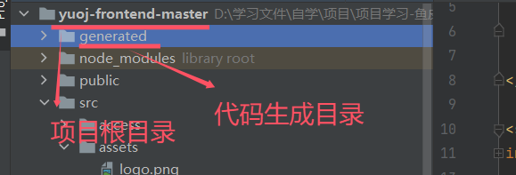
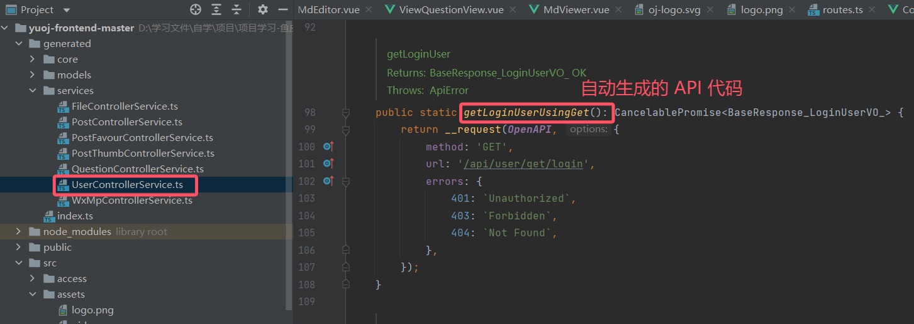
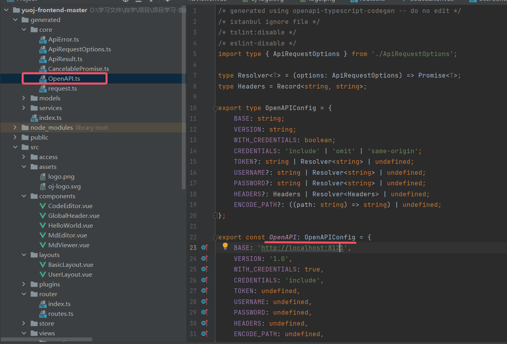

## Node版本管理工具 ---- NVM

| nvm 命令                               | 命令解释                                                     |
| -------------------------------------- | ------------------------------------------------------------ |
| nvm --help                             | 展示帮助                                                     |
| nvm --version                          | 已安装的nvm版本                                              |
| nvm install version                    | 下载对应的 node 版本(version)                                |
| mvn install --reinstall-packages-from= | 重新安装对应的 node 版本                                     |
| nvm install --lts                      | 仅从LTS版本中选择安装                                        |
| nvm install --lts=                     | 仅从特定LTS系列的版本中选择                                  |
| nvm install --skip-default-packages    | 跳过默认软件包文件                                           |
| nvm install --latest-npm               | 安装后，在给定的节点版本上升级到最新的npm                    |
| nvm install --no-progress              | 没有下载进度条                                               |
| nvm uninstall                          | 卸载对应的 node 版本                                         |
| nvm uninstall --lts                    | 卸载LTS版本                                                  |
| nvm uninstall --lts=                   | 卸载指定的LTS 版本                                           |
| nvm use                                | 使用对应的 node 版本                                         |
| nvm use --lts                          | 使用LTS 版本                                                 |
| nvm use --lts=                         | 使用指定的LTS 版本                                           |
| nvm list                               | 展示安装的 node 版本(可以简写为nvm ls)                       |
| nvm current                            | 显示当前节点的激活版本                                       |
| nvm version                            | 展示当前的 node 版本                                         |
| nvm exec [--silent]  []                | 使用指定的 版本运行 command命令                              |
| nvm run [--silent]  []                 | 使用指定的版本运行 args                                      |
| nvm alias                              | 对 version 版本设置一个别名                                  |
| nvm unalias                            | 删除这个别名                                                 |
| nvm install-latest-npm                 | 在当前node 版本上升级最新的npm版本                           |
| nvm reinstall-packages                 | 将version版本中的全局安装包安装到当前版本中                  |
| nvm unload                             | 从shell中卸载nvm                                             |
| nvm on                                 | 开启node版本管理                                             |
| nvm off                                | 关闭node版本管理                                             |
| nvm node_mirror [url]                  | 设置node镜像。默认是[nodejs.org/dist/](https://link.juejin.cn/?target=https%3A%2F%2Fnodejs.org%2Fdist%2F) 如果不写url，则使用默认url。设置后可至安装目录settings.txt文件查看，也可直接在该文件操作。 |
| nvm npm_mirror [url]                   | 设置npm镜像。[github.com/npm/cli/arc…](https://link.juejin.cn/?target=https%3A%2F%2Fgithub.com%2Fnpm%2Fcli%2Farchive%2F) 。如果不写url，则使用默认url。设置后可至安装目录settings.txt文件查看，也可直接在该文件操作。 |
| nvm proxy [url]                        | 设置下载代理。不加可选参数url，显示当前代理。将url设置为none则移除代理。 |
| nvm on                                 | 开启node.js版本管理。                                        |
| nvm off                                | 关闭node.js版本管理。                                        |


## API 前端代码自动生成 ---- openapi-typescript-codegen

> 工具仓库：https://github.com/ferdikoomen/openapi-typescript-codegen

首先安装：

```shell
npm install openapi-typescript-codegen --save-dev
```

然后执行命令生成代码：

```shell
openapi --input http://localhost:8121/api/v2/api-docs --output ./generated --client axios
```

> 生成后的代码结构如下：



3）直接使用生成的 Service 代码，直接调用函数发送请求即可，比如获取登录信息



```typescript
// 从远程请求获取登录信息
// 调用上图中的自动生成的 UserControllerService.getLoginUserUsingGet()
const res = await UserControllerService.getLoginUserUsingGet();
if (res.code === 0) {
  commit("updateUser", res.data);
} else {
  commit("updateUser", {
    ...state.loginUser,
    userRole: ACCESS_ENUM.NOT_LOGIN,
  });
}
```

如果想要自定义请求参数，怎么办？

1）使用代码生成器提供的全局参数修改对象：



```javascript
export const OpenAPI: OpenAPIConfig = {
    BASE: 'http://localhost:3000/api',
    VERSION: '2.0',
    WITH_CREDENTIALS: false,
    CREDENTIALS: 'include',
    TOKEN: undefined,
    USERNAME: undefined,
    PASSWORD: undefined,
    HEADERS: undefined,
    ENCODE_PATH: undefined,
};
```
