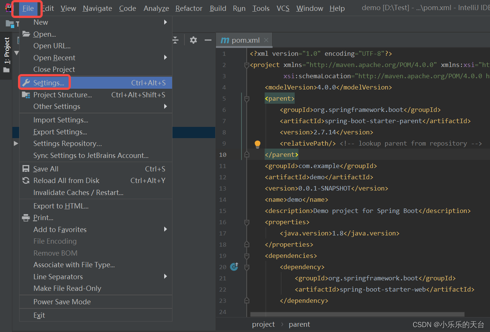

## IntelliJ IDEA

### 快捷键

`Ctrl + Shift + U` 选中文本大小写切换

### 卸载干净 IDEA

> 原文地址：https://www.quanxiaoha.com/idea/uninstall-idea.html

#### 1、卸载 IDEA 程序

点击屏幕左下角 **Windows 图标** -> **设置**：


点击 Windows 设置按钮

点击**应用**：


点击应用按钮

在应用中找到 IDEA, 单击它会出现卸载按钮，点击开始卸载：


卸载 IDEA

勾选第一栏 `Delete IntelliJ IDEA 2022.2 caches and local history`，表示同时删除 IDEA 本地缓存以及历史：


开始删除 IDEA

> `Delete IntellJ IDEA 2022.2 settings and installed plugins` : 删除 IDEA 相关设置，如字体大小、主题等等，以及删除已安装的插件。
>
> **此选项可不用勾选。**

#### 2、注册表清理

较老版本的 IDEA 安装成功后，会在注册表中都会留下一些信息，也需要清理一下。

按住快捷键 `windos + R`, 然后输入 `regedit` 回车调出注册表。

依次点击菜单 `计算机\HKEY_CURRENT_USER\SOFTWARE\JavaSoft\Prefs\jetbrains`， 然后右键删除。注意，如果注册表中未发现下图中的信息，说明你安装的 IDEA 版本较新，可以不用清理注册表，继续执行后续的步骤：

清理 IDEA 注册表信息

#### 3、残留清理

最后，还有几个地方的缓存数据需要删除：

```
C:\用户\${用户名称}\IdeaProjects\
# 如果你想删除 IDEA 相关，则只需要删除 JetBrains 目录下包含 IDEA 的文件夹即可
C:\用户\${用户名称}\AppData\Roaming\JetBrains
# 如果你想删除 IDEA 相关，则只需要删除 JetBrains 目录下包含 IDEA 的文件夹即可
C:\用户\${用户名称}\AppData\Local\JetBrains
C:\用户\公用\.jetbrains
# 如果你想删除 IDEA 相关，则只需要删除 JetBrains 目录下包含 IDEA 的文件夹即可
C:\Program Files\JetBrains
C:\ProgramData\Microsoft\Windows\Start Menu\Programs\JetBrains\
```

### IDEA检查项目的jdk版本需要看的地方

> 1、检查项目结构，如下图所示选择即可


> 选择了之后打开了如下界面：
> 下面的三张图全部都要检查选择jdk8的版本 


------

> 2、进入设置，如下所示：



> 进入之后，根据下图，挨个选择，将改项目模块的二进制码版本也选择成jdk1.8


> 在pom文件中检查java版本


### 使IDEA注释不顶格

1、进入 Settings -> Editor -> Code Style -> Java ，
2、在右边选择 “Code Generation” 

3、然后找到 Comment Code 那块，把Line comment at first column和
Block comment at first column 去掉前面两个的复选框


其它类型文件也可以通过这种方式实现“注释不顶格”。


### 修改IDEA快捷键

依次点击 File –> settings 或者 Ctrl + Alt + S –> Keymap，在右侧Keymap中下拉选择自己喜欢的快捷键方式，如下图


也可以修改某一个快捷键，如下图


可以在搜索框中搜索自己需要的功能，我需要的是将关闭标签页的ctrl + F4 修改为 ctrl + W


### 导出导入IDEA配置


导出的配置可以在其它的JetBrains产品使用

### IDEA全局查找替换

Ctrl + Shift + F 全局查找

Ctrl + Shift + R 全局替换

### IDEA自动 import 和 移除 类

> 在下面的两个可勾选项中，**On the fly**” 是一个英语短语，意思是 **即时地**、**动态地** 或 **随时随地** 完成某项任务，而无需事先停止或准备。


### IDEA同时管理多个可运行模块 / 底部添加services仪表盘

> 底部添加services仪表盘 就是 让IDEA同时管理多个可运行模块 的解决方案

按 Alt + 8 快捷键即可调出services仪表盘 


### IDEA配置代理（暂时需要验证）

> IDEA配置代理的想法来源：
>
> - 在之前使用Docker时，发现就算在服务器上开启了代理也不能让Docker使用docker search 和 docker pull等命令，需要为Docker配置代理才可以。
> - 而IDEA也有类似的情况：电脑上开了代理，IDEA有时候push也会失败，plugins market有时也会加载不出来插件市场的插件，需要开启Clash的TUN模式才能解决（**TUN 模式**模拟了一个虚拟网卡，能够接管系统的所有流量），因此我猜测IDEA并没有走代理，需要额外配置才能被代理接管


### 使用IDEA自定义代码片段

####  1. 打开IDEA，点击 `Settings`，选择 `Live Templates`。


#### 2. 点击 `Add`，选择 `2 Template Group`。


#### 3. 输入自定义的 `Group Name`，点击 `OK`。


#### 4. 选中自定义组，点击 `Add`，选择 `Live Template`。


#### 5. 添加自定义头注释：

- `Abbreviation` 输入 `hh`（根据个人习惯设置快捷键）。

- `Template text` 输入你喜欢的模板，例如：

  ```java
  /*
   * Copyright(C) [2023] [com.company]
   *
   * Author: [name]
   * Email: [email]
   *
   * This software is provided by the copyright owner under the terms of the license agreement.
   * Unauthorized use of this software is strictly prohibited.
   *
   * This software is provided under an open-source license without any express or implied warranties.
   * For details, please refer to the license file.
   */
  ```

- `Expand with` 选择 `Enter`。

- 点击 `Apply`。
  

### IDEA快捷键折叠/展开代码

**Ctrl + Shift + 减号**：折叠所有代码

所有代码被折叠


**Ctrl + Shift + 加号**：展开所有代码

所有代码被展开


### IDEA自动同步代码到**虚拟机** / **服务器**

#### 创建连接

1.首先点击 Tools -> Deployment -> Configuration


在新窗口中点击 `加号`，再点击 `SFTP`


接下来点击此处


#### 创建映射

1.在创建完连接之后，先点击要同步的服务器，再点击Mappings


2.按照下图配置。


3.按照图中勾选自动上传


4.也可以手动同步


最后可以看到文件全部同步到远程服务器


### 使IDEA能够创建Java8版本的Spring项目


将Spring官网修改为`https://start.aliyun.com`


### IDEA  2025.2版本  在操作svn管理的项目时一直弹出authentication required

新版idea在操作svn管理的Java项目时一直弹出authentication required框，主要因为svn是搭建在内网的，自己电脑没有连内网时，idea就会一直尝试去连接svn，从而就导致一直弹出authentication required框让你输入账号密码验证，但暂时又没办法连接内网，idea隔一会就弹出认证框，就极大的影响开发时的心情，从网上找了一大堆方法都不行，最后试了一下下面的方法再也没弹出过。

如图所示将连接和读取时间都设置为最大，这样用到现在都没有在弹出认证框了

SSH connection timeout设为最大值999999

ssh read timeout设为最大值999999


### IDEA中统一日志输出编码为UTF-8

#### IDEA终端环境改为UTF-8

将 `设置 -> Editor -> General -> Console -> Default Encoding` 改为 UTF -8

> 这一步修改相当于统一了终端环境，使终端只能正确输出UTF-8编码的文本


#### JVM 编码环境改为UTF-8

在VM options 中 加上 `-Dfile.encoding=UTF_8`

> 这一段命令能使java代码输出 UTF-8格式的日志，正好符合上面设置的  IDEA  UTF-8终端环境 


#### Tomcat日志环境改为UTF-8

首先找到Tomcat根目录，打开`根目录/conf/logging.properties`文件

接着将 `java.util.logging.ConsoleHandler.encoding = GBK` 这段配置中的 GBK 改为 UTF-8

> 这一段命令能使Tomcat输出 UTF-8格式的日志，正好符合上面设置的  IDEA  UTF-8终端环境 


### 断点类型All和Thread的区别

#### All模式

 所有的线程都要在当前位置被阻塞，谁先来就先阻塞谁，发生阻塞时其他的线程当前时刻执行到哪里就在哪里进行原地等待。

- 如果此时按下一步F6，那**所有的线程**都通过阻塞代码
- 如果此时按恢复程序运行F8，那么当前线程通过阻塞代码，等待下一个线程的到来，也是谁先来阻塞谁，发生阻塞时其他的线程当前时刻执行到哪里就在哪里进行原地等待。

```java
public class ThreadAndAllBreakApplication {

    public static void main(String[] args) {
        ThreadTest thread1 = new ThreadTest();
        thread1.setName("线程A");
        thread1.start();

        ThreadTest thread2 = new ThreadTest();
        thread2.setName("线程B");
        thread2.start();

        ThreadTest thread3 = new ThreadTest();
        thread3.setName("线程C");
        thread3.start();
    }
}

class ThreadTest extends Thread {

    @Override
    public void run() {
        System.out.println(Thread.currentThread().getName() + ": 1");
        try {
            long millis = RandomUtil.randomLong(100, 500);
            System.out.println(Thread.currentThread().getName() + "睡眠: " + millis);
            Thread.sleep(millis);
        } catch (InterruptedException e) {
            e.printStackTrace();
        }
        System.out.println(Thread.currentThread().getName() + ": 2");
        System.out.println(Thread.currentThread().getName() + ": 3");
        System.out.println(Thread.currentThread().getName() + ": 设置断点的前一行代码"); // 当前行设置断点
        System.out.println(Thread.currentThread().getName() + ": 4");
        System.out.println(Thread.currentThread().getName() + ": end");
    }
}


线程A: 1
线程C: 1
线程B: 1
线程C睡眠: 283
线程A睡眠: 340
线程B睡眠: 127
线程B: 2
线程B: 3
线程B: 设置断点的前一行代码 // B来到了这里，此时其他线程A、B在原地等待，即A、B都在睡眠。
线程A: 2 // A之前执行到睡眠，现在执行2
线程A: 3
线程A: 设置断点的前一行代码 // A来到了这里，此时其他线程B、C在原地等待
线程C: 2 // c之前执行到睡眠，现在执行2
线程C: 3
线程A: 4
线程B: 4
线程A: end
线程C: 设置断点的前一行代码 // C来到了这里，如果不放行断点，B一直也不会输出end，会在原地等待（这里证明了当某个线程被All断点阻塞后，其他线程会在原地等待）
线程B: end
线程C: 4
线程C: end
```

#### Thread模式

所有的线程都会运行到断点处然后阻塞

- 如果此时按F8（Step Over），那么当前的线程向后执行一步，其他线程不动。

- 如果此时按F9 （Resume Program），那么当前线程通过阻塞代码，并自动切换到下一个阻塞线程进行调试。

  


### IDEA多线程Debug时不同图标对应的状态

> 原文地址：https://www.jetbrains.com/zh-cn/help/idea/examining-suspended-program.html#threadicons


## WebStorm

### WebStorm快捷键Prettier格式化代码


## GoLand

## PyCharm

## VSCode

### 创建自定义代码片段

1. **打开用户代码片段设置：**

   - 在 VSCode 中，按下 `Ctrl+Shift+P`（或 `Cmd+Shift+P`），调出命令面板。
   - 输入 `Snippets: Configure Snippets`后按回车。在新展示的内容中，选择
     
   - 在弹出的列表中，选择您所使用的编程语言（例如 `javascript`）。

2. **添加自定义代码片段：**

   - 在打开的代码片段文件中，添加以下内容：

     ```json
     {
       "document.getElementById": {
         "prefix": "did",
         "body": "document.getElementById('$1')",
         "description": "Insert document.getElementById"
       }
     }
     ```

   - 上述配置中，`prefix` 是触发补全的关键字，
     `body` 是插入的代码内容，
     `$1` 表示光标的初始位置（如果片段中有多个占位符，例如 `$1` 和 `$2`，按 `Tab` 键可以依次跳转到这些位置，逐个编辑内容。），
     `description` 是对该片段的描述。

3. **保存并使用：**

   - 保存代码片段文件。
   - 在 JavaScript 文件中，输入 `did`，然后按下 `Tab` 键，VSCode 将自动补全为 `document.getElementById('')`，并将光标定位在引号内，方便您直接输入元素的 ID。

### 自定义快捷键


搜索想要进行配置快捷键的功能


### 更改代码格式化规则

#### 使用Vetur插件格式化代码

vscode中如何对vue文件代码进行格式化

1.通过vscode的Extensions插件市场，搜索Vetur插件。Vetur是一个专门为Vue开发提供支持的插件，它提供了代码高亮、智能提示、语法检查等功能


2.找到vscode的设置Settings，然后在搜索栏中输入：“Editor:Default Formatter”，选择"Vetur"作为默认的代码格式化工具


3.使用快捷键格式化代码：在编辑Vue文件时，可以使用快捷键Ctrl + Shift + F来格式化选中的代码块或整个文件。也可以通过右键菜单选择"Format Document"来进行格式化


#### 自定义代码格式化规则

如果对默认的代码格式化规则不满意，你可以在VSCode的设置中找到"Vetur"插件的配置，根据自己的需求进行修改。例如，你可以设置缩进大小、换行规则、空格等

自定义的步骤如下：

- 按`Ctrl + ,`
- 搜索settings
- 可以看到Edit in settings.json选项


在文件中新增以下内容：

```json
{
    "workbench.startupEditor": "none",
    "explorer.compactFolders": false,
    "terminal.integrated.defaultProfile.windows": "Command Prompt",
    "vetur.format.defaultFormatter.js": "vscode-typescript",
    "vetur.format.defaultFormatter.html": "js-beautify-html",
    "editor.defaultFormatter": "octref.vetur",
    "editor.formatOnSave": true,
    "vetur.format.defaultFormatterOptions": {
        "js-beautify-html": {
            "wrap_line_length": 170,
            "end_with_newline": false,
            "wrap_attributes": "auto"
        }
    }
}
```

> 新增后效果如下：
>
> 

上面配置可以解决常用的格式化操作

- 'editor.formatOnSave'：保存代码，自动格式化代码
- 'editor.defaultFormatter'：设置默认的格式化方式，当前采用vetur
- 'wrap_line_length'：当前代码行字符的个数，如果字符个数大于170，则执行自动换行（wrap_attributes）
- 'wrap_attributes'：设置换行自动对齐方式，建议使用'auto'

### 开启块选择模式

按住鼠标滚轮键并拖动

## VisualStudio

### VisualStudio2022设置快捷键

点击工具->选项，


选择环境->键盘即进入到设置快捷键的界面，


应用 VSCode 的键盘方案，VisualStudio和VSCode有了相同的快捷键


### VisualStudio2022快捷键总结

#### 快速生成属性 -- Ctrl R, Ctrl E

将鼠标光标放在要生成属性这一行，按下快捷键生成该字段的属性。


选中多个字段并按快捷键


### VisualStudio2022安装ReSharper插件破解版

首先打开JetBrains的[ReShaper官网](https://www.jetbrains.com.cn/resharper/download/other.html)，下载2022.x版本的ReSharper。


下载并安装后，右键以管理员身份运行[破解工具](https://pan.baidu.com/s/1BZQaN9nfXmGt0f4GTDpb1w?pwd=5wjb)


运行后将有30天免费试用，每次到期后运行依次即可。

## Eclipse

### 设置 sql 颜色

1.点击window,选择Preferences


2.搜索syn,查找 Sql Editor 下的 [Syntax](https://so.csdn.net/so/search?q=Syntax&spm=1001.2101.3001.7020) Coloring,选择它


3.有时候点了apply,不会马上起作用，要先关闭打开的sql文件，再重新打开才会看到效果

### 切换Jdk版本和SpringBoot

> 原文地址：https://juejin.cn/post/7175531370242900028

在创建SpringBoot项目时，没有提供Jdk1.8的选项，只能先选择高版本Jdk，再降级Jdk版本

#### 一、SpringBoot版本

SpringBoot版本只需要更改此处即可


#### 二、JDK版本

此处以我把jdk版本从1.8切换到1.7为例：

其实方法很简单，所有需要在eclipse中设置，分两块：

##### 第一块

设置eclipse工作空间的JDK版本，即eclipse中所有项目的编译运行的环境（全局配置）

###### 步骤1

Window —> Preferences —> Java —> Compiler —> 右侧面板设置为1.7

如图所示：


###### 步骤2

Window —> Preferences —> Java —> Installed JREs —> 右侧面板“Add”本地的1.7版本JDK路径，并勾上


如果没有上面5的话，就点击5右边的Add…如下图：


点击Next会出现下图所示：按指示往下进行


##### 第二块

配置你要改变JDK的项目的JDK版本：

###### 步骤3

点击项目右键 —> Properties —> Java Build Path —> Libraries —> 然后确保Libraries右侧的标签页“Order And Export”也出现JRE System Library [JavaSE-1.7]

点击项目右键（一般是cms-core分项目，而不是cms-cms项目）—> Properties（或项目右键 —> Build Path —> Configure Build Path）—> Java Build Path（右侧面板）—> Libraries —>（如果有JRE System Library [JavaSE-1.8]就点右侧的“Edit…”改为本地jdk1.7，如果是其他的jdk点“Remove” —> Add Library… —> 选“JRE System Library ” —> Next —> 再改为本地的jdk1.7）—> 然后确保Libraries右侧的标签页“Order And Export”也出现JRE System Library [JavaSE-1.7]

###### 步骤4

与Java Build Path同页面的Java Compiler—右侧面板设置为1.7

###### 步骤5

与Java Compiler同页面的Project Facets—右侧面板勾上Java，Version设为1.7


**重要提示**：有些人本来项目是好的或者新导下来没问题的项目，在设置完JDK后项目就出错了，项目包名上有小红叉，但是就是没找到报错的文件，此时你就要看看是不是你的项目右键 —> build path设置页面有没有报错的，也要看看你的JDK版本这几步都设置到了吗，少其中一步你的项目可能会报错出现小红叉而不会在具体的文件上出现小红叉，即使你的项目能跑，好像运行没什么问题，等项目部署到服务器上，真正的版本问题出现，很有可能就找不到方向了。在此重要提醒！！！

### 插件商店修改镜像

> 原文地址：https://blog.csdn.net/weixin_43954092/article/details/105114635

在使用eclipse进行开发的时候，经常会用到一些插件来提高开发效率。

但因为eclipse默认从官网下载的。因此，经常会出现下载时间很长，或者下载失败的情况。

那么如何优化eclipse插件下载速度呢，我们可以选择使用国内镜像站。

那么，本文就谈谈要如何将eclipse的默认网站修改为国内镜像站。

**第一步**：点击Window–>Preferences，进入Preferences界面


**第二步**：输入"Available"进行搜索，进入Available Software Sites界面


**第四步**：在这个界面，将默认网站修改为国内镜像站：即把所有的http://download.eclipse.org/改为**http://mirrors.ustc.edu.cn/eclipse/**


修改完成后，点击Apply and Close。

完成这些操作，重新开始下载插件，会发现下载速度快了很多

> 更改结果如下图：
>
> 

### yml文件中将回车从Tab变为Space

1. **打开Eclipse的偏好设置:**点击`Window` -> `Preferences`。
2. **找到文本编辑器设置:**依次选择`General` -> `Editors` -> `Text Editors`。
3. **设置Tab键行为:**勾选`Insert spaces for tabs`选项。这会使Eclipse在按下Tab键时插入空格而不是Tab字符。

配置之后，在所有文件中按回车键，都会在新一行开头填充开头。


### 代码花括号自动新起一行(设置代码格式标准)

preferences -> Java -> Code Style -> Formatter -> Edit / New


经过上面的设置，代码的花括号就会自动另起一行了。

也可以设置在此页面设置其它内容

### 自动生成Getter/Setter

右键，点击Source，或者直接按**Alt + Shift +S**
再点击Generate Geeters and Setters，就会自动在鼠标位置生成Get Set方


### 快速导入包

Ctrl + Shift + O

### Eclipse开启与关闭代码提示

> 原文地址：https://blog.csdn.net/weixin_48419914/article/details/121551738

#### 关闭

**Eclipse 取消自动代码提示**

1. 去到菜单window->Preferences->Java->Editor->ContentAssist
2. **看看Enable auto activation之前有没有打上勾 ,有勾去掉即可**

去掉自动提示后也可以在输入代码的字母后按**alt+/**进行提示

#### 开启 

**一、Eclipse代码里面的代码提示功能默认是关闭的，只有输入“.”的时候才会提示功能**

如何修改eclipse配置，开启代码自动提示功能 

1. 打开 **Eclipse -> Window -> Perferences -> Java -> Editor -> Content Assist**
2. 在右边最下面一栏找到**auto-Activation** 
3. 下面有三个选项，找到第二个“**Auto activation triggers for Java**：”选项 在其后的文本框中会看到一个“**.**”存在。这表示：只有输入“**.**”之后才会有代码提示和自动补全。
4. 把该文本框中的“**.**”换掉，换成“**abcdefghijklmnopqrstuvwxyz.**”，这样，你在Eclipse里面写Java代码就可以做到按“**abcdefghijklmnopqrstuvwxyz.**”中的任意一个字符都会有代码提示。 

> 小白笔者建议：不要所有字母全部开启，否则会有特别麻烦的提示效果，笔者只开启了s和o两个字母，方便syso能提示出System.out.println()

**二、可是eclipse不允许输入这么的字符，文本框中最多允许输入4个字符**

通过修改配置文件的方法实现，具体操作步骤如下: 

1. 打开Eclipse，然后**“window”→“Preferences**”
2. 选择“java”，展开，“Editor”，选择“Content Assist”。

3.选择“Content Assist”，然后看到右边，右边的“**AutoActivation**”下面的“**Auto Activation triggers for java**”这个选项。其实就是指触发代码提示的就是“**.**”这个符号。 

4.“**AutoActivation triggers for java**”这个选项，在“**.**”后加**abc**字母，方便后面的查找 修改。然后“apply”，点击“OK”。

5. 然后**，“File”→“Export”**，在弹出的窗口中选择**“General”→“Perferences”**，点击“下一步”。
6. 选择导出文件路径，本人导出到桌面，输入“abc”作为文件名，点击“保存”。
7. 在桌面找到刚在保存的文件“abc.epf”,右键选择“用记事本打开”。 
8. 按“ctrl + F”快捷键，输入“.abc”，点击“查找下一个”。
9. 查找到“.abc”的配置信息如下：如下：
10. 把**“.abc”改成“.abcdefghijklmnopqrstuvwxyz**(,”，保存，关闭“test.epf”。
11. 回到MyEclipse界面，**“File”→“Import”**，在弹出的窗口中选择“Perferences”，点击“下一步”，选择刚在已经修改的“**abc.epf**”文件，点击“打开”，点击“Finish”。该步骤和上面 的导出步骤类似。

12.修改完毕，测试一下就行了

### 快速生成serialVersionUID

先实现Serializable接口

再把鼠标放到按Ctrl + 1。

再按Quick Fix

### 更新Maven依赖

右键 -> Maven -> Update Project


### xml文件 提示Element type “xxx“ must be declared

Preference -> XML（Wild Web Developer）

勾选Download external resources like referenced DTO，XSD


### 选择一整列（块选择模式）

Alt+Shift+A  开启块选择模式，开启后可以选中一列

### Eclipse字符串类型变量自动追加String后缀

> 原文地址：https://blog.csdn.net/future_yzx/article/details/137298335

先打开eclipse，顶部找到window，点击preference 弹出一个设置窗口；


在窗口左侧选择Java>Editor>Content Assist；然后再右侧找到Disable insertion triggers except Enter 的选项（禁用除Enter以外的插入触发器）把它打上对钩就OK了。


如此操作完成后，在定义String类型的变量时，只有按下回车才会自动追加‘String’；按空格或分号时，都是正常输入

### Eclipse更改主题插件

Eclipse更改主题颜色的最好的插件：


安装下载完成后，点击window->Preferences->General->Appearance->Color Theme，

### eclipse取消变量名自动补全

 window ->*Preferences...* -> *Java* -> *Editor* -> *Content Assist,*

*勾选上Disable insertion triggers except 'Enter'*

这个选项的作用是除了回车键，其他键都不会将自动补全的代码自动插入到代码当中，

*这个选项适用于2018年12月之后的eclipse版本中。* 

### Eclipse启动Web单体项目


## dbeaver -- 数据库管理工具

### dbeaver运行sql脚本报错—— ERROR 1366 (HY000) at line...

#### （推荐）指定额外的命令参数

在额外参数命令中填写 `--default-character-set=utf8mb4`


此方法和Navicat运行SQL脚本时，指定编码格式的原理一样：


#### 在SQL脚本中添加指定SQL脚本的语句

> 缺点，每个SQL文件都要写一次，麻烦

在sql脚本的开头加上编码`SET CHARACTER SET utf8;`


### 连接达梦数据库

#### 运行软件，配置DM数据库驱动

选择“数据库-驱动管理器”


点击新建


填写驱动的设置内容

```sql
# 类名
dm.jdbc.driver.DmDriver
# URL模板
jdbc:dm://{host}:{port}
# 默认端口
5236
```


在库里面引入驱动文件

驱动文件下载地址：https://eco.dameng.com/document/dm/zh-cn/app-dev/java-hibernate-frame.html


在驱动所在目录中勾选


#### 数据库连接

驱动设置完成，进行DM数据连接，点击新建数据库连接


选择刚刚配置的数据库驱动程序


填写主机ip地址，用户名以及密码，如果是本地新创数据库，默认用户名和密码都为：SYSDBA


测试连接成功，点击完成。


## Anaconda

### bat脚本中激活conda环境后无法执行其他命令

> 原文地址：https://www.cnblogs.com/harrymore/p/17401502.html
>
> 本文版权归作者(https://www.cnblogs.com/harrymore/)和博客园共有，欢迎转载，但未经作者同意必须保留此段声明，且在文章页面明显位置给出原文链接，如有问题， 可邮件（harrymore@126.com）咨询.

#### 1. 问题

由于做实验的原因，经常需要在个人电脑上使用jupyter notebook，而我的jupyter notebook是使用anaconda进行管理的，因此需要先激活conda的环境，然后再启动jupyter notebook，我希望把这些都写入bat中，需要用的时候直接用bat文件运行就可以使用jupyter了。

于是我有了第一个bat脚本：

```bat
@echo off
cd /d C:\\Users\\yourname\\yourfolder
conda activate myenv
jupyter notebook
```

但是发现，跑到conda activate myenv之后，就无法继续往下跑了，上网找了一下，使用call解决了问题。

#### 2. 解决

使用call调用conda激活环境，然后再执行jupyter notebook。

```bat
cd /d C:\\Users\\yourname\\yourfolder
call conda activate myenv
jupyter notebook
```

那call是什么命令呢？为什么这里用call之后又正常执行呢？

#### 3. 分析

##### 3.1. call命令

关于call命令，它的作用是在批处理脚本中，用来**从一个批处理脚本中调用另一个批处理脚本。调用另一个批处理程序，并且不终止父批处理程序**（如果不用call而直接调用别的批处理文件，那么执行完那个批处理文件后将无法返回当前文件并执行当前文件的后续命令）。更多call命令的用法查看参考[1]。

因此，可以猜测我们这里调用的

```shell
conda activate myenv
```

命令实际上调用的是一个批处理文件，因此这里如果不用call，便会执行完conda的批处理文件后，直接杀掉父bat所在的进程。

##### 3.2. 测试

以上仅仅是猜测，那么究竟在win系统中，调用conda命令时，实际执行的是批处理文件还是exe文件呢？

在cmd中执行：

```bat
where conda
```

输出：

> C:\Users\yourpath\anaconda3\condabin\conda.bat
> C:\Users\yourpath\anaconda3\Library\bin\conda.bat
> C:\Users\yourpath\anaconda3\Scripts\conda.exe

发现Library中的conda.bat也是指向C:\Users\yourpath\anaconda3\condabin\conda.bat。

编辑这个文件，在前面增加一句输出

```shell
echo “it's a bat”
```

重新打开cmd，执行

```shell
conda activate myenv
```

激活成功的同时，终端打印出：

> it's a bat

##### 3.2. 结论

win系统在调用conda命令的时候，实际上是调用conda.bat文件，因此需要在前面加上call命令。

知道这个原因，我们也可以通过更简洁的方式启动jupyter：

```bat
@echo off
cd /d C:\\Users\\yourname\\yourfolder
cmd /k "conda activate d2l && jupyter notebook"
```

#### 4. 参考

[1] [批处理命令——call 和 start](https://www.cnblogs.com/Braveliu/p/5078283.html)

（完）
