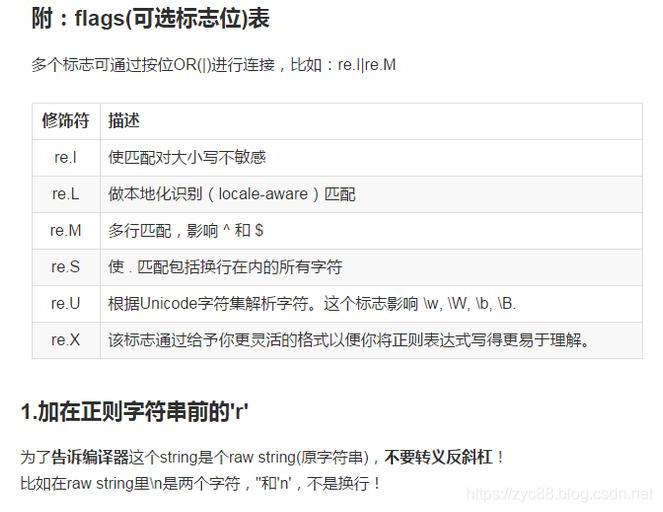
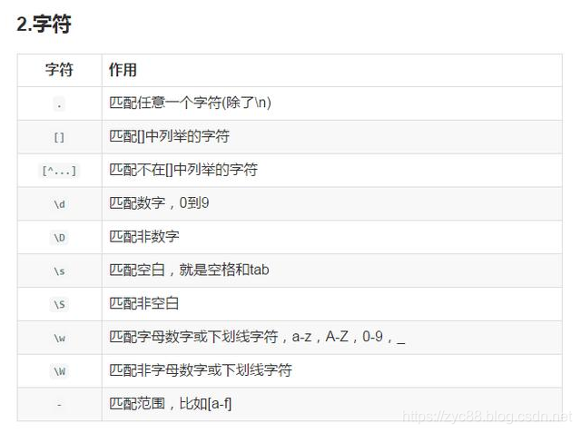
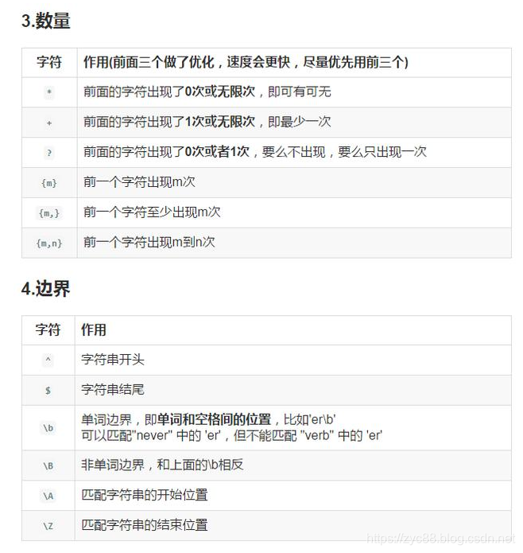
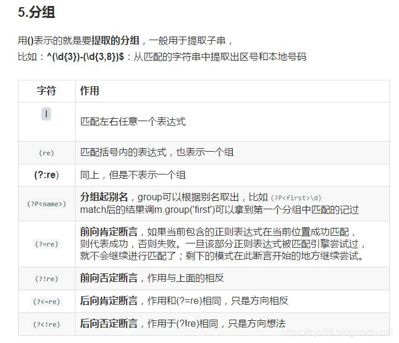

| 语法           | 说明                                                         |
| -------------- | ------------------------------------------------------------ |
| `\`            | 将下一个字符标记符、或一个向后引用、或一个八进制转义符。 **例如**：`\n` 匹配换行符，`\\` 匹配 `\`，`\(` 匹配 `(` |
| `^`            | 匹配输入行首。若设置了 `Multiline` 属性，则也匹配 `\n` 或 `\r` 之后的位置（行首指上一个 `\n` 后的开头） |
| `$`            | 匹配输入行尾。若设置了 `Multiline` 属性，则也匹配 `\n` 或 `\r` 之前的位置（行尾指下一个 `\n` 前的结尾） |
| `*`            | 匹配前面的子表达式任意次（等价于 `{0,}`）。 **例如**：`zo*` 可匹配 `z` 或 `zoo` |
| `+`            | 匹配前面的子表达式一次或多次（等价于 `{1,}`）。 **例如**：`zo+` 可匹配 `zo` 或 `zoo`，但不能匹配 `z` |
| `?`            | 匹配前面的子表达式零次或一次（等价于 `{0,1}`）。 **例如**：`do(es)?` 可匹配 `do` 或 `does` |
| `{n}`          | 精确匹配 `n` 次。 **例如**：`o{2}` 不能匹配 `Bob` 中的 `o`，但能匹配 `food` 中的两个 `o` |
| `{n,}`         | 至少匹配 `n` 次。 **例如**：`o{2,}` 不能匹配 `Bob`，但能匹配 `foooood` 中的所有 `o` |
| `{n,m}`        | 最少匹配 `n` 次且最多 `m` 次（`n <= m`）。 **例如**：`o{1,3}` 匹配 `fooooood` 中的前三个 `o` |
| `?`            | 当跟在其他限定符（`*`/`+`/`?`/`{n}`/`{n,}`/`{n,m}`）后时，启用非贪婪模式（尽可能少匹配）。 **例如**：对 `oooo`，`o+` 会匹配全部 `o`，而 `o+?` 会匹配单个 `o` |
| `.`            | 匹配除 `\n` 和 `\r` 外的任何单个字符。若要匹配包括 `\n` 和 `\r` 的字符，可用 `[\s\S]` |
| `(pattern)`    | 捕获匹配。 **例如**：`(.)\1` 可匹配两个连续相同字符     |
| `(?:pattern)`  | 非捕获匹配。 **例如**：`industr(?:y\|ies)` 是 `industry\|industries` 的简写形式 |
| `(?=pattern)`  | 正向肯定预查。 **例如**：`Windows(?=95\|98\|NT\|2000)` 能匹配 `Windows2000` 中的 `Windows`，但不匹配 `Windows3.1` 中的 `Windows` |
| `(?!pattern)`  | 正向否定预查。 **例如**：`Windows(?!95\|98\|NT\|2000)` 能匹配 `Windows3.1` 中的 `Windows`，但不匹配 `Windows2000` 中的 `Windows` |
| `(?<=pattern)` | 反向肯定预查。 **例如**：`(?<=95\|98\|NT\|2000)Windows` 能匹配 `2000Windows` 中的 `Windows`，但不匹配 `3.1Windows` 中的 `Windows`（Python 不完全支持） |
| `(?<!pattern)` | 反向否定预查。 **例如**：`(?<!95\|98\|NT\|2000)Windows` 能匹配 `3.1Windows` 中的 `Windows`，但不匹配 `2000Windows` 中的 `Windows`（Python 不完全支持） |
| `x\|y`         | 匹配 `x` 或 `y`。 **例如**：`z\|food` 匹配 `z` 或 `food`；`[z\|f]ood` 匹配 `zood` 或 `food` |
| `[xyz]`        | 字符集合。匹配包含的任意一个字符。 **例如**：`[abc]` 可匹配 `plain` 中的 `a` |
| `[^xyz]`       | 负值字符集合。匹配未包含的任意字符。 **例如**：`[^abc]` 可匹配 `plain` 中的 `p`、`l`、`i`、`n` |
| `[a-z]`        | 字符范围。匹配指定范围内的任意字符（连字符在中间时表示范围）。 **例如**：`[a-z]` 匹配所有小写字母 |
| `[^a-z]`       | 负值字符范围。匹配任何不在指定范围内的字符。 **例如**：`[^a-z]` 匹配非小写字母字符 |
| `\b`           | 匹配单词边界（位置匹配）。 **例如**：`er\b` 可匹配 `never` 中的 `er`，但不能匹配 `verb` 中的 `er` |
| `\B`           | 匹配非单词边界。 **例如**：`er\B` 可匹配 `verb` 中的 `er`，但不能匹配 `never` 中的 `er` |
| `\cx`          | 匹配由 `x` 指明的控制字符（`x` 必须为 A-Z 或 a-z）。 **例如**：`\cM` 匹配 Control-M 或回车符 |
| `\d`           | 匹配数字字符（等价于 `[0-9]`）。需在 `grep` 中使用 `-P` 参数 |
| `\D`           | 匹配非数字字符（等价于 `[^0-9]`）。需在 `grep` 中使用 `-P` 参数 |
| `\f`           | 匹配换页符（等价于 `\x0c` 和 `\cL`）                         |
| `\n`           | 匹配换行符（等价于 `\x0a` 和 `\cJ`）                         |
| `\r`           | 匹配回车符（等价于 `\x0d` 和 `\cM`）                         |
| `\s`           | 匹配任何不可见字符（包括空格、制表符、换页符等，等价于 `[ \f\n\r\t\v]`） |
| `\S`           | 匹配任何可见字符（等价于 `[^ \f\n\r\t\v]`）                  |
| `\t`           | 匹配制表符（等价于 `\x09` 和 `\cI`）                         |
| `\v`           | 匹配垂直制表符（等价于 `\x0b` 和 `\cK`）                     |
| `\w`           | 匹配单词字符（包括下划线，等价于 `[A-Za-z0-9_]`，但 Unicode 范围更广） |
| `\W`           | 匹配非单词字符（等价于 `[^A-Za-z0-9_]`）                     |
| `\x{n}`        | 匹配十六进制转义值 `n`。 **例如**：`\x41` 匹配 `A`      |
| `\u{n}`        | 匹配 Unicode 字符。 **例如**：`\u00A9` 匹配版权符号（©） |
| `\p{P}`        | 匹配 Unicode 属性为标点的字符（部分语言不支持，如 JavaScript） |
| `\num`         | 向后引用第 `num` 个捕获组（`num` 是正整数）。 **例如**：`(.)\1` 匹配两个连续相同的字符（如 `aa`）。 |
| `\n`           | 当 `n` 是八进制数字（每一位均为0-7）且**没有对应的捕获组**时，匹配八进制转义值。 **例如**：`\041` 匹配 ASCII 字符 `!`（八进制 41 = 十进制 33）。 |
| `\nm`          | 1. 如果存在第 `nm` 个捕获组，则向后引用； 2. 若 `n` 是八进制数字（0-7）且 `m` 是普通字符，则匹配八进制转义值 `n` + 字符 `m`；  3. 若 `n` 和 `m` 均为八进制数字，则匹配八进制值 `nm`。 |
| `\nml`         | 当 `n`、`m`、`l` 均为八进制数字（0-7）时，匹配八进制转义值 `nml`。 **例如**：`\101` 匹配 ASCII 字符 `A`（八进制 101 = 十进制 65）。 |
| `<` `>`        | 匹配单词的边界（部分工具支持）。 **例如**：`<the>` 可匹配 `the wise` 中的 `the`，但不能匹配 `otherwise` 中的 `the` |
| `( )`          | 定义捕获组（最多保存 9 组，可通过 `\1` 到 `\9` 引用）        |
| `\|`           | 逻辑“或”运算。 **例如**：`(him\|her)` 可匹配 `belongs to him` 或 `belongs to her` |

 

PS:

https://www.runoob.com/regexp/regexp-tutial.html