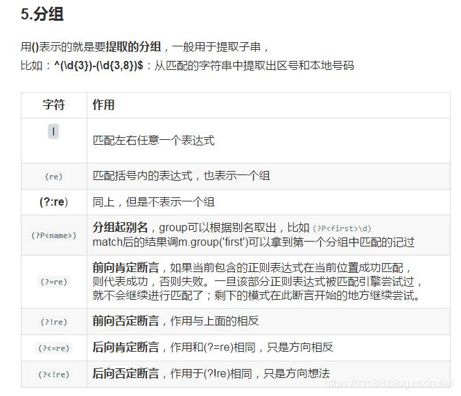
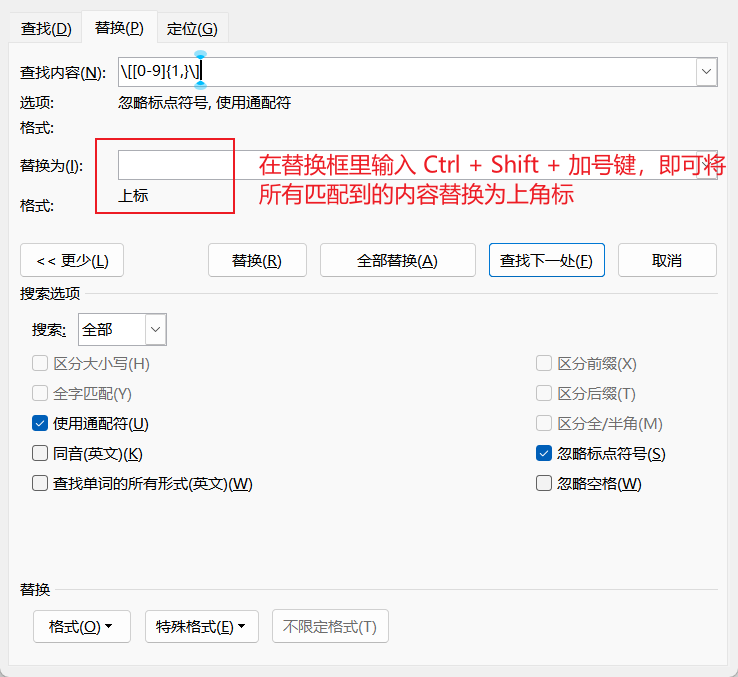

## 正则表达式

### 正则表达式基本语法

| 语法           | 说明                                                         |
| -------------- | ------------------------------------------------------------ |
| `\`            | 将下一个字符标记符、或一个向后引用、或一个八进制转义符。<br />**例如**：`\n` 匹配换行符，`\\` 匹配 `\`，`\(` 匹配 `(` |
| `^`            | 匹配输入行首。若设置了 `Multiline` 属性，则也匹配 `\n` 或 `\r` 之后的位置（行首指上一个 `\n` 后的开头） |
| `$`            | 匹配输入行尾。若设置了 `Multiline` 属性，则也匹配 `\n` 或 `\r` 之前的位置（行尾指下一个 `\n` 前的结尾） |
| `*`            | 匹配前面的子表达式任意次（等价于 `{0,}`）。<br />**例如**：`zo*` 可匹配 `z` 或 `zoo` |
| `+`            | 匹配前面的子表达式一次或多次（等价于 `{1,}`）。<br />**例如**：`zo+` 可匹配 `zo` 或 `zoo`，但不能匹配 `z` |
| `?`            | 匹配前面的子表达式零次或一次（等价于 `{0,1}`）。<br />**例如**：`do(es)?` 可匹配 `do` 或 `does` |
| `{n}`          | 精确匹配 `n` 次。<br />**例如**：`o{2}` 不能匹配 `Bob` 中的 `o`，但能匹配 `food` 中的两个 `o` |
| `{n,}`         | 至少匹配 `n` 次。<br />**例如**：`o{2,}` 不能匹配 `Bob`，但能匹配 `foooood` 中的所有 `o` |
| `{n,m}`        | 最少匹配 `n` 次且最多 `m` 次（`n <= m`）。<br />**例如**：`o{1,3}` 匹配 `fooooood` 中的前三个 `o` |
| `?`            | 当跟在其他限定符（`*`/`+`/`?`/`{n}`/`{n,}`/`{n,m}`）后时，启用非贪婪模式（尽可能少匹配）。<br />**例如**：对 `oooo`，`o+` 会匹配全部 `o`，而 `o+?` 会匹配单个 `o` |
| `.`            | 匹配除 `\n` 和 `\r` 外的任何单个字符。若要匹配包括 `\n` 和 `\r` 的字符，可用 `[\s\S]` |
| `(pattern)`    | 捕获匹配。<br />**例如**：`(.)\1` 可匹配两个连续相同字符     |
| `(?:pattern)`  | 非捕获匹配。<br />**例如**：`industr(?:y\|ies)` 是 `industry\|industries` 的简写形式 |
| `(?=pattern)`  | 正向肯定预查。<br />**例如**：`Windows(?=95\|98\|NT\|2000)` 能匹配 `Windows2000` 中的 `Windows`，但不匹配 `Windows3.1` 中的 `Windows` |
| `(?!pattern)`  | 正向否定预查。<br />**例如**：`Windows(?!95\|98\|NT\|2000)` 能匹配 `Windows3.1` 中的 `Windows`，但不匹配 `Windows2000` 中的 `Windows` |
| `(?<=pattern)` | 反向肯定预查。<br />**例如**：`(?<=95\|98\|NT\|2000)Windows` 能匹配 `2000Windows` 中的 `Windows`，但不匹配 `3.1Windows` 中的 `Windows`（Python 不完全支持） |
| `(?<!pattern)` | 反向否定预查。<br />**例如**：`(?<!95\|98\|NT\|2000)Windows` 能匹配 `3.1Windows` 中的 `Windows`，但不匹配 `2000Windows` 中的 `Windows`（Python 不完全支持） |
| `x\|y`         | 匹配 `x` 或 `y`。<br />**例如**：`z\|food` 匹配 `z` 或 `food`；`[z\|f]ood` 匹配 `zood` 或 `food` |
| `[xyz]`        | 字符集合。匹配包含的任意一个字符。<br />**例如**：`[abc]` 可匹配 `plain` 中的 `a` |
| `[^xyz]`       | 负值字符集合。匹配未包含的任意字符。<br />**例如**：`[^abc]` 可匹配 `plain` 中的 `p`、`l`、`i`、`n` |
| `[a-z]`        | 字符范围。匹配指定范围内的任意字符（连字符在中间时表示范围）。<br />**例如**：`[a-z]` 匹配所有小写字母 |
| `[^a-z]`       | 负值字符范围。匹配任何不在指定范围内的字符。<br />**例如**：`[^a-z]` 匹配非小写字母字符 |
| `\b`           | 匹配单词边界（位置匹配）。<br />**例如**：`er\b` 可匹配 `never` 中的 `er`，但不能匹配 `verb` 中的 `er` |
| `\B`           | 匹配非单词边界。<br />**例如**：`er\B` 可匹配 `verb` 中的 `er`，但不能匹配 `never` 中的 `er` |
| `\cx`          | 匹配由 `x` 指明的控制字符（`x` 必须为 A-Z 或 a-z）。<br />**例如**：`\cM` 匹配 Control-M 或回车符 |
| `\d`           | 匹配数字字符（等价于 `[0-9]`）。需在 `grep` 中使用 `-P` 参数 |
| `\D`           | 匹配非数字字符（等价于 `[^0-9]`）。需在 `grep` 中使用 `-P` 参数 |
| `\f`           | 匹配换页符（等价于 `\x0c` 和 `\cL`）                         |
| `\n`           | 匹配换行符（等价于 `\x0a` 和 `\cJ`）                         |
| `\r`           | 匹配回车符（等价于 `\x0d` 和 `\cM`）                         |
| `\s`           | 匹配任何不可见字符（包括空格、制表符、换页符等，等价于 `[ \f\n\r\t\v]`） |
| `\S`           | 匹配任何可见字符（等价于 `[^ \f\n\r\t\v]`）                  |
| `\t`           | 匹配制表符（等价于 `\x09` 和 `\cI`）                         |
| `\v`           | 匹配垂直制表符（等价于 `\x0b` 和 `\cK`）                     |
| `\w`           | 匹配单词字符（包括下划线，等价于 `[A-Za-z0-9_]`，但 Unicode 范围更广） |
| `\W`           | 匹配非单词字符（等价于 `[^A-Za-z0-9_]`）                     |
| `\x{n}`        | 匹配十六进制转义值 `n`。<br />**例如**：`\x41` 匹配 `A`      |
| `\u{n}`        | 匹配 Unicode 字符。<br />**例如**：`\u00A9` 匹配版权符号（©） |
| `\p{P}`        | 匹配 Unicode 属性为标点的字符（部分语言不支持，如 JavaScript） |
| `\num`         | 向后引用第 `num` 个捕获组（`num` 是正整数）。<br />**例如**：`(.)\1` 匹配两个连续相同的字符（如 `aa`）。 |
| `\n`           | 当 `n` 是八进制数字（每一位均为0-7）且**没有对应的捕获组**时，匹配八进制转义值。<br />**例如**：`\041` 匹配 ASCII 字符 `!`（八进制 41 = 十进制 33）。 |
| `\nm`          | 1. 如果存在第 `nm` 个捕获组，则向后引用；<br />2. 若 `n` 是八进制数字（0-7）且 `m` 是普通字符，则匹配八进制转义值 `n` + 字符 `m`； <br />3. 若 `n` 和 `m` 均为八进制数字，则匹配八进制值 `nm`。 |
| `\nml`         | 当 `n`、`m`、`l` 均为八进制数字（0-7）时，匹配八进制转义值 `nml`。<br /<br />**例如**：`\101` 匹配 ASCII 字符 `A`（八进制 101 = 十进制 65）。 |
| `<` `>`        | 匹配单词的边界（部分工具支持）。<br />**例如**：`<the>` 可匹配 `the wise` 中的 `the`，但不能匹配 `otherwise` 中的 `the` |
| `( )`          | 定义捕获组（最多保存 9 组，可通过 `\1` 到 `\9` 引用）    |
| `\|`            | 逻辑“或”运算。<br />**例如**：`(him\|her)` 可匹配 `belongs to him` 或 `belongs to her` |

 




PS:

https://www.runoob.com/regexp/regexp-tutial.html

### 正则表达式使用记录

---

#### 格式

**表达式**：  

**解释**： 

---

#### 匹配1-100的数字

**表达式**：` \(\d{1,2}\)|\(100\)` 

**解释**： \d{1,2}表示匹配一个数字一到两次。整段表达式表示匹配1-99或者直接匹配100.

---

#### 匹配㊽这种带圆圈的数字

**表达式**： `[\u2460-\u2473\u3251-\u325F\u32B1-\u32BF]`

**解释**： `[\u2460-\u2473]`：匹配 `①` 到 `⑳`（1 到 20）。
`[\u3251-\u325F]`：匹配 `㉑` 到 `㉟`（21 到 35）。
`[\u32B1-\u32BF]`：匹配 `㊱` 到 `㊿`（36 到 50）。

严格意义上的 **圆圈数字** 总共有 **50 个**。

- `①` 到 `⑳`（1 到 20）
- `㉑` 到 `㉟`（21 到 35）
- `㊱` 到 `㊿`（36 到 50）

---

#### 匹配md文档的一级标题

**表达式**：  ^#\s*(.+?、)   替换为  \## $1

**解释**：`^`：表示匹配行的开头。

`#`：匹配一级标题的井号。

`\s*`：匹配井号后可能存在的空格。

`(.+?、)`: `.+` 表示匹配一个或多个任意字符，`.+?` 会在遇到第一个满足条件的字符（<br />**例如** `、`）时停止匹配。()将正则中匹配的内容捕获到一个分组中，以便后续引用。该正则表达式中括号被捕获为第一组（能够被$1引用）。

`$1`:  `$1` 是正则表达式中引用匹配结果的一个标记，它指代**第一个捕获组**（也称为分组，通常用圆括号 `()` 括起来）。在正则表达式中捕获到的内容可以通过 `$1`、`$2` 等依次引用。

#### 匹配以 = 结尾的44个字符

**表达式**： [a-zA-Z0-9+/=]{43}=$

**解释**：  `[a-zA-Z0-9+/=]`：匹配a到z、A到Z、0到9、+、/、=中的任意一个字符。

{43}：表示匹配 [a-zA-Z0-9+/=] 这个表达式43次

=&：表示字符串必须=\n结尾，但是在替换时，不会替换\n

#### 匹配所有列举出来的字符串

> 问题描述：
>
> 下面列出了一些字符串，将这些字符串全部去除
>
> ▼typescript   ▼javascript   ▼java   ▼json   ▼xml   ▼bash   ▼shell   ▼sql ……

**表达式**： `▼typescript\n*|▼javascript\n*|▼java\n*|▼json\n*|▼xml\n*|▼bash\n*|▼shell\n*|▼sql\n*|▼text\n*|▼vue\n*|▼tsx\n*|▼html\n*|▼css\n*|▼plain\n*|▼yml\n*|▼yaml\n*|▼properties\n*|▼nginx\n*|▼lua\n*`

**解释**：使用 `|` 来匹配表达式中的任意一个字符串
使用* 来匹配\n任意多次（因为 * 匹配前面的子表达式任意次，而\n是一个子表达式，因此* 只会匹配\n 任意次，不会匹配\n 之前的字符。 ？和 + 的使用也是同理 ）


### 正则表达式相关拓展

#### 正则表达式分隔符“/”用途

##### 有无分隔符区别

`/\(\d{1,2}\)|\(100\)/`这种带分隔符的正则表达式是在大多数编程语言（如 JavaScript）中的常见写法，分隔符 `/` 表示正则表达式的开始和结束。
`\(\d{1,2}\)|\(100\)`这种裸露的正则表达式（无分隔符），通常用在**正则与其他工具**（如正则生成器、配置文件）结合的场景，或者嵌入到语言的特殊 API 中。

##### 需要分隔符的语言

JavaScript、PHP、Ruby、Perl

**JavaScript**

```js
javascriptCopy codeconst regex = /\d+/; // 匹配一个或多个数字
console.log("123abc".match(regex)); // 输出: ["123"]
```

**PHP**

```php
phpCopy code$regex = "/\d+/"; // 匹配一个或多个数字
preg_match($regex, "123abc", $matches);
print_r($matches); // 输出: ["123"]
```

**Ruby**

```ruby
rubyCopy coderegex = /\d+/ # 匹配一个或多个数字
puts "123abc".match(regex) # 输出: #<MatchData "123">
```

**Perl**

```perl
perlCopy codemy $regex = qr/\d+/; # 匹配一个或多个数字
if ("123abc" =~ $regex) {
    print "Matched\n"; # 输出: Matched
}
```

##### 不需要分隔符的语言

Python、Java、C#、Go

**Python**

```python
pythonCopy codeimp或t re
regex = r"\d+"  # 匹配一个或多个数字
matches = re.findall(regex, "123abc")
print(matches)  # 输出: ['123']
```

**Java**

```java
javaCopy codeimp或t java.util.regex.*;
public class Main {
    public static void main(String[] args) {
        String regex = "\\d+"; // 匹配一个或多个数字
        Pattern pattern = Pattern.compile(regex);
        Matcher matcher = pattern.matcher("123abc");
        if (matcher.find()) {
            System.out.println(matcher.group()); // 输出: 123
        }
    }
}
```

**C#**

```csharp
csharpCopy codeusing System;
using System.Text.RegularExpressions;

class Program {
    static void Main() {
        string regex = @"\d+"; // 匹配一个或多个数字
        Match match = Regex.Match("123abc", regex);
        if (match.Success) {
            Console.WriteLine(match.Value); // 输出: 123
        }
    }
}
```

**Go**

```go
goCopy codepackage main

imp或t (
	"fmt"
	"regexp"
)

func main() {
	regex := `\d+` // 匹配一个或多个数字
	re := regexp.MustCompile(regex)
	matches := re.FindString("123abc")
	fmt.Println(matches) // 输出: 123
}
```

## Word通配符

### Word通配符基本语法与用法

#### Word查找栏代码·通配符一览表

|      | 取消勾选通配符复选框 |                         | 勾选通配符复选框                 |                          |
| ---- | -------------------- | ----------------------- | :------------------------------- | ------------------------ |
| 序号 | 特殊字符             | 代码                    | 特殊字符                         | 代码 或 通配符           |
| 1    | 任意单个字符         | ^?                      | 任意单个字符                     | ?                        |
| 2    | 任意数字             | ^#                      | 任意数字（单个）                 | [0-9]                    |
| 3    | 任意英文字母         | ^$                      | 任意英文字母                     | [a-zA-Z]                 |
| 4    | 段落标记↵            | ^p                      | 段落标记                         | ^13                      |
| 5    | 手动换行符↓          | ^l  (这是是小写的英文L) | 手动换行符                       | ^l 或 ^11                |
| 6    | 图形                 | ^g 或 ^1                | 图形                             | ^g                       |
| 7    | 1/4长划线            | ^+                      | 1/4长划线                        | ^q                       |
| 8    | 长划线               | ^j                      | 长划线                           | ^+                       |
| 9    | 短划线               | ^q                      | 短划线                           | ^=                       |
| 10   | 制表符               | ^t                      | 制表符                           | ^t                       |
| 11   | 脱字号               | ^                       | 脱字号                           | ^^                       |
| 12   | 分栏符               | ^v                      | 分栏符                           | ^n 或 ^14                |
| 13   | 分节符               | ^b                      | 分节符/分页符                    | ^m                       |
| 14   | 省略号               | ^n                      | 省略号                           | ^i                       |
| 15   | 全角省略号           | ^i                      | 全角省略号                       | ^j                       |
| 16   | 无宽非分隔符         | ^z                      | 无宽非分隔符                     | ^z                       |
| 17   | 无宽可选分隔符       | ^x                      | 无宽可选分隔符                   | ^x                       |
| 18   | 不间断空格           | ^s                      | 不间断空格                       | ^s                       |
| 19   | 不间断连字符         | ^~                      | 不间断连字符                     | ^~                       |
| 20   | ¶段落符号            | ^%                      | ¶段落符号                        | ^%                       |
| 21   | §分节符              | ^                       | §分节符                          | ^                        |
| 22   | 脚注标记             | ^f 或 ^2                |                                  |                          |
| 23   | 可选连字符           | ^-                      | 可选连字符                       | ^-                       |
| 24   | 空白区域             | ^w                      |                                  |                          |
| 25   | 手动分页符           | ^m 或 ^12               | 手动分页符/分节符                | ^m                       |
| 26   | 尾注标记             | ^e                      |                                  |                          |
| 27   | 域                   | ^d                      |                                  |                          |
| 28   | Unicode 字符         | ^Unnnn                  |                                  |                          |
| 29   | 全角空格             | ^u8195                  |                                  |                          |
| 30   | 半角空格             | ^32 或 ^u8194           |                                  |                          |
| 31   | 批注                 | ^a 或 ^5                |                                  |                          |
| 32   |                      |                         | 表达式 （替换表达式使用 \1 \2 ） | ( )                      |
| 33   |                      |                         | 单词开头                         | <  （例：<2表示以2开头） |
| 34   |                      |                         | 单词结尾                         | >  （例：3>表示以3结尾） |
| 35   |                      |                         | 任意字符串                       | *                        |
| 36   |                      |                         | 指定范围外任意单个字符           | [!x-z]                   |
| 37   |                      |                         | 指定范围内任意单个字符           | [ - ]                    |
| 38   |                      |                         | 1个以上前一字符或表达式          | @                        |
| 39   |                      |                         | n 个前一字符或表达式             | { n }                    |
| 40   |                      |                         | n个以上前一字符或表达式          | { n, }                   |
| 41   |                      |                         | n 到 m 个前一字符或表达式        | { n,m }                  |
| 42   |                      |                         | 所有小写英文字母                 | [a-z]                    |
| 43   |                      |                         | 所有大写英文字母                 | [A-Z]                    |
| 44   |                      |                         | 所有西文字符                     | [^1-^127]                |
| 45   |                      |                         | 所有中文汉字和中文标点           | [!^1-^127]               |
| 46   |                      |                         | 所有中文汉字（CJK统一字符）      | [一-龥] 或 [一-﨩]       |
| 47   |                      |                         | 所有中文标点                     | [!一-龥^1-^127]          |
| 48   |                      |                         | 所有非数字字符                   | [!0-9]                   |

注：要查找已被定义为通配符的字符，该字符前键入反斜杠 \ 。查找？、*、（、）、[ 、] 等的代码分别是`\？、\*、\(、\)、\[、\] `。

#### Word通配符用法详解

**1、任意单个字符**：

“?”可以代表任意单个字符，输入几个“?”就代表几个未知字符。如：
输入“? 国”就可以找到诸如“中国”、“美国”、“英国”等字符；
输入“???国”可以找到“孟加拉国”等字符。


**2、任意多个字符**：

 “*”可以代表任意多个字符。如：
输入“*国”就可以找到“中国”、“美国”、 “孟加拉国”等字符。


**3、指定字符之一**：

 “[]”框内的字符可以是指定要查找的字符之一，如：
输入“[中美]国”就可以找到“中国”、“美国”。 又如：
输入“th[iu]g”，就可查找到“thigh”和“thug”。 
输入“[学硕博]士”，查找到的将会是学士、士、硕士、博士。 
输入“[大中小]学”可以查找到“大学”、“中学”或“小学”，但不查找“求学”、“开学”等。
输入“[高矮]个”的话，Word查找工具就可以找到“高个”、“矮个”等内容。


**4、指定范围内的任意单个字符**：

 “[x-x]”可以指定某一范围内的任意单个字符，如：
输入“[a-e]ay”就可以找到“bay”、“day”等字符，要注意的是指定范围内的字符必须用升序。 用升序。如：
输入“[a-c]mend”的话，Word查找工具就可以找到“amend”、“bmend”、“cmend”等字符内容。


**5、排除指定范、排除指定范围内的任意单个字符**：

“[!x-x]”可以用来排除指定范围内的任意单个字符，如：
输入“[!c-f]”就可以找到“bay”、“gay”、“lay”等字符，但是不等字符，但是不会找到“cay”、“day”等字符。要注意范围必须用升序。
又如：
输入“[!a-c]”的话，Word程序就可以找到“good”、“see”、“these”等目标字符，而所有包含字符a、b、c之类的内容都不会在查找结果中出现。
又如：
输入“m[!a]st”，用，用来查找“mist”和“most”不会查找“mast”。 
输入“[!a]n”，查到的将会是除an以外的所有可能组合如：合如：in、on 等。

 

**6、指定前一字符的个数：**

“{n}”可以用来指定要查找的字符中包含前一字符的个数，如：
输入“cho{1} se”就是说包含1个前一字符“o”，可以找到“chose”，输入“cho{2}se”就是说包含2个前一字符“o”，可以找到， “choose”。 
又如：
输入“lit{1}le”就是说包含1个前一字符“t”，可以找到“litle”。 
输入“lit{2}le”就是说包含2个前一字符“t”，可以找到“little”。 
输入“te{2}n”，表示查找“teen”而不会查找“ten”。 
输入“of{2}ice”，查找到的将会是office。


**7、指定前一字符、指定前一字符数范围：**

“{x,x}”可以用指定要查找字符中前一字符数范围，如：
输入“cho{1,2}”，则说明包含前一字符“o”数目范围是1-2个，则可以找到“chose”、“choose”。


**8、一个以上的前一字符：**

 “@”可以用来指定要查找字符中包含一个以上的前一字符，如：
输入“cho@se”，就可以找到， “chose”、“choose”等字符。


**9、指定起始字符串：**

“<”可以用来指定要查找字符中的起始字符串，如：
输入“<ag”，就说明要查找的字符的起始字符为“ag”，可以找到 “ago”、“agree”、“again”等字符。
输入“<te”的话，可能查到“ten”、“tea”等。


**10、指定结尾字符串：**

 “>”可以用来指定要查找字符中的结尾字符串，如：
输入“er>”，就说明要查找的字符的结尾字符为“er”，可以找到 “ver”、“her”、“lover”等等。
输入“en>”， 就说明要查找到以“en”结尾的所有目标对象，可能找到“ten”、“pen”、“men”
输入“up>”，就说明要查找到以“up”结尾的所有目标对象，<br />**例如**会找到“setup”、“cup”等等。


**11、表达式查找：**

“（）”，尤其用于多个关键词的组合查找。
键入“（America）（China）”，在“替换为”中键入“\2 \1”，Word找到“America China”并替换为“China America”。 
输入“<(江山)*(多娇)>”，就表示查找的是所有以“江山”开头并且 以“多娇”结尾的字符串。


另外为了更精确的查找，你还可以把以上的通配符联合起来使用，如：
输入“<(ag)*(er)>”则表示查找所有以“ag”开头并且以“er”结尾的单词，注意这时需要用括号将来区分开不同的查找规则。最后还要注意如果要查找已经被定义为通配符的字符，如“*”、“?”等字符，必须在该字符前面加上反斜杠“\”，如：输入“\*”则表示查找字符“*”。


#### 使用通配符搜索

选中“使用通配符”复选框后，Word 只查找与指定文本精确匹配的文本（请注意，“区分大小写”和“全字匹配”复选框会变灰而不可用，表明这些选项已自动选中，您不能关闭这些选项）。

要查找已被定义为通配符的字符，请在该字符前键入反斜扛 (\)，<br />**例如**，要查找问号，可键入“\？”。

| 序号 | 查找内容                               | 通配符 | 示例                                                         |
| ---- | -------------------------------------- | ------ | ------------------------------------------------------------ |
| 1.   | 任意单个字符                           | ?      | **例如**，s?t可查找“sat”和“set”。                            |
| 2.   | 任意字符串                             | *      | **例如**，s*d可查找“sad”和“started”。                        |
| 3.   | 单词的开头                             | <      | **例如**，<(inter)查找“interesting”和“intercept”，但不查找“splintered”。 |
| 4.   | 单词的结尾                             | >      | **例如**，(in)>查找“in”和“within”，但不查找“interesting”。   |
| 5.   | 指定字符之一                           | []     | **例如**，w[io]n查找“win”和“won”。                           |
| 6.   | 指定范围内任意单个字符                 | [-]    | **例如**，[r-t]ight查找“right”和“sight”。必须用升序来表示该范围。 |
| 7.   | 中括号内指定字符范围以外的任意单个字符 | [!x-z] | **例如**，t[!a-m]ck查找“tock”和“tuck”，但不查找“tack”和“tick”。 |
| 8.   | n个重复的前一字符或表达式              | {n}    | **例如**，fe{2}d查找“feed”，但不查找“fed”。                  |
| 9.   | 至少n个前一字符或表达式                | {n,}   | **例如**，fe{1,}d查找“fed”和“feed”。                         |
| 10.  | n到m个前一字符或表达式                 | {n,m}  | **例如**，10{1,3}查找“10”、“100”和“1000”。                   |
| 11.  | 一个以上的前一字符或表达式             | @      | **例如**，lo@t查找“lot”和“loot”。                            |

一些代码只有在选中或清除“使用通配符”选项时才能使用。

#### 使用代码搜索

可以在“查找内容”或“替换为”框中使用的代码

| 段落标记()     | 键入^p（选中“使用通配符”复选框时在“查找内容”框中无效）或键入^13 |
| -------------- | ------------------------------------------------------------ |
| 制表符()       | 键入^t或键入^9                                               |
| ASCII字符      | 键入^nnn，其中nnn是字符代码                                  |
| ANSIcharacter  | 键入^0nnn，其中nnn是字符代码                                 |
| 长划线(—)      | 键入^+                                                       |
| 短划线(–)      | 键入^=                                                       |
| 脱字号         | 键入^^                                                       |
| 手动换行符()   | 键入^l或键入^11                                              |
| 分栏符         | 键入^n或键入^14                                              |
| 分页符或分节符 | 键入^12（替换时，插入分页符）                                |
| 手动分页符     | 键入^m（当选中“使用通配符”复选框时，还将查找或替换分节符）   |
| 不间断空格()   | 键入^s                                                       |
| 不间断连字符() | 键入^~                                                       |
| 可选连字符()   | 键入^-                                                       |

只能在“查找内容”框中使用的代码（选中“使用通配符”复选框时）

| 图片或图形（仅嵌入） | 键入^g |
| -------------------- | ------ |
|                      |        |

只能在“查找内容”框中使用的代码（清除“使用通配符”复选框时）

| 任意字符                           | 键入^?                                                   |
| ---------------------------------- | -------------------------------------------------------- |
| 任意数字                           | 键入^#                                                   |
| 任意字                             | 键入^$                                                   |
| Unicode字符                        | 键入^Unnnn，其中“nnnn”是字符代码                         |
| 图片或图形（仅嵌入）               | 键入^1                                                   |
| 脚注标记                           | 键入^f或键入^2                                           |
| 尾注标记                           | 键入^e                                                   |
| 域                                 | 键入^d                                                   |
| 正在打开域大括号（当域代码可见时） | 键入^19                                                  |
| 正在关闭域大括号（当域代码可见时） | 键入^21                                                  |
| 批注                               | 键入^a或键入^5                                           |
| 分节符                             | 键入^b                                                   |
| 全角空格(Unicode)                  | 键入^u8195                                               |
| 半角空格(Unicode)                  | 键入^u8194                                               |
| 白色空格                           | 键入^w（可以是常规空格、不间断空格以及制表符的任意组合） |

只能在“替换为”框中使用的代码

| “Windows剪贴板”的内容 | 键入^c |
| --------------------- | ------ |
| “查找内容”框的内容    | 键入^& |

选中“使用通配符”复选框后，Microsoft Word 不识别在“查找内容”框中输入的用于下列项目的代码：尾注和脚注标记、域、段落标记、分节符或空白区域。若要搜索这些项目，可以在“查找内容”框中键入下列替换代码。（注意，没有可用于域的替换代码）

| 若要查找脚注或尾注标记 | 键入“^2”       | 注意，Word 无法区分脚注和尾注标记。 |
| ---------------------- | -------------- | ----------------------------------- |
| 若要查找段落标记       | 键入“^13”      |                                     |
| 若要查找分节符         | 键入“^12”      | Word 将搜索手动分页符和分节符。     |
| 查找空白区域           | 键入“空格{1,}” |                                     |

**例子：**

1. 将Word文档中相邻的两个数字间都加入tab制表位

查找正则：([0-9])([0-9])
替换正则：\1^t\2
补：Word中使用正则做替换时对分组的引用是使用\n的形式（n为分组的数字）


### Word文档中正则表达式使用记录

> Word文档中的查找替换与正则表达式有些许出入

#### 匹配所有类似[1-3]、[23]、[22,23] 的文献字符串，并替换为上角标

**表达式**：  `\[[0-9,-]{1,}\]`   替换为  Ctrl + Shift + 加号键

**解释**：

 

#### 匹配所有的`汉字 汉字`，替换为 `汉字汉字`

**表达式**：  `([一-﨩]) ([一-﨩])`   替换为  `\1\2`

**解释**：`([一-﨩])`是一个捕获组。匹配 Unicode 中汉字字符范围（几乎涵盖了所有常用和非常用的汉字）。

`\1` 和 `\2` 是反向引用。`\1` 引用的是第一个捕获组（即第一个匹配到的汉字）所捕获的内容，`\2` 引用的是第二个捕获组（即第二个匹配到的汉字）所捕获的内容。通过将替换内容设置为 `\1\2`，就实现了将原来匹配到的两个中间有空格的汉字，替换为去掉中间空格后的两个连续的汉字。

