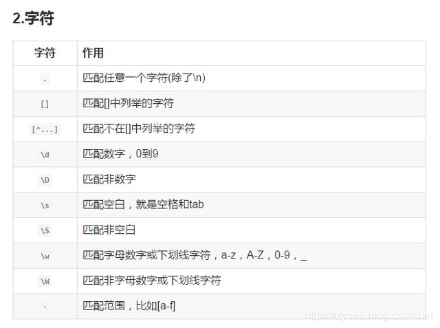

## 正则表达式使用记录

---

### 匹配1-100的数字

**表达式**：` \(\d{1,2}\)|\(100\)` 

**解释**： \d{1,2}表示匹配一个数字一到两次。整段表达式表示匹配1-99或者直接匹配100.

---

### 匹配㊽这种带圆圈的数字

**表达式**： `[\u2460-\u2473\u3251-\u325F\u32B1-\u32BF]`

**解释**： `[\u2460-\u2473]`：匹配 `①` 到 `⑳`（1 到 20）。
`[\u3251-\u325F]`：匹配 `㉑` 到 `㉟`（21 到 35）。
`[\u32B1-\u32BF]`：匹配 `㊱` 到 `㊿`（36 到 50）。

严格意义上的 **圆圈数字** 总共有 **50 个**。

- `①` 到 `⑳`（1 到 20）
- `㉑` 到 `㉟`（21 到 35）
- `㊱` 到 `㊿`（36 到 50）

---

### 替换md文档的一级标题为其它标题

**表达式**：  ^#\s*(.+?、)   替换为  \## $1

**解释**：`^`：表示匹配行的开头。

`#`：匹配一级标题的井号。

`\s*`：匹配井号后可能存在的空格。

`(.+?、)`: `.+` 表示匹配一个或多个任意字符，`.+?` 会在遇到第一个满足条件的字符（<br />**例如** `、`）时停止匹配。()将正则中匹配的内容捕获到一个分组中，以便后续引用。该正则表达式中括号被捕获为第一组（能够被$1引用）。

`$1`:  `$1` 是正则表达式中引用匹配结果的一个标记，它指代**第一个捕获组**（也称为分组，通常用圆括号 `()` 括起来）。在正则表达式中捕获到的内容可以通过 `$1`、`$2` 等依次引用。

### 匹配以 = 结尾的44个字符

**表达式**： [a-zA-Z0-9+/=]{43}=$

**解释**：  `[a-zA-Z0-9+/=]`：匹配a到z、A到Z、0到9、+、/、=中的任意一个字符。

{43}：表示匹配 [a-zA-Z0-9+/=] 这个表达式43次

=&：表示字符串必须=\n结尾，但是在替换时，不会替换\n

### 匹配所有列举出来的字符串

> 问题描述：
>
> 下面列出了一些字符串，将这些字符串全部去除
>
> ▼typescript   ▼javascript   ▼java   ▼json   ▼xml   ▼bash   ▼shell   ▼sql ……

**表达式**： `▼typescript\n*|▼javascript\n*|▼java\n*|▼json\n*|▼xml\n*|▼bash\n*|▼shell\n*|▼sql\n*|▼text\n*|▼vue\n*|▼tsx\n*|▼html\n*|▼css\n*|▼plain\n*|▼yml\n*|▼yaml\n*|▼properties\n*|▼nginx\n*|▼lua\n*`

**解释**：使用 `|` 来匹配表达式中的任意一个字符串
使用* 来匹配\n任意多次（因为 * 匹配前面的子表达式任意次，而\n是一个子表达式，因此* 只会匹配\n 任意次，不会匹配\n 之前的字符。 ？和 + 的使用也是同理 ）

### 替换md文档的代码块为Java代码块

**表达式**：`(```)\n([\s\S]*?```)`替换为 `$1java\n$2`

**解释**：`[\s\S]`匹配所有字符，`*?`表示非贪婪模式，确保匹配到最近的结束标记。

## 正则表达式基本语法

 




PS:

https://www.runoob.com/regexp/regexp-tutial.html

## 正则表达式相关拓展

### 正则表达式分隔符“/”用途

#### 有无分隔符区别

`/\(\d{1,2}\)|\(100\)/`这种带分隔符的正则表达式是在大多数编程语言（如 JavaScript）中的常见写法，分隔符 `/` 表示正则表达式的开始和结束。
`\(\d{1,2}\)|\(100\)`这种裸露的正则表达式（无分隔符），通常用在**正则与其他工具**（如正则生成器、配置文件）结合的场景，或者嵌入到语言的特殊 API 中。

#### 需要分隔符的语言

JavaScript、PHP、Ruby、Perl

**JavaScript**

```js
javascriptCopy codeconst regex = /\d+/; // 匹配一个或多个数字
console.log("123abc".match(regex)); // 输出: ["123"]
```

**PHP**

```php
phpCopy code$regex = "/\d+/"; // 匹配一个或多个数字
preg_match($regex, "123abc", $matches);
print_r($matches); // 输出: ["123"]
```

**Ruby**

```ruby
rubyCopy coderegex = /\d+/ # 匹配一个或多个数字
puts "123abc".match(regex) # 输出: #<MatchData "123">
```

**Perl**

```perl
perlCopy codemy $regex = qr/\d+/; # 匹配一个或多个数字
if ("123abc" =~ $regex) {
    print "Matched\n"; # 输出: Matched
}
```

#### 不需要分隔符的语言

Python、Java、C#、Go

**Python**

```python
pythonCopy codeimp或t re
regex = r"\d+"  # 匹配一个或多个数字
matches = re.findall(regex, "123abc")
print(matches)  # 输出: ['123']
```

**Java**

```java
javaCopy codeimp或t java.util.regex.*;
public class Main {
    public static void main(String[] args) {
        String regex = "\\d+"; // 匹配一个或多个数字
        Pattern pattern = Pattern.compile(regex);
        Matcher matcher = pattern.matcher("123abc");
        if (matcher.find()) {
            System.out.println(matcher.group()); // 输出: 123
        }
    }
}
```

**C#**

```csharp
csharpCopy codeusing System;
using System.Text.RegularExpressions;

class Program {
    static void Main() {
        string regex = @"\d+"; // 匹配一个或多个数字
        Match match = Regex.Match("123abc", regex);
        if (match.Success) {
            Console.WriteLine(match.Value); // 输出: 123
        }
    }
}
```

**Go**

```go
goCopy codepackage main

imp或t (
	"fmt"
	"regexp"
)

func main() {
	regex := `\d+` // 匹配一个或多个数字
	re := regexp.MustCompile(regex)
	matches := re.FindString("123abc")
	fmt.Println(matches) // 输出: 123
}
```


