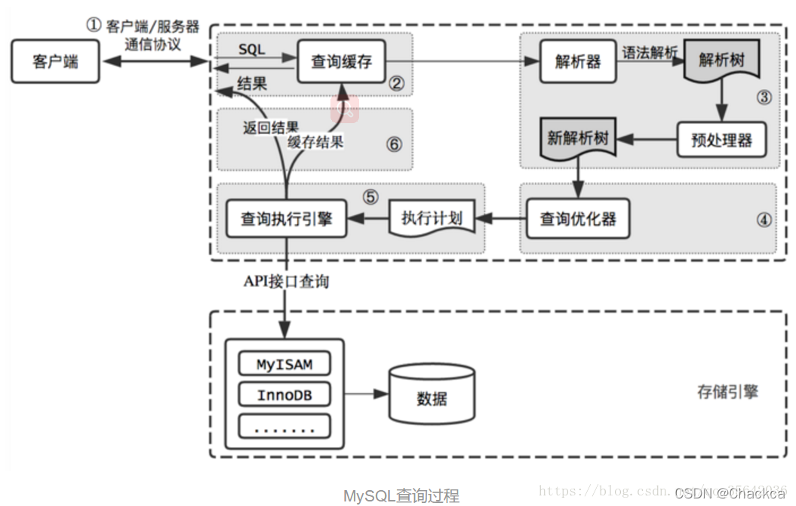
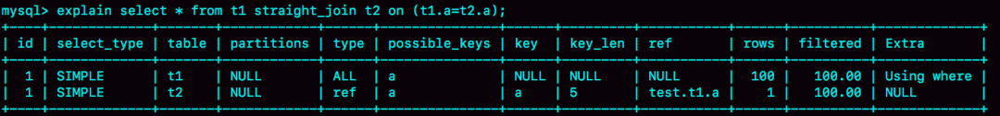
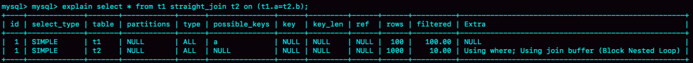
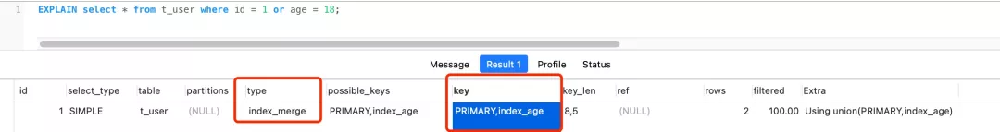
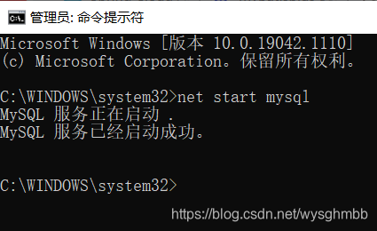
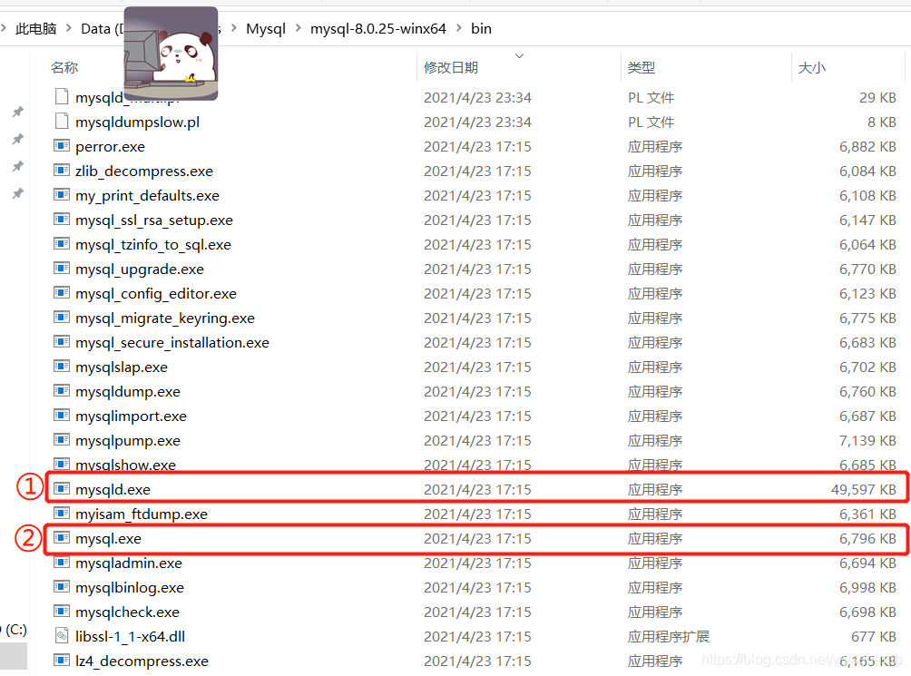
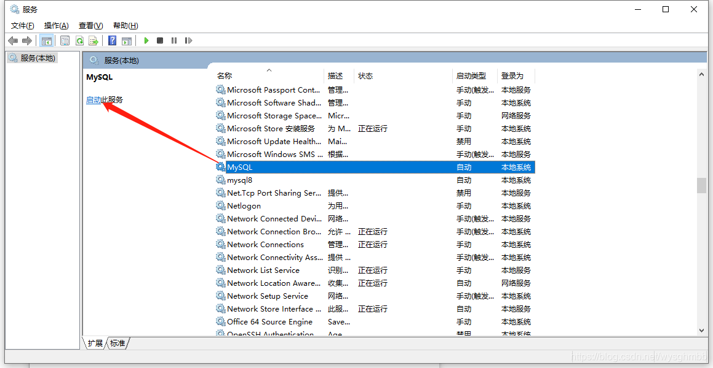

## 如何选择适合的 MySQL Connector/J 版本

###  MySQL Connector/J

MySQL Connector/J 是 MySQL 官方提供的用于 Java 应用程序连接 MySQL 数据库的 JDBC 驱动。它支持 JDBC 4.2 API，并实现了 X DevAPI。

在选择用于生产环境的 MySQL Connector/J 版本时，需要考虑多个因素，以确保与你的项目需求和环境兼容性。本文将从 MySQL 服务器版本、Java 版本、JDBC 版本、TLS 版本、特性支持、生命周期等几个方面来讨论如何选择适合的 MySQL Connector/J 版本。

#### 1. MySQL 服务器版本

如果你的 MySQL 服务器版本为 8.0，甚至已经在用 MySQL 8.3，建议选择 MySQL Connector/J 8.3。

如果你的 MySQL 服务器版本为 5.5，5.6，5.7，或 8.0，可以选择 MySQL Connector/J 5.1，需要注意的是，对于 MySQL 5.7 服务器，需要选择 MySQL Connector/J 5.1.37 及以上版本。

另外，MySQL 5.5,5.6,5.7 已经 EOL，建议升级到 MySQL 8.0 最新小版本，即 MySQL 8.0.35 或 8.0.36。

如果你的 MySQL 服务器版本为更古早的版本，you would better keep it with current setting.

确保所选的驱动版本与你的 MySQL 服务器版本兼容，以避免连接或性能问题。

#### 2. Java 版本

MySQL Connector/J 8.3 支持 JRE/JDK 8 及以上版本。

MySQL Connector/J 5.1 支持 JRE/JDK 5 及以上版本。

如果你的项目用到了 Java，那么应该选择 JDK 8 及以上版本。

#### 3. JDBC API

JDBC（Java Database Connectivity）API 版本也可以作为选择驱动时的考虑因素。

MySQL Connector/J 8.3 支持 JDBC 4.2 API。

MySQL Connector/J 5.1 从 5.1.37 版本开始支持 JDBC 4.2 API。

#### 4. TLS 版本

对于 TLS v1.3，从 MySQL Connector/J 8.0.19 以及 MySQL 8.0.16 开始支持，需要注意的是，从 MySQL 8.0.18 开始，组复制支持 TLS v1.3。

对于 TLS v1.2，从 MySQL Connector/J 5.1.46 以及 MySQL 5.7.28/8.0.4 开始支持。

对于 TLSv1 和 TLSv1.1，从 MySQL Connector/J 8.0.26 开始被废弃，并从 MySQL Connector/J 8.0.28 被移除。

此外，还需注意，TLS 需要 Java 版本支持。如果你需要使用 TLS v1.3，那么需要搭配更高版本的 JDK 8，比如 Oracle Java 8u261。从 Java 11 开始，JDK 默认支持 TLSv1.3。

当然，也需要更新版本的 openssl，比如，当使用 TLS v1.3 时，需要 openssl 1.1.1。

#### 5. 特性支持

MySQL Connector/J 的不同版本提供了不同的特性和支持。例如，MySQL Connector/J 8.x 版本提供了对 MySQL 8.0 新特性的支持，如窗口函数、公共表表达式（CTE）、角色权限等。此外，新版本还包含性能改进、错误修复和安全更新。

#### 6. 生命周期

对于 MySQL Server 而言，由于发版模型发生了变化，MySQL 8.0 已不再追加新特性，目前已经发布了 MySQL 8.1.0，8.2.0 和 8.3.0 三个创新版本（Innovation Release），期待 MySQL 8.4.0 LTS 的到来。

不过，MySQL Connector/J 并不遵循此发版模型，而是继承、延续为 8.x 系列 GA 版本。

MySQL Connector/J 8.1 取代了 8.0 系列，最后一个 8.0 系列的版本为 8.0.33。

### 总结

建议使用最新版本的 MySQL Connector/J，以获得更好的安全性和兼容性。

目前，推荐使用 MySQL Connector/J 8.3.0。

### 附

- Maven 配置为：

```
<dependency>
    <groupId>com.mysql</groupId>
    <artifactId>mysql-connector-j</artifactId>
    <version>8.3.0</version>
</dependency>
```

- Gradle 配置为：

```
implementation group: 'com.mysql', name: 'mysql-connector-j', version: '8.3.0'
```

- 官方下载地址：[https://dev.mysql.com/downloads/connector/j/](https://link.segmentfault.com/?enc=9BHZayEl4aZWe4uQifMaCQ%3D%3D.0SjgtEF7O%2B2MjnINQc5DAZRUDMHc9I%2BTqb2sGcne85Jhf6oPDCt5UjYE%2BpmO%2F9q1)
- 墨天轮下载地址：[https://www.modb.pro/doc/125743](https://link.segmentfault.com/?enc=%2Fk9iwAucr8Dsl64eF8ygfQ%3D%3D.i%2FwyQF%2FSJY%2FmimHOQxUc51hBTzAvxqOztzZkvIv6uUo%3D)

## MySQL运算符

### 1. 算术运算符

MySQL 支持的算术运算符包括:

| 运算符   | 作用 |
| :------- | :--- |
| +        | 加法 |
| -        | 减法 |
| *        | 乘法 |
| / 或 DIV | 除法 |
| % 或 MOD | 取余 |

### 2. 比较运算符

   SELECT 语句中的条件语句经常要使用比较运算符。通过这些比较运算符，可以判断表中的哪些记录是符合条件的。比较结果为真，则返回 1，为假则返回 0，比较结果不确定则返回 NULL。

| 符号            | 描述                       | 备注                                                         |
| :-------------- | :------------------------- | :----------------------------------------------------------- |
| =               | 等于                       |                                                              |
| <>, !=          | 不等于                     |                                                              |
| >               | 大于                       |                                                              |
| <               | 小于                       |                                                              |
| <=              | 小于等于                   |                                                              |
| >=              | 大于等于                   |                                                              |
| BETWEEN         | 在两值之间                 | >=min&&<=max                                                 |
| NOT BETWEEN     | 不在两值之间               |                                                              |
| IN              | 在集合中                   |                                                              |
| NOT IN          | 不在集合中                 |                                                              |
| <=>             | 严格比较两个NULL值是否相等 | 两个操作码均为NULL时，其所得值为1；而当一个操作码为NULL时，其所得值为0 |
| LIKE            | 模糊匹配                   |                                                              |
| REGEXP 或 RLIKE | 正则式匹配                 |                                                              |
| IS NULL         | 为空                       |                                                              |
| IS NOT NULL     | 不为空                     |                                                              |

### 3. 逻辑运算符

逻辑运算符用来判断表达式的真假。如果表达式是真，结果返回 1。如果表达式是假，结果返回 0。

| 运算符号 | 作用     |
| :------- | :------- |
| NOT 或 ! | 逻辑非   |
| AND      | 逻辑与   |
| OR       | 逻辑或   |
| XOR      | 逻辑异或 |

### 4. 位运算符

位运算符是在二进制数上进行计算的运算符。位运算会先将操作数变成二进制数，进行位运算。然后再将计算结果从二进制数变回十进制数。

| 运算符号 | 作用     |
| :------- | :------- |
| &        | 按位与   |
| \|       | 按位或   |
| ^        | 按位异或 |
| !        | 取反     |
| <<       | 左移     |
| >>       | 右移     |

## SQL优化总结

### MySQL内部逻辑图

在开始介绍如何优化sql前，先附上mysql内部逻辑图让大家有所了解。



 

**1）连接器：**主要负责跟客户端建立连接 获取权限 维持和管理连接。

**2）查询缓存：**优先在缓存中进行查询，如果查到了则直接返回，如果缓存中查询不到，再去数据库中查询。

MySQL缓存是默认关闭的，也就是说不推荐使用缓存，并且在MySQL8.0 版本已经将查询缓存的整块功能删掉了。这主要是它的使用场景限制造成的：

- 先说下缓存中数据存储格式：key（sql语句）- value（数据值），所以如果SQL语句（key）只要存在一点不同之处就会直接进行数据库查询了；

- 由于表中的数据不是一成不变的，大多数是经常变化的，而当数据库中的数据变化了，那么相应的与此表相关的缓存数据就需要移除掉。

**3）解析器/分析器：**分析器的工作主要是对要执行的SQL语句进行词法解析 语法解析，最终得到抽象语法树，然后再使用预处理器对抽象语法树进行语义校验，判断抽象语法树中的表是否存在，如果存在的话，再接着判断select投影列字段是否在表中存在等。

**4）优化器：**主要将SQL经过词法解析 语法解析后得到的语法树，通过数据字典和统计信息的内容，再经过一系列运算 ，最终得出一个执行计划，包括选择使用哪个索引。

在分析是否走索引查询时，是通过进行动态数据采样统计分析出来；只要是统计分析出来的，那就可能会存在分析错误的情况，所以在SQL执行不走索引时，也要考虑到这方面的因素。

**5）执行器：**根据一系列的执行计划去调用存储引擎提供的API接口去调用操作数据，完成SQL的执行。

### 一 SQL语句的优化

#### 1 尽量避免使用子查询

例：

```sql
SELECT * FROM t1 WHERE id = (SELECT id FROM t2 WHERE name = 'chackca');
```

子查询在Mysql5.5版本里，内部执行计划是这样：先查外表再匹配内表，而不是先查内表t2。（即：会先扫描`t1`表，然后对于`t1`中的每一行，执行子查询`SELECT id FROM t2 WHERE name = 'chackca'`。）当外表`t1`很大时，这种方式效率会非常低。

在MariaDB10/Mysql5.6版本里，采用join关联方式对其进行了优化，这条SQL语句会自动转换为：

```sql
SELECT t1.* FROM t1 JOIN t2 on t1.id = t2.id WHERE name = 'chackca'
```

但请注意的是：优化只针对SELECT有效，对UPDATE/DELETE子查询无效，故生产环境应避免使用子查询

由于MySQL的优化器对于子查询的处理能力比较弱，所以不建议使用子查询，可以改写成Inner Join，之所以 join 连接效率更高，是因为 MySQL不需要在内存中创建临时表

#### 2 用IN来替换OR

- **低效查询**

```sql
SELECT * FROM t WHERE id = 10 OR id = 20 OR id = 30;
```

- **高效查询**

```sql
SELECT * FROM t WHERE id IN (10,20,30);
```

另外，MySQL对于IN做了相应的优化，即将IN中的常量全部存储在一个数组里面，而且这个数组是排好序的。但是如果数值较多，产生的消耗也是比较大的。再例如：

```sql
select id from table_name where num in(1,2,3)
```

对于连续的数值，能用 between 就不要用 in 了；再或者使用连接来替换。

#### 3 读取适当的记录LIMIT M,N，而不要读多余的记录

```sql
select id,name from t limit 866613, 20
```

使用上述sql语句做分页的时候，可能有人会发现，随着表数据量的增加，直接使用limit分页查询会越来越慢。

对于 limit m, n 的分页查询，越往后面翻页（即m越大的情况下）SQL的耗时会越来越长，对于这种应该先取出主键id，然后通过主键id跟原表进行Join关联查询。因为MySQL 并不是跳过 offset 行，而是取 offset+N 行，然后放弃前 offset 行，返回 N 行，那当 offset 特别大的时候，效率就非常地低下，要么控制返回的总页数，要么对超过特定阈值的页数进行 SQL 改写。

优化的方法如下：可以取前一页的最大行数的id（将上次遍历到的最末尾的数据ID传给数据库，然后直接定位到该ID处，再往后面遍历数据），然后根据这个最大的id来限制下一页的起点。比如此列中，上一页最大的id是866612。sql可以采用如下的写法：

```sql
select id,name from table_name where id> 866612 limit 20	
```

#### 4 禁止不必要的Order By排序

如果我们对结果没有排序的要求，就尽量少用排序；

如果排序字段没有用到索引，也尽量少用排序；

另外，分组统计查询时可以禁止其默认排序

```sql
SELECT goods_id,count(*) FROM t GROUP BY goods_id;
```

默认情况下，Mysql会对所有的GROUP BY col1,col2…的字段进行排序，也就是说上述会对 goods_id进行排序，如果想要避免排序结果的消耗，可以指定ORDER BY NULL禁止排序：

```sql
SELECT goods_id,count(*) FROM t GROUP BY goods_id ORDER BY NULL
```

#### 5 总和查询可以禁止排重用union all

- **`UNION`**：用于合并两个或多个结果集，并在合并后自动去除重复的行。这种操作会涉及到排序和唯一性检查，这会消耗更多的CPU资源并增加查询的延迟。
- **`UNION ALL`**：同样用于合并两个或多个结果集，但不会去除重复的行。因此，它不需要进行排序和唯一性检查，因而消耗的CPU资源更少，速度更快。
- **使用 `UNION`**：当你不确定结果集中是否会有重复数据，或者你确实需要去除重复的数据时，使用 `UNION` 是合适的。
- **使用 `UNION ALL`**：当你确定结果集中不会有重复数据，或者即使有重复数据也无关紧要时，使用 `UNION ALL` 可以提高查询速度，因为它省去了去重和排序的步骤。

#### 6 避免随机取记录

```sql
SELECT * FROM t1 WHERE 1 = 1 ORDER BY RAND() LIMIT 4;        
SELECT * FROM t1 WHERE id >= CEIL(RAND()*1000) LIMIT 4;
```

以上两个语句都无法用到索引

#### 7 将多次插入换成批量Insert插入

```sql
INSERT INTO t(id, name) VALUES(1, 'aaa');       
INSERT INTO t(id, name) VALUES(2, 'bbb');        
INSERT INTO t(id, name) VALUES(3, 'ccc');       
—> INSERT INTO t(id, name) VALUES(1, 'aaa'),(2, 'bbb'),(3, 'ccc');
```

#### 8 只返回必要的列，用具体的字段列表代替 select \* 语句

SELECT * 会增加很多不必要的消耗（cpu io 内存 网络带宽）；增加了使用覆盖索引的可能性；当表结构发生改变时，前者也需要经常更新。所以要求直接在select后面接上字段名。

MySQL数据库是按照行的方式存储，而数据存取操作都是以一个页大小进行IO操作的，每个IO单元中存储了多行，每行都是存储了该行的所有字段。所以无论取一个字段还是多个字段，实际上数据库在表中需要访问的数据量其实是一样的。

但是如果查询的字段都在索引中，也就是覆盖索引，那么可以直接从索引中获取对应的内容直接返回，不需要进行回表，减少IO操作。除此之外，当存在 order by 操作的时候，select 子句中的字段多少会在很大程度上影响到我们的排序效率。

#### 9 区分in和exists

 ```sql 
select * from 表A where id in (select id from 表B)
 ```

上面的语句相当于：

```sql
select * from 表A where exists(select * from 表B where 表B.id=表A.id)
```

区分in和exists主要是造成了驱动顺序的改变（这是性能变化的关键），如果是exists，那么以外层表为驱动表，先被访问，如果是IN，那么先执行子查询。所以IN适合于外表大而内表小的情况；EXISTS适合于外表小而内表大的情况。

另外，in查询在某些情况下有可能会查询返回错误的结果，因此，通常是建议在确定且有限的集合时，可以使用in。如 IN （0，1，2）。

#### 10 优化Group By语句

如果对group by语句的结果没有排序要求，要在语句后面加 order by null（group 默认会排序）；

尽量让group by过程用上表的索引，确认方法是explain结果里没有Using temporary 和 Using filesort；

如果group by需要统计的数据量不大，尽量只使用内存临时表；也可以通过适当调大tmp_table_size参数，来避免用到磁盘临时表

- 如果数据量实在太大，使用SQL_BIG_RESULT这个提示，来告诉优化器直接使用排序算法（直接用磁盘临时表）得到group by的结果。

使用where子句替换Having子句：避免使用having子句，having只会在检索出所有记录之后才会对结果集进行过滤，这个处理需要排序分组，如果能通过where子句提前过滤查询的数目，就可以减少这方面的开销。

- **低效**

```sql
SELECT JOB, AVG(SAL) FROM EMP GROUP by JOB HAVING JOB = ‘PRESIDENT’ OR JOB = ‘MANAGER’
```

- **高效**

```sql
SELECT JOB, AVG(SAL) FROM EMP WHERE JOB = ‘PRESIDENT’ OR JOB = ‘MANAGER’ GROUP by JOB
```

#### 11 尽量使用数字型字段

若只含数值信息的字段尽量不要设计为字符型，这会降低查询和连接的性能。引擎在处理查询和连接时会逐个比较字符串中每一个字符，而对于数字型而言只需要比较一次就够了。

#### 12 优化Join语句

当我们执行两个表的Join的时候，就会有一个比较的过程，逐条比较两个表的语句是比较慢的，因此可以把两个表中数据依次读进一个内存块中，在Mysql中执行：

```sql
show variables like ‘join_buffer_size’
```

可以看到join在内存中的缓存池大小，其大小将会影响join语句的性能。在执行join的时候，数据库会选择一个表把他要返回以及需要进行和其他表进行比较的数据放进join_buffer。

什么是驱动表，什么是被驱动表，这两个概念在查询中有时容易让人搞混，有下面几种情况，大家需要了解。

**1）当连接查询没有where条件时**

- left join 前面的表是驱动表，后面的表是被驱动表
- right join 后面的表是驱动表，前面的表是被驱动表
- inner join / join 会自动选择表数据比较少的作为驱动表
- straight_join(≈join) 直接选择左边的表作为驱动表（语义上与join类似，但去除了join自动选择小表作为驱动表的特性）

**2）当连接查询有where条件时，带where条件的表是驱动表，否则是被驱动表**

假设有表如右边：t1与t2表完全一样，a字段有索引，b无索引，t1有100条数据，t2有1000条数据

若被驱动表有索引，那么其执行算法为：Index Nested-Loop Join（NLJ），示例如下：

①执行语句：select * from t1 straight_join t2 on (t1.a=t2.a)；由于被驱动表t2.a是有索引的，其执行逻辑如下：

- 从表t1中读入一行数据 R
- 从数据行R中，取出a字段到表t2里去查找
- 取出表t2中满足条件的行，跟R组成一行，作为结果集的一部分
- 重复执行步骤1到3，直到表t1的末尾循环结束
- 如果一条join语句的Extra字段什么都没写的话，就表示使用的是NLJ算法



若被驱动表无索引，那么其执行算法为：Block Nested-Loop Join（BLJ）（Block 块，每次都会取一块数据到内存以减少I/O的开销），示例如下：

②执行语句：select * from t1 straight_join t2 on (t1.a=t2.b)；由于被驱动表t2.b是没有索引的，其执行逻辑如下：

- 把驱动表t1的数据读入线程内存join_buffer（无序数组）中，由于我们这个语句中写的是select *，因此是把整个表t1放入了内存；
- 顺序遍历表t2，把表t2中的每一行取出来，跟join_buffer中的数据做对比，满足join条件的，作为结果集的一部分返回。



③另外还一种算法为Simple Nested-Loop Join（SLJ），其逻辑为：顺序取出驱动表中的每一行数据，到被驱动表去做全表扫描匹配，匹配成功则作为结果集的一部分返回。

另外，Innodb会为每个数据表分配一个存储在磁盘的 表名.ibd 文件，若关联的表过多，将会导致查询的时候磁盘的磁头移动次数过多，从而影响性能

所以实践中，尽可能减少Join语句中的NestedLoop的循环次数：“永远用小结果集驱动大的结果集”

- 用小结果集驱动大结果集，将筛选结果小的表（在决定哪个表做驱动表的时候，应该是两个表按照各自的条件过滤，过滤完成之后，计算参与join的各个字段的总数据量，数据量小的那个表，就是“小表”）首先连接，再去连接结果集比较大的表，尽量减少join语句中的Nested Loop的循环总次数

- 优先优化Nested Loop的内层循环（也就是最外层的Join连接），因为内层循环是循环中执行次数最多的，每次循环提升很小的性能都能在整个循环中提升很大的性能；

- 对被驱动表的join字段上建立索引；

- 当被驱动表的join字段上无法建立索引的时候，设置足够的Join Buffer Size。

- 尽量用inner join(因为其会自动选择小表去驱动大表).避免 LEFT JOIN (一般我们使用Left Join的场景是大表驱动小表)和NULL，那么如何优化Left Join呢？

- 条件中尽量能够过滤一些行将驱动表变得小一点，用小表去驱动大表

- 右表的条件列一定要加上索引（主键 唯一索引 前缀索引等），最好能够使type达到range及以上（ref,eq_ref,const,system）

- 适当地在表里面添加冗余信息来减少join的次数

- 使用更快的固态硬盘

性能优化，left join 是由左边决定的，左边一定都有，所以右边是我们的关键点，建立索引要建在右边。当然如果索引是在左边的，我们可以考虑使用右连接，如下：

```sql
select * from atable left join btable on atable.aid=btable.bid;        -- 最好在bid上建索引
```

Tips：Join左连接在右边建立索引；组合索引则尽量将数据量大的放在左边，在左边建立索引。

### 二 索引的优化/如何避免索引失效

#### 1 最佳左前缀法则

如果索引了多列，要遵守最左前缀法则，指的是查询从索引的最左前列开始并且不跳过索引中的列。Mysql查询优化器会对查询的字段进行改进，判断查询的字段以哪种形式组合能使得查询更快，所有比如创建的是(a,b)索引，查询的是(b,a)，查询优化器会修改成(a,b)后使用索引查询。

#### 2 不在索引列上做任何操作

**1）计算：**对索引进行表达式计算会导致索引失效，如 where id + 1 = 10，可以转换成 where id = 10 -1，这样就可以走索引

**2）函数：**select * from t_user where length(name)=6; 此语句对字段使用到了函数，会导致索引失效

从 MySQL 8.0 开始，索引特性增加了函数索引，即可以针对函数计算后的值建立一个索引，也就是说该索引的值是函数计算后的值，所以就可以通过扫描索引来查询数据。

```sql
alter table t_user add key idx_name_length ((length(name)));
```

（自动/手动）类型转换

- （字符串类型必须带''引号才能使索引生效）字段是varchar，用整型进行查询时，无法走索引，如select * from user where phone = 13030303030；

Mysql 在执行上述语句时，会把字段转换为数字再进行比较，所以上面那条语句就相当于：select * from user where CAST(phone AS signed int) = 13030303030; CAST 函数是作用在了 phone 字段，而 phone 字段是索引，也就是对索引使用了函数！所以索引失效

- 字段是int，用string进行查询时，mysql会自动转化，可以走索引，如：select * from user where id = '1'；

MySQL 在遇到字符串和数字比较的时候，会自动把字符串转为数字，然后再进行比较。以上这条语句相当于：select * from user where id = CAST(“1” AS signed int)，索引字段并没有用任何函数，CAST 函数是用在了输入参数，因此是可以走索引扫描的。

#### 3）存储引擎不能使用索引中范围条件右边的列。

如这样的sql: select * from user where username='123' and age>20 and phone='1390012345',其中username, age, phone都有索引，只有username和age会生效，phone的索引没有用到。

#### 4）尽量使用覆盖索引（只访问索引的查询（索引列和查询列一致））

如select age from user，减少select *

#### 5）mysql在使用负向查询条件(!= <> not in not exists not like)的时候无法使用索引会导致全表扫描。

你可以想象一下，对于一棵B+树，根节点是40，如果你的条件是等于20，就去左面查，你的条件等于50，就去右面查，但是你的条件是不等于66，索引应该咋办？还不是遍历一遍才知道。

#### 6）is null, is not null 也无法使用索引

在实际中尽量不要使用null（避免在 where 子句中对字段进行 null 值判断） 不过在mysql的高版本已经做了优化，允许使用索引

对于null的判断会导致引擎放弃使用索引而进行全表扫描。

#### 7）like 以通配符开头(%abc..)时，mysql索引失效会变成全表扫描的操作。

所以最好用右边like ‘abc%’。如果两边都要用，可以用select username from user where username like '%abc%'，其中username是必须是索引列，才可让索引生效（但是不能充分利用索引，因为它需要匹配任意位置的模式，通常会导致全表扫描。）

假如index(a,b,c), where a=3 and b like ‘abc%’ and c=4，a能用，b能用，c不能用，类似于不能使用范围条件右边的列的索引

对于一棵B+树索引来讲，如果根节点是字符def，假如查询条件的通配符在后面，例如abc%，则其知道应该搜索左子树，假如传入为efg%，则应该搜索右子树，如果通配符在前面%abc，则数据库不知道应该走哪一面，就都扫描一遍了。

#### 8）少用or

在 WHERE 子句中，如果在 OR 前的条件列是索引列，而在 OR 后的条件列不是索引列，那么索引会失效。

```sql
select * from t_user where id = 1 or age = 18;        -- id有索引，name没有，此时没法走索引
```

因为 OR 的含义就是两个只要满足一个即可，因此只有一个条件列是索引列是没有意义的，只要有条件列不是索引列，就会进行全表扫描。

必须要or前后的字段都有索引，查询才能使用上索引（分别使用，最后合并结果type = index_merge）



#### 9）在组合/联合索引中，将有区分度的索引放在前面

如果没有区分度，例如用性别，相当于把整个大表分成两部分，查找数据还是需要遍历半个表才能找到，使得索引失去了意义。

#### 10）使用前缀索引

短索引不仅可以提高查询性能而且可以节省磁盘空间和I/O操作，减少索引文件的维护开销，但缺点是不能用于 ORDER BY 和 GROUP BY 操作，也不能用于覆盖索引。

比如有一个varchar(255)的列，如果该列在前10个或20个字符内，可以做到既使前缀索引的区分度接近全列索引，那么就不要对整个列进行索引。为了减少key_len，可以考虑创建前缀索引，即指定一个前缀长度，可以使用count(distinct leftIndex(列名, 索引长度))/count(*) 来计算前缀索引的区分度。

#### 11）SQL 性能优化 explain 中的 type**：

至少要达到 range 级别，要求是 ref 级别，如果可以是 consts 最好。

- consts：单表中最多只有一个匹配行（主键或者唯一索引），在优化阶段即可读取到数据。
- ref：使用普通的索引
- range：对索引进行范围检索
  当 type=index 时，索引物理文件全扫，速度非常慢。

### 三 创建索引的规则

将有区分度的字段作为索引
经常用哪个字段来查询，就用哪个字段作为索引

## 启动MySQL的几种方式

#### 方法一：

打开一个cmd窗口（用管理员身份运行 Ctrl + Shift + Enter），执行**net start mysql**即可启动



停止服务的命令是**net stop mysql**

#### 方法二：

找到mysql服务端的安装目录，进入bin文件夹：



先双击mysqld.exe，可以见到一个黑窗口嗖地闪过；

然后双击mysql.exe，会提示服务开启成功。

#### 方法三：

打开电脑的“服务”，不知道位置的直接在左下角搜索即可，找到MYSQL，点击左侧“启动”按钮或者右键点击“启动”按钮即可打开mysql服务：



当然，停止mysql服务的方式也类似这三种方法，把start换成stop，把启动按钮换成“停止”按钮即可。