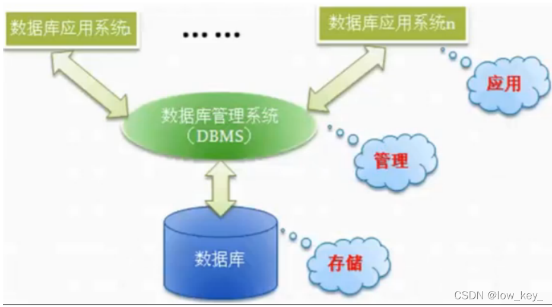
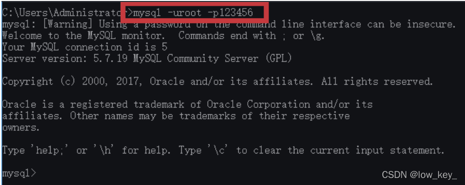
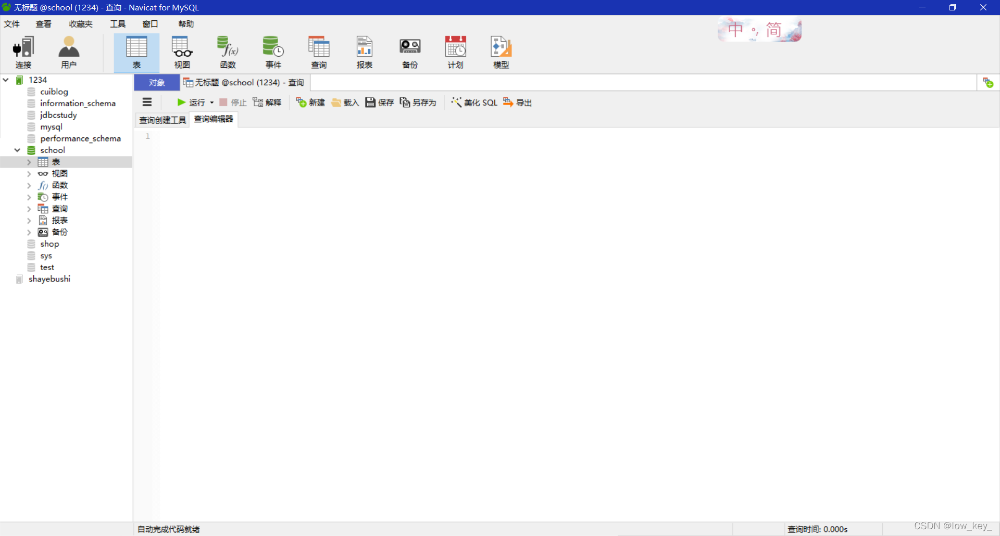
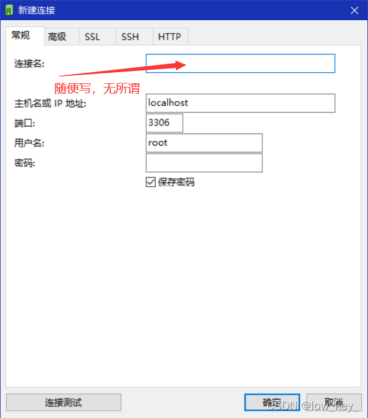

## 初识mysql

只会写代码的是码农；学好数据库，基本能混口饭吃；在此基础上再学好操作系统和计算机网络，就能当一个不错的程序员。如果能再把离散数学、数字电路、体系结构、数据结构/算法、编译原理
学通透，再加上丰富的实践经验与领域特定知识，就能算是一个优秀的工程师了 。

### 1.1为什么学数据库

1、岗位技能需求
2、现在的世界，得数据者得天下
3、存储数据的方法
4、程序网站中，大量数据如何长久保存
5、数据库几乎是软件体系中最核心的一个存在。

### 1.2什么是数据库

数据库（Datebase，简称DB）
**概念**：长期存放在计算机内，有组织，可共享的大量数据的集合，是一个数据“仓库”

**作用**：保存，并能安全管理数据（如：增删改查等），减少冗余。。。

**数据库总览**：

- 关系数据库（SQL）
  - MYSQL,Orcle,SQL Server, SQLLite,DB2,…
  - 关系型数据库通过外键关联来建立表与表之间的关系
- 非关系型数据库（NOSQL）
  - Redis， MongoDB，。。。
  - 非关系型数据库通常指数据以对象的形式存储在数据库中， 而对象之间的关系通过每个对象自身的属性来决定

### 1.3什么是DBMS

** 数据库管理系统*（database Management System）
数据库管理软件， 科学组织和存储数据， 高效地获取和维护数据*

我们要学习的mysql算是一个数据库管理系统

### 1.4Mysql简介

**概念**：是现在流行的开源的，免费的关系型数据库
**历史**：由瑞典MySQL AB 公司开发，目前属于 Oracle 旗下产品。
**特点** :

- 免费 , 开源数据库
- 小巧 , 功能齐全
- 使用便捷
- 可运行于Windows或Linux操作系统
- 可适用于中小型甚至大型网站应用
  官网链接: https://www.mysql.com/

### 1.5 安装Mysql

> 1.软件下载

mysql5.7 64位下载地址:
https://dev.mysql.com/get/Downloads/MySQL-5.7/mysql-5.7.19-winx64.zip
电脑是64位的就下载使用64位版本的!

> 2.步骤

1、下载后得到zip压缩包.
2、解压到自己想要安装到的目录，本人解压到的是D:\Environment\mysql-5.7.19
3、添加环境变量：我的电脑->属性->高级->环境变量

> 选择PATH,在其后面添加: 你的mysql 安装文件下面的bin文件夹

4、编辑 my.ini 文件 ,注意替换路径位置

> [mysqld]
> basedir=D:\Program Files\mysql-5.7
> datadir=D:\Program Files\mysql-5.7\data\
> port=3306 skip-grant-tables

5、启动管理员模式下的CMD，并将路径切换至mysql下的bin目录，然后输入mysqld –install (安装
mysql)
6、再输入 mysqld --initialize-insecure --user=mysql 初始化数据文件
7、然后再次启动mysql 然后用命令 mysql –u root –p 进入mysql管理界面（密码可为空）
8、进入界面后更改root密码

> update mysql.user set authentication_string=password(‘123456’) where user=‘root’ and Host = ‘localhost’;

9.刷新权限

> flush privileges;

10、修改 my.ini文件删除最后一句skip-grant-tables
11、重启mysql即可正常使用

```sql
net stop mysql 
net start mysql
```

12、连接上测试出现以下结果就安装好了


一步步去做 , 理论上是没有任何问题的 .
如果您以前装过,现在需要重装,一定要将环境清理干净 .
好了,到这里大家都装好了,因为刚接触,所以我们先不学习命令.
这里给大家推荐一个工具 : SQLyog .
即便有了可视化工具,可是基本的DOS命名大家还是要记住!

**不推荐SQLyog，狗都不用，看起来就不好用，还是Navicat好用**
软件自己找/狗头

连接数据库


