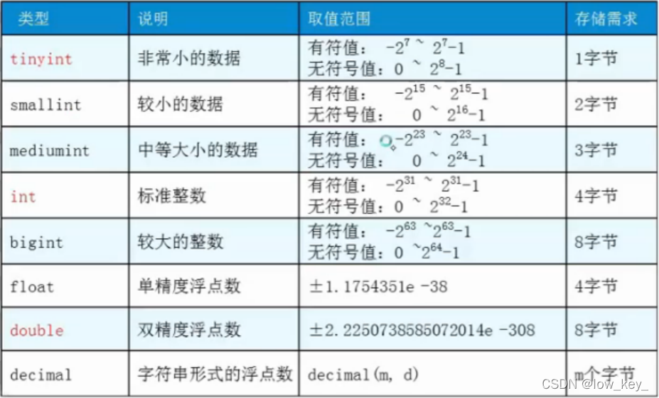
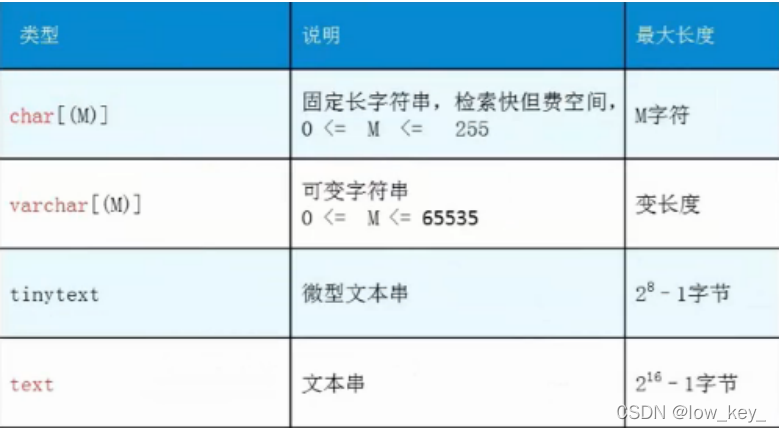
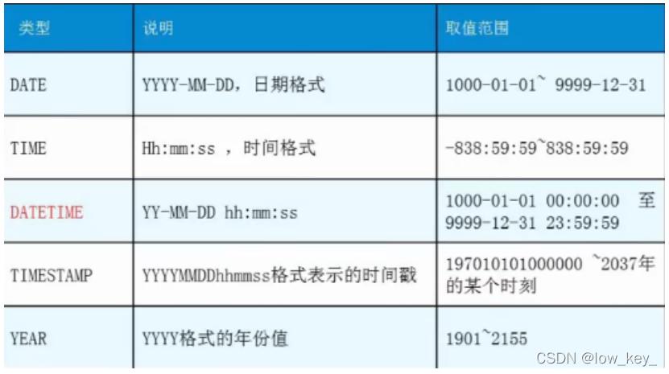

## 操作数据库

### 2.1结构化查询语句分类

| 名称                 | 解释                                         | 命令                     |
| -------------------- | -------------------------------------------- | ------------------------ |
| DDL （数据定义语言） | 定义和管理数据对象，如数据库，数据表等       | CREATE、DROP、ALTER      |
| DML （数据操作语言） | 用于操作数据库对象中所包含的数据             | INSERT、UPDATE、DELETE   |
| DQL （数据查询语言） | 用于查询数据库数据                           | SELECT                   |
| DCL （数据控制语言） | 用于管理数据库的语言，包括管理权限及数据更改 | GRANT、commit、 rollback |

### 2.2 数据库操作

> 命令行操作数据库

创建数据库 : create database [if not exists] 数据库名;
删除数据库 : drop database [if exists] 数据库名;
查看数据库 : show databases;
使用数据库 : use 数据库名;

### 2.3 创建数据表

属于DDL的一种，语法 :

```sql
create table [if not exists] `表名`( 
	'字段名1' 列类型 [属性][索引][注释], 
	'字段名2' 列类型 [属性][索引][注释], #... 
	'字段名n' 列类型 [属性][索引][注释] 
)[表类型][表字符集][注释];
```

**说明**: 反引号用于区别MySQL保留字与普通字符而引入的 (键盘esc下面的键)

### 2.4数据值和列类型

列类型 : 规定数据库中该列存放的数据类型

> 数值类型
> 
> 字符串类型



> 日期和时间型数值类型



> NULL值

- 理解为 “没有值” 或 “未知值”
- 不要用NULL进行算术运算 , 结果仍为NULL

### 2.5数据字段属性

**UnSigned**

- 无符号的
- 声明该数据列不允许负数 .

**ZEROFILL**

- 0填充的
- 不足位数的用0来填充 , 如int(3),5则为005

**Auto_InCrement**

- 自动增长的 , 每添加一条数据 , 自动在上一个记录数上加 1(默认)
- 通常用于设置主键 , 且为整数类型
- 可定义起始值和步长
  - 当前表设置步长(AUTO_INCREMENT=100) : 只影响当前表
  - SET @@auto_increment_increment=5 ; 影响所有使用自增的表(全局)

** NULL 和 NOT NULL**

- 默认为NULL , 即没有插入该列的数值
- 如果设置为NOT NULL , 则该列必须有值

**DEFAULT**

- 默认的
- 用于设置默认值
- 例如,性别字段,默认为"男" , 否则为 “女” ; 若无指定该列的值 , 则默认值为"男"的值

```sql
-- 目标 : 创建一个school数据库 
-- 创建学生表(列,字段) 
-- 学号int 登录密码varchar(20) 姓名,性别varchar(2),出生日期(datatime),家庭住 址,email 
-- 创建表之前 , 一定要先选择数据库 
CREATE TABLE IF NOT EXISTS `student` ( 
	`id` int(4) NOT NULL AUTO_INCREMENT COMMENT '学号', 
	`name` varchar(30) NOT NULL DEFAULT '匿名' COMMENT '姓名', 
	`pwd` varchar(20) NOT NULL DEFAULT '123456' COMMENT '密码', 
	`sex` varchar(2) NOT NULL DEFAULT '男' COMMENT '性别', 
	`birthday` datetime DEFAULT NULL COMMENT '生日', 
	`address` varchar(100) DEFAULT NULL COMMENT '地址', 
	`email` varchar(50) DEFAULT NULL COMMENT '邮箱', 
	PRIMARY KEY (`id`) 
	) ENGINE=InnoDB DEFAULT CHARSET=utf8 

-- 查看数据库的定义 SHOW CREATE DATABASE school; 
-- 查看数据表的定义 SHOW CREATE TABLE student; 
-- 显示表结构 
DESC student; 
-- 设置严格检查模式(不能容错了)
SET sql_mode='STRICT_TRANS_TABLES';
```

### 2.6数据表的类型

> 设置数据表的类型

```sql
CREATE TABLE 表名(
 -- 省略一些代码 
 -- Mysql注释 
 -- 1. # 单行注释 
 -- 2. /*...*/ 多行注释 
 )ENGINE = MyISAM (or InnoDB) 
 -- 查看mysql所支持的引擎类型 (表类型) 
 SHOW ENGINES;
```

MySQL的数据表的类型 : MyISAM , InnoDB , HEAP , BOB , CSV等…
常见的 MyISAM 与 InnoDB 类型：

| 名称       | MyISAM | InnoDB       |
| ---------- | ------ | ------------ |
| 事务处理   | 不支持 | 支持         |
| 数据行锁定 | 支持   | 不支持       |
| 外键约束   | 不支持 | 支持         |
| 全文索引   | 支持   | 不支持       |
| 表空间大小 | 较小   | 较大，约二倍 |

经验 ( 适用场合 ) :

- 适用 MyISAM : 节约空间及相应速度
- 适用 InnoDB : 安全性 , 事务处理及多用户操作数据表

> 数据表的存储位置

- MySQL数据表以文件方式存放在磁盘中
  - 包括表文件 , 数据文件 , 以及数据库的选项文件
  - 位置 : Mysql安装目录\data\下存放数据表 . 目录名对应数据库名 , 该目录下文件名对应数据表
- 注意：
  - InnoDB类型数据表只有一个 *.frm文件 , 以及上一级目录的ibdata1文件
  - MyISAM类型数据表对应三个文件 :
    - . frm – 表结构定义文件
    - . MYD – 数据文件 ( data )
    - . MYI – 索引文件 ( index )

> 设置数据表字符集

我们可为数据库,数据表,数据列设定不同的字符集，设定方法 :

- 创建时通过命令来设置 , 如 : CREATE TABLE 表名()CHARSET = utf8;
- 如无设定 , 则根据MySQL数据库配置文件 my.ini 中的参数设定

### 2.7修改数据库

> 修改表名

修改表名 : ALTER TABLE 旧表名 RENAME AS 新表名
添加字段 : ALTER TABLE 表名 ADD字段名 列属性[属性]
修改字段 :

- ALTER TABLE 表名 MODIFY 字段名 列类型[属性]
- ALTER TABLE 表名 CHANGE 旧字段名 新字段名 列属性[属性]
  删除字段 : ALTER TABLE 表名 DROP 字段名

> 删除数据表

语法： DROP TABLE [IF EXISTS] 表名

- IF EXISTS 为可选 , 判断是否存在该数据表
- 如删除不存在的数据表会抛出错误

> 其他

```sql
1. 可用反引号（`）为标识符（库名、表名、字段名、索引、别名）包裹，以避免与关键字重名！
 中文 也可以作为标识符！
2. 每个库目录存在一个保存当前数据库的选项文件db.opt。
3. 注释：
	 单行注释 # 注释内容 
	多行注释 /* 注释内容 */ 
	单行注释 -- 注释内容 (标准SQL注释风格，要求双破折号后加一空格符（空格、TAB、 换行等）) 
4. 模式通配符：
	  _ 任意单个字符
	% 任意多个字符，甚至包括零字符 
	单引号需要进行转义 \' 
5. CMD命令行内的语句结束符可以为 ";", "\G", "\g"，仅影响显示结果。其他地方还是用分号结 束。
delimiter 可修改当前对话的语句结束符。 
6. SQL对大小写不敏感 （关键字） 
7.清除已有语句：\c
```

