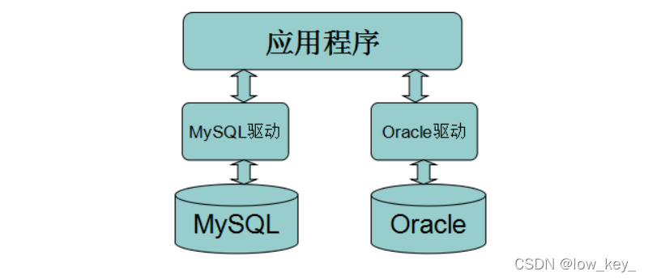
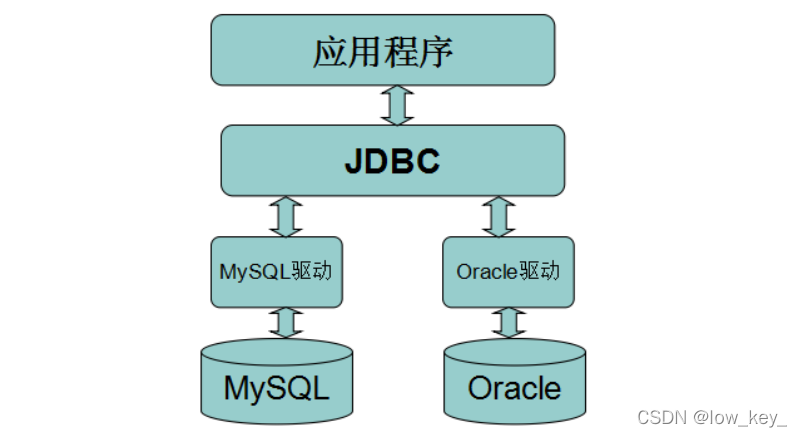
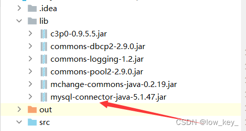
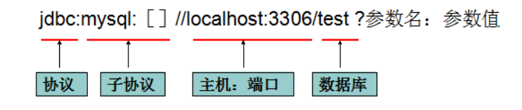
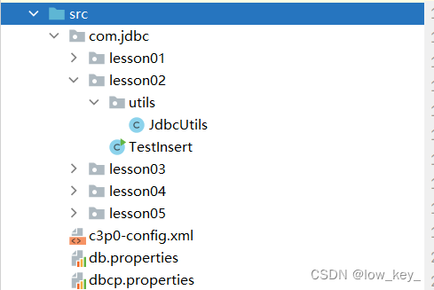

## JDBC

### 10.1 数据库驱动

这里的驱动的概念和平时听到的那种驱动的概念是一样的，比如平时购买的声卡，网卡直接插到计算机上面是不能用的，必须要安装相应的驱动程序之后才能够使用声卡和网卡，同样道理，我们安装好数据库之后，我们的应用程序也是不能直接使用数据库的，必须要通过相应的数据库驱动程序，通过驱动程序去和数据库打交道，如下所示：



### 10.2 JDBC介绍

SUN公司为了简化、统一对数据库的操作，定义了一套Java操作数据库的规范（接口），称之为JDBC。
这套接口由数据库厂商去实现，这样，开发人员只需要学习jdbc接口，并通过jdbc加载具体的驱动，就
可以操作数据库。
如下图所示：

JDBC全称为：Java Data Base Connectivity（java数据库连接），它主要由接口组成。
组成JDBC的２个包：java.sql、javax.sql
开发JDBC应用需要以上2个包的支持外，还需要导入相应JDBC的数据库实现(即数据库驱动，换句话说，就是 mysql-connector-j 这个Maven包中的 com.mysql.cj.jdbc.Driver 这个驱动类)。

### 10.3 编写JDBC程序

> 搭建实验环境

```sql
CREATE DATABASE jdbcStudy CHARACTER SET utf8 COLLATE utf8_general_ci; 
USE jdbcStudy; 
CREATE TABLE users( 
	id INT PRIMARY KEY, 
	NAME VARCHAR(40), 
	PASSWORD VARCHAR(40), 
	email VARCHAR(60), 
	birthday DATE );
INSERT INTO users(id,NAME,PASSWORD,email,birthday) 
VALUES(1,'zhansan','123456','zs@sina.com','1980-12-04'), 
(2,'lisi','123456','lisi@sina.com','1981-12-04'), 
(3,'wangwu','123456','wangwu@sina.com','1979-12-04');
```

> 新建一个Java工程，并导入数据驱动
> 
> 编写程序从user表中读取数据，并打印在命令行窗口中

```java
package com.jdbc.lesson01;

import java.sql.*;

public class jdbcFirstDemo {
    public static void main(String[] args) throws ClassNotFoundException,SQLException {
        // 1.加载驱动
        Class.forName("com.mysql.jdbc.Driver"); // 固定写法，加载驱动
        //DriverManager.registerDriver(new com.mysql.jdbc.Driver());

        // 2.用户信息和url
        String url = "jdbc:mysql://localhost:3306/jdbcstudy?useUnicode=true&characterEncoding=utf8&useSSL=false";
        String username="root";
        String password="root";

        // 3.连接成功，数据库对象
        Connection connection =DriverManager.getConnection(url,username,password);

        // 4.执行sql的对象
        Statement statement= connection.createStatement();
//        statement.executeQuery(); // 查询操作返回resultset
//        statement.execute();       // 执行任何sql
//        statement.executeUpdate();  // 更新，插入，删除，都是用这个，返回一个受影响1行数
        // 5.执行sql的对象，去执行sql可能存在结果，查看返回结果
        String sql = "SELECT * FROM users";
        ResultSet resultSet= statement.executeQuery(sql); //返回的结果集，结果集中封装了我们全部查询出来的结果

        while(resultSet.next()){
            System.out.println("id="+ resultSet.getObject("id"));
            System.out.println("name="+ resultSet.getObject("name"));
            System.out.println("password="+ resultSet.getObject("password"));
            System.out.println("email="+ resultSet.getObject("email"));
            System.out.println("birthday="+ resultSet.getObject("birthday"));
        }
        // 6. 释放连接
        resultSet.close();
        statement.close();
        connection.close();
    }
}
```

### 10.4 对象说明

> DriverManager类讲解

Jdbc程序中的DriverManager用于加载驱动，并创建与数据库的链接，这个API的常用方法：

```java
DriverManager.registerDriver(new Driver()) 
DriverManager.getConnection(url, user, password) 
```

注意：在实际开发中并不推荐采用registerDriver方法注册驱动。原因有二：

1. 查看Driver的源代码可以看到，如果采用此种方式，会导致驱动程序注册两次，也就是在内存中会有两个Driver对象。
2. 程序依赖mysql的api，脱离mysql的jar包，程序将无法编译，将来程序切换底层数据库将会非常麻烦。
   推荐方式：Class.forName(“com.mysql.jdbc.Driver”);
   采用此种方式不会导致驱动对象在内存中重复出现，并且采用此种方式，程序仅仅只需要一个字符串，不需要依赖具体的驱动，使程序的灵活性更高。

> 数据库URL讲解

URL用于标识数据库的位置，通过URL地址告诉JDBC程序连接哪个数据库，URL的写法为：



常用数据库URL地址的写法：

- Oracle写法：jdbc:oracle:thin:@localhost:1521:sid
- SqlServer写法：jdbc:microsoft:sqlserver://localhost:1433; DatabaseName=sid
- MySql写法：jdbc:mysql://localhost:3306/sid
  如果连接的是本地的Mysql数据库，并且连接使用的端口是3306，那么的url地址可以简写为
  **jdbc:mysql:///数据库**

> Connection类讲解

Jdbc程序中的Connection，它用于代表数据库的链接，Collection是数据库编程中最重要的一个对象，
客户端与数据库所有交互都是通过connection对象完成的，这个对象的常用方法：

- createStatement()：创建向数据库发送sql的statement对象。
- prepareStatement(sql) ：创建向数据库发送预编译sql的PrepareSatement对象。
- setAutoCommit(boolean autoCommit)：设置事务是否自动提交。
- commit() ：在链接上提交事务。
- rollback() ：在此链接上回滚事务。

> Statement类讲解

Jdbc程序中的Statement对象用于向数据库发送SQL语句， Statement对象常用方法：

- executeQuery(String sql) ：用于向数据发送查询语句。
- executeUpdate(String sql)：用于向数据库发送insert、update或delete语句
- execute(String sql)：用于向数据库发送任意sql语句
- addBatch(String sql) ：把多条sql语句放到一个批处理中。
- executeBatch()：向数据库发送一批sql语句执行。

> ResultSet类讲解

Jdbc程序中的ResultSet用于代表Sql语句的执行结果。Resultset封装执行结果时，采用的类似于表格的方式。ResultSet 对象维护了一个指向表格数据行的游标，初始的时候，游标在第一行之前，调用ResultSet.next() 方法，可以使游标指向具体的数据行，进行调用方法获取该行的数据ResultSet既然用于封装执行结果的，所以该对象提供的都是用于获取数据的get方法：

- 获取任意类型的数据
  - getObject(int index)
  - getObject(string columnName)
- 获取指定类型的数据，例如：
  - getString(int index)
  - getString(String columnName)
- ResultSet还提供了对结果集进行滚动的方法：
  - next()：移动到下一行
  - Previous()：移动到前一行
  - absolute(int row)：移动到指定行
  - beforeFirst()：移动resultSet的最前面。
  - afterLast() ：移动到resultSet的最后面。

> 释放资源

Jdbc程序运行完后，切记要释放程序在运行过程中，创建的那些与数据库进行交互的对象，这些对象通常是ResultSet, Statement和Connection对象，特别是Connection对象，它是非常稀有的资源，用完后必须马上释放，如果Connection不能及时、正确的关闭，极易导致系统宕机。Connection的使用原则是尽量晚创建，尽量早的释放。
为确保资源释放代码能运行，资源释放代码也一定要放在finally语句中。

### 10.5 statement对象

Jdbc中的statement对象用于向数据库发送SQL语句，想完成对数据库的增删改查，只需要通过这个对象向数据库发送增删改查语句即可。

Statement对象的executeUpdate方法，用于向数据库发送增、删、改的sql语句，executeUpdate执行完后，将会返回一个整数（即增删改语句导致了数据库几行数据发生了变化）。
Statement.executeQuery方法用于向数据库发送查询语句，executeQuery方法返回代表查询结果的ResultSet对象。

> CRUD操作-create

使用executeUpdate(String sql)方法完成数据添加操作，示例操作

```java
Statement st = conn.createStatement(); 
String sql = "insert into user(….) values(…..) "; 
int num = st.executeUpdate(sql); 
if(num>0){ 
	System.out.println("插入成功！！！"); 
}
```

> CRUD操作-delete

使用executeUpdate(String sql)方法完成数据删除操作，示例操作

```java
Statement st = conn.createStatement(); 
String sql = "delete from user where id=1"; 
int num = st.executeUpdate(sql); 
if(num>0){ 
	System.out.println(“删除成功！！！"); 
}
```

> CRUD操作-update

使用executeUpdate(String sql)方法完成数据修改操作，示例操作：

```java
Statement st = conn.createStatement(); 
String sql = "update user set name='' where name=''"; 
int num = st.executeUpdate(sql); 
if(num>0){ System.out.println(“修改成功！！！"); }
```

> CRUD操作-read

使用executeQuery(String sql)方法完成数据查询操作，示例操作：

```java
Statement st = conn.createStatement(); 
String sql = "select * from user where id=1"; 
ResultSet rs = st.executeUpdate(sql); 
while(rs.next()){ //根据获取列的数据类型，分别调用rs的相应方法映射到java对象中 }
```

使用jdbc对数据库增删改查
1、新建一个 lesson02 的包
2、在src目录下创建一个db.properties文件，如下图所示：


**要注意每个文件所放的位置，db.properties和lesson02是品级的**

> db.properities

**这里一定要注意配置文件，mysql8.0后需要在url后面加时区另外，狂神将的时候useSSL=True，但是我只有在useSSL=false的时候才能正常运行，可能是因为版本问题。

```java
driver=com.mysql.jdbc.Driver
url=jdbc:mysql://localhost:3306/jdbcstudy?useUnicode=true&characterEncoding=utf8&useSSL=False
username=root
password=root
```

3、在lesson02 下新建一个 utils 包，新建一个类 JdbcUtils

```java
package com.jdbc.lesson02.utils;

import java.io.IOException;
import java.io.InputStream;
import java.sql.*;
import java.util.Properties;

public class JdbcUtils {
    private static String driver = null;
    private static String url = null;
    private static String username = null;
    private static String password = null;
    static {
        try{
            InputStream in = JdbcUtils.class.getClassLoader().getResourceAsStream("db.properties");
            Properties properties = new Properties();
            properties.load(in);
            driver = properties.getProperty("driver");
            url = properties.getProperty("url");
            username = properties.getProperty("username");
            password = properties.getProperty("password");

            // 1.驱动只加载一次
            Class.forName(driver);
        }catch (IOException e){
            e.printStackTrace();
        }catch (ClassNotFoundException e){
            e.printStackTrace();
        }
    }

    // 获取连接
    public static Connection getConnection() throws SQLException {
        return DriverManager.getConnection(url,username,password);
    }

    //释放连接资源
    public static void release(Connection conn , Statement st, ResultSet rs){
        if (rs!=null)
        {
            try {
                rs.close();
            }catch (SQLException e){
                e.printStackTrace();
            }
        }
        if (st!=null)
        {
            try {
                st.close();
            }catch (SQLException e){
                e.printStackTrace();
            }
        }
        if (conn!=null)
        {
            try {
                conn.close();
            }catch (SQLException e){
                e.printStackTrace();
            }
        }
    }
}
```

> 使用statement对象完成对数据库的CRUD操作

1、插入一条数据

```java
package com.jdbc.lesson02;

import com.jdbc.lesson02.utils.JdbcUtils;

import java.sql.Connection;
import java.sql.ResultSet;
import java.sql.SQLException;
import java.sql.Statement;

public class TestInsert {
    public static void main(String[] args) {
        Connection conn = null;
        Statement st=null;
        ResultSet rs = null;

        try{
            conn = JdbcUtils.getConnection();//获取数据库连接
            st = conn.createStatement(); // 获取SQL的执行对象
            String sql = "insert into users(id,name,password,email,birthday)" + "values(46,'jianghhaifeng','123456','sdadad','2021-01-01')";

            int i = st.executeUpdate(sql);
            if(i>0){
                System.out.println("插入成功");
            }
        }catch (SQLException e){
            e.printStackTrace();
        }finally {
            JdbcUtils.release(conn,st,rs);

        }
    }
}
```

**由于我偷懒只写了一个插入的，所以后面三个操作代码都是照搬狂神的，需要的可以把代码复制到idea里然后alt + ctrl +L进行格式化操作**
2、删除一条数据

```java
package com.kuang.lesson02; import com.kuang.lesson02.utils.JdbcUtils; import java.sql.Connection; import java.sql.ResultSet; import java.sql.Statement; public class TestDelete { public static void main(String[] args) { Connection conn = null; Statement st = null; ResultSet rs = null; try{conn = JdbcUtils.getConnection(); String sql = "delete from users where id=4"; st = conn.createStatement(); int num = st.executeUpdate(sql); if(num>0){ System.out.println("删除成功！！"); }
}catch (Exception e) { e.printStackTrace(); }finally{ JdbcUtils.release(conn, st, rs); } } }
```

3、更新一条数据

```java
package com.kuang.lesson02; import com.kuang.lesson02.utils.JdbcUtils; import java.sql.Connection; import java.sql.ResultSet; import java.sql.Statement; public class TestUpdate { public static void main(String[] args) { Connection conn = null; Statement st = null; ResultSet rs = null; try{conn = JdbcUtils.getConnection(); String sql = "update users set name='kuangshen',email='24736743@qq.com' where id=3"; st = conn.createStatement(); int num = st.executeUpdate(sql); if(num>0){ System.out.println("更新成功！！"); } }catch (Exception e) { e.printStackTrace(); }finally{ JdbcUtils.release(conn, st, rs); } } }
```

4、查询数据

```java
package com.kuang.lesson02; import com.kuang.lesson02.utils.JdbcUtils; import java.sql.Connection; import java.sql.ResultSet; import java.sql.Statement; public class TestSelect { public static void main(String[] args) { Connection conn = null; Statement st = null; ResultSet rs = null; try{
conn = JdbcUtils.getConnection(); String sql = "select * from users where id=3"; st = conn.createStatement(); rs = st.executeQuery(sql); if(rs.next()){ System.out.println(rs.getString("name")); } }catch (Exception e) { e.printStackTrace(); }finally{ JdbcUtils.release(conn, st, rs); } } }
```

> SQL 注入问题

通过巧妙的技巧来拼接字符串，造成SQL短路，从而获取数据库数据

```java
package com.kuang.lesson02; 
import com.kuang.lesson02.utils.JdbcUtils; 
import java.sql.Connection; 
import java.sql.ResultSet; 
import java.sql.Statement; 
public class SQL注入 { public static void main(String[] args) { 
	//login("zhangsan","123456"); // 正常登陆 
	login("'or '1=1","123456"); // SQL 注入 
}

public static void login(String username,String password){ 
	Connection conn = null; 
	Statement st = null; 
	ResultSet rs = null; 
	try{
		conn = JdbcUtils.getConnection(); 
		// select * from users where name='' or '1=1' and password = '123456' 
		String sql = "select * from users where name='"+username+"' and password='"+password+"'"; 
		st = conn.createStatement(); 
		rs = st.executeQuery(sql); 
		while(rs.next()){ 
			System.out.println(rs.getString("name")); 	
			System.out.println(rs.getString("password")); 	
			System.out.println("=============="); 
			} 
		}catch (Exception e) { 
			e.printStackTrace(); 
		}finally{ 
			JdbcUtils.release(conn, st, rs); 
		}
	}
}
```

### 10.6 PreparedStatement对象

PreperedStatement是Statement的子类，它的实例对象可以通过调用
Connection.preparedStatement()方法获得，相对于Statement对象而言：PreperedStatement可以避免SQL注入的问题。

Statement会使数据库频繁编译SQL，可能造成数据库缓冲区溢出。

PreparedStatement可对SQL进行预编译，从而提高数据库的执行效率。并且PreperedStatement对于sql中的参数，允许使用占位符的形式进行替换，简化sql语句的编写。

> 使用PreparedStatement对象完成对数据库的CRUD操作

1、插入数据

```java
package com.jdbc.lesson03;

import com.jdbc.lesson02.utils.JdbcUtils;

import java.sql.Connection;
import java.util.Date;
import java.sql.PreparedStatement;
import java.sql.SQLException;

public class testInsert {
    public static void main(String[] args) {
        Connection conn = null;
        PreparedStatement pstm = null;

        try {
            conn = JdbcUtils.getConnection();
            String sql = "insert into users(id,name,password,email,birthday)" + "values(?,?,?,?,?)";

            //区别
            //使用？占位符代替参数
            pstm = conn.prepareStatement(sql); // 预编译sql， 先写sql。然后不执行

            //手动给参数赋值
            pstm.setInt(1,5);
            pstm.setString(2,"qingjiang");
            pstm.setString(3,"12342424");
            pstm.setString(4,"12121212");
            pstm.setDate(5,new java.sql.Date(new Date().getTime()));

            //执行
            int i  = pstm.executeUpdate();
            if(i>0){
                System.out.println("插入成功");
            }
        } catch (SQLException throwables) {
            throwables.printStackTrace();
        }finally {
            JdbcUtils.release(conn,pstm,null);
        }
    }


}
```

2、删除一条数据

```java
    package com.kuang.lesson03; 
    import com.kuang.lesson02.utils.JdbcUtils; 
    import java.sql.Connection; 
    import java.sql.PreparedStatement; 
    import java.sql.ResultSet;

    public class TestDelete {
        public static void main(String[] args) {
            Connection conn = null;
            PreparedStatement st = null;
            ResultSet rs = null;
            try {
                conn = JdbcUtils.getConnection();
                String sql = "delete from users where id=?";
                st = conn.prepareStatement(sql);
                st.setInt(1, 4);
                int num = st.executeUpdate();
                if (num > 0) {
                    System.out.println("删除成功！！");
                }
            } catch (Exception e) {
                e.printStackTrace();
            } finally {
                JdbcUtils.release(conn, st, rs);
            }
        }
    }
```

3、更新一条数据

```java
package com.kuang.lesson03; 
    import com.kuang.lesson02.utils.JdbcUtils; 
    import java.sql.Connection; 
    import java.sql.PreparedStatement; 
    import java.sql.ResultSet;

    public class TestUpdate {
        public static void main(String[] args) {
            Connection conn = null;
            PreparedStatement st = null;
            ResultSet rs = null;
            try {
                conn = JdbcUtils.getConnection();
                String sql = "update users set name=?,email=? where id=?";
                st = conn.prepareStatement(sql);
                st.setString(1, "kuangshen");
                st.setString(2, "24736743@qq.com");
                st.setInt(3, 2);
                int num = st.executeUpdate();
                if (num > 0) {
                    System.out.println("更新成功！！");
                }
            } catch (Exception e) {
                e.printStackTrace();
            } finally {
                JdbcUtils.release(conn, st, rs);
            }
        }
    }
```

4、查询一条数据

```java
package com.jdbc.lesson03;

import com.jdbc.lesson02.utils.JdbcUtils;

import java.sql.Connection;
import java.sql.PreparedStatement;
import java.sql.ResultSet;
import java.sql.SQLException;

public class testSelect {
    public static void main(String[] args) {
        Connection conn = null;
        PreparedStatement st = null;
        ResultSet rs = null;

        try {
            conn = JdbcUtils.getConnection();
            String sql = "select * from users where id=?";
            st = conn.prepareStatement(sql);
            st.setInt(1, 1);
            rs = st.executeQuery();//执行
            if (rs.next()){
                System.out.println(rs.getString("name"));
            }
        } catch (SQLException throwables) {
            throwables.printStackTrace();
        }finally {
            JdbcUtils.release(conn,st,rs);
        }


    }
}
```

> 避免SQL 注入

```java
package com.kuang.lesson03; 
import com.kuang.lesson02.utils.JdbcUtils;
import java.sql.Connection; 
import java.sql.PreparedStatement; 
import java.sql.ResultSet; 
import java.sql.Statement; 
public class SQL注入 { public static void main(String[] args) { 
	// login("zhangsan","123456"); // 正常登陆 
	login("'or '1=1","123456"); // SQL 注入 
	}
public static void login(String username,String password){ 
	Connection conn = null; 
	PreparedStatement st = null; 
	ResultSet rs = null; 
	try{conn = JdbcUtils.getConnection(); 
	// select * from users where name='' or '1=1' and password = '123456' 
	String sql = "select * from users where name=? and password=?"; 
	st = conn.prepareStatement(sql); 
	st.setString(1,username); 
	st.setString(2,password); 
	rs = st.executeQuery(); 
	while(rs.next()){ 
		System.out.println(rs.getString("name")); 
		System.out.println(rs.getString("password")); 	
		System.out.println("=============="); 
		} 
	}
	catch (Exception e) { 
			e.printStackTrace(); 
	}finally{ 
	JdbcUtils.release(conn, st, rs); 
		} 
	}	 
}
```

原理：执行的时候参数会用引号包起来，并把参数中的引号作为转义字符，从而避免了参数也作为条件的一部分

### 10.7 事务

> 概念

**事务指逻辑上的一组操作，组成这组操作的各个单元，要不全部成功，要不全部不成功。**

> ACID 原则

**原子性(Atomic)**

- 整个事务中的所有操作，要么全部完成，要么全部不完成，不可能停滞在中间某个环节。事务在执行过程中发生错误，会被回滚（ROLLBACK）到事务开始前的状态，就像这个事务从来没有执行过一样。

**一致性(Consist)**

- 一个事务可以封装状态改变（除非它是一个只读的）。事务必须始终保持系统处于一致的状态，不管在任何给定的时间并发事务有多少。也就是说：如果事务是并发多个，系统也必须如同串行事务一样操作。其主要特征是保护性和不变性(Preserving an Invariant)，以转账案例为例，假设有五个账户，每个账户余额是100元，那么五个账户总额是500元，如果在这个5个账户之间同时发生多个转账，无论并发多少个，比如在A与B账户之间转账5元，在C与D账户之间转账10元，在B与E之间转账15元，五个账户总额也应该还是500元，这就是保护性和不变性。

**隔离性(Isolated)**

- 隔离状态执行事务，使它们好像是系统在给定时间内执行的唯一操作。如果有两个事务，运行在相同的时间内，执行相同的功能，事务的隔离性将确保每一事务在系统中认为只有该事务在使用系统。这种属性有时称为串行化，为了防止事务操作间的混淆，必须串行化或序列化请求，使得在同一时间仅有一个请求用于同一数据。

**持久性(Durable)**

- 在事务完成以后，该事务对数据库所作的更改便持久的保存在数据库之中，并不会被回滚。

> 隔离性问题

1、脏读：脏读指一个事务读取了另外一个事务未提交的数据。
2、不可重复读：不可重复读指在一个事务内读取表中的某一行数据，多次读取结果不同。
3、虚读(幻读) : 虚读(幻读)是指在一个事务内读取到了别的事务插入的数据，导致前后读取不一致。

> 代码测试

```sql
/*创建账户表*/ 
CREATE TABLE account( 
	id INT PRIMARY KEY AUTO_INCREMENT, 
	NAME VARCHAR(40), money FLOAT );
	/*插入测试数据*/ 
	insert into account(name,money) values('A',1000); 
	insert into account(name,money) values('B',1000); 
	insert into account(name,money) values('C',1000);
```

当Jdbc程序向数据库获得一个Connection对象时，默认情况下这个Connection对象会自动向数据库提交在它上面发送的SQL语句。若想关闭这种默认提交方式，让多条SQL在一个事务中执行，可使用下列的JDBC控制事务语句

- Connection.setAutoCommit(false);//开启事务(start transaction)
- Connection.rollback();//回滚事务(rollback)
- Connection.commit();//提交事务(commit)

> 程序编写

1、模拟转账成功时的业务场景

```java
package com.kuang.lesson04; 
import com.kuang.lesson02.utils.JdbcUtils; 
import java.sql.Connection; 
import java.sql.PreparedStatement; 
import java.sql.ResultSet; //模拟转账成功时的业务场景 
public class TestTransaction1 { 
	public static void main(String[] args) { 
		Connection conn = null; 
		PreparedStatement st = null; 
		ResultSet rs = null; 
		try{
			conn = JdbcUtils.getConnection(); 
			conn.setAutoCommit(false);//通知数据库开启事务(start transaction) 
			String sql1 = "update account set money=money-100 where name='A'"; 
			st = conn.prepareStatement(sql1); 
			st.executeUpdate(); 
			String sql2 = "update account set money=money+100 where name='B'"; 
			st = conn.prepareStatement(sql2); 
			st.executeUpdate(); 
			conn.commit();//上面的两条SQL执行Update语句成功之后就通知数据库提交事务 (commit) 
			System.out.println("成功！！！"); //log4j 
		}catch (Exception e) { 
			e.printStackTrace(); 
		}finally{ 
			JdbcUtils.release(conn, st, rs); 
		} 
	} 
}
```

2、模拟转账过程中出现异常导致有一部分SQL执行失败后让数据库自动回滚事务

```java
package com.kuang.lesson04; 
    import com.kuang.lesson02.utils.JdbcUtils; 
    import java.sql.Connection; 
    import java.sql.PreparedStatement; 
    import java.sql.ResultSet;

    // 模拟转账过程中出现异常导致有一部分SQL执行失败后让数据库自动回滚事务 
    public class TestTransaction2 {
        public static void main(String[] args) {
            Connection conn = null;
            PreparedStatement st = null;
            ResultSet rs = null;
            try {
                conn = JdbcUtils.getConnection();
                conn.setAutoCommit(false);
                //通知数据库开启事务(start transaction) 
                String sql1 = "update account set money=money-100 where name='A'";
                st = conn.prepareStatement(sql1);
                st.executeUpdate(); //用这句代码模拟执行完SQL1之后程序出现了异常而导致后面的SQL无法正常执行，事 务也无法正常提交，此时数据库会自动执行回滚操作 
                int x = 1 / 0;
                String sql2 = "update account set money=money+100 where name='B'";
                st = conn.prepareStatement(sql2);
                st.executeUpdate();
                conn.commit();//上面的两条SQL执行Update语句成功之后就通知数据库提交事务 (commit) 
                System.out.println("成功！！！");
            } catch (
                    Exception e) {
                e.printStackTrace();
            } finally {
                JdbcUtils.release(conn, st, rs);
            }
        }
    }
```

3、模拟转账过程中出现异常导致有一部分SQL执行失败时手动通知数据库回滚事务

```java
package com.kuang.lesson04; 
    import com.kuang.lesson02.utils.JdbcUtils; 
    import java.sql.Connection; 
    import java.sql.PreparedStatement; 
    import java.sql.ResultSet; 
    import java.sql.SQLException;

    //模拟转账过程中出现异常导致有一部分SQL执行失败时手动通知数据库回滚事务 
    public class TestTransaction3 {
        public static void main(String[] args) {
            Connection conn = null;
            PreparedStatement st = null;
            ResultSet rs = null;
            try {
                conn = JdbcUtils.getConnection();
                conn.setAutoCommit(false);//通知数据库开启事务(start transaction) 
                String sql1 = "update account set money=money-100 where name='A'";
                st = conn.prepareStatement(sql1);
                st.executeUpdate(); //用这句代码模拟执行完SQL1之后程序出现了异常而导致后面的SQL无法正常执行，事 务也无法正常提交
                int x = 1 / 0;
                String sql2 = "update account set money=money+100 where name='B'";
                st = conn.prepareStatement(sql2);
                st.executeUpdate();
                conn.commit();
                //上面的两条SQL执行Update语句成功之后就通知数据库提交事务 (commit) 
                System.out.println("成功！！！");
            } catch (Exception e) {
                try {
                    //捕获到异常之后手动通知数据库执行回滚事务的操作 
                    conn.rollback();
                } catch (SQLException e1) {
                    e1.printStackTrace();
                }
                e.printStackTrace();
            } finally {
                JdbcUtils.release(conn, st, rs);
            }
        }
    }
```

### 10.8 数据库连接池

用户每次请求都需要向数据库获得链接，而数据库创建连接通常需要消耗相对较大的资源，创建时间也较长。假设网站一天10万访问量，数据库服务器就需要创建10万次连接，极大的浪费数据库的资源，并且极易造成数据库服务器内存溢出、拓机。
**数据库连接池的基本概念**
数据库连接是一种关键的有限的昂贵的资源,这一点在多用户的网页应用程序中体现的尤为突出.对数据库连接的管理能显著影响到整个应用程序的伸缩性和健壮性,影响到程序的性能指标.数据库连接池正式针对这个问题提出来的.数据库连接池负责分配,管理和释放数据库连接,它允许应用程序重复使用一个现有的数据库连接,而不是重新建立一个。

数据库连接池在初始化时将创建一定数量的数据库连接放到连接池中, 这些数据库连接的数量是由最小数据库连接数来设定的.无论这些数据库连接是否被使用,连接池都将一直保证至少拥有这么多的连接数量.连接池的最大数据库连接数量限定了这个连接池能占有的最大连接数,当应用程序向连接池请求的连接数超过最大连接数量时,这些请求将被加入到等待队列中.

数据库连接池的最小连接数和最大连接数的设置要考虑到以下几个因素:

1. 最小连接数:是连接池一直保持的数据库连接,所以如果应用程序对数据库连接的使用量不大,将会有大量的数据库连接资源被浪费.
2. 最大连接数:是连接池能申请的最大连接数,如果数据库连接请求超过次数,后面的数据库连接请求将被加入到等待队列中,这会影响以后的数据库操作
3. 如果最小连接数与最大连接数相差很大:那么最先连接请求将会获利,之后超过最小连接数量的连接请求等价于建立一个新的数据库连接.不过,这些大于最小连接数的数据库连接在使用完不会马上被释放,他将被放到连接池中等待重复使用或是空间超时后被释放.

**编写连接池需实现java.sql.DataSource接口。**

> 开源数据库连接池

现在很多WEB服务器(Weblogic, WebSphere, Tomcat)都提供了DataSoruce的实现，即连接池的实现。通常我们把DataSource的实现，按其英文含义称之为数据源，数据源中都包含了数据库连接池的实现。

也有一些开源组织提供了数据源的独立实现：

- DBCP 数据库连接池
- C3P0 数据库连接池

在使用了数据库连接池之后，在项目的实际开发中就不需要编写连接数据库的代码了，直接从数据源获得数据库的连接。

> DBCP数据源

DBCP 是 Apache 软件基金组织下的开源连接池实现，要使用DBCP数据源，需要应用程序应在系统中增
加如下两个 jar 文件：
Commons-dbcp.jar：连接池的实现
Commons-pool.jar：连接池实现的依赖库
Tomcat 的连接池正是采用该连接池来实现的。该数据库连接池既可以与应用服务器整合使用，也可由应用程序独立使用。
测试：
1、导入相关jar包
2、在类目录下加入dbcp的配置文件：dbcpconfig.properties

```java
#连接设置
driverClassName=com.mysql.jdbc.Driver
url=jdbc:mysql://localhost:3306/jdbcstudy?useUnicode=true&characterEncoding=utf8&useSSL=false
username=root
password=root

#<!-- 初始化连接 -->
initialSize=10

#最大连接数量
maxActive=50

#<!-- 最大空闲连接 -->
maxIdle=20

#<!-- 最小空闲连接 -->
minIdle=5

#<!-- 超时等待时间以毫秒为单位 6000毫秒/1000等于60秒 -->
maxWait=60000
#JDBC驱动建立连接时附带的连接属性属性的格式必须为这样：【属性名=property;】
#注意："user" 与 "password" 两个属性会被明确地传递，因此这里不需要包含他们。
connectionProperties=useUnicode=true;characterEncoding=UTF8

#指定由连接池所创建的连接的自动提交（auto-commit）状态。
defaultAutoCommit=true

#driver default 指定由连接池所创建的连接的只读（read-only）状态。
#如果没有设置该值，则“setReadOnly”方法将不被调用。（某些驱动并不支持只读模式，如：Informix）
defaultReadOnly=

#driver default 指定由连接池所创建的连接的事务级别（TransactionIsolation）。
#可用值为下列之一：（详情可见javadoc。）NONE,READ_UNCOMMITTED, READ_COMMITTED, REPEATABLE_READ, SERIALIZABLE
defaultTransactionIsolation=READ_UNCOMMITTED
```

3、编写工具类 JdbcUtils_DBCP

```java
package com.jdbc.lesson05.utils;

import org.apache.commons.dbcp2.BasicDataSourceFactory;

import javax.sql.DataSource;
import java.io.InputStream;
import java.sql.*;
import java.util.Properties;

public class JdbcUtils_DBCP {

    private static DataSource dataSource = null;

    static{
        try {
            InputStream resourceAsStream = JdbcUtils_DBCP.class.getClassLoader().getResourceAsStream("dbcp.properties");
            Properties properties = new Properties();
            properties.load(resourceAsStream);

            // 创建数据源 工厂模式 ----> 创建
            dataSource = BasicDataSourceFactory.createDataSource(properties);


        } catch (Exception e) {
            e.printStackTrace();
        }
    }

    // 获取连接
    public static Connection getConnection() throws SQLException {
        // 从数据源中获取连接
        return dataSource.getConnection();
    }

    // 释放资源

    public static void release(Connection conn, Statement statement, ResultSet resultSet) {
        if (resultSet != null) {
            try {
                resultSet.close();
            } catch (SQLException e) {
                e.printStackTrace();
            }
        }
        if (statement != null) {
            try {
                statement.close();
            } catch (SQLException e) {
                e.printStackTrace();
            }
        }
        if (conn != null) {
            try {
                conn.close();
            } catch (SQLException e) {
                e.printStackTrace();
            }
        }
    }
}
```

测试类

```java
package com.jdbc.lesson05;

import com.jdbc.lesson05.utils.JdbcUtils_DBCP;

import java.sql.Connection;
import java.sql.PreparedStatement;
import java.sql.SQLException;

public class testDBCP {
    public static void main(String[] args) {
        Connection conn = null;
        PreparedStatement preparedStatement = null;

        try {
            conn = JdbcUtils_DBCP.getConnection();

            // 使用“？”占位符 来代替参数
            String sql = "INSERT INTO users (`id`,`NAME`,`PASSWORD`,`email`,`birthday`) VALUES(?,?,?,?,?)";
            // 预编译sql，
            preparedStatement = conn.prepareStatement(sql);

            // 手动给参数赋值
            preparedStatement.setInt(1,4);
            preparedStatement.setString(2,"no4");
            preparedStatement.setString(3, "123456");
            preparedStatement.setString(4, "4@qq.com");
            // sql.Date 数据库 java.sql.Date()
            // util.Date Java  new Date().getTime() ----> System.currentTimeMillis()
            preparedStatement.setDate(5, new java.sql.Date(System.currentTimeMillis()));

            // 执行
            int i = preparedStatement.executeUpdate();
            if (i > 0) {
                System.out.println("插入成功");
            }
        } catch (SQLException e) {
            e.printStackTrace();
        }finally {
            JdbcUtils_DBCP.release(conn, preparedStatement, null);
        }
    }
}
```

> C3P0

C3P0是一个开源的JDBC连接池，它实现了数据源和JNDI绑定，支持JDBC3规范和JDBC2的标准扩展。目前使用它的开源项目有Hibernate，Spring等。C3P0数据源在项目开发中使用得比较多。
**c3p0与dbcp区别**

- dbcp没有自动回收空闲连接的功能
- c3p0有自动回收空闲连接功能
  测试
  1、导入相关jar包 2、在类目录下加入C3P0的配置文件：c3p0-config.xml

```java
<?xml version="1.0" encoding="UTF-8"?>
<c3p0-config>
    <!--
c3p0的缺省（默认）配置
如果在代码中"ComboPooledDataSource ds=new ComboPooledDataSource();"这样写就表示使用的是c3p0的缺省（默认）-->
    <default-config>
        <property name="driverClass">com.mysql.jdbc.Driver</property>
        <property name="jdbcUrl">jdbc:mysql://localhost:3306/jdbcstudy?userUnicode=true&amp;characterEncoding=utf8&amp;uesSSL=false</property>
        <property name="user">root</property>
        <property name="password">root</property>

        <property name="acquiredIncrement">5</property>
        <property name="initialPoolSize">10</property>
        <property name="minPoolSize">5</property>
        <property name="maxPoolSize">20</property>
    </default-config>
</c3p0-config>
```

3、创建工具类

```java
package com.jdbc.lesson05.utils;

import com.mchange.v2.c3p0.ComboPooledDataSource;
import org.apache.commons.dbcp2.BasicDataSourceFactory;

import javax.sql.DataSource;
import java.io.InputStream;
import java.sql.Connection;
import java.sql.ResultSet;
import java.sql.SQLException;
import java.sql.Statement;
import java.util.Properties;

public class JdbcUtils_c3p0 {

    private static DataSource dataSource = null;

    static{
        try {

            // 创建数据源 工厂模式 ----> 创建
            dataSource = new ComboPooledDataSource();

        } catch (Exception e) {
            e.printStackTrace();
        }
    }

    // 获取连接
    public static Connection getConnection() throws SQLException {
        // 从数据源中获取连接
        return dataSource.getConnection();
    }

    // 释放资源

    public static void release(Connection conn, Statement statement, ResultSet resultSet) {
        if (resultSet != null) {
            try {
                resultSet.close();
            } catch (SQLException e) {
                e.printStackTrace();
            }
        }
        if (statement != null) {
            try {
                statement.close();
            } catch (SQLException e) {
                e.printStackTrace();
            }
        }
        if (conn != null) {
            try {
                conn.close();
            } catch (SQLException e) {
                e.printStackTrace();
            }
        }
    }
}
```

测试类

```java
package com.jdbc.lesson05;

import com.jdbc.lesson05.utils.JdbcUtils_DBCP;
import com.jdbc.lesson05.utils.JdbcUtils_c3p0;

import java.sql.Connection;
import java.sql.PreparedStatement;
import java.sql.SQLException;

public class test_c3p0 {
    public static void main(String[] args) {
        Connection conn = null;
        PreparedStatement preparedStatement = null;

        try {
            conn = JdbcUtils_c3p0.getConnection();

            // 使用“？”占位符 来代替参数
            String sql = "INSERT INTO users (`id`,`NAME`,`PASSWORD`,`email`,`birthday`) VALUES(?,?,?,?,?)";
            // 预编译sql，
            preparedStatement = conn.prepareStatement(sql);

            // 手动给参数赋值
            preparedStatement.setInt(1,6);
            preparedStatement.setString(2,"no4");
            preparedStatement.setString(3, "123456");
            preparedStatement.setString(4, "4@qq.com");
            // sql.Date 数据库 java.sql.Date()
            // util.Date Java  new Date().getTime() ----> System.currentTimeMillis()
            preparedStatement.setDate(5, new java.sql.Date(System.currentTimeMillis()));

            // 执行
            int i = preparedStatement.executeUpdate();
            if (i > 0) {
                System.out.println("插入成功");
            }
        } catch (SQLException e) {
            e.printStackTrace();
        }finally {
            JdbcUtils_c3p0.release(conn, preparedStatement, null);
        }
    }
}
```

