> 原文地址：https://zhuanlan.zhihu.com/p/27700617

## **1、从二分法到二叉树**

二分法是我们常用的一种查找算法，可以有效的提升数据找找的效率，其实现思路是：

1、首先对数据集进行排序。

2、找到数据集中间位置的节点。

3、用查找的条件和中间节点进行比较，等于则直接返回，中间节点数据小于查找条件则说明数据在排序列表的左边，大于则说明数据在排序列表的右边。

**比如我们要从[9,2,6,5,7,8,4,3,1] 快速查找到 7的数据那么我们做以下操作**

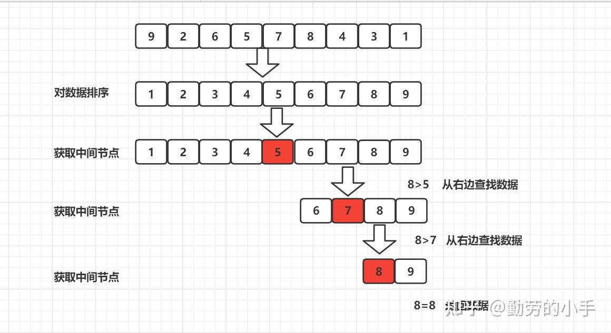

从二分法查找的过程来看，如果能保证数据的有序性，并且预先把数据进行分段存储好数据的中间节点，那么查找的时候就会很简单，所以如果要使用二分法，我们通常都会在数据存储的时候就预先把数据整理成适合二分法查找的数据结构，这就演化出了树和跳表两种数据结构， 这里我们主要来了解树的结构， 比如我们把上面的[9,2,6,5,7,8,4,3,1] 构建成一个二叉树，那么就是下面这样

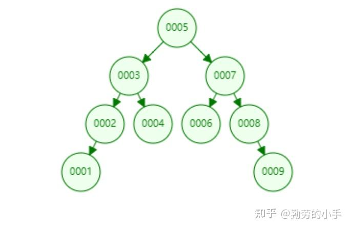

------

## **2、从二叉查树到平衡二叉树**

二叉查找树充分了利用二分法的思维提升了数据查找的效率，不过我们在构建二叉树的时候就会发现很容易出现一个问题， 就是二叉查找树的“高度”不稳定，同样的数据插入的先后顺序不一样，就很有可能变成下图一样的结构。

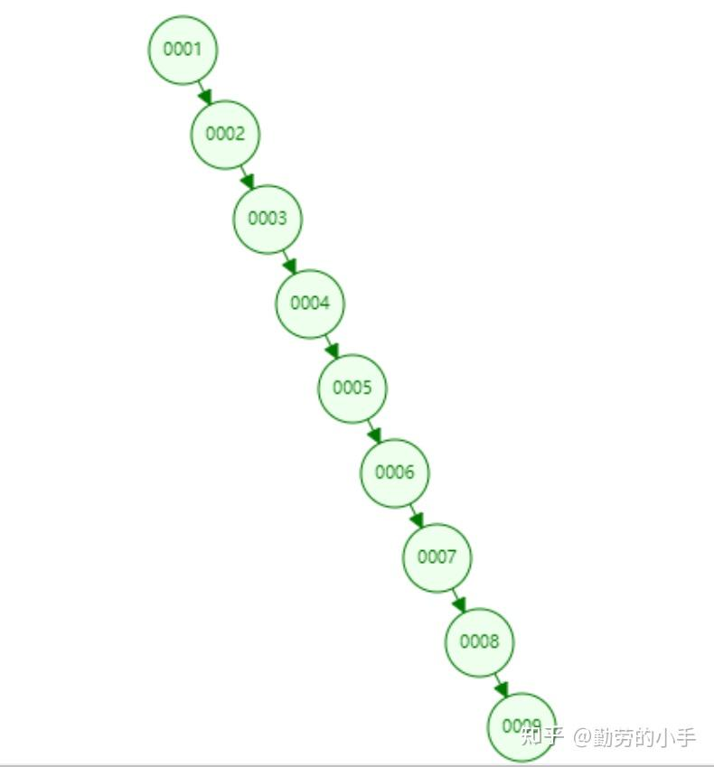

如果树的节点变成线性结构，那么就会极大的降低我们的查询效率，所以我们必须要有一种方式来保证二叉树节点的平衡，让树的节点高度差不会太大，这个时候就衍生了一些平衡算法，最终我们的二叉树就有像AVL树和红黑树这些新产品，我们也称这些新产品为平衡二叉树，，平衡二叉树通常会保证树的左右两边的节点层级相差不会大于2。

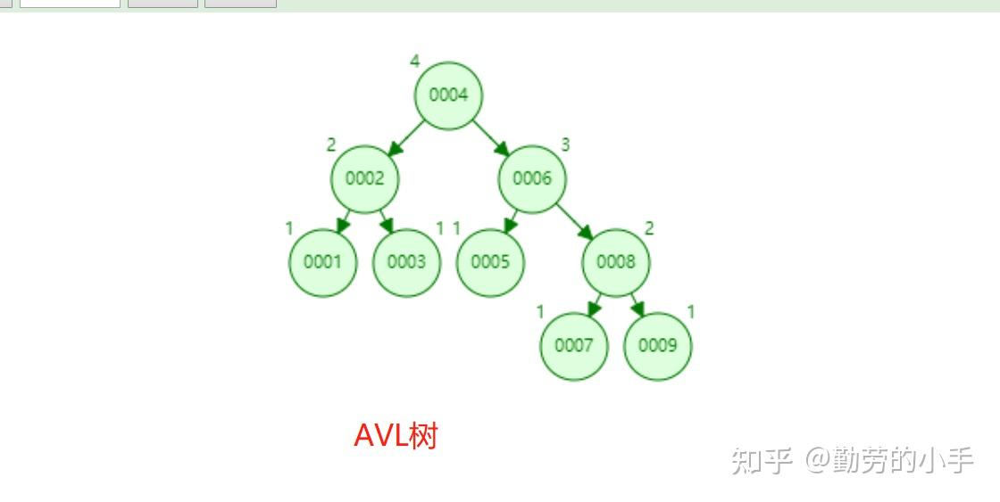

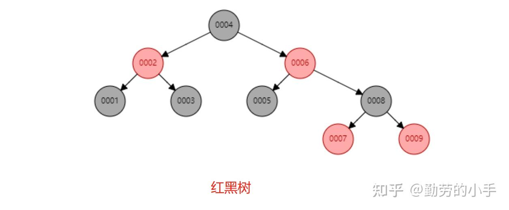

------

## **3、平衡二叉树**

当二叉树节点分布不均匀时，会极大影响数据查询的性能，所以为了保证数据的均衡性，就有了平衡二叉树的结构。平衡二叉树采用平衡算法可以让数据均匀的分布到树里的各个节点，避免树的高度相差太多，从而解决二叉树的层级不稳定问题。

**平衡二叉树的构建规则：**

（1）非叶子节点只能允许最多两个子节点存在。

（2）每一个节点的左边子节点值小于当前节点，右边的子节点值大于当前节点(这里的“值”是基于自己的算法规则而定的，比如hash值)；

（3）通过平衡算法（比如[Treap](https://link.zhihu.com/?target=http%3A//baike.baidu.com/item/Treap)、AVL、红黑树），保证树左右节点的高度相差不超过2层。

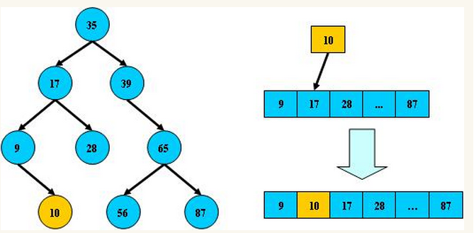

------

## **4、B树(B-tree)**

B树和平衡二叉树的不同之处是：B树属于多叉树又名平衡多路查找树（查找路径不止两个），数据库索引技术里大量使用着B树和B+树的数据结构。

注意: 有文章把B树和B-tree理解成了两种不同类别的树，其实这两个是同一种树

- **B树的构建规则：**

（1）排序方式：所有节点关键字是按递增次序排列，并遵循左小右大原则；

（2）子节点数：非叶节点（根节点和枝节点）的子节点数 >1、且子节点数量<=M 、且M>=2，空树除外（注：M阶代表一个树节点最多有多少个查找路径，M=M路,当M=2则是2叉树,M=3则是3叉）；

（3）关键字数：枝节点的关键字数量大于等于ceil(m/2)-1个且小于等于M-1个（注：ceil()是个朝正无穷方向取整的函数 如ceil(1.1)结果为2);

（4）所有叶子节点均在同一层、叶子节点除了包含了关键字 和 关键字记录的指针外，也有指向其子节点的指针只不过其指针地址都为null对应下图最后一层节点的空格子;

我们一个实际的例子来理解B树（这里为了理解方便我就直接用实际字母的大小来排列C>B>A）

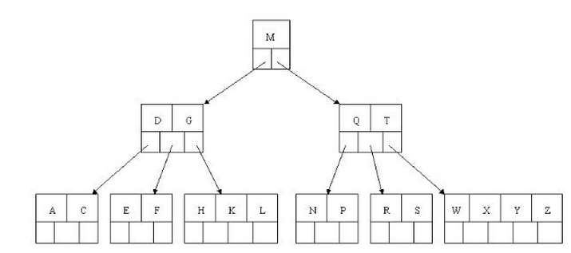

- **B树的查询流程：**

如上图我要从上图中找到E字母，查找流程如下

（1）获取根节点的关键字进行比较，当前根节点关键字为M，E<M（26个字母顺序），所以往找到指向左边的子节点（二分法规则，左小右大，左边放小于当前节点值的子节点、右边放大于当前节点值的子节点）；

（2）拿到关键字D和G，D<E<G 所以直接找到D和G中间的节点；

（3）拿到E和F，因为E=E 所以直接返回关键字和指针信息（如果树结构里面没有包含所要查找的节点则返回null）；

- **B树的插入节点流程**

定义一个5阶树（平衡5路查找树;），现在我们要把3、8、31、11、23、29、50、28、53 这些数字构建出一个5阶树出来。

（1）节点拆分规则：当前是要组成一个5路查找树，那么此时m=5,关键字数必须<=5-1（这里关键字数>4就要进行节点拆分）。

（2）排序规则：满足节点本身比左边节点大，比右边节点小的排序规则。

首先插入 3、8、31、11

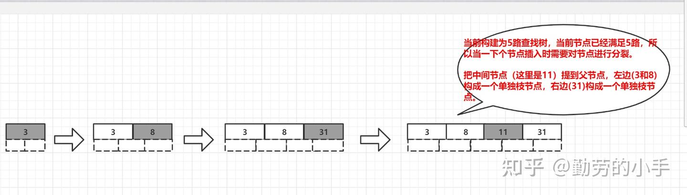

然后插入23、29

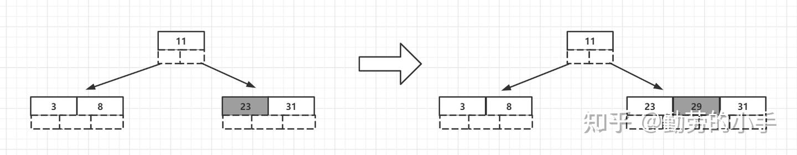

最后插入50、28、53

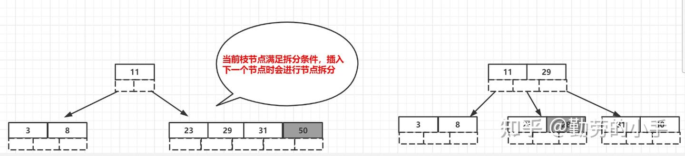

- **B树节点的删除**

（1）节点合并规则：当前是要组成一个5路查找树，那么此时m=5,关键字数必须大于等于 ceil(m/2)-1（所以这里关键字数<2就要进行节点合并）。

（2）满足节点本身比左边节点大，比右边节点小的排序规则。

（3）关键字数小于二时先从子节点取，子节点没有符合条件时就向父节点取，取中间值往父节点放。

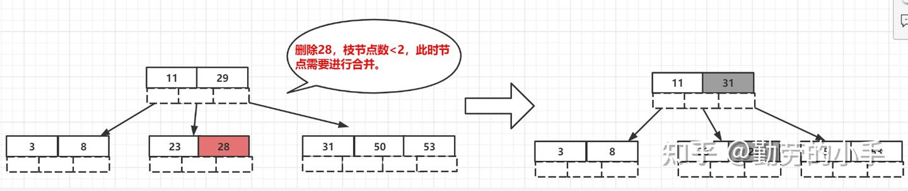

**B树特点：**

B树相对平衡二叉树在节点空间的利用率上进行改进，B树在每个节点保存更多的数据，减少了树的高度，从而提升了查找的性能，在数据库应用中，B树的每个节点存储的数据量大约为4K, 这是因为考虑到磁盘数据存储是采用块的形式存储的，每个块的大小为4K，每次对磁盘进行IO数据读取时，同一个磁盘块的数据会被一次性读取出来，所以每一次磁盘IO都可以读取到B树中一个节点的全部数据。

------

## **5、B+树**

B+树是在B树的基础上又一次的改进，其主要对两个方面进行了提升，一方面是查询的稳定性，另外一方面是在数据排序方面更友好。

- **B+树构建规则**

（1）B+树的**非叶子**节点**不保存具体的数据，而只保存关键字的索引**，而所有的数据最终都会保存到叶子节点。因为所有数据必须要到叶子节点才能获取到，所以每次数据查询的次数都一样，这样一来B+树的查询速度也就会比较稳定，而B树的查找过程中，不同的关键字查找的次数很有可能都是不同的（有的数据可能在根节点，有的数据可能在最下层的叶节点），所以在数据库的应用层面，B+树就显得更合适。

（2）B+树叶子节点的关键字从小到大有序排列，左边结尾数据都会保存右边节点开始数据的指针。因为叶子节点都是有序排列的，所以B+树对于数据的排序有着更好的支持。

（3）非叶子节点的子节点数=关键字数（来源百度百科）（根据各种资料 这里有两种算法的实现方式，另一种为非叶节点的关键字数=子节点数-1（来源维基百科)，虽然他们数据排列结构不一样，但其原理还是一样的Mysql 的B+树是用第一种方式实现）;

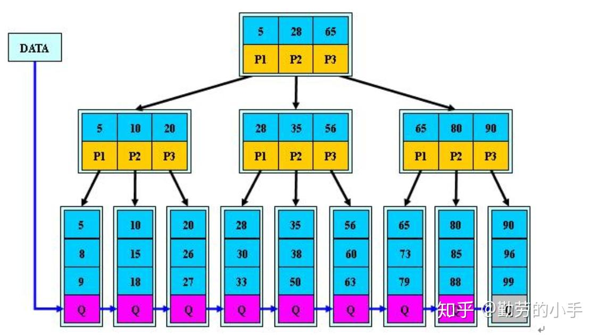

**（百度百科算法结构示意图）**

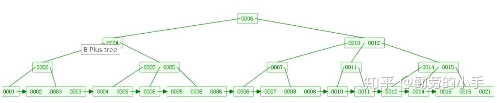

**（维基百科算法结构示意图）**

- **B+树和B树的对比**

1、B+**树查询速度更稳定**：B+所有关键字数据地址都存在**叶子**节点上，所以每次查找的次数都相同所以查询速度要比B树更稳定。

2、B+**树天然具备排序功能：**B+树所有的**叶子**节点数据构成了一个有序链表，在查询大小区间的数据时候更方便，数据紧密性很高，缓存的命中率也会比B树高。

3、B+**树全节点遍历更快：**B+树遍历整棵树只需要遍历所有的**叶子**节点即可，而不需要像B树一样需要对每一层进行遍历，这有利于数据库做全表扫描。

**B树**相对于**B+树**的优点是，如果经常访问的数据离根节点很近，而**B树**的**非叶子**节点本身存有关键字和数据，所以在查询这种数据检索的时候会要比**B+树**快。

------

## **6、B\*树**

很显然，B*树又是对B+数的再一次改进，在B+树的构建过程中，为了保持树的平衡，节点的合并拆分是比较耗费时间的，所以B*树就是在如何减少构建中节点合并和拆分的次数，从而提升树的数据插入、删除性能。

- **B\*树构建规则**

相对于B+树B*的不同之处如下：

（1）首先是关键字个数限制问题，B+树初始化的关键字初始化个数是cei(m/2)，b*树的初始化个数为（cei(2/3*m)）

（2）B+树节点满时就会分裂，而B*树节点满时会检查兄弟节点是否满（因为每个节点都有指向兄弟的指针），如果兄弟节点未满则向兄弟节点转移关键字，如果兄弟节点已满，则从当前节点和兄弟节点各拿出1/3的数据创建一个新的节点出来；

- **B\*树 与B+树对比**

在B+树的基础上因其初始化的容量变大，使得节点空间使用率更高，而又存有兄弟节点的指针，可以向兄弟节点转移关键字的特性使得B*树额分解次数变得更少；

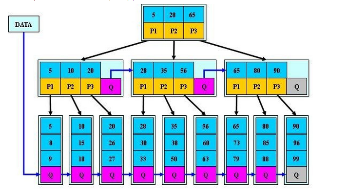

## **5、 总结**

**1、相同思想和策略**

从平衡二叉树、B树、B+树、B*树总体来看它们的贯彻的思想是相同的，都是采用二分法和数据平衡策略来提升查找数据的速度；

**2、不同的方式对树的不断优化**

1、首先，为了保证树的节点均匀分布，所以在二叉树的基础上加上了平衡算法，就有了平衡二叉树。

2、为了减少树的高度，所以B树一个节点下面可以添加N个子节点，然后每个节点的大小限制在磁盘块容量大小，让节点只需要通过一次IO就能读取到所有数据，通过增加节点存储的数据减少了树的高度，而节点的数据变多并没有让IO次数变多。

3、B+树在B树的基础上，在查询的稳定性 和排序方面进行了优化，因为B+树所有的数据都会保存到叶子节点，然后所有叶子节点本身是有序的。

4、B*树为了减少 树在构建过程中节点的拆分、合并次数，所以在每个节点上都保存了旁边节点的指针，在节点需要进行拆分、合并时，优先从旁边节点挪数据，从而减少构建过程中节点拆分、合并的次数，提升了树的构建性能。

补充概念：

附（二分法查找）：[二分法查找原理 - 知乎专栏](https://zhuanlan.zhihu.com/p/27597160)

附（B、B+、B*树）：[从B树、B+树、B*树谈到R 树](https://link.zhihu.com/?target=http%3A//blog.csdn.net/v_JULY_v/article/details/6530142/)

附（B、B+、B*树）：[end's coding life](https://link.zhihu.com/?target=http%3A//blog.csdn.net/endlu/article/details/51720299)

附：[B树和B+树的插入、删除图文详解 - nullzx - 博客园](https://link.zhihu.com/?target=https%3A//www.cnblogs.com/nullzx/p/8729425.html)