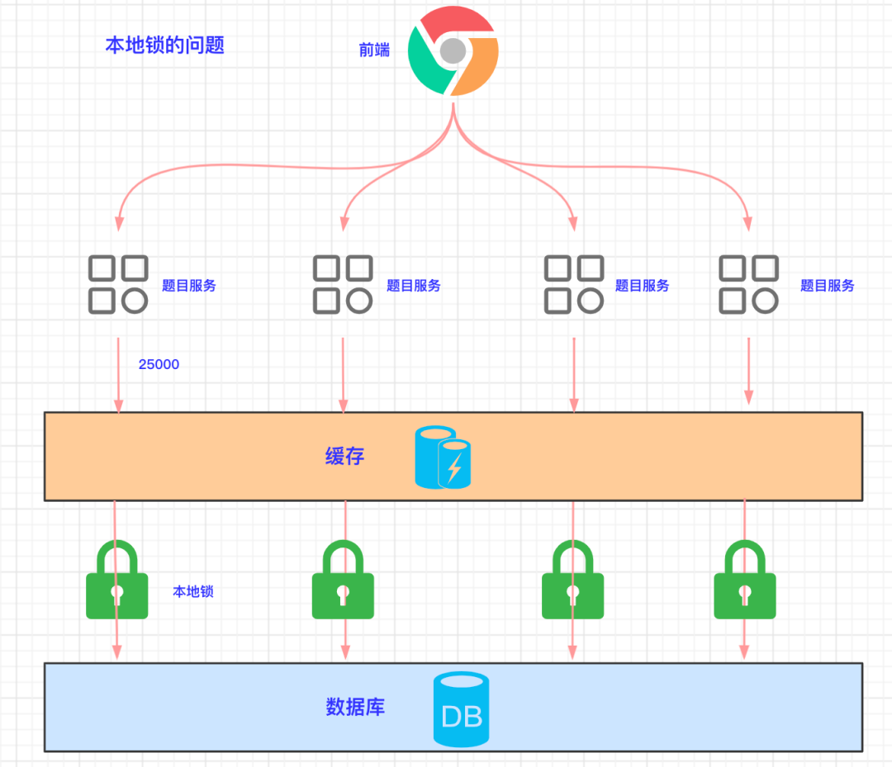

> 原文地址：
>
> http://passjava.cn/my-project/passjava/02.passjava_architecture/19.redis_distributed_lock.html
>
> http://passjava.cn/my-project/passjava/02.passjava_architecture/20.redission.html

## 本地锁的问题

首先我们来回顾下本地锁的问题：

目前题目微服务被拆分成了四个微服务。前端请求进来时，会被转发到不同的微服务。假如前端接收了 10 W 个请求，每个微服务接收 2.5 W 个请求，假如缓存失效了，每个微服务在访问数据库时加锁，通过锁（`synchronzied` 或 `lock`）来锁住自己的线程资源，从而防止`缓存击穿`。

这是一种`本地加锁`的方式，在`分布式`情况下会带来数据不一致的问题：比如服务 A 获取数据后，更新缓存 key =100，服务 B 不受服务 A 的锁限制，并发去更新缓存 key = 99，最后的结果可能是 99 或 100，但这是一种未知的状态，**与期望结果不一致**。流程图如下所示：

