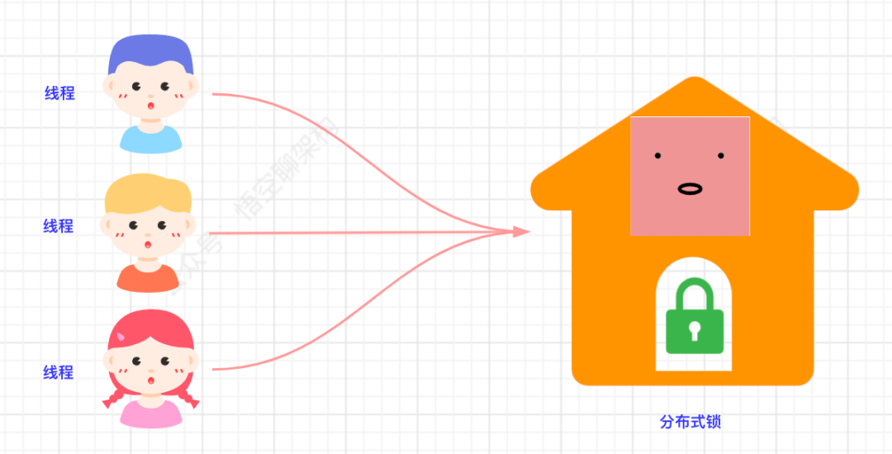
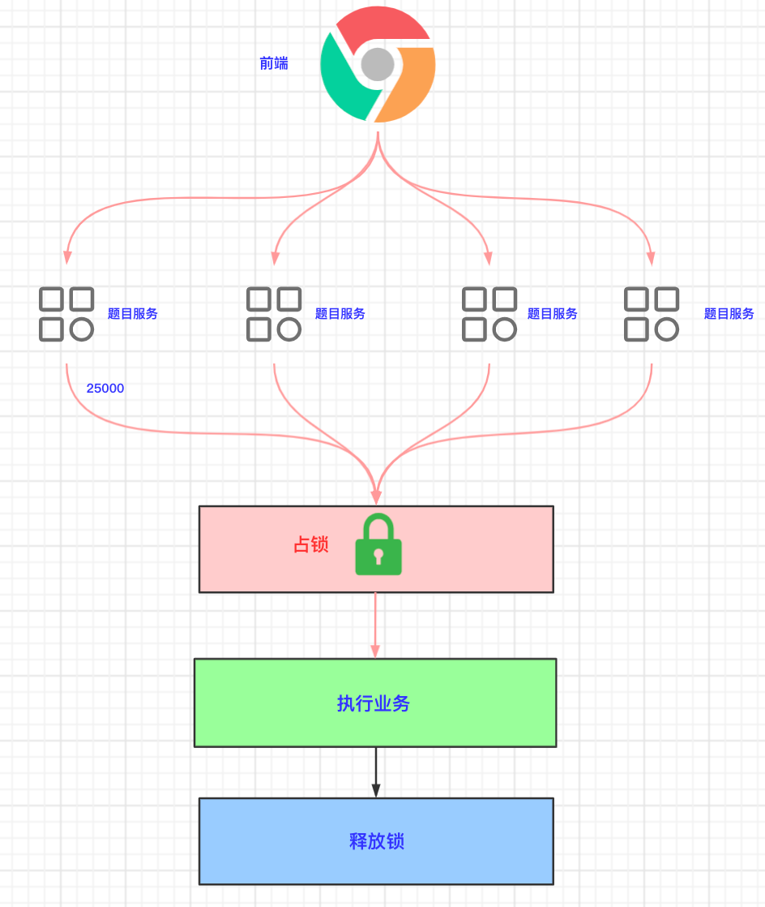

## 什么是分布式锁

基于上面本地锁的问题，我们需要一种支持**分布式集群环境**下的锁：查询 DB 时，只有一个线程能访问，其他线程都需要等待第一个线程释放锁资源后，才能继续执行。

**生活中的案例**：可以把锁看成房门外的一把`锁`，所有并发线程比作`人`，他们都想进入房间，房间内只能有一个人进入。当有人进入后，将门反锁，其他人必须等待，直到进去的人出来。

我们来看下分布式锁的基本原理，如下图所示：

我们来分析下上图的分布式锁：

- 1.前端将 10W 的高并发请求转发给四个题目微服务。
- 2.每个微服务处理 2.5 W 个请求。
- 3.每个处理请求的线程在执行业务之前，需要先抢占锁。可以理解为“占坑”。
- 4.获取到锁的线程在执行完业务后，释放锁。可以理解为“释放坑位”。
- 5.未获取到的线程需要等待锁释放。
- 6.释放锁后，其他线程抢占锁。
- 7.重复执行步骤 4、5、6。

大白话解释：所有请求的线程都去同一个地方`“占坑”`，如果有坑位，就执行业务逻辑，没有坑位，就需要其他线程释放“坑位”。这个坑位是所有线程可见的，可以把这个坑位放到 Redis 缓存或者数据库，这篇讲的就是如何用 Redis 做`“分布式坑位”`。

