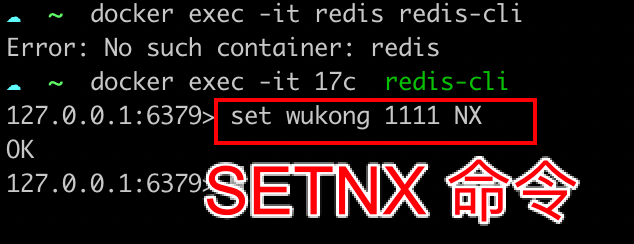

## Redis 的 SETNX

Redis 作为一个公共可访问的地方，正好可以作为“占坑”的地方。

用 Redis 实现分布式锁的几种方案，我们都是用 SETNX 命令（设置 key 等于某 value）。只是高阶方案传的参数个数不一样，以及考虑了异常情况。

我们来看下这个命令，`SETNX`是`set If not exist`的简写。意思就是当 key 不存在时，设置 key 的值，存在时，什么都不做。

在 Redis 命令行中是这样执行的：

```bash
set <key> <value> NX
```

我们可以进到 redis 容器中来试下 `SETNX` 命令。

先进入容器：

```bash
docker exec -it <容器 id> redid-cli
```

然后执行 SETNX 命令：将 `wukong` 这个 key 对应的 value 设置成 `1111`。

```bash
set wukong 1111 NX
```

返回 `OK`，表示设置成功。重复执行该命令，返回 `nil`表示设置失败。



