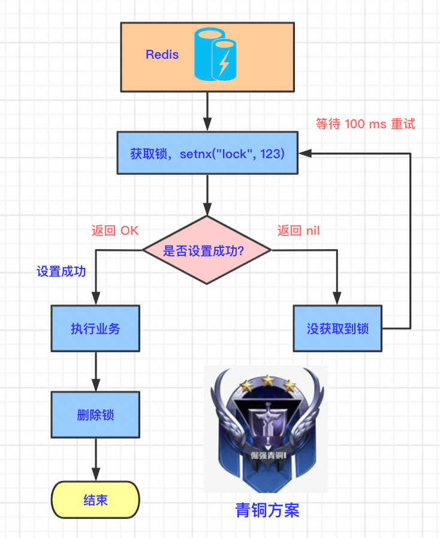

## 青铜方案

我们先用 Redis 的 SETNX 命令来实现最简单的分布式锁。

### 3.1 青铜原理

我们来看下流程图：



- 多个并发线程都去 Redis 中申请锁，也就是执行 setnx 命令，假设线程 A 执行成功，说明当前线程 A 获得了。
- 其他线程执行 setnx 命令都会是失败的，所以需要等待线程 A 释放锁。
- 线程 A 执行完自己的业务后，删除锁。
- 其他线程继续抢占锁，也就是执行 setnx 命令。因为线程 A 已经删除了锁，所以又有其他线程可以抢占到锁了。

代码示例如下，Java 中 setnx 命令对应的代码为 `setIfAbsent`。

setIfAbsent 方法的第一个参数代表 key，第二个参数代表值。

```java
// 1.先抢占锁
Boolean lock = redisTemplate.opsForValue().setIfAbsent("lock", "123");
if(lock) {
  // 2.抢占成功，执行业务
  List<TypeEntity> typeEntityListFromDb = getDataFromDB();
  // 3.解锁
  redisTemplate.delete("lock");
  return typeEntityListFromDb;
} else {
  // 4.休眠一段时间
  sleep(100);
  // 5.抢占失败，等待锁释放
  return getTypeEntityListByRedisDistributedLock();
}
```

一个小问题：那为什么需要休眠一段时间？

因为该程序存在递归调用，可能会导致栈空间溢出。

### 3.2 青铜方案的缺陷

青铜之所以叫青铜，是因为它是最初级的，肯定会带来很多问题。

**设想一种家庭场景**：晚上小空一个人开锁进入了房间，打开了电灯💡，然后突然`断电`了，小空想开门出去，但是找不到门锁位置，那小明就进不去了，外面的人也进不来。


从技术的角度看：setnx 占锁成功，业务代码出现异常或者服务器宕机，没有执行删除锁的逻辑，就造成了`死锁`。

**那如何规避这个风险呢？**

设置锁的`自动过期时间`，过一段时间后，自动删除锁，这样其他线程就能获取到锁了。

