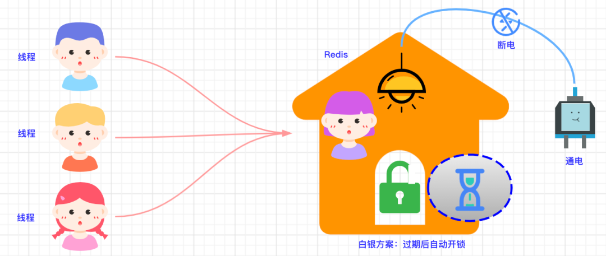
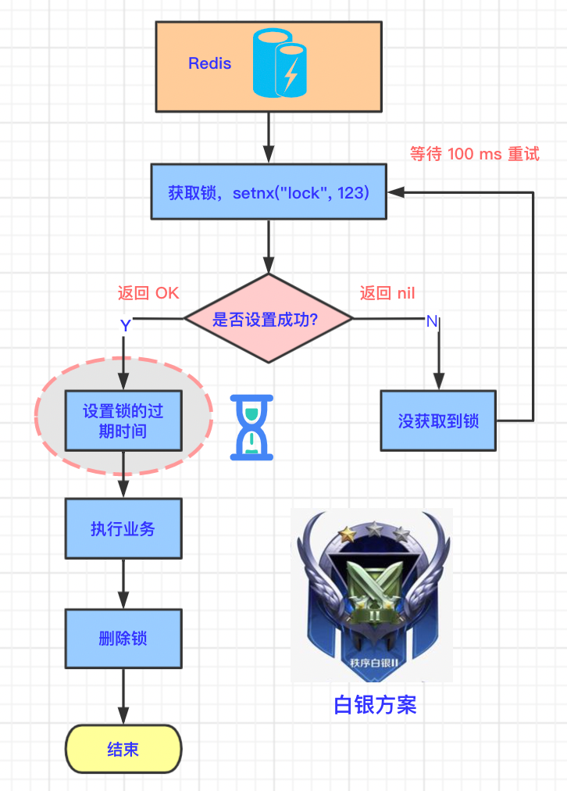

## 白银方案

### 4.1 生活中的例子

上面提到的青铜方案会有死锁问题，那我们就用上面的规避风险的方案来设计下，也就是我们的白银方案。



还是生活中的例子：小空开锁成功后，给这款智能锁设置了一个`沙漏倒计时⏳`，沙漏完后，门锁自动打开。即使房间突然断电，过一段时间后，锁会自动打开，其他人就可以进来了。

### 4.2 技术原理图

和青铜方案不同的地方在于，在占锁成功后，设置锁的过期时间，这两步是分步执行的。如下图所示：




### 4.3 示例代码

清理 redis key 的代码如下

```java
// 在 10s 以后，自动清理 lock
redisTemplate.expire("lock", 10, TimeUnit.SECONDS);
```

完整代码如下：

```java
// 1.先抢占锁
Boolean lock = redisTemplate.opsForValue().setIfAbsent("lock", "123");
if(lock) {
    // 2.在 10s 以后，自动清理 lock
    redisTemplate.expire("lock", 10, TimeUnit.SECONDS);
    // 3.抢占成功，执行业务
    List<TypeEntity> typeEntityListFromDb = getDataFromDB();
    // 4.解锁
    redisTemplate.delete("lock");
    return typeEntityListFromDb;
}
```

### 4.4 白银方案的缺陷

白银方案看似解决了线程异常或服务器宕机造成的锁未释放的问题，但还是存在其他问题：

因为占锁和设置过期时间是分两步执行的，所以如果在这两步之间发生了异常，则锁的过期时间根本就没有设置成功。

所以和青铜方案有一样的问题：**锁永远不能过期**。

