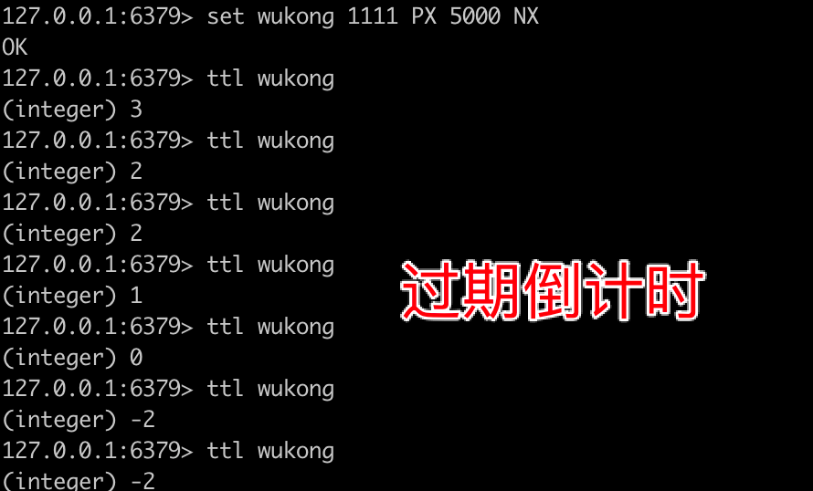
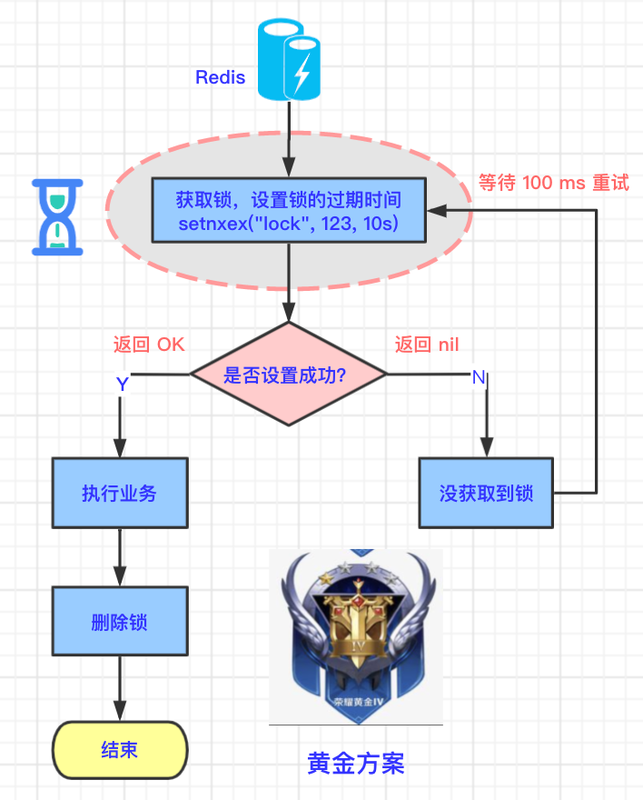
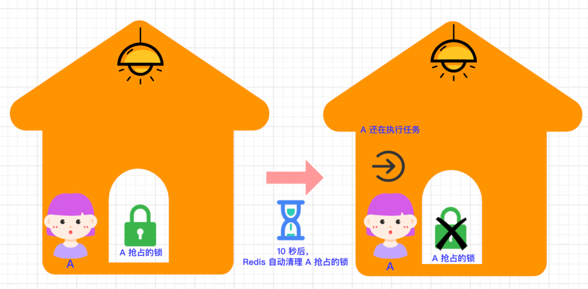
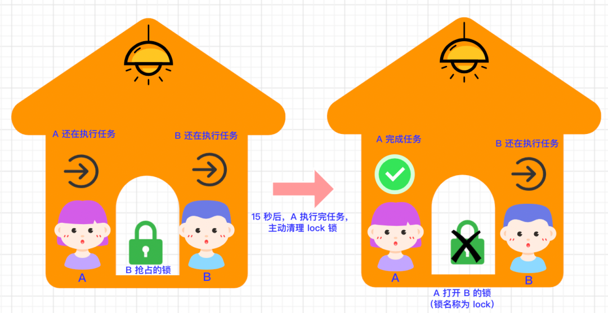
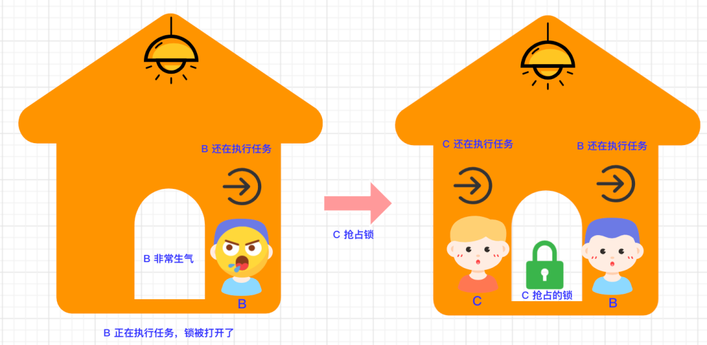

## 黄金方案

### 5.1 原子指令

上面的白银方案中，占锁和设置锁过期时间是分步两步执行的，这个时候，我们可以联想到什么：事务的原子性（Atom）。

**原子性**：多条命令要么都成功执行，要么都不执行。

将两步放在一步中执行：占锁+设置锁过期时间。

Redis 正好支持这种操作：

```bash
# 设置某个 key 的值并设置多少毫秒或秒 过期。
set <key> <value> PX <多少毫秒> NX
或
set <key> <value> EX <多少秒> NX
```

然后可以通过如下命令查看 key 的变化

```bash
ttl <key>
```

下面演示下如何设置 key 并设置过期时间。注意：执行命令之前需要先删除 key，可以通过客户端或命令删除。

```bash
# 设置 key=wukong，value=1111，过期时间=5000ms
set wukong 1111 PX 5000 NX
# 查看 key 的状态
ttl wukong
```

执行结果如下图所示：每运行一次 ttl 命令，就可以看到 wukong 的过期时间就会减少。最后会变为 -2（已过期）。




### 5.2 技术原理图

黄金方案和白银方案的不同之处：获取锁的时候，也需要设置锁的过期时间，这是一个原子操作，要么都成功执行，要么都不执行。如下图所示：




### 5.3 示例代码

设置 `lock` 的值等于 `123`，过期时间为 10 秒。如果 `10` 秒 以后，lock 还存在，则清理 lock。

```java
setIfAbsent("lock", "123", 10, TimeUnit.SECONDS);
```


### 5.4 黄金方案的缺陷

我们还是举生活中的例子来看下黄金方案的缺陷。


#### 5.4.1 用户 A 抢占锁



- 用户 A 先抢占到了锁，并设置了这个锁 10 秒以后自动开锁，锁的编号为 `123`。
- 10 秒以后，A 还在执行任务，此时锁被自动打开了。


#### 5.4.2 用户 B 抢占锁



- 用户 B 看到房间的锁打开了，于是抢占到了锁，设置锁的编号为 `123`，并设置了过期时间 `10 秒`。
- 因房间内只允许一个用户执行任务，所以用户 A 和 用户 B 执行任务 `产生了冲突`。
- 用户 A 在 `15 s` 后，完成了任务，此时 用户 B 还在执行任务。
- 用户 A 主动打开了编号为 `123`的锁。
- 用户 B 还在执行任务，发现锁已经被打开了。
- 用户 B 非常生气： **我还没执行完任务呢，锁怎么开了？**


#### 5.4.3 用户 C 抢占锁



- 用户 B 的锁被 A 主动打开后，A 离开房间，B 还在执行任务。
- 用户 C 抢占到锁，C 开始执行任务。
- 因房间内只允许一个用户执行任务，所以用户 B 和 用户 C 执行任务产生了冲突。

从上面的案例中我们可以知道，因为用户 A 处理任务所需要的时间**大于**锁自动清理（开锁）的时间，所以在自动开锁后，又有其他用户抢占到了锁。当用户 A 完成任务后，会把其他用户抢占到的锁给主动打开。

**这里为什么会打开别人的锁？**因为锁的编号都叫做 `“123”`，用户 A 只认锁编号，看见编号为 `“123”`的锁就开，结果把用户 B 的锁打开了，此时用户 B 还未执行完任务，当然生气了。


