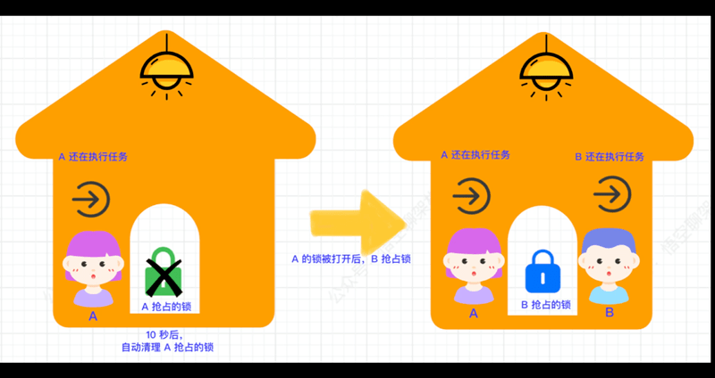
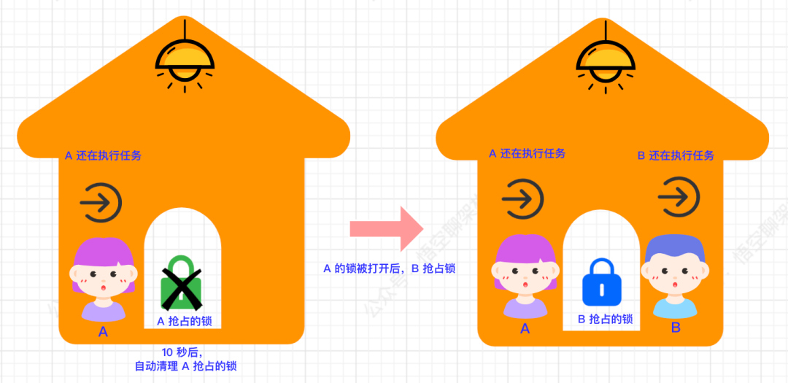
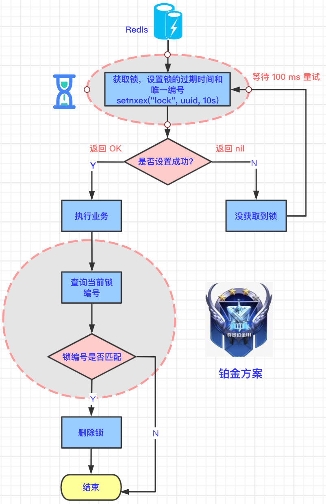
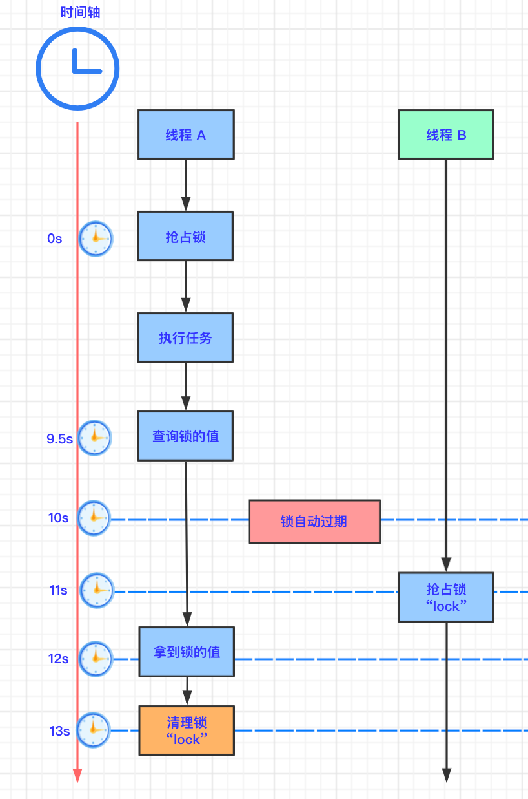

## 铂金方案


### 6.1 生活中的例子

上面的黄金方案的缺陷也很好解决，给每个锁设置**不同的编号**不就好了～

如下图所示，B 抢占的锁是蓝色的，和 A 抢占到绿色锁不一样。这样就不会被 A 打开了。

做了个动图，方便理解：



动图演示

静态图更高清，可以看看：




### 6.2 技术原理图

与黄金方案的不同之处：

- 设置锁的过期时间时，还需要设置唯一编号。
- 主动删除锁的时候，需要判断锁的编号是否和设置的一致，如果一致，则认为是自己设置的锁，可以进行主动删除。




### 6.3 代码示例

```java
// 1.生成唯一 id
String uuid = UUID.randomUUID().toString();
// 2. 抢占锁
Boolean lock = redisTemplate.opsForValue().setIfAbsent("lock", uuid, 10, TimeUnit.SECONDS);
if(lock) {
    System.out.println("抢占成功：" + uuid);
    // 3.抢占成功，执行业务
    List<TypeEntity> typeEntityListFromDb = getDataFromDB();
    // 4.获取当前锁的值
    String lockValue = redisTemplate.opsForValue().get("lock");
    // 5.如果锁的值和设置的值相等，则清理自己的锁
    if(uuid.equals(lockValue)) {
        System.out.println("清理锁：" + lockValue);
        redisTemplate.delete("lock");
    }
    return typeEntityListFromDb;
} else {
    System.out.println("抢占失败，等待锁释放");
    // 4.休眠一段时间
    sleep(100);
    // 5.抢占失败，等待锁释放
    return getTypeEntityListByRedisDistributedLock();
}
```

- 1.生成随机唯一 id，给锁加上唯一值。
- 2.抢占锁，并设置过期时间为 10 s，且锁具有随机唯一 id。
- 3.抢占成功，执行业务。
- 4.执行完业务后，获取当前锁的值。
- 5.如果锁的值和设置的值相等，则清理自己的锁。


### 6.4 铂金方案的缺陷

上面的方案看似很完美，但还是存在问题：第 4 步和第 5 步并不是原子性的。



- 时刻：0s。线程 A 抢占到了锁。
- 时刻：9.5s。线程 A 向 Redis 查询当前 key 的值。
- 时刻：10s。锁自动过期。
- 时刻：11s。线程 B 抢占到锁。
- 时刻：12s。线程 A 在查询途中耗时长，终于拿多锁的值。
- 时刻：13s。线程 A 还是拿自己设置的锁的值和返回的值进行比较，值是相等的，清理锁，但是这个锁其实是线程 B 抢占的锁。

那如何规避这个风险呢？钻石方案登场。


