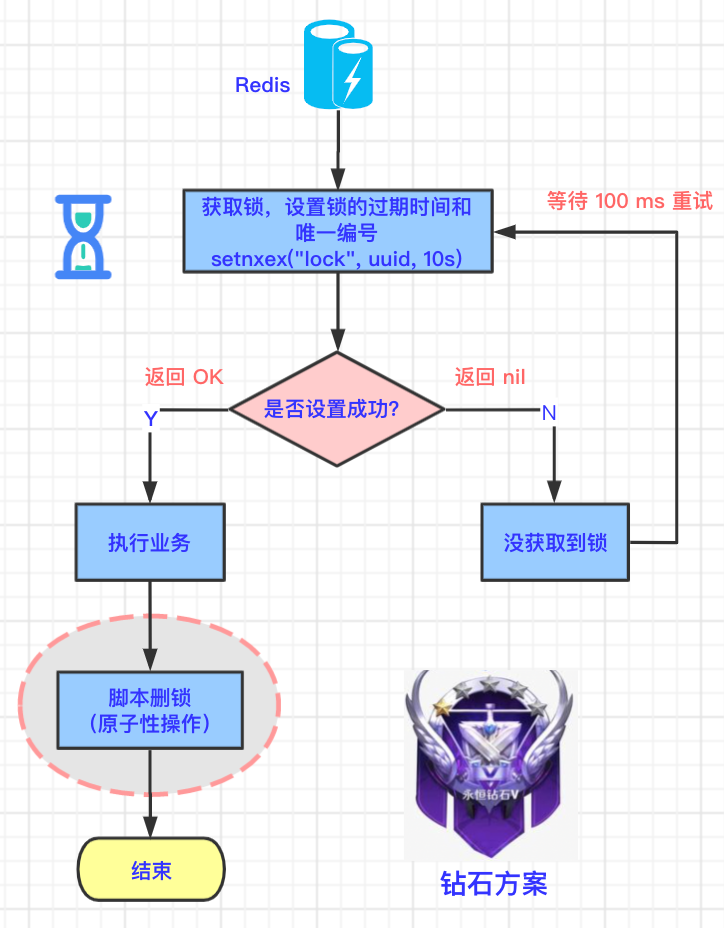

## 钻石方案

上面的线程 A 查询锁和删除锁的逻辑不是`原子性`的，所以将查询锁和删除锁这两步作为原子指令操作就可以了。


### 7.1 技术原理图

如下图所示，红色圈出来的部分是钻石方案的不同之处。用脚本进行删除，达到原子操作。




### 7.2 代码示例

那如何用脚本进行删除呢？

我们先来看一下这段 Redis 专属脚本：

```java
if redis.call("get",KEYS[1]) == ARGV[1]
then
    return redis.call("del",KEYS[1])
else
    return 0
end
```

这段脚本和铂金方案的获取key，删除key的方式很像。先获取 KEYS[1] 的 value，判断 KEYS[1] 的 value 是否和 ARGV[1] 的值相等，如果相等，则删除 KEYS[1]。

那么这段脚本怎么在 Java 项目中执行呢？

分两步：先定义脚本；用 redisTemplate.execute 方法执行脚本。

```java
// 脚本解锁
String script = "if redis.call('get',KEYS[1]) == ARGV[1] then return redis.call('del',KEYS[1]) else return 0 end";
redisTemplate.execute(new DefaultRedisScript<Long>(script, Long.class), Arrays.asList("lock"), uuid);
```

上面的代码中，KEYS[1] 对应`“lock”`，ARGV[1] 对应 `“uuid”`，含义就是如果 lock 的 value 等于 uuid 则删除 lock。

而这段 Redis 脚本是由 Redis 内嵌的 Lua 环境执行的，所以又称作 Lua 脚本。

**那钻石方案是不是就完美了呢？有没有更好的方案呢？**

下篇，我们再来介绍另外一种分布式锁的王者方案：Redisson。


