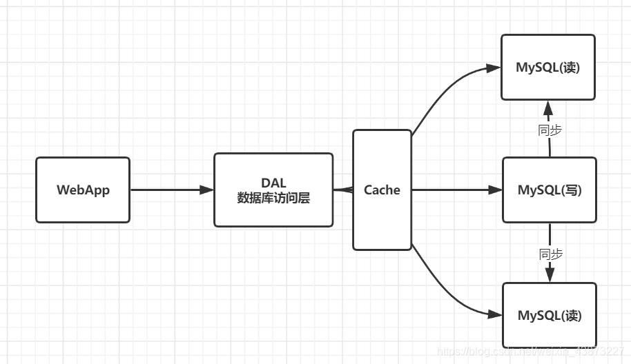
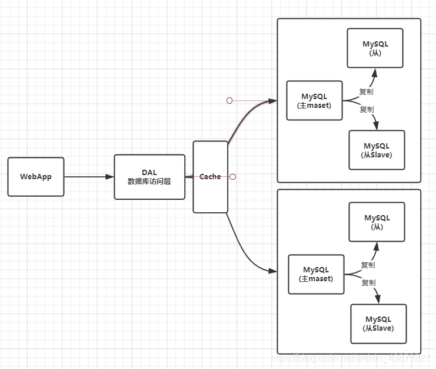

### Nosql

#### 为什么使用Nosql

大数据时代！！普通的数据库无法进行数据分析！Hadoop(2006)。

历史发展：

> 1. **单机MySQL时代**（90年代）,一个网站的访问量一般不会太大，单个数据库完全够用
>
> 
>
> 问题：
>
> - 数据量增加到一定程度，单机数据库就放不下了
> - 数据的索引（B+ Tree）,一个机器内存也存放不下
> - 访问量变大后（读写混合），一台服务器承受不住。
>
> 1. **MySQL垂直拆分+MemCache**
>
> 
>
> 将当个数据库扩展成为多个“垂直”的数据库，同时满足读写分离和数据一致性。
> 但是当访问量过大时频繁去数据库查询速度和效率低下。这个优化过程经历了以下几个过程:
>
> - 优化数据库的数据结构和索引(难度大)
> - 文件缓存，通过IO流获取比每次都访问数据库效率略高，但是流量爆炸式增长时候，IO流也承受不了
> - MemCache,当时最热门的技术，通过在数据库和数据库访问层之间加上一层缓存，第一次访问时查询数据库，将结果保存到缓存，后续的查询先检查缓存，若有直接拿去使用，效率显著提升。
>
> 1. **分库分表、主从复制=>集群**
>
> 
>
> 1. 如今信息量井喷式增长，各种各样的数据出现（用户定位数据，图片数据等），大数据的背景下关系型数据库（RDBMS）无法满足大量数据要求。Nosql数据库就能轻松解决这些问题。

#### 什么是Nosql

**Not Only SQL、**不仅仅是数据库。泛指非关系型数据库。

关系型数据库：列+行，同一个表下数据的结构是一样的。

非关系型数据库：数据存储没有固定的格式，并且可以进行横向扩展。

#### Nosql特点

1. 数据之间没有关系，方便扩展
2. 大数据量下，性能高。（一秒写入8W次 读取11W次）
3. 数据类型是多样性（不需要事先设计数据库，感受一下Mysql设计表和库的痛苦）
4. 存储方式
   - 键值对存储
   - 列存储
   - 文档存储
   - 图形数据库
   - …
5. 没有固定的查询语言
6. CAP定理和 BASE
7. 高可用、高性能、高可扩

推荐阅读：阿里云的这群疯子https://yq.aliyun.com/articles/653511

```markdown
# 商品信息
- 一般存放在关系型数据库：Mysql,阿里巴巴使用的Mysql都是经过内部改动的。

# 商品描述、评论(文字居多)
- 文档型数据库：MongoDB

# 图片
- 分布式文件系统 FastDFS
- 淘宝：TFS
- Google: GFS
- Hadoop: HDFS
- 阿里云: oss

# 商品关键字 用于搜索
- 搜索引擎：solr,elasticsearch
- 阿里：Isearch 多隆

# 商品热门的波段信息
- 内存数据库：Redis，Memcache

# 商品交易，外部支付接口
- 第三方应用
```

所以企业中使用数据库，都是关系型数据库+Nosql一起使用。

#### NoSQL的四大分类

##### KV键值对

- sina：Redis
- 美团：Redis+Tair
- alibaba、baidu：Redis+Memcache

##### 文档型数据库（bson格式）

- MongoDB(掌握)

  > 基于分布式文件存储的数据库。C++编写，用于处理大量文档。

  MongoDB是RDBMS和NoSQL的中间产品。NoSQL中最像关系型数据库的数据库

- ConchDB

##### 列存储数据库

- HBase(大数据必学)
- 分布式文件系统

##### 图关系数据库

用于广告推荐，社交网络

- Neo4j、InfoGrid

| **分类**                | **Examples举例**                                   | **典型应用场景**                                             | **数据模型**                                    | **优点**                                                     | **缺点**                                                     |
| ----------------------- | -------------------------------------------------- | ------------------------------------------------------------ | ----------------------------------------------- | ------------------------------------------------------------ | ------------------------------------------------------------ |
| **键值对（key-value）** | Tokyo Cabinet/Tyrant, Redis, Voldemort, Oracle BDB | 内容缓存，主要用于处理大量数据的高访问负载，也用于一些日志系统等等。 | Key 指向 Value 的键值对，通常用hash table来实现 | 查找速度快                                                   | 数据无结构化，通常只被当作字符串或者二进制数据               |
| **列存储数据库**        | Cassandra, HBase, Riak                             | 分布式的文件系统                                             | 以列簇式存储，将同一列数据存在一起              | 查找速度快，可扩展性强，更容易进行分布式扩展                 | 功能相对局限                                                 |
| **文档型数据库**        | CouchDB, MongoDb                                   | Web应用（与Key-Value类似，Value是结构化的，不同的是数据库能够了解Value的内容） | Key-Value对应的键值对，Value为结构化数据        | 数据结构要求不严格，表结构可变，不需要像关系型数据库一样需要预先定义表结构 | 查询性能不高，而且缺乏统一的查询语法。                       |
| **图形(Graph)数据库**   | Neo4J, InfoGrid, Infinite Graph                    | 社交网络，推荐系统等。专注于构建关系图谱                     | 图结构                                          | 利用图结构相关算法。比如最短路径寻址，N度关系查找等          | 很多时候需要对整个图做计算才能得出需要的信息，而且这种结构不太好做分布式的集群 |

