### Redis入门


#### Redis是什么？

> Redis（Remote Dictionary Server )，即远程字典服务
>
> 一个开源的使用ANSI C语言编写、支持网络、可基于内存亦可持久化的日志型、**Key-Value数据库**，并提供多种语言的API。
>
> 与memcached一样，为了保证效率，**数据都是缓存在内存中**。区别的是redis会周期性的把更新的数据写入磁盘或者把修改操作写入追加的记录文件，并且在此基础上实现了master-slave(主从)同步。

#### Redis能干什么？

1. 内存存储，需要持久化（RDB、AOF）
2. 高效率、用于高速缓冲
3. 发布订阅系统
4. 地图信息分析
5. 计时器、计数器(eg：浏览量)
6. …

#### 环境搭建

官网：https://redis.io/

推荐使用Linux服务器学习。

windows版本的Redis已经停更很久了…

##### window搭建

下载压缩包后解压：

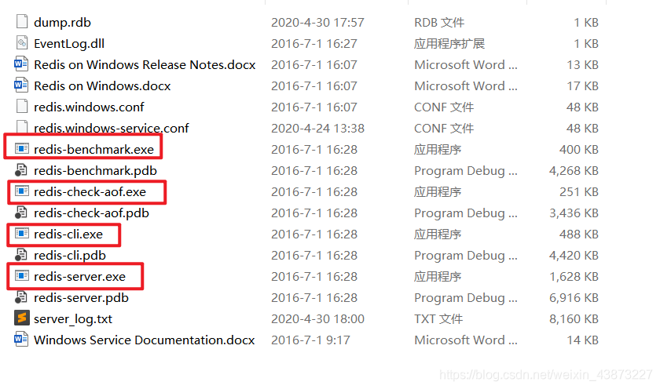

此时运行redis-server.exe 会创建一个临时服务，当窗口关闭，服务也会随之关闭。

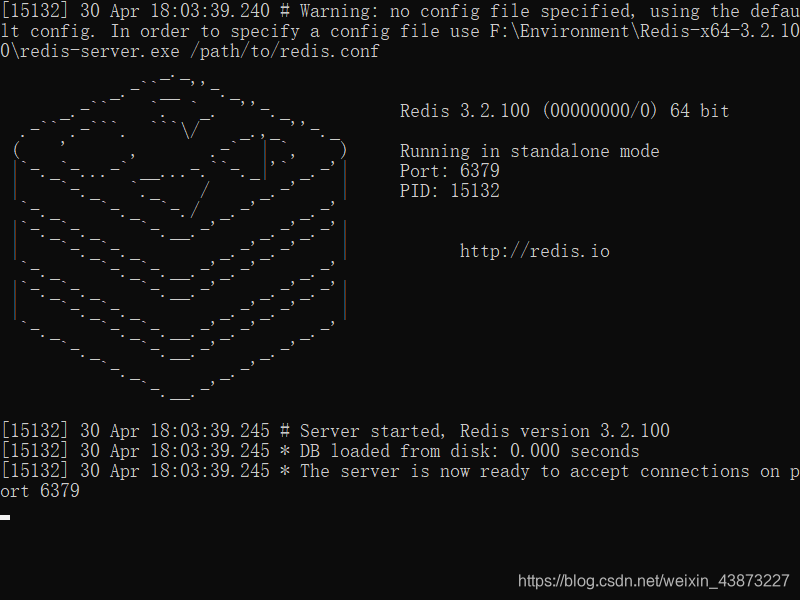

然后我们启动运行redis-cli 就可以连接到redis-server，Redis的默认端口6379

输入ping命令，就会得到PONG的消息，证明连接成功。

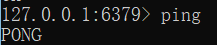

Redis可以设置密码的噢：（这里主要讲解使用命令行设置。还可以通过配置文件设置。）

1. `config get requirepass =>`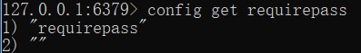
2. 默认是`“”`，`config set requirepass 123456`设置密码为123456，执行成功返回消息OK
3. 现在进行ping，就要求身份认证
4. auth + 密码就可以完成身份认证
5. 然后就可以进行使用拉，由于是键值对存储，使用简单的get/set就可以

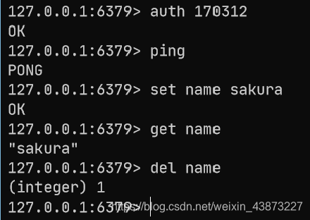

我们之前说到是使用的临时服务，那么肯定也能像mysql一样**安装常驻服务。**

1. 进入Redis解压目录

   `redis-server.exe --service-install redis.windows.conf --service-name 服务名 --loglevel verbose`

   就可以安装Redis服务了，这里使用 Redis-server 作为服务名

   

2. 然后我们启动服务

   `redis-server.exe --service-start --service-name 服务名`


1. 现在我们直接启动redis-cli.exe 也能进行连接

2. 如果不需要这个服务了，可以停止服务：

   `redis-server.exe --service-stop --service-name 服务名`

3. 或者卸载服务(需要先停止服务)

   `redis-server.exe --service-uninstall --service-name 服务名`

##### Linux搭建

解压：

```
tar -zxvf redis_xxx.tar.gz
```


`yum install gcc-c` 安装gcc环境，然后进入redis目录下执行`make`命令

然后执行`make install`确认执行完毕

redis默认安装路径`/usr/local/bin`

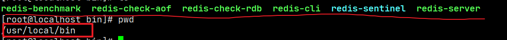

配置redis

将解压文件中的redis.conf 复制一份即可，在/usr/local/bin下创建一个myconf目录存放配置文件。
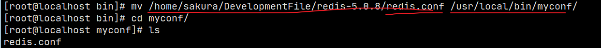

Redis 默认不是后台启动，修改配置文件：

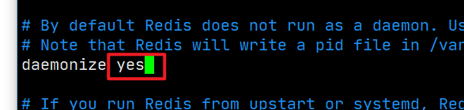

将daemonize改为yes，就改为了后台启动。

回到/usr/local/bin目录 启动redis，并设置配置文件

```
redis-server myconf/redis.conf
```

然后启动客户端连接

`redis-cli -p 6379` (这里可以使用 -h 指定主机号， -p 指定端口号)

客户端中使用`shutdown`关闭server,`exit`退出客户端，此时客户端和server就完全退出了。

#### 性能测试工具—redis-benchmark

Redis官方提供的性能测试工具，参数选项如下：

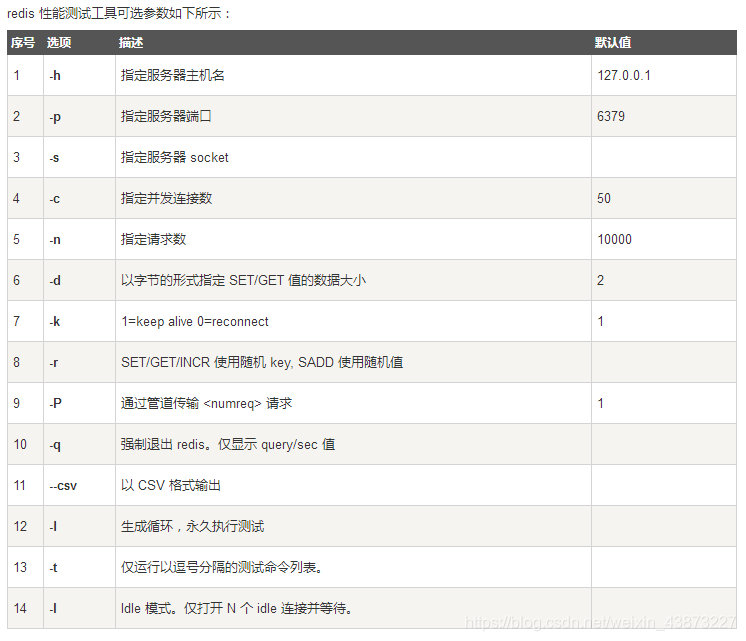

简单测试

```markdown
redis-benchmark -h localhost -p 6379 -c 100 -n 100000
> 表示向localhost 6379端口也就是我们的redis-server 以100的并发数发送10,0000个请求进行性能测试
```

结果截图，像是对每个命令进行了测试包括（SET、GET、INCR、LPUSH等）

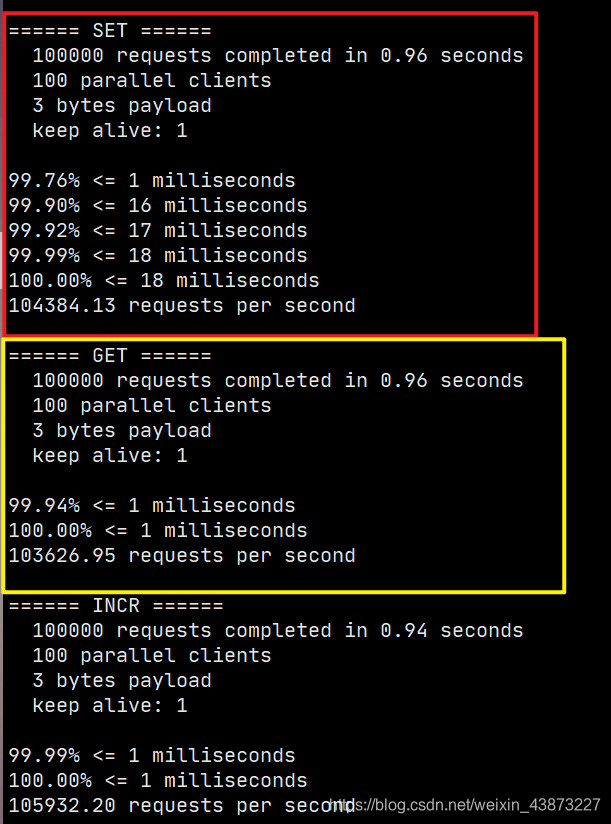

那么这些测试结果代表什么呢？
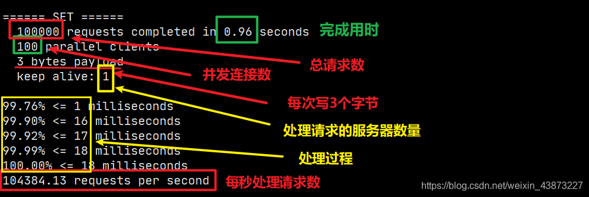

#### 基础知识

> **Redis默认有16个数据库**

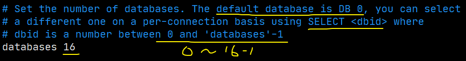

16个数据库为：DB 0~DB 15
默认使用DB 0 ，可以使用`select n`切换到DB n，`dbsize`可以查看当前数据库的大小，与key数量相关。。

```shell
127.0.0.1:6379> config get databases # 命令行查看数据库数量databases
1) "databases"
2) "16"

127.0.0.1:6379> select 8 # 切换数据库 DB 8
OK
127.0.0.1:6379[8]> dbsize # 查看数据库大小
(integer) 0

# 不同数据库之间 数据是不能互通的，并且dbsize 是根据库中key的个数。
127.0.0.1:6379> set name sakura 
OK
127.0.0.1:6379> SELECT 8
OK
127.0.0.1:6379[8]> get name # db8中并不能获取db0中的键值对。
(nil)
127.0.0.1:6379[8]> DBSIZE
(integer) 0
127.0.0.1:6379[8]> SELECT 0
OK
127.0.0.1:6379> keys *
1) "counter:__rand_int__"
2) "mylist"
3) "name"
4) "key:__rand_int__"
5) "myset:__rand_int__"
127.0.0.1:6379> DBSIZE # size和key个数相关
(integer) 5
```

`keys *` ：查看当前数据库中所有的key。

`flushdb`：清空当前数据库中的键值对。

`flushall`：清空所有数据库的键值对。

> **Redis是单线程的，Redis是基于内存操作的。**
> 所以Redis的性能瓶颈不是CPU,而是机器内存和网络带宽。
>
> 那么为什么Redis的速度如此快呢，性能这么高呢？QPS达到10W+

1. 首先Redis的底层是使用C语言编写，所以性能有优势
2. 我们需要打破两个认知误区
   - 多线程与高性能之间 不是对等的。（多线程不一定高性能）
   - 多线程不一定比单线程效率高。由于多线程之间切换会导致CPU的上下文进行切换，也是费时操作。
3. Redis将所有数据存放在内存中，且是单线程的，CPU不用频繁切换上下文。

