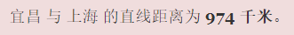
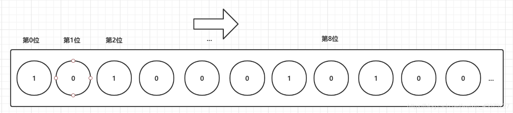

### 三种特殊数据类型

#### Geospatial(地理位置)

> 使用经纬度定位地理坐标并用一个**有序集合zset保存**，所以zset命令也可以使用

| 命令                                                         | 描述                                                         |
| ------------------------------------------------------------ | ------------------------------------------------------------ |
| `geoadd key longitud(经度) latitude(纬度) member [..]`       | 将具体经纬度的坐标存入一个有序集合                           |
| `geopos key member [member..]`                               | 获取集合中的一个/多个成员坐标                                |
| `geodist key member1 member2 [unit]`                         | 返回两个给定位置之间的距离。默认以米作为单位。               |
| `georadius key longitude latitude radius m|km|mi|ft [WITHCOORD][WITHDIST] [WITHHASH] [COUNT count]` | 以给定的经纬度为中心， 返回集合包含的位置元素当中， 与中心的距离不超过给定最大距离的所有位置元素。 |
| `GEORADIUSBYMEMBER key member radius...`                     | 功能与GEORADIUS相同，只是中心位置不是具体的经纬度，而是使用结合中已有的成员作为中心点。 |
| `geohash key member1 [member2..]`                            | 返回一个或多个位置元素的Geohash表示。使用Geohash位置52点整数编码。 |

**有效经纬度**

> - 有效的经度从-180度到180度。
> - 有效的纬度从-85.05112878度到85.05112878度。

指定单位的参数 **unit** 必须是以下单位的其中一个：

- **m** 表示单位为米。
- **km** 表示单位为千米。
- **mi** 表示单位为英里。
- **ft** 表示单位为英尺。

```shell
-----------------geoadd--------------------
127.0.0.1:6379> geoadd china:city 111.4 30.5 yichang # 将经纬度(111.4,30.5)的地理坐标加入china:city 并命名yichang
(integer) 1
127.0.0.1:6379> geoadd china:city 121.4 31.4 shanghai # ...
(integer) 1
127.0.0.1:6379> geoadd china:city 120.2 30.2 hangzhou
(integer) 1
127.0.0.1:6379> geoadd china:city 104.1 30.6 chengdu
(integer) 1

-----------------geopos--------------------
127.0.0.1:6379> geopos china:city shanghai
1) 1) "121.40000134706497" # 经度
   2) "31.400000253193539" # 纬度
   
-----------------geodist--------------------
127.0.0.1:6379> GEODIST china:city yichang shanghai # 获取yichang和shanghai两个地理坐标的距离(单位:m)
"958793.6834"
127.0.0.1:6379> GEODIST china:city shanghai yichang km # 单位：km
"958.7937"
```

看来距离计算还是比较靠谱，还不是那么精确。

**关于GEORADIUS的参数**

> 通过`georadius`就可以完成 **附近的人**功能
>
> withcoord:带上坐标
>
> withdist:带上距离，单位与半径单位相同
>
> COUNT n : 只显示前n个(按距离递增排序)

```shell
----------------georadius---------------------
127.0.0.1:6379> GEORADIUS china:city 120 30 500 km withcoord withdist # 查询经纬度(120,30)坐标500km半径内的成员
1) 1) "hangzhou"
   2) "29.4151"
   3) 1) "120.20000249147415"
      2) "30.199999888333501"
2) 1) "shanghai"
   2) "205.3611"
   3) 1) "121.40000134706497"
      2) "31.400000253193539"
     
------------geohash---------------------------
127.0.0.1:6379> geohash china:city yichang shanghai # 获取成员经纬坐标的geohash表示
1) "wmrjwbr5250"
2) "wtw6ds0y300"
```

#### Hyperloglog(基数统计)

> Redis HyperLogLog 是用来做基数统计的算法，HyperLogLog 的优点是，在输入元素的数量或者体积非常非常大时，计算基数所需的空间总是固定的、并且是很小的。
>
> 花费 12 KB 内存，就可以计算接近 2^64 个不同元素的基数。
>
> 因为 HyperLogLog 只会根据输入元素来计算基数，而不会储存输入元素本身，所以 HyperLogLog 不能像集合那样，返回输入的各个元素。
>
> 其底层使用string数据类型

**什么是基数？**

> 数据集中不重复的元素的个数。

**应用场景**

网页的访问量（UV）：一个用户多次访问，也只能算作一个人。

> 传统实现，存储用户的id,然后每次进行比较。当用户变多之后这种方式及其浪费空间，而我们的目的只是**计数**，Hyperloglog就能帮助我们利用最小的空间完成。

| 命令                                      | 描述                                      |
| ----------------------------------------- | ----------------------------------------- |
| `PFADD key element1 [elememt2..]`         | 添加指定元素到 HyperLogLog 中             |
| `PFCOUNT key [key]`                       | 返回给定 HyperLogLog 的基数估算值。       |
| `PFMERGE destkey sourcekey [sourcekey..]` | 将多个 HyperLogLog 合并为一个 HyperLogLog |

```shell
----------PFADD--PFCOUNT---------------------
127.0.0.1:6379> PFADD myelemx a b c d e f g h i j k # 添加元素
(integer) 1
127.0.0.1:6379> type myelemx # hyperloglog底层使用String
string
127.0.0.1:6379> PFCOUNT myelemx # 估算myelemx的基数
(integer) 11
127.0.0.1:6379> PFADD myelemy i j k z m c b v p q s
(integer) 1
127.0.0.1:6379> PFCOUNT myelemy
(integer) 11

----------------PFMERGE-----------------------
127.0.0.1:6379> PFMERGE myelemz myelemx myelemy # 合并myelemx和myelemy 成为myelemz
OK
127.0.0.1:6379> PFCOUNT myelemz # 估算基数
(integer) 17
```

虽然其底层使用String，但是get出来的值…


#### BitMaps(位图)

> 使用位存储，信息状态只有 0 和 1
>
> Bitmap是一串连续的2进制数字（0或1），每一位所在的位置为偏移(offset)，在bitmap上可执行AND,OR,XOR,NOT以及其它位操作。

**应用场景**

签到统计、状态统计

| 命令                                  | 描述                                                         |
| ------------------------------------- | ------------------------------------------------------------ |
| `setbit key offset value`             | 为指定key的offset位设置值                                    |
| `getbit key offset`                   | 获取offset位的值                                             |
| `bitcount key [start end]`            | 统计字符串被设置为1的bit数，也可以指定统计范围按字节         |
| `bitop operration destkey key[key..]` | 对一个或多个保存二进制位的字符串 key 进行位元操作，并将结果保存到 destkey 上。 |
| `BITPOS key bit [start] [end]`        | 返回字符串里面第一个被设置为1或者0的bit位。start和end只能按字节,不能按位 |

```shell
------------setbit--getbit--------------
127.0.0.1:6379> setbit sign 0 1 # 设置sign的第0位为 1 
(integer) 0
127.0.0.1:6379> setbit sign 2 1 # 设置sign的第2位为 1  不设置默认 是0
(integer) 0
127.0.0.1:6379> setbit sign 3 1
(integer) 0
127.0.0.1:6379> setbit sign 5 1
(integer) 0
127.0.0.1:6379> type sign
string

127.0.0.1:6379> getbit sign 2 # 获取第2位的数值
(integer) 1
127.0.0.1:6379> getbit sign 3
(integer) 1
127.0.0.1:6379> getbit sign 4 # 未设置默认是0
(integer) 0

-----------bitcount----------------------------
127.0.0.1:6379> BITCOUNT sign # 统计sign中为1的位数
(integer) 4
```

**bitmaps的底层**



这样设置以后你能get到的值是：**\xA2\x80**，所以bitmaps是一串从左到右的二进制串

