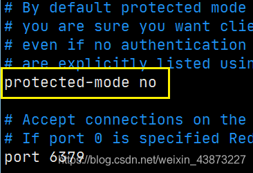

### Jedis

使用Java来操作Redis，Jedis是Redis官方推荐使用的Java连接redis的客户端。

1. 依赖导入:jedis、fastjson

   ```xml
   
   ```

redis.clients jedis 3.2.0 ```

1. 连接数据库

   > 连接远程：
   >
   > 开放端口6379
   >
   > ```shell
   > firewall-cmd --zone=public --add-port=6379/tcp --permanent
   > ```
   >
   > 需要修改配置文件：
   >
   > 1. 修改bind IP，默认是127.0.0.1 也就是localhost,只有本机可用。
   >
   >    修改为0.0.0.0 或者 本机的ip地址。
   >
   > 
   >
   > 1. 关闭保护模式
   >
   >    默认是yes,修改为no
   >
   > 
   >
   > 然后以此配置文件启动redis-server

   TestPing.java

   ```java
   public class TestPing {
       public static void main(String[] args) {
           Jedis jedis = new Jedis("192.168.52.134", 6379);
           String response = jedis.ping();
           System.out.println(response); // PONG
       }
   }
   ```

   **Java中操作Redis就需要 一个Jedis对象**，创建Jedis对象，需要主机号和端口号作为参数。

   其中的API与使用Redis原生的命令是一样的。

事务：

```java
public class TestTransaction {
    public static void main(String[] args) {
        Jedis jedis = new Jedis("localhost", 6379);
        JSONObject jsonObject = new JSONObject();
        jsonObject.put("name", "sakura");
        jsonObject.put("msg", "hello world");
        String info = jsonObject.toJSONString();
        // 开启事务
        Transaction transaction = jedis.multi();
        try {
            transaction.set("user1", info);
            transaction.set("user2", info);
            // 执行事务
            transaction.exec();
        } catch (Exception e) {
            e.printStackTrace();
            // 如果出错则放弃事务
            transaction.discard();
        } finally {
            System.out.println(jedis.get("user1"));
            System.out.println(jedis.get("user2"));
            // 关闭连接
            jedis.close();
        }
    }
}
```

