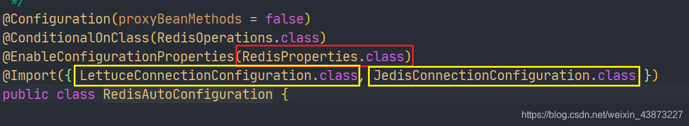
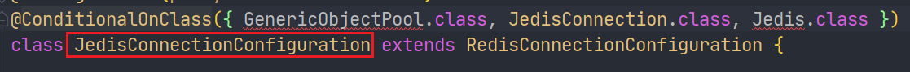
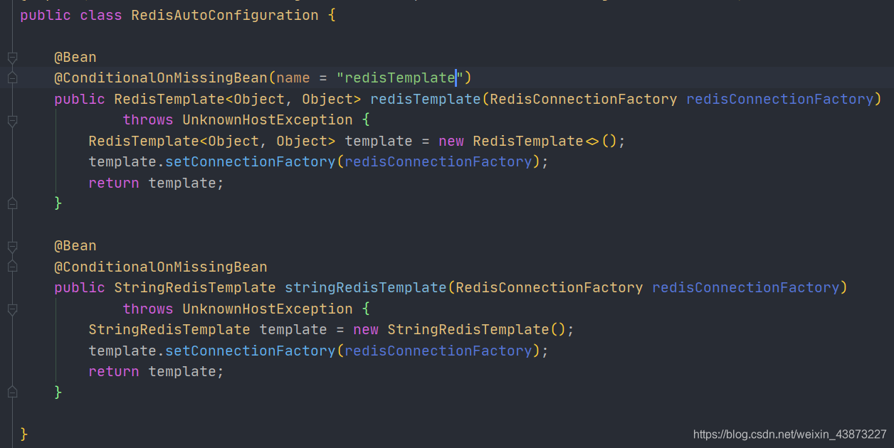
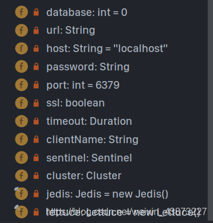
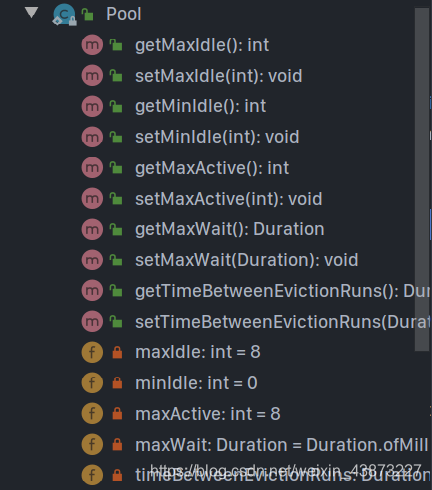
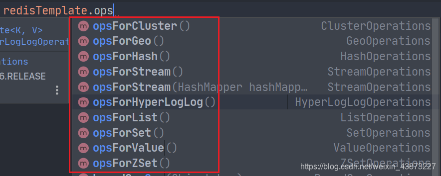
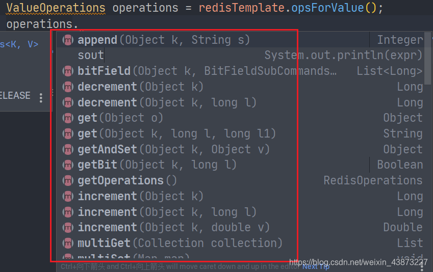
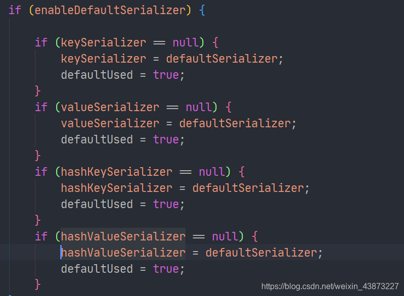
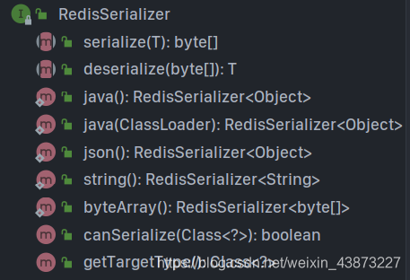
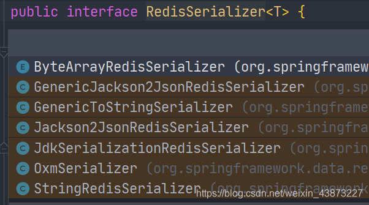

### SpringBoot整合Redis

需要的依赖项,在创建项目时选择，或者手动加入。

```xml
<dependency>
    <groupId>org.springframework.boot</groupId>
    <artifactId>spring-boot-starter-data-redis</artifactId>
</dependency>
```

springboot 2.x后 ，原来使用的 Jedis 被 lettuce 替换。

> Jedis：采用直连，多线程操作不安全。
>
> Lettuce：底层采用Netty


我们在学习SpringBoot自动配置的原理时，整合一个组件并进行配置一定会有一个自动配置类xxxAutoConfiguration,并且在spring.factories中也一定能找到这个类的完全限定名。Redis也不例外。


那么就一定还存在一个RedisProperties类


之前我们说SpringBoot2.x后默认使用Lettuce来替换Jedis，现在我们就能来验证了。

先看Jedis:



@ConditionalOnClass注解中有两个类是默认不存在的，所以Jedis是无法生效的

然后再看Lettuce：


完美生效。

现在我们回到RedisAutoConfiguration



只有两个简单的Bean

- RedisTemplate
- StringRedisTemplate

当看到xxTemplate时可以对比RestTemplat、SqlSessionTemplate,通过使用这些Template来间接操作组件。那么这俩也不会例外。分别用于操作Redis和Redis中的String数据类型。

在RedisTemplate上也有一个条件注解，说明我们是可以对其进行定制化的

说完这些，我们需要知道如何编写配置文件然后连接Redis，就需要阅读RedisProperties


这是一些基本的配置属性。


还有一些连接池相关的配置。注意使用时一定使用Lettuce的连接池。


配置文件:(基本不用写)

```properties
spring.redis.host=127.0.0.1
spring.redis.port=6379
# 以上俩个属性都有默认值 可以省略

# 默认使用 db0
spring.redis.database=0
```

测试使用：

1. 我们说过现在操作Redis需要用到RedisTemplate，所以需要自动注入。

   ```java
   @Autowired
   RedisTemplate redisTemplate;
   ```

2. 使用RedisTemplate



在操作Redis中数据时，需要先通过opsForxxx()方法来获取对应的Operations,然后才可以操作数据。

1. 以ValueOperations（操作String）为例



```java
@Autowired
RedisTemplate redisTemplate;

@Test
void contextLoads() {
   // 获取Redis连接对象
   RedisConnection connection = redisTemplate.getConnectionFactory().getConnection();
   // 清空数据库
   connection.flushDb();
   System.out.println(redisTemplate.keys("*"));

   ValueOperations operations = redisTemplate.opsForValue();
   // set
   operations.set("name", "sakura");
   // get
   System.out.println(operations.get("name"));
   // 事务支持开启
   redisTemplate.setEnableTransactionSupport(true);
   redisTemplate.multi();
   try {
      operations.set("msg", "hello world");
      System.out.println(operations.get("name"));
      // 事务执行
      redisTemplate.exec();
   } catch (Exception e) {
      e.printStackTrace();
      // 放弃事务
      redisTemplate.discard();
   } finally {
      // 关闭连接
      connection.close();
   }
}
```

此时我们回到Redis查看数据时候，惊奇发现全是乱码，可是程序中可以正常输出：


这时候就关系到存储对象的序列化问题，在网络中传输的对象也是一样需要序列化，否者就全是乱码。

我们转到看那个默认的RedisTemplate内部什么样子：


在最开始就能看到几个关于序列化的参数。

默认的序列化器是采用JDK序列化器


而默认的RedisTemplate中的所有序列化器都是使用这个序列化器：



后续我们定制RedisTemplate就可以对其进行修改。

**`RedisSerializer`**提供了很多种序列化方案：

- 我们可以直接调用RedisSerializer的方法来返回序列化器，然后set



- 也可以自己new 相应的实现类，然后set



**定制RedisTemplate的模板：**

我们创建一个Bean加入容器，就会触发RedisTemplate上的条件注解使默认的RedisTemplate失效。

```java
@Configuration
public class RedisConfig {

   @Bean
    public RedisTemplate<String, Object> redisTemplate(RedisConnectionFactory redisConnectionFactory) throws UnknownHostException {
        // 将template 泛型设置为 <String, Object>
        RedisTemplate<String, Object> template = new RedisTemplate();
        // 连接工厂，不必修改
        template.setConnectionFactory(redisConnectionFactory);
        /*
         * 序列化设置
         */
        // key、hash的key 采用 String序列化方式
        template.setKeySerializer(RedisSerializer.string());
        template.setHashKeySerializer(RedisSerializer.string());
        // value、hash的value 采用 Jackson 序列化方式
        template.setValueSerializer(RedisSerializer.json());
        template.setHashValueSerializer(RedisSerializer.json());
        template.afterPropertiesSet();
        
        return template;
    }
}
```

这样一来，只要实体类进行了序列化，我们存什么都不会有乱码的担忧了。


